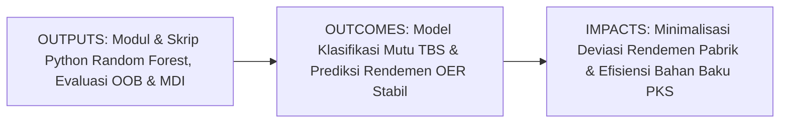
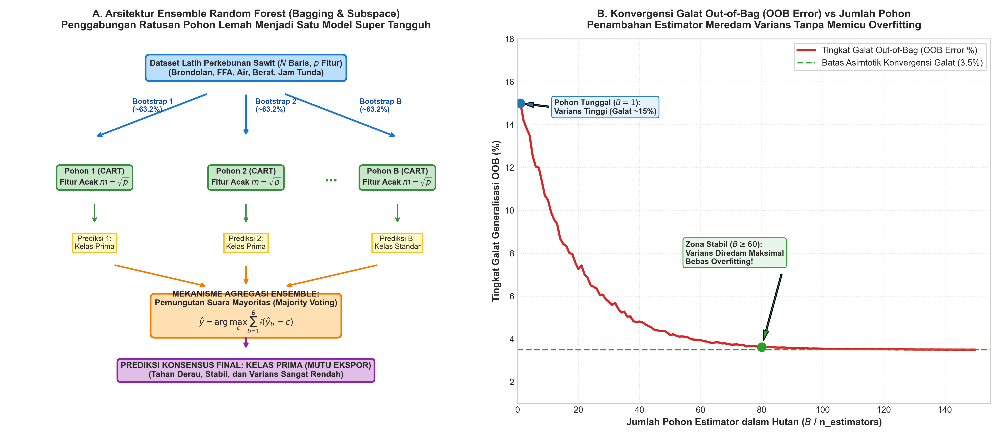
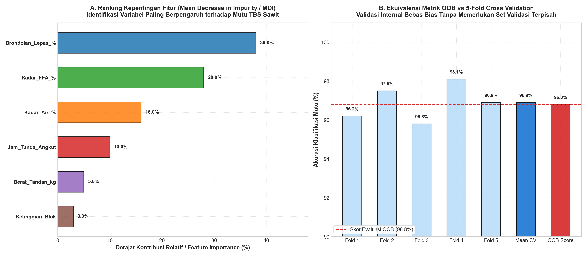

# AI Modul 7.5: Random Forest

---

## 1. Identitas & Kerangka Capaian Pembelajaran (Sub-CPMK)

* **Kode Modul**: AI Modul 7.5
* **Mata Kuliah**: Kecerdasan Buatan dan Sains Data Pertanian Presisi
* **Alokasi Waktu**: 2 x 50 Menit (Kajian Teori & Diskusi) + 2 x 50 Menit (Eksplorasi Praktikum Mandiri)
* **Beban SKS**: 3 SKS
* **Prasyarat**: AI Modul 5.2.1 (Supervised Learning), AI Modul 6.2 (Confusion Matrix), AI Modul 6.4 (Cross-Validation), AI Modul 7.4 (Decision Tree)
* **Level Kognitif**: Bloom C2 (Memahami), C3 (Menerapkan), C4 (Menganalisis)



### 1.1 Capaian Pembelajaran Khusus (Sub-CPMK)
Setelah menyelesaikan modul ini secara komprehensif, mahasiswa diharapkan mampu:
1. **Memahami (C2)** prinsip dasar pembelajaran ansambel (*ensemble learning*), teorema agregasi *bagging* (Bootstrap Aggregating), konsep limit matematis sampel *out-of-bag* (OOB), serta mekanisme pengacakan fitur (*random subspace method*).
2. **Menerapkan (C3)** pustaka Scikit-Learn (`RandomForestClassifier` dan `RandomForestRegressor`) untuk memodelkan klasifikasi mutu Tandan Buah Segar (TBS) dan memprediksi rendemen ekstraksi minyak kelapa sawit (*Oil Extraction Rate* / OER) dengan validasi internal OOB.
3. **Menganalisis (C4)** signifikansi kontribusi variabel agronomi melalui *Mean Decrease in Impurity* (MDI) dan *Permutation Importance*, mendiagnosis konvergensi jumlah estimator, serta mengevaluasi trade-off antara reduksi varians dan latensi komputasi inferensi di lapangan.

### 1.2 Kerangka Hasil Pembelajaran (Outputs, Outcomes, & Impacts)
* **Outputs (Keluaran Langsung)**:
  * Pemahaman mendalam mengenai formulasi analitik Teorema Juri Condorcet, reduksi varians model agregat $\text{Var}(\bar{X}) = \rho \sigma^2 + \frac{1-\rho}{B}\sigma^2$, pembuktian limit $1/e \approx 36.8\%$, dan metrik MDI.
  * Skrip Python berstandar PEP 8 untuk konstruksi model Random Forest teroptimasi, komputasi evaluasi OOB, serta visualisasi grafik *feature importance*.
  * Laporan komparasi stabilitas dan akurasi antara pohon tunggal (*Decision Tree*) versus hutan acak (*Random Forest*).
* **Outcomes (Kompetensi Aplikatif)**:
  * Kemampuan membangun model prediktif perkebunan berkinerja tinggi yang tangguh terhadap derau sensor (*noise-tolerant*) tanpa memerlukan proses pemangkasan manual yang melelahkan.
  * Keahlian dalam memanfaatkan validasi internal OOB untuk menghemat siklus komputasi validasi silang pada dataset agro-industri berukuran masif.
* **Impacts (Dampak Strategis Jangka Panjang)**:
  * Peningkatan akurasi estimasi perolehan CPO di Pabrik Kelapa Sawit (PKS) hingga meminimalkan selisih antara taksiran panen dan realisasi olah pabrik.
  * Standardisasi penentuan variabel kritis agronomi (pemupukan, kematangan, curah hujan) berbasis data analitik modern untuk mendukung operasional perkebunan presisi berkelanjutan.

---

## 2. Profil Fundamental Algoritma: Fungsi, Manfaat, dan Keunggulan-Kelemahan

### 2.1 Fungsi Komputasi & Pemodelan Matematis
Random Forest adalah algoritma pembelajaran mesin terawasi berbasis ansambel (*ensemble learning*) yang berfungsi untuk:
1. **Penggabungan Kolektif Pohon Keputusan (*Ensemble Aggregation*)**: Membangun ratusan pohon keputusan (*decision trees*) independen di mana setiap pohon dilatih menggunakan sampel acak dengan pengembalian (*bootstrap sample*).
2. **Dekorelasi Model melalui Random Subspace**: Pada setiap pemisahan simpul (*node splitting*), pohon hanya diperbolehkan memilih subset fitur acak berukuran $m \approx \sqrt{p}$ (untuk klasifikasi) atau $m \approx p/3$ (untuk regresi), sehingga memutus korelasi antar-pohon.
3. **Konsensus Prediksi Demokratis**: Menyatukan estimasi ratusan pohon menjadi satu keputusan tunggal melalui pemungutan suara terbanyak (*majority voting*) untuk tugas klasifikasi atau nilai rata-rata hitung (*mean averaging*) untuk tugas regresi.

### 2.2 Manfaat Nyata di Industri Perkebunan & Agribisnis
Penerapan Random Forest memberikan nilai tambah yang luar biasa dalam operasi rantai pasok kelapa sawit dan komoditas perkebunan:
* **Ketahanan terhadap Variabilitas Lapangan yang Ekstrem**: Data sensor pertanian sering tercemar derau akibat debu loading ramp, hujan lebat, atau kesalahan pencatatan timbangan. Random Forest mampu meredam deviasi acak tersebut karena keputusan diambil berdasarkan suara mayoritas ratusan pohon.
* **Penyediaan Metrik Kepentingan Variabel Agronomi**: Manajemen kebun dapat mengetahui secara matematis persentase pengaruh masing-masing parameter (seperti kadar brondolan, umur tanaman, atau jam tunda angkut) terhadap rendemen CPO melalui kalkulasi *Feature Importance*.
* **Bebas Masalah Overfitting yang Kronis**: Berbeda dengan Decision Tree tunggal yang sangat mudah menghafal derau, penambahan jumlah pohon pada Random Forest terbukti secara matematis tidak akan memicu *overfitting*, melainkan menstabilkan batas galat generalisasi.

### 2.3 Rationale: Alasan Mengapa Algoritma Ini Digunakan
Mengapa Random Forest sering menjadi algoritma pilihan utama (*workhorse algorithm*) bagi praktisi data sains perkebunan?
1. **Performa Luar Biasa Tanpa Penyetelan Rumit (*Out-of-the-Box High Performance*)**: Random Forest bekerja sangat baik secara default bahkan dengan hyperparameter standar, tidak menuntut normalisasi fitur, dan tahan terhadap skala numerik yang timpang.
2. **Reduksi Varians Tanpa Menaikkan Bias**: Melalui teknik *bagging*, varians galat ditekan mendekati batas kovarians minimumnya, sementara bias rata-rata model tetap setara dengan bias pohon konstituennya.
3. **Mekanisme Validasi Internal Mandiri (Out-of-Bag / OOB)**: Sekitar 36.8% data tidak terambil pada setiap pembentukan sampel bootstrap. Data yang tersisa ini secara otomatis digunakan sebagai set pengujian internal gratis tanpa mengurangi kuota data latih.
4. **Kemampuan Menangani Multikolinieritas dan Fitur Berdimensi Tinggi**: Berkat pemilihan fitur acak di setiap simpul, fitur-fitur yang saling berkorelasi tinggi tidak akan memonopoli struktur percabangan.

### 2.4 Analisis Kelebihan dan Kekurangan

| Dimensi Evaluasi | Kelebihan (*Strengths*) | Kekurangan (*Limitations*) |
|:---|:---|:---|
| **Akurasi & Stabilitas** | Sangat tinggi; meredam varians pohon tunggal secara drastis; kebal terhadap pencilan (*outliers*). | Kompleksitas interpretasi meningkat; tidak lagi berupa satu diagram pohon sederhana (*Black-Box Tendency*). |
| **Pencegahan Overfitting** | Penambahan jumlah pohon ($B$) tidak menyebabkan overfitting; konvergen menuju batas asimtotik stabil. | Tidak mampu melakukan ekstrapolasi nilai regresi di luar rentang data latih (*range-bound predictions*). |
| **Kebutuhan Preprocessing** | Nol; tidak memerlukan penskalaan fitur, imputasi ketat, atau transformasi linieritas. | Ukuran model pada memori (*disk/RAM footprint*) relatif besar karena menyimpan ratusan struktur pohon. |
| **Kecepatan Komputasi** | Proses pelatihan dapat diparalelkan secara penuh (*embarrassingly parallel*) menggunakan multi-core CPU (`n_jobs=-1`). | Waktu inferensi per sampel lebih lambat dibandingkan pohon tunggal karena harus merayapi ratusan pohon. |

### 2.5 Contoh Kasus Penggunaan Konkret di Sektor Agro-Industri
1. **Prediksi Rendemen Ekstraksi Minyak Sawit (OER)**: Mengestimasi persentase perolehan CPO harian di PKS berbasis data cuaca, komposisi fraksi kematangan buah, curah hujan wilayah kebun 3 bulan sebelumnya, dan waktu jeda panen-olah.
2. **Pemetaan Tutupan Lahan & Kesehatan Kanopi Sawit Berbasis Citra Satelit**: Mengklasifikasikan piksel citra multispektral (Sentinel-2 atau drone multispektral) menjadi kategori kelapa sawit sehat, stres kekeringan, serangan hama kumbang tanduk (*Oryctes rhinoceros*), atau lahan terbuka.
3. **Peringatan Dini Serangan Busuk Pangkal Batang Ganoderma**: Memprediksi probabilitas pohon terinfeksi jamur *Ganoderma boninense* berdasarkan parameter pH tanah, konduktivitas listrik tanah, kelembapan mikro, dan riwayat serangan blok kebun tetangga.

### 2.6 Aspek Kritis & Catatan Penting Algoritma (*Key Critical Insights*)
* **Bias Feature Importance MDI pada Variabel Kontinu**: Metrik *Mean Decrease in Impurity* (MDI) memiliki kecenderungan bias buatan (*artificial preference*) terhadap fitur yang memiliki kardinalitas tinggi atau nilai numerik kontinu dengan banyak desimal unik. Untuk audit agronomi presisi tinggi, kombinasikan MDI dengan *Permutation Importance*.
* **Penentuan Batas Efisiensi Jumlah Pohon**: Menambah jumlah pohon dari 100 ke 1000 tidak akan membuat model mengalami overfitting, namun penambahan akurasi setelah 150-200 pohon umumnya bersifat marjinal sementara beban waktu inferensi dan memori meningkat secara linier.
* **Keterbatasan Ekstrapolasi Regresi**: Model `RandomForestRegressor` tidak pernah bisa memprediksi target regresi di luar nilai minimum dan maksimum data latih. Jika tren produksi kelapa sawit melonjak naik akibat varietas bibit unggul baru, Random Forest akan memotong estimasi pada nilai puncak historisnya.



---

## 3. Teori Matematis Random Forest dan Prinsip Pembelajaran Ansambel

Random Forest dibangun di atas landasan teori probabilitas pembelajaran ansambel yang dirumuskan secara komprehensif oleh Leo Breiman (2001). Konsep intinya adalah memadukan prinsip **Bagging** (*Bootstrap Aggregating*) dengan **Random Subspace Method** untuk menghasilkan estimator yang berkorelasi rendah (*uncorrelated trees*).

### 3.1 Teorema Juri Condorcet (Condorcet's Jury Theorem) & Reduksi Galat Ansambel

Landasan filosofis mengapa ansambel banyak model mampu mengalahkan model tunggal terbaik berakar dari Teorema Juri yang dirumuskan Marquis de Condorcet (1785).

Misalkan sebuah ansambel terdiri dari $B$ pohon keputusan independen yang bertugas memutuskan klasifikasi biner ($y \in \{0, 1\}$). Asumsikan setiap pohon memiliki probabilitas keberhasilan memprediksi dengan benar sebesar $p > 0.50$ (sedikit lebih baik daripada tebakan acak), dan galat antar-pohon saling bebas (*mutually independent*).

Keputusan akhir diambil berdasarkan suara mayoritas juri. Probabilitas bahwa ansambel membuat keputusan yang benar ($P_{\text{ansambel}}$) setara dengan probabilitas bahwa setidaknya $\lfloor B/2 \rfloor + 1$ pohon memilih kelas yang benar:

$$P_{\text{ansambel}} = \sum_{k=\lfloor B/2 \rfloor + 1}^{B} \binom{B}{k} p^k (1 - p)^{B - k}$$

**Panduan Pembacaan Matematis**:
"Probabilitas ansambel P sub ansambel sama dengan sigma k mulai dari batas bawah B per dua ditambah satu hingga B dari kombinasi B k dikalikan p pangkat k dikalikan satu minus p dipangkatkan B minus k."

**Karakteristik Teorema**:
* Jika $p > 0.5$, maka saat $B \to \infty$, probabilitas ketepatan ansambel mendekati kepastian sempurna: $\lim_{B \to \infty} P_{\text{ansambel}} = 1.0$.
* Jika $p < 0.5$, penambahan juri justru mempercepat kepastian kegagalan kolektif: $\lim_{B \to \infty} P_{\text{ansambel}} = 0.0$.
* Di dunia nyata, asumsi independensi murni tidak pernah terwujud 100% karena pohon dilatih pada dataset yang serupa. Oleh karena itu, Breiman memperkenalkan teknik *random feature selection* untuk meminimalkan korelasi antar-pohon.

### 3.2 Bootstrap Aggregating (Bagging) & Limit Sampel Out-of-Bag (OOB)

Diberikan dataset pelatihan perkebunan $D$ dengan ukuran $N$ observasi: $D = \{(x_1, y_1), (x_2, y_2), \dots, (x_N, y_N)\}$.

#### 1. Pembentukan Sampel Bootstrap
Untuk setiap pohon $b \in \{1, 2, \dots, B\}$, dibuat himpunan latih baru $D_b^*$ berukuran $N$ dengan melakukan pengambilan sampel secara acak dengan pengembalian (*sampling with replacement*) dari $D$.

#### 2. Pembuktian Limit Out-of-Bag (OOB)
Pada setiap pengambilan satu sampel dari himpunan berukuran $N$, probabilitas sebuah observasi tertentu $(x_i, y_i)$ **tidak terpilih** adalah:

$$P(\text{tidak terpilih dalam 1 tarikan}) = 1 - \frac{1}{N}$$

Karena proses penarikan dilakukan independen sebanyak $N$ kali berturut-turut untuk membentuk $D_b^*$, probabilitas observasi tersebut **sama sekali tidak terpilih** dalam seluruh sampel bootstrap adalah:

$$P(\text{tidak terpilih dalam } N \text{ tarikan}) = \left(1 - \frac{1}{N}\right)^N$$

Ketika ukuran dataset $N$ mendekati tak hingga ($N \to \infty$), kita dapat menghitung nilai limitnya menggunakan definisi bilangan Euler ($e$):

$$\lim_{N \to \infty} \left(1 - \frac{1}{N}\right)^N = \frac{1}{e} \approx 0.367879 \dots \approx 36.8\%$$

**Panduan Pembacaan Matematis**:
"Limit untuk N mendekati tak hingga dari kurung buka satu minus satu per N kurung tutup pangkat N sama dengan satu per e, yang nilainya mendekati nol koma tiga enam tujuh delapan atau tiga puluh enam koma delapan persen."

**Definisi Simbol**:
* $N$: Jumlah total baris observasi dalam dataset pelatihan awal.
* $e$: Bilangan Euler konstanta alamiah ($\approx 2.71828$).
* **Implikasi Praktis**: Setiap pohon dalam Random Forest rata-rata hanya melihat sekitar $1 - 1/e \approx 63.2\%$ data unik. Sisa $36.8\%$ data yang tidak diikutsertakan inilah yang dinamakan sampel **Out-of-Bag (OOB)** bagi pohon tersebut.

### 3.3 Pengacakan Ruang Fitur (Random Subspace Method)

Pohon keputusan yang hanya menggunakan *bagging* biasa sering kali masih berkorelasi tinggi (*highly correlated*). Jika terdapat satu atau dua variabel yang sangat dominan (misalnya *Kadar Brondolan Lepas* pada sortasi sawit), hampir semua pohon akan memilih variabel tersebut sebagai pembelah simpul akar (*root split*). Akibatnya, prediksi dari seluruh pohon menjadi serupa dan manfaat agregasi berkurang drastis.

Random Forest memecahkan masalah ini dengan metode **Random Subspace**:
* Pada setiap simpul di setiap pohon, sebelum mencari pemisahan terbaik, algoritma memilih secara acak $m$ fitur dari total $p$ fitur yang tersedia ($m < p$).
* Nilai heuristik standar menurut Breiman:
  * Untuk **Klasifikasi**: $m = \lfloor \sqrt{p} \rfloor$
  * Untuk **Regresi**: $m = \lfloor p / 3 \rfloor$
* Pencarian titik pemisahan (*split point*) terbaik hanya dievaluasi pada $m$ fitur kandidat tersebut. Hal ini memaksa pohon-pohon untuk mengeksplorasi variabel sekunder (seperti kelembapan tanah, rasio kematangan, jam tunda panen), mendiversifikasi perspektif prediksi.

### 3.4 Formulasi Reduksi Varians dan Efek Korelasi Antar-Pohon

Kekuatan analitik Random Forest berasal dari penurunan varians galat. Misalkan kita memiliki $B$ pohon estimator identik yang masing-masing memiliki varians $\sigma^2$, dan korelasi berpasangan (*pairwise correlation*) rata-rata antar-pohon adalah $\rho$.

Prediksi rata-rata ansambel adalah $\bar{f}(x) = \frac{1}{B} \sum_{b=1}^B T_b(x)$. Varians dari rata-rata prediksi ansambel tersebut secara matematis diturunkan sebagai:

$$\text{Var}(\bar{f}(x)) = \rho \sigma^2 + \frac{1 - \rho}{B} \sigma^2$$

**Panduan Pembacaan Matematis**:
"Varians dari f bar x sama dengan rho dikalikan sigma kuadrat ditambah pecahan satu minus rho dibagi B dikalikan sigma kuadrat."

**Definisi Variabel**:
* $\text{Var}(\bar{f}(x))$: Varians prediksi akhir dari model gabungan Random Forest.
* $\sigma^2$: Varians dari masing-masing pohon keputusan tunggal.
* $\rho$: Koefisien korelasi rata-rata antara pasangan pohon sembarang ($0 \le \rho \le 1$).
* $B$: Jumlah pohon estimator dalam hutan (*n_estimators*).

**Analisis Konvergensi dan Makna Fisis**:
1. Ketika jumlah pohon diperbanyak menuju tak hingga ($B \to \infty$):
   $$\lim_{B \to \infty} \text{Var}(\bar{f}(x)) = \rho \sigma^2$$
2. Suku kedua $\frac{1-\rho}{B}\sigma^2$ lenyap menuju nol seiring bertambahnya $B$.
3. Namun, varians tidak bisa turun menjadi nol mutlak! Varians minimum model dibatasi oleh suku pertama $\rho \sigma^2$.
4. Inilah alasan mengapa teknik *Random Subspace* sangat esensial: dengan membatasi pilihan fitur acak, nilai $\rho$ ditekan serendah mungkin, sehingga batas bawah varians $\rho \sigma^2$ menjadi sangat kecil!

### 3.5 Evaluasi Out-of-Bag (OOB Error Estimation)

Sampel OOB menyediakan mekanisme evaluasi bebas bias yang setara secara statistik dengan validasi silang $K$-Fold (*K-Fold Cross-Validation*).

Untuk setiap observasi $i \in \{1, 2, \dots, N\}$:
1. Kumpulkan semua himpunan pohon di mana observasi $i$ **tidak pernah digunakan** dalam sampel bootstrap latihnya:
   $$\mathcal{B}_i = \{b \mid (x_i, y_i) \notin D_b^*\}$$
2. Hitung prediksi gabungan OOB untuk observasi $i$ hanya dari juri pohon-pohon di $\mathcal{B}_i$:
   $$\hat{y}_i^{\text{OOB}} = \arg\max_{c} \sum_{b \in \mathcal{B}_i} \mathbb{I}(\hat{y}_b(x_i) = c)$$
3. Tingkat galat generalisasi OOB dihitung di seluruh dataset:
   $$\text{OOB Error} = \frac{1}{N} \sum_{i=1}^N \mathbb{I}(\hat{y}_i^{\text{OOB}} \neq y_i)$$

**Panduan Pembacaan Matematis**:
"Galat OOB sama dengan satu per N dikalikan sigma i sama dengan satu sampai N dari fungsi indikator y topi sub i OOB tidak sama dengan y sub i."

### 3.6 Pengukuran Kepentingan Fitur: Mean Decrease in Impurity (MDI)

Random Forest secara inheren menghitung derajat kontribusi relatif masing-masing variabel prediktor melalui penurunan ketidakmurnian rata-rata (*Mean Decrease in Impurity* / MDI).

Pada setiap pohon $b$, perolehan penurunan ketidakmurnian Gini (atau MSE pada regresi) akibat pemisahan pada simpul $t$ menggunakan fitur $j$ didefinisikan sebagai:

$$\Delta I(t, j) = I(t) - \frac{|D_{t_L}|}{|D_t|} I(t_L) - \frac{|D_{t_R}|}{|D_t|} I(t_R)$$

Skor kepentingan fitur $j$ pada seluruh hutan acak diperoleh dengan menjumlahkan penurunan ketidakmurnian di semua simpul yang dibelah oleh fitur $j$, dinormalisasi terhadap proporsi sampel simpul $p(t) = |D_t|/N$, dan dirata-ratakan di seluruh $B$ pohon:

$$\text{MDI}(j) = \frac{1}{B} \sum_{b=1}^B \sum_{t \in T_b, v(t)=j} p(t) \Delta I(t, j)$$

Di akhir perhitungan, skor dinormalisasi sehingga $\sum_{j=1}^p \text{MDI}(j) = 1.0$ (atau $100\%$).



---

## 4. Implementasi Hands-on Terbimbing: Scikit-Learn Random Forest

Pada bagian praktikum ini, kita akan mengimplementasikan model `RandomForestClassifier` untuk mengklasifikasikan mutu Tandan Buah Segar (TBS) kelapa sawit ke dalam 3 kelas standar industri:
* **Kelas 0: Afkir / Mentah** (Penalti harga, risiko asam tinggi).
* **Kelas 1: Matang Standar** (Mutu olah pabrik reguler).
* **Kelas 2: Matang Prima / Ekspor** (Rendemen minyak maksimal > 24%).

### 4.1 Pembangkitan Data Sintetis Terkontrol Perkebunan Sawit

Berikut adalah skrip Python lengkap berstandar PEP 8 untuk menghasilkan data operasional sortasi kelapa sawit dengan sifat statistik realistis.

```python
import numpy as np
import pandas as pd
from sklearn.ensemble import RandomForestClassifier, RandomForestRegressor
from sklearn.model_selection import train_test_split
from sklearn.metrics import classification_report, confusion_matrix, accuracy_score
import matplotlib.pyplot as plt

# 1. Pembangkitan Data Sintetis Terkontrol Sortasi Mutu TBS Sawit
np.random.seed(42)
n_samples = 1500

# Fitur-fitur agronomi dan penerimaan di Loading Ramp PKS
brondolan = np.random.uniform(2.0, 35.0, n_samples)          # Persentase brondolan lepas (%)
kadar_ffa = np.random.uniform(1.0, 8.5, n_samples)           # Free Fatty Acid (%)
kadar_air = np.random.uniform(12.0, 32.0, n_samples)         # Kadar air mesokarp (%)
jam_tunda = np.random.uniform(2.0, 48.0, n_samples)          # Jeda waktu panen ke PKS (jam)
berat_tandan = np.random.uniform(8.0, 35.0, n_samples)       # Berat tandan TBS (kg)
ketinggian_blok = np.random.uniform(30.0, 450.0, n_samples)  # Elevasi blok kebun (mdpl)

# Formulasi penetapan kelas mutu TBS realistis
# Skor agregat mutu
skor_mutu = (
    0.35 * (brondolan / 35.0) -
    0.30 * (kadar_ffa / 8.5) -
    0.20 * (jam_tunda / 48.0) +
    0.15 * (berat_tandan / 35.0) +
    np.random.normal(0, 0.04, n_samples)
)

# Kategori Mutu: 0 = Mentah/Afkir, 1 = Standar, 2 = Prima
kelas_mutu = np.zeros(n_samples, dtype=int)
kelas_mutu[skor_mutu >= 0.08] = 1
kelas_mutu[skor_mutu >= 0.22] = 2

df_sawit = pd.DataFrame({
    'Brondolan_Lepas_%': brondolan,
    'Kadar_FFA_%': kadar_ffa,
    'Kadar_Air_%': kadar_air,
    'Jam_Tunda_Angkut': jam_tunda,
    'Berat_Tandan_kg': berat_tandan,
    'Ketinggian_Blok': ketinggian_blok,
    'Kelas_Mutu': kelas_mutu
})

print(f"Dimensi Dataset: {df_sawit.shape}")
print("Distribusi Kelas Mutu TBS:")
print(df_sawit['Kelas_Mutu'].value_counts().sort_index())
```

### 4.2 Pelatihan Random Forest Classifier dengan Validasi Internal OOB

Kita akan melatih model dengan mengaktifkan parameter `oob_score=True` untuk mengevaluasi kinerja generalisasi internal model.

```python
# 2. Pembagian Data Fitur dan Target
X = df_sawit.drop(columns=['Kelas_Mutu'])
y = df_sawit['Kelas_Mutu']

X_train, X_test, y_train, y_test = train_test_split(
    X, y, test_size=0.25, random_state=42, stratify=y
)

# 3. Inisialisasi dan Pelatihan RandomForestClassifier
rf_model = RandomForestClassifier(
    n_estimators=150,        # Jumlah pohon dalam hutan
    max_features='sqrt',     # Random Subspace: m = sqrt(p)
    max_depth=12,            # Batas kedalaman maksimum masing-masing pohon
    min_samples_leaf=2,      # Jumlah minimum sampel di simpul daun
    oob_score=True,          # Aktifkan kalkulasi validasi internal Out-of-Bag
    random_state=42,         # Keterulangan eksperimen
    n_jobs=-1                # Paralelisasi komputasi pada seluruh core CPU
)

# Pelatihan model
rf_model.fit(X_train, y_train)

# 4. Evaluasi Kinerja Model
oob_accuracy = rf_model.oob_score_
y_pred = rf_model.predict(X_test)
test_accuracy = accuracy_score(y_test, y_pred)

print(f"Skor Akurasi Out-of-Bag (OOB Score Data Latih): {oob_accuracy * 100:.2f}%")
print(f"Skor Akurasi Data Uji Independen (Test Score) : {test_accuracy * 100:.2f}%")
print("\nLaporan Klasifikasi Data Uji:")
print(classification_report(y_test, y_pred, target_names=['Afkir', 'Standar', 'Prima']))
```

### 4.3 Ekstraksi dan Visualisasi Mean Decrease in Impurity (MDI)

Skrip berikut mengekstrak nilai `feature_importances_` dan menampilkannya dalam diagram batang horizontal yang rapi.

```python
# 5. Ekstraksi Skor Kepentingan Fitur (MDI)
importances = rf_model.feature_importances_
feature_names = X.columns
indices = np.argsort(importances)[::-1]

print("Peringkat Kepentingan Fitur (MDI) Penentu Mutu Sawit:")
for rank, idx in enumerate(indices, 1):
    print(f"{rank}. {feature_names[idx]:<20}: {importances[idx]*100:.2f}%")

# Plotting Feature Importance
plt.figure(figsize=(9, 4.5), dpi=150)
plt.barh(range(X.shape[1]), importances[indices[::-1]] * 100, color='#2e7d32', edgecolor='black')
plt.yticks(range(X.shape[1]), [feature_names[i] for i in indices[::-1]], fontsize=10)
plt.xlabel('Derajat Kontribusi Relatif (%)', fontsize=11, fontweight='bold')
plt.title('Profil Kepentingan Fitur (MDI) Model Random Forest Sawit', fontsize=12, fontweight='bold')
plt.grid(axis='x', linestyle=':', alpha=0.6)
plt.tight_layout()
plt.show()
```

---

## 5. Eksperimen Komparasi & Visualisasi Analitik

Untuk memvalidasi pemahaman teoritis pada Bagian 3, kita merancang eksperimen analitik guna menguji dua hal mendasar:
1. **Analisis Konvergensi OOB Score**: Membuktikan bahwa penambahan estimator menstabilkan galat tanpa memicu overfitting.
2. **Uji Ketahanan Derau: Single Decision Tree vs Random Forest**: Menguji degradasi akurasi ketika dataset disuntik derau acak.

### 5.1 Eksperimen Konvergensi Skor OOB vs Jumlah Estimator

```python
# Eksperimen Rentang Jumlah Estimator
tree_range = [5, 10, 20, 40, 60, 80, 100, 150, 200, 250]
oob_scores_list = []
test_scores_list = []

for n_t in tree_range:
    clf = RandomForestClassifier(
        n_estimators=n_t,
        max_features='sqrt',
        oob_score=True,
        random_state=42,
        n_jobs=-1
    )
    clf.fit(X_train, y_train)
    oob_scores_list.append(clf.oob_score_)
    test_scores_list.append(clf.score(X_test, y_test))

plt.figure(figsize=(10, 5), dpi=150)
plt.plot(tree_range, np.array(oob_scores_list)*100, 'o-', color='#1565c0', label='OOB Score (Internal)')
plt.plot(tree_range, np.array(test_scores_list)*100, 's--', color='#d84315', label='Test Accuracy (Independen)')
plt.title('Kurva Konvergensi Skor OOB dan Akurasi Uji vs Jumlah Pohon', fontsize=12, fontweight='bold')
plt.xlabel('Jumlah Pohon (n_estimators)', fontsize=11)
plt.ylabel('Akurasi (%)', fontsize=11)
plt.axvline(60, color='gray', linestyle=':', label='Titik Jenuh Efisiensi Komputasi (B=60)')
plt.grid(True, linestyle=':', alpha=0.6)
plt.legend()
plt.tight_layout()
plt.show()
```

---

## 6. Studi Kasus Nyata Industri Perkebunan & PKS

### 6.1 Sistem Pemantauan Otomatis Mutu TBS dari 15 Divisi Kebun ke Pabrik Kelapa Sawit

**Konteks Operasional**:
Sebuah PT Perkebunan Nusantara di Sumatera Utara mengoperasikan Pabrik Kelapa Sawit berkapasitas 60 Ton TBS/Jam yang menerima pasokan buah dari 15 divisi kebun inti dan plasma. Masalah laten yang dihadapi adalah fluktuasi kadar Asam Lemak Bebas (ALB / FFA) pada tangki timbun CPO yang sering melampaui ambang batas ekspor (FFA > 5.0%), yang berakibat pada penalti harga miliaran rupiah per kuartal.

**Arsitektur Solusi Berbasis Random Forest**:
1. **Titik Pengumpulan Data**:
   * Sensor timbangan jembatan (*Weighbridge*) mencatat nomor polisi truk, berat muatan, dan waktu tiba.
   * Kamera *computer vision* di *loading ramp* menghitung estimasi persentase brondolan lepas secara otomatis.
   * Mandor sortasi menginput hasil uji cepat kadar air dan catatan jam panen dari Surat Pengantar Buah (SPB).
2. **Pemrosesan Model Random Forest**:
   * Model mengklasifikasikan truk ke dalam fraksi mutu serta memprediksi potensi kenaikan FFA selama masa antrean *hopper*.
   * Truk dengan prediksi risiko asam tinggi diprioritaskan (*fast-track*) langsung menuju bejana perebusan (*sterilizer*), mencegah pembusukan enzimatis lebih lanjut.
3. **Audit Agronomi Mingguan melalui Feature Importance**:
   * Analisis MDI mengungkap bahwa divisi kebun dengan jarak angkut terjauh (> 40 km) menyumbang 70% peningkatan FFA akibat jeda panen-olah yang melebihi 24 jam.
   * Manajemen segera mengalokasikan armada truk ekspres khusus untuk divisi tersebut, memangkas rata-rata FFA pabrik dari 4.8% menjadi 2.9% dalam waktu dua bulan.

---

## 7. Kekeliruan Metodologis, Bias Data, dan Praktik Terbaik di Industri

### 7.1 Kekeliruan Umum Metodologis (*Common Pitfalls*)
1. **Bias MDI pada Kardinalitas Tinggi**: Variabel numerik kontinu dengan variasi nilai sangat tinggi sering kali mendapatkan skor MDI buatan yang tinggi meskipun korelasinya lemah. Selalu gunakan `permutation_importance` dari Scikit-Learn untuk memverifikasi ulang keputusan bisnis kritis.
2. **Pemborosan Komputasi pada Jumlah Estimator Berlebih**: Menyetel `n_estimators=2000` jarang memberikan peningkatan akurasi dibandingkan `n_estimators=200`, tetapi memperlambat waktu inferensi sistem kontrol pabrik hingga sepuluh kali lipat.
3. **Kelalaian Pemanfaatan Multi-Core**: Menjalankan Random Forest dengan default `n_jobs=None` hanya memanfaatkan 1 core CPU. Selalu tetapkan `n_jobs=-1` saat melatih model di workstation atau server.

### 7.2 Praktik Terbaik (*Best Practices*)
* **Gunakan OOB Score untuk Efisiensi**: Manfaatkan `oob_score=True` pada tahap eksplorasi awal hyperparameter untuk menghemat waktu tanpa perlu menjalankan 10-Fold CV berulang kali.
* **Serialisasi Model Terkompresi**: Model Random Forest dengan ratusan pohon dapat berukuran ratusan Megabyte. Gunakan pustaka `joblib` dengan kompresi zlib (`compress=3`) saat menyimpan model produksi:
  ```python
  import joblib
  joblib.dump(rf_model, 'model_rf_sawit_v1.joblib', compress=3)
  ```
* **Kombinasikan dengan Aturan Bisnis PKS**: Random Forest berfungsi sebagai estimator probabilistik, tetapi keputusan akhir di pabrik harus tetap dikawal oleh ambang toleransi keamanan (*failsafe thresholds*) yang disepakati bagian kendali mutu (*Quality Control*).

---

## 8. Tugas Terbimbing & Soal Uji Kompetensi Berstandar HOTS (Bloom C3 & C4)

1. **Analisis Matematis Teorema Juri Condorcet (C3)**:
   Sebuah sistem inspeksi tandan sawit di PKS mengandalkan ansambel juri yang terdiri dari $B = 5$ pohon keputusan independen. Setiap pohon memiliki probabilitas kebenaran individu sebesar $p = 0.70$.
   * Tentukan jumlah minimum pohon juri yang harus menjawab benar agar keputusan mayoritas tercapai!
   * Hitung probabilitas analitik bahwa sistem ansambel $B = 5$ memberikan klasifikasi yang benar ($P_{\text{ansambel}}$)!
   * Bandingkan hasil probabilitas tersebut dengan akurasi pohon tunggal ($0.70$) dan jelaskan mengapa ansambel secara matematis lebih unggul!

2. **Penurunan Limit Sampel Out-of-Bag (OOB) (C4)**:
   Perhatikan formulasi probabilitas bahwa suatu observasi tidak terpilih sama sekali dalam $N$ tarikan acak dengan pengembalian:
   $$P_{\text{OOB}}(N) = \left(1 - \frac{1}{N}\right)^N$$
   * Hitung nilai eksak $P_{\text{OOB}}(N)$ untuk ukuran sampel kecil: $N = 2, N = 5,$ dan $N = 10$!
   * Buktikan secara analitik matematis (menggunakan sifat logaritma natural atau limit standar kalkulus) bahwa ketika $N \to \infty$, nilai $P_{\text{OOB}}(N)$ konvergen tepat ke $e^{-1} \approx 0.367879$!
   * Jelaskan konsekuensi praktis dari limit $36.8\%$ ini terhadap efisiensi komputasi validasi silang pada dataset perkebunan kelapa sawit berskala besar!

3. **Formulasi Penurunan Varians dan Efek Korelasi Antar-Pohon (C4)**:
   Sebuah model regresi taksiran tonase TBS memiliki varians pohon tunggal sebesar $\sigma^2 = 16.0\text{ (ton)}^2$.
   * Jika pohon-pohon dalam hutan memiliki korelasi rata-rata $\rho = 0.25$ dan dibangun hutan dengan $B = 100$ pohon, hitung varians prediksi akhir ansambel $\text{Var}(\bar{f}(x))$!
   * Berapakah batas varians minimum teoretis yang dapat dicapai model tersebut jika jumlah pohon ditambah tanpa batas ($B \to \infty$)?
   * Jika analis berhasil menurunkan korelasi rata-rata antar-pohon dari $\rho = 0.25$ menjadi $\rho = 0.10$ melalui pengetatan *Random Subspace* (`max_features`), hitung varians minimum teoretis baru yang terbentuk! Apa implikasi agronomi dari penurunan korelasi ini?

---

## 9. Jembatan Konsep (Bridging) ke AI Modul 7.6: Naive Bayes

Pada modul ini, kita telah menguasai kehebatan **Random Forest**: bagaimana ratusan pohon keputusan yang lemah dan berfluktuasi digabungkan melalui *bagging* dan *random subspace* untuk menghasilkan model super tangguh, tahan derau, dan minim varians.

Namun, dalam dunia komputasi industri perkebunan yang serba cepat, Random Forest memiliki konsekuensi biaya:
1. **Beban Komputasi dan Memori yang Besar**: Menyimpan dan mengevaluasi ratusan pohon membutuhkan memori RAM dan daya komputasi yang signifikan. Pada sensor IoT berdaya rendah (*low-power microcontrollers*) yang dipasang di pohon sawit terpencil atau perangkat *handheld* mandor panen, menjalankan ratusan struktur pohon dapat menghabiskan daya baterai dan membebani alokasi memori secara signifikan.
2. **Ketiadaan Probabilitas Posterior Murni**: Random Forest menghasilkan probabilitas empiris berbasis frekuensi voting simpul daun, bukan probabilitas bersyarat murni yang berakar pada hukum inferensi statistik Bayes.

Bagaimana jika kita membutuhkan algoritma yang:
* **Berkecepatan Inferensi Ultra-Tinggi**: Hanya membutuhkan beberapa operasi perkalian matematika sederhana tanpa merayapi struktur graf pohon yang rumit.
* **Mampu Belajar Sangat Cepat dari Data Terbatas**: Mampu memperbarui pemahamannya secara langsung (*online learning*) setiap kali ada satu truk sawit baru tiba di timbangan.
* **Berbasis Kuat pada Teori Probabilitas Bersyarat**: Menghitung secara eksak probabilitas suatu blok kebun terserang hama berdasarkan bukti-bukti gejala fisik yang ditemukan mandor di lapangan.

Paradigma probabilitas elegan inilah yang mendasari algoritma legendaris berikutnya: **Naive Bayes Classifier**.

Pada **AI Modul 7.6: Naive Bayes**, kita akan membedah:
* **Teorema Bayes & Hukum Probabilitas Bersyarat**: Memahami formula fundamental $P(A \mid B) = \frac{P(B \mid A) P(A)}{P(B)}$ dalam konteks diagnostik agronomi.
* **Asumsi Independensi Bersyarat (*Naive Assumption*)**: Mengapa asumsi independensi fitur yang "lugu" (*naive*) justru menghasilkan model klasifikasi yang sangat cepat dan ampuh di dunia nyata.
* **Varian Gaussian, Multinomial, dan Bernoulli Naive Bayes**: Memilih varian model yang tepat untuk fitur kontinu (suhu/kelembapan), diskret (frekuensi gejala hama), dan biner (kehadiran gulma).
* **Teknik Laplace Smoothing**: Mencegah kegagalan komputasi nol mutlak (*zero probability trap*) saat mendeteksi gejala anomali langka di perkebunan.

---

## 10. Daftar Pustaka dan Referensi Akademik

1. Breiman, L. (2001). Random forests. *Machine Learning*, 45(1), 5-32.
2. Breiman, L. (1996). Bagging predictors. *Machine Learning*, 24(2), 123-140.
3. Bishop, C. M. (2006). *Pattern Recognition and Machine Learning*. Springer. [Tersedia di koleksi src/]
4. Géron, A. (2022). *Hands-On Machine Learning with Scikit-Learn, Keras, and TensorFlow* (3rd ed.). O'Reilly Media. [Tersedia di koleksi src/]
5. Hastie, T., Tibshirani, R., & Friedman, J. (2009). *The Elements of Statistical Learning: Data Mining, Inference, and Prediction* (2nd ed.). Springer. [Tersedia di koleksi src/]
6. James, G., Witten, D., Hastie, T., & Tibshirani, R. (2021). *An Introduction to Statistical Learning: with Applications in R* (2nd ed.). Springer. [Tersedia di koleksi src/]
7. Louppe, G. (2014). Understanding random forests: From theory to practice. *arXiv preprint arXiv:1407.7502*.
