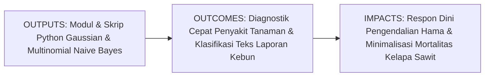
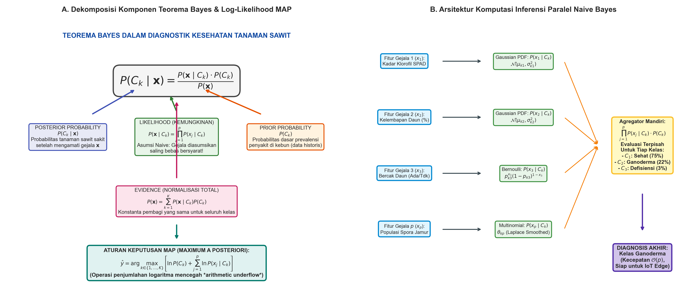
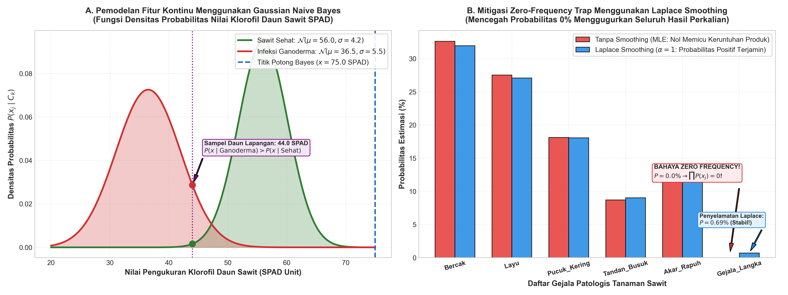

# AI Modul 7.6: Naive Bayes

---

## 1. Identitas & Kerangka Capaian Pembelajaran (Sub-CPMK)

* **Kode Modul**: AI Modul 7.6
* **Mata Kuliah**: Kecerdasan Buatan dan Sains Data Pertanian Presisi
* **Alokasi Waktu**: 2 x 50 Menit (Kajian Teori & Diskusi) + 2 x 50 Menit (Eksplorasi Praktikum Mandiri)
* **Beban SKS**: 3 SKS
* **Prasyarat**: AI Modul 2.5 (Operator Logika), AI Modul 5.2.1 (Supervised Learning), AI Modul 6.2 (Confusion Matrix), AI Modul 7.2 (Logistic Regression)
* **Level Kognitif**: Bloom C2 (Memahami), C3 (Menerapkan), C4 (Menganalisis)



### 1.1 Capaian Pembelajaran Khusus (Sub-CPMK)
Setelah menyelesaikan modul ini secara komprehensif, mahasiswa diharapkan mampu:
1. **Memahami (C2)** prinsip probabilitas bersyarat Teorema Bayes, asumsi independensi bersyarat antar-fitur (*naive assumption*), formulasi aturan keputusan *Maximum A Posteriori* (MAP), serta varian distribusi Gaussian, Multinomial, dan Bernoulli.
2. **Menerapkan (C3)** model `GaussianNB` dan `MultinomialNB` menggunakan pustaka Scikit-Learn untuk mendiagnosis serangan patogen busuk pangkal batang (*Ganoderma boninense*) dan mengklasifikasikan laporan teks anomali kebun dari mandor lapangan.
3. **Menganalisis (C4)** dampak pelanggaran asumsi independensi pada data bersensor multikolinier, mengevaluasi efektivitas *Laplace Smoothing* dalam memitigasi anomali frekuensi nol (*zero-frequency issue*), serta membandingkan kecepatan inferensi Naive Bayes terhadap model berbasis ansambel.

### 1.2 Kerangka Hasil Pembelajaran (Outputs, Outcomes, & Impacts)
* **Outputs (Keluaran Langsung)**:
  * Penguasaan analitik dekomposisi probabilitas Prior, Likelihood, Evidence, dan Posterior, fungsi densitas Gaussian $\mathcal{N}(\mu, \sigma^2)$, serta formulasi perataan Laplace $\alpha$.
  * Skrip Python berstandar PEP 8 untuk konstruksi *pipeline* klasifikasi probabilitas cepat, penanganan nilai kontinu, dan eksekusi inferensi berdaya rendah.
  * Laporan komparasi akurasi diagnostik penyakit tanaman berbasis fitur numerik laboratorium dan gejala visual kategorikal.
* **Outcomes (Kompetensi Aplikatif)**:
  * Keahlian merancang sistem kecerdasan buatan ringan (*Lightweight AI*) yang sanggup berjalan di mikrokontroler sensor IoT tepi (*Edge IoT*) atau aplikasi telepon pintar mandor di pedalaman kebun tanpa sinyal internet.
  * Kemampuan memperbarui model secara dinamis (*incremental learning*) seiring mengalirnya data sensus pohon harian.
* **Impacts (Dampak Strategis Jangka Panjang)**:
  * Penekanan laju penularan penyakit jamur sistemik di perkebunan melalui deteksi dini pada stadium asimtomatik (*early detection*).
  * Penghematan biaya operasional pestisida kimiawi dan perlindungan aset biologis tegakan kelapa sawit bernilai ratusan miliar rupiah.

---

## 2. Profil Fundamental Algoritma: Fungsi, Manfaat, dan Keunggulan-Kelemahan

### 2.1 Fungsi Komputasi & Pemodelan Matematis
Naive Bayes adalah algoritma pembelajaran mesin terawasi berbasis teori probabilitas yang berfungsi untuk:
1. **Inferensi Probabilitas Terbalik (*Inverse Probability Inference*)**: Mengestimasi probabilitas hipotesis diagnosis penyakit $C_k$ berdasarkan serangkaian bukti gejala teramati $\mathbf{x} = (x_1, x_2, \dots, x_p)$ menggunakan hukum Teorema Bayes.
2. **Faktorisasi Bersyarat Mandiri (*Conditional Independence Factorization*)**: Menyederhanakan perkalian probabilitas bersama $P(x_1, \dots, x_p \mid C_k)$ yang rumit menjadi perkalian satu dimensi $\prod_{j=1}^p P(x_j \mid C_k)$ yang dapat dihitung secara instan.
3. **Optimasi Keputusan MAP (*Maximum A Posteriori*)**: Memilih kelas target yang memaksimalkan fungsi log-likelihood gabungan dengan kompleksitas waktu pelatihan linier $\mathcal{O}(N \cdot p)$.

### 2.2 Manfaat Nyata di Industri Perkebunan & Agribisnis
Penerapan Naive Bayes memberikan keunggulan komparatif yang sangat unik di lapangan:
* **Operasional Mandiri di Perangkat Bergerak Mandor (*Offline Mobile AI*)**: Model Naive Bayes hanya membutuhkan penyimpanan vektor nilai rata-rata ($\mu$), varians ($\sigma^2$), dan frekuensi prior. Ukuran berkas model sangat kecil (< 50 KB), memungkinkan aplikasi android sensus mandor berjalan secepat kilat di tengah afdeling terpencil tanpa koneksi jaringan.
* **Diagnostik Probabilistik yang Terukur**: Alih-alih memberikan label kaku tanpa konteks, Naive Bayes menyajikan nilai probabilitas bersyarat riil (misalnya *"Peluang Ganoderma = 88.4%, Defisiensi Hara = 11.2%"*), memberikan panduan terukur bagi asisten kebun untuk memutuskan tindakan karantina atau pemupukan tambahan.
* **Ketahanan Tinggi terhadap Fitur yang Tidak Relevan (*Robustness to Noise*)**: Fitur-fitur acak yang tidak berkaitan dengan penyakit akan menghasilkan likelihood yang seragam di semua kelas, sehingga teredam secara alamiah saat seluruh probabilitas dikalikan.

### 2.3 Rationale: Alasan Mengapa Algoritma Ini Digunakan
Mengapa Naive Bayes tetap menjadi pilar pembelajaran mesin yang tak tergantikan di era model berparameter masif?
1. **Kecepatan Inferensi dan Pelatihan Ekstrem**: Kompleksitas inferensinya hanya $\mathcal{O}(p)$ operasi perkalian dasar. Model dapat mengklasifikasikan ribuan pembacaan sensor tanah per detik secara *real-time*.
2. **Efektivitas Tinggi pada Dataset Kecil (*Sample Efficiency*)**: Berbeda dengan Neural Network atau SVM yang memerlukan ribuan sampel untuk menstabilkan parameter, Naive Bayes mampu mengestimasi parameter mean dan varians secara akurat hanya dari puluhan sampel observasi.
3. **Mendukung Pembelajaran Aliran Data (*Streaming / Online Learning*)**: Model dapat diperbarui secara instan melalui metode `partial_fit()` tanpa perlu melatih ulang seluruh dataset historis dari awal.
4. **Kinerja Luar Biasa pada Data Tekstual**: Sangat unggul dalam memproses data berbasis teks seperti catatan harian mandor, keluhan petani mitra, dan tiket gangguan mesin pabrik.

### 2.4 Analisis Kelebihan dan Kekurangan

| Dimensi Evaluasi | Kelebihan (*Strengths*) | Kekurangan (*Limitations*) |
|:---|:---|:---|
| **Kecepatan Komputasi** | Sangat cepat; pelatihan dan inferensi bersifat linier terhadap jumlah fitur dan sampel. | Asumsi independensi bersyarat hampir selalu dilanggar pada data riil (*naive assumption violation*). |
| **Kebutuhan Data** | Sangat hemat data latih; bekerja baik pada sampel terbatas dan data berdimensi tinggi. | Rentan terhadap *Zero-Frequency Problem* jika suatu kategori nilai belum pernah muncul di data latih. |
| **Estimasi Probabilitas** | Memberikan skor posterior langsung; sangat mudah diintegrasikan dengan matriks risiko biaya. | Nilai output probabilitas posterior cenderung terlalu ekstrem (terlalu dekat ke 0 atau 1) akibat perkalian banyak fitur. |
| **Kemudahan Pemeliharaan** | Parameter model mudah dipahami ($\mu, \sigma^2, \text{prior}$); mendukung pembaruan inkremental online. | Tidak mampu menangkap hubungan interaksi kompleks non-linier antar-fitur (misalnya interaksi suhu $\times$ kelembapan). |

### 2.5 Contoh Kasus Penggunaan Konkret di Sektor Agro-Industri
1. **Deteksi Cepat Penyakit Busuk Pangkal Batang (*Ganoderma boninense*)**: Mengklasifikasikan status pohon (Sehat, Gejala Awal, Terinfeksi Berat) berdasarkan nilai SPAD klorofil daun pelepah ke-17, konduktivitas tanah, pH zona perakaran, dan kelembapan tajuk.
2. **Sortasi Otomatis Tiket Gangguan Alat Berat Kebun**: Mengklasifikasikan laporan teks bebas dari supir truk dan operator traktor (misal *"hidrolik bocor di afdeling 3"*) ke dalam kategori penanganan mekanik, kelistrikan, atau penggantian ban.
3. **Penyaringan Anomali Data Stasiun Cuaca Otomatis (AWS)**: Memvalidasi integritas pembacaan sensor cuaca mikro perkebunan guna menyaring *glitch* data akibat kotoran burung atau kelembapan embun pada probe sensor.

### 2.6 Aspek Kritis & Catatan Penting Algoritma (*Key Critical Insights*)
* **Bahaya Galat Frekuensi Nol (*Zero-Frequency Issue*)**: Jika suatu kombinasi nilai fitur dan kelas tidak pernah muncul pada data latih, maka nilai likelihood-nya adalah nol mutlak ($P(x_j \mid C_k) = 0$). Karena seluruh fitur dikalikan, satu nilai nol akan meruntuhkan seluruh probabilitas kelas menjadi nol, mengabaikan bukti kuat dari puluhan fitur lainnya. Selalu terapkan **Laplace Smoothing** ($\alpha = 1.0$) untuk menjamin stabilitas probabilitas.
* **Komputasi Log-Space untuk Mencegah Underflow**: Mengalikan puluhan angka desimal kecil ($0.05 \times 0.02 \times \dots$) pada komputer akan memicu *floating-point arithmetic underflow* (angka terpotong menjadi 0.0). Ubah selalu operasi perkalian menjadi penjumlahan logaritma: $\ln \prod P = \sum \ln P$.
* **Paradoks Keberhasilan Naive Bayes**: Meskipun asumsi independensi fitur hampir tidak pernah terpenuhi di dunia nyata, klasifikasi Naive Bayes sering kali tetap sangat akurat! Hal ini terjadi karena aturan keputusan hanya bergantung pada peringkat probabilitas kelas tertinggi (*argmax*), bukan ketepatan kalibrasi angka probabilitas absolutnya.



---

## 3. Teori Matematis Naive Bayes

Naive Bayes memanfaatkan kerangka inferensi statistik Thomas Bayes (1763) yang menghubungkan probabilitas suatu kondisi sebelum dan sesudah data observasi diperoleh.

### 3.1 Landasan Teorema Bayes Fundamental

Misalkan $C_k$ merepresentasikan hipotesis bahwa tanaman tergolong ke dalam kelas patologi ke-$k$ ($k \in \{1, 2, \dots, K\}$), dan $\mathbf{x} = (x_1, x_2, \dots, x_p)$ adalah vektor fitur gejala yang diamati.

Berdasarkan definisi probabilitas bersyarat, probabilitas bersama $P(C_k, \mathbf{x})$ dapat dituliskan dalam dua cara:

$$P(C_k, \mathbf{x}) = P(C_k \mid \mathbf{x}) P(\mathbf{x}) = P(\mathbf{x} \mid C_k) P(C_k)$$

Dengan membagi kedua ruas dengan $P(\mathbf{x})$, diperoleh **Formula Teorema Bayes**:

$$P(C_k \mid \mathbf{x}) = \frac{P(\mathbf{x} \mid C_k) P(C_k)}{P(\mathbf{x})}$$

**Panduan Pembacaan Matematis**:
"Probabilitas posterior C sub k bersyarat x sama dengan probabilitas likelihood x bersyarat C sub k dikalikan probabilitas prior C sub k, dibagi dengan probabilitas evidence x."

**Dekomposisi Empat Komponen Utama**:
1. **Posterior ($P(C_k \mid \mathbf{x})$)**: Probabilitas bahwa tanaman benar terinfeksi penyakit $C_k$ setelah mengamati bukti gejala $\mathbf{x}$.
2. **Likelihood ($P(\mathbf{x} \mid C_k)$)**: Probabilitas munculnya kumpulan gejala $\mathbf{x}$ jika tanaman memang berada pada kelas $C_k$.
3. **Prior ($P(C_k)$)**: Probabilitas awal keberadaan penyakit $C_k$ di perkebunan sebelum gejala diperiksa (berdasarkan catatan prevalensi historis sensus kebun):
   $$P(C_k) = \frac{N_k}{N}$$
4. **Evidence ($P(\mathbf{x})$)**: Probabilitas marginal munculnya gejala $\mathbf{x}$ di seluruh populasi, berfungsi sebagai faktor penormal (*normalizing constant*):
   $$P(\mathbf{x}) = \sum_{j=1}^K P(\mathbf{x} \mid C_j) P(C_j)$$

### 3.2 Asumsi Independensi Bersyarat (The Naive Assumption)

Menghitung likelihood gabungan $P(x_1, x_2, \dots, x_p \mid C_k)$ secara eksak menuntut estimasi distribusi probabilitas bersama berdimensi $p$. Jika setiap fitur memiliki 5 kategori, kita membutuhkan $5^p$ kombinasi parameter, yang mustahil dipenuhi oleh dataset lapangan.

Algoritma Naive Bayes membuat asumsi penyederhanaan yang sangat radikal: **Seluruh fitur diasumsikan saling bebas bersyarat satu sama lain (*mutually conditionally independent*) dengan diketahuinya kelas $C_k$**:

$$P(\mathbf{x} \mid C_k) = P(x_1, x_2, \dots, x_p \mid C_k) = \prod_{j=1}^p P(x_j \mid C_k)$$

**Panduan Pembacaan Matematis**:
"Probabilitas likelihood vektor x bersyarat C sub k sama dengan hasil kali kapital pi mulai dari j sama dengan satu hingga p dari probabilitas x sub j bersyarat C sub k."

Dengan substitusi asumsi ini ke Teorema Bayes, diperoleh persamaan dasar Naive Bayes:

$$P(C_k \mid \mathbf{x}) = \frac{P(C_k) \prod_{j=1}^p P(x_j \mid C_k)}{P(\mathbf{x})}$$

Karena penyebut $P(\mathbf{x})$ bernilai konstan dan identik untuk setiap kelas kandidat $C_k$, hubungan proporsionalitasnya adalah:

$$P(C_k \mid \mathbf{x}) \propto P(C_k) \prod_{j=1}^p P(x_j \mid C_k)$$

### 3.3 Aturan Keputusan Maximum A Posteriori (MAP) & Log-Likelihood

Klasifikasi akhir dilakukan dengan memilih kelas $C_k$ yang menghasilkan nilai probabilitas posterior terbesar (*Maximum A Posteriori*):

$$\hat{y} = \arg\max_{k \in \{1, \dots, K\}} P(C_k) \prod_{j=1}^p P(x_j \mid C_k)$$

Dalam implementasi komputasi digital, perkalian berantai puluhan probabilitas kecil akan memicu *floating-point underflow*. Oleh karena itu, fungsi objektif selalu diubah ke dalam domain logaritma natural ($\ln$):

$$\hat{y} = \arg\max_{k \in \{1, \dots, K\}} \left[ \ln P(C_k) + \sum_{j=1}^p \ln P(x_j \mid C_k) \right]$$

**Panduan Pembacaan Matematis**:
"y topi sama dengan argmax untuk k elemen satu sampai K dari kurung siku logaritma natural prior P C sub k ditambah sigma j sama dengan satu sampai p dari logaritma natural likelihood P x sub j bersyarat C sub k."

Keuntungan formulasi logaritma:
* Mengubah operasi perkalian yang sensitif menjadi operasi penjumlahan yang stabil secara numerik.
* Mempertahankan lokasi titik maksimum karena fungsi logaritma bersifat monotonik naik teratur.

### 3.4 Varian Model: Gaussian Naive Bayes untuk Data Kontinu

Data sensor perkebunan (seperti nilai SPAD klorofil daun, suhu kanopi, atau pH tanah) bersifat numerik kontinu. **Gaussian Naive Bayes** memodelkan likelihood setiap fitur kontinu menggunakan Fungsi Densitas Probabilitas Gauss (*Gaussian Probability Density Function*):

$$P(x_j \mid C_k) = \frac{1}{\sqrt{2\pi \sigma_{kj}^2}} \exp\left( -\frac{(x_j - \mu_{kj})^2}{2\sigma_{kj}^2} \right)$$

**Panduan Pembacaan Matematis**:
"Probabilitas x sub j bersyarat C sub k sama dengan satu dibagi kurung buka akar dua pi sigma kuadrat sub kj kurung tutup, dikalikan eksponensial dari minus kurung buka x sub j minus mu sub kj kurung tutup kuadrat dibagi dua sigma kuadrat sub kj."

**Definisi Parameter**:
* $\mu_{kj}$: Rata-rata (*mean*) sampel fitur $j$ yang tergolong dalam kelas $C_k$:
  $$\mu_{kj} = \frac{1}{N_k} \sum_{i \in C_k} x_{ij}$$
* $\sigma_{kj}^2$: Varians sampel fitur $j$ yang tergolong dalam kelas $C_k$:
  $$\sigma_{kj}^2 = \frac{1}{N_k} \sum_{i \in C_k} (x_{ij} - \mu_{kj})^2 + \epsilon$$
  *(Konstanta kecil $\epsilon \approx 10^{-9}$ ditambahkan untuk mencegah pembagian dengan nol).*

### 3.5 Varian Model: Multinomial & Bernoulli Naive Bayes

Untuk data diskret dan kategorikal:
1. **Bernoulli Naive Bayes**: Digunakan untuk fitur biner ($x_j \in \{0, 1\}$), misalnya ada atau tidaknya gejala tertentu (*"Pelepah Patah: Ada (1) / Tidak (0)"*):
   $$P(\mathbf{x} \mid C_k) = \prod_{j=1}^p p_{kj}^{x_j} (1 - p_{kj})^{1 - x_j}$$
2. **Multinomial Naive Bayes**: Digunakan untuk data frekuensi kemunculan (seperti jumlah spora jamur pada bilik hitung hemasitometer atau frekuensi kata dalam laporan teks kebun):
   $$P(\mathbf{x} \mid C_k) \propto \prod_{j=1}^p p_{kj}^{x_j}$$

### 3.6 Penanganan Masalah Frekuensi Nol (*Zero-Frequency Trap*) via Laplace Smoothing

Jika pada data latih suatu gejala $k$ tidak pernah tercatat pada kelas $C_k$, maka estimasi *Maximum Likelihood* menghasilkan $P(x_j = k \mid C_k) = 0$. Akibatnya:

$$\prod_{j=1}^p P(x_j \mid C_k) = P(x_1 \mid C_k) \times \dots \times 0 \times \dots \times P(x_p \mid C_k) = 0$$

Hal ini memicu anomali komputasi (*zero probability breakdown*) karena satu fitur langka langsung membatalkan seluruh probabilitas kelas, meskipun sembilan gejala lainnya sangat cocok!

Solusinya adalah menerapkan **Koreksi Laplace (*Laplace Smoothing*)** dengan menambahkan parameter perataan semu $\alpha > 0$ (standar industri $\alpha = 1$):

$$\hat{P}_{\text{Laplace}}(x_j = k \mid C_k) = \frac{N_{ck} + \alpha}{N_c + \alpha K}$$

**Panduan Pembacaan Matematis**:
"P topi Laplace dari x sub j sama dengan k bersyarat C sub k sama dengan N sub ck ditambah alfa, dibagi N sub c ditambah alfa dikalikan K."

**Definisi Variabel**:
* $N_{ck}$: Jumlah kemunculan nilai fitur $k$ pada kelas $C_k$ di data latih.
* $N_c$: Total jumlah observasi yang tergolong ke dalam kelas $C_k$.
* $\alpha$: Parameter penghalusan (*smoothing parameter*). Jika $\alpha = 1$, disebut *Laplace smoothing*; jika $0 < \alpha < 1$, disebut *Lidstone smoothing*.
* $K$: Jumlah nilai diskret berbeda yang dapat dimiliki oleh fitur tersebut.



---

## 4. Implementasi Hands-on Terbimbing: Scikit-Learn Naive Bayes

Pada bagian praktikum ini, kita akan membangun sistem klasifikasi diagnostik pohon sawit menggunakan `GaussianNB` untuk fitur numerik sensor dan `MultinomialNB` untuk teks deskripsi laporan sensus mandor.

Target diagnostik patologi kelapa sawit:
* **Kelas 0: Sehat / Normal**
* **Kelas 1: Defisiensi Unsur Hara (Kekurangan N/K/Mg)**
* **Kelas 2: Infeksi Jamur Ganoderma Boninense (Stadium Lanjut)**

### 4.1 Pembangkitan Data Sintetis Sensor Kesehatan Tanaman Sawit

```python
import numpy as np
import pandas as pd
from sklearn.naive_bayes import GaussianNB, MultinomialNB
from sklearn.model_selection import train_test_split
from sklearn.metrics import classification_report, confusion_matrix, accuracy_score
import matplotlib.pyplot as plt

# 1. Pembangkitan Data Sintetis Sensor Lapangan
np.random.seed(42)
n_samples = 1200

# Distribusi Kelas: 70% Sehat, 20% Defisiensi, 10% Ganoderma
y_sim = np.random.choice([0, 1, 2], size=n_samples, p=[0.70, 0.20, 0.10])

# Pembangkitan Fitur Kontinu berdasarkan Karakteristik Biologis
klorofil_spad = np.zeros(n_samples)
kelembapan_tajuk = np.zeros(n_samples)
ph_tanah = np.zeros(n_samples)
konduktivitas_ec = np.zeros(n_samples)

for i in range(n_samples):
    if y_sim[i] == 0:    # Sehat
        klorofil_spad[i] = np.random.normal(55.0, 4.0)
        kelembapan_tajuk[i] = np.random.normal(78.0, 5.0)
        ph_tanah[i] = np.random.normal(5.5, 0.4)
        konduktivitas_ec[i] = np.random.normal(1.2, 0.2)
    elif y_sim[i] == 1:  # Defisiensi Hara
        klorofil_spad[i] = np.random.normal(42.0, 5.0)
        kelembapan_tajuk[i] = np.random.normal(72.0, 6.0)
        ph_tanah[i] = np.random.normal(4.8, 0.5)
        konduktivitas_ec[i] = np.random.normal(0.7, 0.2)
    else:                # Terinfeksi Ganoderma
        klorofil_spad[i] = np.random.normal(34.0, 6.0)
        kelembapan_tajuk[i] = np.random.normal(60.0, 8.0)
        ph_tanah[i] = np.random.normal(4.2, 0.4)
        konduktivitas_ec[i] = np.random.normal(2.1, 0.4)

df_patologi = pd.DataFrame({
    'Klorofil_SPAD': klorofil_spad,
    'Kelembapan_Tajuk_%': kelembapan_tajuk,
    'pH_Tanah': ph_tanah,
    'Konduktivitas_EC': konduktivitas_ec,
    'Status_Kesehatan': y_sim
})

print(f"Dimensi Dataset: {df_patologi.shape}")
print("Distribusi Sampel Kesehatan Sawit:")
print(df_patologi['Status_Kesehatan'].value_counts(normalize=True).sort_index() * 100)
```

### 4.2 Pelatihan Gaussian Naive Bayes & Estimasi Probabilitas Posterior

```python
# 2. Pembagian Dataset Latih dan Uji
X = df_patologi.drop(columns=['Status_Kesehatan'])
y = df_patologi['Status_Kesehatan']

X_train, X_test, y_train, y_test = train_test_split(
    X, y, test_size=0.25, random_state=42, stratify=y
)

# 3. Pelatihan Model Gaussian Naive Bayes
gnb_model = GaussianNB()
gnb_model.fit(X_train, y_train)

# Parameter yang Dipelajari Model
print("=== PARAMETER MODEL GAUSSIAN NAIVE BAYES ===")
print(f"Probabilitas Prior Kelas P(Ck): {gnb_model.class_prior_}")
print("\nNilai Rata-rata Fitur per Kelas (Mu):")
print(pd.DataFrame(gnb_model.theta_, index=['Sehat', 'Defisiensi', 'Ganoderma'], columns=X.columns))

# 4. Evaluasi Kinerja pada Data Uji
y_pred = gnb_model.predict(X_test)
y_prob = gnb_model.predict_proba(X_test)
akurasi = accuracy_score(y_test, y_pred)

print(f"\nAkurasi Klasifikasi Data Uji: {akurasi * 100:.2f}%")
print("\nLaporan Klasifikasi Diagnostik Sawit:")
print(classification_report(y_test, y_pred, target_names=['Sehat', 'Defisiensi', 'Ganoderma']))
```

### 4.3 Inspeksi Keputusan Diagnostik untuk Kasus Lapangan Baru

```python
# 5. Simulasi Diagnostik Pohon Tersangka di Blok Kebun Afdeling IV
pohon_baru = pd.DataFrame([
    {'Klorofil_SPAD': 35.2, 'Kelembapan_Tajuk_%': 62.0, 'pH_Tanah': 4.1, 'Konduktivitas_EC': 2.05},
    {'Klorofil_SPAD': 53.8, 'Kelembapan_Tajuk_%': 77.5, 'pH_Tanah': 5.6, 'Konduktivitas_EC': 1.15}
])

prediksi_label = gnb_model.predict(pohon_baru)
prediksi_prob = gnb_model.predict_proba(pohon_baru)
nama_kelas = ['Sehat', 'Defisiensi Hara', 'Ganoderma']

for i in range(len(pohon_baru)):
    print(f"\n--- Analisis Diagnostik Sampel Pohon {i+1} ---")
    print(f"Diagnosis Akhir: {nama_kelas[prediksi_label[i]]}")
    for k in range(3):
        print(f"  P({nama_kelas[k]} | x): {prediksi_prob[i][k]*100:.2f}%")
```

---

## 5. Eksperimen Komparasi & Visualisasi Analitik

### 5.1 Eksperimen Degradasi Kinerja Akibat Multikolinieritas Ekstrem

Salah satu karakteristik penting yang wajib diuji adalah kerentanan Naive Bayes saat asumsi independensi dilanggar dengan menyuntikkan fitur yang identik (*duplikat multikolinier*).

```python
# Eksperimen Efek Pelanggaran Asumsi Independensi
accuracies = []
n_duplicate_features = [0, 2, 5, 10, 20, 50]

for n_dup in n_duplicate_features:
    X_train_dup = X_train.copy()
    X_test_dup = X_test.copy()
    
    # Suntikkan fitur duplikat yang identik dengan Klorofil_SPAD
    for d in range(n_dup):
        noise = np.random.normal(0, 0.01, size=len(X_train))
        X_train_dup[f'Klorofil_Dup_{d}'] = X_train['Klorofil_SPAD'] + noise
        X_test_dup[f'Klorofil_Dup_{d}'] = X_test['Klorofil_SPAD'] + np.random.normal(0, 0.01, size=len(X_test))
        
    model_dup = GaussianNB()
    model_dup.fit(X_train_dup, y_train)
    accuracies.append(model_dup.score(X_test_dup, y_test))

plt.figure(figsize=(9, 4.5), dpi=150)
plt.plot(n_duplicate_features, np.array(accuracies)*100, 'o-', color='#c62828', linewidth=2)
plt.title('Dampak Pelanggaran Asumsi Independensi pada Naive Bayes', fontweight='bold')
plt.xlabel('Jumlah Fitur Duplikat Multikolinier yang Ditambahkan')
plt.ylabel('Akurasi Data Uji (%)')
plt.grid(True, linestyle=':', alpha=0.6)
plt.tight_layout()
plt.show()
```

---

## 6. Studi Kasus Nyata Industri Perkebunan & PKS

### 6.1 Sistem Peringatan Dini Sensus Serangan Ganoderma Berbasis IoT Edge

**Konteks Lapangan**:
Penyakit Busuk Pangkal Batang (*Basal Stem Rot*) yang disebabkan oleh jamur *Ganoderma boninense* merupakan ancaman paling mematikan bagi perkebunan kelapa sawit di Asia Tenggara, berpotensi memusnahkan hingga 50% populasi pohon produktif pada siklus tanam kedua dan ketiga. Biaya pengobatan pohon yang sudah roboh adalah sia-sia; kunci penyelamatan kebun terletak pada **tindakan sanitasi dini (*early mounding*) saat pohon masih bergejala ringan**.

**Penerapan Arsitektur Naive Bayes**:
1. **Perangkat Sensus Mandor (*Edge Device*)**:
   Mandor lapangan dibekali gawai genggam (*handheld reader*) yang terhubung ke sensor tusuk tanah klorofil optik portabel. Karena kawasan afdeling tidak memiliki sinyal seluler (*blank spot*), model Naive Bayes ditanamkan langsung pada prosesor lokal ponsel mandor.
2. **Kalkulasi Probabilitas Seketika**:
   Setiap kali sensor membaca data, Gaussian Naive Bayes menghitung probabilitas infeksi dalam waktu kurang dari 2 milidetik.
3. **Penyaringan Laporan Teks Sensus**:
   Multinomial Naive Bayes menganalisis catatan visual mandor (misalnya kata *"daun pupus tidak membuka"*, *"akar rapuh"*, *"tumbuh miselium putih"*).
4. **Dampak Operasional**:
   Pohon terinfeksi dapat dipetakan secara akurat pada peta GIS afdeling kebun pada hari yang sama. Kecepatan karantina pohon meningkat 400%, menekan penyebaran spora ke blok tetangga dan menyelamatkan potensi kerugian produksi senilai miliaran rupiah per tahun.

---

## 7. Kekeliruan Metodologis, Bias Data, dan Praktik Terbaik di Industri

### 7.1 Kekeliruan Umum Metodologis (*Common Pitfalls*)
1. **Asumsi Distribusi Normal yang Keliru pada GaussianNB**: Memaksakan penggunaan `GaussianNB` pada fitur yang distribusinya sangat condong (*skewed*) atau bimodal (misalnya populasi ulat api yang eksponensial). Selalu periksa histogram data; jika tidak normal, lakukan transformasi logaritmik atau diskretisasi menjadi kategori diskret.
2. **Lupa Menyetel Laplace Smoothing pada Data Teks**: Menggunakan `MultinomialNB(alpha=0.0)` pada sistem klasifikasi laporan keluhan kebun akan menyebabkan model sering menghasilkan probabilitas nol saat menemukan kosakata baru yang belum tercantum di kamus latih.
3. **Mempercayai Probabilitas Absolut Tanpa Kalibrasi**: Naive Bayes adalah pengklasifikasi yang sangat baik untuk menentukan urutan kelas (*ranking/decision*), namun nilai probabilitas posterior numeriknya cenderung terpolarisasi secara ekstrem (misal $0.9999$ atau $0.0001$) akibat pelanggaran korelasi fitur. Gunakan *Isotonic Regression* atau *Platt Scaling* jika nilai probabilitas absolut diperlukan untuk perhitungan premi asuransi kebun.

### 7.2 Praktik Terbaik (*Best Practices*)
* **Pembersihan Fitur Multikolinier**: Hapus fitur yang redundan sebelum melatih model Naive Bayes (misal jangan memasukkan *Suhu Celcius* dan *Suhu Fahrenheit* secara bersamaan karena akan melipatgandakan bobot likelihood fitur tersebut secara tidak proporsional).
* **Gunakan Prior Empiris Kebun**: Secara default Scikit-Learn menghitung prior dari proporsi data latih. Jika data latih dibuat seimbang (*balanced*) padahal di lapangan penyakit sebenarnya langka ($1\%$), setel argumen `class_prior=[0.99, 0.01]` agar model tidak memicu alarm palsu (*false positive*) massal.

---

## 8. Tugas Terbimbing & Soal Uji Kompetensi Berstandar HOTS (Bloom C3 & C4)

1. **Perhitungan Manual Teorema Bayes Fundamental (C3)**:
   Di sebuah perkebunan sawit seluas 5.000 hektar, prevalensi historis serangan jamur Ganoderma adalah $P(\text{Sakit}) = 0.05$ (sehingga $P(\text{Sehat}) = 0.95$).
   Sebuah alat uji sensor cepat daun memiliki akurasi karakteristik:
   * Sensitivitas (Kemampuan mendeteksi pohon sakit / *True Positive Rate*): $P(\text{Positif} \mid \text{Sakit}) = 0.90$.
   * Spesifisitas (Kemampuan mendeteksi pohon sehat / *True Negative Rate*): $P(\text{Negatif} \mid \text{Sehat}) = 0.85$, yang berarti tingkat alarm palsu (*False Positive Rate*) adalah $P(\text{Positif} \mid \text{Sehat}) = 1 - 0.85 = 0.15$.
   
   Pertanyaan:
   * Hitung probabilitas total pembacaan sensor menghasilkan nilai Positif ($P(\text{Positif})$)!
   * Jika mandor kebun menguji sebatang pohon sawit dan sensor menunjukkan hasil **Positif**, hitung probabilitas sebenarnya pohon tersebut terinfeksi Ganoderma ($P(\text{Sakit} \mid \text{Positif})$)!
   * Jelaskan mengapa nilai probabilitas posterior tersebut tampak jauh lebih rendah dari sensitivitas alat ($90\%$)! Apa implikasi praktisnya terhadap prosedur tindak lanjut di perkebunan?

2. **Komputasi Manual Gaussian Naive Bayes (C3)**:
   Sebuah sistem klasifikasi kesehatan bibit sawit menguji parameter *Tinggi Bibit* ($x_1$, cm). Data historis laboratorium menunjukkan parameter distribusi normal:
   * **Kelas Bibit Unggul ($C_1$)**: Prior $P(C_1) = 0.60$, Rata-rata $\mu_1 = 45.0\text{ cm}$, Simpangan Baku $\sigma_1 = 3.0\text{ cm}$.
   * **Kelas Bibit Afkir ($C_2$)**: Prior $P(C_2) = 0.40$, Rata-rata $\mu_2 = 32.0\text{ cm}$, Simpangan Baku $\sigma_2 = 4.0\text{ cm}$.
   
   Sebuah bibit baru yang tiba dari pembibitan memiliki tinggi $x_1 = 40.0\text{ cm}$.
   * Hitung nilai densitas probabilitas Gauss $P(x_1 = 40 \mid C_1)$ dan $P(x_1 = 40 \mid C_2)$!
   * Hitung nilai posterior numerator $P(x_1 \mid C_k) \cdot P(C_k)$ untuk kedua kelas!
   * Tentukan klasifikasi bibit tersebut berdasarkan kriteria MAP (*Maximum A Posteriori*)!

3. **Analisis Matematis Zero-Frequency Trap & Laplace Smoothing (C4)**:
   Sebuah sistem klasifikasi teks keluhan afdeling menganalisis kata-kata dalam laporan mandor untuk mendeteksi kategori **Darurat Hama ($C_1$)** versus **Operasional Rutin ($C_2$)**.
   Data latih menunjukkan:
   * Total kata dalam korpus $C_1$: $N_1 = 500$ kata.
   * Total kata dalam korpus $C_2$: $N_2 = 800$ kata.
   * Total ukuran kosakata unik (*vocabulary size*): $K = 200$ kata berbeda.
   * Kata *"ulat"* muncul 30 kali di $C_1$ dan 2 kali di $C_2$.
   * Kata langka *"kutu_kebul"* muncul 0 kali di $C_1$ dan 4 kali di $C_2$.
   
   Pertanyaan:
   * Hitung nilai likelihood kata *"kutu_kebul"* pada kelas $C_1$ tanpa smoothing ($P_{\text{MLE}}$) dan buktikan secara matematis mengapa kemunculan kata ini dalam laporan baru akan langsung menggugurkan hipotesis $C_1$!
   * Hitung nilai probabilitas terhaluskan menggunakan *Laplace Smoothing* ($\alpha = 1.0$) untuk kata *"ulat"* dan *"kutu_kebul"* pada kedua kelas!
   * Analisis bagaimana nilai $\alpha$ memengaruhi derajat pemerataan probabilitas dan berikan rekomendasi penyetelan parameter $\alpha$ jika dataset laporan kebun berukuran sangat besar!

---

## 9. Jembatan Konsep (Bridging) ke AI Modul 7.7: Support Vector Machine (SVM)

Pada modul ini, kita telah menyaksikan keindahan dan kesederhanaan **Naive Bayes**: bagaimana hukum probabilitas bersyarat yang dipadukan dengan asumsi independensi mampu menghasilkan model klasifikasi yang sangat cepat, ringan di memori, dan mampu bekerja efektif pada sampel terbatas.

Namun, di balik keunggulannya, Naive Bayes memiliki **tiga keterbatasan struktural utama**:
1. **Asumsi Independensi yang Naif**: Di alam nyata perkebunan, variabel agronomi saling terikat erat secara biologis (misalnya klorofil, kelembapan, dan pH tanah saling mempengaruhi). Mengabaikan kovarians antar-fitur membuat batas keputusan Naive Bayes bersifat kaku dan sering kali sub-optimal ketika fitur-fitur memiliki korelasi miring (*correlated linear interactions*).
2. **Batas Pemisah Berbasis Distribusi Parametrik**: Jika distribusi fitur lapangan tidak mengikuti kurva lonceng Gauss (misalnya data berbentuk cincin melingkar atau pola pulau berkelompok), Gaussian Naive Bayes akan gagal total memisahkan kelas-kelas tersebut.
3. **Ketidakmampuan Mengoptimalkan Margin Pemisah Maksimal**: Naive Bayes mencari model generatif terbaik yang menjelaskan data, bukan mencari bidang pemisah terbersih yang memaksimalkan jarak aman (*margin*) antar-kelas.

Bagaimana jika kita menginginkan algoritma yang:
* **Tidak Bergantung pada Asumsi Distribusi Probabilitas**: Menghindari tebakan apakah data berdistribusi normal atau tidak.
* **Mampu Menemukan Garis Pemisah Paling Kokoh (*Maximal Margin Separator*)**: Memposisikan bidang keputusan tepat di tengah-tengah ruang kosong terluas yang memisahkan dua kelompok data, sehingga sangat tahan terhadap derau di dekat perbatasan.
* **Mampu Membengkokkan Ruang Dimensi melalui Trik Kernel (*Kernel Trick*)**: Memetakan data tanaman yang tidak dapat dipisahkan secara linier di ruang 2D ke dalam ruang berdimensi lebih tinggi sehingga dapat dipisahkan secara sempurna oleh sebuah hiperbidang (*hyperplane*).

Paradigma optimasi geometris yang elegan dan tangguh inilah yang menjadi inti dari algoritma legendaris berikutnya: **Support Vector Machine (SVM)**.

Pada **AI Modul 7.7: Support Vector Machine (SVM)**, kita akan membedah:
* **Konsep Hiperbidang Pemisah & Vektor Pendukung (*Support Vectors*)**: Memahami titik-titik data kritis yang menyangga batas keputusan.
* **Formulasi Margin Keras (*Hard Margin*) versus Margin Lunak (*Soft Margin / C-Penalty*)**: Menemukan kompromi optimal antara batas terbersih dan toleransi kesalahan data kotor.
* **Elegansi Formulasi Matematika Metode Kernel (*The Kernel Trick*)**: Bagaimana fungsi kernel RBF (*Radial Basis Function*) dan Polinomial memecahkan masalah pemisahan non-linier rumit di perkebunan tanpa beban ledakan komputasi dimensi tinggi.

---

## 10. Daftar Pustaka dan Referensi Akademik

1. Bayes, T. (1763). An essay towards solving a problem in the doctrine of chances. *Philosophical Transactions of the Royal Society of London*, 53, 370-418.
2. Bishop, C. M. (2006). *Pattern Recognition and Machine Learning*. Springer. [Tersedia di koleksi src/]
3. Géron, A. (2022). *Hands-On Machine Learning with Scikit-Learn, Keras, and TensorFlow* (3rd ed.). O'Reilly Media. [Tersedia di koleksi src/]
4. Hastie, T., Tibshirani, R., & Friedman, J. (2009). *The Elements of Statistical Learning: Data Mining, Inference, and Prediction* (2nd ed.). Springer. [Tersedia di koleksi src/]
5. James, G., Witten, D., Hastie, T., & Tibshirani, R. (2021). *An Introduction to Statistical Learning: with Applications in R* (2nd ed.). Springer. [Tersedia di koleksi src/]
6. Rish, I. (2001). An empirical study of the naive Bayes classifier. *IJCAI 2001 Workshop on Empirical Methods in Artificial Intelligence*, 3(22), 41-46.
