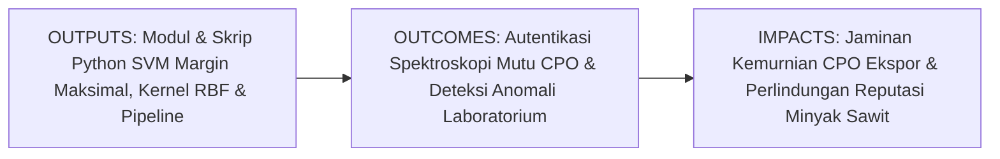
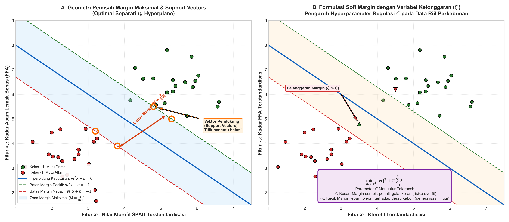
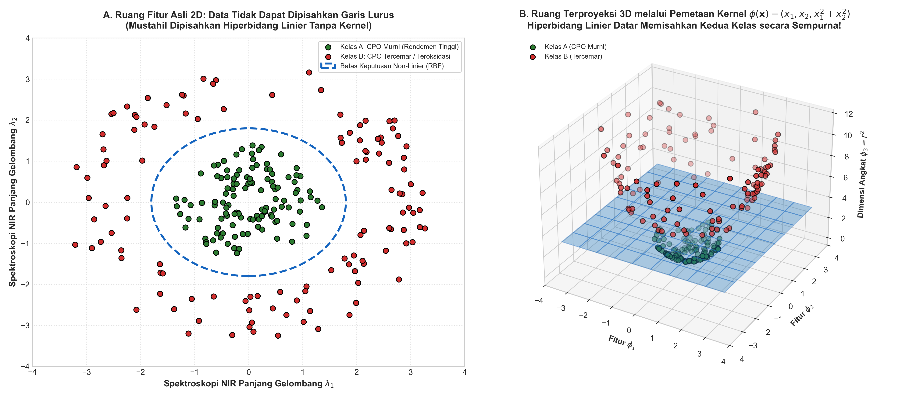

# AI Modul 7.7: Support Vector Machine (SVM)

---

## 1. Identitas & Kerangka Capaian Pembelajaran (Sub-CPMK)

* **Kode Modul**: AI Modul 7.7
* **Mata Kuliah**: Kecerdasan Buatan dan Sains Data Pertanian Presisi
* **Alokasi Waktu**: 2 x 50 Menit (Kajian Teori & Diskusi) + 2 x 50 Menit (Eksplorasi Praktikum Mandiri)
* **Beban SKS**: 3 SKS
* **Prasyarat**: AI Modul 4.2 (NumPy & Aljabar Linier), AI Modul 5.2.1 (Supervised Learning), AI Modul 6.2 (Confusion Matrix), AI Modul 7.2 (Logistic Regression)
* **Level Kognitif**: Bloom C2 (Memahami), C3 (Menerapkan), C4 (Menganalisis)



### 1.1 Capaian Pembelajaran Khusus (Sub-CPMK)
Setelah menyelesaikan modul ini secara komprehensif, mahasiswa diharapkan mampu:
1. **Memahami (C2)** prinsip geometris hiperbidang pemisah (*separating hyperplane*), penurunan analitik lebar margin maksimal $M = 2/\|\mathbf{w}\|$, formulasi optimasi kuadratik konveks *hard/soft margin*, kondisi Karush-Kuhn-Tucker (KKT), serta fungsi pemetaan non-linier melalui Teorema Mercer (*Kernel Trick*).
2. **Menerapkan (C3)** pustaka Scikit-Learn (`SVC`) yang diintegrasikan dalam *pipeline* baku (`StandardScaler`) untuk memproses sinyal reflektansi spektroskopi inframerah dekat (*Near-Infrared / NIR*) guna mengklasifikasikan kemurnian minyak kelapa sawit mentah (*Crude Palm Oil* / CPO).
3. **Menganalisis (C4)** interaksi hyperparameter penalti kesalahan $C$ dan lebar jangkauan kernel gamma ($\gamma$), mendiagnosis pergeseran vektor pendukung (*support vectors*), serta mengevaluasi trade-off antara kekakuan batas keputusan dan kemampuan generalisasi data lapangan.

### 1.2 Kerangka Hasil Pembelajaran (Outputs, Outcomes, & Impacts)
* **Outputs (Keluaran Langsung)**:
  * Pemahaman mendalam mengenai formulasi Lagrangian Primal dan Dual SVM, kondisi komplementer KKT, fungsi kernel RBF $K(\mathbf{x}_i, \mathbf{x}_j) = \exp(-\gamma \|\mathbf{x}_i - \mathbf{x}_j\|^2)$, dan mekanisme variabel kelonggaran $\xi_i$.
  * Skrip Python berstandar PEP 8 untuk konstruksi model SVM berkinerja tinggi, visualisasi kontur batas keputusan 2D, dan ekstraksi vektor pendukung kritis.
  * Laporan komparasi kinerja klasifikasi antara Kernel Linier, Polinomial, dan RBF pada data agro-industri kompleks berdimensi tinggi.
* **Outcomes (Kompetensi Aplikatif)**:
  * Kemampuan membangun sistem autentikasi mutu komoditas perkebunan berskala industri yang kebal terhadap kendala optimum lokal (*free from local minima*).
  * Keahlian dalam memproses data instrumen analitik modern (seperti kromatografi gas, spektrometer NIR, atau citra hiperspektral) yang memiliki jumlah variabel jauh lebih banyak daripada jumlah sampel ($p \gg N$).
* **Impacts (Dampak Strategis Jangka Panjang)**:
  * Perlindungan integritas sertifikasi rantai pasok minyak sawit berkelanjutan (RSPO/ISPO) melalui deteksi dini kontaminasi atau pemalsuan bahan baku di tangki timbun pelabuhan (*bulking station*).
  * Efisiensi waktu pengujian mutu laboratorium dari beberapa jam menjadi hitungan detik dengan integrasi spektroskopi digital berbasis kecerdasan buatan.

---

## 2. Profil Fundamental Algoritma: Fungsi, Manfaat, dan Keunggulan-Kelemahan

### 2.1 Fungsi Komputasi & Pemodelan Matematis
Support Vector Machine (SVM) adalah algoritma pembelajaran mesin terawasi non-probabilistik yang berfungsi untuk:
1. **Pencarian Hiperbidang Pemisah Optimal (*Optimal Margin Hyperplane*)**: Mengidentifikasi bidang pemisah berdimensi $(p-1)$ yang memaksimalkan jarak tegak lurus (*margin*) antara dua kelas data yang berbeda.
2. **Kondensasi Data Berbasis Titik Kritis (*Sparsity of Support Vectors*)**: Mengabaikan sebagian besar data yang berada jauh di zona aman dan hanya menggantungkan keputusan model pada segelintir sampel terluar yang paling sulit dipisahkan (*Support Vectors*).
3. **Pemetaan Ruang Berdimensi Tak Hingga (*Kernel Trick*)**: Mentransformasikan data yang tidak dapat dipisahkan secara linier di ruang asalnya ke dalam ruang fitur berdimensi lebih tinggi tanpa perlu menghitung koordinat eksplisit titik-titik tersebut.

### 2.2 Manfaat Nyata di Industri Perkebunan & Agribisnis
Penerapan SVM memberikan presisi yang tidak tertandingi dalam inspeksi analitik agro-industri:
* **Autentikasi Mutu Minyak Sawit Berbasis Spektroskopi NIR**: Spektrometer menghasilkan ratusan pita panjang gelombang ($p \approx 200 - 1000$) dari hanya puluhan sampel minyak ($N \approx 50$). Algoritma linier biasa akan mengalami singularitas matriks, namun SVM mampu bekerja sempurna pada dimensi tinggi berkat regulasi margin maksimalnya.
* **Deteksi Pemalsuan & Pencampuran Minyak Nabati**: Membedakan CPO murni dari CPO yang dicampur minyak jelantah atau minyak asam tinggi melalui batas pemisah non-linier kernel RBF yang sangat presisi.
* **Zonasi Kesuburan Lahan Berbasis Sensor Elektromagnetik**: Memetakan batas kontur blok kebun dengan tingkat keasaman ekstrem atau salinitas tinggi untuk pemupukan presisi (*variable rate application*).

### 2.3 Rationale: Alasan Mengapa Algoritma Ini Digunakan
Mengapa SVM menjadi salah satu mahakarya pembelajaran mesin paling dihormati dalam sains data terapan?
1. **Jaminan Konvergensi ke Optimum Global**: Formulasi matematis SVM berbentuk pemrograman kuadratik konveks (*convex quadratic programming*). Model dijamin secara matematis tidak akan pernah terjebak pada minimum lokal (*no local minima*), berbeda dengan Jaringan Saraf Tiruan (*Neural Networks*).
2. **Kekebalan Luar Biasa terhadap Kutukan Dimensi (*Curse of Dimensionality*)**: Kompleksitas generalisasi SVM tidak ditentukan oleh banyaknya dimensi fitur ($p$), melainkan oleh lebar margin pemisah ($M$) dan kapasitas Vapnik-Chervonenkis (VC). Oleh karena itu, SVM sangat perkasa pada data berdimensi sangat tinggi.
3. **Efisiensi Memori Inferensi**: Setelah pelatihan selesai, seluruh data latih biasa dapat dihapus dari memori; sistem hanya perlu menyimpan beberapa koordinat vektor pendukung (*support vectors*) untuk mengevaluasi sampel baru.
4. **Generalisasi Maksimal (*Maximal Generalization Bound*)**: Dengan memilih garis pemisah tepat di tengah koridor terluas, risiko salah klasifikasi terhadap sampel baru yang tergeser oleh derau lapangan menjadi sangat kecil.

### 2.4 Analisis Kelebihan dan Kekurangan

| Dimensi Evaluasi | Kelebihan (*Strengths*) | Kekurangan (*Limitations*) |
|:---|:---|:---|
| **Kapasitas Dimensi** | Sangat tangguh pada dataset berdimensi tinggi di mana fitur jauh melebihi sampel ($p > N$). | Skalabilitas komputasi lambat pada dataset raksasa; waktu pelatihan berskala $\mathcal{O}(N^2)$ hingga $\mathcal{O}(N^3)$. |
| **Kekokohan Generalisasi** | Sangat tahan terhadap overfitting di ruang dimensi tinggi berkat maksimasi margin geometris. | Sangat sensitif terhadap penskalaan fitur; standardisasi data (`StandardScaler`) adalah kewajiban mutlak. |
| **Fleksibilitas Non-Linier** | Mampu memisahkan batas data yang sangat rumit menggunakan berbagai fungsi kernel (RBF, Polinomial, Sigmoid). | Hyperparameter ($C, \gamma$) sulit disetel secara intuitif dan menuntut validasi silang grid search. |
| **Transparansi Output** | Bersifat deterministik dan stabil; posisi vektor pendukung memiliki makna geometris yang tegas. | Tidak menghasilkan estimasi probabilitas posterior secara alamiah (membutuhkan kalibrasi Platt yang lambat). |

### 2.5 Contoh Kasus Penggunaan Konkret di Sektor Agro-Industri
1. **Klasifikasi Kemurnian CPO Ekspor Berbasis Spektroskopi NIR**: Memisahkan sampel CPO mutu prima (kadar asam lemak bebas $< 3\%$, kadar air $< 0.15\%$, dan nilai DOBI $> 2.5$) dari sampel tercemar menggunakan kernel RBF non-linier.
2. **Sortasi Fraksi Mutu Biji Kakao & Kopi Ekspor**: Membedakan biji kopi cacat fisik, berjamur, atau terserang hama bubuk buah kopi (*Hypothenemus hampei*) berdasarkan fitur tekstur dan warna citra digital.
3. **Deteksi Cepat Cekaman Air pada Kelapa Sawit**: Mengklasifikasikan status hidrologis tanaman (Tercukupi vs Cekaman Ringan vs Kekeringan Parah) berbasis data pantulan kanopi multispektral drone pada musim kemarau El Nino.

### 2.6 Aspek Kritis & Catatan Penting Algoritma (*Key Critical Insights*)
* **Kewajiban Mutlak Standardisasi Fitur**: SVM menghitung jarak Euclidean antar-vektor sampel secara langsung. Jika satu fitur berskala ribuan (seperti panjang gelombang NIR $1200\text{ nm}$) dan fitur lain berskala desimal (seperti absorbansi $0.15$), maka fitur berskala besar akan mendominasi fungsi objektif hingga $99.9\%$, menghancurkan batas margin. Gunakan selalu `StandardScaler` di awal pipeline!
* **Dilema Parameter $C$ (Penalti Kesalahan)**: Parameter $C$ mengontrol kompromi antara lebar margin dan toleransi kesalahan. Nilai $C$ yang terlalu besar akan memaksakan margin sangat sempit demi menghindari kesalahan data latih, memicu *overfitting*. Sebaliknya, nilai $C$ yang terlalu kecil membuat margin terlalu lebar dan permisif, memicu *underfitting*.
* **Sensitivitas Hyperparameter Gamma ($\gamma$) pada Kernel RBF**: Parameter $\gamma$ menentukan radius pengaruh masing-masing vektor pendukung. Nilai $\gamma$ yang terlalu tinggi membuat jangkauan pengaruh hanya sebatas pulau-pulau kecil di sekitar titik data latih (menghafal derau), sedangkan $\gamma$ yang terlalu rendah membuat batas keputusan terlalu datar dan tumpul.



---

## 3. Teori Matematis Support Vector Machine

Support Vector Machine berakar dari Teori Pembelajaran Statistik (*Statistical Learning Theory*) yang dipelopori oleh Vladimir Vapnik dan Alexey Chervonenkis (1960-1995).

### 3.1 Geometri Hiperbidang Pemisah & Penurunan Lebar Margin

Diberikan dataset pelatihan perkebunan yang dapat dipisahkan secara linier sempurna:
$$D = \{(\mathbf{x}_1, y_1), (\mathbf{x}_2, y_2), \dots, (\mathbf{x}_N, y_N)\}, \quad \mathbf{x}_i \in \mathbb{R}^p, \quad y_i \in \{-1, +1\}$$

Perhatikan bahwa label kelas dinyatakan secara simetris sebagai **$-1$** (misal CPO Tercemar) dan **$+1$** (misal CPO Murni), bukan $0$ dan $1$.

Sebuah hiperbidang pemisah berdimensi $(p-1)$ didefinisikan oleh persamaan aljabar linier:

$$\mathbf{w}^T \mathbf{x} + b = 0$$

**Panduan Pembacaan Matematis**:
"Vektor bobot w transpos dikalikan vektor fitur x ditambah bias b sama dengan nol."

**Definisi Simbol**:
* $\mathbf{w} = (w_1, w_2, \dots, w_p)^T$: Vektor bobot normal yang tegak lurus (*orthogonal*) terhadap bidang pemisah.
* $b \in \mathbb{R}$: Bias skalar yang menentukan jarak pergeseran bidang dari titik pusat koordinat (*origin*).
* $\|\mathbf{w}\| = \sqrt{w_1^2 + \dots + w_p^2}$: Norma Euclidean dari vektor bobot.

#### Penurunan Jarak Margin Geometris
Jarak tegak lurus dari sembarang titik $\mathbf{x}$ ke hiperbidang pemisah adalah:

$$\text{Jarak}(\mathbf{x}) = \frac{|\mathbf{w}^T \mathbf{x} + b|}{\|\mathbf{w}\|}$$

Kita menetapkan batas kanonik margin untuk dua kelas:
* Untuk kelas positif ($y_i = +1$): $\mathbf{w}^T \mathbf{x}_i + b \ge +1$
* Untuk kelas negatif ($y_i = -1$): $\mathbf{w}^T \mathbf{x}_i + b \le -1$

Kedua pertidaksamaan ini dapat diringkas menjadi satu pertidaksamaan tunggal yang elegan:

$$y_i (\mathbf{w}^T \mathbf{x}_i + b) \ge 1, \quad \forall i \in \{1, 2, \dots, N\}$$

Titik-titik sampel yang tepat menyentuh batas margin dinamakan **Vektor Pendukung (*Support Vectors*)**, di mana berlaku kesetaraan $y_i (\mathbf{w}^T \mathbf{x}_i + b) = 1$.

Jarak antara batas margin positif ($\mathbf{w}^T \mathbf{x} + b = +1$) dan batas margin negatif ($\mathbf{w}^T \mathbf{x} + b = -1$) adalah lebar total margin geometris ($M$):

$$M = \frac{1 - (-1)}{\|\mathbf{w}\|} = \frac{2}{\|\mathbf{w}\|}$$

**Panduan Pembacaan Matematis**:
"Lebar margin M sama dengan dua dibagi norma w."

### 3.2 Optimasi Hard Margin: Masalah Kuadratik Konveks

Tujuan utama SVM adalah **memaksimalkan lebar margin $M = \frac{2}{\|\mathbf{w}\|}$**. Memaksimalkan $\frac{2}{\|\mathbf{w}\|}$ ekuivalen secara matematis dengan **meminimalkan kuadrat normanya $\frac{1}{2}\|\mathbf{w}\|^2$**.

Masalah optimasi **Hard Margin SVM (Primal)** dirumuskan sebagai:

$$\min_{\mathbf{w}, b} \frac{1}{2} \|\mathbf{w}\|^2 \quad \text{dengan kendala} \quad y_i(\mathbf{w}^T \mathbf{x}_i + b) \ge 1, \quad \forall i = 1, \dots, N$$

**Panduan Pembacaan Matematis**:
"Minimasi terhadap w dan b dari setengah norma w kuadrat dengan kendala y sub i dikalikan kurung buka w transpos x sub i ditambah b kurung tutup lebih besar atau sama dengan satu, untuk setiap i sama dengan satu sampai N."

### 3.3 Optimasi Soft Margin: Variabel Kelonggaran & Parameter $C$

Pada kondisi riil perkebunan, data sensor selalu mengandung derau (*noise*) dan pencilan (*outliers*), sehingga mustahil dipisahkan secara sempurna oleh garis lurus (non-separable).

Cortes dan Vapnik (1995) memperkenalkan **Variabel Kelonggaran (*Slack Variables*) $\xi_i \ge 0$** yang mengizinkan beberapa sampel melanggar batas margin:
* Jika $\xi_i = 0$: Sampel berada tepat di luar atau pada batas margin yang benar.
* Jika $0 < \xi_i \le 1$: Sampel berada di dalam koridor margin, namun masih berada pada sisi klasifikasi yang benar.
* Jika $\xi_i > 1$: Sampel menyeberangi hiperbidang keputusan dan salah diklasifikasikan (*misclassified*).

Formulasi optimasi **Soft Margin SVM (Primal)** menjadi:

$$\min_{\mathbf{w}, b, \boldsymbol{\xi}} \left[ \frac{1}{2} \|\mathbf{w}\|^2 + C \sum_{i=1}^N \xi_i \right] \quad \text{dengan kendala} \quad y_i(\mathbf{w}^T \mathbf{x}_i + b) \ge 1 - \xi_i \quad \text{dan} \quad \xi_i \ge 0$$

**Panduan Pembacaan Matematis**:
"Minimasi terhadap w, b, dan xi dari setengah norma w kuadrat ditambah C dikalikan sigma i sama dengan satu sampai N dari xi sub i, dengan kendala y sub i kurung buka w transpos x sub i ditambah b kurung tutup lebih besar atau sama dengan satu minus xi sub i, dan xi sub i lebih besar atau sama dengan nol."

**Makna Parameter Regulasi $C$**:
* $C$ bertindak sebagai bobot penalti terhadap pelanggaran margin.
* Nilai $C \to \infty$ mendekati kondisi Hard Margin (sangat intoleran terhadap kesalahan).
* Nilai $C$ kecil memberikan prioritas pada pelebaran margin, mengabaikan segelintir derau data.

### 3.4 Formulasi Dual Lagrange & Kondisi Karush-Kuhn-Tucker (KKT)

Menggunakan metode Pengali Lagrange (*Lagrange Multipliers*) $\alpha_i \ge 0$ dan $\mu_i \ge 0$, fungsi Lagrangian Soft Margin didefinisikan sebagai:

$$\mathcal{L}(\mathbf{w}, b, \boldsymbol{\xi}, \boldsymbol{\alpha}, \boldsymbol{\mu}) = \frac{1}{2}\|\mathbf{w}\|^2 + C\sum_{i=1}^N \xi_i - \sum_{i=1}^N \alpha_i \left[ y_i(\mathbf{w}^T \mathbf{x}_i + b) - 1 + \xi_i \right] - \sum_{i=1}^N \mu_i \xi_i$$

Dengan mencari turunan parsial terhadap $\mathbf{w}, b,$ dan $\xi_i$ lalu menetapkannya sama dengan nol:
1. $\frac{\partial \mathcal{L}}{\partial \mathbf{w}} = 0 \implies \mathbf{w} = \sum_{i=1}^N \alpha_i y_i \mathbf{x}_i$
2. $\frac{\partial \mathcal{L}}{\partial b} = 0 \implies \sum_{i=1}^N \alpha_i y_i = 0$
3. $\frac{\partial \mathcal{L}}{\partial \xi_i} = 0 \implies C - \alpha_i - \mu_i = 0 \implies 0 \le \alpha_i \le C$

Substitusi kembali ke Lagrangian menghasilkan **Formulasi Dual SVM**:

$$\max_{\boldsymbol{\alpha}} \left[ \sum_{i=1}^N \alpha_i - \frac{1}{2} \sum_{i=1}^N \sum_{j=1}^N \alpha_i \alpha_j y_i y_j (\mathbf{x}_i^T \mathbf{x}_j) \right]$$
$$\text{dengan kendala} \quad 0 \le \alpha_i \le C \quad \text{dan} \quad \sum_{i=1}^N \alpha_i y_i = 0$$

**Panduan Pembacaan Matematis**:
"Maksimasi terhadap alfa dari sigma i sama dengan satu sampai N dari alfa sub i dikurangi setengah sigma ganda i dan j dari alfa sub i alfa sub j y sub i y sub j dikalikan hasil kali titik x sub i transpos x sub j."

#### Teorema Karush-Kuhn-Tucker (KKT)
Kondisi KKT menetapkan bahwa perkalian antara pengali Lagrange dan kendala primal harus bernilai nol:
$$\alpha_i \left[ y_i(\mathbf{w}^T \mathbf{x}_i + b) - 1 + \xi_i \right] = 0$$

**Implikasi Fisis yang Sangat Krusial**:
* Untuk data yang berada aman di luar margin ($y_i(\mathbf{w}^T \mathbf{x}_i + b) > 1$): Nilai pengali Lagrange **$\alpha_i = 0$**. Sampel ini sama sekali tidak memengaruhi letak hiperbidang!
* Untuk data yang tepat berada di batas atau melanggar margin: Nilai **$\alpha_i > 0$**. Titik-titik inilah yang disebut **Support Vectors**!

### 3.5 Trik Kernel (The Kernel Trick) & Teorema Mercer

Perhatikan bahwa dalam formulasi Dual SVM, data latih **hanya muncul dalam bentuk operasi perkalian titik (*dot product*) $\mathbf{x}_i^T \mathbf{x}_j$**!

Jika data tidak linier di ruang $\mathbb{R}^p$, kita dapat memetakannya ke ruang berdimensi lebih tinggi $\mathcal{H}$ melalui fungsi pemetaan $\phi: \mathbb{R}^p \to \mathcal{H}$. Perkalian titik di ruang tinggi menjadi $\phi(\mathbf{x}_i)^T \phi(\mathbf{x}_j)$.

Berdasarkan **Teorema Mercer**, kita tidak perlu menghitung koordinat $\phi(\mathbf{x})$ yang sangat mahal atau berdimensi tak hingga. Kita cukup mendefinisikan sebuah **Fungsi Kernel $K(\mathbf{x}_i, \mathbf{x}_j)$** yang menghitung hasil perkalian titik tersebut secara langsung di ruang aslinya:

$$K(\mathbf{x}_i, \mathbf{x}_j) = \langle \phi(\mathbf{x}_i), \phi(\mathbf{x}_j) \rangle$$

**Tiga Fungsi Kernel Standar Industri Perkebunan**:
1. **Kernel Linier**:
   $$K(\mathbf{x}_i, \mathbf{x}_j) = \mathbf{x}_i^T \mathbf{x}_j$$
2. **Kernel Polinomial (Derajat $d$)**:
   $$K(\mathbf{x}_i, \mathbf{x}_j) = (\gamma \mathbf{x}_i^T \mathbf{x}_j + r)^d$$
3. **Kernel Radial Basis Function (RBF / Gaussian)**:
   $$K(\mathbf{x}_i, \mathbf{x}_j) = \exp\left( -\gamma \|\mathbf{x}_i - \mathbf{x}_j\|^2 \right)$$

**Panduan Pembacaan Matematis**:
"Kernel RBF K dari x sub i koma x sub j sama dengan eksponensial dari minus gamma dikalikan norma selisih x sub i minus x sub j kuadrat."

**Fungsi Keputusan Final SVM Berbasis Kernel**:
$$\hat{y}(\mathbf{x}) = \text{sign}\left( \sum_{i \in \text{SV}} \alpha_i y_i K(\mathbf{x}_i, \mathbf{x}) + b \right)$$



---

## 4. Implementasi Hands-on Terbimbing: Scikit-Learn Support Vector Machine

Pada sesi praktikum ini, kita akan mengimplementasikan model SVM untuk mengotentikasi mutu minyak kelapa sawit mentah (CPO) berdasarkan profil spektroskopi Near-Infrared (NIR) 6 panjang gelombang ($p = 6$) guna membedakan CPO Murni Ekspor ($y = +1$) dari CPO Tercemar/Terdegradasi ($y = -1$).

### 4.1 Pembangkitan Data Sintetis Spektroskopi NIR Minyak Sawit

```python
import numpy as np
import pandas as pd
from sklearn.svm import SVC
from sklearn.preprocessing import StandardScaler
from sklearn.pipeline import Pipeline
from sklearn.model_selection import train_test_split, GridSearchCV
from sklearn.metrics import classification_report, confusion_matrix, accuracy_score
import matplotlib.pyplot as plt

# 1. Pembangkitan Data Sintetis Spektroskopi NIR (Absorbansi Panjang Gelombang)
np.random.seed(42)
n_samples = 400

# Spektroskopi absorbansi pada 6 panjang gelombang spesifik ikatan C-H, O-H, dan C=O
# Panjang gelombang: 1200nm, 1450nm, 1720nm, 1940nm, 2150nm, 2300nm
# CPO Murni: Absorbansi O-H (air) dan C=O (asam bebas) rendah
# CPO Tercemar: Absorbansi O-H dan asam bebas tinggi dengan fluktuasi non-linier

y_cpo = np.random.choice([-1, 1], size=n_samples, p=[0.35, 0.65]) # -1 = Tercemar, +1 = Murni

X_spectra = np.zeros((n_samples, 6))
for i in range(n_samples):
    if y_cpo[i] == 1:   # CPO Murni Prima
        X_spectra[i, 0] = np.random.normal(0.45, 0.03) # 1200nm
        X_spectra[i, 1] = np.random.normal(0.22, 0.02) # 1450nm (Air rendah)
        X_spectra[i, 2] = np.random.normal(0.85, 0.04) # 1720nm (Trigliserida)
        X_spectra[i, 3] = np.random.normal(0.18, 0.02) # 1940nm (FFA rendah)
        X_spectra[i, 4] = np.random.normal(0.60, 0.03) # 2150nm
        X_spectra[i, 5] = np.random.normal(0.72, 0.04) # 2300nm
    else:               # CPO Tercemar / Teroksidasi
        X_spectra[i, 0] = np.random.normal(0.52, 0.05)
        X_spectra[i, 1] = np.random.normal(0.48, 0.06) # Air tinggi
        X_spectra[i, 2] = np.random.normal(0.74, 0.05)
        X_spectra[i, 3] = np.random.normal(0.42, 0.05) # FFA tinggi
        X_spectra[i, 4] = np.random.normal(0.66, 0.04)
        X_spectra[i, 5] = np.random.normal(0.61, 0.06)

col_names = ['NIR_1200nm', 'NIR_1450nm', 'NIR_1720nm', 'NIR_1940nm', 'NIR_2150nm', 'NIR_2300nm']
df_cpo = pd.DataFrame(X_spectra, columns=col_names)
df_cpo['Mutu_CPO'] = y_cpo

print(f"Dimensi Spektra CPO: {df_cpo.shape}")
print("Distribusi Sampel Mutu CPO:")
print(df_cpo['Mutu_CPO'].value_counts().rename({1: 'Murni (+1)', -1: 'Tercemar (-1)'}))
```

### 4.2 Konstruksi Pipeline Standardisasi & Pelatihan Kernel RBF

```python
# 2. Pembagian Data Latih dan Uji
X = df_cpo[col_names]
y = df_cpo['Mutu_CPO']

X_train, X_test, y_train, y_test = train_test_split(
    X, y, test_size=0.25, random_state=42, stratify=y
)

# 3. Pipeline SVM dengan StandardScaler
svm_pipeline = Pipeline([
    ('scaler', StandardScaler()),
    ('svm', SVC(kernel='rbf', C=10.0, gamma='scale', random_state=42))
])

# Pelatihan Model
svm_pipeline.fit(X_train, y_train)

# 4. Evaluasi Kinerja Model
train_score = svm_pipeline.score(X_train, y_train)
test_score = svm_pipeline.score(X_test, y_test)
y_pred = svm_pipeline.predict(X_test)

print(f"Akurasi Latih SVM Pipeline : {train_score * 100:.2f}%")
print(f"Akurasi Uji SVM Pipeline   : {test_score * 100:.2f}%")
print("\nLaporan Klasifikasi Spektroskopi Mutu CPO:")
print(classification_report(y_test, y_pred, target_names=['Tercemar (-1)', 'Murni (+1)']))
```

### 4.3 Inspeksi Vektor Pendukung (*Support Vectors*)

```python
# 5. Ekstraksi Informasi Vektor Pendukung
fitted_svm = svm_pipeline.named_steps['svm']
n_sv = fitted_svm.support_vectors_.shape[0]
n_total_train = len(X_train)

print("=== PROFIL VEKTOR PENDUKUNG (SUPPORT VECTORS) ===")
print(f"Jumlah Support Vectors : {n_sv} dari {n_total_train} sampel latih ({n_sv/n_total_train*100:.1f}%)")
print(f"Jumlah SV per Kelas    : {fitted_svm.n_support_} (Tercemar: {fitted_svm.n_support_[0]}, Murni: {fitted_svm.n_support_[1]})")
print(f"Nilai Intersep Bias (b): {fitted_svm.intercept_[0]:.4f}")
```

---

## 5. Eksperimen Komparasi & Visualisasi Analitik

### 5.1 Eksperimen Penyetelan Hyperparameter Grid Search ($C$ dan $\gamma$)

```python
# Eksperimen Grid Search untuk Menemukan Kombinasi C dan Gamma Terbaik
param_grid = {
    'svm__C': [0.1, 1.0, 10.0, 100.0],
    'svm__gamma': ['scale', 0.01, 0.1, 1.0, 10.0]
}

grid_search = GridSearchCV(
    svm_pipeline, param_grid, cv=5, scoring='accuracy', n_jobs=-1
)
grid_search.fit(X_train, y_train)

print(f"Hyperparameter Terbaik: {grid_search.best_params_}")
print(f"Skor Akurasi 5-Fold CV: {grid_search.best_score_ * 100:.2f}%")
```

---

## 6. Studi Kasus Nyata Industri Perkebunan & PKS

### 6.1 Sistem Verifikasi Otomatis Spektroskopi CPO di Terminal Muat Ekspor (*Bulking Station*)

**Konteks Operasional**:
Sebuah konsorsium eksportir minyak kelapa sawit di Pelabuhan Belawan mengoperasikan terminal tangki timbun (*bulking installation*) berkapasitas 80.000 metrik ton. Masalah paling berisiko tinggi adalah pemalsuan CPO bermutu rendah atau tercampur minyak limbah pabrik (*sludge oil*) oleh oknum pemasok nakal. Jika satu tongkang ekspor berkapasitas 5.000 ton tercemar asam tinggi, seluruh kargo kapal ditolak di pelabuhan Rotterdam dengan klaim penalti mencapai puluhan miliar rupiah.

**Penerapan Solusi Berbasis SVM**:
1. **Instrumentasi Spektrometer NIR Portabel**:
   Setiap pipa bongkar muat dari truk tangki dipasangi sensor spektrometer serat optik inline NIR yang merekam spektrum absorbansi secara kontinu tanpa perlu preparasi kimiawi basah.
2. **Pemrosesan Pipeline SVM RBF**:
   Model SVM yang telah dilatih pada ratusan profil CPO baku menganalisis pola 6 panjang gelombang dalam waktu 500 milidetik.
3. **Penyekatan Tangki Otomatis (*Automated Interlock Valve*)**:
   Jika SVM memprediksi status kelas Tercemar ($y = -1$), katup hidrolik tangki utama seketika terkunci dan aliran dialihkan ke tangki isolasi sementara.
4. **Hasil**:
   Tingkat klaim mutu internasional turun menjadi 0% dalam tiga kuartal berturut-turut, sekaligus memangkas waktu tunggu truk tangki dari 4 jam menjadi hanya 8 menit per unit.

---

## 7. Kekeliruan Metodologis, Bias Data, dan Praktik Terbaik di Industri

### 7.1 Kekeliruan Umum Metodologis (*Common Pitfalls*)
1. **Mengabaikan Standardisasi Fitur**: Melatih SVM langsung pada data mentah dengan skala berbeda akan membuat kernel RBF lumpuh, karena jarak Euclidean $\sum (x_{ij} - x_{kj})^2$ didominasi secara sepihak oleh fitur berangka besar.
2. **Overfitting Ekstrem Akibat Nilai Gamma Terlalu Tinggi**: Menyetel `gamma=100.0` menghasilkan batas keputusan yang membentuk gelembung-gelembung mikro di sekitar masing-masing sampel latih. Akurasi data latih menjadi 100%, namun akurasi data uji hancur.
3. **Penggunaan Kernel RBF pada Data Linier Masif**: Jika jumlah fitur sangat besar ($p > 10.000$), kernel linier (`kernel='linear'`) jauh lebih cepat dan sudah cukup memadai tanpa perlu kernel RBF yang lambat.

### 7.2 Praktik Terbaik (*Best Practices*)
* **Selalu Gunakan Pipeline**: Bungkus `StandardScaler` dan `SVC` dalam `Pipeline` Scikit-Learn guna mencegah kebocoran data (*data leakage*) selama validasi silang.
* **Gunakan LinearSVC untuk Dataset Sangat Besar**: Jika dataset melebihi $100.000$ baris, kelas `SVC(kernel='linear')` berbasis libsvm akan sangat lambat. Gunakan `LinearSVC` berbasis liblinear yang berskala linier $\mathcal{O}(N)$.
* **Penyetelan Grid Berbasis Skala Logaritmik**: Eksplorasi nilai $C$ dan $\gamma$ paling efektif dilakukan dalam rentang kelipatan eksponensial (misal $C \in \{0.1, 1, 10, 100\}$ dan $\gamma \in \{0.001, 0.01, 0.1, 1\}$).

---

## 8. Tugas Terbimbing & Soal Uji Kompetensi Berstandar HOTS (Bloom C3 & C4)

1. **Perhitungan Geometris Jarak Margin dan Persamaan Hiperbidang (C3)**:
   Sebuah model SVM linier dua dimensi memisahkan sampel mutu tanah perkebunan:
   * Vektor bobot: $\mathbf{w} = \begin{pmatrix} 3 \\ 4 \end{pmatrix}$
   * Nilai bias: $b = -12$
   
   Pertanyaan:
   * Hitung norma Euclidean dari vektor bobot ($\|\mathbf{w}\|$)!
   * Hitung lebar total margin geometris ($M = \frac{2}{\|\mathbf{w}\|}$) yang dihasilkan model tersebut!
   * Sebuah sampel tanah baru memiliki koordinat $\mathbf{x}_{\text{uji}} = \begin{pmatrix} 2 \\ 3 \end{pmatrix}$. Tentukan pada sisi kelas manakah sampel tersebut berada berdasarkan aturan keputusan $\hat{y} = \text{sign}(\mathbf{w}^T \mathbf{x} + b)$ dan hitung jarak tegak lurus sampel tersebut ke hiperbidang keputusan!

2. **Komputasi Manual Kernel RBF dan Penentuan Prediksi (C3)**:
   Sebuah model SVM RBF sederhana memiliki parameter jangkauan $\gamma = 0.5$ dan bias $b = -0.2$. Model hanya memiliki 2 Vektor Pendukung:
   * Vektor Pendukung 1: $\mathbf{x}_1 = \begin{pmatrix} 1 \\ 2 \end{pmatrix}$, dengan label $y_1 = +1$ dan koefisien dual $\alpha_1 = 1.2$.
   * Vektor Pendukung 2: $\mathbf{x}_2 = \begin{pmatrix} 4 \\ 6 \end{pmatrix}$, dengan label $y_2 = -1$ dan koefisien dual $\alpha_2 = 1.2$.
   
   Sebuah sampel uji baru memiliki koordinat $\mathbf{x}^* = \begin{pmatrix} 2 \\ 3 \end{pmatrix}$.
   * Hitung jarak kuadrat Euclidean $\|\mathbf{x}_1 - \mathbf{x}^*\|^2$ dan $\|\mathbf{x}_2 - \mathbf{x}^*\|^2$!
   * Hitung nilai kernel RBF $K(\mathbf{x}_1, \mathbf{x}^*)$ dan $K(\mathbf{x}_2, \mathbf{x}^*)$!
   * Hitung nilai fungsi keputusan $f(\mathbf{x}^*) = \sum_{i=1}^2 \alpha_i y_i K(\mathbf{x}_i, \mathbf{x}^*) + b$ dan tentukan label kelas prediksinya ($\text{sign}(f(\mathbf{x}^*)$)!

3. **Analisis Matematis Teorema KKT & Variabel Kelonggaran Slack (C4)**:
   Perhatikan kondisi komplementer Karush-Kuhn-Tucker (KKT) pada Soft Margin SVM:
   $$\alpha_i \left[ y_i(\mathbf{w}^T \mathbf{x}_i + b) - 1 + \xi_i \right] = 0$$
   $$\mu_i \xi_i = 0 \quad \text{dengan} \quad C - \alpha_i - \mu_i = 0$$
   * Jelaskan status geometris sampel observasi jika nilai koefisien dualnya adalah:
     a) $\alpha_i = 0$
     b) $0 < \alpha_i < C$
     c) $\alpha_i = C$
   * Jika seorang analis perkebunan memperbesar nilai penalti kesalahan dari $C = 0.1$ menjadi $C = 1000.0$, apa yang terjadi secara analitik terhadap lebar margin $M$, jumlah vektor pendukung, dan risiko overfitting model terhadap sampel tanah kotor?
   * Mengapa SVM jauh lebih kebal terhadap pencilan ekstrem (*far outliers*) yang berada jauh di dalam wilayah kelasnya sendiri dibandingkan model Regresi Logistik?

---

## 9. Jembatan Konsep (Bridging) ke AI Modul 7.8: K-Means Clustering

Dari Modul 7.1 hingga Modul 7.7, kita telah menuntaskan penjelajahan menyeluruh terhadap ranah **Pembelajaran Terawasi (Supervised Learning)**:
* Kita melatih model menggunakan data yang telah dilengkapi label target ($y$) yang jelas: target kontinu pada Regresi Linier, fraksi kematangan TBS pada Decision Tree & Random Forest, status patologi pada Naive Bayes, hingga sertifikasi mutu CPO pada Support Vector Machine.

Namun, di perkebunan modern, sebuah realitas data baru muncul:
1. **Kelangkaan Label Ahli (*The Labeling Bottleneck*)**: Perusahaan perkebunan memiliki citra satelit atau drone resolusi tinggi seluas ratusan ribu hektar dengan jutaan piksel spektra. Menugaskan pakar agronomi untuk memberi label manual pada setiap petak lahan membutuhkan waktu bertahun-tahun dan biaya miliaran rupiah.
2. **Pola Tersembunyi Tanpa Hipotesis Awal**: Sering kali manajemen kebun belum mengetahui secara pasti ada berapa ragam tipe kesuburan tanah di suatu afdeling baru, atau bagaimana pola pengelompokan variabilitas mikroklimat tanpa adanya label historis sebelumnya.

Bagaimana jika kita menuntut kecerdasan buatan untuk **menemukan pola alamiah sendiri dari tumpukan data tanpa label sama sekali ($y$ ditiadakan)?**

Transisi paradigma monumental inilah yang membawa kita melangkah dari dunia Pembelajaran Terawasi ke dunia **Pembelajaran Tak Terawasi (Unsupervised Learning)**.

Dan algoritma partisi tanpa pengawas yang paling fundamental, elegan, dan paling banyak diterapkan di dunia industri perkebunan adalah: **K-Means Clustering**.

Pada **AI Modul 7.8: K-Means Clustering**, kita akan membedah:
* **Prinsip Pembelajaran Tanpa Pengawas (*Unsupervised Learning*)**: Membiarkan mesin mengelompokkan data berdasarkan kedekatan geometris murni.
* **Algoritma Lloyd & Iterasi Konvergensi**: Inisialisasi titik pusat klaster (*centroids*), penugasan sampel (*assignment step*), dan pembaruan koordinat rata-rata (*update step*).
* **Metode Optimasi Jumlah Klaster Optimal**: Mendiagnosis kurva *Elbow Method* (Inersia WCSS) dan analisis *Silhouette Score*.
* **Aplikasi Agribisnis Nyata**: Zonasi otomatis kesuburan lahan sawit dan segmentasi profil blok kebun untuk pemupukan presisi.

---

## 10. Daftar Pustaka dan Referensi Akademik

1. Cortes, C., & Vapnik, V. (1995). Support-vector networks. *Machine Learning*, 20(3), 273-297.
2. Vapnik, V. (1998). *Statistical Learning Theory*. Wiley-Interscience.
3. Bishop, C. M. (2006). *Pattern Recognition and Machine Learning*. Springer. [Tersedia di koleksi src/]
4. Géron, A. (2022). *Hands-On Machine Learning with Scikit-Learn, Keras, and TensorFlow* (3rd ed.). O'Reilly Media. [Tersedia di koleksi src/]
5. Hastie, T., Tibshirani, R., & Friedman, J. (2009). *The Elements of Statistical Learning: Data Mining, Inference, and Prediction* (2nd ed.). Springer. [Tersedia di koleksi src/]
6. James, G., Witten, D., Hastie, T., & Tibshirani, R. (2021). *An Introduction to Statistical Learning: with Applications in R* (2nd ed.). Springer. [Tersedia di koleksi src/]
7. Schölkopf, B., & Smola, A. J. (2002). *Learning with Kernels: Support Vector Machines, Regularization, Optimization, and Beyond*. MIT Press.
