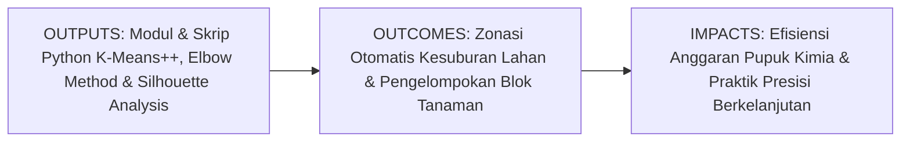
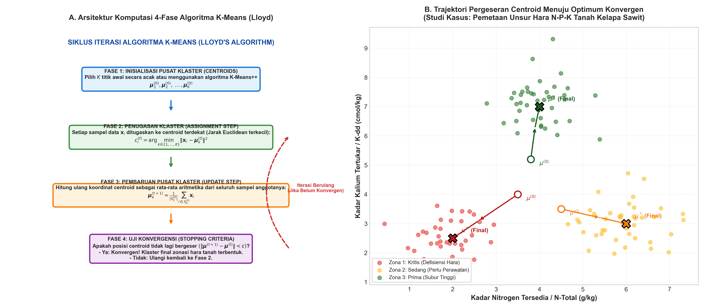
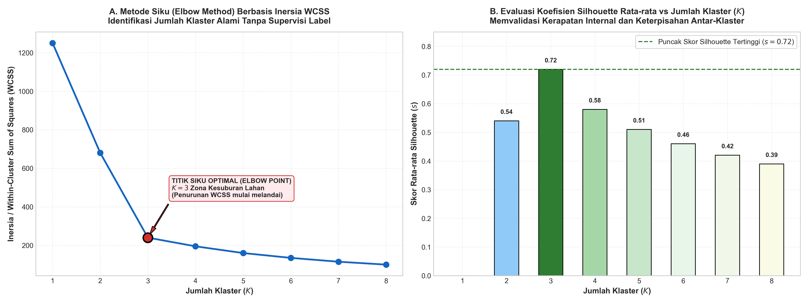

# AI Modul 7.8: K-Means Clustering

---

## 1. Identitas & Kerangka Capaian Pembelajaran (Sub-CPMK)

* **Kode Modul**: AI Modul 7.8
* **Mata Kuliah**: Kecerdasan Buatan dan Sains Data Pertanian Presisi
* **Alokasi Waktu**: 2 x 50 Menit (Kajian Teori & Diskusi) + 2 x 50 Menit (Eksplorasi Praktikum Mandiri)
* **Beban SKS**: 3 SKS
* **Prasyarat**: AI Modul 4.2 (NumPy Komputasi Numerik), AI Modul 5.2.2 (Unsupervised Learning), AI Modul 7.3 (K-Nearest Neighbor), AI Modul 7.7 (Support Vector Machine)
* **Level Kognitif**: Bloom C2 (Memahami), C3 (Menerapkan), C4 (Menganalisis)



### 1.1 Capaian Pembelajaran Khusus (Sub-CPMK)
Setelah menyelesaikan modul ini secara komprehensif, mahasiswa diharapkan mampu:
1. **Memahami (C2)** prinsip dasar pembelajaran tak terawasi (*unsupervised learning*), formulasi matematis fungsi objektif inersia / *Within-Cluster Sum of Squares* (WCSS), mekanisme dua fase algoritma Lloyd (penugasan dan pembaruan centroid), serta teknik inisialisasi probabilistik K-Means++.
2. **Menerapkan (C3)** pustaka Scikit-Learn (`KMeans` dan `StandardScaler`) untuk mengelompokkan data survei hara tanah perkebunan (N, P, K, pH, kelembapan) ke dalam zona kesuburan homogen tanpa panduan label target awal.
3. **Menganalisis (C4)** penentuan jumlah klaster optimal ($K$) menggunakan Metode Siku (*Elbow Method*) dan Koefisien Silhouette, mendiagnosis fenomena konvergensi ke optimum lokal sub-optimal, serta mengevaluasi dampak penskalaan fitur terhadap geometri partisi klaster.

### 1.2 Kerangka Hasil Pembelajaran (Outputs, Outcomes, & Impacts)
* **Outputs (Keluaran Langsung)**:
  * Penguasaan analitik fungsi objektif WCSS $J = \sum_{k=1}^K \sum_{i \in S_k} \|\mathbf{x}_i - \boldsymbol{\mu}_k\|^2$, aturan pergeseran centroid, probabilitas inisialisasi K-Means++, dan formulasi koefisien Silhouette $s(i)$.
  * Skrip Python berstandar PEP 8 untuk pipeline klasterisasi otomatis, visualisasi kurva evaluasi Elbow, dan pemetaan sebaran spasial klaster tanah 2D.
  * Dokumen rekomendasi pemupukan presisi terzonasi (*Variable Rate Fertilization*) berbasis centroid hara tanah.
* **Outcomes (Kompetensi Aplikatif)**:
  * Keahlian merancang sistem segmentasi data perkebunan berskala besar secara mandiri tanpa terhambat oleh ketiadaan label manual dari pakar agronomi (*unsupervised capability*).
  * Kemampuan mengidentifikasi zona anomali lahan (seperti kantong tanah masam atau defisiensi kalium kritis) yang tidak terlihat pada analisis agregat rata-rata afdeling.
* **Impacts (Dampak Strategis Jangka Panjang)**:
  * Penghematan biaya pengadaan pupuk anorganik perkebunan hingga 15-25% melalui penghentian aplikasi dosis rata seragam yang boros (*blanket application*).
  * Pencegahan pencemaran air tanah akibat kelebihan residu fosfat dan nitrat, memperkuat sertifikasi keberlanjutan lingkungan perkebunan kelapa sawit.

---

## 2. Profil Fundamental Algoritma: Fungsi, Manfaat, dan Keunggulan-Kelemahan

### 2.1 Fungsi Komputasi & Pemodelan Matematis
K-Means Clustering adalah algoritma pembelajaran mesin tanpa pengawas berbasis partisi (*centroid-based partitioning*) yang berfungsi untuk:
1. **Partisi Ruang Tanpa Panduan Label (*Unlabeled Spatial Partitioning*)**: Membagi himpunan data tanpa label $N$ sampel menjadi $K$ kelompok (*clusters*) yang saling lepas (*mutually exclusive*), di mana setiap sampel dimiliki oleh klaster dengan titik pusat (*centroid*) terdekat.
2. **Minimasi Varians Intra-Klaster (*Variance Minimization*)**: Secara iteratif meminimalkan jumlah kuadrat jarak antara sampel data dengan centroid kelompoknya masing-masing (*Within-Cluster Sum of Squares* / WCSS).
3. **Pembentukan Diagram Voronoi Implisit**: Menghasilkan partisi ruang cembung linier (*convex polygonal cells*) yang memisahkan wilayah pengaruh antar-centroid di ruang berdimensi banyak.

### 2.2 Manfaat Nyata di Industri Perkebunan & Agribisnis
Penerapan K-Means menjadi fondasi utama transformasi digital menuju pertanian presisi (*Precision Agriculture*):
* **Zonasi Pemupukan Presisi (*Variable Rate Fertilization* / VRF)**: Alih-alih menebar pupuk dengan dosis sama di seluruh afdeling seluas ratusan hektar, K-Means mengelompokkan blok-blok kebun ke dalam zona kesuburan spesifik (Zona Defisiensi Berat, Zona Sedang, Zona Subur), memungkinkan aplikasi pupuk berorientasi kebutuhan nyata tanaman.
* **Segmentasi Umur & Produktivitas Tegakan Kelapa Sawit**: Mengklasifikasikan petak-petak kebun berdasarkan kombinasi data tinggi pohon drone, kerapatan tajuk kanopi, dan tonase produksi historis untuk perencanaan jadwal peremajaan (*replanting*).
* **Segmentasi Profil Pekebun Plasma & Mitra PKS**: Mengelompokkan kelompok tani plasma berdasarkan kepatuhan panen, persentase brondolan, dan volume pasokan guna penentuan program pendampingan dan insentif kemitraan pabrik.

### 2.3 Rationale: Alasan Mengapa Algoritma Ini Digunakan
Mengapa K-Means tetap menjadi algoritma klasterisasi yang paling banyak diadopsi dalam industri perkebunan?
1. **Kecepatan Komputasi yang Sangat Cepat**: Memiliki kompleksitas komputasi linier $\mathcal{O}(N \cdot K \cdot I \cdot p)$, di mana $N$ adalah jumlah data, $K$ jumlah klaster, $I$ jumlah iterasi, dan $p$ jumlah fitur. Sangat enteng mengevaluasi jutaan titik data survei drone dalam hitungan detik.
2. **Kemudahan Interpretasi Pusat Klaster (*Centroid Interpretability*)**: Koordinat titik pusat klaster ($\boldsymbol{\mu}_k$) memiliki makna fisis langsung sebagai "profil tanah ideal" dari masing-masing zona (misal centroid Zona 1: $N = 1.2\text{ g/kg}, P = 8\text{ ppm}, K = 0.2\text{ cmol/kg}$).
3. **Skalabilitas Masif pada Data Big Data Pertanian**: Mampu memproses aliran data sensor tanah IoT berukuran gigabyte dengan varian `MiniBatchKMeans` secara efisien.
4. **Implementasi Matematika yang Elegan & Stabil**: Mudah diintegrasikan ke dalam perangkat lunak GIS (*Geographic Information System*) dan sistem kendali traktor pemupuk otomatis.

### 2.4 Analisis Kelebihan dan Kekurangan

| Dimensi Evaluasi | Kelebihan (*Strengths*) | Kekurangan (*Limitations*) |
|:---|:---|:---|
| **Efisiensi Komputasi** | Sangat cepat; kompleksitas waktu $\mathcal{O}(N)$ linier; hemat penggunaan memori kerja. | Penentuan jumlah klaster $K$ harus ditentukan manual oleh analis sebelum pelatihan dimulai. |
| **Keterpahaman Profil** | Koordinat centroid langsung merepresentasikan karakteristik rata-rata zona agronomi. | Sangat sensitif terhadap inisialisasi awal; dapat terjebak pada optimum lokal sub-optimal jika tanpa K-Means++. |
| **Penerapan Lapangan** | Menghasilkan zona partisi cembung (*convex*) yang sangat mudah diimplementasikan batas fisiknya di kebun. | Asumsi geometri klaster berbentuk sferis (bola); gagal memisahkan klaster berbentuk memanjang, cincin, atau non-linier. |
| **Kekokohan Data** | Konvergen secara konsisten menuju titik ekuilibrium stabil. | Sangat sensitif terhadap nilai pencilan ekstrem (*outliers*) yang dapat menggeser posisi centroid. |

### 2.5 Contoh Kasus Penggunaan Konkret di Sektor Agro-Industri
1. **Pemetaan Zona Hara Tanah di Kebun Sawit Rakyat**: Mengelompokkan 1.000 titik sampel tanah laboratorium menjadi 3 zona kebutuhan pupuk NPK untuk mengefisienkan bantuan pupuk subsidi pemerintah.
2. **Klasterisasi Mikroklimat Blok Perkebunan**: Mengelompokkan stasiun cuaca mikro otomatis berdasarkan suhu kanopi, evapotranspirasi, dan curah hujan untuk optimasi jadwal penyiraman bibitan kelapa sawit.
3. **Zonasi Kualitas Rendemen TBS Berdasarkan Riwayat Pasokan**: Mengelompokkan truk-truk pemasok TBS ke dalam klaster pemasok buah segar prima, pemasok buah campur, dan pemasok buah bermasalah untuk audit kendali mutu pabrik.

### 2.6 Aspek Kritis & Catatan Penting Algoritma (*Key Critical Insights*)
* **Sensitivitas Ekstrem terhadap Skala Fitur**: Karena K-Means menggunakan metrik jarak Euclidean $\|\mathbf{x}_i - \boldsymbol{\mu}_k\|$, perbedaan skala variabel akan merusak pembentukan klaster. Misalnya, jika variabel kadar kalium berada pada skala $0.1 - 0.8\text{ cmol/kg}$ sedangkan nitrogen pada skala $1000 - 3000\text{ mg/kg}$, maka kalium akan diabaikan $100\%$ oleh algoritma. Penskalaan dengan `StandardScaler` adalah syarat mutlak!
* **Penyelamatan Melalui K-Means++**: Inisialisasi acak murni (*random initialization*) sering menghasilkan centroid awal yang saling berdekatan di satu area padat data, memicu perangkap lokal. Selalu gunakan `init='k-means++'` yang secara cerdas memilih centroid awal yang tersebar sejauh mungkin satu sama lain.
* **K-Means Bukan untuk Menemukan Klaster Non-Sferis**: K-Means mengasumsikan bahwa setiap klaster memiliki varians yang seragam dan bentuk membulat (*isotropic spherical*). Jika data tanah di lapangan memiliki sebaran memanjang mengikuti aliran sungai atau topografi lereng berliku, gunakan algoritma berbasis densitas seperti DBSCAN atau reduksi dimensi PCA terlebih dahulu.



---

## 3. Teori Matematis K-Means Clustering

K-Means adalah metode partisi geometris klasik yang dirumuskan oleh Stuart Lloyd (1957) dan James MacQueen (1967) untuk menyelesaikan masalah kuantisasi sinyal dan pengelompokan pola tanpa supervisi label.

### 3.1 Formulasi Masalah Pembagian Partisi & Fungsi Objektif Inersia (WCSS)

Diberikan dataset pengamatan hara tanah tanpa label:
$$X = \{\mathbf{x}_1, \mathbf{x}_2, \dots, \mathbf{x}_N\}, \quad \mathbf{x}_i \in \mathbb{R}^p$$

Tujuan dari K-Means adalah membagi $N$ sampel data tersebut ke dalam $K$ himpunan bagian yang saling lepas $S = \{S_1, S_2, \dots, S_K\}$ sedemikian rupa sehingga memenuhi dua kondisi himpunan:
1. $\bigcup_{k=1}^K S_k = X$ (Seluruh data terwadahi).
2. $S_j \cap S_k = \emptyset, \quad \forall j \neq k$ (Tidak ada data yang tumpang tindih antar-klaster).

Untuk setiap klaster $S_k$, didefinisikan sebuah **vektor titik pusat (*centroid*)** $\boldsymbol{\mu}_k \in \mathbb{R}^p$. Kualitas pengelompokan diukur melalui fungsi objektif **Inersia** atau **Within-Cluster Sum of Squares (WCSS)**:

$$J(S, \boldsymbol{\mu}) = \sum_{k=1}^K \sum_{i \in S_k} \|\mathbf{x}_i - \boldsymbol{\mu}_k\|^2$$

**Panduan Pembacaan Matematis**:
"Fungsi inersia J sama dengan sigma k mulai dari satu hingga K dari sigma i anggota S sub k dari norma kuadrat selisih vektor x sub i minus mu sub k."

**Definisi Variabel**:
* $J$: Nilai total inersia atau varians internal klaster yang ingin diminimalkan.
* $K$: Jumlah klaster yang ditetapkan oleh analis.
* $S_k$: Himpunan indeks data yang menjadi anggota klaster ke-$k$.
* $\boldsymbol{\mu}_k$: Titik pusat gravitasi (*mean vector*) dari klaster ke-$k$.
* $\|\mathbf{x}_i - \boldsymbol{\mu}_k\|^2 = \sum_{j=1}^p (x_{ij} - \mu_{kj})^2$: Kuadrat jarak Euclidean antara sampel $\mathbf{x}_i$ dan centroid $\boldsymbol{\mu}_k$.

### 3.2 Algoritma Expectation-Maximization Lloyd

Secara komputasi, mencari partisi optimal global dari fungsi WCSS adalah masalah *NP-Hard*. Algoritma Lloyd mendekati solusi optimal menggunakan pendekatan iteratif dua fase berbasis *Expectation-Maximization* (EM):

#### Fase 1: Penugasan Klaster (Assignment Step / E-Step)
Dengan menganggap posisi seluruh centroid $\boldsymbol{\mu}_k^{(t)}$ tetap, setiap titik data $\mathbf{x}_i$ ditugaskan ke klaster yang memiliki centroid paling dekat:

$$S_k^{(t)} = \left\{ \mathbf{x}_i : \|\mathbf{x}_i - \boldsymbol{\mu}_k^{(t)}\|^2 \le \|\mathbf{x}_i - \boldsymbol{\mu}_j^{(t)}\|^2, \quad \forall j \in \{1, 2, \dots, K\} \right\}$$

Secara ekuivalen, kita mendefinisikan matriks indikator biner $r_{ik} \in \{0, 1\}$:
$$r_{ik} = \begin{cases} 1 & \text{jika } k = \arg\min_j \|\mathbf{x}_i - \boldsymbol{\mu}_j^{(t)}\|^2 \\ 0 & \text{lainnya} \end{cases}$$

#### Fase 2: Pembaruan Titik Pusat Klaster (Centroid Update Step / M-Step)
Dengan keanggotaan klaster $S_k^{(t)}$ yang telah ditetapkan, posisi centroid baru $\boldsymbol{\mu}_k^{(t+1)}$ dihitung ulang agar meminimalkan fungsi kuadrat WCSS terhadap anggotanya.

Turunkan fungsi $J$ terhadap $\boldsymbol{\mu}_k$ dan samakan dengan nol:
$$\frac{\partial J}{\partial \boldsymbol{\mu}_k} = -2 \sum_{i \in S_k} (\mathbf{x}_i - \boldsymbol{\mu}_k) = 0 \implies \sum_{i \in S_k} \mathbf{x}_i = |S_k| \boldsymbol{\mu}_k$$

Diperoleh formula pembaruan centroid sebagai rata-rata aritmetika murni:

$$\boldsymbol{\mu}_k^{(t+1)} = \frac{1}{|S_k^{(t)}|} \sum_{i \in S_k^{(t)}} \mathbf{x}_i = \frac{\sum_{i=1}^N r_{ik} \mathbf{x}_i}{\sum_{i=1}^N r_{ik}}$$

**Panduan Pembacaan Matematis**:
"Centroid mu sub k pada iterasi t plus satu sama dengan satu dibagi ukuran himpunan S sub k pangkat t dikalikan sigma i anggota S sub k dari vektor x sub i."

**Kriteria Berhenti (*Stopping Criteria*)**:
Proses iterasi dihentikan apabila perpindahan posisi centroid lebih kecil dari ambang batas toleransi ($\|\boldsymbol{\mu}_k^{(t+1)} - \boldsymbol{\mu}_k^{(t)}\| < \epsilon$) atau jumlah iterasi maksimum (`max_iter=300`) telah tercapai.

### 3.3 Patologi Inisialisasi Acak & Solusi K-Means++

Pada algoritma K-Means standar, centroid awal dipilih secara acak murni dari sampel data. Hal ini memicu risiko konvergensi optimum lokal (*local optima*): jika dua centroid awal terpilih di klaster alami yang sama, salah satu klaster alami lainnya akan terbagi dua secara tidak wajar.

Arthur dan Vassilvitskii (2007) merumuskan algoritma **K-Means++** yang menjamin batas kesalahan matematis $\mathcal{O}(\log K)$-kompetitif melalui inisialisasi probabilistik berbasis jarak:
1. Centroid pertama $\boldsymbol{\mu}_1$ dipilih secara acak seragam dari dataset $X$.
2. Untuk setiap sampel $\mathbf{x}_i$, hitung kuadrat jarak terdekatnya ke centroid yang sudah ada:
   $$D(\mathbf{x}_i)^2 = \min_{k} \|\mathbf{x}_i - \boldsymbol{\mu}_k\|^2$$
3. Centroid berikutnya dipilih dari data dengan probabilitas proporsional terhadap kuadrat jaraknya:
   $$P(\mathbf{x}_i \text{ terpilih sebagai centroid baru}) = \frac{D(\mathbf{x}_i)^2}{\sum_{j=1}^N D(\mathbf{x}_j)^2}$$
4. Ulangi langkah 2 dan 3 hingga seluruh $K$ centroid awal berhasil ditentukan.

**Manfaat Fisis**: Titik yang letaknya jauh dari centroid yang sudah ada memiliki probabilitas terpilih jauh lebih tinggi, menjamin penyebaran awal yang merata di seluruh ruang data.

### 3.4 Penentuan Jumlah Klaster Optimal: Metode Siku (Elbow Method)

Nilai inersia WCSS selalu menurun secara monotonik seiring bertambahnya $K$. Jika $K = N$, maka setiap sampel menjadi centroidnya sendiri dan WCSS $= 0$, namun model kehilangan makna pengelompokan sama sekali.

**Metode Siku (*Elbow Method*)** memplot nilai WCSS sebagai fungsi dari $K \in \{1, 2, \dots, K_{\text{max}}\}$.
* Pada awalnya, penambahan $K$ menurunkan WCSS secara sangat tajam karena variabilitas besar terwadahi.
* Setelah mencapai jumlah klaster alami sebenarnya ($K^*$), penambahan $K$ berikutnya hanya menghasilkan penurunan WCSS yang melandai secara marjinal.
* Titik di mana kurva mengalami pembengkokan tajam seperti siku tangan (*elbow inflection point*) dipilih sebagai **jumlah klaster optimal**.

### 3.5 Koefisien Kerapatan dan Pemisahan: Analisis Silhouette

Untuk melengkapi Metode Siku yang terkadang bersifat subjektif, Peter Rousseeuw (1987) memperkenalkan **Koefisien Silhouette (*Silhouette Coefficient*)** yang mengukur seberapa dekat suatu sampel dengan kelompoknya sendiri dibandingkan dengan kelompok tetangga terdekat.

Untuk setiap sampel data $\mathbf{x}_i \in S_A$:
1. **Kerapatan Internal Rata-rata ($a(i)$)**:
   Rata-rata jarak dari sampel $i$ ke seluruh sampel lain di dalam klaster yang sama ($S_A$):
   $$a(i) = \frac{1}{|S_A| - 1} \sum_{j \in S_A, j \neq i} \|\mathbf{x}_i - \mathbf{x}_j\|$$
2. **Keterpisahan Eksternal Minimum ($b(i)$)**:
   Rata-rata jarak dari sampel $i$ ke seluruh sampel di klaster tetangga terdekat ($S_B \neq S_A$):
   $$b(i) = \min_{C \neq A} \frac{1}{|S_C|} \sum_{j \in S_C} \|\mathbf{x}_i - \mathbf{x}_j\|$$
3. **Koefisien Silhouette Sampel ($s(i)$)**:
   $$s(i) = \frac{b(i) - a(i)}{\max(a(i), b(i))}$$

**Panduan Pembacaan Matematis**:
"Koefisien silhouette s sub i sama dengan selisih b sub i minus a sub i dibagi nilai maksimum antara a sub i dan b sub i."

**Rentang Nilai dan Interpretasi**:
* Nilai $s(i) \in [-1, +1]$.
* $s(i) \approx +1$: Sampel sangat padat di dalam klasternya sendiri dan terpisah sangat jauh dari klaster lain (pengelompokan sempurna).
* $s(i) \approx 0$: Sampel berada tepat di perbatasan dua klaster yang saling bersentuhan.
* $s(i) < 0$: Sampel salah ditempatkan (lebih dekat ke klaster tetangga daripada klasternya sendiri).

Skor Silhouette Rata-rata di seluruh $N$ sampel:
$$\bar{s} = \frac{1}{N} \sum_{i=1}^N s(i)$$
Nilai $K$ yang menghasilkan puncak $\bar{s}$ tertinggi dipilih sebagai jumlah klaster terbaik.



---

## 4. Implementasi Hands-on Terbimbing: Scikit-Learn K-Means

Pada bagian ini, kita akan melakukan zonasi kesuburan tanah perkebunan kelapa sawit seluas 800 hektar yang terdiri dari 500 titik sampel pengukuran laboratorium tanah.

Parameter sensor hara tanah:
* `N_Total_g_kg`: Kandungan Nitrogen total tanah ($0.8 - 3.5\text{ g/kg}$)
* `P_Tersedia_ppm`: Kandungan Fosfor tersedia Bray-II ($4.0 - 35.0\text{ ppm}$)
* `K_dd_cmol_kg`: Kalium dapat dipertukarkan ($0.10 - 1.20\text{ cmol/kg}$)
* `pH_Tanah`: Derajat keasaman tanah ($3.8 - 6.2$)
* `Bahan_Organik_%`: Persentase C-Organik tanah ($1.2 - 6.5\%$)

### 4.1 Pembangkitan Data Sintetis Survei Kesuburan Tanah Perkebunan

```python
import numpy as np
import pandas as pd
from sklearn.cluster import KMeans
from sklearn.preprocessing import StandardScaler
from sklearn.metrics import silhouette_score, silhouette_samples
import matplotlib.pyplot as plt

# 1. Pembangkitan Data Sintetis Survei Tanah Multi-Nutrien
np.random.seed(42)
n_titik = 500

# 3 Zona Alami di Lapangan:
# Zona 1: Tanah Gambut Masam / Defisiensi Kalium (200 titik)
# Zona 2: Tanah Mineral Sedang (200 titik)
# Zona 3: Tanah Lembah Aluvial Subur Tinggi (100 titik)

z1 = np.random.normal([1.2, 8.0, 0.20, 4.1, 5.2], [0.15, 1.5, 0.04, 0.2, 0.4], (200, 5))
z2 = np.random.normal([1.8, 16.0, 0.45, 5.0, 2.8], [0.20, 2.5, 0.06, 0.3, 0.3], (200, 5))
z3 = np.random.normal([2.6, 28.0, 0.85, 5.8, 3.8], [0.25, 3.0, 0.08, 0.3, 0.4], (100, 5))

X_tanah = np.vstack([z1, z2, z3])
np.random.shuffle(X_tanah)

fitur_tanah = ['N_Total_g_kg', 'P_Tersedia_ppm', 'K_dd_cmol_kg', 'pH_Tanah', 'Bahan_Organik_%']
df_tanah = pd.DataFrame(X_tanah, columns=fitur_tanah)

print(f"Dimensi Data Survei Tanah: {df_tanah.shape}")
print("Statistik Deskriptif Parameter Tanah:")
print(df_tanah.describe().round(2))
```

### 4.2 Standardisasi Fitur dan Pencarian K Optimal (Elbow Method & Silhouette)

```python
# 2. Standardisasi Fitur (Kewajiban Mutlak K-Means)
scaler = StandardScaler()
X_scaled = scaler.fit_transform(df_tanah)

# 3. Pengujian Rentang K (1 sampai 8)
wcss_list = []
sil_list = []
k_range = range(2, 9)

# K=1 hanya untuk WCSS
kmeans_k1 = KMeans(n_clusters=1, init='k-means++', random_state=42, n_init=10)
kmeans_k1.fit(X_scaled)
wcss_all = [kmeans_k1.inertia_]

for k in k_range:
    km = KMeans(n_clusters=k, init='k-means++', random_state=42, n_init=10)
    km.fit(X_scaled)
    wcss_all.append(km.inertia_)
    sil = silhouette_score(X_scaled, km.labels_)
    sil_list.append(sil)

print("=== EVALUASI JUMLAH KLASTER OPTIMAL ===")
for k, s in zip(k_range, sil_list):
    print(f"K = {k}: Silhouette Score = {s:.4f} | Inersia WCSS = {wcss_all[k-1]:.2f}")
```

### 4.3 Pelatihan Model K-Means Final ($K=3$) & Profil Centroid Agronomi

```python
# 4. Pelatihan Model K-Means Optimal K=3
k_optimal = 3
kmeans_final = KMeans(n_clusters=k_optimal, init='k-means++', random_state=42, n_init=15)
df_tanah['Zona_Klaster'] = kmeans_final.fit_predict(X_scaled)

# 5. Transformasi Balik Centroid ke Skala Asli Agronomi
centroid_scaled = kmeans_final.cluster_centers_
centroid_asli = scaler.inverse_transform(centroid_scaled)

df_centroid = pd.DataFrame(centroid_asli, columns=fitur_tanah)
df_centroid['Jumlah_Titik'] = df_tanah['Zona_Klaster'].value_counts().sort_index().values

# Berikan label interpretasi bisnis perkebunan
nama_zona = ['Zona Kritis (Defisiensi Berat)', 'Zona Sedang (Pemupukan Reguler)', 'Zona Subur (Dosis Rendah)']
# Urutkan berdasarkan rata-rata kalium untuk penamaan konsisten
urutan_k = df_centroid['K_dd_cmol_kg'].argsort()
label_map = {urutan_k.iloc[0]: 'Zona 1: Kritis Defisiensi', 
             urutan_k.iloc[1]: 'Zona 2: Sedang / Reguler', 
             urutan_k.iloc[2]: 'Zona 3: Subur Tinggi'}

df_tanah['Nama_Zona'] = df_tanah['Zona_Klaster'].map(label_map)

print("\n=== PROFIL CENTROID HARA TANAH (SKALA ASLI LAPANGAN) ===")
print(df_centroid.round(3).to_string())
print(f"\nSkor Silhouette Model Final: {silhouette_score(X_scaled, df_tanah['Zona_Klaster']):.4f}")
```

---

## 5. Eksperimen Komparasi & Visualisasi Analitik

### 5.1 Visualisasi Partisi Ruang Klaster 2D Berbasis Fitur Utama

```python
# Visualisasi Sebaran Klaster: Nitrogen vs Kalium
fig, ax = plt.subplots(figsize=(8, 5.5), dpi=150)
warna_z = ['#d32f2f', '#f57c00', '#2e7d32']

for idx, nama in enumerate(df_tanah['Nama_Zona'].unique()):
    subset = df_tanah[df_tanah['Nama_Zona'] == nama]
    ax.scatter(subset['N_Total_g_kg'], subset['K_dd_cmol_kg'], label=nama, alpha=0.65, s=45)

# Plot Centroid
ax.scatter(centroid_asli[:, 0], centroid_asli[:, 2], color='black', s=180, marker='X', linewidths=2, label='Titik Centroid (Rata-rata Zona)')

ax.set_title('Peta Zonasi Kesuburan Tanah Kelapa Sawit (K-Means K=3)', fontweight='bold')
ax.set_xlabel('Nitrogen Total (g/kg)')
ax.set_ylabel('Kalium Tertukar / K-dd (cmol/kg)')
ax.legend(loc='upper left')
ax.grid(True, linestyle=':', alpha=0.6)
plt.tight_layout()
plt.show()
```

---

## 6. Studi Kasus Nyata Industri Perkebunan & PKS

### 6.1 Implementasi Zonasi Pemupukan Presisi di Afdeling 8 Kebun Sawit Sumatera Utara

**Konteks Operasional**:
Sebuah unit perkebunan kelapa sawit di Labuhanbatu memiliki luasan Afdeling 8 seluas 750 hektar dengan topografi bergelombang yang terdiri dari campuran tanah mineral podsolik dan sisipan kantong gambut dangkal. Selama 10 tahun terakhir, manajemen menerapkan sistem pemupukan rata seragam (*blanket application*) sebesar 2.5 kg MOP (KCl) dan 2.0 kg Urea per pohon per tahun.
Dampaknya:
1. Blok gambut mengalami defisiensi kalium kronis yang mengakibatkan gugurnya bunga jantan dan brondolan pecah dini.
2. Blok aluvial lembah mengalami kelebihan nitrogen (*over-fertilization*) yang memicu serangan hama ulat api dan pemborosan anggaran sebesar Rp 680 juta per tahun.

**Solusi Berbasis K-Means Clustering**:
1. **Pengambilan Sampel Georeferensi**:
   Tim riset tanah mengambil 500 sampel komposit tanah pada kedalaman $0 - 30\text{ cm}$ dengan koordinat GPS presisi.
2. **Eksekusi Klasterisasi Multi-Nutrien**:
   K-Means mempartisi afdeling ke dalam 3 zona pemupukan:
   * **Zona 1 (Gambut Defisiensi Kalium, 38% Luasan)**: Dosis Kalium dinaikkan menjadi 3.5 kg/pohon, Urea diturunkan menjadi 1.2 kg/pohon.
   * **Zona 2 (Mineral Reguler, 44% Luasan)**: Dosis standar dipertahankan.
   * **Zona 3 (Aluvial Lembah Subur, 18% Luasan)**: Dosis Urea dipangkas menjadi 0.8 kg/pohon dan Kalium 1.5 kg/pohon.
3. **Dampak Finansial & Agronomi**:
   * Total belanja pupuk afdeling berkurang **Rp 310 juta/tahun (hemat 18.5%)**.
   * Produksi TBS rata-rata di Zona 1 terdongkrak naik dari 16.5 Ton/Ha menjadi 21.2 Ton/Ha dalam kurun 18 bulan pasca rezonasi pupuk.

---

## 7. Kekeliruan Metodologis, Bias Data, dan Praktik Terbaik di Industri

### 7.1 Kekeliruan Umum Metodologis (*Common Pitfalls*)
1. **Lupa Menstandarisasi Data**: Melatih K-Means pada data mentah di mana satu fitur berangka ribuan (ppm) dan fitur lain pecahan desimal ($0.2\text{ cmol/kg}$). Centroid hanya akan bergerak mengikuti fitur ribuan, membutakan algoritma terhadap variabel kritis lainnya.
2. **Terpaku pada Angka Silhouette Tertinggi Tanpa Makna Bisnis**: Terkadang $K=2$ memberikan skor Silhouette tertinggi ($0.75$), namun manajemen membutuhkan 4 tingkatan aksi pupuk (Sangat Kritis, Kritis, Sedang, Subur). Pilih nilai $K$ yang menyeimbangkan skor matematis dan kepraktisan eksekusi lapangan.
3. **Mengabaikan Pengaruh Nilai Pencilan (*Outliers*)**: Titik sampel tanah yang tercemar tumpahan karung pupuk (misal kadar kalium mendadak $15.0\text{ cmol/kg}$) akan menarik centroid jauh ke arah dirinya sendiri. Lakukan pembersihan pencilan menggunakan batas IQR atau Z-Score sebelum klasterisasi.

### 7.2 Praktik Terbaik (*Best Practices*)
* **Gunakan Selalu K-Means++**: Parameter `init='k-means++'` adalah standar wajib industri untuk meminimalkan risiko konvergensi buruk.
* **Tingkatkan Nilai `n_init`**: Setel `n_init=10` atau `n_init=20` agar Scikit-Learn menjalankan algoritma dari 10-20 inisialisasi awal berbeda dan otomatis memilih model dengan inersia terendah.
* **Kombinasikan dengan Peta GIS**: Hubungkan label klaster hasil K-Means dengan koordinat bujur/lintang (*latitude/longitude*) untuk menghasilkan peta poligon zonasi yang dapat langsung diunggah ke komputer traktor GPS kebun.

---

## 8. Tugas Terbimbing & Soal Uji Kompetensi Berstandar HOTS (Bloom C3 & C4)

1. **Perhitungan Manual 1 Siklus Iterasi Algoritma Lloyd 1D (C3)**:
   Diberikan 6 sampel pengukuran persentase bahan organik tanah kebun:
   $$X = \{1.0, 2.0, 2.5, 6.0, 7.0, 8.5\}$$
   Ditetapkan jumlah klaster $K = 2$. Pada iterasi awal ($t=0$), analis menetapkan dua centroid awal:
   $$\mu_1^{(0)} = 1.5 \quad \text{dan} \quad \mu_2^{(0)} = 7.5$$
   
   Pertanyaan:
   * **Fase Penugasan**: Hitung jarak setiap sampel ke kedua centroid dan tentukan anggota masing-masing klaster ($S_1^{(0)}$ dan $S_2^{(0)}$)!
   * **Fase Pembaruan**: Hitung posisi koordinat centroid baru ($\mu_1^{(1)}$ dan $\mu_2^{(1)}$) untuk iterasi berikutnya!
   * Hitung nilai inersia WCSS pada akhir siklus pertama tersebut!

2. **Komputasi Manual Koefisien Silhouette untuk Sampel Tertentu (C3)**:
   Sebuah klasterisasi tanah menghasilkan dua klaster 1D:
   * Klaster A: $S_A = \{2.0, 4.0, 6.0\}$
   * Klaster B: $S_B = \{10.0, 12.0, 14.0\}$
   
   Tinjau sampel target $x_i = 6.0$ yang berada di Klaster A:
   * Hitung nilai kerapatan internal $a(i)$ (rata-rata jarak dari $x_i = 6.0$ ke sampel lain di Klaster A)!
   * Hitung nilai keterpisahan eksternal $b(i)$ (rata-rata jarak dari $x_i = 6.0$ ke seluruh sampel di Klaster B)!
   * Hitung nilai koefisien Silhouette $s(i)$ dari sampel tersebut dan berikan interpretasi kualitas keanggotaannya!

3. **Analisis Konvergensi Inersia WCSS & Algoritma K-Means++ (C4)**:
   Perhatikan formulasi fungsi objektif inersia WCSS:
   $$J = \sum_{k=1}^K \sum_{i \in S_k} \|\mathbf{x}_i - \boldsymbol{\mu}_k\|^2$$
   * Buktikan secara konseptual mengapa nilai fungsi objektif $J$ dijamin selalu menurun atau minimal tetap sama pada setiap iterasi algoritma Lloyd (tidak akan pernah naik)!
   * Mengapa jaminan penurunan nilai $J$ tersebut tidak menjamin bahwa K-Means akan mencapai **optimum global mutlak**? Jelaskan peran inisialisasi K-Means++ dalam mengatasi masalah ini!
   * Jika seorang asisten kebun bersikeras memilih $K = 20$ untuk 100 pohon sawit karena ingin WCSS sekecil mungkin, apa kritik agronomi dan statistik yang harus Anda sampaikan?

---

## 9. Jembatan Konsep (Bridging) ke AI Modul 7.9: Principal Component Analysis (PCA)

Pada modul ini, kita telah menguasai kehebatan **K-Means Clustering**: bagaimana data survei hara tanah berdimensi lima dapat dikelompokkan menjadi zona-zona kesuburan yang rapi dan objektif tanpa membutuhkan panduan label awal dari manusia.

Namun, ketika kita bekerja di era pertanian modern 4.0, kita menghadapi **kendala analitik baru**:
1. **Ledakan Dimensi Sensor (*High-Dimensional Curse*)**: Citra multispektral drone kebun sawit tidak hanya memiliki 5 fitur hara tanah, melainkan puluhan pita spektral (RGB, RedEdge, NIR, Thermal, Indeks Vegetasi NDVI, NDRE, SAVI, dll.). Menjalankan K-Means langsung pada ruang 50 dimensi menyebabkan jarak Euclidean kehilangan daya diskriminasinya (*distance concentration effect*).
2. **Korelasi Multikolinier yang Bertumpuk**: Banyak variabel yang mengukur aspek yang sebenarnya serupa (misalnya kadar air tanah, kelembapan tajuk, dan indeks kanopi basah saling berkorelasi hingga $90\%$). Memasukkan semua fitur redundan ini membuat bobot variabel tersebut terdistorsi dan membebani komputasi visualisasi.
3. **Ketidakmampuan Manusia Memvisualisasikan Ruang Berdimensi Lebih dari 3**: Kita tidak bisa menggambar grafik sebaran klaster di ruang 10 dimensi untuk dipresentasikan di depan direksi perkebunan!

Bagaimana jika kita dapat **meringkas puluhan variabel yang saling bertumpuk tersebut menjadi hanya 2 atau 3 variabel komposit baru** yang:
* Mampu merangkum hingga $85-95\%$ seluruh informasi dan varians data asli.
* Bersifat saling tegak lurus (*ortogonal / bebas korelasi*).
* Memungkinkan visualisasi 2D/3D yang sangat memukau untuk membedah sebaran klaster secara instan.

Metode transformasi reduksi dimensi tanpa pengawas yang paling fundamental dalam sains data adalah: **Principal Component Analysis (PCA)**.

Pada **AI Modul 7.9: Principal Component Analysis (PCA)**, kita akan membedah:
* **Prinsip Reduksi Dimensi Linier**: Memproyeksikan data ke arah varians maksimum (*maximum variance projection*).
* **Matriks Kovarians, Nilai Eigen (*Eigenvalues*), dan Vektor Eigen (*Eigenvectors*)**: Memahami aljabar linier di balik rotasi sumbu koordinat data.
* **Analisis Varians Terjelaskan (*Explained Variance Ratio*)**: Menentukan berapa banyak komponen utama ($PC$) yang harus dipertahankan menggunakan kurva *Scree Plot*.
* **Visualisasi Biplot Agronomi**: Mengintegrasikan reduksi dimensi PCA dengan klaster K-Means untuk menganalisis profil kebun presisi.

---

## 10. Daftar Pustaka dan Referensi Akademik

1. Lloyd, S. (1982). Least squares quantization in PCM. *IEEE Transactions on Information Theory*, 28(2), 129-137. (Karya asli dipresentasikan tahun 1957).
2. Arthur, D., & Vassilvitskii, S. (2007). k-means++: The advantages of careful seeding. *Proceedings of the eighteenth annual ACM-SIAM symposium on Discrete algorithms*, 1027-1035.
3. Rousseeuw, P. J. (1987). Silhouettes: a graphical aid to the interpretation and validation of cluster analysis. *Journal of Computational and Applied Mathematics*, 20, 53-65.
4. Bishop, C. M. (2006). *Pattern Recognition and Machine Learning*. Springer. [Tersedia di koleksi src/]
5. Géron, A. (2022). *Hands-On Machine Learning with Scikit-Learn, Keras, and TensorFlow* (3rd ed.). O'Reilly Media. [Tersedia di koleksi src/]
6. Hastie, T., Tibshirani, R., & Friedman, J. (2009). *The Elements of Statistical Learning: Data Mining, Inference, and Prediction* (2nd ed.). Springer. [Tersedia di koleksi src/]
7. MacQueen, J. (1967). Some methods for classification and analysis of multivariate observations. *Proceedings of the Fifth Berkeley Symposium on Mathematical Statistics and Probability*, 1(14), 281-297.
