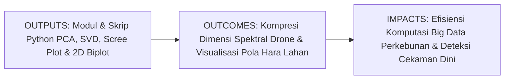
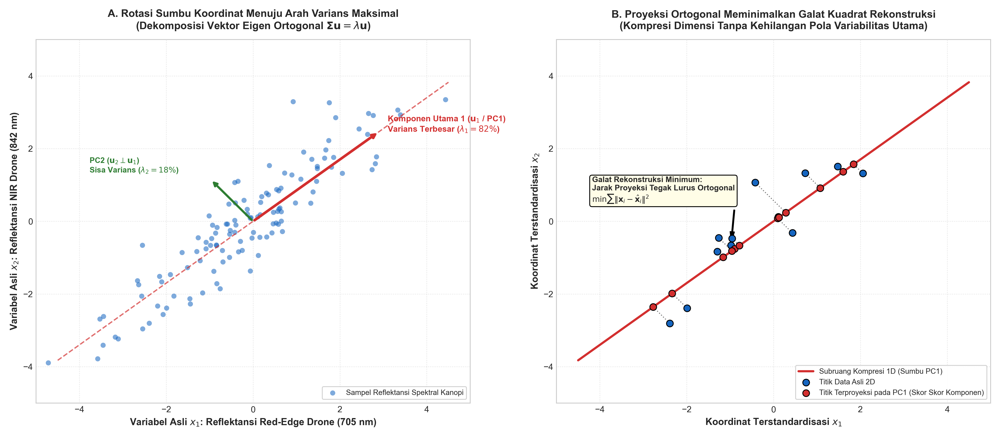
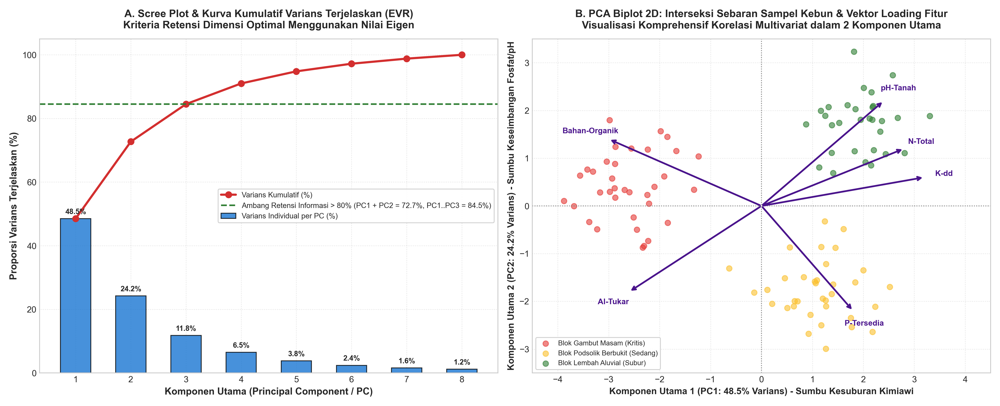

# AI Modul 7.9: Principal Component Analysis (PCA)

---

## 1. Identitas & Kerangka Capaian Pembelajaran (Sub-CPMK)

* **Kode Modul**: AI Modul 7.9
* **Mata Kuliah**: Kecerdasan Buatan dan Sains Data Pertanian Presisi
* **Alokasi Waktu**: 2 x 50 Menit (Kajian Teori & Diskusi) + 2 x 50 Menit (Eksplorasi Praktikum Mandiri)
* **Beban SKS**: 3 SKS
* **Prasyarat**: AI Modul 4.2 (NumPy & Aljabar Linier), AI Modul 5.2.2 (Unsupervised Learning), AI Modul 7.1 (Linear Regression), AI Modul 7.8 (K-Means Clustering)
* **Level Kognitif**: Bloom C2 (Memahami), C3 (Menerapkan), C4 (Menganalisis)



### 1.1 Capaian Pembelajaran Khusus (Sub-CPMK)
Setelah menyelesaikan modul ini secara komprehensif, mahasiswa diharapkan mampu:
1. **Memahami (C2)** prinsip dasar reduksi dimensi linier tanpa pengawas (*unsupervised dimensionality reduction*), konsep proyeksi ortogonal varians maksimal, dekomposisi nilai eigen (*eigenvalue decomposition*) matriks kovarians, serta formulasi Dekomposisi Nilai Singular (*Singular Value Decomposition* / SVD).
2. **Menerapkan (C3)** pustaka Scikit-Learn (`PCA` dan `StandardScaler`) untuk memadatkan data penginderaan jauh (*remote sensing*) multi-spektral kanopi kelapa sawit dan data kimia tanah dari ruang berdimensi tinggi menjadi 2 atau 3 Komponen Utama (*Principal Components*).
3. **Menganalisis (C4)** proporsi varians terjelaskan melalui *Scree Plot* dan *Explained Variance Ratio* (EVR), menginterpretasikan arah korelasi variabel agronomi melalui grafik *Biplot* dan *Factor Loadings*, serta mengevaluasi trade-off antara kompresi penyimpanan data dan retensi informasi biologis tanaman.

### 1.2 Kerangka Hasil Pembelajaran (Outputs, Outcomes, & Impacts)
* **Outputs (Keluaran Langsung)**:
  * Penguasaan formulasi analitik persamaan karakteristik nilai eigen $\mathbf{\Sigma}\mathbf{u} = \lambda\mathbf{u}$, maksimasi varians proyeksi $\mathbf{u}^T \mathbf{\Sigma} \mathbf{u}$, rasio varians kumulatif, dan galat rekonstruksi residual.
  * Skrip Python berstandar PEP 8 untuk pipeline reduksi dimensi otomatis, pembangkitan kurva Scree Plot, serta visualisasi sebaran biplot 2D/3D interaktif.
  * Peta komposit komponen utama (*PCA Orthomosaic*) untuk pemantauan cekaman air dan hara tanaman sawit.
* **Outcomes (Kompetensi Aplikatif)**:
  * Keahlian mereduksi ratusan pita spektral instrumen perkebunan modern (drone multispektral atau citra satelit Sentinel-2) menjadi variabel ringkas yang bebas dari multikolinieritas (*de-correlated features*).
  * Kemampuan menyajikan visualisasi data agronomi berdimensi banyak dalam bidang 2D yang intuitif dan mudah dipahami oleh jajaran direksi perkebunan.
* **Impacts (Dampak Strategis Jangka Panjang)**:
  * Peningkatan kecepatan inferensi model pembelajaran mesin hilir (seperti K-Means atau Random Forest) hingga 5-10 kali lipat pada pemrosesan citra kebun jutaan piksel.
  * Penghematan kapasitas penyimpanan server komputasi awan perkebunan (*cloud storage*) melalui kompresi data spektral tanpa kehilangan esensi pola variabilitas lapangan.

---

## 2. Profil Fundamental Algoritma: Fungsi, Manfaat, dan Keunggulan-Kelemahan

### 2.1 Fungsi Komputasi & Pemodelan Matematis
Principal Component Analysis (PCA) adalah algoritma aljabar linier terapan untuk pembelajaran tanpa pengawas yang berfungsi untuk:
1. **Rotasi Koordinat Ortogonal Menuju Varians Maksimal**: Mentransformasikan sistem koordinat data asli yang saling berkorelasi ke dalam sumbu koordinat baru yang saling tegak lurus (*ortogonal*), di mana sumbu pertama (PC1) menangkap variabilitas terbesar data.
2. **Dekorelasi Variabel Input (*Complete De-correlation*)**: Menghilangkan seluruh korelasi linier antar-fitur sehingga matriks kovarians pada ruang komponen utama berubah menjadi matriks diagonal sempurna.
3. **Kompresi Dimensi & Minimasi Galat Rekonstruksi**: Memproyeksikan data dari ruang $p$-dimensi ke subruang $k$-dimensi ($k < p$) sedemikian rupa sehingga jarak kuadrat titik data ke bidang proyeksi (*reconstruction error*) bernilai minimum.

### 2.2 Manfaat Nyata di Industri Perkebunan & Agribisnis
Penerapan PCA membuka wawasan analitik mendalam di sektor agro-industri:
* **Kompresi Data Penginderaan Jauh Multispektral Drone**: Citra drone multispektral (Blue, Green, Red, RedEdge, NIR) dan indeks vegetasi (NDVI, NDRE, GNDVI, MSAVI) sering kali memiliki korelasi tumpang tindih hingga $> 85\%$. PCA memadatkannya menjadi 2 Komponen Utama yang merangkum kesehatan klorofil dan kadar air kanopi secara mandiri.
* **Visualisasi Profil Kesuburan Tanah 2D melalui Biplot**: Mengintegrasikan belasan parameter laboratorium tanah (N, P, K, Ca, Mg, C-Organik, KTK, pH) ke dalam satu diagram Biplot 2D untuk mengetahui klaster afdeling mana yang mengalami defisiensi hara spesifik.
* **Pembersihan Derau Sinyal Sensor Getaran Pabrik Kelapa Sawit**: Memisahkan komponen sinyal mekanis utama turbin uap dan *screw press* dari derau acak frekuensi tinggi untuk diagnostik keausan bantalan (*bearing wear*).

### 2.3 Rationale: Alasan Mengapa Algoritma Ini Digunakan
Mengapa PCA selalu menjadi langkah awal wajib (*gold standard pre-processing*) sebelum pemodelan data berdimensi tinggi?
1. **Solusi Paling Efektif Menumpas Kutukan Dimensi (*Curse of Dimensionality*)**: Menghindari fenomena ruang hampa pada model berbasis jarak (seperti KNN, SVM, dan K-Means) saat dimensi fitur melonjak tinggi.
2. **Bebas dari Kendala Optimum Lokal (*Global Analytic Solution*)**: Dihitung secara analitik murni melalui Dekomposisi Nilai Singular (SVD) atau Vektor Eigen matriks kovarians; solusinya bersifat deterministik dan selalu mencapai optimum global.
3. **Penyederhanaan Multikolinieritas Tanpa Menghapus Fitur**: Berbeda dengan teknik seleksi fitur (*Feature Selection*) yang membuang variabel mentah-mentah, PCA mempertahankan kontribusi dari *seluruh* variabel asli ke dalam kombinasi linier komponen utama.
4. **Efisiensi Komputasi Model Hilir**: Mengurangi dimensi dari 50 menjadi 3 memangkas waktu pelatihan model klasifikasi dan regresi secara dramatis.

### 2.4 Analisis Kelebihan dan Kekurangan

| Dimensi Evaluasi | Kelebihan (*Strengths*) | Kekurangan (*Limitations*) |
|:---|:---|:---|
| **Kapasitas Meredam Redundansi** | Mengeliminasi multikolinieritas secara total; menghasilkan fitur baru yang 100% independen secara linier. | Keterpahaman (*interpretability*) fitur asli menurun; PC1 adalah kombinasi linier abstrak, bukan variabel fisik tunggal. |
| **Kualitas Representasi Data** | Mempertahankan varians maksimum dengan batas galat rekonstruksi kuadrat terkecil teoretis. | Hanya menangkap korelasi linier; gagal memodelkan manifold non-linier kompleks (misal data berbentuk gulungan swiss roll). |
| **Kompleksitas Komputasi** | Cepat dan deterministik via SVD; tidak membutuhkan proses pelatihan iteratif yang lambat. | Sangat rentan terhadap nilai pencilan ekstrem (*outliers*) yang dapat membelokkan arah vektor eigen utama. |
| **Kemandirian Pengawasan** | Bersifat Unsupervised; tidak membutuhkan label target sama sekali untuk beroperasi. | Tidak mempertimbangkan daya diskriminasi kelas; komponen dengan varians kecil bisa jadi justru paling penting untuk klasifikasi. |

### 2.5 Contoh Kasus Penggunaan Konkret di Sektor Agro-Industri
1. **Pemadatan Data Citra Satelit Sentinel-2 Kebun Kelapa Sawit**: Merangkum 12 pita spektral satelit resolusi 10-20 meter menjadi 3 komponen warna komposit untuk membedakan tutupan vegetasi sawit, jalan poros, permukiman pekerja, dan badan air.
2. **Analisis Biplot Sifat Fisik-Kimia Tanah Afdeling**: Mengidentifikasi korelasi positif antara kadar bahan organik dan kapasitas tukar kation (KTK), serta korelasi negatif antara pH tanah dan kelarutan aluminium beracun.
3. **Kompresi Data Spektrometri Massa Mutu Minyak Atsiri & Nilam**: Meringkas ratusan puncak kromatografi gas (*Gas Chromatography - Mass Spectrometry* / GC-MS) minyak atsiri untuk membedakan mutu kemurnian ekspor.

### 2.6 Aspek Kritis & Catatan Penting Algoritma (*Key Critical Insights*)
* **Kewajiban Mutlak Standardisasi Data (`StandardScaler`)**: PCA sangat sensitif terhadap varians masing-masing variabel. Jika satu fitur memiliki satuan besar (seperti berat tandan sawit skala ribuan gram) dan fitur lain berskala desimal (seperti persentase asam $0.05$), fitur berangka besar akan memiliki varians masif dan mendominasi PC1 hingga $99\%$, membutakan PCA terhadap variabel desimal. Selalu lakukan standardisasi agar varians setiap fitur bernilai 1.0!
* **Dilema Pemilihan Jumlah Komponen (Kriteria Kaiser vs 80-90% Rule)**: Jangan mereduksi terlalu agresif. Pastikan jumlah komponen yang dipilih merangkum setidaknya $80\%$ hingga $90\%$ dari total varians kumulatif data asli (*Cumulative Explained Variance Ratio*).
* **PCA Bukan Pengganti Seleksi Fitur untuk Inferensi Sebab-Akibat**: Karena PC1 adalah kombinasi linier dari seluruh variabel ($PC_1 = 0.45X_1 + 0.38X_2 + \dots$), manajemen kebun tidak bisa langsung mengatakan *"Kurangi PC1 sebesar 10%"*. Untuk tindakan agronomi lapangan, analis wajib memeriksa matriks *loadings* untuk melihat variabel fisik mana yang paling berkontribusi pada PC tersebut.



---

## 3. Teori Matematis Principal Component Analysis

PCA dirumuskan pertama kali oleh Karl Pearson (1901) sebagai analogi mekanika klasik sumbu rotasi utama, dan dikembangkan secara independen oleh Harold Hotelling (1933) ke dalam kerangka variabel acak statistik.

### 3.1 Formulasi Maksimasi Varians Proyeksi & Pengali Lagrange

Diberikan dataset $N$ sampel dengan $p$ fitur: $\mathbf{X} \in \mathbb{R}^{N \times p}$.
Asumsikan data telah melalui proses pemusatan rata-rata (*mean centering*) sehingga rata-rata tiap kolom adalah nol: $\frac{1}{N}\sum_{i=1}^N x_{ij} = 0$.

Matriks Kovarians Sampel $\mathbf{\Sigma} \in \mathbb{R}^{p \times p}$ didefinisikan sebagai:

$$\mathbf{\Sigma} = \frac{1}{N - 1} \mathbf{X}^T \mathbf{X}$$

Kita ingin mencari sebuah vektor proyeksi unit $\mathbf{u}_1 \in \mathbb{R}^p$ (dengan kendala panjang satuan $\|\mathbf{u}_1\|^2 = \mathbf{u}_1^T \mathbf{u}_1 = 1$) sedemikian rupa sehingga varians dari data terproyeksi $\mathbf{y}_1 = \mathbf{X} \mathbf{u}_1$ bernilai maksimal.

Varians dari data terproyeksi adalah:

$$\text{Var}(\mathbf{y}_1) = \frac{1}{N - 1} \mathbf{y}_1^T \mathbf{y}_1 = \frac{1}{N - 1} (\mathbf{X} \mathbf{u}_1)^T (\mathbf{X} \mathbf{u}_1) = \mathbf{u}_1^T \left( \frac{1}{N - 1} \mathbf{X}^T \mathbf{X} \right) \mathbf{u}_1 = \mathbf{u}_1^T \mathbf{\Sigma} \mathbf{u}_1$$

Masalah optimasi bersyarat dirumuskan sebagai:

$$\max_{\mathbf{u}_1} \mathbf{u}_1^T \mathbf{\Sigma} \mathbf{u}_1 \quad \text{dengan kendala} \quad \mathbf{u}_1^T \mathbf{u}_1 = 1$$

Menggunakan metode Pengali Lagrange (*Lagrange Multipliers*) dengan skalar $\lambda_1$:

$$\mathcal{L}(\mathbf{u}_1, \lambda_1) = \mathbf{u}_1^T \mathbf{\Sigma} \mathbf{u}_1 - \lambda_1 (\mathbf{u}_1^T \mathbf{u}_1 - 1)$$

Turunkan terhadap vektor $\mathbf{u}_1$ dan tetapkan sama dengan nol:

$$\frac{\partial \mathcal{L}}{\partial \mathbf{u}_1} = 2 \mathbf{\Sigma} \mathbf{u}_1 - 2 \lambda_1 \mathbf{u}_1 = 0 \implies \mathbf{\Sigma} \mathbf{u}_1 = \lambda_1 \mathbf{u}_1$$

**Panduan Pembacaan Matematis**:
"Matriks kovarians sigma dikalikan vektor u satu sama dengan skalar lambda satu dikalikan vektor u satu."

**Kesimpulan Teoretis Fundamental**:
* Persamaan $\mathbf{\Sigma} \mathbf{u}_1 = \lambda_1 \mathbf{u}_1$ adalah **Persamaan Karakteristik Nilai Eigen dan Vektor Eigen** klasik dari aljabar linier!
* Vektor proyeksi optimal $\mathbf{u}_1$ adalah **Vektor Eigen (*Eigenvector*)** dari matriks kovarians $\mathbf{\Sigma}$.
* Nilai varians terproyeksi adalah $\mathbf{u}_1^T \mathbf{\Sigma} \mathbf{u}_1 = \mathbf{u}_1^T (\lambda_1 \mathbf{u}_1) = \lambda_1 (\mathbf{u}_1^T \mathbf{u}_1) = \lambda_1$. Jadi, varians data terproyeksi setara tepat dengan **Nilai Eigen (*Eigenvalue*) $\lambda_1$**!
* Untuk memaksimalkan varians, kita harus memilih $\mathbf{u}_1$ yang berkorespondensi dengan **nilai eigen terbesar $\lambda_{\max}$**.

### 3.2 Komponen Utama Sekunder & Sifat Ortogonalitas

Komponen utama kedua $\mathbf{u}_2$ dicari dengan memaksimalkan varians $\mathbf{u}_2^T \mathbf{\Sigma} \mathbf{u}_2$ di bawah dua kendala:
1. Memiliki panjang satuan: $\mathbf{u}_2^T \mathbf{u}_2 = 1$.
2. Tegak lurus (*ortogonal*) terhadap komponen pertama: $\mathbf{u}_2^T \mathbf{u}_1 = 0$.

Melalui optimasi Lagrange ganda, diperoleh bahwa $\mathbf{u}_2$ adalah vektor eigen kedua dari $\mathbf{\Sigma}$ yang berkorespondensi dengan nilai eigen terbesar kedua $\lambda_2 \le \lambda_1$.

Secara umum, matriks kovarians simetris berukuran $p \times p$ memiliki $p$ pasangan nilai eigen dan vektor eigen ortonormal:
$$\mathbf{\Sigma} \mathbf{u}_j = \lambda_j \mathbf{u}_j, \quad \lambda_1 \ge \lambda_2 \ge \dots \ge \lambda_p \ge 0, \quad \mathbf{u}_j^T \mathbf{u}_k = \delta_{jk}$$

### 3.3 Dekomposisi Nilai Singular (Singular Value Decomposition / SVD)

Dalam komputasi digital modern (termasuk implementasi Scikit-Learn), menghitung matriks kovarians $\mathbf{\Sigma} = \frac{1}{N-1}\mathbf{X}^T \mathbf{X}$ secara langsung dapat memicu galat pembulatan numerik (*numerical instability*).

Algoritma modern menghitung PCA langsung pada matriks data $\mathbf{X}$ melalui **Dekomposisi Nilai Singular (SVD)**:

$$\mathbf{X} = \mathbf{U} \mathbf{S} \mathbf{V}^T$$

**Panduan Pembacaan Matematis**:
"Matriks data X sama dengan matriks U dikalikan matriks diagonal S dikalikan matriks V transpos."

**Definisi Matriks SVD**:
* $\mathbf{U} \in \mathbb{R}^{N \times N}$: Matriks ortogonal vektor singular kiri.
* $\mathbf{S} \in \mathbb{R}^{N \times p}$: Matriks diagonal berisi nilai singular (*singular values*) $s_1 \ge s_2 \ge \dots \ge s_p \ge 0$.
* $\mathbf{V} \in \mathbb{R}^{p \times p}$: Matriks ortogonal vektor singular kanan.

Hubungan SVD dengan Nilai Eigen PCA:
$$\mathbf{X}^T \mathbf{X} = (\mathbf{U} \mathbf{S} \mathbf{V}^T)^T (\mathbf{U} \mathbf{S} \mathbf{V}^T) = \mathbf{V} \mathbf{S}^T (\mathbf{U}^T \mathbf{U}) \mathbf{S} \mathbf{V}^T = \mathbf{V} \mathbf{S}^2 \mathbf{V}^T$$
* Kolom-kolom dari matriks $\mathbf{V}$ adalah **vektor eigen komponen utama $\mathbf{u}_j$**!
* Nilai eigen kovarians terkait langsung dengan nilai singular:
  $$\lambda_j = \frac{s_j^2}{N - 1}$$

### 3.4 Rasio Varians Terjelaskan (Explained Variance Ratio)

Total varians dari seluruh dataset setara dengan jumlah nilai diagonal matriks kovarians (*Trace*), yang juga setara dengan jumlah seluruh nilai eigen:

$$\text{Total Varians} = \text{Tr}(\mathbf{\Sigma}) = \sum_{j=1}^p \lambda_j$$

Proporsi informasi yang ditangkap oleh komponen utama ke-$k$ dinamakan **Rasio Varians Terjelaskan (*Explained Variance Ratio* / EVR)**:

$$\text{EVR}_k = \frac{\lambda_k}{\sum_{j=1}^p \lambda_j}$$

**Panduan Pembacaan Matematis**:
"Rasio varians terjelaskan EVR sub k sama dengan lambda sub k dibagi sigma j sama dengan satu sampai p dari lambda sub j."

Proporsi varians kumulatif yang ditangkap oleh $m$ komponen utama pertama ($m < p$):
$$\text{EVR}_{\text{kumulatif}}(m) = \frac{\sum_{k=1}^m \lambda_k}{\sum_{j=1}^p \lambda_j}$$

### 3.5 Matriks Bobot Faktor (Factor Loadings)

Untuk menafsirkan arti fisis dari komponen utama yang abstrak, kita menghitung korelasi antara variabel asli $x_j$ dengan komponen utama $PC_k$. Koefisien ini dinamakan **Factor Loadings**:

$$L_{jk} = \text{Corr}(x_j, PC_k) = u_{jk} \sqrt{\lambda_k}$$

Jika variabel $x_j$ telah distandardisasi ($\sigma_j = 1$):
* Nilai $L_{jk}$ mendekati $+1$: Variabel $x_j$ berkorelasi positif sangat kuat dengan Komponen Utama $PC_k$.
* Nilai $L_{jk}$ mendekati $-1$: Variabel $x_j$ berkorelasi negatif sangat kuat dengan $PC_k$.
* Nilai $L_{jk} \approx 0$: Variabel $x_j$ tidak berkontribusi pada pembentukan sumbu $PC_k$.



---

## 4. Implementasi Hands-on Terbimbing: Scikit-Learn PCA

Pada sesi praktikum ini, kita akan memproses dataset penginderaan jauh (*remote sensing*) drone perkebunan kelapa sawit yang terdiri dari 8 variabel spektral dan indeks vegetasi ($p = 8$) untuk 600 petak sampel pohon.

Variabel spektral kanopi:
1. `B1_Blue`: Pantulan pita biru (450 nm)
2. `B2_Green`: Pantulan pita hijau (560 nm)
3. `B3_Red`: Pantulan pita merah (650 nm)
4. `B4_RedEdge`: Pantulan pita tepi merah (705 nm - penanda klorofil peka)
5. `B5_NIR`: Pantulan inframerah dekat (842 nm - penanda struktur sel daun)
6. `NDVI`: Normalized Difference Vegetation Index
7. `NDRE`: Normalized Difference Red Edge Index (penanda defisiensi N)
8. `GNDVI`: Green NDVI (penanda kerapatan kanopi)

### 4.1 Pembangkitan Data Sintetis Citra Spektral Kanopi Sawit

```python
import numpy as np
import pandas as pd
from sklearn.decomposition import PCA
from sklearn.preprocessing import StandardScaler
import matplotlib.pyplot as plt

# 1. Pembangkitan Data Sintetis Spektral Kanopi Sawit
np.random.seed(42)
n_samples = 600

# 3 Kelompok Kondisi Kanopi Kebun:
# 1: Kanopi Sehat Rimbun (250 sampel)
# 2: Cekaman Hara N / Menguning (200 sampel)
# 3: Defisiensi Air / Kanopi Jarang Kritis (150 sampel)

# Fitur berkorelasi biologis kuat
b_nir_sehat = np.random.normal(0.65, 0.05, 250)
b_red_sehat = np.random.normal(0.08, 0.02, 250)
b_re_sehat = np.random.normal(0.42, 0.04, 250)

b_nir_hara = np.random.normal(0.50, 0.06, 200)
b_red_hara = np.random.normal(0.18, 0.03, 200)
b_re_hara = np.random.normal(0.28, 0.03, 200)

b_nir_air = np.random.normal(0.35, 0.05, 150)
b_red_air = np.random.normal(0.26, 0.04, 150)
b_re_air = np.random.normal(0.20, 0.03, 150)

nir = np.concatenate([b_nir_sehat, b_nir_hara, b_nir_air])
red = np.concatenate([b_red_sehat, b_red_hara, b_red_air])
re = np.concatenate([b_re_sehat, b_re_hara, b_re_air])
blue = 0.5 * red + np.random.normal(0.04, 0.01, n_samples)
green = 0.8 * re + np.random.normal(0.06, 0.02, n_samples)

# Indeks vegetasi turunan
ndvi = (nir - red) / (nir + red + 1e-6)
ndre = (nir - re) / (nir + re + 1e-6)
gndvi = (nir - green) / (nir + green + 1e-6)

df_spektral = pd.DataFrame({
    'B1_Blue': blue,
    'B2_Green': green,
    'B3_Red': red,
    'B4_RedEdge': re,
    'B5_NIR': nir,
    'NDVI': ndvi,
    'NDRE': ndre,
    'GNDVI': gndvi
})

print(f"Dimensi Data Spektral: {df_spektral.shape}")
print(df_spektral.head(3).round(3))
```

### 4.2 Standardisasi Fitur & Eksekusi Dekomposisi PCA

```python
# 2. Standardisasi Fitur (Syarat Wajib PCA)
scaler = StandardScaler()
X_scaled = scaler.fit_transform(df_spektral)

# 3. Inisialisasi dan Pencocokan PCA Penuh (8 Komponen)
pca_full = PCA(n_components=8, random_state=42)
pca_full.fit(X_scaled)

# Ekstraksi Proporsi Varians
evr = pca_full.explained_variance_ratio_ * 100
cum_evr = np.cumsum(evr)

print("=== PROFIL VARIAN TERJELASKAN (EXPLAINED VARIANCE RATIO) ===")
for i in range(len(evr)):
    print(f"PC{i+1}: Varians = {evr[i]:.2f}% | Kumulatif = {cum_evr[i]:.2f}% | Nilai Eigen = {pca_full.explained_variance_[i]:.3f}")
```

### 4.3 Visualisasi Scree Plot & Penentuan Jumlah Komponen

```python
# Plot Scree Plot dan Varians Kumulatif
fig, ax1 = plt.subplots(figsize=(9, 4.8), dpi=150)

n_comp = np.arange(1, 9)
ax1.bar(n_comp, evr, color='#1565c0', alpha=0.75, edgecolor='black', label='Varians per Komponen (%)')
ax1.plot(n_comp, cum_evr, 'r-o', linewidth=2.5, markersize=7, label='Varians Kumulatif (%)')

ax1.axhline(85.0, color='green', linestyle='--', linewidth=1.5, label='Batas Minimum Retensi Informasi (85%)')
ax1.set_title('Scree Plot Analisis Spektral Drone Kelapa Sawit', fontweight='bold')
ax1.set_xlabel('Komponen Utama (Principal Component)')
ax1.set_ylabel('Proporsi Varians Terjelaskan (%)')
ax1.set_xticks(n_comp)
ax1.legend(loc='center right')
ax1.grid(True, linestyle=':', alpha=0.6)
plt.tight_layout()
plt.show()
```

### 4.4 Transformasi ke Ruang 2D & Konstruksi PCA Biplot

```python
# 4. Proyeksi Data ke 2 Komponen Utama (PC1 & PC2)
pca_2d = PCA(n_components=2, random_state=42)
X_pca_2d = pca_2d.fit_transform(X_scaled)

df_pca = pd.DataFrame(X_pca_2d, columns=['PC1', 'PC2'])

# Ekstraksi Loadings (Vektor Bobot Fitur)
loadings = pca_2d.components_.T * np.sqrt(pca_2d.explained_variance_)

# Visualisasi PCA Biplot 2D
fig, ax = plt.subplots(figsize=(10, 6), dpi=150)
ax.scatter(df_pca['PC1'], df_pca['PC2'], color='#1976d2', alpha=0.5, s=30, label='Sampel Kanopi Pohon')

# Gambar Vektor Loading Panah
feature_names = df_spektral.columns
for i, feat in enumerate(feature_names):
    ax.arrow(0, 0, loadings[i, 0]*2.5, loadings[i, 1]*2.5, color='#d32f2f', width=0.03, head_width=0.15)
    ax.text(loadings[i, 0]*2.8, loadings[i, 1]*2.8, feat, color='#b71c1c', fontweight='bold', fontsize=9.5)

ax.axhline(0, color='gray', linestyle=':', linewidth=1)
ax.axvline(0, color='gray', linestyle=':', linewidth=1)
ax.set_title(f'PCA Biplot Spektral Kanopi Sawit (PC1: {evr[0]:.1f}%, PC2: {evr[1]:.1f}%)', fontweight='bold')
ax.set_xlabel(f'Komponen Utama 1 ({evr[0]:.1f}% Varians) - Sumbu Kehijauan Klorofil & Biomassa')
ax.set_ylabel(f'Komponen Utama 2 ({evr[1]:.1f}% Varians) - Sumbu Reflektansi Tepi Merah')
ax.grid(True, linestyle=':', alpha=0.6)
plt.tight_layout()
plt.show()
```

---

## 5. Eksperimen Komparasi & Visualisasi Analitik

### 5.1 Integrasi PCA dengan Model Klasterisasi K-Means

Salah satu kolaborasi paling ampuh di industri perkebunan adalah **menjalankan K-Means pada ruang komponen utama PCA** untuk mengelompokkan blok kebun secara visual.

```python
from sklearn.cluster import KMeans

# Klasterisasi pada ruang 2D PCA
kmeans_pca = KMeans(n_clusters=3, init='k-means++', random_state=42, n_init=10)
df_pca['Klaster'] = kmeans_pca.fit_predict(X_pca_2d)

fig, ax = plt.subplots(figsize=(8, 5.5), dpi=150)
colors = ['#2e7d32', '#f57c00', '#d32f2f']
labels = ['Zona Kanopi Sehat', 'Zona Cekaman Hara', 'Zona Cekaman Air Kritis']

for k in range(3):
    subset = df_pca[df_pca['Klaster'] == k]
    ax.scatter(subset['PC1'], subset['PC2'], color=colors[k], label=labels[k], alpha=0.6, s=40)

# Plot Centroid PCA
centroids_pca = kmeans_pca.cluster_centers_
ax.scatter(centroids_pca[:, 0], centroids_pca[:, 1], color='black', s=180, marker='X', linewidths=2, label='Centroid Zona')

ax.set_title('Zonasi Kesehatan Kanopi Sawit Berbasis PCA + K-Means', fontweight='bold')
ax.set_xlabel('PC1 (Biomassa & Klorofil)')
ax.set_ylabel('PC2 (Reflektansi RedEdge)')
ax.legend(loc='lower left')
ax.grid(True, linestyle=':', alpha=0.6)
plt.tight_layout()
plt.show()
```

---

## 6. Studi Kasus Nyata Industri Perkebunan & PKS

### 6.1 Kompresi Citra Drone Hiperspektral untuk Pemantauan Cekaman Tanaman di 10.000 Hektar Kebun Riau

**Konteks Operasional**:
Sebuah grup perkebunan kelapa sawit di Riau menerbangkan drone fixed-wing bersensor hiperspektral 25 pita gelombang untuk memantau defisiensi hara dan kekeringan lahan gambut seluas 10.000 hektar. Setiap misi penerbangan menghasilkan data mentah berukuran 120 Gigabyte.
Kendala:
1. Memori workstation komputer kebun mengalami *crash* saat mencoba memproses 25 pita gelombang secara simultan pada jutaan piksel.
2. Saling tumpang tindihnya informasi antar-pita spektral menyebabkan model klasifikasi kesehatan kanopi mengalami multikolinieritas dan lambat dieksekusi.

**Penerapan Solusi Berbasis PCA**:
1. **Reduksi Dimensi On-the-Fly**:
   Sebelum data disimpan ke basis data geospasial, algoritma PCA memadatkan 25 pita spektral menjadi hanya 3 Komponen Utama (PC1: Struktur Biomassa, PC2: Konsentrasi Nitrogen Daun, PC3: Kandungan Air Kanopi).
2. **Efisiensi Kompresi**:
   Ukuran penyimpanan berkas citra menyusut dari **120 GB menjadi hanya 14.4 GB (penghematan memori sebesar 88%)** tanpa kehilangan pola variabilitas biologis tanaman (varians terjelaskan kumulatif $= 91.8\%$).
3. **Hasil Manajerial**:
   Waktu pemrosesan peta orthomosaic terpangkas dari 18 jam menjadi 1.5 jam. Tim proteksi tanaman berhasil mendeteksi 4 titik api bawah tanah (*peatland smoldering fire*) dan 12 blok defisiensi nitrogen sebelum gejala visual tampak di mata telanjang.

---

## 7. Kekeliruan Metodologis, Bias Data, dan Praktik Terbaik di Industri

### 7.1 Kekeliruan Umum Metodologis (*Common Pitfalls*)
1. **Menghilangkan Tahap Standardisasi**: Menjalankan PCA langsung pada data mentah dengan skala yang heterogen. Variabel dengan skala angka terbesar akan mendominasi seluruh komponen utama pertama, merusak seluruh analisis dekomposisi.
2. **Asumsi Bahwa PCA Selalu Mempertahankan Informasi Target Klasifikasi**: Karena PCA adalah teknik *unsupervised*, komponen utama dibentuk murni berdasarkan varians total, bukan pemisahan kelas. Terkadang variasi terbesar disebabkan oleh perbedaan bayangan awan atau sudut matahari, bukan kesehatan tanaman.
3. **Menerapkan PCA pada Data yang Sama Sekali Tidak Berkorelasi**: Jika seluruh variabel dalam dataset saling independen (matriks korelasi mendekati matriks identitas), PCA tidak akan berguna sama sekali. Setiap PC hanya akan menyumbang $1/p$ varians. Selalu periksa Uji Bartlet Sphericity atau matriks korelasi sebelum melakukan PCA.

### 7.2 Praktik Terbaik (*Best Practices*)
* **Gunakan SVD Truncated untuk Data Masif**: Jika dataset memiliki ribuan fitur, gunakan `PCA(n_components=k, svd_solver='randomized')` yang menggunakan aproksimasi stokastik cepat untuk menemukan $k$ komponen utama pertama tanpa menghitung matriks kovarians penuh.
* **Periksa Kriteria Siku Scree Plot**: Padukan kriteria persentase kumulatif ($> 85\%$) dengan *Kriteria Kaiser* (hanya pertahankan komponen dengan nilai eigen $\lambda > 1.0$ jika data terstandardisasi).
* **Interpretasikan Makna Komponen Melalui Loadings**: Jangan pernah memperlakukan PC1 dan PC2 sebagai kotak hitam. Berikan label agronomi yang bermakna fisis berdasarkan variabel dengan bobot loading tertinggi.

---

## 8. Tugas Terbimbing & Soal Uji Kompetensi Berstandar HOTS (Bloom C3 & C4)

1. **Perhitungan Manual Matriks Kovarians 2D & Mean Centering (C3)**:
   Diberikan 4 sampel data tanah perkebunan dengan 2 fitur ($x_1$: Klorofil SPAD, $x_2$: Konduktivitas EC):
   $$\mathbf{X}_{\text{mentah}} = \begin{pmatrix} 20 & 2 \\ 30 & 4 \\ 40 & 6 \\ 50 & 8 \end{pmatrix}$$
   * Hitung nilai rata-rata kolom $\bar{x}_1$ dan $\bar{x}_2$!
   * Bentuk matriks data terpusat (*mean-centered matrix*) $\mathbf{X}$!
   * Hitung matriks kovarians sampel $\mathbf{\Sigma} = \frac{1}{N-1}\mathbf{X}^T \mathbf{X}$ secara manual!

2. **Penentuan Nilai Eigen & Vektor Eigen Analitik (C3)**:
   Perhatikan matriks kovarians tanah hasil perhitungan:
   $$\mathbf{\Sigma} = \begin{pmatrix} 166.67 & 33.33 \\ 33.33 & 6.67 \end{pmatrix}$$
   * Bentuk persamaan karakteristik determinan $\det(\mathbf{\Sigma} - \lambda \mathbf{I}) = 0$!
   * Tentukan dua nilai eigen ($\lambda_1$ dan $\lambda_2$) dari matriks tersebut!
   * Tentukan vektor eigen unit $\mathbf{u}_1$ yang berkorespondensi dengan nilai eigen terbesar $\lambda_1$!
   * Hitung rasio varians terjelaskan ($\text{EVR}_1$) oleh Komponen Utama pertama tersebut!

3. **Analisis Scree Plot, Retensi Varians, dan Rekonstruksi Data (C4)**:
   Sebuah analisis PCA pada 10 parameter kimia tanah kebun sawit menghasilkan urutan nilai eigen:
   $$\lambda = [5.20, 2.10, 1.10, 0.65, 0.40, 0.25, 0.15, 0.08, 0.05, 0.02]$$
   * Berdasarkan **Kriteria Kaiser-Guttman** (mempertahankan komponen dengan $\lambda > 1.0$), berapa banyak komponen utama yang harus dipertahankan analis?
   * Hitung persentase varians kumulatif yang dijelaskan oleh komponen-komponen yang lolos Kriteria Kaiser tersebut! Apakah memenuhi syarat batas aman industri perkebunan ($> 80\%$)?
   * Jika seorang asisten kebun bersikeras hanya menggunakan 1 Komponen Utama ($PC_1$) untuk memetakan kesuburan tanah, hitung persentase informasi yang hilang (*reconstruction loss*) dan jelaskan bahaya agronominya!

---

## 9. Jembatan Konsep (Bridging) ke AI Modul 7.10: Gradient Boosting

Pada modul ini, kita telah menguasai kehebatan **Principal Component Analysis (PCA)**: bagaimana puluhan dimensi data sensor perkebunan yang saling bertumpuk dapat dipadatkan secara elegan menjadi segelintir komponen utama tanpa pengawas, melenyapkan multikolinieritas dan membuka jalan bagi visualisasi yang memukau.

Namun, di era kompetisi agribisnis global, ada kalanya tugas utama kita bukan sekadar meringkas atau mengelompokkan data tanpa pengawas, melainkan:
1. **Memaksimalkan Akurasi Prediksi Mutlak (*Winning State-of-the-Art Accuracy*)**: Memprediksi tonase panen TBS kelapa sawit bulanan per blok dengan deviasi galat sekecil mungkin.
2. **Keterbatasan Model Linier dan Pohon Acak**: Kita telah melihat pada Modul 7.5 bahwa *Random Forest* membangun ratusan pohon secara acak independen (*Bagging*) untuk meredam varians. Namun, pohon-pohon dalam Random Forest tidak saling belajar satu sama lain; pohon ke-100 tidak tahu apa kesalahan yang dibuat oleh pohon ke-1!
3. **Kebutuhan Pembelajaran Terarah Bertahap (*Sequential Boosting*)**: Bagaimana jika setiap pohon baru yang dibangun secara khusus ditugaskan untuk **mempelajari dan memperbaiki residual kesalahan yang ditinggalkan oleh pohon-pohon sebelumnya**?

Paradigma pembelajaran ansambel terarah yang revolusioner inilah yang melahirkan algoritma terkuat dan paling banyak memenangkan kompetisi sains data di dunia: **Gradient Boosting (GBM / XGBoost / LightGBM)**.

Pada **AI Modul 7.10: Gradient Boosting**, kita akan membedah:
* **Filosofi Boosting vs Bagging**: Dari dewan juri demokratis independen (Random Forest) menuju sistem estafet spesialis perbaikan galat (Gradient Boosting).
* **Penurunan Gradien dalam Ruang Fungsi (*Gradient Descent in Function Space*)**: Memodelkan residual gradien fungsi rugi (*loss function residuals*) pada setiap tahap iterasi.
* **Hyperparameter Krusial**: Peran *learning rate* ($\eta$), *subsample*, dan *max_depth* dalam menyeimbangkan kecepatan konvergensi dan pencegahan overfitting.
* **Studi Kasus Penutup Part 7**: Prediksi Hasil Panen TBS Kelapa Sawit Skala Korporasi dengan Akurasi State-of-the-Art.

---

## 10. Daftar Pustaka dan Referensi Akademik

1. Pearson, K. (1901). On lines and planes of closest fit to systems of points in space. *The London, Edinburgh, and Dublin Philosophical Magazine and Journal of Science*, 2(11), 559-572.
2. Hotelling, H. (1933). Analysis of a complex of statistical variables into principal components. *Journal of Educational Psychology*, 24(6), 417-441.
3. Jolliffe, I. T. (2002). *Principal Component Analysis* (2nd ed.). Springer.
4. Bishop, C. M. (2006). *Pattern Recognition and Machine Learning*. Springer. [Tersedia di koleksi src/]
5. Géron, A. (2022). *Hands-On Machine Learning with Scikit-Learn, Keras, and TensorFlow* (3rd ed.). O'Reilly Media. [Tersedia di koleksi src/]
6. Hastie, T., Tibshirani, R., & Friedman, J. (2009). *The Elements of Statistical Learning: Data Mining, Inference, and Prediction* (2nd ed.). Springer. [Tersedia di koleksi src/]
7. James, G., Witten, D., Hastie, T., & Tibshirani, R. (2021). *An Introduction to Statistical Learning: with Applications in R* (2nd ed.). Springer. [Tersedia di koleksi src/]
