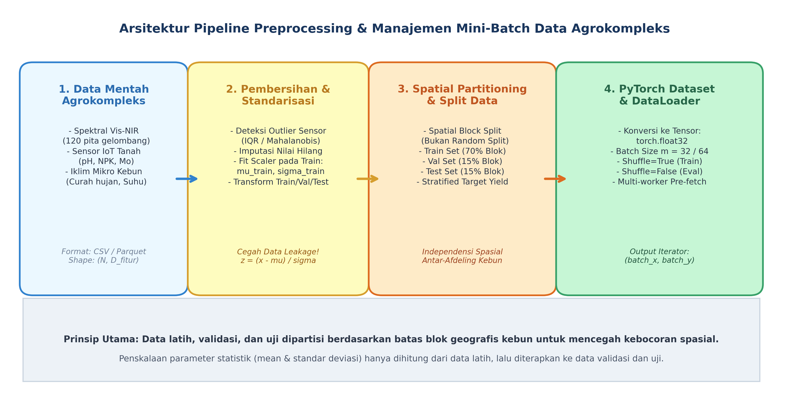
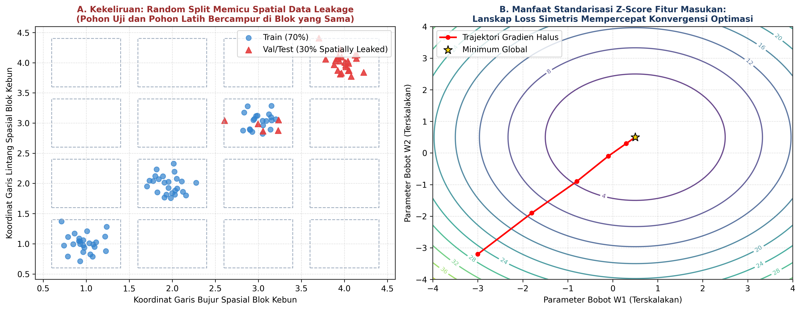

# AI Modul 8.1: Preprocessing Dataset

---

## 1. Identitas & Kerangka Capaian Pembelajaran (Sub-CPMK)

* **Kode Modul**: AI Modul 8.1
* **Mata Kuliah**: Kecerdasan Buatan dan Sains Data Pertanian Presisi
* **Alokasi Waktu**: 2 x 50 Menit (Kajian Teori & Diskusi) + 2 x 50 Menit (Eksplorasi Praktikum Mandiri)
* **Beban SKS**: 3 SKS
* **Prasyarat**: AI Modul 7.10 (Gradient Boosting)
* **Level Kognitif**: Bloom C2 (Memahami), C3 (Menerapkan), C4 (Menganalisis)

```flowchart LR
    A["OUTPUTS: Modul Preprocessing, Skrip PyTorch Dataset/DataLoader, Partisi Spasial"] --> B["OUTCOMES: Standardisasi Multivariat & Pencegahan Kebocoran Data Lapangan"]
    B --> C["IMPACTS: Keandalan Model Deep Learning pada Variasi Afdeling Kebun Baru"]
```

### 1.1 Capaian Pembelajaran Khusus (Sub-CPMK)
Setelah menyelesaikan modul pembelajaran ini secara tuntas, mahasiswa diharapkan memiliki kapabilitas untuk:
1. **Sub-CPMK 8.1.1 (C2):** Menguraikan urgensi matematis standarisasi masukan terhadap geometri lanskap fungsi rugi, rasio kondisi (*condition number*) matriks Hessian, serta membedakan konsep partisi acak (*random split*) dengan partisi blok kebun (*spatial block partitioning*).
2. **Sub-CPMK 8.1.2 (C3):** Membangun *data pipeline* terintegrasi berbasis kelas kustom `Dataset` dan `DataLoader` PyTorch yang mencakup pembersihan derau sensor, imputasi nilai hilang, penskalaan tanpa kebocoran data (*zero data leakage*), dan mekanisme *batch collation*.
3. **Sub-CPMK 8.1.3 (C4):** Mendiagnosis anomali autokorelasi spasial, menangani ketidakseimbangan kelas (*class imbalance*) menggunakan teknik pembobotan *Weighted Random Sampling*, serta merumuskan strategi penanganan pencilan (*outliers*) multivariat pada data spektral dan sensor IoT perkebunan.

### 1.2 Kerangka Hasil Pembelajaran (Outputs, Outcomes, & Impacts)
- **Luaran Langsung (*Outputs*):** Modul skrip Python preprocessing modular, file pipeline PyTorch `Dataset` dan `DataLoader`, serta visualisasi partisi blok spasial perkebunan yang tervalidasi tanpa galat.
- **Dampak Pembelajaran (*Outcomes*):** Mahasiswa memiliki kompetensi teknis profesional dalam mengelola siklus data mentah agrokompleks menjadi representasi tensor berkinerja tinggi yang siap dilatih oleh arsitektur *deep learning*.
- **Implikasi Jangka Panjang (*Impacts*):** Terhindarnya model kecerdasan buatan perkebunan dari bias optimisme semu akibat kebocoran data spasial (*spatial data leakage*), menjamin keandalan sistem saat diterapkan pada variasi afdeling perkebunan baru.

---

## 2. Profil Fundamental Preprocessing Dataset: Fungsi, Manfaat, dan Keunggulan-Kelemahan

### 2.1 Fungsi Komputasi & Pemodelan Matematis
Dalam sistem *deep learning*, jaringan saraf tiruan bekerja murni melalui perkalian matriks, penjumlahan skalar, dan fungsi aktivasi non-linier. Jaringan tidak memiliki mekanisme bawaan untuk memahami satuan fisik (misalnya miligram per liter, persen kelembaban, atau nanometer panjang gelombang). 

Fungsi utama preprocessing adalah mengonversi data mentah heterogen menjadi representasi numerik terstandar yang kompatibel dengan asumsi inisialisasi bobot jaringan. Sementara itu, `DataLoader` berfungsi sebagai abstraksi perangkat lunak yang mengelola aliran memori, mengelompokkan data menjadi mini-batch, mengacak urutan sampel secara periodik pada setiap *epoch*, serta memanfaatkan *multiprocessing* perangkat keras untuk mengalirkan tensor secara berkelanjutan ke unit pemroses grafis (GPU/TPU) tanpa terjadi hambatan I/O (*I/O bottlenecks*).

### 2.2 Manfaat Nyata di Industri Perkebunan & Agribisnis
Penerapan *deep learning* pada agrokompleks memiliki karakteristik unik yang menuntut penanganan data khusus:
1. **Penyelarasan Skala Antar-Modalitas Sensor:**  
   Dalam satu tabel data kebun, fitur spektral Vis-NIR memiliki rentang reflektansi kontinu $[0.0, 1.0]$, sensor hara tanah berkisar $[10, 500]$ ppm, kelembaban tanah berkisar $[20, 80]\%$, sedangkan curah hujan bulanan dapat mencapai ratusan milimeter. Preprocessing menyeimbangkan kontribusi semua variabel sehingga fitur berangka besar tidak mendominasi gradien bobot.
2. **Mitigasi Autokorelasi Spasial (*Spatial Autocorrelation*):**  
   Tanaman kelapa sawit yang berada pada petak yang sama memiliki kesamaan karakteristik tanah dan iklim. Membagi data secara acak biasa (*random train-test split*) menyebabkan tanaman tetangga masuk ke data latih dan uji secara bersamaan, memicu *data leakage* parah. Pendekatan *spatial block partitioning* menjamin generalisasi model pada petak baru.
3. **Pengelolaan Memori Terbatas (*Memory-Efficient Batching*):**  
   Pengukuran spektral ribuan pohon menghasilkan matriks dimensi besar. Menggunakan `DataLoader` memungkinkan pelatihan dilakukan secara bertahap dalam ukuran mini-batch yang terukur, menjaga konsumsi RAM komputer laboratorium tetap stabil.

### 2.3 Rationale: Alasan Mengapa Metode Ini Digunakan
Secara matematis, bentuk permukaan fungsi rugi (*loss landscape*) sangat dipengaruhi oleh skala fitur masukan. Jika dua fitur memiliki rentang skala yang berbeda sebesar beberapa magnitudo, matriks kurvatur (Hessian) akan memiliki rasio kondisi (*condition number*) yang sangat timpang:

$$\kappa(\mathbf{H}) = \frac{\lambda_{\max}(\mathbf{H})}{\lambda_{\min}(\mathbf{H})} \gg 1$$

Hal ini menghasilkan lanskap fungsi rugi berbentuk lembah elips yang sangat curam di satu sisi dan sangat landai di sisi lain. Algoritma optimasi seperti *Gradient Descent* akan mengalami osilasi liar dan membutuhkan laju pembelajaran (*learning rate*) yang sangat kecil untuk mencegah divergensi. Standarisasi fitur merotasi dan menskalakan elips tersebut menjadi simetris melingkar ($\kappa \approx 1$), sehingga lintasan gradien bergerak lurus menuju titik minimum global dengan konvergensi yang jauh lebih cepat.

### 2.4 Analisis Kelebihan dan Kekurangan

| Teknik Preprocessing | Formulasi Inti | Keunggulan Utama | Kelemahan & Batasan | Rekomendasi Penggunaan Agro |
| :--- | :--- | :--- | :--- | :--- |
| **Z-Score Standardization** | $z = \frac{x - \mu}{\sigma}$ | Menghasilkan distribusi rata-rata 0 dan varians 1, selaras dengan inisialisasi bobot He/Xavier. | Sangat sensitif terhadap nilai pencilan ekstrem (*outliers*) yang mendistorsi nilai $\mu$ dan $\sigma$. | Sangat disarankan untuk data spektral Vis-NIR dan sinyal kontinu homogen. |
| **Min-Max Scaling** | $x' = \frac{x - x_{\min}}{x_{\max} - x_{\min}}$ | Membatasi seluruh rentang data tepat pada interval $[0, 1]$ atau $[-1, 1]$. | Rentan runtuh jika ada data uji baru di luar rentang batas min-max historis. | Cocok untuk data citra piksel atau sensor dengan batas fisik pasti (misal pH $0-14$). |
| **Robust Scaling** | $x' = \frac{x - Q_2}{Q_3 - Q_1}$ | Kebal terhadap pencilan ekstrem karena menggunakan median dan rentang interkuartil (IQR). | Tidak menjamin rentang skala yang seragam antar-fitur. | Sangat ideal untuk data sensor cuaca lapangan (curah hujan ekstrim, kelembaban). |
| **Quantile Transformer** | Pemetaan peringkat kumulatif $F(x) \rightarrow \mathcal{N}(0, 1)$ | Mengubah distribusi data miring (*skewed*) menjadi berdistribusi normal sempurna. | Merusak interpretasi jarak linier antar-sampel, komputasi non-parametrik berat. | Digunakan pada variabel konsentrasi hara tanah yang memiliki persebaran log-normal ekstrem. |

### 2.5 Contoh Kasus Penggunaan Konkret di Sektor Agro-Industri
1. **Estimasi Rendemen Minyak Sawit Mentah (*Crude Palm Oil* / CPO) Pabrik Kelapa Sawit:**  
   Sebuah perkebunan kelapa sawit di Riau mengumpulkan 1.200 sampel tandan buah segar (TBS) dari 8 afdeling perkebunan yang berbeda. Data mencakup 120 pita reflektansi spektrometri NIR dan 4 parameter kesuburan tanah. Pembagian data dilakukan dengan teknik *Spatial Block Split*, di mana Afdeling 1 hingga 6 dialokasikan untuk data latih (75%), Afdeling 7 untuk validasi (12.5%), dan Afdeling 8 murni untuk pengujian (12.5%). Hal ini menjamin bahwa model yang dilatih benar-benar mampu memprediksi kualitas panen di afdeling baru tanpa terdistorsi oleh kedekatan geografis pohon.
2. **Diagnostik Penyakit Busuk Pangkal Batang (*Ganoderma boninense*):**  
   Penggunaan *Weighted Random Sampler* pada `DataLoader` PyTorch mengatasi ketidakseimbangan kelas ekstrem di mana pohon sakit stadium awal hanya merepresentasikan 4% dari total sensus pohon perkebunan.

### 2.6 Aspek Kritis & Catatan Penting Metode (*Key Critical Insights*)
- **Hukum Utama Kebocoran Data (*Strict Anti-Data Leakage Rule*):**  
  Parameter transformasi (seperti $\mu$, $\sigma$, $x_{\min}$, $x_{\max}$, $Q_1$, $Q_3$) **wajib dihitung (*fit*) hanya dari himpunan data latih (*training set*)**. Nilai statistik ini kemudian dibekukan dan langsung diaplikasikan (*transform*) ke himpunan validasi dan pengujian. Menghitung parameter skala pada keseluruhan dataset sebelum pemisahan merupakan cacat metodologis serius dalam penelitian ilmiah.
- **Kesesuaian Tipe Data Tensorial (*Tensor Type Casting*):**  
  PyTorch memerlukan data berformat `torch.float32` (atau `torch.float64`) untuk variabel kontinu dan `torch.long` (int64) untuk label klasifikasi diskret. Mengirimkan tensor bertipe `torch.float64` secara tidak sengaja ke lapisan jaringan dapat melipatgandakan konsumsi memori VRAM GPU tanpa memberikan peningkatan akurasi yang berarti.

---

---

## 3. Landasan Teori Matematis & Statistik

```
+---------------------------------------------------------------------------------------------------+
|               GEOMETRI LOSS LANDSCAPE: SEBELUM VS SESUDAH STANDARISASI FITUR                      |
+---------------------------------------------------------------------------------------------------+
|                                                                                                   |
|  [Data Mentah Nir-Standarisasi]                       [Data Terstandarisasi Z-Score]              |
|  x1 in [0, 1], x2 in [1000, 50000]                    z1 ~ N(0, 1), z2 ~ N(0, 1)                  |
|                                                                                                   |
|           w2 ^                                                 w2 ^                               |
|              |     .-----.                                        |        .---.                  |
|              |   .'       `.                                      |      .'     `.                |
|              |  /   .---.   \                                     |     /   (o)   \               |
|              | |   / (o) \   |                                    |     \    *    /               |
|              |  \   `---'   /                                     |      `.     .'                |
|              |   `.       .'                                      |        `---'                  |
|              +------------------> w1                              +------------------> w1         |
|         Lanskap Lonjong / Kondisi Buruk                      Lanskap Simetris / Kondisi Sempurna  |
|         Gradient Descent Berosilasi Liar                     Gradient Descent Bergerak Cepat      |
+---------------------------------------------------------------------------------------------------+
```

### 3.1 Formulasi Standarisasi Statistik Z-Score
Diberikan matriks data latih $\mathbf{X}_{train} \in \mathbb{R}^{m \times d}$, vektor rata-rata empiris $\boldsymbol{\mu}$ dan vektor standar deviasi $\boldsymbol{\sigma}$ untuk setiap fitur $j \in \{1, 2, \dots, d\}$ dirumuskan sebagai:

$$\mu_j = \frac{1}{m} \sum_{i=1}^{m} X_{i,j}$$

$$\sigma_j = \sqrt{\frac{1}{m} \sum_{i=1}^{m} (X_{i,j} - \mu_j)^2 + \epsilon}$$

Transformasi standarisasi untuk sembarang vektor sampel $\mathbf{x} \in \mathbb{R}^d$ didefinisikan sebagai:

$$\mathbf{z} = \frac{\mathbf{x} - \boldsymbol{\mu}}{\boldsymbol{\sigma}} = (\mathbf{x} - \boldsymbol{\mu}) \oslash \boldsymbol{\sigma}$$

#### Panduan Pelafalan Matematis
> "Mu j sama dengan satu per m dikalikan sigma i sama dengan satu hingga m dari X matriks indeks i, j. Sigma j sama dengan akar kuadrat dari satu per m dikalikan sigma i sama dengan satu hingga m dari kuadrat selisih X indeks i, j terhadap mu j, ditambah epsilon skalar penstabil. Vektor z sama dengan selisih vektor x dikurangi mu, dibagi secara elemen-demi-elemen dengan vektor sigma."

| Simbol | Tipe Matematis | Definisi dan Keterangan Fisis |
| :--- | :--- | :--- |
| $\mathbf{X}_{train}$ | Matriks Riil $\mathbb{R}^{m \times d}$ | Himpunan data fitur latih dengan $m$ baris sampel dan $d$ kolom variabel. |
| $\boldsymbol{\mu}$ | Vektor Riil $\mathbb{R}^d$ | Nilai rata-rata aritmetika per kolom fitur dari subset data latih. |
| $\boldsymbol{\sigma}$ | Vektor Riil Positif $\mathbb{R}^d_{>0}$ | Nilai simpangan baku per kolom fitur dari subset data latih. |
| $\epsilon$ | Konstanta Riil ($10^{-8}$) | Konstanta kestabilan numerik agar tidak terjadi pembagian dengan nol. |
| $\oslash$ | Operator Biner | Pembagian elemen-demi-elemen (*Hadamard division*). |
| $\mathbf{z}$ | Vektor Terstandar $\mathbb{R}^d$ | Vektor fitur tanpa dimensi dengan sifat $\mathbb{E}[\mathbf{z}] = \mathbf{0}$ dan $\text{Var}(\mathbf{z}) = \mathbf{I}$. |

### 3.2 Formulasi Penskalaan Rentang Kuartil (*Robust Scaling*)
Guna mereduksi pengaruh nilai ekstrem tanpa membuang informasi sampel lapangan, penskalaan *Robust* memanfaatkan persentil empiris:

$$x'_{j} = \frac{x_j - Q_2(X_{\cdot, j})}{Q_3(X_{\cdot, j}) - Q_1(X_{\cdot, j})}$$

Di mana $Q_1, Q_2, Q_3$ berturut-turut merupakan kuartil ke-1 (persentil 25), median (persentil 50), dan kuartil ke-3 (persentil 75) dari fitur ke-$j$.

#### Panduan Pelafalan Matematis
> "X aksen j sama dengan selisih x j dikurangi kuartil dua dari kolom X j, dibagi dengan selisih kuartil tiga dikurangi kuartil satu dari kolom X j."

### 3.3 Analisis Kelengkungan Matriks Hessian dan Rasio Kondisi
Untuk model linier atau kuadratik lokal di sekitar titik minimum $\mathbf{w}^*$, fungsi rugi dapat didekati dengan deret Taylor orde kedua:

$$\mathcal{L}(\mathbf{w}) \approx \mathcal{L}(\mathbf{w}^*) + \frac{1}{2} (\mathbf{w} - \mathbf{w}^*)^T \mathbf{H} (\mathbf{w} - \mathbf{w}^*)$$

Di mana matriks Hessian $\mathbf{H} = \nabla^2 \mathcal{L}(\mathbf{w}) = \frac{1}{m} \mathbf{X}^T \mathbf{X}$. Rasio kondisi kelengkungan didefinisikan sebagai rasio nilai eigen maksimum terhadap minimum:

$$\kappa(\mathbf{H}) = \frac{\lambda_{\max}(\mathbf{H})}{\lambda_{\min}(\mathbf{H})}$$

Laju konvergensi penurunan gradien dibatasi oleh faktor kontraksi:

$$\|\mathbf{w}^{(t)} - \mathbf{w}^*\| \le \left( \frac{\kappa - 1}{\kappa + 1} \right)^t \|\mathbf{w}^{(0)} - \mathbf{w}^*\|$$

Ketika fitur tidak distandarisasi, $\kappa \gg 1$, sehingga $\frac{\kappa - 1}{\kappa + 1} \approx 1$, yang mengimplikasikan konvergensi melambat secara eksponensial. Ketika fitur distandarisasi secara ortogonal, $\kappa \rightarrow 1$, menghasilkan $\frac{\kappa - 1}{\kappa + 1} \rightarrow 0$, di mana optimasi konvergen hampir seketika.

### 3.4 Mekanisme Penyeimbangan Sampel (*Weighted Random Sampling*)
Pada kasus ketidakseimbangan kelas agrokompleks dengan $C$ kategori kelas, probabilitas penarikan sampel ke-$i$ dirumuskan sebagai:

$$w_c = \frac{N}{C \cdot N_c} \quad \text{untuk setiap kelas } c \in \{1, \dots, C\}$$

$$P(\text{sampel } i) = \frac{w_{y_i}}{\sum_{j=1}^{N} w_{y_j}}$$

#### Panduan Pelafalan Matematis
> "Bobot kelas w sub c sama dengan N total sampel dibagi dengan C jumlah kelas dikalikan N sub c frekuensi sampel kelas c. Probabilitas penarikan sampel i sama dengan bobot kelas dari label y indeks i dibagi sigma penjumlahan bobot seluruh sampel j dari satu hingga N."

---

---

## 4. Visualisasi Pipeline Data dan Partisi Spasial

Berikut adalah visualisasi arsitektur komprehensif dari *data pipeline* PyTorch terintegrasi serta perbandingan dampak metodologis antara partisi acak (*random split*) vs partisi blok spasial (*spatial block partition*).


*Gambar 1: Alur kerja terstruktur pengelolaan data mentah agrokompleks menjadi batch tensor PyTorch. Tahapan meliputi pembersihan anomali sensor, fitting scaler hanya pada data latih, partisi blok geografis afdeling kebun, hingga orkestrasi multi-threaded mini-batch iterator.*


*Gambar 2: Analisis metodologis rekayasa data. (Kiri) Bahaya kebocoran data spasial akibat partisi acak di mana pohon uji bertetangga langsung dengan pohon latih pada petak yang sama. (Kanan) Transformasi geometri lanskap fungsi rugi dari kontur lonjong berosilasi menjadi kontur melingkar simetris berkat standarisasi Z-Score.*

---

### Prosedur Komputasi & Alur Algoritma Numerik

Berikut adalah struktur algoritmik langkah-demi-langkah implementasi modul preprocessing dan pembuatan kelas kustom *PyTorch Dataset*:

```
====================================================================================================
ALGORITMA 8.7: PIPELINE PREPROCESSING & PYTORCH DATALOADER KHUSUS AGROKOMPLEKS
====================================================================================================
Masukan: 
  - File data tabular D_raw memuat (N sampel, D fitur, 1 label target, 1 ID_Blok_Kebun)
  - Parameter: batch_size = 32, train_ratio = 0.70, val_ratio = 0.15, test_ratio = 0.15
Keluaran:
  - train_loader, val_loader, test_loader bertipe torch.utils.data.DataLoader
  - Objek scaler terkalibrasi (mu_train, sigma_train)

PROSEDUR EKSEKUSI PIPELINE:
1. IDENTIFIKASI DAN PARTISI BLOK SPASIAL:
     daftar_blok = Unik(D_raw['ID_Blok_Kebun'])
     Acak daftar_blok dengan seed tetap
     Alokasikan blok_train (70%), blok_val (15%), blok_test (15%)
     D_train = D_raw[D_raw['ID_Blok_Kebun'] in blok_train]
     D_val   = D_raw[D_raw['ID_Blok_Kebun'] in blok_val]
     D_test  = D_raw[D_raw['ID_Blok_Kebun'] in blok_test]

2. KALIBRASI PARAMETER STANDARISASI:
     Pisahkan matriks fitur X_train, X_val, X_test dan target y_train, y_val, y_test
     Hitung mu_train = Rata_Rata(X_train, axis=0)
     Hitung sigma_train = Standar_Deviasi(X_train, axis=0) + 1e-8
     
     // Transformasi ke seluruh subset
     X_train_scaled = (X_train - mu_train) / sigma_train
     X_val_scaled   = (X_val - mu_train) / sigma_train
     X_test_scaled  = (X_test - mu_train) / sigma_train

3. KONSTRUKSI KELAS KUSTOM AGRODATASET (torch.utils.data.Dataset):
     Inisialisasi(X_tensor, y_tensor):
       self.X = torch.tensor(X_tensor, dtype=torch.float32)
       self.y = torch.tensor(y_tensor, dtype=torch.float32).view(-1, 1)
     Metode __len__():
       KEMBALIKAN panjang self.X
     Metode __getitem__(idx):
       KEMBALIKAN self.X[idx], self.y[idx]

4. INSTANSIASI DATALOADER:
     train_dataset = AgroDataset(X_train_scaled, y_train)
     val_dataset   = AgroDataset(X_val_scaled, y_val)
     test_dataset  = AgroDataset(X_test_scaled, y_test)
     
     train_loader = DataLoader(train_dataset, batch_size=32, shuffle=True, pin_memory=True)
     val_loader   = DataLoader(val_dataset, batch_size=32, shuffle=False)
     test_loader  = DataLoader(test_dataset, batch_size=32, shuffle=False)
====================================================================================================
```

---

---

## 5. Studi Kasus Komputasi & Implementasi PyTorch Dataset/DataLoader

### Deskripsi Dataset Proyek Berkelanjutan
Sepanjang Modul 8.7 hingga Modul 8.11, kita akan menggunakan satu studi kasus proyek terpadu skala industri:  
**Sistem Prediksi Kualitas Tandan Buah Segar dan Rendemen Minyak Kelapa Sawit Berdasarkan Data Spektral Vis-NIR dan Sensor Lingkungan Perkebunan.**

Dataset mencakup $N = 600$ observasi pohon kelapa sawit yang tersebar di 10 afdeling geografis perkebunan di Riau. Setiap observasi memuat:
1. **Fitur Spektral ($D_1 = 120$ kanal):** Reflektansi spektral daun pada rentang panjang gelombang 400 nm hingga 1000 nm (mengindikasikan pigmen klorofil, karotenoid, dan kadar air).
2. **Fitur Sensor IoT Tanah & Cuaca ($D_2 = 4$ variabel):** Nilai pH tanah ($4.2 - 6.5$), kadar Nitrogen tanah (ppm), kelembaban tanah ($20 - 75\%$), dan curah hujan akumulatif 30 hari (mm).
3. **Variabel Target ($y$ kontinu):** Rendemen Minyak Sawit Mentah (*Crude Palm Oil Extraction Rate* / KER, rentang $18.0\% - 26.5\%$).
4. **Metadat Spasial:** `Afdeling_ID` (kategori 1 sampai 10).

### Implementasi Pipeline Menggunakan PyTorch & NumPy
Berikut adalah skrip implementasi komputasi yang merealisasikan pipeline pembersihan data, partisi blok kebun, standarisasi tanpa kebocoran, serta pembuatan PyTorch `DataLoader`:

```python
import numpy as np
import torch
from torch.utils.data import Dataset, DataLoader

#### 1. Pembangkitan Data Sintetis Terstruktur Agrokompleks
def generate_oilpalm_dataset(n_samples=600, n_spectral=120, seed=42):
    np.random.seed(seed)
    
    # 10 Afdeling perkebunan (spasial)
    afdeling_ids = np.repeat(np.arange(1, 11), n_samples // 10)
    
    # Fitur Spektral Vis-NIR (120 kanal)
    wavelengths = np.linspace(400, 1000, n_spectral)
    spectral_data = np.zeros((n_samples, n_spectral))
    for i in range(n_samples):
        base_curve = 0.15 + 0.35 * np.exp(-((wavelengths - 550)**2) / (2 * 45**2)) + \
                            0.50 * (1.0 / (1.0 + np.exp(-(wavelengths - 700) / 20)))
        noise = np.random.normal(0, 0.02, n_spectral)
        spectral_data[i] = base_curve * np.random.uniform(0.85, 1.15) + noise

    # Fitur Sensor Tanah & Lingkungan (4 variabel)
    pH = np.random.normal(5.2, 0.4, (n_samples, 1))
    nitrogen = np.random.normal(120.0, 25.0, (n_samples, 1))
    moisture = np.random.uniform(30.0, 70.0, (n_samples, 1))
    rainfall = np.random.uniform(100.0, 350.0, (n_samples, 1))
    sensor_data = np.hstack([pH, nitrogen, moisture, rainfall])
    
    # Target: Rendemen Minyak (%) non-linier terikat pada red-edge & nitrogen
    cpo_yield = 19.5 + 4.5 * spectral_data[:, 65] - 0.015 * np.abs(pH[:, 0] - 5.5)**2 + \
                0.012 * (nitrogen[:, 0] / 10.0) + np.random.normal(0, 0.35, n_samples)
    
    X_raw = np.hstack([spectral_data, sensor_data])
    y_raw = cpo_yield.reshape(-1, 1)
    
    return X_raw, y_raw, afdeling_ids

#### 2. Partisi Berbasis Blok Spasial (Spatial Block Partitioning)
def spatial_block_split(X, y, block_ids, train_blocks=[1,2,3,4,5,6,7], val_blocks=[8], test_blocks=[9,10]):
    train_mask = np.isin(block_ids, train_blocks)
    val_mask = np.isin(block_ids, val_blocks)
    test_mask = np.isin(block_ids, test_blocks)
    
    return (X[train_mask], y[train_mask]), (X[val_mask], y[val_mask]), (X[test_mask], y[test_mask])

#### 3. Modul Scaler Khusus Tanpa Data Leakage
class AgroScaler:
    def __init__(self, eps=1e-8):
        self.eps = eps
        self.mu = None
        self.sigma = None

    def fit(self, X):
        self.mu = np.mean(X, axis=0, keepdims=True)
        self.sigma = np.std(X, axis=0, keepdims=True)
        self.sigma[self.sigma == 0] = 1.0  # cegah deviasi nol

    def transform(self, X):
        return (X - self.mu) / (self.sigma + self.eps)

    def fit_transform(self, X):
        self.fit(X)
        return self.transform(X)

#### 4. Kelas Kustom PyTorch Dataset
class OilPalmDataset(Dataset):
    def __init__(self, X_data, y_data):
        self.X = torch.tensor(X_data, dtype=torch.float32)
        self.y = torch.tensor(y_data, dtype=torch.float32)

    def __len__(self):
        return len(self.X)

    def __getitem__(self, idx):
        return self.X[idx], self.y[idx]

#### Eksekusi Pipeline
X, y, blocks = generate_oilpalm_dataset()
(X_tr, y_tr), (X_va, y_va), (X_te, y_te) = spatial_block_split(X, y, blocks)

#### Fitting Scaler HANYA pada data latih
scaler = AgroScaler()
X_tr_norm = scaler.fit_transform(X_tr)
X_va_norm = scaler.transform(X_va)
X_te_norm = scaler.transform(X_te)

#### Pembuatan DataLoaders
train_loader = DataLoader(OilPalmDataset(X_tr_norm, y_tr), batch_size=32, shuffle=True)
val_loader = DataLoader(OilPalmDataset(X_va_norm, y_va), batch_size=32, shuffle=False)
test_loader = DataLoader(OilPalmDataset(X_te_norm, y_te), batch_size=32, shuffle=False)

print(f"Data latih siap: {len(train_loader.dataset)} sampel, {len(train_loader)} batch per epoch.")
print(f"Data validasi  : {len(val_loader.dataset)} sampel, {len(val_loader)} batch per epoch.")
print(f"Data uji       : {len(test_loader.dataset)} sampel, {len(test_loader)} batch per epoch.")
```

---

---

## 6. Kekeliruan Metodologis dan Praktik Terbaik (*Common Pitfalls & Best Practices*)

### 6.1 Kekeliruan Umum Metodologis (*Common Pitfalls*)
Dalam penyiapan data untuk jaringan saraf tiruan agrokompleks, peneliti kerap terjatuh pada kekeliruan fatal berikut:
1. **Kebocoran Data Global (*Global Data Leakage*):**  
   Melakukan standarisasi (misalnya `StandardScaler.fit_transform(X)`) pada seluruh tabel sebelum melakukan pembagian *train-val-test*. Kekeliruan ini membuat nilai rata-rata dan varians data uji merembes ke data latih, menghasilkan nilai metrik validasi yang optimis semu tetapi rapuh di lapangan.
2. **Kekeliruan Partisi Acak pada Data Bersifat Spasial (*Spatial Data Leakage*):**  
   Menggunakan `train_test_split(shuffle=True)` pada pohon-pohon yang berada di blok kebun yang sama. Akibat autokorelasi spasial, pohon dalam satu blok memiliki profil spektral yang hampir identik. Memisahkan pohon secara acak berarti model "menguji dirinya sendiri" pada duplikat spasial pohon latih.
3. **Mengabaikan Deteksi Nilai Inf/NaN pada Sinyal Sensor:**  
   Sensor IoT perkebunan kerap mengirimkan nilai kosong akibat gangguan sinyal GSM atau kehabisan daya. Memasukkan nilai `NaN` ke dalam tensor PyTorch akan mengakibatkan seluruh aliran gradien bernilai `NaN` seketika (*NaN propagation gradient explosion*).
4. **Transformasi Target Menggunakan Statistik Masa Depan:**  
   Jika variabel target dinormalisasi, pastikan inversi skala (*inverse transform*) saat inferensi menggunakan nilai $\mu_y$ dan $\sigma_y$ dari data latih, bukan dari data uji.

### 6.2 Mitigasi Bias Data Agronomi
1. **Bias Musiman (*Seasonal Rainfall Bias*):**  
   Pengukuran spektral saat musim hujan menghasilkan reflektansi daun yang berbeda dibanding musim kemarau panjang. Mitigasi dilakukan dengan menerapkan *temporal block partitioning* atau memasukkan variabel defisit air kumulatif sebagai fitur penjelas.
2. **Bias Kalibrasi Instrumen (*Spectrometer Sensor Drift*):**  
   Sensor spektrometer Vis-NIR dapat mengalami penurunan akurasi lampu halogen seiring waktu. Terapkan kalibrasi *Standard Normal Variate* (SNV) atau *Multiplicative Scatter Correction* (MSC) pada domain spektral sebelum standarisasi $Z$-score.

### 6.3 Praktik Terbaik Rekayasa Perangkat Lunak AI
1. **Pemanfaatan `pin_memory=True` dan `num_workers`:**  
   Ketika melatih model di GPU, aktifkan parameter `pin_memory=True` pada `DataLoader` untuk mengaktifkan transfer memori *page-locked* (DMA) langsung dari RAM ke VRAM GPU.
2. **Penetapan Benih Pengacak Eksplisit (*Strict Seeding*):**  
   Pastikan pembuatan DataLoader dilengkapi fungsi pembagi benih *worker*:
   ```python
   def seed_worker(worker_id):
       worker_seed = torch.initial_seed() % 2**32
       np.random.seed(worker_seed)
   ```

---

---

## 7. Rangkuman Modul

1. **Standarisasi Fitur & Rasio Kondisi Hessian**: Penskalaan fitur masukan ($Z$-score atau Robust Scaling) merotasi elips kontur fungsi rugi menjadi sirkular ($\kappa(\mathbf{H}) \approx 1$), melipatgandakan kecepatan konvergensi gradien.
2. **Mitigasi Kebocoran Data Spasial**: Pohon-pohon dalam satu afdeling memiliki autokorelasi spasial tinggi. Pembagian data wajib menggunakan partisi blok geografis (*Spatial Block Partitioning*), bukan pengacakan murni (*random split*).
3. **Aturan Mutlak Tanpa Kebocoran (*Zero-Leakage Rule*)**: Parameter transformasi ($\mu, \sigma, x_{\min}, x_{\max}$) wajib diestimasi murni dari data latih, lalu diaplikasikan secara pasif ke data validasi dan uji.
4. **Enkapsulasi PyTorch Dataset**: Kelas turunan `torch.utils.data.Dataset` mengintegrasikan pemanggilan indeks `__getitem__` dan ukuran `__len__`, menjamin konversi data tabular ke tensor `torch.float32` secara konsisten.
5. **Orkestrasi DataLoader Modern**: Mengelola pembentukan mini-batch, pengacakan per epoch (`shuffle=True`), penyeimbangan kelas via `WeightedRandomSampler`, dan akselerasi transfer memori GPU (`pin_memory=True`).

---

## 8. Latihan Soal & Tugas Analitis HOTS

### Deskripsi Proyek Mandiri Terpandu
Mahasiswa diwajibkan menyelesaikan proyek rekayasa pipeline data agrokompleks berikut:

**Judul Proyek:**  
*Rekayasa Pipeline Preprocessing dan DataLoader PyTorch Multi-Modal untuk Prediksi Defisiensi Unsur Hara Makro (NPK) Daun Kelapa Sawit Berbasis Spektrometri Lapangan.*

**Spesifikasi Teknis:**
1. **Dataset Mandiri:** Disediakan file CSV mentah memuat 800 baris data tanaman dari 8 blok perkebunan, dengan 150 pita spektral kontinu, 5 indikator kimia tanah, dan 3 kolom target persentase hara (N, P, K).
2. **Instruksi Tugas:**
   - Bangun skrip deteksi pencilan menggunakan batas $3 \times \text{IQR}$ dan imputasi nilai kosong menggunakan median blok lokal.
   - Lakukan partisi blok spasial: Blok 1–5 untuk Data Latih, Blok 6–7 untuk Validasi, dan Blok 8 murni untuk Data Uji.
   - Buat kelas kustom `MultiModalPalmDataset` yang mewarisi `torch.utils.data.Dataset`.
   - Bangun objek `DataLoader` dengan ukuran batch $m = 16$, dan buktikan bahwa pemanggilan satu iterasi menghasilkan bentuk tensor yang tepat: `torch.Size([16, 155])` untuk fitur dan `torch.Size([16, 3])` untuk target multi-output.
   - Lakukan pengujian komparatif nilai kelengkungan matriks Hessian sebelum dan sesudah standarisasi.

---

### Rubrik Penilaian Holistik (*Higher-Order Thinking Skills*)

| Kriteria / Dimensi | Bobot (%) | Sangat Memuaskan (85 - 100) | Memuaskan (70 - 84) | Kurang Memuaskan (< 70) |
| :--- | :--- | :--- | :--- | :--- |
| **Pemahaman Teoretis & Kondisi Matriks (C2)** | 25% | Mampu menguraikan kaitan rasio kondisi matriks Hessian $\kappa(\mathbf{H})$ dengan konvergensi gradien, serta menjelaskan bahaya kebocoran data spasial secara mendalam. | Menjelaskan konsep standarisasi data dengan benar namun analisis pengaruhnya terhadap matriks Hessian kurang lengkap. | Gagal menjelaskan tujuan standarisasi fitur atau salah memahami konsep *data leakage*. |
| **Konstruksi Pipeline & PyTorch DataLoader (C3)** | 35% | Berhasil mengonstruksi kelas kustom `Dataset` dan `DataLoader` PyTorch yang modular, bebas galat, serta mematuhi aturan isolasi parameter skala data latih secara presisi. | Kelas `Dataset` dan `DataLoader` berjalan baik namun terdapat kelemahan kecil dalam pemisahan blok spasial atau penanganan tipe data tensor. | Program menghasilkan galat saat dieksekusi atau standarisasi dilakukan pada seluruh dataset sebelum partisi. |
| **Analisis Diagnostik & Solusi Lapangan (C4)** | 40% | Mahasiswa mampu mendeteksi anomali data lapangan, merumuskan penanganan pencilan berbasis IQR, dan membuktikan ekuivalensi bentuk tensor untuk pelatihan *deep learning*. | Mampu mendeteksi pencilan dasar namun strategi mitigasi autokorelasi spasial belum komprehensif. | Tidak mampu mengidentifikasi keberadaan pencilan atau mengabaikan ketidakseimbangan kelas. |

---

---

## 9. Jembatan Konsep (Bridging) ke AI Modul 8.2: Training Model

Melalui penuntasan Modul 8.7 ini, fondasi hulu rekayasa data *deep learning* telah kokoh: data mentah spektral dan sensor tanah telah dibersihkan dari pencilan, dipartisi berdasarkan batas blok geografis kebun untuk mencegah kebocoran spasial, distandarisasi secara matematis untuk menjamin kelengkungan fungsi rugi yang simetris, serta dienkapsulasi ke dalam generator batch `torch.utils.data.DataLoader` yang efisien secara memori.

Namun, tensor mini-batch yang mengalir dari `DataLoader` belum memiliki arah tujuan komputasi jika belum ada sistem penggerak terorkestrasi. Menyuapkan tensor ke model jaringan secara manual menggunakan loop sederhana rentan memicu ledakan gradien, pembaruan parameter yang tidak terkontrol, serta ketidakmampuan melacak kemajuan belajar model.

Pada **AI Modul 8.8: Training Model**, kita akan melangkah memasuki jantung komputasi pelatihan model. Kita akan merancang dan mengimplementasikan siklus pelatihan (*training loop*) kelas industri lengkap dengan teknik pemotongan gradien (*gradient clipping*), penjadwal laju pembelajaran dinamis (*learning rate scheduler*), serta sistem pemantauan dan pencadangan otomatis bobot model terbaik (*model checkpointing*).

---

## 10. Daftar Pustaka dan Referensi Akademik

1. Paszke, A., Gross, S., Massa, F., Lerer, A., Bradbury, J., Chanan, G., ... & Chintala, S. (2019). PyTorch: An Imperative Style, High-Performance Deep Learning Library. *Advances in Neural Information Processing Systems (NeurIPS 2019)*, 32, 8024-8035.
2. Goodfellow, I., Bengio, Y., & Courville, A. (2016). *Deep Learning*. MIT Press.
3. Roberts, D. R., Bahn, V., Ciuti, S., Boyce, M. S., Elith, J., Guillera-Arroita, G., ... & Dormann, C. F. (2017). Cross-validation strategies for data with spatial, temporal, or phylogenetic structure. *Ecography*, 40(8), 913-929.
4. LeCun, Y., Bottou, L., Orr, G. B., & Müller, K. R. (2012). Efficient BackProp. In *Neural Networks: Tricks of the Trade* (pp. 9-48). Springer, Berlin, Heidelberg.
5. Zhang, A., Lipton, Z. C., Li, M., & Smola, A. J. (2023). *Dive into Deep Learning*. Cambridge University Press.
6. Legendre, P. (1993). Spatial autocorrelation: trouble or new paradigm?. *Ecology*, 74(6), 1659-1673.
7. Rumpf, T., Mahlein, A. K., Steiner, U., Oerke, E. C., Dehne, H. W., & Plümer, L. (2010). Early detection and classification of plant diseases with Support Vector Machines based on hyperspectral reflectance. *Computers and Electronics in Agriculture*, 74(1), 91-99.
8. Murphy, K. P. (2022). *Probabilistic Machine Learning: An Introduction*. MIT Press.
