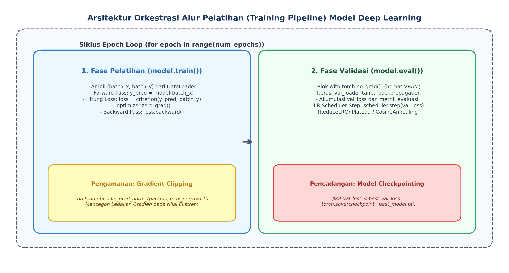
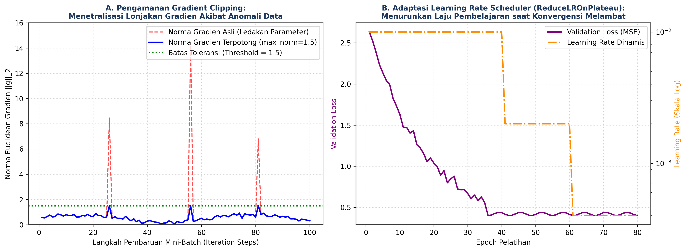

# AI Modul 8.2: Training Model

---

## 1. Identitas & Kerangka Capaian Pembelajaran (Sub-CPMK)

* **Kode Modul**: AI Modul 8.2
* **Mata Kuliah**: Kecerdasan Buatan dan Sains Data Pertanian Presisi
* **Alokasi Waktu**: 2 x 50 Menit (Kajian Teori & Diskusi) + 2 x 50 Menit (Eksplorasi Praktikum Mandiri)
* **Beban SKS**: 3 SKS
* **Prasyarat**: AI Modul 8.1 (Preprocessing Dataset)
* **Level Kognitif**: Bloom C2 (Memahami), C3 (Menerapkan), C4 (Menganalisis)

```flowchart LR
    A["OUTPUTS: Pipeline Mesin Pelatihan Terpadu PyTorch (Clip, Scheduler, Checkpointing)"] --> B["OUTCOMES: Konvergensi Latih Cepat & Pencegahan Ledakan Gradien Numerik"]
    B --> C["IMPACTS: Model Terlatih Optimum & Siap Audit Evaluasi Produksi PKS"]
```

### 1.1 Capaian Pembelajaran Khusus (Sub-CPMK)
Setelah menyelesaikan modul pembelajaran ini secara tuntas, mahasiswa diharapkan memiliki kapabilitas untuk:
1. **Sub-CPMK 8.2.1 (C2):** Menguraikan tahapan komputasi dalam siklus pelatihan (*training loop*) kelas industri, membedah perbedaan mekanisme propagasi antara mode `model.train()` dan `model.eval()`, serta menjelaskan formulasi matematis pemotongan gradien (*gradient clipping*) dan penjadwalan laju pembelajaran (*learning rate scheduling*).
2. **Sub-CPMK 8.2.2 (C3):** Membangun skrip alur pelatihan (*training pipeline*) profesional menggunakan PyTorch yang mengintegrasikan generator mini-batch `DataLoader`, optimasi Adam, pemotongan gradien global, penjadwal adaptif `ReduceLROnPlateau`, dan pencadangan bobot terbaik (*Model Checkpointing*).
3. **Sub-CPMK 8.2.3 (C4):** Mendiagnosis gejala ledakan gradien (*gradient exploding*), osilasi liar pada dataran semu (*plateau*), serta merumuskan strategi penalaan hiperparameter pelatihan adaptif guna menghasilkan bobot model tergeneralisasi tinggi pada kasus data terpadu agrokompleks.

### 1.2 Kerangka Hasil Pembelajaran (Outputs, Outcomes, & Impacts)
- **Luaran Langsung (*Outputs*):** Skrip alur pelatihan modular PyTorch berstandar industri, modul *training loop* dengan fungsi pencadangan model otomatis (`.pt`), serta visualisasi dinamika norma gradien dan *learning rate decay*.
- **Dampak Pembelajaran (*Outcomes*):** Mahasiswa memiliki kemahiran rekayasa perangkat lunak dalam melatih model jaringan saraf tiruan secara stabil, disiplin memisahkan fase pelatihan dan validasi, serta kebal terhadap kegagalan numerik.
- **Implikasi Jangka Panjang (*Impacts*):** Terwujudnya sistem komputasi pelatihan model AI perkebunan yang terstandar, dapat direproduksi (*reproducible*), dan siap diotomatisasi pada kluster server komputasi berkinerja tinggi (*High-Performance Computing* / GPU Cloud).

---

## 2. Profil Fundamental Training Model: Fungsi, Manfaat, dan Keunggulan-Kelemahan

### 2.1 Fungsi Komputasi & Pemodelan Matematis
*Training pipeline* adalah tulang punggung operasional dari rekayasa *deep learning*. Pada tahap ini, arsitektur model, fungsi rugi (*loss function*), algoritma optimasi, dan generator data (`DataLoader`) dipadukan ke dalam satu alur orkestrasi yang berulang.

Fungsi utama dari alur pelatihan terstruktur mencakup:
1. **Sinkronisasi Fase Komputasi:** Mengatur transisi dinamis antara mode pelatihan aktif (di mana graf komputasi diferensiasi otomatis dan lapisan stokastik seperti *Dropout* serta statistik bergerak *BatchNorm* aktif) dengan mode evaluasi pasif (di mana pembaruan bobot dan pelacakan gradien dinonaktifkan).
2. **Stabilisasi Aliran Gradien Numerik:** Mengendalikan magnitudo vektor pembaruan parameter bobot agar tidak melompati lembah solusi optimum melalui pemotongan gradien (*gradient clipping*).
3. **Penyempurnaan Laju Belajar:** Menyesuaikan laju pembelajaran secara dinamis seiring mendekatnya model ke titik minimum lokal melalui penjadwal *learning rate*.
4. **Jaminan Ketahanan Komputasi (*Fault Tolerance*):** Mengamankan bobot parameter terbaik di media penyimpanan sekunder melalui *checkpointing* berkala, sehingga proses pelatihan dapat dilanjutkan kapan saja jika terjadi gangguan daya listrik atau interupsi sistem.

### 2.2 Manfaat Nyata di Industri Perkebunan & Agribisnis
Dalam industri agrokompleks, pelatihan model *deep learning* sering kali memakan waktu berjam-jam hingga berhari-hari ketika melibatkan ribuan citra drone multispektral atau puluhan ribu sampel kromatogram pabrik. Manfaat strategis implementasi alur pelatihan profesional meliputi:
1. **Ketahanan Terhadap Derau Sensor Tak Terduga:** Sensor lapangan sesekali merekam lonjakan anomali yang memicu nilai loss sangat tinggi secara mendadak. Tanpa *gradient clipping*, satu batch sampel yang terdistorsi dapat langsung merusak jutaan bobot jaringan yang telah dilatih berminggu-minggu (*catastrophic forgetting* atau *weight disruption*).
2. **Efisiensi Alokasi Sumber Daya Komputasi:** Penggunaan penjadwal adaptif seperti *ReduceLROnPlateau* mempercepat fase eksplorasi di awal dan secara otomatis beralih ke fase eksploitasi halus saat kurva validasi mendatar, menghemat puluhan jam komputasi laboratorium.
3. **Pencegahan Pemilihan Bobot Overfit:** Alur pelatihan terstruktur memastikan bahwa bobot akhir yang digunakan untuk deployment bukanlah bobot pada *epoch* terakhir (yang kerap kali telah mengalami *overfitting*), melainkan bobot dengan galat generalisasi terendah sepanjang sejarah pelatihan.

### 2.3 Rationale: Alasan Mengapa Metode Ini Digunakan
Secara teoretis, optimasi jaringan saraf tiruan non-konveks menghadapi permukaan fungsi rugi yang penuh dengan lembah terjal, ngarai sempit, dan titik pelana (*saddle points*). Menggunakan laju pembelajaran konstan sepanjang proses pelatihan memiliki kelemahan fundamental: jika $\eta$ disetel terlalu besar, model tidak akan pernah mencapai dasar cekungan (*bouncing around the minimum*); sebaliknya jika $\eta$ disetel terlalu kecil sejak awal, model akan terjebak ribuan epoch di dataran landai.

Secara matematis, teorema konvergensi stokastik (Robbins-Monro) menyatakan bahwa konvergensi asimtotik ke titik stasioner dijamin jika:

$$\sum_{t=1}^{\infty} \eta_t = \infty \quad \text{dan} \quad \sum_{t=1}^{\infty} \eta_t^2 < \infty$$

Kondisi ini mensyaratkan bahwa laju pembelajaran wajib mengecil secara berangsur-angsur seiring berjalannya waktu. Penjadwal *Learning Rate* merealisasikan prinsip ini secara terukur berdasarkan kinerja empiris validasi.

### 2.4 Analisis Kelebihan dan Kekurangan

| Metode Penjadwalan LR | Formulasi / Kebijakan | Keunggulan Utama | Kelemahan & Batasan | Rekomendasi Kasus Agro |
| :--- | :--- | :--- | :--- | :--- |
| **Fixed Learning Rate** | $\eta_t = \eta_0$ konstan | Sangat sederhana, tidak memerlukan hiperparameter tambahan. | Tidak mampu melakukan penyesuaian saat mendekati konvergensi, rentan berosilasi. | Hanya untuk eksperimen awal *sanity check* beberapa epoch. |
| **StepLR (Decay Bertahap)** | $\eta_t = \eta_0 \cdot \gamma^{\lfloor t / s \rfloor}$ | Menurunkan laju belajar secara deterministik setiap interval langkah $s$ tertentu. | Penurunan terjadi buta tanpa memedulikan apakah model sebenarnya masih belajar cepat atau stagnan. | Cocok untuk arsitektur standar dengan pola konvergensi yang telah diketahui pasti. |
| **Cosine Annealing LR** | Penurunan berbasis kurva setengah gelombang kosinus | Memuluskan transisi penurunan $\eta$, dapat dikombinasikan dengan siklus *warm-restart*. | Memerlukan penentuan jumlah epoch maksimum ($T_{\max}$) yang kaku di awal. | Sangat populer untuk pelatihan model klasifikasi citra kanopi drone (CNN). |
| **ReduceLROnPlateau** | Menurunkan $\eta \leftarrow \eta \cdot \gamma$ saat metrik evaluasi validasi mendatar | Sangat adaptif dan responsif terhadap dinamika belajar empiris model sesungguhnya. | Memerlukan penyetelan parameter toleransi kesabaran (`patience`) dan ambang selisih minimum (`threshold`). | **Sangat direkomendasikan** untuk data tabular/spektrometri agrokompleks heterogen. |

### 2.5 Contoh Kasus Penggunaan Konkret di Sektor Agro-Industri
1. **Pelatihan Model Deep MLP untuk Prediksi Rendemen CPO Kelapa Sawit:**  
   Menyambungkan dataset terpadu dari Modul 8.7 (124 fitur masukan), model dilatih selama 100 epoch menggunakan optimizer Adam ($\eta_0 = 10^{-3}$) dengan *ReduceLROnPlateau* (`patience=5, factor=0.5`). Pada epoch ke-28, kurva validasi mendatar pada MSE 0.48; penjadwal memotong laju belajar menjadi $5 \times 10^{-4}$, memicu model keluar dari dataran semu dan konvergen ke solusi optimum global dengan MSE 0.19 pada epoch ke-54. Modul *checkpointing* berhasil mencadangkan bobot epoch ke-54 secara otomatis.
2. **Pendeteksian Dini Hama Penggerek Batang Tebu Berbasis Audio Akustik:**  
   Penerapan *Gradient Clipping* ($\theta = 1.0$) menstabilkan pelatihan model jaringan rekursif dalam menghadapi ledakan gradien akibat lonjakan derau angin dan gemerisik daun di rekaman lapangan.

### 2.6 Aspek Kritis & Catatan Penting Metode (*Key Critical Insights*)
- **Kewajiban Pemanggilan `optimizer.zero_grad()`:**  
  Secara *default*, PyTorch mengakumulasikan gradien pada setiap panggilan `.backward()` (yakni $\mathbf{g} \leftarrow \mathbf{g} + \nabla \mathcal{L}$). Jika praktisi lupa memanggil `optimizer.zero_grad()` sebelum propagasi mundur, gradien mini-batch saat ini akan dijumlahkan dengan gradien mini-batch sebelumnya, memicu lonjakan gradien raksasa dan divergensi model secara seketika.
- **Isolasi Memori Komputasi Validasi (`torch.no_grad()`):**  
  Pada tahap evaluasi, model hanya melakukan propagasi maju untuk mengukur performa. Wajib membungkus kode validasi dalam blok `with torch.no_grad():` guna mematikan pelacakan graf komputasi autograd. Kelalaian melakukan hal ini akan menimbun riwayat komputasi di memori VRAM GPU hingga memicu galat *CUDA Out of Memory* (OOM).

---

---

## 3. Landasan Teori Matematis & Statistik

```
+---------------------------------------------------------------------------------------------------+
|               MEKANISME PEMOTONGAN GRADIEN GLOBAL (GRADIENT CLIPPING BY NORM)                     |
+---------------------------------------------------------------------------------------------------+
|                                                                                                   |
|  [Vektor Gradien Asli g]                                                                          |
|  Norma Euclidean: ||g||_2 = sqrt( sum( g_i^2 ) )                                                  |
|                                                                                                   |
|              Kondisi A: ||g||_2 <= theta (Aman)       Kondisi B: ||g||_2 > theta (Bahaya Ledakan) |
|                     g_clipped = g                          g_clipped = g * (theta / ||g||_2)      |
|                                                                                                   |
|                           ^                                            ^                          |
|                          /                                            /                           |
|                         /  ||g|| <= theta                            /  ||g|| > theta             |
|                        /                                            /                             |
|                       o                                            o======> Skala Dipotong!       |
|                                                                    (Arah Tetap, Magnitudo Terjaga)|
+---------------------------------------------------------------------------------------------------+
```

### 3.1 Formulasi Pemotongan Gradien Global (*Global Gradient Clipping*)
Diberikan himpunan parameter terpelajari jaringan $\boldsymbol{\Theta} = \{\mathbf{W}^{[1]}, \mathbf{b}^{[1]}, \dots, \mathbf{W}^{[L]}, \mathbf{b}^{[L]}\}$ dengan total $P$ parameter skalar. Vektor gradien gabungan dinyatakan sebagai:

$$\mathbf{g} = \left[ \frac{\partial \mathcal{L}}{\partial \theta_1}, \frac{\partial \mathcal{L}}{\partial \theta_2}, \dots, \frac{\partial \mathcal{L}}{\partial \theta_P} \right]^T \in \mathbb{R}^P$$

Norma Euclidean $\ell_2$ total dari seluruh gradien parameter dirumuskan sebagai:

$$\|\mathbf{g}\|_2 = \sqrt{\sum_{i=1}^{P} g_i^2}$$

Jika norma gradien melebihi ambang batas keselamatan $\theta$, seluruh vektor gradien diskalakan ulang:

$$\mathbf{g} \leftarrow \begin{cases} \mathbf{g}, & \text{jika } \|\mathbf{g}\|_2 \le \theta \\ \frac{\theta}{\|\mathbf{g}\|_2} \mathbf{g}, & \text{jika } \|\mathbf{g}\|_2 > \theta \end{cases}$$

#### Panduan Pelafalan Matematis
> "Norma dua dari vektor g sama dengan akar kuadrat dari sigma i sama dengan satu hingga P dari kuadrat komponen gradien g indeks i. Pembaruan vektor g sama dengan g itu sendiri jika norma dua dari g lebih kecil atau sama dengan theta ambang batas, dan sama dengan theta per norma dua dari g dikalikan vektor g jika norma dua dari g lebih besar dari theta."

| Simbol | Tipe Matematis | Definisi dan Keterangan Fisis |
| :--- | :--- | :--- |
| $\mathbf{g}$ | Vektor Kolom $\mathbb{R}^P$ | Vektor gradien parsial fungsi rugi terhadap seluruh parameter jaringan. |
| $\|\mathbf{g}\|_2$ | Skalar Riil Positif ($\mathbb{R}^+$) | Norma panjang Euclidean total dari gradien global pada langkah iterasi aktif. |
| $\theta$ | Skalar Riil Positif ($\mathbb{R}^+$) | Ambang batas toleransi norma gradien maksimum (umumnya disetel $0.5 - 5.0$). |
| $P$ | Bilangan Bulat Positif ($\mathbb{Z}^+$) | Jumlah total parameter penimbang dan bias dalam model jaringan saraf tiruan. |

Sifat penting dari pemotongan berbasis norma (*norm-based clipping*) adalah bahwa **arah vektor gradien tidak berubah sama sekali**; hanya panjang langkahnya yang dipotong agar tidak melompati topografi lokal.

### 3.2 Formulasi Penjadwal Laju Pembelajaran (*Learning Rate Schedulers*)

#### A. Penjadwal Adaptif Berbasis Dataran Validasi (*ReduceLROnPlateau*)
Aturan pembaruan laju pembelajaran pada langkah evaluasi $k$ dirumuskan melalui fungsi indikator keterpurukan metrik:

$$\eta_{k+1} = \begin{cases} \eta_k \cdot \gamma, & \text{jika } \text{PatienceCounter} \ge P_{\text{thresh}} \\ \eta_k, & \text{lainnya} \end{cases}$$

Di mana faktor pengurang $\gamma \in (0, 1)$ (biasanya $0.1$ atau $0.5$) dan counter kesabaran direset ke nol setiap kali terjadi pembaruan laju belajar.

#### B. Penjadwal Kosinus (*Cosine Annealing*)
Laju pembelajaran pada epoch ke-$t$ dalam rentang target $T_{\max}$ dirumuskan sebagai:

$$\eta_t = \eta_{\min} + \frac{1}{2}(\eta_{\max} - \eta_{\min})\left( 1 + \cos\left( \frac{t}{T_{\max}} \pi \right) \right)$$

#### Panduan Pelafalan Matematis
> "Eta indeks t sama dengan eta minimum, ditambah setengah dari selisih eta maksimum dikurangi eta minimum, dikalikan satu ditambah kosinus dari pecahan t dibagi T maksimum dikalikan pi."

---

---

## 4. Visualisasi Alur Pelatihan dan Dinamika Gradien

Berikut adalah diagram visual komprehensif dari arsitektur *training pipeline* PyTorch terintegrasi serta dinamika pemotongan gradien dan peluruhan laju belajar.


*Gambar 1: Arsitektur orkestrasi alur pelatihan deep learning terintegrasi. Memperlihatkan pembagian dua fase utama: fase pelatihan dengan pemotongan gradien (kiri) dan fase validasi dengan isolasi torch.no_grad(), penyesuaian LR scheduler, serta pencadangan model otomatis (kanan).*


*Gambar 2: Karakteristik numerik kestabilan pelatihan. (Kiri) Mekanisme gradient clipping yang berhasil memotong lonjakan norma gradien liar akibat anomali data lapangan menjadi konstan pada ambang batas aman. (Kanan) Adaptasi laju pembelajaran ReduceLROnPlateau yang memotong learning rate saat kurva evaluasi validasi mengalami stagnasi.*

---

### Prosedur Komputasi & Alur Algoritma Numerik

Berikut adalah struktur algoritmik langkah-demi-langkah implementasi kelas orkestrator pelatihan (*ModelTrainer*) terintegrasi:

```
====================================================================================================
ALGORITMA 8.8: ORKESTRASI TRAINING PIPELINE DEEP LEARNING AGROKOMPLEKS
====================================================================================================
Masukan: 
  - Model JST f_theta, train_loader, val_loader
  - Hiperparameter: num_epochs = 100, lr = 0.001, max_norm = 1.0, patience = 5, factor = 0.5
Keluaran:
  - File model terbaik tersimpan: 'best_oilpalm_model.pt'
  - Kamus riwayat pelatihan: history = {'train_loss': [], 'val_loss': [], 'lr': []}

PROSEDUR PELATIHAN UTAMA:
1. INISIALISASI KOMPONEN:
     criterion = torch.nn.MSELoss()
     optimizer = torch.optim.Adam(f_theta.parameters(), lr=lr, weight_decay=1e-4)
     scheduler = torch.optim.lr_scheduler.ReduceLROnPlateau(optimizer, mode='min', 
                                                            factor=factor, patience=patience)
     best_val_loss = INFINITY

2. PERULANGAN UTAMA EPOCH (epoch = 1 s.d. num_epochs):
     // A. FASE PELATIHAN
     f_theta.train()
     total_train_loss = 0.0
     UNTUK SETIAP (batch_x, batch_y) DALAM train_loader:
       optimizer.zero_grad()                         // 1. Nolkan gradien lama
       y_pred = f_theta(batch_x)                     // 2. Propagasi maju
       loss = criterion(y_pred, batch_y)             // 3. Hitung fungsi rugi
       loss.backward()                               // 4. Propagasi mundur
       torch.nn.utils.clip_grad_norm_(f_theta.parameters(), max_norm=max_norm) // 5. Pemotongan
       optimizer.step()                              // 6. Pembaruan bobot
       total_train_loss += loss.item() * batch_x.size(0)
       
     avg_train_loss = total_train_loss / len(train_loader.dataset)

     // B. FASE VALIDASI
     f_theta.eval()
     total_val_loss = 0.0
     DENGAN torch.no_grad():
       UNTUK SETIAP (val_x, val_y) DALAM val_loader:
         val_pred = f_theta(val_x)
         v_loss = criterion(val_pred, val_y)
         total_val_loss += v_loss.item() * val_x.size(0)
         
     avg_val_loss = total_val_loss / len(val_loader.dataset)

     // C. ADAPTASI LAJU BELAJAR & PENCADANGAN CHECKPOINT
     scheduler.step(avg_val_loss)
     current_lr = optimizer.param_groups[0]['lr']
     
     JIKA avg_val_loss < best_val_loss MAKA:
       best_val_loss = avg_val_loss
       SIMPAN checkpoint = {
         'epoch': epoch,
         'model_state_dict': f_theta.state_dict(),
         'optimizer_state_dict': optimizer.state_dict(),
         'val_loss': best_val_loss
       } KE 'best_oilpalm_model.pt'
       
     Catat avg_train_loss, avg_val_loss, current_lr ke history log
====================================================================================================
```

---

---

## 5. Studi Kasus Komputasi Terpadu: Pelatihan Model Rendemen CPO

Melanjutkan dataset dan generator `DataLoader` yang telah dibangun pada Modul 8.7, kita kini merakit model arsitektur *Deep Multi-Layer Perceptron* (124 input $\rightarrow$ 64 $\rightarrow$ 32 $\rightarrow$ 1 output) dan melatihnya dengan siklus pelatihan yang terproteksi.

### Implementasi PyTorch Lengkap
```python
import torch
import torch.nn as nn
import torch.optim as optim
import numpy as np

#### 1. Definisi Arsitektur Model Deep MLP
class OilPalmYieldMLP(nn.Module):
    def __init__(self, in_features=124, hidden1=64, hidden2=32, out_features=1):
        super(OilPalmYieldMLP, self).__init__()
        self.net = nn.Sequential(
            nn.Linear(in_features, hidden1),
            nn.BatchNorm1d(hidden1),
            nn.ReLU(),
            nn.Dropout(p=0.2),
            
            nn.Linear(hidden1, hidden2),
            nn.BatchNorm1d(hidden2),
            nn.ReLU(),
            nn.Dropout(p=0.1),
            
            nn.Linear(hidden2, out_features)
        )
        
    def forward(self, x):
        return self.net(x)

#### 2. Kelas Orkestrator Pelatihan (Training Pipeline Engine)
class DeepLearningTrainer:
    def __init__(self, model, train_loader, val_loader, lr=1e-3, weight_decay=1e-4, max_norm=1.0):
        self.device = torch.device('cuda' if torch.cuda.is_available() else 'cpu')
        self.model = model.to(self.device)
        self.train_loader = train_loader
        self.val_loader = val_loader
        self.max_norm = max_norm
        
        self.criterion = nn.MSELoss()
        self.optimizer = optim.Adam(self.model.parameters(), lr=lr, weight_decay=weight_decay)
        self.scheduler = optim.lr_scheduler.ReduceLROnPlateau(self.optimizer, mode='min', factor=0.5, patience=4)
        
        self.history = {'train_loss': [], 'val_loss': [], 'lr': []}
        self.best_val_loss = float('inf')
        self.best_checkpoint_path = 'best_oilpalm_model.pt'

    def train_epoch(self):
        self.model.train()
        running_loss = 0.0
        for batch_x, batch_y in self.train_loader:
            batch_x, batch_y = batch_x.to(self.device), batch_y.to(self.device)
            
            self.optimizer.zero_grad()
            preds = self.model(batch_x)
            loss = self.criterion(preds, batch_y)
            loss.backward()
            
            # Pengamanan Gradient Clipping
            torch.nn.utils.clip_grad_norm_(self.model.parameters(), max_norm=self.max_norm)
            self.optimizer.step()
            
            running_loss += loss.item() * batch_x.size(0)
        return running_loss / len(self.train_loader.dataset)

    def validate_epoch(self):
        self.model.eval()
        running_loss = 0.0
        with torch.no_grad():
            for batch_x, batch_y in self.val_loader:
                batch_x, batch_y = batch_x.to(self.device), batch_y.to(self.device)
                preds = self.model(batch_x)
                loss = self.criterion(preds, batch_y)
                running_loss += loss.item() * batch_x.size(0)
        return running_loss / len(self.val_loader.dataset)

    def fit(self, num_epochs=60):
        print(f"Memulai Pelatihan pada Perangkat: {self.device}")
        for epoch in range(1, num_epochs + 1):
            tr_loss = self.train_epoch()
            va_loss = self.validate_epoch()
            
            # Adaptasi Learning Rate
            self.scheduler.step(va_loss)
            curr_lr = self.optimizer.param_groups[0]['lr']
            
            self.history['train_loss'].append(tr_loss)
            self.history['val_loss'].append(va_loss)
            self.history['lr'].append(curr_lr)
            
            # Checkpoint Simpan Bobot Terbaik
            if va_loss < self.best_val_loss:
                self.best_val_loss = va_loss
                torch.save({
                    'epoch': epoch,
                    'model_state_dict': self.model.state_dict(),
                    'optimizer_state_dict': self.optimizer.state_dict(),
                    'val_loss': self.best_val_loss
                }, self.best_checkpoint_path)
                status_save = "[SAVED]"
            else:
                status_save = ""
                
            if epoch % 10 == 0 or epoch == 1 or status_save:
                print(f"Epoch [{epoch:03d}/{num_epochs:03d}] | Train MSE: {tr_loss:.4f} | Val MSE: {va_loss:.4f} | LR: {curr_lr:.6f} {status_save}")
                
        print(f"Pelatihan Selesai! Model terbaik tersimpan dengan Val MSE: {self.best_val_loss:.4f}")
        return self.history
```

---

---

## 6. Kekeliruan Metodologis dan Praktik Terbaik (*Common Pitfalls & Best Practices*)

### 6.1 Kekeliruan Umum Metodologis (*Common Pitfalls*)
Dalam membangun dan mengeksekusi alur pelatihan *deep learning*, praktisi kerap melakukan kesalahan implementasi yang berakibat fatal:
1. **Lupa Memanggil `optimizer.zero_grad()` Sebelum `backward()`:**  
   Akumulasi gradien antar-batch terjadi secara diam-diam tanpa memunculkan pesan galat (*silent bug*). Nilai bobot diperbarui ke arah yang salah dan menyebabkan model mengalami divergensi numerik.
2. **Tidak Mengisolasi Evaluasi dengan `torch.no_grad()`:**  
   Menghitung metrik validasi tanpa blok penonaktifan autograd menyebabkan memori komputasi graf terakumulasi di setiap epoch hingga menyebabkan kegagalan sistem (*out-of-memory crash*).
3. **Memanggil `scheduler.step()` pada Posisi yang Keliru:**  
   Untuk penjadwal berbasis metrik seperti `ReduceLROnPlateau`, pemanggilan `scheduler.step(val_loss)` wajib menyertakan nilai metrik evaluasi dan dieksekusi **sekali per epoch**. Sementara untuk penjadwal per batch seperti `OneCycleLR`, pemanggilan dilakukan di dalam loop mini-batch. Tertukar menempatkan pemanggilan ini merusak dinamika laju belajar.
4. **Menyimpan Seluruh Objek Model PyTorch Alih-Alih `state_dict`:**  
   Menjalankan `torch.save(model, path)` merekam dependensi struktur direktori dan kelas Python serialisasi (*pickle*). Praktik baku industri yang benar adalah menyimpan kamus status parameter: `torch.save(model.state_dict(), path)`.

### 6.2 Mitigasi Bias Data Agronomi
1. **Bias Urutan Pengambilan Sampel Kebun:**  
   Jika data diambil berurutan dari pohon paling subur ke pohon paling kerdil, melatih model tanpa parameter `shuffle=True` pada `DataLoader` data latih akan membuat gradien terombang-ambing drastis antar-batch. Selalu aktifkan pengacakan pada fase pelatihan.
2. **Bias Efek Hari Pengukuran (*Measurement Day Shift*):**  
   Pengukuran yang dilakukan pada hari mendung vs hari cerah memiliki bias spektral sistematis. Pastikan partisi validasi memuat sampel dari berbagai kondisi hari pengukuran untuk memandu keputusan penjadwal laju belajar secara objektif.

### 6.3 Praktik Terbaik Rekayasa Perangkat Lunak AI
1. **Pencadangan Berkelanjutan (*Resumable Checkpoints*):**  
   Simpan juga status optimizer (`optimizer.state_dict()`) dan nomor epoch terakhir, sehingga pelatihan yang terputus di tengah jalan dapat dilanjutkan kembali tanpa kehilangan momentum optimasi.
2. **Pencatatan Riwayat Pelatihan (*Structured Logging*):**  
   Simpan riwayat pelatihan ke dalam format CSV atau visualisasikan secara berkala menggunakan TensorBoard / Matplotlib guna memudahkan audit reproduktibilitas penelitian ilmiah.

---

---

## 7. Rangkuman Modul

1. **Arsitektur Mesin Pelatihan Terstruktur**: Siklus pelatihan (*training loop*) profesional mengorganisasikan alur kerja menjadi fase pelatihan terawasi (`train`) dan fase validasi nir-gradien (`torch.no_grad()`).
2. **Gradient Clipping**: Mencegah instabilitas numerik dan fenomena *exploding gradients* dengan membatasi norma vektor gradien $\|\mathbf{g}\|_2 \le 	heta$ sebelum eksekusi langkah optimizer.
3. **Penjadwalan Laju Pembelajaran Dinamis**: Penggunaan teknik seperti *Cosine Annealing* atau *ReduceLROnPlateau* memfasilitasi konvergensi presisi tinggi di dasar lembah loss fungsi rugi.
4. **Model Checkpointing**: Mekanisme penyimpanan kamus keadaan (*state dictionary*) bobot jaringan secara otomatis setiap kali metrik validasi mencatat rekor terbaik baru.
5. **Reproduktifitas Eksperimen Saintifik**: Pengendalian benih acak (`torch.manual_seed`) dan determinisme algoritma CUDA menjamin setiap siklus pelatihan menghasilkan temuan yang dapat diulang.

---

## 8. Latihan Soal & Tugas Analitis HOTS

### Deskripsi Proyek Mandiri Terpandu
Mahasiswa diwajibkan menyelesaikan proyek rekayasa alur pelatihan terpadu berikut:

**Judul Proyek:**  
*Implementasi Training Pipeline PyTorch dengan Gradient Clipping dan Dynamic Learning Rate Decay untuk Prediksi Kandungan Klorofil dan Karotenoid Daun Kelapa Sawit.*

**Spesifikasi Teknis:**
1. **Dataset:** Menggunakan DataLoader multi-output NPK/Pigmen yang telah dirancang pada Modul 8.7.
2. **Instruksi Tugas:**
   - Bangun arsitektur jaringan saraf `DeepPigmentNet` dengan 3 lapisan tersembunyi, memanfaatkan fungsi aktivasi LeakyReLU dan Batch Normalization.
   - Implementasikan kelas `ModularTrainer` lengkap dengan metode `train_one_epoch()`, `validate_one_epoch()`, dan pemotongan gradien global `max_norm=1.5`.
   - Gunakan penjadwal `ReduceLROnPlateau(mode='min', patience=3, factor=0.3)`.
   - Latih model selama 50 epoch dan simpan file checkpoint terbaik `best_pigment_net.pt`.
   - Visualisasikan grafik 3-panel: kurva Train vs Val Loss, dinamika perubahan Learning Rate, dan grafik sebaran nilai prediksi vs nilai aktual data validasi.

---

### Rubrik Penilaian Holistik (*Higher-Order Thinking Skills*)

| Kriteria / Dimensi | Bobot (%) | Sangat Memuaskan (85 - 100) | Memuaskan (70 - 84) | Kurang Memuaskan (< 70) |
| :--- | :--- | :--- | :--- | :--- |
| **Pemahaman Teori Alur Pelatihan (C2)** | 25% | Mampu menguraikan secara analitis dinamika norma gradien, formulasi peluruhan laju belajar kosinus & plateau, serta fungsi isolasi graf autograd. | Memahami langkah siklus pelatihan dengan baik namun penjelasan analitis pemotongan gradien kurang mendalam. | Gagal menjelaskan peran `zero_grad()` atau salah memahami mekanisme kerja *learning rate scheduler*. |
| **Konstruksi Training Pipeline PyTorch (C3)** | 35% | Mengonstruksi modul pelatihan yang sangat rapi, modular, mengintegrasikan `clip_grad_norm_`, scheduler, dan mekanisme serialisasi *checkpoint* bebas galat. | Modul pelatihan berfungsi dengan baik tetapi penanganan checkpoint atau perekaman log metrik belum sepenuhnya modular. | Program menghasilkan galat runtime atau lupa menonaktifkan gradien pada saat validasi. |
| **Analisis Diagnostik & Solusi Konvergensi (C4)** | 40% | Mahasiswa mampu membaca anomali osilasi loss, menganalisis efek adaptasi laju belajar, dan membuktikan keunggulan checkpoint terbaik dibanding epoch terakhir. | Mampu menganalisis kurva konvergensi dasar namun interpretasi efek pemotongan gradien belum komprehensif. | Tidak mampu menginterpretasikan kurva belajar atau membiarkan model mengalami divergensi gradien. |

---

---

## 9. Jembatan Konsep (Bridging) ke AI Modul 8.3: Evaluasi Model

Setelah menyelesaikan Modul 8.8, model *deep learning* telah berhasil dilatih melalui siklus pelatihan yang terorkestrasi secara profesional. Parameter bobot optimum telah tersimpan dalam berkas *checkpoint*, laju pembelajaran telah diturunkan secara mulus melalui scheduler, dan gradien telah terlindungi dari ledakan komputasi.

Namun, apakah nilai fungsi rugi validasi yang rendah cukup untuk membuktikan bahwa model siap dioperasikan di industri perkebunan? Jawabannya adalah **tidak**. Sebuah model yang memiliki rata-rata eror kecil masih mungkin mengalami heteroskedastisitas (eror membesar pada buah bernilai ekonomi tinggi), bias pada afdeling tertentu, atau kegagalan fatal saat menghadapi pergeseran distribusi musiman (*seasonal distribution shift*).

Pada **AI Modul 8.9: Evaluasi Model**, kita akan melakukan audit diagnostik menyeluruh terhadap kinerja model:
* **Dekomposisi Bias-Varians**: Menguraikan galat model menjadi bias inheren vs sensitivitas varians.
* **Diagnostik Residual Komprehensif**: Menguji normalitas galat, ketiadaan autokorelasi, dan uji homoskedastisitas Breusch-Pagan.
* **Metrik Evaluasi Multi-Dimensi**: Menghitung MAE, RMSE, MAPE, $R^2$, serta kurva ROC-AUC dan PR-AUC untuk klasifikasi ambang mutu.
* **Uji Ketahanan Lapangan (*Robustness Stress Testing*)**: Menguji ketahanan prediksi model terhadap derau sensorik dan anomali data lapangan.

---

## 10. Daftar Pustaka dan Referensi Akademik

1. Paszke, A., Gross, S., Massa, F., Lerer, A., Bradbury, J., Chanan, G., ... & Chintala, S. (2019). PyTorch: An Imperative Style, High-Performance Deep Learning Library. *Advances in Neural Information Processing Systems (NeurIPS 2019)*, 32, 8024-8035.
2. Goodfellow, I., Bengio, Y., & Courville, A. (2016). *Deep Learning*. MIT Press.
3. Loshchilov, I., & Hutter, F. (2017). SGDR: Stochastic Gradient Descent with Warm Restarts. *Proceedings of the 5th International Conference on Learning Representations (ICLR 2017)*.
4. Pascanu, R., Mikolov, T., & Bengio, Y. (2013). On the difficulty of training recurrent neural networks. *Proceedings of the 30th International Conference on Machine Learning (ICML 2013)*, PMLR 28(3):1310-1318.
5. Zhang, A., Lipton, Z. C., Li, M., & Smola, A. J. (2023). *Dive into Deep Learning*. Cambridge University Press.
6. Robbins, H., & Monro, S. (1951). A Stochastic Approximation Method. *The Annals of Mathematical Statistics*, 22(3), 400-407.
7. Kingma, D. P., & Ba, J. (2015). Adam: A Method for Stochastic Optimization. *Proceedings of the 3rd International Conference on Learning Representations (ICLR 2015)*.
8. Murphy, K. P. (2022). *Probabilistic Machine Learning: An Introduction*. MIT Press.
