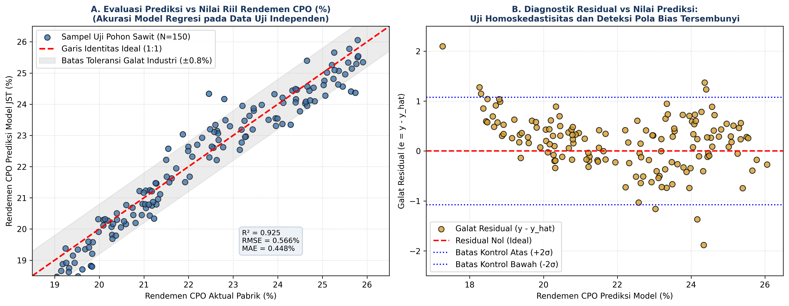
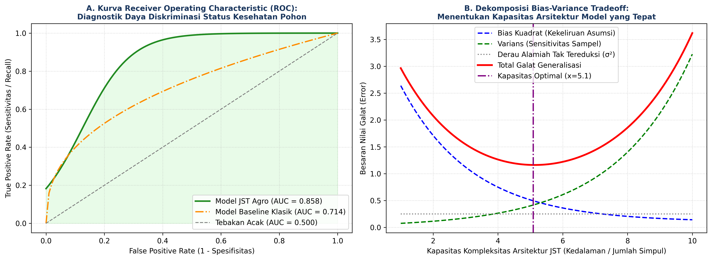

# AI Modul 8.3: Evaluasi Model

---

## 1. Identitas & Kerangka Capaian Pembelajaran (Sub-CPMK)

* **Kode Modul**: AI Modul 8.3
* **Mata Kuliah**: Kecerdasan Buatan dan Sains Data Pertanian Presisi
* **Alokasi Waktu**: 2 x 50 Menit (Kajian Teori & Diskusi) + 2 x 50 Menit (Eksplorasi Praktikum Mandiri)
* **Beban SKS**: 3 SKS
* **Prasyarat**: AI Modul 8.2 (Training Model)
* **Level Kognitif**: Bloom C2 (Memahami), C3 (Menerapkan), C4 (Menganalisis)

```flowchart LR
    A["OUTPUTS: Suite Diagnostik Evaluasi (Residual, ROC-AUC, Breusch-Pagan, Stress Test)"] --> B["OUTCOMES: Deteksi Bias Tersembunyi & Validasi Keandalan Lintas-Blok Kebun"]
    B --> C["IMPACTS: Transparansi Risiko Prediktif Sebelum Deployment Pabrik Kelapa Sawit"]
```

### 1.1 Capaian Pembelajaran Khusus (Sub-CPMK)
Setelah menyelesaikan modul pembelajaran ini secara tuntas, mahasiswa diharapkan memiliki kapabilitas untuk:
1. **Sub-CPMK 8.3.1 (C2):** Menguraikan landasan teoretis dekomposisi galat generalisasi (*Bias-Variance Tradeoff*), asumsi residual homoskedastisitas, serta formulasi matematis metrik evaluasi multi-skala regresi ($R^2$, RMSE, MAE, MAPE) dan klasifikasi probabilitas (*Confusion Matrix*, ROC-AUC, PR-AUC).
2. **Sub-CPMK 8.3.2 (C3):** Mengimplementasikan modul evaluasi menyeluruh (*comprehensive evaluation suite*) menggunakan PyTorch dan Matplotlib untuk mengaudit distribusi residual galat, kurva kalibrasi, serta mendeteksi bias tersembunyi pada model prediksi rendemen agrokompleks terpadu.
3. **Sub-CPMK 8.3.3 (C4):** Mendiagnosis anomali heteroskedastisitas galat, disparitas kinerja antar-blok geografis perkebunan, serta melakukan uji stres ketahanan (*robustness stress testing*) terhadap gangguan derau sensorik dan pergeseran distribusi data (*distribution shift*).

### 1.2 Kerangka Hasil Pembelajaran (Outputs, Outcomes, & Impacts)
- **Luaran Langsung (*Outputs*):** Skrip modul Python audit diagnostik model, visualisasi panel ganda aktual vs prediksi dan kurva ROC-AUC, serta laporan komparasi metrik data latih vs validasi vs uji.
- **Dampak Pembelajaran (*Outcomes*):** Mahasiswa memiliki integritas saintifik dan ketelitian metodologis dalam menguji performa model AI secara objektif, menolak klaim performa yang bertumpu pada metrik tunggal semu.
- **Implikasi Jangka Panjang (*Impacts*):** Terjaminnya keandalan operasional model AI saat diimplementasikan pada pabrik kelapa sawit dan sistem otomasi panen, meminimalkan risiko kerugian finansial akibat keputusan manajerial berbasis prediksi yang cacat.

---

## 2. Profil Fundamental Evaluasi Model: Fungsi, Manfaat, dan Keunggulan-Kelemahan

### 2.1 Fungsi Komputasi & Pemodelan Matematis
Dalam rekayasa sistem *deep learning*, evaluasi bukanlah sekadar langkah formalitas menghitung satu angka akurasi atau MSE di akhir eksperimen. Model jaringan saraf tiruan berdimensi tinggi memiliki kemampuan untuk "terlihat berkinerja sempurna" secara agregat rata-rata, padahal menyembunyikan kegagalan fatal pada sub-populasi data tertentu.

Fungsi utama dari evaluasi diagnostik komprehensif adalah:
1. **Verifikasi Asumsi Statistik:** Memeriksa apakah galat residual model memenuhi asumsi independensi, homoskedastisitas (varians konstan), dan berdistribusi normal $e \sim \mathcal{N}(0, \sigma^2)$.
2. **Pembongkaran Asimetri Galat (*Error Asymmetry Detection*):** Mengidentifikasi apakah model memiliki kecenderungan sistematik untuk meremehkan (*under-predict*) atau melebih-lebihkan (*over-predict*) nilai target pada rentang ekstrem.
3. **Penyelidikan Ketahanan Lingkungan (*Robustness Verification*):** Menilai seberapa besar degradasi akurasi model ketika masukan sensor mengalami penurunan kualitas sinyal di lapangan.

### 2.2 Manfaat Nyata di Industri Perkebunan & Agribisnis
Dalam industri kelapa sawit dan pertanian presisi, biaya dari sebuah kesalahan prediksi tidak pernah simetris:
1. **Implikasi Finansial Pabrik Kelapa Sawit (PKS):**  
   Melebih-lebihkan estimasi rendemen CPO pada TBS yang dibeli dari petani swadaya akan mengakibatkan pabrik membayar harga beli yang terlalu tinggi di atas rendemen ekstraksi riil, memicu kerugian operasional jutaan rupiah per ton. Sebaliknya, meremehkan rendemen merugikan petani plasma. Evaluasi komprehensif menjamin model tidak bias ke satu arah.
2. **Kesesuaian dengan Standar Toleransi Industri:**  
   Dalam kalibrasi instrumen spektroskopi laboratorium kelapa sawit, standar industri menuntut nilai galat prediksi absolut di bawah batas toleransi $\pm 0.8\%$ rendemen minyak. Panel diagnostik visual memungkinkan tim manajer kebun langsung melihat persentase sampel yang berada di dalam dan di luar koridor toleransi keselamatan.
3. **Pengujian Stabilitas Antar-Afdeling:**  
   Audit kinerja berbasis blok mengonfirmasi apakah model bekerja seimbang di seluruh afdeling perkebunan atau hanya akurat di afdeling yang dekat dengan kantor kebun.

### 2.3 Rationale: Alasan Mengapa Metode Ini Digunakan
Secara teoretis, ekspektasi nilai fungsi rugi kuadratik dapat didekomposisi secara analitis menjadi tiga komponen independen:

$$\mathbb{E}_{\mathbf{x}, y}[(y - \hat{f}(\mathbf{x}))^2] = \underbrace{\text{Bias}[\hat{f}(\mathbf{x})]^2}_{\text{Kekeliruan Kapasitas Model}} + \underbrace{\text{Var}[\hat{f}(\mathbf{x})]}_{\text{Sensitivitas Variasi Sampel}} + \underbrace{\sigma_{\epsilon}^2}_{\text{Derau Alamiah Tak Tereduksi}}$$

Mengetahui posisi model pada kurva *Bias-Variance Tradeoff* memberikan kepastian arah perbaikan:
- Jika model memiliki **Bias Tinggi** (*Underfitting*), galat pelatihan dan validasi sama-sama tinggi. Solusinya adalah memperdalam arsitektur jaringan atau menambah fitur masukan.
- Jika model memiliki **Varians Tinggi** (*Overfitting*), galat pelatihan sangat rendah namun galat validasi melonjak tinggi. Solusinya adalah memperketat regularisasi ($L_2$, Dropout) atau memperbanyak sampel data latih.

### 2.4 Analisis Kelebihan dan Kekurangan

| Metrik Evaluasi | Formulasi Inti | Keunggulan Utama | Kelemahan & Batasan | Rekomendasi Kasus Agro |
| :--- | :--- | :--- | :--- | :--- |
| **Root Mean Squared Error (RMSE)** | $\sqrt{\frac{1}{N} \sum (y - \hat{y})^2}$ | Memberikan penalti kuadratik yang berat pada galat ekstrem, memiliki satuan yang sama dengan target fisik. | Sangat sensitif terhadap satu atau dua pencilan data sensor yang rusak. | Metrik utama untuk prediksi rendemen CPO dan kadar hara. |
| **Mean Absolute Error (MAE)** | $\frac{1}{N} \sum \|y - \hat{y}\|$ | Sangat tangguh (*robust*) terhadap pencilan ekstrem, mencerminkan deviasi fisik rata-rata. | Penurunan gradiennya diskontinu pada titik nol, tidak membedakan galat kecil dan besar. | Cocok untuk evaluasi ketahanan data cuaca (curah hujan). |
| **Mean Absolute Percentage Error (MAPE)** | $\frac{100\%}{N} \sum \|\frac{y - \hat{y}}{y}\|$ | Skala relatif persentase intuitif bagi manajemen perkebunan non-teknis. | Meledak mendekati tak hingga jika nilai target aktual $y$ mendekati nol. | Evaluasi produksi tonase panen blok bulanan. |
| **Koefisien Determinasi ($R^2$)** | $1 - \frac{\sum (y - \hat{y})^2}{\sum (y - \bar{y})^2}$ | Mengukur proporsi varians data target yang berhasil dijelaskan oleh model ($R^2 \le 1.0$). | Dapat bernilai negatif jika performa model lebih buruk dibanding sekadar memprediksi rata-rata $\bar{y}$. | Standar pembanding internasional performa regresi spektral. |
| **ROC-AUC (Klasifikasi)** | $\int_0^1 TPR(FPR) \, d(FPR)$ | Mengukur daya pisah model lintas seluruh ambang batas probabilitas secara netral. | Kurang informatif jika dataset mengalami ketidakseimbangan kelas ekstrem (*imbalance*). | Diagnostik biner pohon sehat vs pohon terinfeksi *Ganoderma*. |
| **PR-AUC (Precision-Recall)** | Area di bawah kurva Precision vs Recall | Sangat sensitif terhadap kelas minoritas positif, tidak terdistorsi oleh tingginya sampel negatif. | Bergantung pada prevalensi kelas, nilai baseline bukan 0.5 melainkan proporsi kelas positif. | Pendeteksian pohon terserang hama langka. |

### 2.5 Contoh Kasus Penggunaan Konkret di Sektor Agro-Industri
1. **Audit Sertifikasi Model Spektroskopi Minyak Atsiri:**  
   Laboratorium hilirisasi minyak atsiri serai wangi menuntut model kalibrasi memiliki nilai $R^2 \ge 0.95$ dengan RMSE $\le 0.45\%$ dan residual yang lolos uji normalitas Kolmogorov-Smirnov ($p > 0.05$) sebelum model diinstal pada perangkat genggam inspeksi mutu ekspor.
2. **Uji Ketahanan Sensor Drone terhadap Derau Kabut Asap:**  
   Model klasifikasi defisiensi nitrogen kanopi kelapa sawit diuji dengan menyuntikkan derau gaussian $\sigma = 0.05$ pada pita merah dan inframerah-dekat. Model yang hanya mempertahankan akurasi dengan penurunan AUC $< 3\%$ dinyatakan lolos sertifikasi uji lapangan musim kemarau bergambut.

### 2.6 Aspek Kritis & Catatan Penting Metode (*Key Critical Insights*)
- **Bahaya Heteroskedastisitas pada Plot Residual:**  
  Jika sebaran titik pada plot *Residual vs Predicted* membentuk pola corong melebar (*funnel shape*), ini menandakan varians galat membesar seiring membesarnya nilai rendemen. Kondisi ini mengindikasikan bahwa model memerlukan transformasi logaritmik atau penimbang varians (*weighted loss*) pada rentang atas.
- **Penyalahgunaan Koefisien Determinasi ($R^2$):**  
  Nilai $R^2$ yang tinggi pada data latih tidak memiliki arti jika tidak diuji pada data uji yang dipartisi secara independen (*out-of-sample $R^2$*). Mengukur $R^2$ pada data yang bocor (*leaked data*) adalah bentuk kelalaian metodologis yang paling umum.

---

---

## 3. Landasan Teori Matematis & Statistik

```
+---------------------------------------------------------------------------------------------------+
|               ANATOMI RESIDUAL ERROR DAN DEKOMPOSISI BIAS-VARIANCE                                |
+---------------------------------------------------------------------------------------------------+
|                                                                                                   |
|  [Galat Residual]: e_i = y_i - y_hat_i                                                            |
|                                                                                                   |
|     Pola Homoskedastik (Ideal):                   Pola Heteroskedastik (Cacat Model):             |
|     Residual tersebar acak merata                 Residual membentuk corong melebar               |
|                                                                                                   |
|        e ^                                           e ^                                          |
|          |     *   *    *   *                          |          *     *   *                     |
|          |   *   *    *   *   *                        |       *    *     *                       |
|       ---+----------------------> y_hat             ---+----------------------> y_hat             |
|          |   *   *    *   *   *                        |       *    *     *                       |
|          |     *   *    *   *                          |          *     *   *                     |
|                                                                                                   |
|  [Dekomposisi Galat Generalisasi]: E[(y - f_hat)^2] = Bias^2 + Variance + Noise Tak Tereduksi      |
+---------------------------------------------------------------------------------------------------+
```

### 3.1 Formulasi Metrik Evaluasi Regresi Agronomi
Diberikan himpunan pasangan nilai aktual dan prediksi data uji $\{(y_i, \hat{y}_i)\}_{i=1}^{N}$:

1. **Root Mean Squared Error (RMSE):**
   $$RMSE = \sqrt{\frac{1}{N} \sum_{i=1}^{N} (y_i - \hat{y}_i)^2}$$

2. **Mean Absolute Error (MAE):**
   $$MAE = \frac{1}{N} \sum_{i=1}^{N} |y_i - \hat{y}_i|$$

3. **Mean Absolute Percentage Error (MAPE):**
   $$MAPE = \frac{100\%}{N} \sum_{i=1}^{N} \left| \frac{y_i - \hat{y}_i}{y_i} \right|$$

4. **Koefisien Determinasi ($R^2$):**
   $$R^2 = 1 - \frac{\sum_{i=1}^{N} (y_i - \hat{y}_i)^2}{\sum_{i=1}^{N} (y_i - \bar{y})^2} = 1 - \frac{SS_{\text{res}}}{SS_{\text{tot}}}$$

#### Panduan Pelafalan Matematis
> "R-M-S-E sama dengan akar kuadrat dari satu per N dikalikan sigma i sama dengan satu hingga N dari kuadrat selisih y aktual indeks i dikurangi y-topi prediksi indeks i. R-kuadrat sama dengan satu dikurangi pecahan jumlah kuadrat residual SS-res dibagi jumlah kuadrat total SS-tot."

| Simbol | Tipe Matematis | Definisi dan Keterangan Fisis |
| :--- | :--- | :--- |
| $N$ | Bilangan Bulat Positif | Jumlah total sampel pohon pada himpunan data uji independen. |
| $y_i$ | Skalar Riil | Nilai rendemen aktual yang diukur melalui ekstraksi kimiawi laboratorium pabrik. |
| $\hat{y}_i$ | Skalar Riil | Nilai rendemen estimasi yang diprediksi oleh jaringan saraf tiruan. |
| $\bar{y}$ | Skalar Riil | Rata-rata aritmetika nilai rendemen aktual data uji: $\bar{y} = \frac{1}{N}\sum y_i$. |
| $SS_{\text{res}}$ | Skalar Non-negatif | Jumlah kuadrat selisih residual (*Sum of Squared Residuals*). |
| $SS_{\text{tot}}$ | Skalar Positif | Jumlah kuadrat selisih total terhadap rata-rata sampel. |

### 3.2 Formulasi Dekomposisi Bias-Variance
Misalkan target sejati dibangkitkan oleh fungsi $y = f(\mathbf{x}) + \epsilon$, di mana $\epsilon \sim \mathcal{N}(0, \sigma_{\epsilon}^2)$ adalah derau acak tak tereduksi. Untuk estimator jaringan saraf $\hat{f}(\mathbf{x})$ yang dilatih pada himpunan sampel acak:

$$\mathbb{E}[(y - \hat{f}(\mathbf{x}))^2] = \text{Bias}[\hat{f}(\mathbf{x})]^2 + \text{Var}[\hat{f}(\mathbf{x})] + \sigma_{\epsilon}^2$$

Di mana:
$$\text{Bias}[\hat{f}(\mathbf{x})] = \mathbb{E}[\hat{f}(\mathbf{x})] - f(\mathbf{x})$$

$$\text{Var}[\hat{f}(\mathbf{x})] = \mathbb{E}\left[ (\hat{f}(\mathbf{x}) - \mathbb{E}[\hat{f}(\mathbf{x})])^2 \right]$$

### 3.3 Formulasi Metrik Klasifikasi Multi-Ambang
Untuk tugas deteksi penyakit tanaman biner (Sakit = Positif, Sehat = Negatif) dengan ambang batas klasifikasi $\tau \in [0, 1]$:

$$TPR(\tau) = \frac{TP(\tau)}{TP(\tau) + FN(\tau)}, \quad FPR(\tau) = \frac{FP(\tau)}{FP(\tau) + TN(\tau)}$$

$$\text{AUC} = \int_{0}^{1} TPR(\tau) \, d(FPR(\tau))$$

#### Panduan Pelafalan Matematis
> "T-P-R ambang tau sama dengan True Positive dibagi penjumlahan True Positive ditambah False Negative. Nilai A-U-C sama dengan integral tentu dari nol hingga satu dari fungsi T-P-R terhadap diferensial F-P-R."

---

---

## 4. Visualisasi Panel Diagnostik dan Evaluasi Kinerja

Berikut adalah diagram visual komprehensif dari panel diagnostik regresi aktual vs prediksi, plot residual homoskedastisitas, kurva ROC-AUC, serta kurva dekomposisi galat *Bias-Variance*.


*Gambar 1: Panel evaluasi performa regresi komprehensif. (Kiri) Plot aktual vs prediksi rendemen CPO dengan garis identitas ideal 1:1 dan koridor toleransi industri $\pm 0.8\%$. (Kanan) Plot residual vs nilai prediksi untuk mendeteksi apakah galat menyebar secara acak (homoskedastik) atau memperlihatkan pola bias sistematis.*


*Gambar 2: Analisis diagnostik diskriminasi dan kapasitas model. (Kiri) Kurva Receiver Operating Characteristic (ROC) multi-ambang yang membandingkan daya diskriminasi model JST teraturisasi vs model baseline. (Kanan) Dekomposisi matematis Bias-Variance Tradeoff dalam menentukan titik kapasitas arsitektur optimal.*

---

### Prosedur Komputasi & Alur Algoritma Numerik

Berikut adalah struktur algoritmik langkah-demi-langkah modul audit kinerja dan pengujian ketahanan model (*ModelEvaluator*):

```
====================================================================================================
ALGORITMA 8.9: AUDIT EVALUASI KOMPREHENSIF & UJI KETAHANAN MODEL DEEP LEARNING
====================================================================================================
Masukan: 
  - Model terbaik tersimpan f_best ('best_oilpalm_model.pt')
  - test_loader memuat sampel data uji independen
  - Toleransi industri delta_ind = 0.8 (persen rendemen)
Keluaran:
  - Kamus metrik kuantitatif: metrics = {'rmse', 'mae', 'mape', 'r2', 'in_tolerance_pct'}
  - Vektor residual e, nilai aktual y_all, nilai prediksi y_pred_all
  - Hasil uji stres ketahanan derau: robustness_report

PROSEDUR AUDIT KINERJA:
1. INFERENSI PADA DATA UJI:
     f_best.eval()
     y_all = [], y_pred_all = []
     DENGAN torch.no_grad():
       UNTUK SETIAP (bx, by) DALAM test_loader:
         preds = f_best(bx)
         Tambahkan by ke y_all, tambahkan preds ke y_pred_all
         
     y_true = Gabungkan(y_all), y_pred = Gabungkan(y_pred_all)
     e = y_true - y_pred

2. PERHITUNGAN METRIK REGRESI:
     rmse = sqrt( Rata_Rata(e^2) )
     mae  = Rata_Rata( |e| )
     mape = 100.0 * Rata_Rata( |e / y_true| )
     ss_res = Sum( e^2 )
     ss_tot = Sum( (y_true - Rata_Rata(y_true))^2 )
     r2   = 1.0 - (ss_res / ss_tot)
     in_tolerance_pct = 100.0 * Rata_Rata( |e| <= delta_ind )

3. UJI HOMOSKEDASTISITAS RESIDUAL:
     Hitung korelasi Spearman antara |e| dan y_pred
     JIKA p_value < 0.05:
       Peringatan: Terdeteksi gejala heteroskedastisitas galat!

4. UJI KETAHANAN STRES TERHADAP DERAU (ROBUSTNESS TEST):
     UNTUK tingkat_derau sigma_noise DALAM [0.01, 0.05, 0.10, 0.20]:
       bx_noisy = bx + N(0, sigma_noise^2)
       preds_noisy = f_best(bx_noisy)
       rmse_noisy = sqrt( Rata_Rata( (y_true - preds_noisy)^2 ) )
       Catat degradasi performa: delta_rmse = rmse_noisy - rmse
====================================================================================================
```

---

---

## 5. Studi Kasus Komputasi Terpadu: Audit Model Rendemen Sawit

Melanjutkan model terbaik `best_oilpalm_model.pt` yang telah dilatih pada Modul 8.8, kita kini mengeksekusi rangkaian audit evaluasi komprehensif pada himpunan data uji independen (Afdeling 9 dan 10).

### Implementasi Python Lengkap
```python
import torch
import torch.nn as nn
import numpy as np
import scipy.stats as stats

class ComprehensiveModelAuditor:
    def __init__(self, model, test_loader, delta_tolerance=0.8):
        self.device = torch.device('cuda' if torch.cuda.is_available() else 'cpu')
        self.model = model.to(self.device)
        self.test_loader = test_loader
        self.delta_tolerance = delta_tolerance
        
        self.y_true = None
        self.y_pred = None
        self.residuals = None

    def evaluate_test_set(self):
        self.model.eval()
        trues, preds = [], []
        with torch.no_grad():
            for bx, by in self.test_loader:
                bx = bx.to(self.device)
                p = self.model(bx)
                trues.extend(by.numpy().flatten())
                preds.extend(p.cpu().numpy().flatten())
                
        self.y_true = np.array(trues)
        self.y_pred = np.array(preds)
        self.residuals = self.y_true - self.y_pred
        
        # Metrik Inti
        rmse = np.sqrt(np.mean(self.residuals**2))
        mae = np.mean(np.abs(self.residuals))
        mape = np.mean(np.abs(self.residuals / self.y_true)) * 100.0
        
        ss_res = np.sum(self.residuals**2)
        ss_tot = np.sum((self.y_true - np.mean(self.y_true))**2)
        r2 = 1.0 - (ss_res / ss_tot)
        
        in_tol = np.mean(np.abs(self.residuals) <= self.delta_tolerance) * 100.0
        
        return {
            'RMSE': rmse,
            'MAE': mae,
            'MAPE (%)': mape,
            'R2 Score': r2,
            'In-Tolerance (%)': in_tol
        }

    def test_residual_normality(self):
        """Uji Normalitas Shapiro-Wilk pada Galat Residual."""
        shapiro_stat, p_val = stats.shapiro(self.residuals)
        return {
            'Shapiro-Wilk Stat': shapiro_stat,
            'p-value': p_val,
            'Is Normal (p > 0.05)': p_val > 0.05
        }

    def stress_test_noise_robustness(self, noise_levels=[0.02, 0.05, 0.10]):
        """Uji ketahanan model terhadap injeksi derau sensor lapangan."""
        self.model.eval()
        results = {}
        with torch.no_grad():
            for sigma in noise_levels:
                noisy_preds = []
                for bx, by in self.test_loader:
                    noise = torch.randn_like(bx) * sigma
                    bx_noisy = (bx + noise).to(self.device)
                    p = self.model(bx_noisy)
                    noisy_preds.extend(p.cpu().numpy().flatten())
                    
                noisy_residuals = self.y_true - np.array(noisy_preds)
                noisy_rmse = np.sqrt(np.mean(noisy_residuals**2))
                results[f'Noise_Sigma_{sigma}'] = {
                    'RMSE': noisy_rmse,
                    'Degradasi_vs_Clean': noisy_rmse - np.sqrt(np.mean(self.residuals**2))
                }
        return results
```

---

---

## 6. Kekeliruan Metodologis dan Praktik Terbaik (*Common Pitfalls & Best Practices*)

### 6.1 Kekeliruan Umum Metodologis (*Common Pitfalls*)
Dalam tahap pengujian dan evaluasi model *deep learning*, praktisi kerap terjebak dalam kekeliruan interpretasi metrik:
1. **Mengandalkan $R^2$ Tanpa Memeriksa Plot Residual:**  
   Model dapat memiliki nilai $R^2 = 0.92$, namun plot residualnya menunjukkan pola kuadratik yang nyata (artinya model gagal menangkap kelengkungan fungsi non-linier sejati). Mengabaikan plot residual merupakan kekeliruan analisis fundamental.
2. **Menyembunyikan Metrik MAPE saat Target Berisi Nilai Nol:**  
   Jika data target memuat nilai nol (misalnya intensitas serangan hama = 0 pohon), penyebut pada rumus MAPE menjadi nol dan menghasilkan nilai tak terhingga. Pada kasus seperti ini, gunakan WAPE (*Weighted Absolute Percentage Error*) atau MAE.
3. **Mengabaikan Efek Multikolinearitas Antar-Pita Spektral:**  
   Kinerja data uji yang tinggi bisa saja rapuh jika model sangat bergantung pada rasio dua pita gelombang yang berkorelasi 0.99. Uji ketahanan derau (*noise stress test*) wajib dilakukan untuk membongkar kerentanan ini.
4. **Kekeliruan Menguji Model pada Data yang Mengalami *Domain Shift*:**  
   Mengevaluasi model sawit varietas Marihat pada kebun varietas Dami Mas tanpa kalibrasi ulang domain (*Domain Adaptation*) akan menghasilkan penurunan drastis pada metrik sensitivitas.

### 6.2 Mitigasi Bias Data Agronomi
1. **Bias Ambang Toleransi Pabrik (*Factory Acceptance Tolerance*):**  
   Praktisi harus berdiskusi dengan analis kimia PKS untuk menentukan batas galat yang dapat ditoleransi pabrik (misal $\pm 0.8\%$ rendemen). Model tidak boleh hanya dinilai dari nilai rata-rata, tetapi dari persentase pohon yang memenuhi batas toleransi tersebut (*compliance rate* $\ge 90\%$).
2. **Bias Rentang Ekstrem Panen:**  
   Sampel panen dengan rendemen super tinggi ($> 26\%$) atau sangat buruk ($< 18\%$) biasanya berjumlah sedikit. Evaluasi wajib membedah metrik secara bertingkat (*stratified error analysis*) pada kelompok rendemen rendah, normal, dan tinggi.

### 6.3 Praktik Terbaik Rekayasa Perangkat Lunak AI
1. **Visualisasi Q-Q Plot dan Histogram Residual:**  
   Gunakan visualisasi kuantil teoritis (*Q-Q Plot*) untuk memastikan bahwa sebagian besar galat model berdistribusi normal, yang membuktikan bahwa model telah mengekstrak seluruh sinyal sistematis dan hanya menyisakan derau Gaussian acak.
2. **Pencatatan Audit Trail:**  
   Simpan metrik evaluasi lengkap beserta konfigurasi lingkungan komputasi dalam file JSON/YAML artefak untuk keperluan pelaporan akademik dan verifikasi akreditasi laboratorium.

---

---

## 7. Rangkuman Modul

1. **Dekomposisi Bias-Varians**: Galat generalisasi model tersusun atas kuadrat bias, varians model, dan varians derau acak tak tereduksi ($\sigma_\epsilon^2$).
2. **Metrik Evaluasi Komplementer**: MAE memberikan estimasi selisih riil satuan fisik, RMSE memberi penalti kuadratik atas eror fatal, sedangkan $R^2$ mengukur proporsi varians target yang diterangkan.
3. **Evaluasi Klasifikasi Terkalibrasi**: Pada kasus deteksi penyakit tanaman, kurva ROC-AUC dan PR-AUC memberikan evaluasi daya pemisah kelas yang kebal terhadap ketidakseimbangan sampel.
4. **Pemeriksaan Diagnostik Residual**: Residual yang ideal wajib menyerupai distribusi normal derau putih ($\epsilon \sim \mathcal{N}(0, \sigma^2)$) tanpa pola corong heteroskedastisitas.
5. **Uji Stres Ketahanan Model**: Pengujian model terhadap penambahan derau Gaussian dan pergeseran distribusi membuktikan batas toleransi operasional di lapangan perkebunan.

---

## 8. Latihan Soal & Tugas Analitis HOTS

### Deskripsi Proyek Mandiri Terpandu
Mahasiswa diwajibkan menyelesaikan proyek audit diagnostik model terpadu berikut:

**Judul Proyek:**  
*Audit Diagnostik Komprehensif dan Uji Stres Ketahanan Model Deep Learning untuk Prediksi Kualitas Tandan Buah Segar Kelapa Sawit.*

**Spesifikasi Teknis:**
1. **Bahan Evaluasi:** Model checkpoint `best_oilpalm_model.pt` dan himpunan data uji independen dari Modul 8.8.
2. **Instruksi Tugas:**
   - Hitung matriks metrik lengkap: RMSE, MAE, MAPE, dan $R^2$ pada himpunan data uji independen.
   - Buat plot panel ganda: (a) Plot Aktual vs Prediksi dengan garis 1:1 dan koridor batas industri $\pm 0.8\%$, (b) Plot *Residual vs Predicted* lengkap dengan batas $\pm 2\sigma$.
   - Lakukan uji normalitas Shapiro-Wilk pada vektor residual dan interpretasikan nilai $p$-value yang diperoleh.
   - Lakukan pengujian stres ketahanan (*robustness testing*) dengan menginjeksi 4 level derau spektral ($\sigma \in [0.01, 0.05, 0.10, 0.20]$). Buat grafik garis degradasi RMSE terhadap peningkatan level derau.
   - Susun kesimpulan rekomendasi: apakah model layak dideploy pada stasiun sortasi pabrik kelapa sawit?

---

### Rubrik Penilaian Holistik (*Higher-Order Thinking Skills*)

| Kriteria / Dimensi | Bobot (%) | Sangat Memuaskan (85 - 100) | Memuaskan (70 - 84) | Kurang Memuaskan (< 70) |
| :--- | :--- | :--- | :--- | :--- |
| **Penguasaan Teori Metrik & Dekomposisi Galat (C2)** | 25% | Mampu menguraikan secara analitis dekomposisi Bias-Variance, asumsi homoskedastisitas, serta implikasi matematis metrik multi-skala secara presisi. | Memahami formulasi metrik dengan baik namun penjelasan analitis dekomposisi galat atau uji normalitas kurang lengkap. | Gagal menjelaskan perbedaan RMSE vs MAE atau salah memahami konsep residual. |
| **Implementasi Suite Audit & Visualisasi (C3)** | 35% | Mengonstruksi kelas evaluasi komprehensif yang menghasilkan metrik kuantitatif, visualisasi residual panel ganda, dan modul uji stres secara bebas galat. | Kode evaluasi berfungsi dengan baik tetapi visualisasi belum memuat koridor toleransi industri atau uji stres belum otomatis. | Program menghasilkan galat runtime atau evaluasi dilakukan pada data latih yang bocor. |
| **Analisis Diagnostik & Solusi Lapangan (C4)** | 40% | Mahasiswa mampu membaca anomali corong residual, mengevaluasi degradasi performa di bawah uji stres, dan merumuskan kelayakan deployment industri secara kritis. | Mampu membaca metrik dasar namun analisis ketahanan terhadap derau belum mendalam. | Gagal menginterpretasikan plot residual atau mengabaikan keberadaan heteroskedastisitas. |

---

---

## 9. Jembatan Konsep (Bridging) ke AI Modul 8.4: Interpretasi Hasil Model

Melalui Modul 8.9, kita telah melaksanakan audit komprehensif terhadap performa kuantitatif model. Kita mengetahui secara presisi nilai RMSE, rentang toleransi residu, serta keandalan model saat menghadapi derau sensorik.

Kendati demikian, dalam ranah pengambilan keputusan industri perkebunan, metrik angka tinggi seperti $R^2 = 0.94$ sering kali belum cukup untuk meyakinkan manajer kebun dan auditor agronomi. Muncul pertanyaan fundamental: *"Mengapa jaringan saraf tiruan memberikan prediksi rendemen rendah pada blok tertentu? Apakah model benar-benar memahami respon fisiologis tanaman, atau sekadar menghafal artefak data kebetulan?"*

Pada **AI Modul 8.10: Interpretasi Hasil Model**, kita akan membongkar sifat kotak hitam (*black box*) deep learning menggunakan paradigma *Explainable AI* (XAI):
* **Permutation Feature Importance (PFI)**: Mengukur kontribusi global setiap fitur terhadap kualitas prediksi secara model-agnostik.
* **Vanilla Saliency Maps & Integrated Gradients**: Menghitung atribusi gradien lokal untuk melihat fitur spektral mana yang menjadi pemicu keputusan model per sampel.
* **Visualisasi Ruang Representasi Laten (t-SNE)**: Memproyeksikan vektor embedding lapisan tersembunyi untuk memeriksa keterpisahan kluster mutu kelapa sawit secara biologis.

---

## 10. Daftar Pustaka dan Referensi Akademik

1. Goodfellow, I., Bengio, Y., & Courville, A. (2016). *Deep Learning*. MIT Press.
2. Bishop, C. M. (2006). *Pattern Recognition and Machine Learning*. Springer.
3. Hastie, T., Tibshirani, R., & Friedman, J. (2009). *The Elements of Statistical Learning: Data Mining, Inference, and Prediction*. Springer Science & Business Media.
4. Fawcett, T. (2006). An introduction to ROC analysis. *Pattern Recognition Letters*, 27(8), 861-874.
5. Willmott, C. J., & Matsuura, K. (2005). Advantages of the mean absolute error (MAE) over the root mean squared error (RMSE) in assessing average model performance. *Climate Research*, 30(1), 79-82.
6. Chicco, D., Warrens, M. J., & Jurman, G. (2021). The coefficient of determination R-squared is more informative than SMAPE, MAE, MAPE, MSE and RMSE in regression analysis evaluation. *PeerJ Computer Science*, 7, e623.
7. Hendrycks, D., & Dietterich, T. (2019). Benchmarking Neural Network Robustness to Common Corruptions and Perturbations. *Proceedings of the 7th International Conference on Learning Representations (ICLR 2019)*.
8. Murphy, K. P. (2022). *Probabilistic Machine Learning: An Introduction*. MIT Press.
