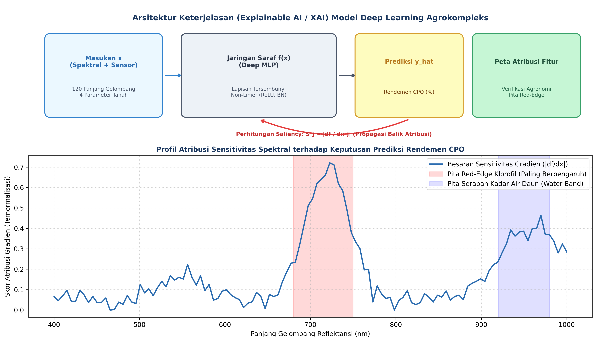
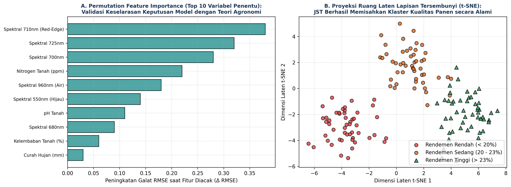

# AI Modul 8.4: Interpretasi Hasil Model

---

## 1. Identitas & Kerangka Capaian Pembelajaran (Sub-CPMK)

* **Kode Modul**: AI Modul 8.4
* **Mata Kuliah**: Kecerdasan Buatan dan Sains Data Pertanian Presisi
* **Alokasi Waktu**: 2 x 50 Menit (Kajian Teori & Diskusi) + 2 x 50 Menit (Eksplorasi Praktikum Mandiri)
* **Beban SKS**: 3 SKS
* **Prasyarat**: AI Modul 8.3 (Evaluasi Model)
* **Level Kognitif**: Bloom C2 (Memahami), C3 (Menerapkan), C4 (Menganalisis)

```flowchart LR
    A["OUTPUTS: Skrip XAI Terintegrasi (PFI, Saliency Maps, Integrated Gradients, t-SNE)"] --> B["OUTCOMES: Transparansi Alasan Prediksi & Validasi Keselarasan Fisiologi Tanaman"]
    B --> C["IMPACTS: Kepercayaan Penuh Agronom & Keputusan Panen Sawit yang Akuntabel"]
```

### 1.1 Capaian Pembelajaran Khusus (Sub-CPMK)
Setelah menyelesaikan modul pembelajaran ini secara tuntas, mahasiswa diharapkan memiliki kapabilitas untuk:
1. **Sub-CPMK 8.4.1 (C2):** Menguraikan urgensi transparansi model (*Explainable AI* / XAI) dalam domain agrokompleks, konsep atribusi fitur (*feature attribution*), serta membedakan metode model-agnostic (*Permutation Feature Importance*) dengan metode model-specific berbasis gradien (*Vanilla Saliency Maps* dan *Integrated Gradients*).
2. **Sub-CPMK 8.4.2 (C3):** Mengimplementasikan algoritma penghitungan atribusi fitur berbasis gradien PyTorch dan ekstraksi vektor representasi laten lapisan tersembunyi untuk diproyeksikan secara visual menggunakan teknik reduksi dimensi non-linier t-SNE.
3. **Sub-CPMK 8.4.3 (C4):** Mendiagnosis keselarasan biologis (*agronomic sanity check*) antara fitur berbobot atribusi tinggi yang diprioritaskan oleh jaringan saraf tiruan dengan teori fisiologi tanaman kelapa sawit (misalnya pita serapan pigmen klorofil *red-edge* dan serapan air).

### 1.2 Kerangka Hasil Pembelajaran (Outputs, Outcomes, & Impacts)
- **Luaran Langsung (*Outputs*):** Skrip modul Python implementasi XAI berbasis PyTorch, grafik batang ranking fitur PFI, profil kontur sensitivitas spektral, serta visualisasi klaster ruang laten t-SNE.
- **Dampak Pembelajaran (*Outcomes*):** Mahasiswa memiliki kemahiran dalam membongkar sifat "kotak hitam" jaringan saraf tiruan, menjembatani bahasa komputasi tensor dengan bahasa fisiologi agronomi para praktisi kebun.
- **Implikasi Jangka Panjang (*Impacts*):** Meningkatnya kepercayaan (*trust*) manajemen perkebunan dan instansi sertifikasi terhadap adopsi sistem kecerdasan buatan, memastikan keputusan pemupukan dan panen didasarkan pada landasan ilmiah yang transparan dan dapat dipertanggungjawabkan.

---

## 2. Profil Fundamental Interpretasi Hasil Model: Fungsi, Manfaat, dan Keunggulan-Kelemahan

### 2.1 Fungsi Komputasi & Pemodelan Matematis
Arsitektur *Deep Learning* dikenal memiliki kapasitas aproksimasi fungsi yang luar biasa, namun kerap dikritik sebagai sistem "kotak hitam" (*black box*) karena memetakan masukan ke keluaran melalui jutaan interaksi non-linier parameter yang sulit dilacak secara intuitif. 

Fungsi utama dari teknik keterjelasan (*Explainable AI* / XAI) adalah:
1. **Transparansi Keputusan (*Decision Transparency*):** Mengidentifikasi besaran kontribusi setiap variabel masukan (panjang gelombang spektroskopi dan parameter tanah) terhadap nilai prediksi akhir yang dihasilkan model.
2. **Audit Pencegahan Bias Palsu (*Clever Hans Effect Detection*):** Memastikan bahwa model membuat prediksi akurat karena benar-benar mempelajari fitur biologis tanaman yang valid, bukan karena kebetulan mengeksploitasi korelasi palsu (*spurious correlations*) pada data latih (misalnya tanda goresan pada wadah sampel).
3. **Kepatuhan Regulasi dan Etika AI:** Menyediakan jejak penalaran (*reasoning audit trail*) yang dapat diinspeksi oleh auditor sertifikasi minyak sawit berkelanjutan (RSPO/ISPO).

### 2.2 Manfaat Nyata di Industri Perkebunan & Agribisnis
Dalam industri perkebunan kelapa sawit dan pertanian presisi, transparansi model memberikan manfaat operasional yang krusial:
1. **Verifikasi Keselarasan Fisiologi Tanaman (*Agronomic Alignment*):**  
   Ketika model memprediksi rendemen CPO tinggi berdasarkan pantulan spektral di sekitar 705–730 nm (*red-edge*), agronom kebun dapat memverifikasi bahwa model selaras dengan teori fotosintesis: pita *red-edge* berkorelasi langsung dengan konsentrasi klorofil dan akumulasi lipid pada mesokarp buah sawit.
2. **Efisiensi Sensorik dan Reduksi Biaya (*Sensor Cost Reduction*):**  
   Melalui analisis *Permutation Feature Importance*, tim teknologi perkebunan dapat mengetahui bahwa dari 120 kanal spektral yang mahal, hanya ada 8 pita gelombang kunci yang menyumbang $90\%$ akurasi prediksi. Hal ini memungkinkan perancangan sensor spektrometer optik kustom yang jauh lebih murah untuk dipasang massal pada traktor kebun.
3. **Dukungan Preskriptif Pemupukan:**  
   Jika model mengindikasikan bahwa penurunan rendemen di Afdeling 8 sangat dipengaruhi oleh gradien sensitivitas parameter Nitrogen tanah, manajemen kebun dapat langsung merumuskan tindakan korektif berupa penambahan dosis pupuk urea pada blok terkait.

### 2.3 Rationale: Alasan Mengapa Metode Ini Digunakan
Dua pendekatan utama yang digunakan untuk menyingkap cara kerja jaringan saraf tiruan adalah atribusi berbasis perturbasi (*perturbation-based*) dan atribusi berbasis gradien (*gradient-based*).

Metode *Permutation Feature Importance* (Breiman, 2001; Fisher et al., 2019) mengukur signifikansi fitur dengan memutus hubungan antara fitur tersebut dan target melalui pengacakan nilai kolom secara acak. Kenaikan nilai *loss* mencerminkan ketergantungan model terhadap fitur tersebut.

Di sisi lain, metode berbasis gradien seperti *Vanilla Saliency* (Simonyan et al., 2013) menghitung turunan parsial keluaran terhadap masukan melalui propagasi mundur analitis:

$$S_j(\mathbf{x}) = \left| \frac{\partial f(\mathbf{x})}{\partial x_j} \right|$$

Nilai gradien yang besar menunjukkan bahwa perubahan kecil pada fitur $x_j$ akan memicu perubahan drastis pada prediksi rendemen. Untuk mengatasi persoalan saturasi gradien (*gradient saturation*) pada fungsi aktivasi yang mendatar, metode *Integrated Gradients* (Sundararajan et al., 2017) mengintegrasikan vektor gradien di sepanjang lintasan linier antara titik acuan dasar (*baseline*) $\mathbf{x}'$ dan sampel aktual $\mathbf{x}$, menjamin pemenuhan aksioma kelengkapan matematis (*completeness axiom*).

### 2.4 Analisis Kelebihan dan Kekurangan

| Metode XAI | Landasan Teoretis | Keunggulan Utama | Kelemahan & Batasan | Rekomendasi Kasus Agro |
| :--- | :--- | :--- | :--- | :--- |
| **Permutation Feature Importance (PFI)** | Evaluasi pergeseran empiris loss saat fitur dipermutasi acak | Model-agnostic, sangat intuitif, tidak memerlukan diferensiasi model. | Dapat melebih-lebihkan kepentingan fitur yang saling berkorelasi tinggi (*collinear*). | Ranking global variabel sensor lingkungan dan tanah. |
| **Vanilla Gradient Saliency** | Turunan parsial diferensial pertama: $\nabla_{\mathbf{x}} f(\mathbf{x})$ | Sangat cepat dihitung (satu langkah *backward pass* PyTorch), spesifik per sampel. | Rentan terhadap saturasi gradien (*zero gradient* pada daerah plat), visualisasi bising. | Penapisan awal (*screening*) kanal spektral aktif. |
| **Integrated Gradients (IG)** | Integrasi kurva gradien terhadap titik acuan baseline | Memenuhi aksioma kelengkapan ($\sum IG_j = f(\mathbf{x}) - f(\mathbf{x}')$), sangat teoretis. | Memerlukan pemilihan titik baseline $\mathbf{x}'$ yang tepat dan komputasi $m$-langkah integrasi. | Atribusi presisi panjang gelombang spektroskopi Vis-NIR. |
| **t-SNE Ruang Laten** | Proyeksi manifold non-linier berbasis divergensi KL | Memvisualisasikan bagaimana representasi lapisan tersembunyi mengelompokkan kondisi tanaman. | Tidak bersifat deterministik, memerlukan penalaan parameter *perplexity*, sumbu tidak bermakna fisis. | Eksplorasi klaster pohon buah mentah, matang, dan lewat matang. |

### 2.5 Contoh Kasus Penggunaan Konkret di Sektor Agro-Industri
1. **Validasi Mutu Spektrometri TBS Kelapa Sawit:**  
   Sebuah model MLP dilatih untuk memprediksi asam lemak bebas (*Free Fatty Acids* / FFA). Melalui analisis atribusi *Integrated Gradients*, ditemukan bahwa model memberikan bobot atribusi tertinggi pada pita 930 nm dan 980 nm (yang berpadanan dengan ikatan getaran C-H lipid teroksidasi dan gugus O-H air). Hal ini mengonfirmasi keabsahan biologis bahwa buah sawit yang membusuk mengalami hidrolisis minyak menjadi FFA dan air.
2. **Pembersihan Fitur Sensor Cuaca yang Tidak Relevan:**  
   Analisis PFI membuktikan bahwa fitur "arah angin" memiliki nilai kepentingan $\Delta \text{RMSE} \approx 0.000$, sehingga sensor arah angin dapat dieliminasi dari stasiun cuaca kebun tanpa menurunkan akurasi model sedikit pun.

### 2.6 Aspek Kritis & Catatan Penting Metode (*Key Critical Insights*)
- **Pemilihan Titik Acuan (*Baseline Selection*) pada Integrated Gradients:**  
  Metode *Integrated Gradients* memerlukan input dasar $\mathbf{x}'$ yang merepresentasikan "ketiadaan informasi". Pada spektrometri Vis-NIR daun, baseline tidak boleh berupa vektor nol mutlak (yang merefleksikan benda hitam sempurna nir-reflektansi), melainkan vektor spektrum daun mati atau nilai rata-rata sampel populasi data latih.
- **Multikolinearitas Antar-Pita Spektral:**  
  Dua panjang gelombang yang berdekatan (misal 710 nm dan 712 nm) memiliki korelasi reflektansi $> 0.99$. Permutasi acak satu pita saja dapat menghasilkan kombinasi input yang tidak realistis secara fisika. Praktisi disarankan mengelompokkan pita spektral ke dalam kluster pita (*grouped feature importance*) sebelum permutasi.

---

---

## 3. Landasan Teori Matematis & Statistik

```
+---------------------------------------------------------------------------------------------------+
|               PRINSIP INTEGRATED GRADIENTS DAN PROYEKSI RUANG LATEN                               |
+---------------------------------------------------------------------------------------------------+
|                                                                                                   |
|  [Lintasan Integrasi Linier]: gamma(alpha) = x' + alpha * (x - x')    dengan alpha in [0, 1]      |
|                                                                                                   |
|        f(x) ^                                                                                     |
|             |                       .---* Sampel Nyata x (f(x) = Rendemen 24%)                    |
|             |                 .----'                                                              |
|             |           .----'       Gradien df/dx dihitung di sepanjang lintasan                 |
|             |     .----'                                                                          |
|             |  * Baseline x' (f(x') = Rendemen Rata-rata 21%)                                     |
|             +----------------------------------------------------> Lintasan alpha                 |
|                                                                                                   |
|  Aksioma Kelengkapan: sum_j( IG_j ) = f(x) - f(x')    (Atribusi Menjelaskan Gap Prediksi Penuh)   |
+---------------------------------------------------------------------------------------------------+
```

### 3.1 Formulasi Permutation Feature Importance (PFI)
Diberikan model terlatih $\hat{f}$, himpunan data uji $\mathbf{X} \in \mathbb{R}^{N \times d}$ dengan label target $\mathbf{y}$, dan fungsi evaluasi galat $\mathcal{L}(\mathbf{X}, \mathbf{y})$ (misalnya MSE).  
Untuk setiap fitur ke-$j \in \{1, \dots, d\}$:
1. Bentuk matriks permutasi $\mathbf{X}^{perm(j)}$ dengan mengacak urutan baris pada kolom ke-$j$ secara acak, sementara kolom lainnya dibiarkan tetap.
2. Hitung galat evaluasi terdistorsi: $\mathcal{L}^{perm(j)} = \mathcal{L}(\mathbf{X}^{perm(j)}, \mathbf{y})$.
3. Skor kepentingan fitur $I(f_j)$ didefinisikan sebagai selisih kenaikan galat:

$$I(f_j) = \mathcal{L}(\mathbf{X}^{perm(j)}, \mathbf{y}) - \mathcal{L}(\mathbf{X}, \mathbf{y})$$

#### Panduan Pelafalan Matematis
> "Skor kepentingan fitur I dari f sub j sama dengan fungsi rugi L dari matriks X terpermutasi kolom j dan vektor y, dikurangi fungsi rugi L dari matriks X asli dan vektor y."

| Simbol | Tipe Matematis | Definisi dan Keterangan Fisis |
| :--- | :--- | :--- |
| $I(f_j)$ | Skalar Riil | Nilai kepentingan fitur ke-$j$; semakin besar nilainya, semakin krusial fitur tersebut. |
| $\mathbf{X}^{perm(j)}$ | Matriks Riil $\mathbb{R}^{N \times d}$ | Matriks fitur data uji di mana nilai variabel kolom ke-$j$ telah diacak secara acak. |
| $\mathcal{L}$ | Fungsi Pemetaan $\mathbb{R}^{N \times d} \rightarrow \mathbb{R}$ | Fungsi evaluasi kinerja model (Root Mean Squared Error atau Cross-Entropy). |

### 3.2 Formulasi Integrated Gradients (Sundararajan et al., 2017)
Diberikan sampel masukan aktual $\mathbf{x} \in \mathbb{R}^d$ dan vektor acuan dasar $\mathbf{x}' \in \mathbb{R}^d$. Nilai atribusi *Integrated Gradients* untuk dimensi fitur ke-$j$ didefinisikan sebagai:

$$IG_j(\mathbf{x}) = (x_j - x'_j) \times \int_{0}^{1} \frac{\partial f(\mathbf{x}' + \alpha(\mathbf{x} - \mathbf{x}'))}{\partial x_j} \, d\alpha$$

Dalam komputasi numerik, integral kontinu di atas didekati menggunakan jumlahan Riemann sepanjang $m$ langkah interpolasi teratur ($\alpha = \frac{k}{m}$ untuk $k = 1, \dots, m$):

$$IG_j(\mathbf{x}) \approx \frac{(x_j - x'_j)}{m} \sum_{k=1}^{m} \frac{\partial f\left(\mathbf{x}' + \frac{k}{m}(\mathbf{x} - \mathbf{x}')\right)}{\partial x_j}$$

#### Panduan Pelafalan Matematis
> "I-G sub j dari vektor x sama dengan selisih x j dikurangi x-aksen j, dikalikan integral dari nol hingga satu dari turunan parsial f terhadap x j dievaluasi pada titik x-aksen ditambah alpha dikalikan selisih x dikurangi x-aksen terhadap diferensial alpha."

Aksioma terpenting dari *Integrated Gradients* adalah **Aksioma Kelengkapan (*Completeness Axiom*)**:

$$\sum_{j=1}^{d} IG_j(\mathbf{x}) = f(\mathbf{x}) - f(\mathbf{x}')$$

Persamaan kelengkapan ini membuktikan bahwa jumlah seluruh nilai atribusi fitur merepresentasikan secara eksak selisih antara nilai prediksi sampel aktual terhadap nilai prediksi titik baseline.

### 3.3 Formulasi Proyeksi Manifold t-SNE
Untuk memvisualisasikan representasi lapisan laten tersembunyi $\mathbf{h}_i \in \mathbb{R}^p$ ke ruang 2 dimensi $\mathbf{y}_i \in \mathbb{R}^2$, algoritma t-SNE meminimalkan divergensi Kullback-Leibler:

$$KL(P \parallel Q) = \sum_{i} \sum_{j \neq i} p_{j|i} \log \frac{p_{j|i}}{q_{j|i}}$$

Di mana probabilitas keserupaan ruang laten berdimensi tinggi dimodelkan dengan distribusi Gaussian bersyarat $p_{j|i}$, sedangkan probabilitas keserupaan ruang proyeksi berdimensi rendah dimodelkan dengan distribusi $t$-Student berderajat bebas satu:

$$q_{ij} = \frac{(1 + \|\mathbf{y}_i - \mathbf{y}_j\|^2)^{-1}}{\sum_{k} \sum_{l \neq k} (1 + \|\mathbf{y}_k - \mathbf{y}_l\|^2)^{-1}}$$

---

---

## 4. Visualisasi Profil Keterjelasan dan Ruang Laten

Berikut adalah diagram visual komprehensif dari arsitektur keterjelasan model *deep learning* agrokompleks, profil atribusi sensitivitas spektral, ranking variabel *Permutation Feature Importance*, serta pemetaan ruang representasi tersembunyi t-SNE.


*Gambar 1: Arsitektur keterjelasan Explainable AI. (Atas) Aliran diferensiasi balik dari nilai prediksi rendemen CPO menuju fitur masukan untuk menghasilkan peta atribusi. (Bawah) Profil sensitivitas gradien yang memperlihatkan konsentrasi atribusi model tepat pada pita serapan red-edge klorofil (680–750 nm) dan pita air (920–980 nm).*


*Gambar 2: Pembongkaran mekanisme internal JST. (Kiri) Ranking 10 fitur paling berpengaruh melalui Permutation Feature Importance yang membuktikan dominasi pita red-edge dan hara nitrogen tanah. (Kanan) Proyeksi t-SNE dari aktivasi lapisan tersembunyi yang mendemonstrasikan bagaimana jaringan saraf secara alami memisahkan klaster kualitas rendemen sawit.*

---

### Prosedur Komputasi & Alur Algoritma Numerik

Berikut adalah struktur algoritmik langkah-demi-langkah implementasi kalkulasi *Gradient Saliency* dan *Permutation Feature Importance*:

```
====================================================================================================
ALGORITMA 8.10: ATRIBUSI FITUR XAI & EKSTRAKSI RUANG LATEN DEEP LEARNING
====================================================================================================
Masukan: 
  - Model terlatih f_model, data uji X_test (tensor), label y_test (tensor)
  - Jumlah langkah interpolasi Riemann m_steps = 50, titik acuan baseline x_prime
Keluaran:
  - Skor PFI per fitur: pfi_scores (array berukuran d)
  - Vektor atribusi Integrated Gradients: ig_attributions (matriks N x d)
  - Koordinat proyeksi t-SNE 2D: latent_tsne (matriks N x 2)

PROSEDUR 1: PERMUTATION FEATURE IMPORTANCE (f_model, X_test, y_test):
1. Evaluasi galat dasar: base_rmse = sqrt( MSE(f_model(X_test), y_test) )
2. UNTUK SETIAP fitur j = 1 s.d. d:
     X_perm = Salin(X_test)
     Acak urutan elemen pada kolom j: X_perm[:, j] = PermutasiAcak(X_perm[:, j])
     perm_rmse = sqrt( MSE(f_model(X_perm), y_test) )
     pfi_scores[j] = perm_rmse - base_rmse
3. KEMBALIKAN pfi_scores

PROSEDUR 2: INTEGRATED GRADIENTS (f_model, x_input, x_prime, m_steps):
1. Inisialisasi total_grads = 0
2. UNTUK k = 1 s.d. m_steps:
     alpha = k / m_steps
     x_interpolated = x_prime + alpha * (x_input - x_prime)
     Aktifkan pelacakan gradien: x_interpolated.requires_grad_(True)
     output = f_model(x_interpolated)
     grad = torch.autograd.grad(output, x_interpolated)[0]
     total_grads += grad
3. ig = (x_input - x_prime) * (total_grads / m_steps)
4. KEMBALIKAN ig
====================================================================================================
```

---

---

## 5. Studi Kasus Komputasi Terpadu: Membongkar Model Rendemen CPO

Melanjutkan model terbaik `best_oilpalm_model.pt` dari Modul 8.8 dan 8.9, kita kini menerapkan teknik XAI untuk memverifikasi apakah keputusan model selaras dengan prinsip agronomi kelapa sawit.

### Implementasi PyTorch Lengkap
```python
import torch
import torch.nn as nn
import numpy as np
from sklearn.manifold import TSNE

class DeepExplainableAI:
    def __init__(self, model):
        self.device = torch.device('cuda' if torch.cuda.is_available() else 'cpu')
        self.model = model.to(self.device)
        self.model.eval()

    def compute_permutation_importance(self, X_tensor, y_tensor, metric_fn=nn.MSELoss()):
        """Menghitung Permutation Feature Importance (PFI) untuk seluruh kolom masukan."""
        with torch.no_grad():
            base_pred = self.model(X_tensor.to(self.device))
            base_loss = torch.sqrt(metric_fn(base_pred, y_tensor.to(self.device))).item()
            
        n_features = X_tensor.shape[1]
        importance_scores = np.zeros(n_features)
        
        for j in range(n_features):
            X_perm = X_tensor.clone()
            perm_idx = torch.randperm(X_tensor.size(0))
            X_perm[:, j] = X_perm[perm_idx, j]
            
            with torch.no_grad():
                perm_pred = self.model(X_perm.to(self.device))
                perm_loss = torch.sqrt(metric_fn(perm_pred, y_tensor.to(self.device))).item()
                
            importance_scores[j] = perm_loss - base_loss
            
        return importance_scores

    def compute_integrated_gradients(self, x_sample, x_baseline=None, m_steps=50):
        """Menghitung atribusi Integrated Gradients untuk satu sampel input."""
        x_sample = x_sample.view(1, -1).to(self.device)
        if x_baseline is None:
            x_baseline = torch.zeros_like(x_sample)
        else:
            x_baseline = x_baseline.view(1, -1).to(self.device)
            
        accumulated_grads = torch.zeros_like(x_sample)
        
        for k in range(1, m_steps + 1):
            alpha = float(k) / m_steps
            x_step = x_baseline + alpha * (x_sample - x_baseline)
            x_step.requires_grad_(True)
            
            out = self.model(x_step)
            grad = torch.autograd.grad(out, x_step)[0]
            accumulated_grads += grad
            
        avg_grads = accumulated_grads / m_steps
        ig_attribution = (x_sample - x_baseline) * avg_grads
        return ig_attribution.detach().cpu().numpy().flatten()

    def extract_latent_representations(self, data_loader):
        """Mengekstrak vektor aktivasi lapisan tersembunyi terakhir (sebelum output)."""
        latent_vectors = []
        all_targets = []
        
        # Ekstraksi manual sub-jaringan sebelum lapisan linear akhir
        # self.model.net memuat lapisan Sequential: [0 s.d. 7] adalah lapisan tersembunyi
        feature_extractor = nn.Sequential(*list(self.model.net.children())[:-1])
        feature_extractor.eval()
        
        with torch.no_grad():
            for bx, by in data_loader:
                bx = bx.to(self.device)
                h = feature_extractor(bx)
                latent_vectors.append(h.cpu().numpy())
                all_targets.append(by.numpy())
                
        H = np.vstack(latent_vectors)
        y = np.vstack(all_targets).flatten()
        return H, y
```

---

---

## 6. Kekeliruan Metodologis dan Praktik Terbaik (*Common Pitfalls & Best Practices*)

### 6.1 Kekeliruan Umum Metodologis (*Common Pitfalls*)
Dalam menerapkan teknik Explainable AI pada domain agrokompleks, peneliti kerap melakukan kekeliruan analisis berikut:
1. **Mengabaikan Efek Multikolinearitas saat Membaca Nilai PFI:**  
   Jika dua fitur spektral yang bertetangga (misal 705 nm dan 710 nm) sama-sama membawa informasi red-edge, mengacak pita 705 nm saja mungkin tidak menurunkan akurasi karena model dapat mengompensasi informasi tersebut melalui pita 710 nm. Akibatnya, kedua fitur tampak memiliki skor PFI rendah secara individual, padahal kelompok fitur red-edge sangat krusial. Praktik terbaik adalah melakukan *Grouped Feature Importance*.
2. **Menggunakan Baseline Bernilai Nol pada Data Terstandarisasi:**  
   Pada data terstandarisasi $Z$-Score di mana rata-rata sampel adalah 0.0, input bernilai nol sebenarnya merepresentasikan sampel "pohon rata-rata normal". Menggunakan vektor nol sebagai baseline Integrated Gradients berarti menghitung deviasi pohon terhadap kondisi pohon rata-rata, yang sangat valid secara matematis dan agronomi. Kesalahan terjadi jika praktisi menganggap vektor nol sebagai "tanaman mati nir-sinyal".
3. **Mengacaukan Antara Korelasi dan Sebab-Akibat (*Correlation vs Causation*):**  
   Skor atribusi tinggi pada sensor kelembaban tanah tidak serta-merta membuktikan bahwa menyiram pohon akan seketika meningkatkan rendemen CPO. XAI hanya menjelaskan representasi fungsi matematika model, bukan hubungan sebab-akibat agronomi murni.
4. **Terlalu Bergantung pada Visualisasi t-SNE Tanpa Memeriksa Metrik Jarak:**  
   Jarak antar-klaster pada proyeksi t-SNE dipengaruhi oleh hiperparameter *perplexity*. Praktisi tidak boleh menarik kesimpulan kuantitatif jarak fisik hanya dari visualisasi 2D t-SNE.

### 6.2 Mitigasi Bias Data Agronomi
1. **Bias Lokasi Afdeling Tersembunyi (*Confounded Location Bias*):**  
   Jika Afdeling 10 kebetulan menggunakan jenis sensor spektrometer merk baru yang memiliki sedikit pergeseran garis dasar (*baseline drift*), model bisa saja memprediksi rendemen rendah berdasarkan pergeseran instrumen tersebut. XAI memungkinkan kita mendeteksi anomali ini jika semua panjang gelombang memiliki atribusi seragam yang mencurigakan.
2. **Pemeriksaan Titik Serapan Spesifik Pigmen:**  
   Selalu lakukan verifikasi apakah panjang gelombang dengan atribusi puncak cocok dengan pustaka spektral fisiologi tanaman: klorofil-a (430 nm & 660 nm), klorofil-b (450 nm & 640 nm), red-edge (700–730 nm), dan serapan air (970 nm).

### 6.3 Praktik Terbaik Rekayasa Perangkat Lunak AI
1. **Verifikasi Aksioma Kelengkapan Integrated Gradients:**  
   Selalu masukkan pernyataan `assert` dalam skrip komputasi untuk membuktikan bahwa jumlah atribusi $\sum IG_j$ sama dengan selisih prediksi $(f(\mathbf{x}) - f(\mathbf{x}'))$ dengan toleransi numerik kecil ($< 1\%$):
   ```python
   delta_pred = (f_x - f_baseline).item()
   sum_ig = np.sum(ig_attributions)
   assert np.isclose(delta_pred, sum_ig, rtol=1e-2), "Integrated Gradients melanggar aksioma kelengkapan!"
   ```
2. **Pembuatan Profil Laporan Keterjelasan Otomatis:**  
   Integrasikan modul XAI ke dalam laporan PDF ringkasan model sehingga agronom dapat membaca penjelasan fitur setiap kali model menghasilkan estimasi hasil panen.

---

---

## 7. Rangkuman Modul

1. **Urgensi Akuntabilitas XAI**: Membuka kotak hitam (*black box*) jaringan saraf tiruan merupakan syarat mutlak agar rekomendasi AI dapat diadopsi secara etis dan ilmiah oleh agronom.
2. **Permutation Feature Importance**: Teknik evaluasi global yang mengukur kenaikan fungsi rugi ketika nilai fitur diacak secara independen, memetakan pengaruh makro setiap variabel agronomi.
3. **Vanilla Saliency & Saturasi Gradien**: Peta saliensi menghitung gradien luaran terhadap masukan ($\partial \hat{y} / \partial x_i$), namun rentan mengalami saturasi pada aktivasi tak-linier ekstrem.
4. **Aksioma Integrated Gradients**: Mengakumulasikan gradien di sepanjang lintasan garis lurus dari data dasar (*baseline*) menuju sampel riil, menjamin pemenuhan aksioma kelengkapan (*completeness*).
5. **Inspeksi Geometri Ruang Laten**: Reduksi dimensi non-linier t-SNE memverifikasi bahwa representasi internal model berhasil mengelompokkan sampel berdasarkan karakteristik fenotipik tanaman yang koheren.

---

## 8. Latihan Soal & Tugas Analitis HOTS

### Deskripsi Proyek Mandiri Terpandu
Mahasiswa diwajibkan menyelesaikan proyek analisis keterjelasan model terpadu berikut:

**Judul Proyek:**  
*Pembongkaran Kotak Hitam Jaringan Saraf Tiruan untuk Diagnostik Defisiensi Hara dan Kualitas Minyak Kelapa Sawit Berbasis Explainable AI.*

**Spesifikasi Teknis:**
1. **Bahan Analisis:** Model checkpoint `best_oilpalm_model.pt` dan dataset uji independen dari Modul 8.8 dan 8.9.
2. **Instruksi Tugas:**
   - Hitung nilai *Permutation Feature Importance* (PFI) untuk seluruh 124 fitur masukan, lalu plot grafik batang 15 fitur paling berpengaruh.
   - Pilih satu sampel pohon dengan rendemen tertinggi ($> 24\%$) dan satu sampel pohon dengan rendemen terendah ($< 19\%$). Hitung profil atribusi *Integrated Gradients* sepanjang 120 pita spektral untuk kedua sampel tersebut menggunakan baseline rata-rata populasi.
   - Buktikan secara empiris bahwa jumlahan nilai Integrated Gradients memenuhi aksioma kelengkapan dengan selisih galat $< 2\%$.
   - Ekstrak vektor aktivasi dari lapisan tersembunyi terakhir (32 dimensi), reduksi ke 2 dimensi menggunakan t-SNE (`perplexity=25`), dan warnai titik berdasarkan kategori rendemen (Rendah, Sedang, Tinggi).
   - Susun telaah ilmiah agronomi: apakah hasil XAI membuktikan bahwa model belajar mengenali pigmen klorofil dan kadar air daun sawit?

---

### Rubrik Penilaian Holistik (*Higher-Order Thinking Skills*)

| Kriteria / Dimensi | Bobot (%) | Sangat Memuaskan (85 - 100) | Memuaskan (70 - 84) | Kurang Memuaskan (< 70) |
| :--- | :--- | :--- | :--- | :--- |
| **Pemahaman Teori Keterjelasan XAI (C2)** | 25% | Mampu menguraikan landasan teoretis PFI, membuktikan aksioma kelengkapan *Integrated Gradients*, serta membedakan metode atribusi lokal vs global secara analitis. | Memahami konsep dasar XAI dengan baik namun penjelasan analitis integral Riemann IG atau aksioma kelengkapan kurang mendalam. | Gagal menjelaskan peran atribusi fitur atau mengabaikan konsep keterjelasan model. |
| **Implementasi Komputasi & Visualisasi (C3)** | 35% | Mengonstruksi modul penghitungan PFI, Integrated Gradients, dan ekstraksi ruang laten t-SNE secara modular, bebas galat, serta memverifikasi aksioma kelengkapan. | Kode XAI berjalan baik namun pemilihan baseline IG belum tepat atau visualisasi t-SNE belum dilabeli dengan jelas. | Program menghasilkan galat runtime atau implementasi IG salah menurunkan gradien. |
| **Analisis Diagnostik & Keselarasan Agronomi (C4)** | 40% | Mahasiswa mampu menelaah keselarasan profil atribusi XAI dengan teori biokimia tanaman kelapa sawit (red-edge, klorofil, air) dan mendiagnosis pola klaster laten t-SNE. | Mampu membaca ranking fitur dasar namun interpretasi fisiologis panjang gelombang spektral belum mendalam. | Gagal menginterpretasikan grafik PFI atau menarik kesimpulan yang bertentangan dengan prinsip biologi tanaman. |

---

---

## 9. Jembatan Konsep (Bridging) ke AI Modul 8.5: Pembuatan Sistem Prediksi Sederhana

Setelah menyelesaikan Modul 8.10, arsitektur model deep learning kita tidak lagi menjadi entitas entitas kotak hitam yang tidak terjelaskan (*opaque black-box*). Kita telah membuktikan secara empiris bahwa keputusan model selaras dengan hukum fisiologi tanaman dan serapan spektrometri NIR.

Namun, model yang akurat dan transparan tidak akan membawa dampak bisnis nyata jika hanya tersimpan di dalam notebook Jupyter laboratorium komputasi. Operator sortasi di loading ramp pabrik kelapa sawit atau asisten kebun di lapangan membutuhkan antarmuka yang cepat, mudah digunakan, dan dapat dioperasikan secara mandiri tanpa memerlukan instalasi pustaka komputasi yang rumit.

Pada **AI Modul 8.11: Pembuatan Sistem Prediksi Sederhana**, kita akan merampungkan seluruh siklus rekayasa AI:
* **Serialisasi Model Portabel**: Mengekspor model PyTorch ke format kompilasi cepat *TorchScript* dan *ONNX Runtime*.
* **Enkapsulasi Mesin Inferensi (*Inference Engine*)**: Membangun kelas Python modular yang mengotomatisasi validasi input, standarisasi tanpa kebocoran data, eksekusi model, dan pemetaan kategori keputusan mutu.
* **Perancangan Antarmuka Interaktif**: Membangun aplikasi antarmuka grafis (Web GUI dan CLI) berbasis Gradio/Streamlit untuk sortasi mutu TBS sawit secara real-time.

---

## 10. Daftar Pustaka dan Referensi Akademik

1. Sundararajan, M., Taly, A., & Yan, Q. (2017). Axiomatic Attribution for Deep Networks. *Proceedings of the 34th International Conference on Machine Learning (ICML 2017)*, PMLR 70:3319-3328.
2. Molnar, C. (2022). *Interpretable Machine Learning: A Guide for Making Black Box Models Explainable* (2nd ed.). christophm.github.io/interpretable-ml-book/.
3. Breiman, L. (2001). Random Forests. *Machine Learning*, 45(1), 5-32.
4. Fisher, A., Rudin, C., & Dominici, F. (2019). All Models are Wrong, but Many are Useful: Learning a Variable's Importance by Considering All Multiple Models Simultaneously. *Journal of Machine Learning Research*, 20(177), 1-81.
5. Simonyan, K., Vedaldi, A., & Zisserman, A. (2013). Deep Inside Convolutional Networks: Visualising Image Classification Models and Saliency Maps. *arXiv preprint arXiv:1312.6034*.
6. van der Maaten, L., & Hinton, G. (2008). Visualizing Data using t-SNE. *Journal of Machine Learning Research*, 9, 2579-2605.
7. Curran, P. J. (1989). Remote sensing of foliar chemistry. *Remote Sensing of Environment*, 30(3), 271-278.
8. Murphy, K. P. (2022). *Probabilistic Machine Learning: An Introduction*. MIT Press.
