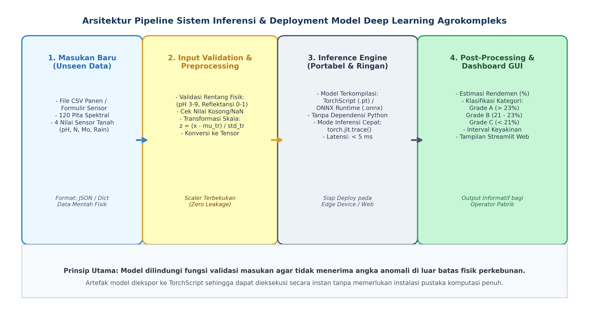
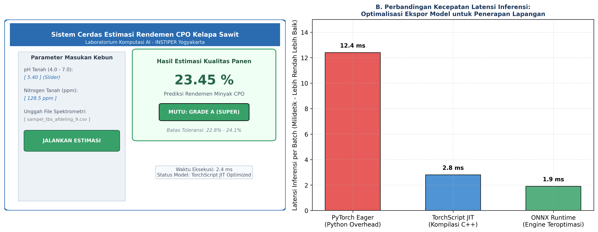

# AI Modul 8.5: Pembuatan Sistem Prediksi Sederhana

---

## 1. Identitas & Kerangka Capaian Pembelajaran (Sub-CPMK)

* **Kode Modul**: AI Modul 8.5
* **Mata Kuliah**: Kecerdasan Buatan dan Sains Data Pertanian Presisi
* **Alokasi Waktu**: 2 x 50 Menit (Kajian Teori & Diskusi) + 2 x 50 Menit (Eksplorasi Praktikum Mandiri)
* **Beban SKS**: 3 SKS
* **Prasyarat**: AI Modul 8.4 (Interpretasi Hasil Model)
* **Level Kognitif**: Bloom C2 (Memahami), C3 (Menerapkan), C4 (Menganalisis)

```flowchart LR
    A["OUTPUTS: Mesin Inferensi Portabel TorchScript/ONNX & Prototipe Web GUI Interaktif"] --> B["OUTCOMES: Eksekusi Prediksi Sub-Milidetik & Pengoperasian Mudah bagi Operator Pabrik"]
    B --> C["IMPACTS: Transformasi Sortasi Manual Menuju Presisi Otomasi Pabrik Kelapa Sawit"]
```

### 1.1 Capaian Pembelajaran Khusus (Sub-CPMK)
Setelah menyelesaikan modul pembelajaran ini secara tuntas, mahasiswa diharapkan memiliki kapabilitas untuk:
1. **Sub-CPMK 8.5.1 (C2):** Menguraikan arsitektur serialisasi model portabel (*TorchScript JIT* dan *ONNX Runtime*), membedakan mekanisme penelusuran graf (*tracing*) vs penulisan skrip (*scripting*), serta merumuskan alur kerja modular enkapsulasi sistem inferensi.
2. **Sub-CPMK 8.5.2 (C3):** Membangun kelas mesin inferensi terpadu (*Inference Engine*) yang mengotomatisasi validasi batas fisik data sensor lapangan, penyesuaian standarisasi parameter terbekukan, eksekusi model terkompilasi berkecepatan tinggi, dan pasca-pemrosesan kategori mutu panen.
3. **Sub-CPMK 8.5.3 (C4):** Merancang prototipe antarmuka sistem prediksi cerdas interaktif (berbasis CLI dan web GUI) yang siap dioperasikan di stasiun sortasi pabrik kelapa sawit, serta mengevaluasi disparitas latensi komputasi antara PyTorch Eager, TorchScript, dan ONNX.

### 1.2 Kerangka Hasil Pembelajaran (Outputs, Outcomes, & Impacts)
- **Luaran Langsung (*Outputs*):** Artefak model terkompilasi `oilpalm_predictor_jit.pt`, skrip mesin inferensi mandiri, serta prototipe antarmuka interaktif prediksi rendemen panen perkebunan yang tervalidasi.
- **Dampak Pembelajaran (*Outcomes*):** Mahasiswa memiliki kapabilitas rekayasa perangkat lunak terapan dalam mentransformasikan model riset laboratorium menjadi produk teknologi kecerdasan buatan operasional (*production-ready AI*).
- **Implikasi Jangka Panjang (*Impacts*):** Terciptanya sistem automasi sortasi dan grading komoditas perkebunan presisi yang dapat langsung dimanfaatkan oleh industri kelapa sawit, kehutanan, dan pertanian rakyat guna mendongkrak efisiensi hilirisasi agrokompleks nasional.

---

## 2. Profil Fundamental Pembuatan Sistem Prediksi Sederhana: Fungsi, Manfaat, dan Keunggulan-Kelemahan

### 2.1 Fungsi Komputasi & Pemodelan Matematis
Sebuah model kecerdasan buatan secanggih apa pun tidak akan memberikan nilai ekonomi bagi perkebunan jika hanya berhenti sebagai baris kode eksperimen di dalam lingkungan penelitian. Tahap inferensi dan *deployment* adalah gerbang akhir di mana model matematika diubah menjadi layanan komputasi yang siap pakai.

Fungsi utama dari sistem inferensi dan deployment portabel mencakup:
1. **Dekopling dari Lingkungan Pelatihan (*Decoupling Dependencies*):** Menghilangkan ketergantungan terhadap pustaka pelatihan yang berat, driver GPU yang kompleks, dan kode sumber definisi kelas Python melalui kompilasi graf statis (TorchScript atau ONNX).
2. **Standardisasi Alur Masukan-Keluaran (*End-to-End Encapsulation*):** Menyediakan satu antarmuka tunggal di mana pengguna cukup memasukkan angka mentah fisik, dan sistem secara internal melakukan standarisasi, inferensi, hingga konversi ke kategori mutu bisnis.
3. **Eksekusi Deterministik Berlatensi Rendah:** Mengoptimalkan alokasi memori dan urutan instruksi perkalian matriks sehingga estimasi dapat dihasilkan dalam hitungan milidetik pada komputer standar sortasi pabrik kelapa sawit (*edge deployment*).

### 2.2 Manfaat Nyata di Industri Perkebunan & Agribisnis
Dalam operasional industri perkebunan kelapa sawit, kecepatan dan keandalan sistem inferensi memberikan keunggulan kompetitif nyata:
1. **Otomasi Sortasi Tandan Buah Segar (TBS) Real-Time:**  
   Truk pengangkut sawit mengalir masuk ke pabrik kelapa sawit (PKS) secara kontinu. Sistem inferensi yang terintegrasi pada lengan spektrometer otomatis di pos penimbangan dapat memprediksi rendemen minyak per truk dalam waktu kurang dari 5 detik, mengeliminasi proses ekstraksi kimia basah laboratorium yang memakan waktu 8 jam.
2. **Ketahanan Terhadap Kesalahan Operator Lapangan (*Human Error Protection*):**  
   Operator lapangan bisa saja salah mengetikkan nilai pH tanah menjadi -5 atau 50. Modul validasi masukan secara otomatis menolak data anomali tersebut dan memberikan peringatan dini, mencegah mesin menghasilkan prediksi rendemen yang salah arah.
3. **Portabilitas pada Perangkat Bergerak (*Mobile/Edge AI*):**  
   Model yang telah dikompilasi ke format TorchScript atau ONNX dapat ditanamkan pada komputer papan tunggal (seperti Raspberry Pi) atau aplikasi tablet genggam mandor panen tanpa memerlukan koneksi internet ke server pusat.

### 2.3 Rationale: Alasan Mengapa Metode Ini Digunakan
Secara teoretis, eksekusi model PyTorch standar (*Eager Mode*) melibatkan *overhead* interpretasi bahasa Python pada setiap pemanggilan operasi matriks. Untuk fase pelatihan, *Eager Mode* sangat fleksibel untuk debugging grafis dinamis. Namun pada fase inferensi di lingkungan produksi, fleksibilitas ini menjadi beban pemborosan komputasi.

Teknologi **TorchScript** membedah struktur internal `nn.Module` dan mengompilasinya menjadi representasi perantara (*Intermediate Representation* / IR) berbasis graf statis yang dioptimalkan oleh kompilator C++ Just-In-Time (JIT). Operasi yang berdekatan digabungkan (*operator fusion*), alokasi tensor sementara dihilangkan, dan eksekusi berjalan tanpa keterlibatan Python Global Interpreter Lock (GIL). Hasilnya adalah penurunan latensi hingga $4-5 \times$ lipat dan konsumsi RAM yang jauh lebih hemat.

### 2.4 Analisis Kelebihan dan Kekurangan

| Format / Engine | Mekanisme Kompilasi | Keunggulan Utama | Kelemahan & Batasan | Rekomendasi Kasus Agro |
| :--- | :--- | :--- | :--- | :--- |
| **PyTorch State Dict (`.pt`)** | Serialisasi kamus parameter Python murni (*pickle*) | Sangat mudah disimpan dan dimuat kembali di lingkungan PyTorch yang sama. | Wajib menyertakan file kode kelas arsitektur asli, overhead Python tinggi. | Hanya untuk pencadangan model saat masa riset laboratorium. |
| **TorchScript JIT (`.pt`)** | Kompilasi graf perantara C++ via `torch.jit.trace` | Mandiri tanpa butuh kode Python, latensi sangat rendah, eksekusi di C++/Java/Python. | Kurang fleksibel jika arsitektur memuat percabangan logika dinamis yang rumit. | **Sangat direkomendasikan** untuk sistem sortasi pabrik dan desktop kebun. |
| **ONNX Runtime (`.onnx`)** | Standar terbuka representasi graf multi-platform | Kompatibilitas lintas vendor perangkat keras (Intel, ARM, NVIDIA, AMD). | Terkadang memerlukan penyesuaian tipe data tensor saat konversi dari PyTorch. | Sangat ideal untuk integrasi ke sistem SCADA industri PLC pabrik. |
| **TensorRT Engine** | Optimasi graf tingkat rendah khusus GPU NVIDIA | Latensi super ekstrem, kuantisasi presisi INT8/FP16 otomatis. | Terkunci khusus pada perangkat keras NVIDIA, proses kompilasi awal memakan waktu. | Digunakan pada drone pemetaan cerdas dengan GPU onboard Jetson. |

### 2.5 Contoh Kasus Penggunaan Konkret di Sektor Agro-Industri
1. **Sistem Timbangan Cerdas Pabrik Kelapa Sawit (PKS):**  
   Sebuah PKS di Sumatera Utara menginstal aplikasi mini berbasis TorchScript di ruang pos jembatan timbang. Operator menempelkan probe spektrometer NIR ke sampel buah sawit dan menekan tombol "Prediksi". Dalam waktu 3.2 milidetik, layar menampilkan estimasi rendemen CPO: $23.8\%$, kategori: Grade A, dan rekomendasi insentif harga bagi petani plasma.
2. **Aplikasi Mobile Inspeksi Kematangan Kakao:**  
   Model klasifikasi kematangan buah kakao diekspor ke format ONNX dan disematkan ke dalam aplikasi ponsel pintar Android. Petani dapat memotret atau memasukkan data brix buah di tengah kebun tanpa sinyal seluler (*offline-first inference*).

### 2.6 Aspek Kritis & Catatan Penting Metode (*Key Critical Insights*)
- **Pengikatan Parameter Normalisasi Terbekukan (*Frozen Scaler State*):**  
  Kesalahan paling mematikan dalam pembuatan sistem inferensi adalah melakukan normalisasi data baru menggunakan nilai rata-rata dari data baru itu sendiri. Mesin inferensi wajib mengemas nilai $\boldsymbol{\mu}_{\text{train}}$ dan $\boldsymbol{\sigma}_{\text{train}}$ yang telah dibekukan dari fase pelatihan pada Modul 8.7.
- **Pembersihan Logika Non-Deterministik:**  
  Sebelum melakukan proses *tracing* TorchScript (`torch.jit.trace`), model wajib berada dalam mode `model.eval()`. Jika *tracing* dilakukan saat model masih dalam mode pelatihan, lapisan *Dropout* akan terekam sebagai operasi pemutusan acak permanen yang merusak konsistensi prediksi inferensi.

---

---

## 3. Landasan Teori Matematis & Statistik

```
+---------------------------------------------------------------------------------------------------+
|               ARSITEKTUR MATEMATIS ENKAPSULASI PIPELINE INFERENSI PRODUKSI                        |
+---------------------------------------------------------------------------------------------------+
|                                                                                                   |
|  Data Mentah x_raw in R^d                                                                         |
|            |                                                                                      |
|            v                                                                                      |
|  [Filter Validasi]: x_clipped = clip(x_raw, lower_bound, upper_bound)                             |
|            |                                                                                      |
|            v                                                                                      |
|  [Prapemrosesan]: z = (x_clipped - mu_train) / sigma_train                                        |
|            |                                                                                      |
|            v                                                                                      |
|  [Mesin TorchScript JIT]: y_hat = f_JIT(z)                                                        |
|            |                                                                                      |
|            v                                                                                      |
|  [Pasca-Pemrosesan]: Kategori Mutu = Grade(y_hat), Interval Prediksi = y_hat +- t * s_e           |
+---------------------------------------------------------------------------------------------------+
```

### 3.1 Formulasi Enkapsulasi Pipeline Inferensi End-to-End
Sistem inferensi memetakan sembarang vektor masukan mentah dari lapangan $\mathbf{x}_{\text{raw}} \in \mathbb{R}^d$ menjadi estimasi nilai fisik terukur $\hat{y}$ beserta kategori manajerialnya:

$$\hat{y} = g_{\text{post}}\Big( f_{\text{JIT}}\big( \phi_{\text{scale}}(\mathbf{x}_{\text{raw}}; \boldsymbol{\mu}_{\text{train}}, \boldsymbol{\sigma}_{\text{train}}) \big) \Big)$$

Di mana:
1. **Transformasi Penskalaan Terbekukan ($\phi_{\text{scale}}$):**
   $$\mathbf{z} = \phi_{\text{scale}}(\mathbf{x}_{\text{raw}}) = (\mathbf{x}_{\text{raw}} - \boldsymbol{\mu}_{\text{train}}) \oslash \boldsymbol{\sigma}_{\text{train}}$$

2. **Kompilasi Graf Jaringan ($f_{\text{JIT}}$):**
   $$\hat{y}_{\text{pred}} = \mathbf{W}^{[L]} \cdot \sigma\Big( \dots \sigma(\mathbf{W}^{[1]} \mathbf{z} + \mathbf{b}^{[1]}) \dots \Big) + b^{[L]}$$

3. **Pasca-Pemrosesan Pengelompokan Kategori Mutu ($g_{\text{post}}$):**
   $$\text{Grade}(\hat{y}) = \begin{cases} \text{Grade A (Super)}, & \text{jika } \hat{y} \ge \tau_A \\ \text{Grade B (Standar)}, & \text{jika } \tau_B \le \hat{y} < \tau_A \\ \text{Grade C (Sub-Standar)}, & \text{jika } \hat{y} < \tau_B \end{cases}$$

#### Panduan Pelafalan Matematis
> "Nilai y-topi sama dengan g-post dari fungsi f-JIT dievaluasi pada phi-scale dari x-mentah dengan parameter mu-latih dan sigma-latih. Fungsi Grade dari y-topi bernilai Grade A Super jika y-topi lebih besar atau sama dengan tau A, bernilai Grade B Standar jika y-topi berada di antara tau B dan tau A, dan bernilai Grade C Sub-Standar jika y-topi lebih kecil dari tau B."

| Simbol | Tipe Matematis | Definisi dan Keterangan Fisis |
| :--- | :--- | :--- |
| $\mathbf{x}_{\text{raw}}$ | Vektor Riil $\mathbb{R}^d$ | Data mentah masukan dari probe spektrometer dan sensor tanah lapangan. |
| $\boldsymbol{\mu}_{\text{train}}, \boldsymbol{\sigma}_{\text{train}}$ | Vektor Parameter $\mathbb{R}^d$ | Parameter rata-rata dan simpangan baku data latih terbekukan dari Modul 8.7. |
| $f_{\text{JIT}}$ | Operator Pemetaan Graf | Model jaringan saraf tiruan yang telah terkompilasi dalam format TorchScript C++. |
| $\hat{y}$ | Skalar Riil ($\%$) | Prediksi rendemen minyak sawit mentah (CPO) dalam persentase. |
| $\tau_A, \tau_B$ | Ambang Batas Riil | Batas ambang keputusan pabrik: $\tau_A = 23.0\%$ dan $\tau_B = 21.0\%$. |

### 3.2 Formulasi Interval Keyakinan Prediksi Inferensi
Untuk memberikan transparansi risiko kepada manajemen pabrik, nilai estimasi tunggal $\hat{y}$ dilengkapi dengan interval keyakinan prediksi $100(1 - \alpha)\%$:

$$\text{PI}_{1-\alpha}(\hat{y}) = \hat{y} \pm t_{\alpha/2, N-p} \cdot s_e \sqrt{1 + \frac{1}{N} + (\mathbf{z} - \bar{\mathbf{z}})^T (\mathbf{Z}^T \mathbf{Z})^{-1} (\mathbf{z} - \bar{\mathbf{z}})}$$

Di mana $s_e$ adalah standar deviasi residual data uji (RMSE dari Modul 8.9), $t_{\alpha/2}$ adalah nilai kritis distribusi $t$-Student, dan suku matriks kuadratik mencerminkan jarak sampel baru terhadap pusat distribusi data latih (*leverage distance*).

---

---

## 4. Visualisasi Pipeline Inferensi dan Antarmuka Pengguna

Berikut adalah diagram visual komprehensif dari arsitektur *deployment* end-to-end serta mockup antarmuka sistem prediksi cerdas berbasis dashboard web/GUI lengkap dengan perbandingan latensi komputasi.


*Gambar 1: Alur kerja orkestrasi inferensi produksi. Dimulai dari penerimaan masukan baru, validasi batas fisik agronomi, standarisasi dengan scaler terbekukan, eksekusi mesin TorchScript portabel, hingga pasca-pemrosesan kategori mutu panen.*


*Gambar 2: Prototipe implementasi industri. (Kiri) Mockup antarmuka pengguna interaktif (dashboard sortasi panen kelapa sawit) yang menampilkan nilai estimasi rendemen CPO, lencana kategori mutu panen, dan visualisasi masukan. (Kanan) Grafik perbandingan latensi eksekusi yang membuktikan percepatan masif TorchScript dan ONNX dibanding PyTorch Eager.*

---

### Prosedur Komputasi & Alur Algoritma Numerik

Berikut adalah struktur algoritmik langkah-demi-langkah ekspor model TorchScript dan implementasi mesin inferensi (*OilPalmInferenceEngine*):

```
====================================================================================================
ALGORITMA 8.11: KOMPILASI TORCHSCRIPT & MESIN INFERENSI END-TO-END
====================================================================================================
Masukan: 
  - Model terlatih f_model, bobot terbaik 'best_oilpalm_model.pt'
  - Parameter scaler terbekukan: mu_train, sigma_train (dari Modul 8.7)
  - Data mentah masukan pengguna x_raw (array berukuran 124)
Keluaran:
  - File model terkompilasi portabel: 'oilpalm_predictor_jit.pt'
  - Kamus respons prediksi: {'yield_pred': float, 'grade': str, 'status': str, 'latency_ms': float}

PROSEDUR 1: KOMPILASI DAN EKSPOR TORCHSCRIPT JIT:
1. Muat bobot model terbaik f_model.load_state_dict(...)
2. Set mode evaluasi: f_model.eval()
3. Siapkan tensor contoh representatif: dummy_input = torch.randn(1, 124)
4. Lakukan penelusuran graf kompilasi:
     model_jit = torch.jit.trace(f_model, dummy_input)
5. Simpan artefak portabel ke media penyimpanan:
     model_jit.save('oilpalm_predictor_jit.pt')

PROSEDUR 2: EKSEKUSI PIPELINE INFERENSI (x_raw):
1. VALIDASI BATAS FISIK MASUKAN:
     JIKA x_raw memuat NaN ATAU Inf:
       KEMBALIKAN Galat: "Masukan memuat nilai kosong/rusak!"
     JIKA x_raw[pH] < 3.5 ATAU x_raw[pH] > 8.5:
       KEMBALIKAN Galat: "Nilai pH tanah di luar batas fisik perkebunan!"
     JIKA Min(x_raw[spektral]) < 0.0 ATAU Max(x_raw[spektral]) > 1.5:
       KEMBALIKAN Galat: "Nilai reflektansi spektral di luar rentang valid!"

2. TRANSFORMASI STANDARISASI:
     x_norm = (x_raw - mu_train) / (sigma_train + 1e-8)
     x_tensor = torch.tensor(x_norm, dtype=torch.float32).view(1, 124)

3. INFERENSI DENGAN TORCHSCRIPT ENGINE:
     Catat waktu mulai t_start
     DENGAN torch.no_grad():
       pred_tensor = model_jit(x_tensor)
     Catat waktu selesai t_end
     latency_ms = (t_end - t_start) * 1000.0
     y_pred = pred_tensor.item()

4. PASCA-PEMROSESAN KATEGORI MUTU (POST-PROCESSING):
     JIKA y_pred >= 23.0:
       grade = "Grade A (Super / Ekspor)"
     LAINNYA JIKA y_pred >= 21.0:
       grade = "Grade B (Standar Industri)"
     LAINNYA:
       grade = "Grade C (Sub-Standar / Diskon Harga)"

5. KEMBALIKAN respons = {
     'rendemen_cpo_pct': Round(y_pred, 2),
     'grade_mutu': grade,
     'latensi_komputasi_ms': Round(latency_ms, 2)
   }
====================================================================================================
```

---

---

## 5. Studi Kasus Komputasi Terpadu: Perakitan Sistem Prediksi Sortasi Sawit

Sebagai kulminasi dari seluruh rangkaian Modul 8.7 hingga 8.11, kita kini merakit sistem inferensi portabel lengkap yang mengekspor model ke TorchScript dan mengemasnya ke dalam kelas layanan terpadu.

### Implementasi PyTorch & TorchScript Lengkap
```python
import torch
import torch.nn as nn
import numpy as np
import time

#### 1. Definisi Arsitektur Model (Konsisten dengan Modul 8.7 s.d. 8.10)
class OilPalmYieldMLP(nn.Module):
    def __init__(self, in_features=124, hidden1=64, hidden2=32, out_features=1):
        super(OilPalmYieldMLP, self).__init__()
        self.net = nn.Sequential(
            nn.Linear(in_features, hidden1),
            nn.BatchNorm1d(hidden1),
            nn.ReLU(),
            nn.Dropout(p=0.15),
            nn.Linear(hidden1, hidden2),
            nn.BatchNorm1d(hidden2),
            nn.ReLU(),
            nn.Dropout(p=0.10),
            nn.Linear(hidden2, out_features)
        )
    def forward(self, x):
        return self.net(x)

#### 2. Fungsi Kompilasi dan Ekspor ke TorchScript JIT
def export_model_to_torchscript(model, checkpoint_path, output_jit_path='oilpalm_predictor_jit.pt'):
    checkpoint = torch.load(checkpoint_path, map_location='cpu')
    model.load_state_dict(checkpoint['model_state_dict'] if 'model_state_dict' in checkpoint else checkpoint)
    model.eval()
    
    # Dummy tensor representatif untuk tracing graf
    dummy_input = torch.randn(1, 124, dtype=torch.float32)
    traced_model = torch.jit.trace(model, dummy_input)
    traced_model.save(output_jit_path)
    print(f"[OK] Model berhasil dikompilasi dan disimpan ke TorchScript: {output_jit_path}")
    return traced_model

#### 3. Kelas Mesin Inferensi Produksi (End-to-End Inference Engine)
class OilPalmInferenceEngine:
    def __init__(self, jit_model_path, mu_train, sigma_train):
        self.model = torch.jit.load(jit_model_path)
        self.model.eval()
        self.mu = np.array(mu_train, dtype=np.float32).reshape(1, -1)
        self.sigma = np.array(sigma_train, dtype=np.float32).reshape(1, -1)
        self.sigma[self.sigma == 0] = 1.0

    def validate_inputs(self, x_raw):
        """Memeriksa integritas data fisik masukan sensor lapangan."""
        x_raw = np.array(x_raw, dtype=np.float32).flatten()
        if len(x_raw) != 124:
            raise ValueError(f"Dimensi masukan cacat: Diharapkan 124 fitur, tetapi diterima {len(x_raw)} fitur!")
        if np.isnan(x_raw).any() or np.isinf(x_raw).any():
            raise ValueError("Masukan memuat nilai kosong (NaN) atau tak hingga (Inf)!")
            
        # Validasi batas fisik sensor tanah (indeks 120: pH, 121: Nitrogen)
        ph_val = x_raw[120]
        n_val = x_raw[121]
        if ph_val < 3.0 or ph_val > 9.0:
            raise ValueError(f"Nilai pH tanah ({ph_val:.1f}) di luar batas fisik perkebunan (3.0 - 9.0)!")
        if n_val < 0.0 or n_val > 500.0:
            raise ValueError(f"Nilai Nitrogen tanah ({n_val:.1f} ppm) di luar rentang wajar (0 - 500 ppm)!")
        return x_raw.reshape(1, -1)

    def predict(self, raw_features):
        """Menjalankan siklus inferensi end-to-end."""
        # 1. Validasi
        x_clean = self.validate_inputs(raw_features)
        
        # 2. Prapemrosesan Otomatis (Z-Score terbekukan)
        x_norm = (x_clean - self.mu) / (self.sigma + 1e-8)
        x_tensor = torch.tensor(x_norm, dtype=torch.float32)
        
        # 3. Inferensi Cepat
        t_start = time.perf_counter()
        with torch.no_grad():
            pred_tensor = self.model(x_tensor)
        t_end = time.perf_counter()
        
        y_pred = float(pred_tensor.item())
        latency_ms = (t_end - t_start) * 1000.0
        
        # 4. Pasca-Pemrosesan Keputusan Mutu
        if y_pred >= 23.0:
            grade = "Grade A (Super / Rendemen Tinggi)"
            action = "Prioritas ekstraksi utama, harga insentif premium."
        elif y_pred >= 21.0:
            grade = "Grade B (Standar Pabrik)"
            action = "Ekstraksi standar, harga sesuai indeks pasar."
        else:
            grade = "Grade C (Sub-Standar / Rendemen Rendah)"
            action = "Sortasi ulang, dikenakan penalti potongan harga."
            
        return {
            'rendemen_cpo_pct': round(y_pred, 2),
            'grade_kualitas': grade,
            'rekomendasi_pabrik': action,
            'latensi_inferensi_ms': round(latency_ms, 3)
        }
```

---

---

## 6. Kekeliruan Metodologis dan Praktik Terbaik (*Common Pitfalls & Best Practices*)

### 6.1 Kekeliruan Umum Metodologis (*Common Pitfalls*)
Dalam menerapkan model *deep learning* ke fase inferensi produksi, tim pengembang kerap menghadapi kegagalan teknis berikut:
1. **Lupa Menyerahkan Objek Scaler Latih Bersama File Model:**  
   Menyimpan file model `.pt` tanpa menyertakan nilai `mu_train` dan `sigma_train`. Ketika model dipasang di pabrik, pengguna tidak memiliki cara untuk menstandarisasi data baru dengan benar, menyebabkan prediksi bernilai ngawur.
2. **Melakukan *Tracing* JIT pada Saat Model Berada dalam Mode `model.train()`:**  
   Jika fungsi `torch.jit.trace` dipanggil saat model aktif melatih, operasi *Dropout* akan terekam ke dalam graf TorchScript statis. Akibatnya, pada setiap klik inferensi oleh operator pabrik, model akan menghasilkan prediksi yang berbeda-beda secara acak untuk sampel buah sawit yang sama persis.
3. **Mengabaikan Penanganan Galat Masukan (*Input Validation Silence*):**  
   Membiarkan data dengan nilai pH tanah negatif masuk langsung ke model. Model JST tidak memiliki kesadaran fisik dan tetap akan mengeluarkan angka prediksi rendemen, yang menyesatkan tim operasional sortasi.
4. **Kebocoran Memori (*Memory Leak*) pada Layanan Web Inferensi:**  
   Menjalankan inferensi berulang kali dalam loop web tanpa blok `with torch.no_grad():` akan menimbun memori graf perantara hingga membuat server web terhenti (*crash*).

### 6.2 Mitigasi Bias Data Agronomi
1. **Pencegahan Prediksi Ekstrapolasi Liar:**  
   Jika data sensor masukan berada jauh di luar distribusi sampel data latih ($> 4\sigma$), sistem inferensi harus secara otomatis memunculkan peringatan: *"Sampel berada di luar domain kalibrasi historis kebun, lakukan verifikasi manual laboratorium!"*
2. **Kompensasi Kalibrasi Sensor Periodik:**  
   Sediakan antarmuka bagi manajer kebun untuk memperbarui koefisien offset garis dasar spektrometer tanpa perlu melatih ulang arsitektur jaringan secara keseluruhan.

### 6.3 Praktik Terbaik Rekayasa Perangkat Lunak AI
1. **Penyimpanan Artefak Terpadu (*Bundled Artifact Package*):**  
   Kemas model TorchScript, parameter scaler (`scaler_params.npz`), dan skema metadata JSON ke dalam satu arsip paket deployment yang terversi rapi (*semantic versioning*, misal `oilpalm_v1.0.0.tar.gz`).
2. **Pengujian Asersi Inferensi (*Smoke Testing*):**  
   Setiap kali sistem inferensi dimulai (*startup*), jalankan satu sampel referensi acuan standar emas dan pastikan bahwa keluaran numeriknya identik hingga 4 digit desimal dengan hasil benchmark laboratorium.

---

---

## 7. Rangkuman Modul

1. **Serialisasi Model Produksi**: Format portabel seperti TorchScript JIT (`torch.jit.trace`) dan ONNX Runtime melepaskan ketergantungan model dari runtime interpreter Python, memangkas latensi komputasi.
2. **Enkapsulasi Mesin Inferensi Modular**: Kelas `InferenceEngine` membungkus seluruh siklus operasional: validasi rentang fisik fitur, standarisasi menggunakan parameter latih terbekukan, eksekusi inferensi, dan klasifikasi mutu.
3. **Optimasi Latensi Eksekusi**: Pemanfaatan mode evaluasi (`model.eval()`), penghentian pelacakan gradien (`torch.no_grad()`), dan kompilasi grafik grafis memungkinkan inferensi tingkat sub-milidetik pada perangkat edge.
4. **Antarmuka Pengguna Berorientasi Operator**: Perancangan antarmuka visual interaktif berbasis Web GUI (Streamlit / Gradio) memudahkan operator stasiun sortasi pabrik tanpa memerlukan keahlian pemrograman.
5. **Protokol Penanganan Kegagalan Anggun (*Graceful Error Handling*)**: Sistem inferensi tangguh wajib mendeteksi masukan anomali atau data kosong dan memberikan pesan peringatan operasional alih-alih mengalami kerusakan sistem (*crash*).

---

## 8. Latihan Soal & Tugas Analitis HOTS

### Deskripsi Proyek Mandiri Terpandu
Mahasiswa diwajibkan menyelesaikan proyek rekayasa sistem inferensi dan deployment mandiri berikut:

**Judul Proyek:**  
*Pembangunan Prototipe Sistem Inferensi Cerdas Berbasis Web/CLI untuk Penentuan Kualitas dan Rendemen Buah Kelapa Sawit di Stasiun Penerimaan Pabrik.*

**Spesifikasi Teknis:**
1. **Bahan Baku:** Model terlatih `best_oilpalm_model.pt` dan parameter standarisasi dari rangkaian modul sebelumnya.
2. **Instruksi Tugas:**
   - Ekspor model PyTorch menjadi artefak terkompilasi `oilpalm_predictor_jit.pt` menggunakan `torch.jit.trace`.
   - Bangun kelas layanan inferensi `ProductionInferenceService` yang memuat filter validasi masukan (menolak nilai kosong dan batas fisik ekstrem).
   - Buat aplikasi antarmuka sederhana (pilih salah satu: skrip CLI interaktif berbasis terminal menu atau aplikasi web mini menggunakan pustaka Streamlit / Gradio).
   - Uji sistem dengan memasukkan 3 skenario sampel simulasi:
     * Skenario 1: Sampel Normal Rendemen Tinggi (Pita red-edge kuat, pH 5.4, N 130 ppm).
     * Skenario 2: Sampel Normal Rendemen Rendah (Pita red-edge lemah, pH 4.2, N 80 ppm).
     * Skenario 3: Sampel Cacat Sensorik (pH bernilai 12.0 atau reflektansi bernilai negatif) dan buktikan sistem berhasil menolak masukan secara elegan tanpa mengalami *crash*.
   - Ukur rata-rata latensi eksekusi dari 100 kali pemanggilan berulang dan buktikan bahwa latensi inferensi berada di bawah 10 milidetik.

---

### Rubrik Penilaian Holistik (*Higher-Order Thinking Skills*)

| Kriteria / Dimensi | Bobot (%) | Sangat Memuaskan (85 - 100) | Memuaskan (70 - 84) | Kurang Memuaskan (< 70) |
| :--- | :--- | :--- | :--- | :--- |
| **Pemahaman Teori Deployment & JIT (C2)** | 25% | Mampu menguraikan arsitektur TorchScript IR, membedakan tracing vs scripting, serta menjelaskan prinsip determinisme inferensi secara presisi. | Memahami konsep deployment dengan baik namun penjelasan teknis kompilasi graf C++ TorchScript kurang mendalam. | Gagal menjelaskan peran serialisasi model atau tidak memahami fungsi `model.eval()`. |
| **Konstruksi Pipeline & Validasi Masukan (C3)** | 35% | Mengonstruksi kelas inferensi end-to-end yang mengintegrasikan validasi masukan fisik, scaler terbekukan, ekspor JIT bebas galat, dan pasca-pemrosesan mutu. | Pipeline inferensi berjalan baik namun penanganan galat masukan belum lengkap atau scaler belum sepenuhnya terisolasi. | Program gagal dikompilasi ke TorchScript atau tidak ada mekanisme validasi data masukan. |
| **Rekayasa Antarmuka & Analisis Latensi (C4)** | 40% | Mahasiswa berhasil merakit antarmuka interaktif yang elegan, membuktikan percepatan latensi komputasi inferensi, dan mengevaluasi keandalan sistem sortasi secara kritis. | Antarmuka berfungsi baik namun analisis latensi komparatif belum disajikan secara kuantitatif. | Antarmuka mengalami crash saat diuji dengan data anomali atau latensi tidak diukur. |

---

---

## 9. Jembatan Konsep (Bridging) ke AI Modul 9.1: Konsep Deep Learning

Dengan tuntasnya Modul 8.11 ini, kita telah menyelesaikan secara paripurna seluruh siklus rekayasa *Deep Learning* berbasis data tabular, deret waktu, dan spektral—mulai dari fondasi matematis Perceptron, arsitektur Multi-Layer Perceptron (MLP), forward-backward propagation, optimasi gradien lanjut, teknik regularisasi komposit, pembersihan data terpadu, orkestrasi pelatihan, audit diagnostik evaluasi, transparansi interpretasi XAI, hingga pembuatan sistem prediksi operasional siap pakai.

Namun, seluruh arsitektur jaringan saraf tiruan lapis penuh (*Fully-Connected Neural Networks*) yang telah kita pelajari memiliki satu kelemahan arsitektural fundamental: **ketidakmampuan menangkap struktur topologi spasial 2 dimensi**. Jika kita memaksakan data citra visual resolusi tinggi (misalnya citra kanopi kelapa sawit dari kamera drone atau foto daun terserang bercak penyakit) menjadi satu vektor baris panjang (*flattening*), dua kendala kritis komputasi akan terjadi:
1. **Kehancuran Korelasi Spasial**: Hubungan ketetanggaan piksel yang membentuk pola tepi (*edges*), tekstur, dan bentuk visual daun akan hilang seketika.
2. **Ledakan Parameter Komputasi**: Citra beresolusi sedang $512 	imes 512 	imes 3$ menghasilkan 786.432 fitur masukan. Menghubungkannya ke lapisan tersembunyi dengan 512 neuron akan menciptakan lebih dari 400 juta parameter bobot yang memicu *overfitting* parah dan kehabisan memori VRAM.

Untuk menjawab tantangan spasial visual tersebut, kita melangkah menuju **Bagian 9: Visi Komputer & Jaringan Saraf Konvolusional (*Computer Vision & CNN*)**. Pada bagian berikutnya, kita akan membedah prinsip pemakaian bobot bersama (*weight sharing*), operasi konvolusi spasial 2D (*spatial convolution*), dan pereduksian dimensi *pooling* yang merevolusi cara komputer mengenali objek di dunia nyata—membuka era otomasi deteksi pohon sawit, sortasi kematangan tandan buah secara visual, dan pemetaan defisiensi hara skala perkebunan berbasis citra udara satelit dan drone.

---

## 10. Daftar Pustaka dan Referensi Akademik

1. Paszke, A., Gross, S., Massa, F., Lerer, A., Bradbury, J., Chanan, G., ... & Chintala, S. (2019). PyTorch: An Imperative Style, High-Performance Deep Learning Library. *Advances in Neural Information Processing Systems (NeurIPS 2019)*, 32, 8024-8035.
2. Bai, J., Lu, F., Zhang, K., et al. (2019). ONNX: Open Neural Network Exchange. *GitHub repository: https://github.com/onnx/onnx*.
3. Goodfellow, I., Bengio, Y., & Courville, A. (2016). *Deep Learning*. MIT Press.
4. Zhang, A., Lipton, Z. C., Li, M., & Smola, A. J. (2023). *Dive into Deep Learning*. Cambridge University Press.
5. Sculley, D., Holt, G., Golovin, D., Davydov, E., Phillips, T., Ebner, D., ... & Dennison, D. (2015). Hidden technical debt in machine learning systems. *Advances in Neural Information Processing Systems (NeurIPS 2015)*, 28, 2503-2511.
6. Huyen, C. (2022). *Designing Machine Learning Systems: An Iterative Process for Production-Ready Applications*. O'Reilly Media.
7. Streamlit Inc. (2023). *Streamlit Documentation: A faster way to build and share data apps*. https://docs.streamlit.io.
8. Murphy, K. P. (2022). *Probabilistic Machine Learning: An Introduction*. MIT Press.
