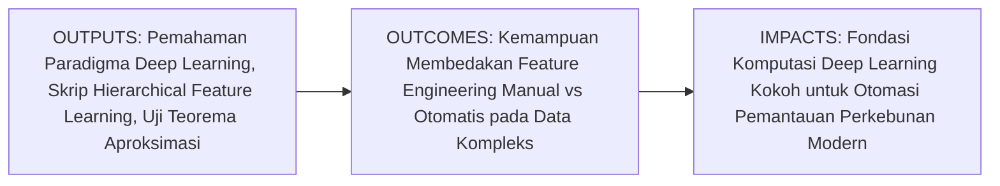
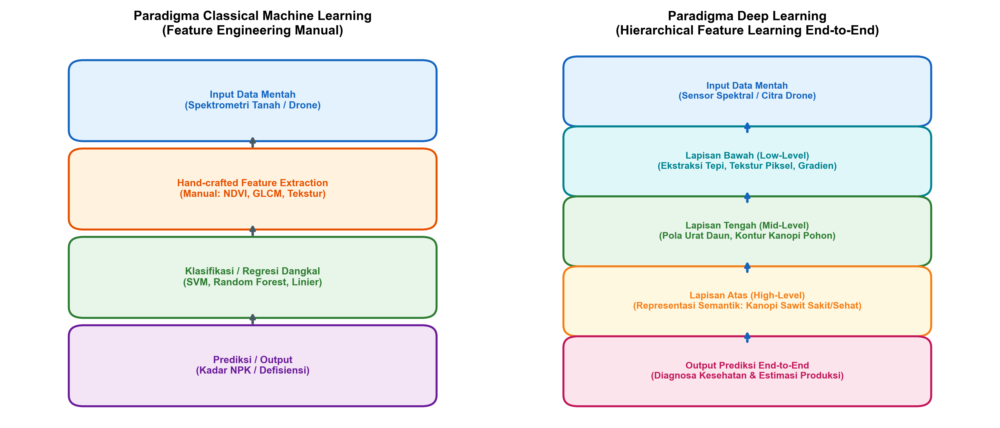
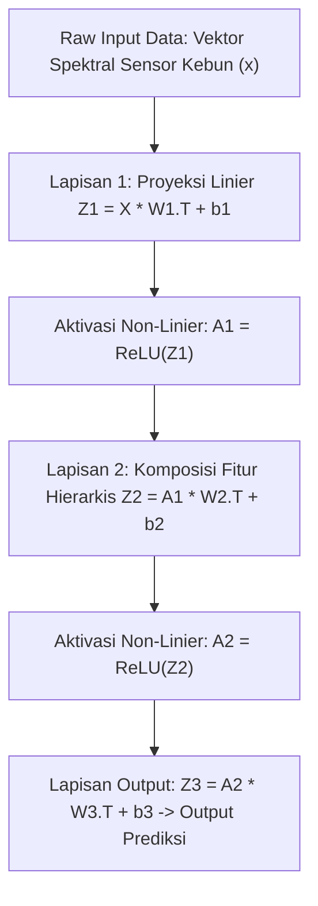

# AI Modul 9.1: Konsep Deep Learning

---

## 1. Identitas & Kerangka Capaian Pembelajaran (Sub-CPMK)

* **Kode Modul**: AI Modul 9.1
* **Mata Kuliah**: Kecerdasan Buatan dan Sains Data Pertanian Presisi
* **Alokasi Waktu**: 2 x 50 Menit (Kajian Teori & Diskusi) + 2 x 50 Menit (Eksplorasi Praktikum Mandiri)
* **Beban SKS**: 3 SKS
* **Prasyarat**: AI Modul 8.5 (Pembuatan Sistem Prediksi Sederhana)
* **Level Kognitif**: Bloom C2 (Memahami), C3 (Menerapkan), C4 (Menganalisis)



### 1.1 Capaian Pembelajaran Khusus (Sub-CPMK)
Setelah menyelesaikan modul ini secara komprehensif, mahasiswa diharapkan mampu:
1. **Memahami (C2)** evolusi paradigma komputasi dari rekayasa fitur manual (*handcrafted feature engineering*) pada machine learning klasik menuju pembelajaran representasi hierarkis (*hierarchical representation learning*) pada deep learning.
2. **Menerapkan (C3)** konsep dasar representasi bertingkat dari data sensor mentah (*raw sensor data*) melalui jaringan saraf bertingkat menggunakan pustaka NumPy untuk mengekstraksi pola non-linier bertingkat.
3. **Menganalisis (C4)** landasan teoritis Teorema Aproksimasi Universal (*Universal Approximation Theorem*) serta mengevaluasi trade-off antara kedalaman arsitektur (*depth*), lebar arsitektur (*width*), kebutuhan volume data latih, dan kapasitas akselerasi perangkat keras GPU.

### 1.2 Kerangka Hasil Pembelajaran (Outputs, Outcomes, & Impacts)
* **Outputs (Keluaran Langsung)**:
  * Penguasaan komprehensif mengenai perbedaan fundamental antara model dangkal (*shallow models*) dan model dalam (*deep models*).
  * Skrip Python modular berstandar PEP 8 untuk mensimulasikan ekstraksi fitur bertingkat dan aproksimasi fungsi non-linier kompleks pada parameter agro-industri.
  * Analisis visual perbandingan kapasitas representasi fitur antara model linier sederhana dan jaringan saraf bertingkat.
* **Outcomes (Kompetensi Aplikatif)**:
  * Keahlian merancang arsitektur pemodelan data yang tepat berdasarkan kompleksitas data masukan di lingkungan perkebunan (citra drone, data cuaca temporal, profil spektrometri tanah).
  * Kemampuan mengidentifikasi kapan deep learning diperlukan dan kapan machine learning konvensional lebih mangkus digunakan.
* **Impacts (Dampak Strategis Jangka Panjang)**:
  * Transformasi operasional sektor perkebunan kelapa sawit dan pertanian presisi melalui adopsi kecerdasan buatan end-to-end yang mampu mengolah data masif tanpa ketergantungan pada ekstraksi fitur manual yang melelahkan.

---

## 2. Profil Fundamental Deep Learning: Fungsi, Manfaat, dan Keunggulan-Kelemahan

### 2.1 Fungsi Komputasi & Pemodelan Matematis
Deep Learning adalah sub-bidang dari Machine Learning yang memanfaatkan arsitektur jaringan saraf tiruan berlapis banyak (*deep artificial neural networks*) untuk mempelajari representasi data secara hierarkis langsung dari data mentah. Secara matematis dan fungsional, deep learning bekerja melalui:
1. **Komposisi Fungsi Non-Linier Bertingkat**: Memodelkan relasi pemetaan kompleks $f: \mathcal{X} 
ightarrow \mathcal{Y}$ melalui komposisi berantai dari $L$ transformasi matematis:
   $$f(x) = f^{(L)}(f^{(L-1)}(\dots f^{(2)}(f^{(1)}(x))\dots))$$
   di mana setiap lapisan $l$ mentransformasikan representasi dari lapisan sebelumnya menjadi representasi yang lebih abstrak.
2. **Pembelajaran Fitur Otomatis (*End-to-End Feature Learning*)**: Mengeliminasi kebutuhan perancangan fitur manual yang memakan waktu dan berpotensi menimbulkan bias operator. Parameter representasi dipelajari secara terpadu melalui optimasi diferensiabel bersamaan dengan fungsi objektif akhir.
3. **Aproksimasi Fungsi Kontinu Kompleks**: Berdasarkan *Universal Approximation Theorem*, jaringan dengan fungsi aktivasi non-linier memiliki kapasitas matematis untuk mengaproksimasi fungsi kontinu berdimensi tinggi dengan tingkat presisi berapapun, asalkan kapasitas parameter memadai.

### 2.2 Manfaat Nyata di Industri Perkebunan & Agribisnis
Penerapan deep learning memberikan lompatan efisiensi pada ekosistem agrokompleks:
* **Analisis Multispektral Skala Lanskap**: Mengolah data mentah dari sensor multispektral drone secara end-to-end untuk memetakan defisiensi hara makro (N, P, K, Mg) dan kadar klorofil tanpa perlu merumuskan indeks vegetasi secara manual satu per satu.
* **Deteksi Penyakit Tanaman Tingkat Dini**: Mengidentifikasi gejala awal infeksi jamur Ganoderma atau penyakit bercak daun Curvularia dari ribuan piksel kanopi pada berbagai kondisi pencahayaan alami di kebun.
* **Peramalan Panen & Dinamika Iklim Mikro**: Mengintegrasikan data deret waktu stasiun cuaca, kelembapan tanah, dan riwayat produksi bulanan untuk memprediksi hasil panen Tandan Buah Segar (TBS) secara presisi.

### 2.3 Rationale: Alasan Mengapa Metode Ini Digunakan
1. **Mengatasi Batas Kejenuhan Model Klasik**: Algoritma konvensional (seperti SVM atau Random Forest) cenderung mengalami saturasi performa (*performance plateau*) ketika volume data melimpah. Deep learning terus menunjukkan peningkatan akurasi seiring bertambahnya volume data dan kapasitas komputasi.
2. **Ketahanan terhadap Variasi Lingkungan Terbuka**: Lapisan-lapisan representasi dalam deep learning mampu mengekstraksi invarian spasial dan semantik yang tahan terhadap fluktuasi sudut datang sinar matahari, debu, dan latar belakang vegetasi liar di lapangan.
3. **Skalabilitas Komputasi Paralel**: Arsitektur deep learning diformulasikan dalam operasi tensor aljabar linier (perkalian matriks) yang sangat sesuai untuk diakselerasi secara masif menggunakan GPU dan Tensor Processing Unit (TPU).

### 2.4 Analisis Kelebihan dan Kekurangan (Tabel Komparasi)

| Parameter Evaluasi | Machine Learning Klasik | Deep Learning | Implikasi pada Agro-Industri |
| :--- | :--- | :--- | :--- |
| **Ketergantungan Fitur** | Memerlukan rekayasa fitur manual (*handcrafted features*) yang rumit. | Mempelajari representasi fitur hierarkis secara otomatis dari data mentah. | Menghemat waktu tim agronomis dalam merancang formula indeks manual. |
| **Skalabilitas Data** | Performa jenuh pada ukuran dataset sedang. | Performa terus meningkat seiring penambahan volume data besar. | Sangat optimal untuk ribuan citra drone perkebunan sawit ratusan hektar. |
| **Kebutuhan Komputasi** | Cukup menggunakan CPU standar, training cepat. | Memerlukan akselerasi GPU/TPU dengan memori besar. | Membutuhkan infrastruktur server komputasi atau cloud yang memadai. |
| **Interpretabilitas** | Relatif tinggi (koefisien linier, aturan percabangan pohon). | Cenderung berupa *black-box*, membutuhkan teknik XAI lanjut. | Keputusan agronomis krusial perlu divalidasi dengan visualisasi representasi laten. |
| **Kinerja pada Data Mentah** | Rendah jika data tidak diproses dan difilter secara ketat. | Sangat tinggi pada data mentah spasial, spektral, dan temporal. | Andal menghadapi derau sensor dan variasi iluminasi alami lapangan. |

### 2.5 Contoh Kasus Penggunaan Konkret di Sektor Agro-Industri
Sebuah konsorsium perkebunan kelapa sawit mengoperasikan armada drone untuk memetakan kesehatan 50.000 hektar tanaman. Jika menggunakan machine learning klasik, tim data harus merekayasa manual puluhan indeks reflektansi, tekstur GLCM, dan bentuk geometri tajuk. Dengan paradigma Deep Learning, citra ortofoto resolusi spasial tinggi dialirkan langsung ke dalam arsitektur bertingkat. Lapisan awal mengekstraksi gradien tepi daun, lapisan tengah menangkap pola radial pelepah sawit, dan lapisan puncak mengidentifikasi status kesehatan pohon serta memprediksi potensi timbulan buah secara terintegrasi.

### 2.6 Aspek Kritis & Catatan Penting Arsitektur
1. **Risiko Overfitting pada Dataset Kecil**: Mengingat jumlah parameter bebas yang sangat besar, melatih deep learning pada data perkebunan yang terbatas tanpa augmentasi dan regularisasi ketat akan menyebabkan model sekadar menghafal derau sampel.
2. **Kebutuhan Anotasi Berkualitas**: Kualitas representasi yang dipelajari sangat bergantung pada kebenaran label data lapangan (*ground truth*). Galat penentuan koordinat pohon atau salah diagnosa oleh mandor kebun akan menurunkan kualitas generalisasi model.

---

## 3. Landasan Teori & Konsep Matematis Deep Learning



### 3.1 Hierarki Representasi Fitur (*Hierarchical Feature Representation*)
Secara mendasar, keunggulan deep learning terletak pada kemampuannya menyusun abstraksi konsep secara modular. Misalkan $x \in \mathbb{R}^d$ adalah vektor input berdimensi $d$ (misalnya pembacaan spektrum pantulan kanopi sawit).
* **Lapisan $1$ ($h^{(1)}$)**: Mempelajari kombinasi linier sederhana berbobot lokal yang mendeteksi perubahan intensitas tajam:
  $$h^{(1)} = \sigma(W^{(1)} x + b^{(1)})$$
* **Lapisan $2$ ($h^{(2)}$)**: Mengombinasikan fitur-fitur dari lapisan pertama untuk mendeteksi struktur perantara (seperti tekstur helai daun dan kerapatan stomata):
  $$h^{(2)} = \sigma(W^{(2)} h^{(1)} + b^{(2)})$$
* **Lapisan $L$ ($h^{(L)}$)**: Membentuk representasi semantik tingkat tinggi yang mewakili kondisi agronomis tanaman secara menyeluruh:
  $$\hat{y} = g(W^{(L)} h^{(L-1)} + b^{(L)})$$

Di mana $W^{(l)}$ adalah matriks bobot, $b^{(l)}$ adalah vektor bias, $\sigma(\cdot)$ adalah fungsi aktivasi non-linier elemen-demi-elemen, dan $g(\cdot)$ adalah fungsi pemetaan keluaran.

### 3.2 Teorema Aproksimasi Universal (*Universal Approximation Theorem*)
Fondasi matematis mengapa arsitektur jaringan saraf tiruan mampu memecahkan masalah kompleks dirumuskan oleh Hornik, Stinchcombe, dan White (1989) serta Cybenko (1989):

$$\forall \epsilon > 0, \; \exists G(x) = \sum_{i=1}^{N} \alpha_i \sigma(w_i^	op x + b_i) \quad 	ext{sedemikian sehingga} \quad \sup_{x \in K} |f(x) - G(x)| < \epsilon$$

Teorema ini menyatakan bahwa sebuah jaringan saraf *feedforward* dengan satu lapisan tersembunyi yang memiliki sejumlah terhingga neuron dan fungsi aktivasi non-linier kontinu terdistorsi ($\sigma$) dapat mengaproksimasi fungsi kontinu sembarang $f(x)$ pada himpunan kompak $K \subset \mathbb{R}^d$ dengan tingkat galat $\epsilon$ sekecil apapun yang diinginkan.

**Implikasi Praktis Kedalaman vs Lebar**:
Meskipun satu lapisan lebar secara teoritis cukup untuk mengaproksimasi sembarang fungsi, ukuran neuron yang dibutuhkan bisa meningkat secara eksponensial terhadap dimensi input ($O(2^d)$). Sebaliknya, arsitektur dalam (*deep architectures*) menyusun fitur secara hierarkis, memungkinkan penggunaan parameter yang jauh lebih efisien ($O(d)$ atau polinomial) untuk mengekspresikan fungsi-fungsi kompleks yang tersusun dari komposisi fungsi dasar.

### 3.3 Komputasi Berbasis Tensor dan Operasi Matriks
Dalam komputasi deep learning, seluruh data, bobot, dan sinyal aktivasi direpresentasikan sebagai **Tensor** (generalisasi skalar berdimensi 0, vektor berdimensi 1, dan matriks berdimensi 2 ke ruang berdimensi $N$). Untuk sekumpulan data berukuran batch $m$, forward pass pada suatu lapisan dihitung secara simultan menggunakan perkalian matriks:

$$Z = X W^	op + \mathbf{1}_m b^	op$$

di mana:
* $X \in \mathbb{R}^{m 	imes d_{	ext{in}}}$ adalah matriks masukan berisi $m$ sampel data perkebunan dengan $d_{	ext{in}}$ fitur.
* $W \in \mathbb{R}^{d_{	ext{out}} 	imes d_{	ext{in}}}$ adalah matriks bobot koneksi antar lapisan.
* $b \in \mathbb{R}^{d_{	ext{out}}}$ adalah vektor bias.
* $Z \in \mathbb{R}^{m 	imes d_{	ext{out}}}$ adalah matriks net input terbobot sebelum aktivasi.

Operasi perkalian matriks masif ini memiliki kompleksitas komputasi $O(m \cdot d_{	ext{in}} \cdot d_{	ext{out}})$, yang dapat diparalelisasi secara sempurna pada ribuan unit *core* pemrosesan GPU.

---

## 4. Arsitektur Komputasi & Pipeline Praktis Python



Berikut adalah implementasi Python murni (*pure NumPy*) yang mendemonstrasikan prinsip dasar hierarki representasi dan kapasitas aproksimasi fungsi non-linier kompleks:

```python
import numpy as np
import matplotlib.pyplot as plt

# 1. Inisialisasi Arsitektur Representasi Hierarkis
class HierarchicalFeatureExtractor:
    def __init__(self, input_dim, hidden_dim_1, hidden_dim_2, output_dim, seed=42):
        np.random.seed(seed)
        # Inisialisasi bobot He/Xavier
        self.W1 = np.random.randn(hidden_dim_1, input_dim) * np.sqrt(2.0 / input_dim)
        self.b1 = np.zeros((1, hidden_dim_1))
        
        self.W2 = np.random.randn(hidden_dim_2, hidden_dim_1) * np.sqrt(2.0 / hidden_dim_1)
        self.b2 = np.zeros((1, hidden_dim_2))
        
        self.W3 = np.random.randn(output_dim, hidden_dim_2) * np.sqrt(2.0 / hidden_dim_2)
        self.b3 = np.zeros((1, output_dim))
        
    def relu(self, Z):
        return np.maximum(0, Z)
        
    def forward(self, X):
        # Lapisan 1: Ekstraksi fitur dasar (Low-level features)
        self.Z1 = np.dot(X, self.W1.T) + self.b1
        self.A1 = self.relu(self.Z1)
        
        # Lapisan 2: Pembentukan representasi semantik menengah (Mid-level features)
        self.Z2 = np.dot(self.A1, self.W2.T) + self.b2
        self.A2 = self.relu(self.Z2)
        
        # Lapisan Output: Pemetaan ke nilai target (High-level prediction)
        self.Z3 = np.dot(self.A2, self.W3.T) + self.b3
        return self.Z3, self.A1, self.A2

# Uji coba forward pass
model = HierarchicalFeatureExtractor(input_dim=8, hidden_dim_1=16, hidden_dim_2=8, output_dim=1)
sample_sensor_data = np.random.uniform(0.1, 1.0, size=(5, 8))
y_pred, feat_l1, feat_l2 = model.forward(sample_sensor_data)

print("Dimensi Input Sensor     :", sample_sensor_data.shape)
print("Dimensi Fitur Lapisan 1  :", feat_l1.shape)
print("Dimensi Fitur Lapisan 2  :", feat_l2.shape)
print("Dimensi Prediksi Output  :", y_pred.shape)
```

---

## 5. Studi Kasus Komprehensif Agro-Industri: Pemodelan Indeks Nutrisi Tanaman Sawit

### 5.1 Latar Belakang Masalah
Kandungan klorofil dan nitrogen pada tajuk pohon kelapa sawit memiliki relasi non-linier yang kompleks terhadap pantulan spektral cahaya pada panjang gelombang tampak (*visible*) hingga inframerah dekat (*near-infrared*). Pendekatan linier klasik sering kali menghasilkan galat sistematis saat menghadapi variasi kelembapan udara dan umur tanaman.

### 5.2 Implementasi Pemodelan Aproksimasi Non-Linier
```python
# Simulasi kurva non-linier respons nitrogen terhadap spektrum reflektansi
np.random.seed(42)
X_synthetic = np.linspace(-3, 3, 200).reshape(-1, 1)
# Fungsi target non-linier riil tanaman: kombinasi harmonik dan eksponensial
y_true = np.sin(2.5 * X_synthetic) + 0.5 * np.cos(X_synthetic) + 0.2 * X_synthetic**2

# Model Jaringan 2 Lapisan Sederhana untuk Aproksimasi
class UniversalApproximator:
    def __init__(self, n_hidden=32, lr=0.01):
        self.W1 = np.random.randn(n_hidden, 1) * 0.5
        self.b1 = np.zeros((1, n_hidden))
        self.W2 = np.random.randn(1, n_hidden) * 0.5
        self.b2 = np.zeros((1, 1))
        self.lr = lr
        
    def fit(self, X, y, epochs=1500):
        m = X.shape[0]
        for epoch in range(epochs):
            # Forward
            Z1 = np.dot(X, self.W1.T) + self.b1
            A1 = np.tanh(Z1)
            y_hat = np.dot(A1, self.W2.T) + self.b2
            
            # Loss MSE
            loss = np.mean((y_hat - y)**2)
            
            # Backward
            dy_hat = 2 * (y_hat - y) / m
            dW2 = np.dot(dy_hat.T, A1)
            db2 = np.sum(dy_hat, axis=0, keepdims=True)
            
            dA1 = np.dot(dy_hat, self.W2)
            dZ1 = dA1 * (1 - A1**2)
            dW1 = np.dot(dZ1.T, X)
            db1 = np.sum(dZ1, axis=0, keepdims=True)
            
            # Update
            self.W2 -= self.lr * dW2
            self.b2 -= self.lr * db2
            self.W1 -= self.lr * dW1
            self.b1 -= self.lr * db1

model_approx = UniversalApproximator(n_hidden=64, lr=0.03)
model_approx.fit(X_synthetic, y_true, epochs=2000)
y_pred = np.dot(np.tanh(np.dot(X_synthetic, model_approx.W1.T) + model_approx.b1), model_approx.W2.T) + model_approx.b2
rmse = np.sqrt(np.mean((y_pred - y_true)**2))
print(f"Hasil Aproksimasi Non-Linier Selesai. Final RMSE: {rmse:.4f}")
```

---

## 6. Kekeliruan Metodologis dan Praktik Terbaik (*Common Pitfalls & Best Practices*)

### 6.1 Kekeliruan Umum Metodologis (*Common Pitfalls*)
1. **Mengabaikan Normalisasi Skala Input**: Memberikan nilai input sensor dengan rentang skala yang berbeda secara drastis (misalnya suhu $25 - 35^\circ	ext{C}$ berdampingan dengan fluks radiasi $500.000	ext{ lux}$) tanpa penskalaan akan menyebabkan gradien lapisan pertama meledak atau jenuh.
2. **Memaksakan Deep Learning pada Data Berdimensi Sangat Kecil**: Menggunakan model dalam dengan puluhan ribu parameter pada dataset perkebunan yang hanya berisi beberapa puluh sampel akan memicu overfitting fatal (*memorization artifact*).
3. **Meniadakan Non-Linearitas Antar-Lapisan**: Menyusun sepuluh lapisan linier berturut-turut tanpa fungsi aktivasi non-linier tidak menghasilkan arsitektur dalam, melainkan secara matematis ekuivalen dengan satu transformasi linier tunggal ($W_{	ext{net}} = W_L \dots W_1$).

### 6.2 Praktik Terbaik (*Best Practices*)
1. **Standarisasi Fitur Secara Konsisten**: Terapkan penskalaan z-score ($z = \frac{x - \mu}{\sigma}$) atau min-max scaling pada seluruh variabel sensor sebelum dialirkan ke dalam arsitektur.
2. **Prinsip Parsimoni Arsitektur (*Occam's Razor*)**: Mulailah dari arsitektur sederhana (satu atau dua lapisan tersembunyi) sebagai *baseline*, lalu tingkatkan kapasitas model secara gradual hanya bila bukti empiris menunjukkan terjadinya *underfitting*.
3. **Pemisahan Data Berorientasi Blok Kebun (*Spatial Cross-Validation*)**: Hindari random splitting pada data perkebunan yang berdekatan secara spasial untuk mencegah kebocoran informasi (*spatial data leakage*).

---

## 7. Rangkuman Modul

* Deep Learning merevolusi analisis data komputasional dengan menggantikan perancangan fitur manual menjadi pembelajaran representasi bertingkat secara otomatis (*hierarchical feature learning*).
* Setiap lapisan dalam jaringan saraf mengekstraksi tingkat abstraksi yang berbeda: dari fitur dasar lokal (gradien, tepi) hingga representasi semantik holistik tingkat tinggi.
* Teorema Aproksimasi Universal membuktikan secara analitis bahwa jaringan saraf dengan aktivasi non-linier memiliki kapasitas matematis untuk mengaproksimasi sembarang fungsi kontinu berdimensi tinggi.
* Operasi dasar deep learning bertumpu pada aljabar linier tensor (perkalian matriks dan penjumlahan bias) yang dipadukan dengan fungsi aktivasi non-linier elemen-demi-elemen.
* Keberhasilan aplikasi deep learning di agro-industri mensyaratkan normalisasi fitur yang ketat, pencegahan data leakage spasial, dan pemilihan kapasitas model yang proporsional terhadap volume data lapangan.

---

## 8. Latihan Soal & Tugas Analitis HOTS (Bloom C3-C5)

### Soal Konseptual & Analitis
1. **Analisis Komposisi Fungsi (Bloom C4)**: Misalkan sebuah jaringan saraf tiruan dirancang dengan 5 lapisan tersembunyi, di mana setiap lapisan hanya menggunakan transformasi linier $z^{(l)} = W^{(l)} a^{(l-1)} + b^{(l)}$ tanpa menyertakan fungsi aktivasi non-linier. Buktikan secara aljabar linier mengapa jaringan bertingkat 5 tersebut ekuivalen secara matematis dengan satu lapisan regresi linier tunggal!
2. **Evaluasi Teorema Universal (Bloom C5)**: Sebuah tim riset perkebunan mengklaim bahwa karena Teorema Aproksimasi Universal berlaku untuk 1 hidden layer yang sangat lebar, maka industri agrikultur tidak membutuhkan arsitektur dalam (*deep architectures*). Berikan sanggahan kritis dan analitis terhadap klaim tersebut dengan meninjau efisiensi parameter dan kompleksitas sampel data!

### Tugas Pemrograman Mandiri
Rancang sebuah skrip Python menggunakan pustaka NumPy untuk membandingkan kapasitas aproksimasi antara model linier sederhana ($y = wx + b$) dengan model dua lapis non-linier ($y = W_2 	anh(W_1 x + b_1) + b_2$) pada fungsi dinamika klorofil tanaman:
$$f(x) = \exp(-0.5 x) \cdot \sin(3x) + 0.1 x^2$$
Plot kurva perbandingan prediksi kedua model terhadap data aktual dan hitung perbandingan nilai *Mean Squared Error* (MSE) keduanya!

---

## 9. Jembatan Konsep (Bridging) ke AI Modul 9.2: Artificial Neural Network (ANN)

Pada modul ini, kita telah memahami paradigma komputasi deep learning dan bagaimana fitur dipelajari secara bertingkat dari data mentah. Namun, bagaimana komponen-komponen lapisan komputasi tersebut diorganisasi secara formal ke dalam suatu jaringan lengkap? 

Pada **AI Modul 9.2: Artificial Neural Network (ANN)**, kita akan melangkah lebih jauh membedah arsitektur formal **Multi-Layer Perceptron (MLP)**. Kita akan mendalami struktur *Input Layer*, *Hidden Layers*, dan *Output Layer*, merumuskan notasi tensor baku bobot dan bias, serta memformulasikan mekanisme propagasi maju (*forward propagation*) dalam notasi aljabar linier matriks yang teroptimasi secara komputasional.

---

## 10. Daftar Pustaka dan Referensi Akademik

1. Goodfellow, I., Bengio, Y., & Courville, A. (2016). *Deep Learning*. MIT Press. (Bab 1: Pengantar dan Latar Belakang Komputasi).
2. Cybenko, G. (1989). *Approximation by superpositions of a sigmoidal function*. Mathematics of Control, Signals and Systems, 2(4), 303-314.
3. Hornik, K., Stinchcombe, M., & White, H. (1989). *Multilayer feedforward networks are universal approximators*. Neural Networks, 2(5), 359-366.
4. LeCun, Y., Bengio, Y., & Hinton, G. (2015). *Deep learning*. Nature, 521(7553), 436-444.
5. Kamilaris, A., & Prenafeta-Boldú, F. X. (2018). *Deep learning in agriculture: A survey*. Computers and Electronics in Agriculture, 147, 70-90.
