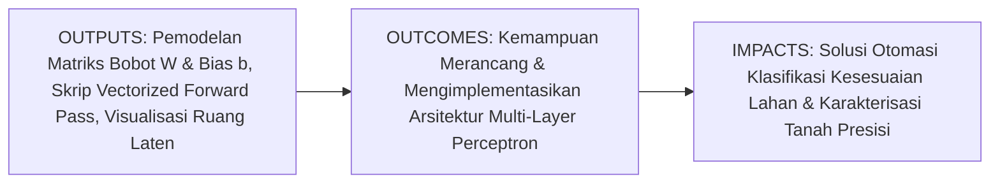
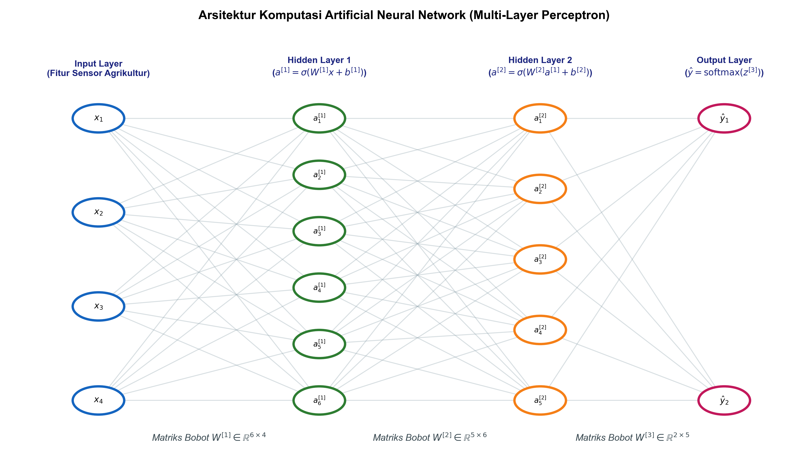
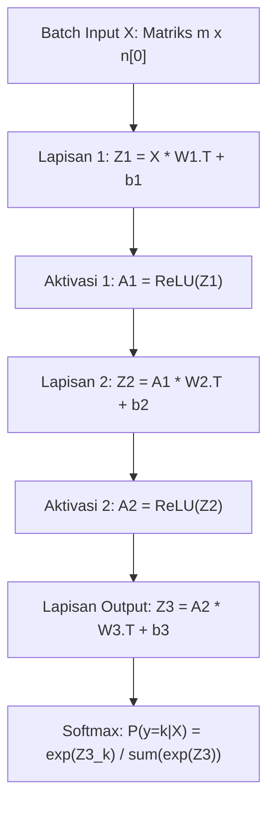

# AI Modul 9.2: Artificial Neural Network (ANN)

---

## 1. Identitas & Kerangka Capaian Pembelajaran (Sub-CPMK)

* **Kode Modul**: AI Modul 9.2
* **Mata Kuliah**: Kecerdasan Buatan dan Sains Data Pertanian Presisi
* **Alokasi Waktu**: 2 x 50 Menit (Kajian Teori & Diskusi) + 2 x 50 Menit (Eksplorasi Praktikum Mandiri)
* **Beban SKS**: 3 SKS
* **Prasyarat**: AI Modul 9.1 (Konsep Deep Learning)
* **Level Kognitif**: Bloom C2 (Memahami), C3 (Menerapkan), C4 (Menganalisis)



### 1.1 Capaian Pembelajaran Khusus (Sub-CPMK)
Setelah menyelesaikan modul ini secara komprehensif, mahasiswa diharapkan mampu:
1. **Memahami (C2)** arsitektur komputasi Multi-Layer Perceptron (MLP) yang terdiri dari lapisan masukan (*input layer*), lapisan tersembunyi (*hidden layers*), dan lapisan keluaran (*output layer*).
2. **Menerapkan (C3)** representasi aljabar linier dalam formulasi propagasi maju (*vectorized forward propagation*) menggunakan matriks bobot, vektor bias, dan fungsi aktivasi non-linier dengan pustaka NumPy.
3. **Menganalisis (C4)** transformasi ruang fitur berdimensi tinggi menuju ruang representasi laten (*latent feature space*) dalam mengatasi permasalahan pemisahan non-linier pada evaluasi kesesuaian lahan perkebunan.

### 1.2 Kerangka Hasil Pembelajaran (Outputs, Outcomes, & Impacts)
* **Outputs (Keluaran Langsung)**:
  * Penguasaan notasi matematis baku untuk tensor bobot antar-lapisan $W^{[l]}$, vektor bias $b^{[l]}$, dan vektor aktivasi $a^{[l]}$.
  * Skrip modul Python terstruktur untuk eksekusi propagasi maju tervektorisasi pada sekumpulan data batch.
  * Visualisasi garis batas keputusan (*decision boundary*) non-linier pada ruang fitur tanah perkebunan.
* **Outcomes (Kompetensi Aplikatif)**:
  * Kemampuan menentukan dimensi dan konfigurasi lapisan neural network berdasarkan struktur data tabel sensorik agrokompleks.
  * Keahlian dalam memetakan interaksi non-linier antar-parameter fisikokimia tanah terhadap produktivitas tanaman.
* **Impacts (Dampak Strategis Jangka Panjang)**:
  * Peningkatan akurasi pemetaan kesesuaian lahan untuk ekspansi dan peremajaan (*replanting*) kebun kelapa sawit secara terukur dan berkelanjutan.

---

## 2. Profil Fundamental Artificial Neural Network: Fungsi, Manfaat, dan Keunggulan-Kelemahan

### 2.1 Fungsi Komputasi & Pemodelan Matematis
Artificial Neural Network (ANN) tipe Multi-Layer Perceptron adalah model komputasi terarah (*feedforward*) yang memetakan masukan $x \in \mathbb{R}^{n_x}$ menjadi keluaran $\hat{y} \in \mathbb{R}^{n_y}$ melalui serangkaian lapisan pemrosesan paralel:
1. **Transformasi Afina Berantai**: Di setiap lapisan $l \in \{1, 2, \dots, L\}$, sinyal dari lapisan sebelumnya dikalikan dengan matriks bobot $W^{[l]}$ dan ditambahkan dengan vektor bias $b^{[l]}$:
   $$z^{[l]} = W^{[l]} a^{[l-1]} + b^{[l]}$$
2. **Transformasi Non-Linier Elemen-demi-Elemen**: Sinyal pra-aktivasi $z^{[l]}$ ditransformasikan melalui fungsi aktivasi $\sigma^{[l]}$ untuk menghasilkan vektor aktivasi $a^{[l]}$:
   $$a^{[l]} = \sigma^{[l]}(z^{[l]})$$
   di mana $a^{[0]} = x$ adalah vektor masukan awal.
3. **Distribusi Probabilitas Keluaran**: Pada lapisan terakhir ($L$), keluaran ditransformasikan menjadi estimasi kontinu (regresi) atau probabilitas multikelas menggunakan fungsi Softmax.

### 2.2 Manfaat Nyata di Industri Perkebunan & Agribisnis
* **Zonasi Kesesuaian Lahan Otomatis**: Memproses kombinasi data pH tanah, tekstur liat-pasir-debu, kapasitas tukar kation (KTK), ketebalan gambut, dan curah hujan untuk mengklasifikasikan kelas kesesuaian lahan (S1, S2, S3, N).
* **Prediksi Rendemen Minyak Sawit (CPO)**: Memetakan variabel pemupukan, umur tegakan pohon, dan curah hujan kumulatif terhadap rendemen ekstraksi pabrik kelapa sawit.
* **Estimasi Kebutuhan Dosis Pemupukan Presisi**: Merekomendasikan rekomendasi takaran N-P-K-Mg berbasis riwayat daun dan sifat tanah per blok perkebunan.

### 2.3 Rationale: Alasan Mengapa Metode Ini Digunakan
1. **Menangkap Interaksi Non-Linier Multi-Variabel**: Dalam agronomi tanah, pengaruh pH terhadap serapan nutrisi tidak bersifat linier terpisah, melainkan berinteraksi secara kompleks dengan kadar bahan organik dan kelembapan. ANN mampu memodelkan interaksi sinergis ini secara alami di lapisan tersembunyi.
2. **Kapasitas Generalisasi Tinggi pada Data Tabular & Sensorik**: Arsitektur *fully connected* memberikan fleksibilitas penuh bagi setiap neuron untuk menimbang kontribusi dari seluruh variabel input secara simultan.

### 2.4 Analisis Kelebihan dan Kekurangan (Tabel Komparasi)

| Aspek Komparasi | Regresi Multivariat Konvensional | Multi-Layer Perceptron (ANN) | Implikasi Agrokompleks |
| :--- | :--- | :--- | :--- |
| **Batas Keputusan** | Dibatasi oleh bidang datar hiperlinier (*linear hyperplane*). | Bidang batas keputusan lengkung non-linier sangat fleksibel. | Mampu memisahkan kelas tanah marginal yang memiliki ambang batas bersilangan. |
| **Interaksi Fitur** | Harus dirumuskan manual melalui perkalian suku (*interaction terms*). | Dipelajari secara otomatis oleh neuron-neuron di lapisan tersembunyi. | Memodelkan relasi tak terduga antara iklim mikro dan serapan pupuk. |
| **Kebutuhan Sampel** | Bekerja stabil pada sampel puluhan hingga ratusan. | Memerlukan data ratusan hingga ribuan sampel untuk konvergen optimal. | Perlu pengumpulan riwayat data kebun multi-musim. |
| **Kepekaan Penskalaan** | Cenderung tahan jika parameter dianalisis secara parsial. | Sangat sensitif terhadap skala data, wajib normalisasi ketat. | Wajib standarisasi seluruh variabel tanah sebelum inferensi. |

### 2.5 Contoh Kasus Penggunaan Konkret di Sektor Agro-Industri
Divisi Agronomi Perkebunan Kelapa Sawit mengumpulkan data dari 1.200 petak ukur tanah yang mencakup 6 parameter: pH, KTK, C-Organik, Rasio Pasir-Liat, Kedalaman Muka Air Tanah, dan Ketinggian Tempat. Tujuannya adalah mengklasifikasikan petak ukur ke dalam 3 kategori kesesuaian: Sangat Sesuai (S1), Cukup Sesuai (S2), dan Tidak Sesuai (N). Menggunakan Multi-Layer Perceptron dengan struktur $6 
ightarrow 16 
ightarrow 8 
ightarrow 3$, model mampu memetakan interaksi antara muka air tanah dangkal dan tekstur liat tinggi yang selama ini sulit dimodelkan secara linier.

### 2.6 Aspek Kritis & Catatan Penting Arsitektur
1. **Pemilihan Dimensi Hidden Layer**: Terlalu sedikit neuron menyebabkan *underfitting* (model gagal menangkap kompleksitas tanah), sedangkan terlalu banyak neuron memicu *overfitting* dan konsumsi memori berlebih.
2. **Inisialisasi Bobot yang Tepat**: Menginisialisasi seluruh bobot dengan angka nol akan menyebabkan simetri matematis (*symmetry breaking failure*), di mana seluruh neuron di lapisan yang sama menghitung gradien yang identik.

---

## 3. Landasan Teori & Konsep Matematis Artificial Neural Network



### 3.1 Notasi Baku Matematika Aljabar Linier
Untuk jaringan dengan $L$ lapisan:
* $n^{[l]}$ menyatakan jumlah neuron pada lapisan $l$, dengan $n^{[0]} = n_x$ (jumlah fitur masukan) dan $n^{[L]} = n_y$ (jumlah unit keluaran).
* $W^{[l]} \in \mathbb{R}^{n^{[l]} 	imes n^{[l-1]}}$ adalah matriks bobot yang menghubungkan lapisan $l-1$ ke lapisan $l$.
* $b^{[l]} \in \mathbb{R}^{n^{[l]} 	imes 1}$ adalah vektor bias untuk lapisan $l$.
* $z^{[l]} \in \mathbb{R}^{n^{[l]} 	imes 1}$ adalah vektor net input sebelum aktivasi pada lapisan $l$.
* $a^{[l]} \in \mathbb{R}^{n^{[l]} 	imes 1}$ adalah vektor aktivasi pasca-fungsi aktivasi pada lapisan $l$.

### 3.2 Formulasi Vektorisasi Batch (*Vectorized Batch Forward Propagation*)
Ketika memproses satu batch yang berisi $m$ sampel data perkebunan sekaligus, vektor-vektor kolom digabungkan menjadi matriks masukan $X \in \mathbb{R}^{m 	imes n^{[0]}}$ (di mana setiap baris mewakili satu sampel kebun). Formulasi propagasi maju untuk seluruh sampel dirumuskan sebagai berikut:

$$Z^{[l]} = A^{[l-1]} (W^{[l]})^	op + \mathbf{1}_m (b^{[l]})^	op$$

$$A^{[l]} = \sigma^{[l]}(Z^{[l]})$$

di mana:
* $A^{[0]} = X \in \mathbb{R}^{m 	imes n^{[0]}}$
* $Z^{[l]} \in \mathbb{R}^{m 	imes n^{[l]}}$
* $A^{[l]} \in \mathbb{R}^{m 	imes n^{[l]}}$
* $\mathbf{1}_m$ adalah vektor kolom berukuran $m 	imes 1$ yang seluruh elemennya bernilai $1$.

### 3.3 Transformasi Ruang Fitur Menuju Ruang Laten (*Latent Space*)
Secara geometris, setiap lapisan tersembunyi melakukan distorsi dan rotasi non-linier terhadap ruang masukan. Jika data tanah pada ruang awal $\mathbb{R}^2$ atau $\mathbb{R}^6$ tidak dapat dipisahkan oleh bidang datar (*non-linearly separable*), lapisan tersembunyi memetakan titik-titik sampel tersebut ke dalam ruang laten berdimensi baru di mana batas pemisah antar-kelas menjadi linier (*linearly separable*).

---

## 4. Arsitektur Komputasi & Pipeline Praktis Python



Implementasi Multi-Layer Perceptron berorientasi objek menggunakan NumPy murni:

```python
import numpy as np

class MultiLayerPerceptron:
    def __init__(self, layer_dims, seed=42):
        np.random.seed(seed)
        self.layer_dims = layer_dims
        self.num_layers = len(layer_dims) - 1
        self.parameters = {}
        
        # Inisialisasi bobot He (Kaiming) dan bias nol
        for l in range(1, len(layer_dims)):
            self.parameters[f'W{l}'] = np.random.randn(layer_dims[l], layer_dims[l-1]) * np.sqrt(2.0 / layer_dims[l-1])
            self.parameters[f'b{l}'] = np.zeros((1, layer_dims[l]))
            
    def relu(self, Z):
        return np.maximum(0, Z)
        
    def softmax(self, Z):
        # Penanganan kestabilan numerik dengan mengurangi nilai maksimum per baris
        exp_Z = np.exp(Z - np.max(Z, axis=1, keepdims=True))
        return exp_Z / np.sum(exp_Z, axis=1, keepdims=True)
        
    def forward(self, X):
        cache = {'A0': X}
        A = X
        
        # Lapisan tersembunyi dengan aktivasi ReLU
        for l in range(1, self.num_layers):
            W = self.parameters[f'W{l}']
            b = self.parameters[f'b{l}']
            Z = np.dot(A, W.T) + b
            A = self.relu(Z)
            cache[f'Z{l}'] = Z
            cache[f'A{l}'] = A
            
        # Lapisan keluaran dengan aktivasi Softmax
        W_out = self.parameters[f'W{self.num_layers}']
        b_out = self.parameters[f'b{self.num_layers}']
        Z_out = np.dot(A, W_out.T) + b_out
        A_out = self.softmax(Z_out)
        cache[f'Z{self.num_layers}'] = Z_out
        cache[f'A{self.num_layers}'] = A_out
        
        return A_out, cache

# Inisialisasi arsitektur: 6 fitur tanah -> 12 neuron (H1) -> 8 neuron (H2) -> 3 kelas kesesuaian
mlp_model = MultiLayerPerceptron(layer_dims=[6, 12, 8, 3])
X_dummy = np.random.randn(10, 6) # 10 sampel petak ukur tanah
probas, cache = mlp_model.forward(X_dummy)

print("Bentuk Matriks Probabilitas Output :", probas.shape)
print("Jumlah Probabilitas Baris Pertama  :", np.sum(probas[0]))
print("Prediksi Kelas Terbesar Baris 1    :", np.argmax(probas[0]))
```

---

## 5. Studi Kasus Komprehensif Agro-Industri: Klasifikasi Kesesuaian Lahan Sawit

### 5.1 Karakteristik Dataset Tanah Perkebunan
Dataset mencakup 4 parameter fisikokimia utama:
1. $x_1$: Derajat Keasaman Tanah (pH) [$4.0 - 6.5$]
2. $x_2$: Kapasitas Tukar Kation (KTK, meq/100g) [$8.0 - 28.0$]
3. $x_3$: Kandungan C-Organik (%) [$0.8 - 4.5$]
4. $x_4$: Kejenuhan Basa (%) [$15.0 - 65.0$]

Target keluaran dibagi menjadi 3 kelas:
* Kelas 0: S1 (Sangat Sesuai - produksi $> 25$ ton TBS/ha/thn)
* Kelas 1: S2 (Cukup Sesuai - produksi $18 - 25$ ton TBS/ha/thn)
* Kelas 2: S3/N (Marginal/Tidak Sesuai - produksi $< 18$ ton TBS/ha/thn)

### 5.2 Evaluasi Komparasi Batas Keputusan Non-Linier
```python
# Simulasi pembangkitan data tanah sintetis dengan batas non-linier
np.random.seed(42)
N_per_class = 150
# Kelas 0: pH optimal & KTK tinggi
c0 = np.random.multivariate_normal([5.5, 22.0], [[0.2, 0.1], [0.1, 4.0]], N_per_class)
# Kelas 1: pH sedang & KTK sedang
c1 = np.random.multivariate_normal([4.8, 15.0], [[0.2, -0.1], [-0.1, 3.0]], N_per_class)
# Kelas 2: pH masam ekstrem / KTK rendah
c2 = np.random.multivariate_normal([4.2, 9.0], [[0.15, 0.05], [0.05, 2.5]], N_per_class)

X_soil = np.vstack([c0, c1, c2])
y_soil = np.array([0]*N_per_class + [1]*N_per_class + [2]*N_per_class)

# Standarisasi Z-score
X_soil_std = (X_soil - np.mean(X_soil, axis=0)) / np.std(X_soil, axis=0)

# MLP Model Evaluasi
model_soil = MultiLayerPerceptron(layer_dims=[2, 8, 4, 3])
probs, _ = model_soil.forward(X_soil_std)
preds = np.argmax(probs, axis=1)

print(f"Total Sampel Tanah Dievaluasi : {len(y_soil)}")
print(f"Bentuk Matriks Bobot Lapisan 1: {model_soil.parameters['W1'].shape}")
print(f"Distribusi Prediksi Awal     : {np.bincount(preds)}")
```

---

## 6. Kekeliruan Metodologis dan Praktik Terbaik (*Common Pitfalls & Best Practices*)

### 6.1 Kekeliruan Umum Metodologis (*Common Pitfalls*)
1. **Mengabaikan Penanganan Overflow pada Softmax**: Menghitung $\exp(z_i)$ secara langsung tanpa mengurangi nilai maksimum $\max(z)$ dapat memicu nilai *Infinity* atau `NaN` ketika nilai $z_i$ besar.
2. **Bobot Diinisialisasi Identik**: Mengisi seluruh bobot dengan nilai konstanta sama menyebabkan setiap neuron tersembunyi memiliki aktivasi dan pembaruan gradien yang identik (*symmetry failure*).
3. **Data Leakage dalam Penskalaan**: Menghitung rata-rata dan deviasi standar penskalaan pada keseluruhan dataset (gabungan train dan test) sebelum proses pemisahan.

### 6.2 Praktik Terbaik (*Best Practices*)
1. **Inisialisasi Kaiming/He atau Xavier/Glorot**: Gunakan varians inisialisasi $	ext{Var}(W) = \frac{2}{n_{	ext{in}}}$ untuk lapisan dengan aktivasi ReLU guna menjaga kestabilan magnitudo sinyal antar-lapisan.
2. **Penskalaan Data Berdasarkan Training Set**: Hitung $\mu_{	ext{train}}$ dan $\sigma_{	ext{train}}$ hanya dari data latih, lalu terapkan parameter tersebut pada data uji dan data operasional baru.
3. **Penyusunan Arsitektur Piramida Terbalik**: Secara umum, konfigurasi jumlah neuron yang berkurang secara bertahap dari lapisan input menuju output (misalnya $64 
ightarrow 32 
ightarrow 16 
ightarrow C$) membantu jaringan mengompresi representasi secara elegan.

---

## 7. Rangkuman Modul

* Artificial Neural Network Multi-Layer Perceptron (MLP) memperluas kapasitas model linier melalui susunan lapisan tersembunyi dengan fungsi aktivasi non-linier.
* Notasi tensor baku memfasilitasi formulasi propagasi maju secara tervektorisasi: $Z^{[l]} = A^{[l-1]} (W^{[l]})^	op + \mathbf{1} (b^{[l]})^	op$ dan $A^{[l]} = \sigma(Z^{[l]})$.
* Lapisan tersembunyi berfungsi sebagai pemeta ruang fitur masukan ke dalam ruang representasi laten yang memungkinkan pemisahan kelas non-linier yang rumit.
* Kestabilan numerik fungsi Softmax pada lapisan keluaran wajib dijaga melalui teknik pergeseran skalar (*log-sum-exp stabilization trick*).

---

## 8. Latihan Soal & Tugas Analitis HOTS (Bloom C3-C5)

### Soal Konseptual & Analitis
1. **Analisis Dimensi Tensor (Bloom C3)**: Sebuah jaringan saraf tiruan dirancang untuk memproses data sensorik kebun dengan 10 variabel prediktor. Jaringan memiliki 2 lapisan tersembunyi masing-masing berukuran 32 neuron dan 16 neuron, serta 4 kelas keluaran. Jika ukuran mini-batch yang dialirkan adalah $m = 64$ sampel, tentukan dimensi eksak dari:
   * Matriks $X$, $W^{[1]}$, $b^{[1]}$, dan $Z^{[1]}$
   * Matriks $W^{[2]}$, $b^{[2]}$, dan $A^{[2]}$
   * Matriks $W^{[3]}$, $b^{[3]}$, dan $A^{[3]}$!
2. **Analisis Simetri Bobot (Bloom C4)**: Jelaskan secara matematis apa yang terjadi jika seluruh bobot pada lapisan tersembunyi diinisialisasi dengan angka yang persis sama (misalnya $0.5$)! Mengapa fenomena ini melumpuhkan kapasitas multi-neuron pada MLP?

### Tugas Pemrograman Mandiri
Lengkapi kode kelas `MultiLayerPerceptron` agar mampu menerima argumen aktivasi yang fleksibel (`'relu'`, `'tanh'`, atau `'sigmoid'`) pada setiap lapisan tersembunyi. Jalankan pengujian pada dataset tanah sintetis dan hitung waktu komputasi (*latency*) forward pass untuk 10.000 sampel!

---

## 9. Jembatan Konsep (Bridging) ke AI Modul 9.3: Struktur Neuron

Kita telah memahami bagaimana kumpulan neuron diorganisasi ke dalam lapisan-lapisan Multi-Layer Perceptron untuk memproses data secara simultan. Namun, bagaimana sesungguhnya cara kerja sebuah unit komputasi terkecil tersebut? 

Pada **AI Modul 9.3: Struktur Neuron**, kita akan membedah secara mendalam **anatomi neuron komputasional**, membandingkannya dengan neuron biologis manusia, menelusuri model seminal McCulloch-Pitts dan Perceptron Rosenblatt, serta mengkaji secara analitis batas kemampuan matematis sebuah neuron tunggal dalam menghadapi gerbang logika non-linier XOR.

---

## 10. Daftar Pustaka dan Referensi Akademik

1. Goodfellow, I., Bengio, Y., & Courville, A. (2016). *Deep Learning*. MIT Press. (Bab 6: Deep Feedforward Networks).
2. Bishop, C. M. (2006). *Pattern Recognition and Machine Learning*. Springer. (Bab 5: Neural Networks).
3. He, K., Zhang, X., Ren, S., & Sun, J. (2015). *Delving deep into rectifiers: Surpassing human-level performance on ImageNet classification*. Proceedings of the IEEE International Conference on Computer Vision, 1026-1034.
4. Glorot, X., & Bengio, Y. (2010). *Understanding the difficulty of training deep feedforward neural networks*. Proceedings of the Thirteenth International Conference on Artificial Intelligence and Statistics, 249-256.
