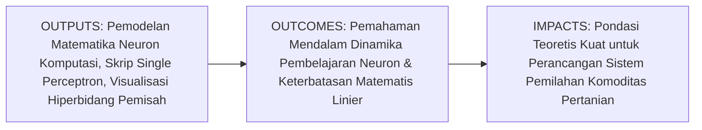
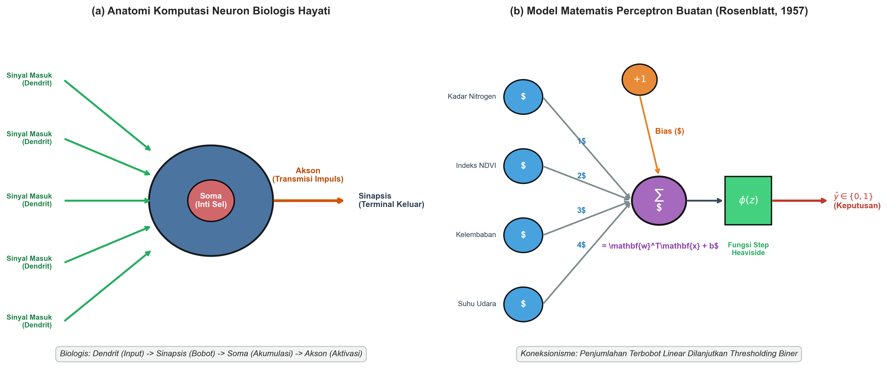
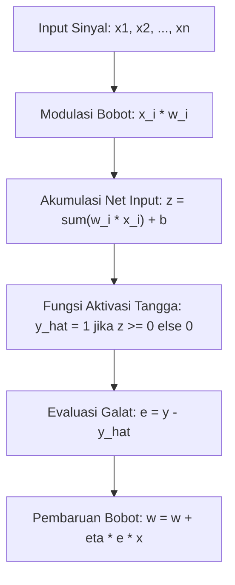

# AI Modul 9.3: Struktur Neuron

---

## 1. Identitas & Kerangka Capaian Pembelajaran (Sub-CPMK)

* **Kode Modul**: AI Modul 9.3
* **Mata Kuliah**: Kecerdasan Buatan dan Sains Data Pertanian Presisi
* **Alokasi Waktu**: 2 x 50 Menit (Kajian Teori & Diskusi) + 2 x 50 Menit (Eksplorasi Praktikum Mandiri)
* **Beban SKS**: 3 SKS
* **Prasyarat**: AI Modul 9.2 (Artificial Neural Network)
* **Level Kognitif**: Bloom C2 (Memahami), C3 (Menerapkan), C4 (Menganalisis)



### 1.1 Capaian Pembelajaran Khusus (Sub-CPMK)
Setelah menyelesaikan modul ini secara komprehensif, mahasiswa diharapkan mampu:
1. **Memahami (C2)** analogi struktural dan fungsional antara neuron biologis (dendrit, soma, akson, sinapsis) dengan neuron komputasional (vektor masukan, bobot sinaptik, fungsi akumulator, bias, dan fungsi aktivasi).
2. **Menerapkan (C3)** aturan pembelajaran Perceptron (*Perceptron Learning Rule*) yang diperkenalkan oleh Frank Rosenblatt untuk mengklasifikasikan data biner dua dimensi secara iteratif menggunakan pustaka NumPy.
3. **Menganalisis (C4)** keterbatasan matematis pemisahan linier (*linear separability*) pada neuron tunggal serta membuktikan secara analitis kegagalan Perceptron dalam menyelesaikan persoalan gerbang logika non-linier XOR (Minsky & Papert, 1969).

### 1.2 Kerangka Hasil Pembelajaran (Outputs, Outcomes, & Impacts)
* **Outputs (Keluaran Langsung)**:
  * Pemahaman analitik komparasi model McCulloch-Pitts (1943) dan model Perceptron Rosenblatt (1958).
  * Skrip Python modular implementasi Single Perceptron dari dasar (*from scratch*) tanpa pustaka machine learning pihak ketiga.
  * Plot visual dinamis pergeseran garis pemisah (*separating hyperplane*) per iterasi *epoch*.
* **Outcomes (Kompetensi Aplikatif)**:
  * Kemampuan mengidentifikasi apakah suatu permasalahan pemilahan agro-industri bersifat *linearly separable* atau membutuhkan jaringan multi-neuron.
  * Keahlian merumuskan aturan pembaruan bobot berbasis sinyal galat diskrit.
* **Impacts (Dampak Strategis Jangka Panjang)**:
  * Pengetahuan fundamental yang mencegah praktisi perkebunan salah menerapkan arsitektur linier pada permasalahan biologi lapangan yang sarat dengan dinamika non-linier.

---

## 2. Profil Fundamental Struktur Neuron: Fungsi, Manfaat, dan Keunggulan-Kelemahan

### 2.1 Fungsi Komputasi & Pemodelan Matematis
Neuron buatan (*artificial neuron*) adalah unit komputasi elementer yang meniru mekanisme kerja sel saraf biologis dalam memproses rangsangan:
1. **Penerimaan & Pembobotan Sinyal**: Menerima serangkaian sinyal masukan $x = (x_1, x_2, \dots, x_n)^	op$ di mana setiap jalur masukan dimodulasi oleh bobot sinaptik $w_i \in \mathbb{R}$.
2. **Akumulasi Spasial Net Input**: Menghitung kombinasi linier dari sinyal masukan terbobot dan menambahkan nilai ambang batas (*threshold*) internal berupa bias $b$:
   $$z = \sum_{i=1}^{n} w_i x_i + b = w^	op x + b$$
3. **Penembakan Potensial Aksi (*Activation Firing*)**: Menyalurkan sinyal net input $z$ ke dalam fungsi aktivasi $\phi(z)$ untuk menghasilkan keluaran biner $\hat{y} \in \{0, 1\}$ atau $\{-1, +1\}$:
   $$\hat{y} = \phi(z) = \begin{cases} 1, & 	ext{jika } z \ge 0 \ 0, & 	ext{jika } z < 0 \end{cases}$$

### 2.2 Manfaat Nyata di Industri Perkebunan & Agribisnis
Meskipun sederhana, neuron tunggal merupakan fondasi operasional bagi:
* **Sensor Biner Sortasi Mutu Sederhana**: Pemilahan biji kopi bermutu tinggi vs afkir berdasarkan rasio densitas dan pantulan cahaya merah-hijau yang terpisah secara linier.
* **Deteksi Ambang Batas Defisiensi Air**: Menentukan keputusan biner aktivasi katup irigasi tetes (*drip irrigation*) berdasarkan kombinasi pembacaan kadar air tanah dan suhu kanopi.

### 2.3 Rationale: Alasan Mengapa Materi Ini Dipelajari
Memahami struktur neuron tunggal adalah prasyarat untuk memahami cara kerja jaringan saraf yang lebih dalam. Kegagalan historis Perceptron dalam menyelesaikan persoalan gerbang logika non-linier XOR (yang memicu periode *AI Winter* pertama setelah buku Minsky & Papert terbit tahun 1969) memberikan wawasan fundamental mengenai mengapa arsitektur berlapis banyak (*multi-layer*) dengan aktivasi non-linier mutlak dibutuhkan dalam pemodelan data dunia nyata.

### 2.4 Analisis Kelebihan dan Kekurangan (Tabel Komparasi)

| Aspek Evaluasi | Model McCulloch-Pitts (1943) | Perceptron Rosenblatt (1958) | Multi-Layer Network Modern |
| :--- | :--- | :--- | :--- |
| **Tipe Bobot** | Bobot bernilai biner atau tetap, ditentukan secara manual. | Bobot kontinu riil yang dapat dipelajari secara otomatis (*learning rule*). | Bobot matriks multi-lapisan dipelajari via backpropagation. |
| **Mekanisme Belajar** | Tidak memiliki algoritma pembelajaran mandiri. | Algoritma koreksi galat (*error-correction learning rule*). | Gradient descent berbasis diferensiasi fungsi objektif. |
| **Kapasitas Pemisahan** | Hanya fungsi logika biner linier sederhana. | Terbatas pada pemisahan linier (*linear separability*). | Pemisahan non-linier kontinu sembarang (*universal*). |
| **Kelemahan Kritis** | Kaku, tidak dapat beradaptasi terhadap derau data. | Gagal total memecahkan masalah non-linier (XOR). | Kebutuhan komputasi dan data yang jauh lebih besar. |

### 2.5 Contoh Kasus Penggunaan Konkret di Sektor Agro-Industri
Sebuah stasiun pemilahan tandan buah sawit ingin memilah daun normal vs daun terserang hama ulat kantung berdasarkan dua indeks reflektansi: $x_1$ (pantulan pada 680 nm) dan $x_2$ (pantulan pada 800 nm). Jika kedua kelas tersebut dapat dipisahkan secara sempurna oleh garis lurus pada bidang $(x_1, x_2)$, maka Single Perceptron Rosenblatt terbukti secara matematis mampu menemukan garis pemisah tersebut dalam sejumlah iterasi terhingga (*Perceptron Convergence Theorem*).

### 2.6 Aspek Kritis & Catatan Penting Arsitektur
1. **Teorema Konvergensi Perceptron**: Jika dataset bersifat *linearly separable*, algoritma Rosenblatt dijamin akan konvergen ke sebuah solusi bobot dalam sejumlah langkah terhingga. Namun jika data tidak dapat dipisahkan secara linier, algoritma akan mengalami osilasi tanpa henti (*infinite loop*).
2. **Ketiadaan Gradien pada Fungsi Tangga**: Fungsi tangga biner Heaviside memiliki turunan nol di semua titik kecuali di titik nol (di mana turunannya tidak terdefinisi). Ketiadaan gradien kontinu inilah yang mencegah penggunaan *gradient descent* pada Perceptron klasik.

---

## 3. Landasan Teori & Konsep Matematis Struktur Neuron



### 3.1 Komparasi Anatomi Biologis vs Komputasional

| Komponen Biologis | Komponen Neuron Buatan | Deskripsi Matematis & Komputasi |
| :--- | :--- | :--- |
| **Dendrit** | Vektor Masukan ($x_i$) | Saluran penerima sinyal rangsangan dari lingkungan atau neuron lain. |
| **Sinapsis** | Bobot Koneksi ($w_i$) | Kekuatan transmisi sinyal; bobot positif memperkuat, negatif menghambat. |
| **Badan Sel (Soma)** | Fungsi Akumulator ($\sum$) | Penjumlahan linier seluruh sinyal terbobot: $\sum_{i=1}^n w_i x_i$. |
| **Bukit Akson (Axon Hillock)** | Nilai Bias ($b$) | Nilai ambang internal yang menentukan tingkat kemudahan neuron terpicu. |
| **Akson** | Jalur Transmisi Sinyal | Menghantarkan potensial aksi keluaran menuju neuron target berikutnya. |
| **Potensial Aksi** | Fungsi Aktivasi ($\phi(z)$) | Transformasi sinyal kontinu menjadi impuls keluaran diskrit atau terdistorsi. |

### 3.2 Aturan Pembelajaran Perceptron (*Perceptron Learning Rule*)
Diberikan himpunan data latih $\mathcal{D} = \{(x^{(j)}, y^{(j)})\}_{j=1}^m$ di mana $y^{(j)} \in \{0, 1\}$. Untuk setiap sampel $j$:
1. Hitung keluaran prediksi:
   $$\hat{y}^{(j)} = \phi(w^	op x^{(j)} + b)$$
2. Hitung galat prediksi:
   $$e^{(j)} = y^{(j)} - \hat{y}^{(j)}$$
3. Perbarui vektor bobot dan bias dengan laju pembelajaran (*learning rate*) $\eta \in (0, 1]$:
   $$w \leftarrow w + \eta \cdot e^{(j)} \cdot x^{(j)}$$
   $$b \leftarrow b + \eta \cdot e^{(j)}$$

Jika prediksi benar ($e^{(j)} = 0$), bobot tidak berubah. Jika $y=1$ namun $\hat{y}=0$ ($e=1$), bobot ditambahkan ke arah vektor masukan $x^{(j)}$. Jika $y=0$ namun $\hat{y}=1$ ($e=-1$), bobot dikurangi menjauhi arah vektor masukan.

### 3.3 Pembuktian Matematis Kegagalan Gerbang Non-Linier XOR
Tinjau tabel kebenaran gerbang XOR dengan masukan biner $(x_1, x_2) \in \{0, 1\}^2$:

| $x_1$ | $x_2$ | Target $y$ | Syarat Hiperbidang Pemisah ($w_1 x_1 + w_2 x_2 + b$) |
| :---: | :---: | :---: | :---: |
| 0 | 0 | 0 | $w_1(0) + w_2(0) + b < 0 \implies b < 0$ |
| 0 | 1 | 1 | $w_1(0) + w_2(1) + b \ge 0 \implies w_2 + b \ge 0$ |
| 1 | 0 | 1 | $w_1(1) + w_2(0) + b \ge 0 \implies w_1 + b \ge 0$ |
| 1 | 1 | 0 | $w_1(1) + w_2(1) + b < 0 \implies w_1 + w_2 + b < 0$ |

Jumlahkan pertidaksamaan untuk baris kedua dan ketiga:
$$(w_1 + b) + (w_2 + b) \ge 0 \implies w_1 + w_2 + 2b \ge 0$$

Dari baris keempat diketahui $w_1 + w_2 + b < 0$. Substitusikan ke dalam pertidaksamaan penjumlahan:
$$(w_1 + w_2 + b) + b \ge 0$$
Karena $(w_1 + w_2 + b) < 0$ dan dari baris pertama $b < 0$, maka penjumlahan dua bilangan negatif tersebut **haruslah negatif** ($< 0$). Hal ini memicu kontradiksi matematis:
$$< 0 \ge 0 \quad (	ext{Kontradiksi Absolut!})$$

Kontradiksi ini membuktikan secara analitis bahwa tidak ada pasangan bobot $(w_1, w_2, b)$ berapapun yang dapat memenuhi keempat kondisi gerbang XOR secara simultan. Sebuah neuron tunggal hanya mampu menciptakan satu garis pemisah lurus, sedangkan gerbang XOR membutuhkan minimal dua garis pemisah non-linier.

---

## 4. Arsitektur Komputasi & Pipeline Praktis Python



Implementasi Single Perceptron Rosenblatt dari dasar menggunakan NumPy:

```python
import numpy as np

class RosenblattPerceptron:
    def __init__(self, n_features, learning_rate=0.1, max_epochs=100, seed=42):
        np.random.seed(seed)
        self.w = np.zeros(n_features)
        self.b = 0.0
        self.lr = learning_rate
        self.max_epochs = max_epochs
        self.history_errors = []
        
    def step_function(self, z):
        return np.where(z >= 0.0, 1, 0)
        
    def predict(self, X):
        z = np.dot(X, self.w) + self.b
        return self.step_function(z)
        
    def fit(self, X, y):
        m = X.shape[0]
        for epoch in range(self.max_epochs):
            total_error = 0
            for i in range(m):
                y_hat = self.predict(X[i])
                error = y[i] - y_hat
                if error != 0:
                    self.w += self.lr * error * X[i]
                    self.b += self.lr * error
                    total_error += abs(error)
            self.history_errors.append(total_error)
            # Berhenti jika konvergen sempurna
            if total_error == 0:
                print(f"Perceptron Konvergen pada Epoch ke-{epoch+1}!")
                break
        return self

# Pengujian pada Gerbang AND (Linearly Separable)
X_and = np.array([[0, 0], [0, 1], [1, 0], [1, 1]])
y_and = np.array([0, 0, 0, 1])

p_and = RosenblattPerceptron(n_features=2, learning_rate=0.2)
p_and.fit(X_and, y_and)
print("Bobot Akhir w   :", p_and.w)
print("Bias Akhir b    :", p_and.b)
print("Prediksi Output :", p_and.predict(X_and))
```

---

## 5. Studi Kasus Komprehensif Agro-Industri: Pemilahan Reflektansi Daun Sehat vs Klorosis

### 5.1 Pengukuran Spektrometri Lapangan
Diperoleh data rasio pantulan spektral kanopi kelapa sawit pada dua pita gelombang:
* $x_1$: Pantulan Cahaya Merah (Red Band, 660 nm) - terserap kuat oleh klorofil normal.
* $x_2$: Pantulan Inframerah Dekat (NIR Band, 850 nm) - dipantulkan kuat oleh struktur sel mesofil daun sehat.

Daun sehat ($y=1$) memiliki serapan merah tinggi (pantulan merah rendah) dan pantulan NIR tinggi. Daun mengalami klorosis/malnutrisi ($y=0$) memiliki pantulan merah tinggi dan pantulan NIR rendah.

### 5.2 Implementasi dan Garis Pemisah Hiperbidang
```python
# Simulasi sampel pengukuran lapangan
np.random.seed(42)
n_samples = 40
# Daun Klorosis (y = 0): Red tinggi [0.4 - 0.7], NIR rendah [0.1 - 0.4]
X_klorosis = np.column_stack([np.random.uniform(0.4, 0.7, n_samples), np.random.uniform(0.1, 0.4, n_samples)])
# Daun Sehat (y = 1): Red rendah [0.1 - 0.35], NIR tinggi [0.5 - 0.85]
X_sehat = np.column_stack([np.random.uniform(0.1, 0.35, n_samples), np.random.uniform(0.5, 0.85, n_samples)])

X_daun = np.vstack([X_klorosis, X_sehat])
y_daun = np.array([0]*n_samples + [1]*n_samples)

perceptron_daun = RosenblattPerceptron(n_features=2, learning_rate=0.1, max_epochs=50)
perceptron_daun.fit(X_daun, y_daun)
akurasi = np.mean(perceptron_daun.predict(X_daun) == y_daun) * 100
print(f"Akurasi Pemilahan Daun: {akurasi:.1f}%")
```

---

## 6. Kekeliruan Metodologis dan Praktik Terbaik (*Common Pitfalls & Best Practices*)

### 6.1 Kekeliruan Umum Metodologis (*Common Pitfalls*)
1. **Memaksakan Perceptron pada Data Non-Linier**: Menjalankan Perceptron pada data dengan pola beririsan atau non-linier akan menyebabkan algoritma melakukan iterasi hingga batas epoch maksimum tanpa konvergen (*infinite cycling*).
2. **Laju Pembelajaran Terlalu Besar**: Memilih $\eta$ yang terlalu besar dapat menyebabkan hiperbidang pemisah berosilasi melompati posisi batas keputusan optimal.
3. **Mengabaikan Normalisasi Data Input**: Nilai fitur input dengan magnitudo sangat besar akan mendominasi pembaruan bobot secara tidak proporsional.

### 6.2 Praktik Terbaik (*Best Practices*)
1. **Pemeriksaan Visual Pemisahan Linier**: Untuk data 2D atau 3D, plot sebaran data terlebih dahulu sebelum memutuskan menggunakan model linear perceptron.
2. **Kriteria Penghentian Tambahan (*Early Stopping / Pocket Algorithm*)**: Simpan bobot terbaik yang menghasilkan kesalahan terendah (*pocket algorithm*) untuk mengantisipasi data yang memiliki sedikit derau (*overlapping noise*).
3. **Transisi ke Fungsi Aktivasi Diferensiabel**: Ganti fungsi tangga biner Heaviside dengan Sigmoid atau ReLU bila ingin melatih jaringan menggunakan algoritma penurunan gradien (*gradient descent*).

---

## 7. Rangkuman Modul

* Struktur neuron buatan meniru mekanisme dasar neuron biologis: dendrit (masukan), sinapsis (bobot), soma (akumulasi net input), dan akson (keluaran teraktivasi).
* Perceptron Rosenblatt memperkenalkan aturan pembelajaran koreksi galat (*error-correction rule*) yang memperbarui bobot secara terarah berdasarkan selisih target dan prediksi.
* Teorema Konvergensi Perceptron membuktikan bahwa model dijamin menemukan pemisah sempurna jika data bersifat *linearly separable*.
* Analisis matematis membuktikan kegagalan absolut Single Perceptron dalam memisahkan persoalan non-linier seperti gerbang XOR, yang mendasari keharusan pengembangan arsitektur jaringan saraf berlapis banyak (*Multi-Layer Perceptron*).

---

## 8. Latihan Soal & Tugas Analitis HOTS (Bloom C3-C5)

### Soal Konseptual & Analitis
1. **Perhitungan Pembaruan Bobot Manual (Bloom C3)**: Diberikan sebuah Perceptron dengan bobot awal $w_1 = 0.2$, $w_2 = -0.4$, bias $b = 0.1$, dan laju pembelajaran $\eta = 0.5$. Jika disajikan sampel masukan $x = (1, 2)$ dengan label target $y = 1$:
   * Hitung nilai net input $z$ dan prediksi $\hat{y}$ menggunakan fungsi tangga ($z \ge 0 \implies 1$, $z < 0 \implies 0$)!
   * Hitung nilai galat $e$!
   * Hitung vektor bobot baru $w$ dan bias baru $b$ pasca-pembaruan!
2. **Analisis Batas Pemisah Geometris (Bloom C4)**: Persamaan garis batas keputusan suatu Perceptron adalah $w_1 x_1 + w_2 x_2 + b = 0$. Turunkan persamaan kemiringan (*slope*) garis $m$ dan titik potong sumbu-vertikal (*intercept*) $c$ dalam variabel $w_1, w_2,$ dan $b$! Bagaimana pengaruh pembesaran nilai bias $b$ terhadap posisi garis batas keputusan pada bidang kartesius?

### Tugas Pemrograman Mandiri
Ujilah algoritma `RosenblattPerceptron` pada dataset gerbang logika XOR:
`X_xor = np.array([[0, 0], [0, 1], [1, 0], [1, 1]])`, `y_xor = np.array([0, 1, 1, 0])`.
Catat dinamika total galat per epoch selama 50 epoch dan buat plot kurvanya. Analisis secara mendalam mengapa kurva galat tersebut mengalami osilasi tanpa pernah mencapai angka nol!

---

## 9. Jembatan Konsep (Bridging) ke AI Modul 9.4: Activation Function

Kita telah membuktikan bahwa keterbatasan utama Perceptron klasik terletak pada fungsi tangga biner Heaviside yang kaku dan tidak terdiferensiasi, sehingga membatasi model hanya pada pemisahan linier. Bagaimana cara membuat neuron mampu mengalirkan informasi gradien kontinu dan menyusun pemetaan non-linier yang kaya?

Pada **AI Modul 9.4: Activation Function**, kita akan mengeksplorasi spektrum luas **fungsi aktivasi non-linier** modern: dari fungsi klasik Sigmoid dan Tanh, menuju era keemasan ReLU, hingga varian mutakhir seperti Leaky ReLU, ELU, GELU, dan Swish. Kita juga akan menganalisis fenomena krusial hilangnya gradien (*vanishing gradient problem*) dan fenomena kematian neuron (*dying ReLU*).

---

## 10. Daftar Pustaka dan Referensi Akademik

1. McCulloch, W. S., & Pitts, W. (1943). *A logical calculus of the ideas immanent in nervous activity*. The Bulletin of Mathematical Biophysics, 5(4), 115-133.
2. Rosenblatt, F. (1958). *The perceptron: a probabilistic model for information storage and organization in the brain*. Psychological Review, 65(6), 386-408.
3. Minsky, M., & Papert, S. A. (1969). *Perceptrons: An Introduction to Computational Geometry*. MIT Press.
4. Novikoff, A. B. (1962). *On convergence proofs on perceptrons*. Proceedings of the Symposium on the Mathematical Theory of Automata, 12, 615-622.
