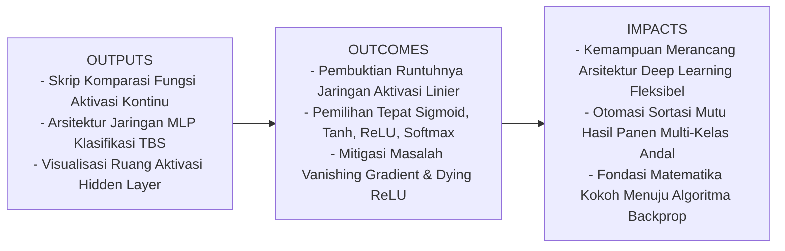
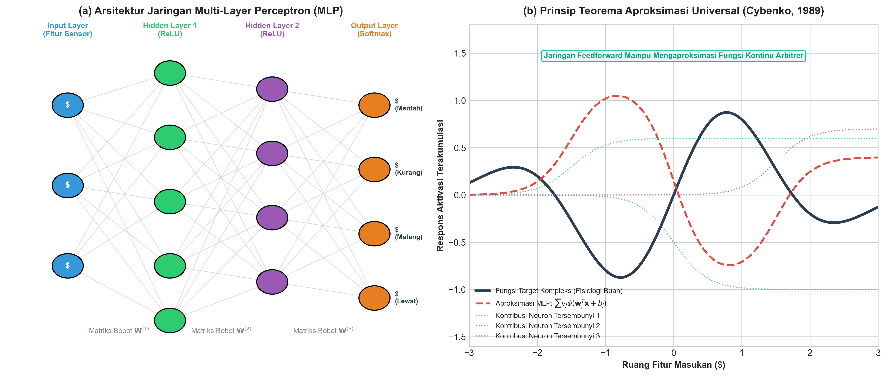
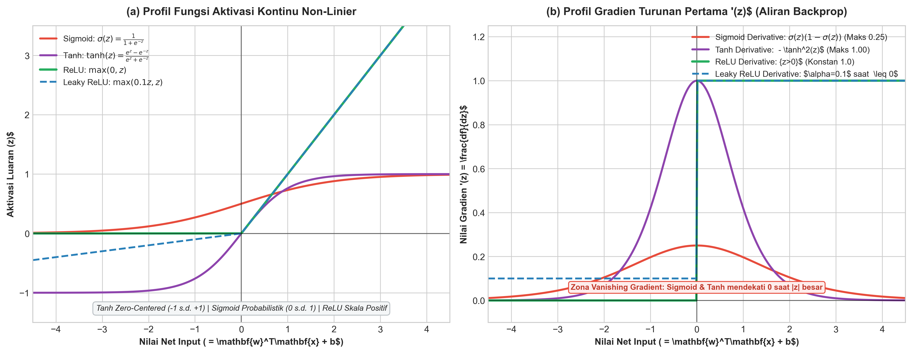

# AI Modul 9.4: Activation Function

---

## 1. Identitas & Kerangka Capaian Pembelajaran (Sub-CPMK)

* **Kode Modul**        : AI Modul 9.4
* **Mata Kuliah**       : Kecerdasan Buatan dan Sains Data Pertanian Presisi
* **Alokasi Waktu**     : 2 x 50 Menit (Kajian Teori & Diskusi) + 2 x 50 Menit (Eksplorasi Praktikum Mandiri)
* **Beban SKS**         : 3 SKS
* **Prasyarat**         : AI Modul 8.1 (Konsep Dasar Jaringan Saraf Tiruan & Perceptron)
* **Level Kognitif**    : C2 (Memahami), C3 (Menerapkan), C4 (Menganalisis)

### 1.1 Capaian Pembelajaran Khusus (Sub-CPMK)
Setelah menuntaskan modul ini, mahasiswa dan pembelajar diharapkan mampu:
1. **Menguraikan (C2)** urgensi matematika penambahan fungsi aktivasi non-linier dan membuktikan secara aljabar bahwa tumpukan lapisan linier murni akan runtuh menjadi satu transformasi matriks tunggal.
2. **Menerapkan (C3)** fungsi aktivasi Sigmoid, Tanh, ReLU, Leaky ReLU, dan Softmax pada arsitektur *Multi-Layer Perceptron* (MLP) untuk memecahkan kasus klasifikasi multi-kelas mutu tandan buah segar (TBS) kelapa sawit.
3. **Menganalisis (C4)** dinamika gradien turunan pertama masing-masing fungsi aktivasi, mengevaluasi fenomena *vanishing gradient* dan *dying ReLU*, serta mengartikulasikan implikasi Teorema Aproksimasi Universal Cybenko (1989) dalam pemodelan agro-industri.

### 1.2 Kerangka Hasil Pembelajaran (Outputs, Outcomes, & Impacts)
* **Outputs (Keluaran Berwujud Langsung)**:
  * Berkas kode program Python mandiri yang membandingkan kurva nilai dan kurva turunan gradien fungsi aktivasi (Sigmoid, Tanh, ReLU, Leaky ReLU, ELU).
  * Arsitektur model *Multi-Layer Perceptron* (MLP) dengan lapisan tersembunyi ganda dan fungsi luaran Softmax untuk membedakan 4 kelas kematangan TBS sawit.
  * Grafik visualisasi transformasi manifold non-linier pada ruang representasi lapisan tersembunyi (*latent feature space*).
* **Outcomes (Hasil Capaian & Perubahan Kompetensi)**:
  * Mahasiswa mampu menentukan fungsi aktivasi mana yang paling tepat untuk lapisan tersembunyi (*hidden layer*) vs lapisan luaran (*output layer*) berdasarkan karakteristik data.
  * Mahasiswa terampil mendiagnosis kegagalan pelatihan akibat matinya neuron ReLU (*Dying ReLU*) dan memilih alternatif seperti Leaky ReLU.
  * Mahasiswa memahami secara intuitif dan analitik mengapa jaringan saraf dalam mampu memodelkan relasi agronomis yang sangat berliku.
* **Impacts (Dampak Jangka Panjang & Nilai Guna Luas)**:
  * Penguasaan fondasi arsitektural yang menjadi basis dari seluruh model mutakhir penglihatan komputer (CNN) dan pemrosesan bahasa alami (Transformer).
  * Terlahirnya lulusan yang mampu memodernisasi pabrik kelapa sawit (PKS) melalui sistem sortasi optik otomatis cerdas berkategori multi-kelas.

---

## 2. Profil Fundamental Arsitektur: Fungsi, Manfaat, dan Keunggulan-Kelemahan

### 2.1 Fungsi Komputasi & Pemodelan Matematis
*Multi-Layer Perceptron* (MLP) berfungsi sebagai **pengaproksimasi fungsi non-linier universal (*universal non-linear function approximator*)**. MLP memperluas Perceptron tunggal dengan menyisipkan satu atau lebih **lapisan tersembunyi (*hidden layers*)** di antara lapisan masukan dan lapisan luaran.

Secara matematis, transformasi pada lapisan tersembunyi ke-$l$ didefinisikan sebagai:

$$\mathbf{z}^{(l)} = \mathbf{W}^{(l)} \mathbf{a}^{(l-1)} + \mathbf{b}^{(l)}$$
$$\mathbf{a}^{(l)} = \sigma\left(\mathbf{z}^{(l)}\right)$$

di mana $\mathbf{a}^{(0)} = \mathbf{x}$ adalah vektor masukan, $\mathbf{W}^{(l)}$ adalah matriks bobot sinaptik, $\mathbf{b}^{(l)}$ adalah vektor bias, dan $\sigma(\cdot)$ adalah fungsi aktivasi non-linier yang beroperasi secara elemen-demi-elemen (*element-wise*).

#### Panduan Pelafalan dan Cara Membaca Notasi Matematika
* $\mathbf{z}^{(l)} = \mathbf{W}^{(l)} \mathbf{a}^{(l-1)} + \mathbf{b}^{(l)}$: Dibaca *"vektor net input z pada lapisan ke-l sama dengan perkalian matriks bobot W lapisan ke-l dengan vektor aktivasi a lapisan sebelumnya l-minus-satu, ditambah vektor bias b lapisan ke-l"*.
* $\mathbf{a}^{(l)} = \sigma(\mathbf{z}^{(l)})$: Dibaca *"vektor aktivasi a pada lapisan ke-l sama dengan fungsi aktivasi non-linier sigma dari vektor net input z lapisan ke-l"*.

#### Definisi Simbol dan Variabel
* $\mathbf{x} \in \mathbb{R}^{m}$: Vektor fitur masukan pengamatan berskala $m$.
* $\mathbf{W}^{(l)} \in \mathbb{R}^{n_l \times n_{l-1}}$: Matriks bobot pada lapisan ke-$l$, berdimensi jumlah neuron saat ini dikali jumlah neuron lapisan sebelumnya.
* $\mathbf{b}^{(l)} \in \mathbb{R}^{n_l}$: Vektor bias pada lapisan ke-$l$.
* $\mathbf{z}^{(l)}$: Vektor akumulasi penjumlahan terbobot (*pre-activation*).
* $\mathbf{a}^{(l)}$: Vektor luaran teraktivasi (*post-activation*).
* $\sigma(\cdot)$: Operator fungsi aktivasi non-linier.

### 2.2 Manfaat Nyata di Industri Perkebunan & Agribisnis
1. **Sortasi Otomatis Kematangan Tandan Buah Segar (TBS)**: Mengklasifikasikan buah sawit ke dalam 4 fraksi kematangan (Mentah, Kurang Matang, Matang Sempurna, Lewat Matang) berdasarkan fitur optik spektral (RGB, NIR, dan rasio karotenoid) untuk menjamin rendemen CPO optimal di atas $23\%$.
2. **Estimasi Kebutuhan Pupuk Presisi Non-Linier**: Memodelkan interaksi multi-variat yang sangat rumit antara hara makro tanah (N, P, K, Mg), curah hujan historis, dan tekstur tanah lempung terhadap kebutuhan dosis urea dan kalium per blok kebun.
3. **Deteksi Serangan Hama Terintegrasi**: Menggabungkan data getaran akustik sensor batang dan data suhu kanopi drone untuk mendeteksi stadium larva kumbang tanduk secara multi-kelas.

### 2.3 Rationale: Alasan Mengapa Arsitektur Ini Digunakan
* **Mengatasi Hambatan Linear Separability**: MLP dengan aktivasi non-linier mampu membentuk batas keputusan yang melengkung, melingkar, atau terputus-putus, memecahkan masalah gerbang XOR dan data riil perkebunan yang heterogen.
* **Teorema Aproksimasi Universal**: Menjamin secara matematis bahwa jaringan saraf dua lapis mampu memodelkan fenomena biologis tanaman serumit apa pun asalkan jumlah neuron tersembunyi mencukupi.
* **Pembelajaran Representasi Hierarkis**: Lapisan-lapisan tersembunyi secara otomatis mengekstraksi kombinasi fitur-fitur baru yang lebih abstrak tanpa perlu dilakukan perancangan fitur manual oleh manusia (*feature engineering*).

### 2.4 Analisis Kelebihan dan Kekurangan (Tabel Komparasi)

| Parameter Evaluasi | Keunggulan Multi-Layer Perceptron | Kelemahan Multi-Layer Perceptron |
|:---|:---|:---|
| **Kapasitas Pemodelan** | Mampu memodelkan fungsi matematika kontinu sembarang (Universal Approximator). | Membutuhkan data latih yang relatif besar agar tidak mengalami *overfitting*. |
| **Bentuk Batas Keputusan** | Bebas dan non-linier fleksibel; mampu memisahkan klaster multi-kelas yang rumit. | Lanskap fungsi rugi bersifat non-konveks, rentan konvergen ke optimum lokal (*local minima*). |
| **Interpretabilitas** | Menyediakan representasi tersembunyi kontinu pada ruang laten (*latent space*). | Bersifat kotak hitam (*black-box*); sulit menelusuri bobot individual secara kausal agronomi. |
| **Waktu Pelatihan** | Sangat efisien dilatih pada GPU melalui operasi perkalian matriks masif. | Lebih lambat dibandingkan model linier klasik; sensitif terhadap inisialisasi bobot dan laju belajar. |

### 2.5 Contoh Kasus Penggunaan Konkret di Sektor Agro-Industri
**Sistem Sortasi Optik Otomatis TBS di Loading Ramp Pabrik Kelapa Sawit (PKS)**:
* **Lapisan Masukan (Input)**: 6 fitur optik kamera (Rata-rata Red, Green, Blue, Indeks Kemerahan $R/(R+G+B)$, Tekstur Kontras GLCM, dan Luas Permukaan Brondolan).
* **Lapisan Tersembunyi 1**: 16 neuron dengan fungsi aktivasi ReLU untuk mengekstraksi kombinasi warna dasar.
* **Lapisan Tersembunyi 2**: 8 neuron dengan fungsi aktivasi ReLU untuk menyusun representasi kematangan buah.
* **Lapisan Luaran (Output)**: 4 neuron dengan fungsi aktivasi Softmax yang mengeluarkan probabilitas:
  $$[\hat{y}_{\text{Mentah}}, \hat{y}_{\text{Kurang}}, \hat{y}_{\text{Matang}}, \hat{y}_{\text{Lewat}}]$$
Sistem ini mampu mengarahkan lengan pemilah hidrolik secara real-time pada kecepatan konveyor 2 meter per detik.

### 2.6 Aspek Kritis & Catatan Penting Arsitektur (*Key Critical Insights*)
> [!IMPORTANT]
> **Mengapa Jaringan Saraf Butuh ReLU dibanding Sigmoid pada Lapisan Tersembunyi?**
> Pada jaringan multi-lapis, fungsi Sigmoid memiliki turunan maksimum hanya $0.25$. Saat menghitung gradien mundur melewati 4 lapisan menggunakan aturan rantai, faktor turunan dikalikan: $(0.25)^4 \approx 0.0039$. Hal ini menyebabkan gradien lenyap (*vanishing gradient*), sehingga lapisan-lapisan awal berhenti belajar. Fungsi **ReLU (*Rectified Linear Unit*)** merevolusi Deep Learning modern karena memiliki gradien konstan $1.0$ untuk semua nilai positif ($z > 0$), memungkinkan pelatihan jaringan ratusan lapis tanpa hambatan pelemahan gradien.

---

## 3. Mengapa Non-Linieritas Diperlukan? (Pembuktian Runtuhnya Jaringan Linier)

Banyak pemula bertanya: *"Mengapa kita tidak menggunakan fungsi aktivasi linier sederhana $f(z) = c \cdot z$ di setiap neuron?"*
Mari kita buktikan secara aljabar bahwa jaringan multi-lapis dengan aktivasi linier adalah ilusi komputasi.

Misalkan kita memiliki jaringan saraf feedforward dengan 2 lapisan tersembunyi dan fungsi aktivasi linier identitas $f(z) = z$:
* Lapisan 1: $\mathbf{a}^{(1)} = \mathbf{W}^{(1)} \mathbf{x} + \mathbf{b}^{(1)}$
* Lapisan 2: $\mathbf{a}^{(2)} = \mathbf{W}^{(2)} \mathbf{a}^{(1)} + \mathbf{b}^{(2)}$
* Lapisan Luaran: $\hat{\mathbf{y}} = \mathbf{W}^{(3)} \mathbf{a}^{(2)} + \mathbf{b}^{(3)}$

Substitusikan Lapisan 1 ke Lapisan 2:
$$\mathbf{a}^{(2)} = \mathbf{W}^{(2)} \left(\mathbf{W}^{(1)} \mathbf{x} + \mathbf{b}^{(1)}\right) + \mathbf{b}^{(2)} = \mathbf{W}^{(2)} \mathbf{W}^{(1)} \mathbf{x} + \mathbf{W}^{(2)} \mathbf{b}^{(1)} + \mathbf{b}^{(2)}$$

Substitusikan $\mathbf{a}^{(2)}$ ke Lapisan Luaran:
$$\hat{\mathbf{y}} = \mathbf{W}^{(3)} \left(\mathbf{W}^{(2)} \mathbf{W}^{(1)} \mathbf{x} + \mathbf{W}^{(2)} \mathbf{b}^{(1)} + \mathbf{b}^{(2)}\right) + \mathbf{b}^{(3)}$$
$$\hat{\mathbf{y}} = \left(\mathbf{W}^{(3)} \mathbf{W}^{(2)} \mathbf{W}^{(1)}\right) \mathbf{x} + \left(\mathbf{W}^{(3)} \mathbf{W}^{(2)} \mathbf{b}^{(1)} + \mathbf{W}^{(3)} \mathbf{b}^{(2)} + \mathbf{b}^{(3)}\right)$$

Perhatikan bentuk akhir di atas:
* Hasil perkalian tiga matriks $\mathbf{W}' = \mathbf{W}^{(3)} \mathbf{W}^{(2)} \mathbf{W}^{(1)}$ hanyalah **sebuah matriks linier tunggal baru** berukuran sama.
* Penjumlahan suku-suku bias $\mathbf{b}' = \mathbf{W}^{(3)} \mathbf{W}^{(2)} \mathbf{b}^{(1)} + \mathbf{W}^{(3)} \mathbf{b}^{(2)} + \mathbf{b}^{(3)}$ hanyalah **sebuah vektor bias linier tunggal baru**.

Maka persamaan keseluruhan menyusut menjadi:
$$\hat{\mathbf{y}} = \mathbf{W}' \mathbf{x} + \mathbf{b}'$$

*Kesimpulan Ilmiah*: Sebanyak apa pun lapisan tersembunyi yang ditumpuk (bahkan jika ada 1.000 lapisan), jika aktivasinya linier, jaringan tersebut secara matematis **runtuh (*collapses*) menjadi model regresi linier satu lapis biasa**. Kehadiran fungsi aktivasi non-linier adalah syarat mutlak yang memungkinkan jaringan saraf melipat dan membengkokkan ruang geometris fitur.

---

## 4. Komparasi Fungsi Aktivasi Kontinu Modern

Setiap fungsi aktivasi memiliki profil matematika dan karakteristik gradien yang unik:

### 4.1 Fungsi Sigmoid (Logistik)
Fungsi Sigmoid memetakan bilangan riil ke interval probabilitas $(0, 1)$:

$$\sigma(z) = \frac{1}{1 + e^{-z}}$$

Turunan analitiknya sangat efisien karena dapat dinyatakan dalam nilai fungsinya sendiri:

$$\frac{d\sigma(z)}{dz} = \sigma(z)(1 - \sigma(z))$$

#### Panduan Pelafalan dan Cara Membaca Notasi Matematika
* $\sigma(z) = \frac{1}{1 + e^{-z}}$: Dibaca *"sigma dari z sama dengan satu dibagi satu ditambah e pangkat minus z"*.
* $\frac{d\sigma(z)}{dz} = \sigma(z)(1 - \sigma(z))$: Dibaca *"turunan pertama fungsi sigma terhadap z sama dengan nilai sigma z dikalikan satu minus sigma z"*.

*Karakteristik & Limitasi*:
* Nilai turunan maksimum adalah $0.25$ saat $z = 0$.
* Ketika $|z| > 4$, nilai $\sigma(z)$ mendekati $0$ atau $1$, sehingga turunannya mendekati nol mutlak. Hal ini memicu **Vanishing Gradient Problem** di mana sinyal galat hilang saat merambat mundur ke lapisan awal.
* Sigmoid saat ini hanya digunakan pada **lapisan luaran untuk klasifikasi biner**.

### 4.2 Fungsi Tangen Hiperbolik (Tanh)
Fungsi Tanh memetakan bilangan riil ke interval simetris $(-1, +1)$:

$$\tanh(z) = \frac{e^z - e^{-z}}{e^z + e^{-z}}$$

Turunan analitiknya:

$$\frac{d\tanh(z)}{dz} = 1 - \tanh^2(z)$$

#### Panduan Pelafalan dan Cara Membaca Notasi Matematika
* $\frac{d\tanh(z)}{dz} = 1 - \tanh^2(z)$: Dibaca *"turunan fungsi tangen hiperbolik z sama dengan satu dikurangi nilai kuadrat tangen hiperbolik z"*.

*Karakteristik*:
* Bersifat **berpusat di nol (*zero-centered*)** dengan rata-rata luaran mendekati nol, membuat pembaruan bobot pada lapisan berikutnya tidak mengalami bias zig-zag.
* Turunan maksimumnya adalah $1.00$ pada $z = 0$. Namun, tetap mengalami *vanishing gradient* pada nilai $|z|$ ekstrem.

### 4.3 Fungsi Rectified Linear Unit (ReLU)
Diusulkan oleh Nair & Hinton (2010), ReLU adalah fungsi aktivasi standar *default* untuk lapisan tersembunyi pada arsitektur Deep Learning modern:

$$f(z) = \max(0, z) = \begin{cases} z, & \text{jika } z > 0 \\ 0, & \text{jika } z \leq 0 \end{cases}$$

Turunan pertamanya:

$$f'(z) = \begin{cases} 1, & \text{jika } z > 0 \\ 0, & \text{jika } z \leq 0 \end{cases}$$

#### Panduan Pelafalan dan Cara Membaca Notasi Matematika
* $f(z) = \max(0, z)$: Dibaca *"f dari z sama dengan nilai maksimum antara nol dan z"*.
* $f'(z) = 1$ jika $z > 0$: Dibaca *"turunan f terhadap z bernilai satu konstan jika z lebih besar dari nol, dan nol jika sebaliknya"*.

*Keunggulan Revolusioner*:
* **Bebas Vanishing Gradient pada Sisi Positif**: Nilai gradien konstan $1.0$ memastikan aliran gradien tidak menyusut saat melewati puluhan lapisan tersembunyi.
* **Komputasi Sangat Ringan**: Hanya melibatkan operasi perbandingan ambang batas (`z > 0`), ribuan kali lebih cepat daripada komputasi eksponensial $e^z$.
* **Sparsitas Representasi (*Sparsity*)**: Neuron dengan $z \leq 0$ menghasilkan aktivasi $0$, menciptakan representasi representasional yang padat dan efisien.

*Kelemahan: Masalah Dying ReLU*:
Jika suatu neuron menerima pembaruan gradien yang terlalu besar sehingga biasnya menjadi sangat negatif, neuron tersebut akan selalu menghasilkan $z \leq 0$ untuk seluruh sampel data. Akibatnya, gradiennya selamanya bernilai $0$ dan neuron tersebut mati permanen (*never updates again*).

### 4.4 Fungsi Leaky ReLU & Parametric ReLU (PReLU)
Untuk memitigasi fenomena *Dying ReLU*, Maas et al. (2013) menambahkan kemiringan kecil (*leak*) pada domain negatif:

$$f(z) = \begin{cases} z, & \text{jika } z > 0 \\ \alpha z, & \text{jika } z \leq 0 \end{cases}$$

di mana $\alpha$ adalah hiperparameter bernilai kecil (biasanya $\alpha = 0.01$).
Turunan pertamanya:

$$f'(z) = \begin{cases} 1, & \text{jika } z > 0 \\ \alpha, & \text{jika } z \leq 0 \end{cases}$$

*Manfaat*: Gradien $\alpha = 0.01$ memastikan bahwa neuron yang berada di domain negatif tetap menerima sedikit sinyal pembaruan gradien, mencegah neuron mati secara permanen.

### 4.5 Fungsi Softmax (Lapisan Luaran Multi-Kelas)
Fungsi Softmax digunakan secara eksklusif pada **lapisan luaran (*output layer*)** untuk masalah klasifikasi multi-kelas dengan $K$ kategori saling lepas (*mutually exclusive*):

$$P(y = k \mid \mathbf{z}) = \text{Softmax}(z_k) = \frac{e^{z_k}}{\sum_{j=1}^{K} e^{z_j}}, \quad \text{untuk } k = 1, 2, \dots, K$$

#### Panduan Pelafalan dan Cara Membaca Notasi Matematika
* $\frac{e^{z_k}}{\sum_{j=1}^{K} e^{z_j}}$: Dibaca *"e pangkat z-k dibagi dengan jumlahan e pangkat z-j untuk j dari satu sampai K"*.

*Sifat Probabilistik*:
1. Setiap luaran bernilai positif dan berada pada rentang $[0, 1]$.
2. Jumlah total seluruh nilai luaran tepat sama dengan satu: $\sum_{k=1}^{K} \text{Softmax}(z_k) = 1.0$.

---

## 5. Teorema Aproksimasi Universal (Universal Approximation Theorem)

Salah satu tonggak teoretis terpenting dalam sains komputer modern adalah **Teorema Aproksimasi Universal** yang dibuktikan oleh George Cybenko (1989) untuk fungsi aktivasi sigmoid, dan digeneralisasi oleh Kurt Hornik (1991) untuk fungsi aktivasi non-linier sembarang:

> **Teorema (Cybenko, 1989; Hornik, 1991)**:
> Misalkan $\sigma(\cdot)$ adalah sembarang fungsi aktivasi kontinu non-konstan, terbatas, dan non-linier. Diberikan sembarang fungsi kontinu $f: K \to \mathbb{R}$ yang didefinisikan pada himpunan bagian kompak $K \subset \mathbb{R}^m$, dan sembarang toleransi presisi $\epsilon > 0$, maka terdapat bilangan bulat positif $N$ (jumlah neuron tersembunyi), matriks bobot $\mathbf{W}$, vektor bias $\mathbf{b}$, dan vektor bobot luaran $\mathbf{v}$ sedemikian sehingga:
> 
> $$|F(\mathbf{x}) - f(\mathbf{x})| < \epsilon, \quad \forall \mathbf{x} \in K$$
> 
> di mana fungsi jaringan saraf didefinisikan sebagai:
> 
> $$F(\mathbf{x}) = \sum_{j=1}^{N} v_j \sigma\left(\mathbf{w}_j^T \mathbf{x} + b_j\right)$$

#### Panduan Pelafalan dan Cara Membaca Notasi Matematika
* $|F(\mathbf{x}) - f(\mathbf{x})| < \epsilon$: Dibaca *"selisih mutlak antara fungsi jaringan F dari vektor x dengan fungsi sejati f dari vektor x kurang dari epsilon untuk setiap x anggota himpunan kompak K"*.

#### Makna dan Implikasi Praktis di Industri Perkebunan:
1. **Jaminan Kapasitas Pemodelan**: Teorema ini membuktikan bahwa kita tidak perlu mencari paradigma komputasi baru di luar jaringan saraf untuk memodelkan proses biologi tanaman sawit. Jaringan saraf dengan satu lapisan tersembunyi yang cukup lebar sudah mampu mereplikasi hubungan biologis apa pun dengan ketelitian setinggi yang diinginkan.
2. **Kelemahan Teorema**: Teorema ini menyatakan *keberadaan* (*existence*), namun tidak memberi petunjuk mengenai *bagaimana cara menemukan bobot tersebut* dan berapa jumlah neuron $N$ yang dibutuhkan. Dalam praktiknya, jaringan dangkal yang sangat lebar membutuhkan neuron tak berhingga, sehingga paradigma modern lebih memilih **jaringan yang dalam (*Deep Networks* dengan banyak lapisan)** yang jauh lebih efisien dalam memodelkan abstraksi hierarkis.

---

## 6. Studi Kasus Agro-Industri: Klasifikasi Mutu Kematangan TBS Sawit

### 6.1 Spesifikasi Masalah dan Data Spektral
Pabrik Kelapa Sawit (PKS) mengelompokkan tandan buah segar (TBS) ke dalam 4 fraksi:
* **Kelas 0: Mentah (*Unripe*)**: Kandungan minyak sangat rendah ($<12\%$), warna dominan hitam keunguan, rasio reflektansi merah rendah.
* **Kelas 1: Kurang Matang (*Underripe*)**: Buah mulai kemerahan, brondolan belum lepas, rendemen $\approx 16\%$.
* **Kelas 2: Matang Sempurna (*Ripe*)**: Warna jingga kemerahan mengkilap, 10–20 brondolan lepas alami, rendemen minyak optimal ($>22\%$), kadar asam lemak bebas (FFA) rendah ($<2.0\%$).
* **Kelas 3: Lewat Matang (*Overripe*)**: Buah rontok masif, warna merah gelap kehitaman, FFA melonjak tinggi ($>5.0\%$).

Sensor optik konveyor menangkap 4 fitur:
1. $x_1$: Indeks Kemerahan Kanopi ($R / (R+G+B)$).
2. $x_2$: Rasio Penyerapan Spektrum Biru ($B / G$).
3. $x_3$: Indeks Kilap Spekular (*Specular Gloss Ratio*).
4. $x_4$: Kepadatan Brondolan Terlepas per Luas Tandan.

### 6.2 Arsitektur Multi-Layer Perceptron yang Dirancang
* **Input Layer**: 4 Neuron ($x_1, x_2, x_3, x_4$)
* **Hidden Layer 1**: 8 Neuron dengan fungsi aktivasi **ReLU**
* **Hidden Layer 2**: 6 Neuron dengan fungsi aktivasi **ReLU**
* **Output Layer**: 4 Neuron dengan fungsi aktivasi **Softmax**

---

## 7. Kekeliruan Metodologis, Bias Data, dan Praktik Terbaik di Industri

### 7.1 Kekeliruan Umum Metodologis (*Common Pitfalls*)
1. **Menggunakan Fungsi Sigmoid pada Seluruh Lapisan Tersembunyi Jaringan Dalam**: Menggunakan Sigmoid pada jaringan dengan lebih dari 4 lapisan tersembunyi akan memicu *vanishing gradient*. Lapisan paling depan tidak akan pernah terbarukan secara efektif. Gunakan selalu **ReLU** atau **Leaky ReLU** pada *hidden layers*.
2. **Menggabungkan Fungsi Sigmoid dengan Loss Mean Squared Error (MSE) untuk Klasifikasi**: Memadukan aktivasi Sigmoid/Softmax dengan fungsi rugi MSE menghasilkan kurva permukaan optimasi yang sangat landai pada nilai galat besar, memperlambat pelatihan. Pasangkan selalu **Softmax dengan Categorical Cross-Entropy**.
3. **Mengabaikan Normalisasi Masukan**: Masukan dengan rentang skala yang berbeda-beda menyebabkan elips fungsi rugi menjadi sangat curam di satu sumbu. Terapkan selalu `StandardScaler` atau min-max scaling $[0, 1]$ sebelum data dialirkan ke MLP.

### 7.2 Praktik Terbaik (*Best Practices*)
* **Gunakan Inisialisasi He/Kaiming untuk ReLU**: Inisialisasi bobot acak dengan varians $\text{Var}(W) = \frac{2}{n_{\text{in}}}$ (*He Normal Initialization*) menjaga varians aktivasi dan gradien tetap stabil di setiap lapisan ReLU.
* **Terapkan Leaky ReLU Jika Mengalami Dying ReLU**: Jika saat pemantauan ditemukan banyak neuron menghasilkan aktivasi nol permanen, gantilah fungsi ReLU dengan Leaky ReLU ($\alpha = 0.01$).
* **Validasi Jumlah Parameter Terhadap Ukuran Dataset**: Pastikan jumlah sampel data latih minimal 10 hingga 50 kali lipat lebih besar dibandingkan total parameter bobot dan bias dalam jaringan untuk mencegah penghafalan data (*overfitting*).

---

## 8. Tugas Terbimbing & Soal Uji Kompetensi Berstandar HOTS (Bloom C3 & C4)

1. **Perhitungan Manual Propagasi Maju Lapisan Tersembunyi & Output Softmax (C3)**:
   Diberikan satu sampel data TBS sawit dengan dua fitur ternormalisasi: $\mathbf{x} = [0.8, 0.4]^T$.
   Jaringan memiliki 1 lapisan tersembunyi dengan 2 neuron (aktivasi ReLU) dan lapisan luaran dengan 2 neuron (aktivasi Softmax):
   * Matriks bobot lapisan tersembunyi:
     $$\mathbf{W}^{(1)} = \begin{pmatrix} 1.5 & -0.5 \\ -2.0 & 1.0 \end{pmatrix}, \quad \mathbf{b}^{(1)} = \begin{pmatrix} -0.2 \\ 0.5 \end{pmatrix}$$
   * Matriks bobot lapisan luaran:
     $$\mathbf{W}^{(2)} = \begin{pmatrix} 2.0 & -1.0 \\ -1.0 & 2.0 \end{pmatrix}, \quad \mathbf{b}^{(2)} = \begin{pmatrix} 0.0 \\ 0.1 \end{pmatrix}$$
   * Hitung vektor net input $\mathbf{z}^{(1)}$ dan vektor aktivasi $\mathbf{a}^{(1)}$ pada lapisan tersembunyi!
   * Hitung vektor net input luaran $\mathbf{z}^{(2)}$!
   * Hitung vektor probabilitas akhir luaran Softmax $\hat{\mathbf{y}} = [\hat{y}_1, \hat{y}_2]^T$, serta tentukan kelas prediksi akhirnya!

2. **Analisis Matematis Fenomena Vanishing Gradient pada Fungsi Sigmoid (C4)**:
   Sebuah jaringan saraf tiruan feedforward memiliki 5 lapisan tersembunyi berurutan yang semuanya menggunakan fungsi aktivasi Sigmoid $\sigma(z)$.
   * Buktikan secara analitik bahwa nilai maksimum dari turunan fungsi Sigmoid $\sigma'(z) = \sigma(z)(1 - \sigma(z))$ adalah tepat $0.25$ dan terjadi saat $z = 0$!
   * Dengan menggunakan aturan rantai (*chain rule*), jika setiap lapisan memiliki bobot rata-rata $\|W\| \approx 1.0$, hitung estimasi batas atas pengali gradien yang merambat mundur dari lapisan luaran hingga ke lapisan tersembunyi pertama!
   * Jelaskan secara terperinci mengapa fenomena ini melumpuhkan proses pembelajaran pada lapisan-lapisan awal, dan mengapa penggunaan fungsi ReLU mampu meniadakan masalah ini secara tuntas!

3. **Bedah Kritis Teorema Cybenko vs Arsitektur Deep Learning Modern (C4)**:
   Teorema Aproksimasi Universal membuktikan bahwa jaringan dengan **satu lapisan tersembunyi tunggal** sudah cukup untuk mengaproksimasi fungsi kontinu arbitrer.
   * Jika satu lapisan tersembunyi sudah cukup secara teoretis, analisislah mengapa seluruh industri AI modern (seperti model deteksi buah sawit YOLO dan arsitektur ResNet) memilih menggunakan **puluhan hingga ratusan lapisan bertingkat (*Deep Networks*)** daripada satu lapisan yang sangat lebar!
   * Jelaskan konsep *hierarchical feature abstraction* (abstraksi fitur bertingkat) dari sudut pandang pemrosesan citra daun perkebunan (piksel $\to$ tepi garis $\to$ tekstur urat daun $\to$ pola bercak klorosis)!

---

## 9. Jembatan Konsep (Bridging) ke AI Modul 9.5: Loss Function

Di modul ini, kita telah menguasai dua pilar utama Deep Learning:
1. **Fungsi Aktivasi Non-Linier**: Sigmoid, Tanh, ReLU, Leaky ReLU, dan Softmax yang memberikan kemampuan melipat ruang fitur geometris.
2. **Arsitektur Multi-Layer Perceptron (MLP)**: Menghubungkan lapisan masukan, lapisan tersembunyi berbobot, dan lapisan luaran probabilistik.

Namun, jaringan saraf yang baru dirancang masih merupakan "bayi yang buta": bobot-bobotnya masih berupa angka acak dan prediksinya masih kacau. Untuk mendidik jaringan ini agar menjadi cerdas, kita memerlukan dua komponen esensial berikutnya:
1. **Algoritma Perambatan Maju (*Forward Propagation*)**: Bagaimana aliran komputasi tensorial mengalirkan data dari sensor masukan melalui puluhan lapisan secara terstruktur menggunakan aljabar matriks batch berkecepatan tinggi.
2. **Fungsi Rugi Matematis (*Loss Functions*)**: Bagaimana kita mengukur "tingkat kesalahan atau penderitaan" model secara presisi:
   * **Mean Squared Error (MSE)** untuk regresi hasil panen TBS.
   * **Binary Cross-Entropy (Log-Loss)** untuk klasifikasi biner penyakit tanaman.
   * **Categorical Cross-Entropy** untuk klasifikasi multi-kelas mutu buah pada fungsi Softmax.

Pada **AI Modul 8.3: Algoritma Forward Propagation & Loss Functions**, kita akan membedah formulasi matriks propagasi maju secara komprehensif serta menurunkan fungsi rugi *cross-entropy* yang menjadi kompas penunjuk arah pelatihan jaringan saraf dalam!

---

## 10. Daftar Pustaka dan Referensi Akademik

1. Bishop, C. M. (2006). *Pattern Recognition and Machine Learning*. Springer. [Tersedia di koleksi src/]
2. Cybenko, G. (1989). Approximation by superpositions of a sigmoidal function. *Mathematics of Control, Signals and Systems*, 2(4), 303-314.
3. Géron, A. (2022). *Hands-On Machine Learning with Scikit-Learn, Keras, and TensorFlow* (3rd ed.). O'Reilly Media. [Tersedia di koleksi src/]
4. Glorot, X., & Bengio, Y. (2010). Understanding the difficulty of training deep feedforward neural networks. *Proceedings of the 13th International Conference on Artificial Intelligence and Statistics (AISTATS)*, 249-256.
5. Goodfellow, I., Bengio, Y., & Courville, A. (2016). *Deep Learning*. MIT Press. [Tersedia di koleksi src/]
6. He, K., Zhang, X., Ren, S., & Sun, J. (2015). Delving deep into rectifiers: Surpassing human-level performance on ImageNet classification. *Proceedings of the IEEE International Conference on Computer Vision*, 1026-1034.
7. Hornik, K. (1991). Approximation capabilities of multilayer feedforward networks. *Neural Networks*, 4(2), 251-257.
8. Maas, A. L., Hannun, A. Y., & Ng, A. Y. (2013). Rectifier nonlinearities improve neural network acoustic models. *Proc. ICML*, 30(1), 3.
9. Nair, V., & Hinton, G. E. (2010). Rectified linear units improve restricted boltzmann machines. *Proceedings of the 27th International Conference on Machine Learning (ICML-10)*, 807-814.
10. Russell, S., & Norvig, P. (2020). *Artificial Intelligence: A Modern Approach* (4th ed.). Pearson. [Tersedia di koleksi src/]
