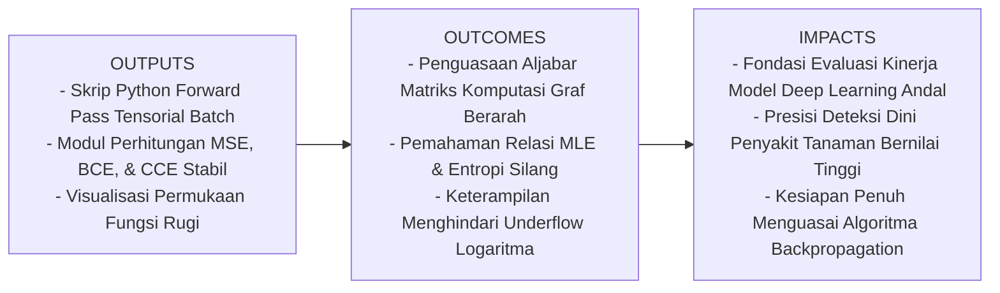
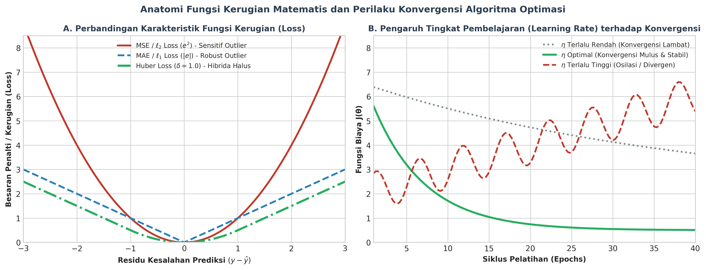
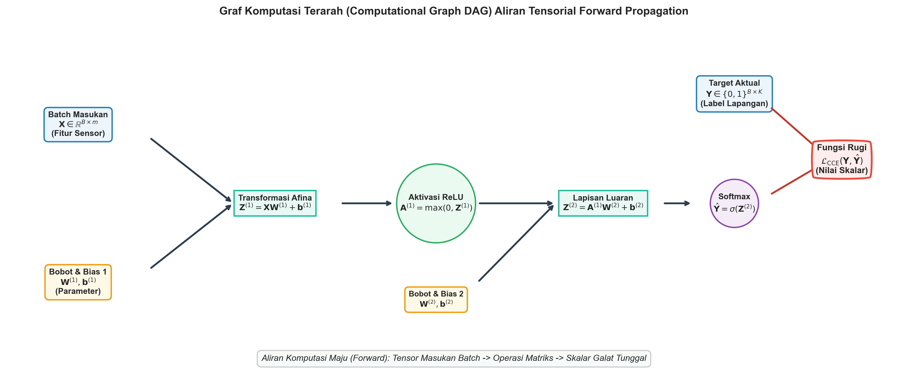
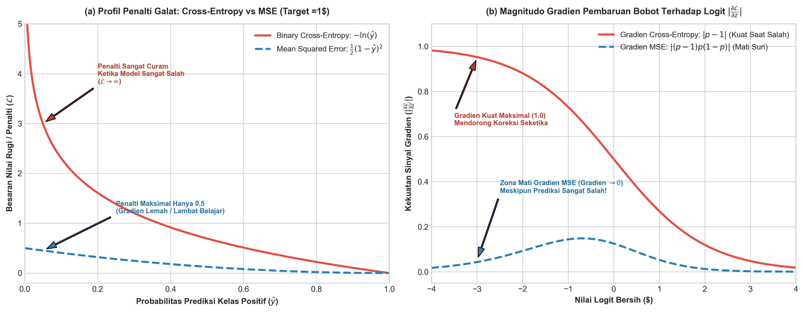

# AI Modul 9.5: Loss Function

---

## 1. Identitas & Kerangka Capaian Pembelajaran (Sub-CPMK)

* **Kode Modul**        : AI Modul 9.5
* **Mata Kuliah**       : Kecerdasan Buatan dan Sains Data Pertanian Presisi
* **Alokasi Waktu**     : 2 x 50 Menit (Kajian Teori & Diskusi) + 2 x 50 Menit (Eksplorasi Praktikum Mandiri)
* **Beban SKS**         : 3 SKS
* **Prasyarat**         : AI Modul 8.2 (Fungsi Aktivasi & Arsitektur MLP)
* **Level Kognitif**    : C2 (Memahami), C3 (Menerapkan), C4 (Menganalisis)

### 1.1 Capaian Pembelajaran Khusus (Sub-CPMK)
Setelah menuntaskan modul ini, mahasiswa dan pembelajar diharapkan mampu:
1. **Menguraikan (C2)** mekanisme perambatan maju (*Forward Propagation*) berbasis graf komputasi terarah (*Computational Graph DAG*) dan merumuskan operasi perkalian matriks batch pada setiap lapisan jaringan saraf.
2. **Menerapkan (C3)** fungsi rugi *Mean Squared Error* (MSE), *Binary Cross-Entropy* (BCE), dan *Categorical Cross-Entropy* (CCE) pada data sensorik perkebunan presisi dengan menerapkan stabilisasi numerik (*epsilon clipping* dan metode numerik *Log-Sum-Exp*).
3. **Menganalisis (C4)** landasan probabilitas *Maximum Likelihood Estimation* (MLE) dan divergensi Kullback-Leibler (KL) di balik fungsi *Cross-Entropy*, serta membuktikan secara analitik kelemahan fatal penggunaan MSE pada luaran Sigmoid/Softmax.

### 1.2 Kerangka Hasil Pembelajaran (Outputs, Outcomes, & Impacts)
* **Outputs (Keluaran Berwujud Langsung)**:
  * Modul kode program Python berorientasi objek yang mengeksekusi perambatan maju tensorial multi-lapis (*batch matrix operations*) tanpa ketergantungan kerangka kerja tingkat tinggi.
  * Fungsi komputasi kerugian numerik stabil yang kebal terhadap galat *floating point* ($\ln(0)$ atau *overflow* eksponensial).
  * Laporan evaluasi kuantitatif perbandingan nilai kerugian pada deteksi infeksi jamur kelapa sawit (*Ganoderma boninense*).
* **Outcomes (Hasil Capaian & Perubahan Kompetensi)**:
  * Mahasiswa terampil mentransformasikan arsitektur lapisan jaringan saraf ke dalam persamaan perkalian matriks batch $\mathbf{Z} = \mathbf{A}\mathbf{W} + \mathbf{b}$.
  * Mahasiswa memahami secara mendalam hubungan antara minimasi entropi silang dengan maksimasi kecenderungan data sejati (*likelihood*).
  * Mahasiswa mampu mendiagnosis dan memperbaiki fenomena *slow learning* akibat ketidakcocokan fungsi rugi dan fungsi aktivasi luaran.
* **Impacts (Dampak Jangka Panjang & Nilai Guna Luas)**:
  * Terbentuknya intuisi matematis yang kokoh dalam mengevaluasi apakah suatu model AI layak dideploy ke perkebunan skala komersial.
  * Mencegah kerugian finansial korporasi agro-industri akibat salah pasang penalti model pada sistem pemantauan kesehatan tanaman otomatis.

---

## 2. Profil Fundamental Algoritma: Fungsi, Manfaat, dan Keunggulan-Kelemahan

### 2.1 Fungsi Komputasi & Pemodelan Matematis
Algoritma **Forward Propagation** berfungsi memetakan sekumpulan fitur masukan batch $\mathbf{X} \in \mathbb{R}^{B \times m}$ melintasi serangkaian transformasi afina dan fungsi aktivasi non-linier hingga menghasilkan tensor prediksi luaran $\hat{\mathbf{Y}} \in \mathbb{R}^{B \times K}$.

Setelah tensor prediksi terbentuk, **Fungsi Rugi (*Loss Function*)** $\mathcal{L}(\mathbf{Y}, \hat{\mathbf{Y}})$ berfungsi sebagai **instrumen evaluasi objektif skalar tunggal** yang mengukur seberapa jauh estimasi model menyimpang dari label kenyataan di lapangan.

Secara formal, untuk batch berukuran $B$:

$$\text{Rugi Rata-Rata Batch } J(\mathbf{W}, \mathbf{b}) = \frac{1}{B} \sum_{i=1}^{B} \mathcal{L}\left(\mathbf{y}^{(i)}, \hat{\mathbf{y}}^{(i)}\right)$$

#### Panduan Pelafalan dan Cara Membaca Notasi Matematika
* $J(\mathbf{W}, \mathbf{b}) = \frac{1}{B} \sum_{i=1}^{B} \mathcal{L}\left(\mathbf{y}^{(i)}, \hat{\mathbf{y}}^{(i)}\right)$: Dibaca *"fungsi objektif J terhadap parameter W dan b sama dengan satu per B dikalikan jumlahan fungsi rugi L antara vektor target aktual y indeks i dengan vektor prediksi y-topi indeks i untuk i dari satu sampai B"*.
* $\mathcal{L}(\cdot)$: Dibaca *"skalar loss L"*, melambangkan besaran penalti atas galat model pada satu sampel data.

#### Definisi Simbol dan Variabel
* $B$: Ukuran batch (*batch size*), jumlah sampel data yang diproses serentak dalam satu langkah komputasi.
* $\mathbf{X}$: Matriks fitur masukan berdimensi $B \times m$.
* $\hat{\mathbf{Y}}$: Matriks prediksi luaran jaringan berdimensi $B \times K$.
* $\mathbf{Y}$: Matriks label target aktual lapangan berdimensi $B \times K$.
* $J(\mathbf{W}, \mathbf{b})$: Fungsi biaya keseluruhan (*cost function*) yang diminimalkan oleh algoritma optimasi.

### 2.2 Manfaat Nyata di Industri Perkebunan & Agribisnis
1. **Deteksi Dini Jamur Busuk Pangkal Batang (*Ganoderma boninense*)**: Fungsi *Binary Cross-Entropy* memberikan penalti sangat berat jika model memprediksi pohon sakit sebagai pohon sehat, mencegah keterlambatan karantina yang dapat menulari seluruh blok kebun.
2. **Kuantifikasi Deviasi Peramalan Panen TBS**: Fungsi *Mean Squared Error* (MSE) mengukur deviasi tonase panen harian terhadap realisasi timbangan pabrik, memungkinkan manajer logistik mengukur margin galat secara presisi dalam satuan tonase.
3. **Sortasi Kualitas Biji Kakao & Kopi**: *Categorical Cross-Entropy* memandu klasifikasi mutu biji kopi (Grade 1, Grade 2, Defek) secara probabilistik terkalibrasi untuk keperluan sertifikasi ekspor internasional.

### 2.3 Rationale: Alasan Mengapa Algoritma Ini Digunakan
* **Diferensiabilitas Global**: Seluruh rantai operasi dari masukan hingga fungsi rugi dirancang kontinu dan berdiferensial (*smoothly differentiable*), memungkinkan gradien galat mengalir mundur tanpa hambatan diskrit.
* **Koherensi Statistik MLE**: Fungsi *Cross-Entropy* diturunkan secara langsung dari prinsip *Maximum Likelihood Estimation* (MLE) pada distribusi probabilitas Bernoulli dan Multinomial, menjamin solusi parameter paling mungkin secara teori statistika.
* **Efisiensi Paralelisasi GPU**: Forward propagation disusun dalam bentuk perkalian matriks murni (BLAS level 3) yang memanfaatkan ribuan *core* kartu grafis secara serentak.

### 2.4 Analisis Kelebihan dan Kekurangan (Tabel Komparasi)

| Jenis Fungsi Rugi | Pasangan Aktivasi Luaran | Kasus Penggunaan Ideal | Keunggulan Utama | Kelemahan Kritis |
|:---|:---|:---|:---|:---|
| **Mean Squared Error (MSE)** | Linier / Tanpa Aktivasi | Regresi Kontinu (Prediksi Tonase Panen) | Penalti proporsional terhadap deviasi kuadratik; sensitif terhadap kesalahan besar. | Sangat sensitif terhadap pencilan (*outliers*); melumpuhkan gradien jika dipasangkan dengan Sigmoid. |
| **Binary Cross-Entropy (BCE)** | Sigmoid ($\sigma(z)$) | Klasifikasi Biner (Deteksi Ganoderma vs Sehat) | Gradien linier curam saat model sangat salah ($z \ll 0$); penalti tak berhingga. | Memerlukan proteksi numerik *epsilon clipping* guna menghindari $\ln(0) = -\infty$. |
| **Categorical Cross-Entropy (CCE)** | Softmax ($\text{Softmax}(\mathbf{z})$) | Klasifikasi Multi-Kelas Mutu TBS Sawit | Menghasilkan distribusi probabilitas terkalibrasi penuh yang jumlahnya tepat 1.0. | Rentan mengalami *overflow* eksponensial pada komputasi manual tanpa Metode Log-Sum-Exp. |

### 2.5 Contoh Kasus Penggunaan Konkret di Sektor Agro-Industri
**Sistem Pemantauan Otomatis Jamur Ganoderma Menggunakan Sensor Konduktivitas Elektrik Tanah & Reflektansi Multispektral**:
* **Input $\mathbf{x}$**: 5 parameter sensorik (Konduktivitas Elektrik Tanah, Kadar Air Kapasitas Lapang, Indeks NDRE, Suhu Batang Bawah, dan Emisi Senyawa VOC Terdeteksi).
* **Target $y$**: $1$ (Terinfeksi Ganoderma Stadium Awal), $0$ (Pohon Bebas Infeksi).
* **Fungsi Rugi**: *Binary Cross-Entropy* dengan pembobotan kelas (*Weighted BCE*) untuk mengatasi ketidakseimbangan kelas (karena pohon sakit biasanya hanya $2 - 5\%$ dari populasi kebun).

### 2.6 Aspek Kritis & Catatan Penting Algoritma (*Key Critical Insights*)
> [!IMPORTANT]
> **Bahaya Numerik Logaritma dan Solusi Log-Sum-Exp**:
> Dalam komputasi fungsi rugi Cross-Entropy, formula memuat suku $\ln(\hat{y}_i)$. Jika model memprediksi $\hat{y}_i = 0.0$ secara mutlak akibat saturasi float, komputasi $\ln(0)$ akan menghasilkan $-\infty$ atau `NaN` (*Not a Number*), merusak seluruh bobot jaringan seketika. Solusi standar industri adalah:
> 1. Melakukan pemotongan nilai (*clipping*): $\hat{y} \leftarrow \text{clip}(\hat{y}, \epsilon, 1 - \epsilon)$ dengan $\epsilon = 10^{-15}$.
> 2. Menggabungkan operasi Softmax dan Cross-Entropy secara langsung dalam bentuk **Log-Sum-Exp** analitik: $\ln\left(\frac{e^{z_k}}{\sum e^{z_j}}\right) = z_k - \ln\left(\sum_{j} e^{z_j}\right)$, meniadakan pembagian numerik rapuh.

---

## 3. Landasan Matematis Forward Propagation Tensorial

Pada skala produksi industri perkebunan, data tidak diproses satu demi satu sampel, melainkan dikelompokkan ke dalam sebuah kelompok terpadu yang disebut **Mini-Batch** (misal $B = 64$ atau $128$ baris pengamatan sekaligus).

### 3.1 Aljabar Matriks Mini-Batch Perambatan Maju
Diberikan matriks masukan batch $\mathbf{A}^{(0)} = \mathbf{X} \in \mathbb{R}^{B \times m}$.
Untuk setiap lapisan tersembunyi $l = 1, 2, \dots, L$:

$$\mathbf{Z}^{(l)} = \mathbf{A}^{(l-1)} \mathbf{W}^{(l)} + \mathbf{1}_B \mathbf{b}^{(l)T}$$
$$\mathbf{A}^{(l)} = \sigma\left(\mathbf{Z}^{(l)}\right)$$

#### Panduan Pelafalan dan Cara Membaca Notasi Matematika
* $\mathbf{Z}^{(l)} = \mathbf{A}^{(l-1)} \mathbf{W}^{(l)} + \mathbf{1}_B \mathbf{b}^{(l)T}$: Dibaca *"matriks net input Z lapisan l berdimensi B kali n-l sama dengan perkalian matriks aktivasi A lapisan l-minus-satu dengan matriks bobot W lapisan l, ditambah vektor satu pengali bias b transpose"*.

#### Dimensi Tensor Operasi:
* $\mathbf{A}^{(l-1)} \in \mathbb{R}^{B \times n_{l-1}}$
* $\mathbf{W}^{(l)} \in \mathbb{R}^{n_{l-1} \times n_l}$
* $\mathbf{b}^{(l)} \in \mathbb{R}^{n_l}$ (dibroadcast sepanjang baris $B$)
* $\mathbf{Z}^{(l)} \in \mathbb{R}^{B \times n_l}$
* $\mathbf{A}^{(l)} \in \mathbb{R}^{B \times n_l}$

### 3.2 Graf Komputasi Terarah (*Directed Acyclic Graph* / DAG)
Graf komputasi memecah algoritma menjadi simpul-simpul dasar:
1. **Simpul Variabel Input & Parameter**: $\mathbf{X}, \mathbf{W}, \mathbf{b}$
2. **Simpul Operasi Aljabar**: Perkalian matriks ($\times$), Penjumlahan bias ($+$), Transformasi non-linier ($\sigma$)
3. **Simpul Kerugian Akhir**: $\mathcal{L}$

Setiap simpul menyimpan nilai aktivasi majunya (*forward cache*) selama perambatan maju, karena nilai-nilai ini mutlak dibutuhkan kembali saat perambatan mundur (*backward pass*) untuk menghitung turunan parsial gradien.

---

## 4. Formulasi Tiga Fungsi Rugi Utama & Landasan Probabilitas

### 4.1 Mean Squared Error (MSE) untuk Kasus Regresi
Digunakan ketika target $y \in \mathbb{R}$ adalah nilai kontinu riil (seperti estimasi produksi tonase sawit per hektar):

$$\mathcal{L}_{\text{MSE}}(y, \hat{y}) = \frac{1}{2}(y - \hat{y})^2$$
$$J_{\text{MSE}} = \frac{1}{B} \sum_{i=1}^{B} \frac{1}{2}\left(y^{(i)} - \hat{y}^{(i)}\right)^2$$

Faktor $\frac{1}{2}$ sengaja disertakan untuk menyederhanakan turunan saat kalkulus diferensial: $\frac{\partial \mathcal{L}}{\partial \hat{y}} = -(y - \hat{y}) = (\hat{y} - y)$.

### 4.2 Binary Cross-Entropy (BCE) untuk Klasifikasi Dua Kelas
Berdasarkan asumsi distribusi probabilitas Bernoulli dengan parameter $p = \hat{y} = \sigma(z)$:

$$P(Y = y \mid \mathbf{x}) = \hat{y}^y (1 - \hat{y})^{1 - y}, \quad \text{untuk } y \in \{0, 1\}$$

Terapkan fungsi logaritma natural negatif pada *likelihood* satu sampel data:

$$\mathcal{L}_{\text{BCE}}(y, \hat{y}) = -\ln P(Y = y \mid \mathbf{x}) = -\left[y \ln(\hat{y}) + (1 - y) \ln(1 - \hat{y})\right]$$

Untuk satu batch pengamatan:

$$J_{\text{BCE}} = -\frac{1}{B} \sum_{i=1}^{B} \left[y^{(i)} \ln\left(\hat{y}^{(i)}\right) + \left(1 - y^{(i)}\right) \ln\left(1 - \hat{y}^{(i)}\right)\right]$$

#### Panduan Pelafalan dan Cara Membaca Notasi Matematika
* $-\left[y \ln(\hat{y}) + (1 - y) \ln(1 - \hat{y})\right]$: Dibaca *"minus kurung buka y dikali lon y-topi ditambah satu minus y dikali lon satu minus y-topi kurung tutup"*.

### 4.3 Categorical Cross-Entropy (CCE) untuk Klasifikasi Multi-Kelas
Untuk klasifikasi $K$ kelas yang dikodekan dalam vektor *one-hot* $\mathbf{y} \in \{0, 1\}^K$ dan luaran probabilitas Softmax $\hat{\mathbf{y}}$:

$$\mathcal{L}_{\text{CCE}}(\mathbf{y}, \hat{\mathbf{y}}) = -\sum_{k=1}^{K} y_k \ln\left(\hat{y}_k\right)$$

Karena vektor $\mathbf{y}$ bersifat *one-hot* (hanya ada satu elemen bernilai $1$ pada indeks kelas sejati $c$, sedangkan elemen lainnya nol), maka fungsi rugi ini menyederhanakan diri menjadi penalti negatif logaritma dari kelas yang benar:

$$\mathcal{L}_{\text{CCE}}(\mathbf{y}, \hat{\mathbf{y}}) = -\ln\left(\hat{y}_c\right)$$

### 4.4 Landasan Teoretis: Relasi dengan MLE & Kullback-Leibler (KL) Divergence
Mengapa kita meminimalkan *Cross-Entropy*?
Divergensi Kullback-Leibler mengukur "jarak informasi" antara distribusi sejati $P$ dan distribusi estimasi model $Q$:

$$D_{\text{KL}}(P \parallel Q) = \sum_{k=1}^K P(k) \ln\left(\frac{P(k)}{Q(k)}\right) = \sum_{k=1}^K P(k) \ln P(k) - \sum_{k=1}^K P(k) \ln Q(k)$$
$$D_{\text{KL}}(P \parallel Q) = -H(P) + H(P, Q)$$

di mana $H(P)$ adalah entropi dari data sejati (bernilai konstan terhadap parameter jaringan), dan $H(P, Q)$ adalah *Cross-Entropy*.
Oleh karena itu:

$$\arg\min_{\mathbf{W}, \mathbf{b}} D_{\text{KL}}(P \parallel Q) \equiv \arg\min_{\mathbf{W}, \mathbf{b}} H(P, Q) \equiv \arg\max_{\mathbf{W}, \mathbf{b}} \ln \mathcal{L}_{\text{MLE}}$$

*Kesimpulan Teoretis*: Meminimalkan fungsi rugi Cross-Entropy secara matematis identik dengan meminimalkan kehilangan informasi relatif (KL Divergence) dan memaksimalkan kecenderungan data sejati (*Maximum Likelihood Estimation*).

---

## 5. Mengapa MSE Gagal Dipadukan dengan Sigmoid/Softmax? (Pembuktian Analitik)

Berikut adalah salah satu analisis terpenting dalam Deep Learning: membuktikan mengapa penggunaan MSE pada klasifikasi berbasis Sigmoid memicu kelumpuhan belajar.

Misalkan kita memiliki satu neuron luaran dengan aktivasi Sigmoid: $\hat{y} = \sigma(z)$.
Kita ingin mencari laju perubahan fungsi rugi terhadap nilai logit masukan: $\frac{\partial \mathcal{L}}{\partial z}$.

### Skenario 1: Menggunakan Fungsi Rugi Mean Squared Error (MSE)
$$\mathcal{L}_{\text{MSE}} = \frac{1}{2}(y - \hat{y})^2 = \frac{1}{2}(y - \sigma(z))^2$$
Gunakan aturan rantai:
$$\frac{\partial \mathcal{L}_{\text{MSE}}}{\partial z} = \frac{\partial \mathcal{L}}{\partial \hat{y}} \cdot \frac{\partial \hat{y}}{\partial z}$$
$$\frac{\partial \mathcal{L}}{\partial \hat{y}} = - (y - \hat{y}) = (\hat{y} - y)$$
$$\frac{\partial \hat{y}}{\partial z} = \sigma'(z) = \sigma(z)(1 - \sigma(z)) = \hat{y}(1 - \hat{y})$$
Maka:
$$\frac{\partial \mathcal{L}_{\text{MSE}}}{\partial z} = (\hat{y} - y) \cdot \hat{y}(1 - \hat{y})$$

**Perhatikan suku pelemah $\hat{y}(1 - \hat{y})$**:
Bayangkan kasus ekstrim di mana target sejati pohon terinfeksi Ganoderma adalah $y = 1$, namun model membuat kesalahan fatal dengan memprediksi $\hat{y} = 0.001$ ($z \approx -6.9$).
* Galat aktual: $(\hat{y} - y) = 0.001 - 1.0 = -0.999$ (Sangat besar!).
* Suku turunan Sigmoid: $\hat{y}(1 - \hat{y}) = (0.001)(0.999) = 0.000999$.
* Gradien pembaruan bobot:
  $$\frac{\partial \mathcal{L}_{\text{MSE}}}{\partial z} = (-0.999) \times (0.000999) \approx \mathbf{-0.000998}$$

*Analisis Kritis*: Meskipun prediksinya salah total, sinyal gradien pembaruan bobot **mendekati nol mutlak**! Model mengalami kelumpuhan belajar (*learning slowdown*) karena terjebak pada daerah datar (*plateau*) fungsi sigmoid.

---

### Skenario 2: Menggunakan Fungsi Rugi Binary Cross-Entropy (BCE)
$$\mathcal{L}_{\text{BCE}} = -\left[y \ln(\hat{y}) + (1 - y) \ln(1 - \hat{y})\right]$$
Turunkan terhadap $\hat{y}$:
$$\frac{\partial \mathcal{L}}{\partial \hat{y}} = -\left[\frac{y}{\hat{y}} - \frac{1 - y}{1 - \hat{y}}\right] = -\left[\frac{y(1 - \hat{y}) - \hat{y}(1 - y)}{\hat{y}(1 - \hat{y})}\right] = -\frac{y - \hat{y}}{\hat{y}(1 - \hat{y})} = \frac{\hat{y} - y}{\hat{y}(1 - \hat{y})}$$

Sekarang kalikan dengan turunan Sigmoid $\frac{\partial \hat{y}}{\partial z} = \hat{y}(1 - \hat{y})$:
$$\frac{\partial \mathcal{L}_{\text{BCE}}}{\partial z} = \left[\frac{\hat{y} - y}{\hat{y}(1 - \hat{y})}\right] \cdot \left[\hat{y}(1 - \hat{y})\right]$$

Perhatikan penyederhanaan aljabar eksak berikut: suku penyebut $\hat{y}(1 - \hat{y})$ saling meniadakan secara sempurna!
$$\mathbf{\frac{\partial \mathcal{L}_{\text{BCE}}}{\partial z} = \hat{y} - y}$$

Pada kasus ekstrim yang sama ($y = 1, \hat{y} = 0.001$):
$$\frac{\partial \mathcal{L}_{\text{BCE}}}{\partial z} = 0.001 - 1.0 = \mathbf{-0.999}$$

*Kesimpulan Ilmiah*: Gradien pembaruan bobot bernilai proporsional penuh terhadap besar galat aktual tanpa hambatan redaman sigmoid sedikit pun. Sinyal koreksi sebesar $-0.999$ mengalir kuat, mendorong bobot seketika keluar dari zona kesalahan. Inilah alasan mengapa **Cross-Entropy adalah pasangan wajib tak terpisahkan dari fungsi Sigmoid dan Softmax**.

---

## 6. Studi Kasus Agro-Industri: Sistem Peringatan Dini Ganoderma Boninense

### 6.1 Karakteristik Epidemiologi & Biaya Galat Asimetris
Jamur *Ganoderma boninense* menyerang pangkal batang bawah kelapa sawit secara tersembunyi selama berbulan-bulan sebelum daun menunjukkan gejala layu visual.
* **Biaya False Positive ($FP$)**: Biaya melakukan pengujian PCR konfirmasi pada pohon sehat ($\approx \text{Rp } 150.000$).
* **Biaya False Negative ($FN$)**: Pohon sakit tidak terdeteksi, membusuk, menulari 8 pohon tetangga di sekitarnya, menimbulkan kerugian kehilangan hasil panen 25 tahun ($\approx \text{Rp } 45.000.000$).

Karena rasio biaya kesalahan mencapai $300 : 1$, fungsi rugi *Weighted Binary Cross-Entropy* disetel dengan bobot penalti positif $w_{\text{pos}} = 5.0$:

$$\mathcal{L}_{\text{WBCE}} = -\left[w_{\text{pos}} \cdot y \ln(\hat{y}) + (1 - y) \ln(1 - \hat{y})\right]$$

---

## 7. Kekeliruan Metodologis, Bias Data, dan Praktik Terbaik di Industri

### 7.1 Kekeliruan Umum Metodologis (*Common Pitfalls*)
1. **Menghitung Cross-Entropy Langsung Tanpa Epsilon Clipping**: Menghitung `loss = -np.sum(y * np.log(y_hat))` secara naif akan menghasilkan `NaN` saat model sangat yakin namun salah ($\hat{y} = 0$). Terapkan selalu `np.clip(y_hat, 1e-15, 1 - 1e-15)`.
2. **Mengabaikan Pengurangan Skalar Maksimum pada Softmax**: Komputasi $e^{z}$ pada nilai logit $z > 710$ akan memicu *floating point overflow* (`inf`). Kurangkan selalu nilai maksimum logit sebelum eksponensial: $\exp(z - \max(z))$.
3. **Menggunakan Cross-Entropy pada Kasus Target Kontinu**: Mencoba menggunakan Cross-Entropy pada regresi tonase sawit kontinu adalah pelanggaran asumsi matematika distribusi probabilitas. Gunakan **MSE, MAE, atau Huber Loss** untuk target kontinu.

### 7.2 Praktik Terbaik (*Best Practices*)
* **Gunakan API Logit Stabil pada Framework**: Pada PyTorch gunakan `BCEWithLogitsLoss()` / `CrossEntropyLoss()`, atau pada TensorFlow gunakan `from_logits=True`. Fungsi terintegrasi ini menghitung Softmax dan Cross-Entropy secara analitik dalam satu langkah yang kebal terhadap *underflow/overflow*.
* **Monitor Penurunan Nilai Loss per Batch**: Pastikan kurva $J(\mathbf{W}, \mathbf{b})$ menurun secara monotonik atau berfluktuasi lembut seiring pertambahan epoch. Jika nilai loss tiba-tiba melonjak menjadi `inf` atau `NaN`, periksa keberadaan angka nol atau perendahan laju belajar.
* **Gunakan Focal Loss untuk Dataset Ekstrem Timpang**: Jika kelas terinfeksi penyakit hanya $<1\%$, pertimbangkan penggunaan *Focal Loss* yang menambahkan faktor modulasi $(1 - \hat{y})^\gamma$ guna memusatkan penalti pada sampel-sampel sulit.

---

## 8. Tugas Terbimbing & Soal Uji Kompetensi Berstandar HOTS (Bloom C3 & C4)

1. **Perhitungan Manual Komputasi Batch Forward Pass & CCE Loss (C3)**:
   Diberikan sebuah mini-batch berisi 2 sampel tandan buah sawit dengan 2 fitur masukan:
   $$\mathbf{X} = \begin{pmatrix} 0.5 & 0.2 \\ 0.1 & 0.8 \end{pmatrix} \in \mathbb{R}^{2 \times 2}$$
   Target aktual 3 kelas (one-hot):
   $$\mathbf{Y} = \begin{pmatrix} 1 & 0 & 0 \\ 0 & 0 & 1 \end{pmatrix} \in \mathbb{R}^{2 \times 3}$$
   Jaringan satu lapis memiliki matriks bobot dan vektor bias sebagai berikut:
   $$\mathbf{W} = \begin{pmatrix} 1.0 & -0.5 & 0.0 \\ 0.0 & 1.0 & -1.0 \end{pmatrix}, \quad \mathbf{b} = \begin{pmatrix} 0.1 \\ -0.2 \\ 0.1 \end{pmatrix}$$
   * Hitung matriks net input $\mathbf{Z} = \mathbf{X}\mathbf{W} + \mathbf{b}^T$ untuk kedua sampel!
   * Hitung matriks probabilitas Softmax $\hat{\mathbf{Y}}$!
   * Hitung nilai kerugian *Categorical Cross-Entropy* untuk Sampel 1 ($\mathcal{L}_1$), Sampel 2 ($\mathcal{L}_2$), dan nilai biaya rata-rata batch ($J$)!

2. **Penurunan Analitik Gradien CCE-Softmax Terhadap Logit (C4)**:
   Fungsi Softmax didefinisikan sebagai $p_i = \frac{e^{z_i}}{\sum_{j=1}^K e^{z_j}}$, dan fungsi rugi CCE satu sampel adalah $\mathcal{L} = -\sum_{k=1}^K y_k \ln(p_k)$.
   * Buktikan secara analitik bahwa turunan parsial Softmax terhadap logit memiliki dua bentuk:
     $$\frac{\partial p_i}{\partial z_j} = \begin{cases} p_i(1 - p_i), & \text{jika } i = j \\ -p_i p_j, & \text{jika } i \neq j \end{cases}$$
   * Dengan memanfaatkan hasil di atas dan aturan rantai multivariat $\frac{\partial \mathcal{L}}{\partial z_j} = \sum_{i=1}^K \frac{\partial \mathcal{L}}{\partial p_i} \frac{\partial p_i}{\partial z_j}$, buktikan secara tuntas bahwa:
     $$\frac{\partial \mathcal{L}}{\partial z_j} = p_j - y_j$$
   * Jelaskan mengapa hasil yang sangat elegan dan sederhana ini ($p_j - y_j$) sangat menguntungkan kecepatan komputasi kartu grafis saat algoritma Backpropagation dijalankan!

3. **Analisis Komparasi Numerik Metode Log-Sum-Exp vs Naive Softmax (C4)**:
   Sebuah model Deep Learning mendeteksi kematangan buah sawit dengan nilai logit masukan ekstrem:
   $$\mathbf{z} = [1000.0, 1002.0, 998.0]^T$$
   * Jika komputer menggunakan representasi bilangan desimal standar 32-bit (IEEE 754 float32 dengan batas representasi maksimum $\approx 3.4 \times 10^{38}$), hitung apa yang terjadi ketika program mengeksekusi ekspresi naive $e^{1000.0}$!
   * Tunjukkan bagaimana metode stabilisasi $\tilde{z}_k = z_k - \max(\mathbf{z})$ menyelesaikan masalah ini secara matematis tanpa mengubah nilai probabilitas Softmax sama sekali!
   * Buktikan identitas matematis:
     $$\ln\left(\sum_{j=1}^K e^{z_j}\right) = c + \ln\left(\sum_{j=1}^K e^{z_j - c}\right), \quad \text{di mana } c = \max(\mathbf{z})$$

---

## 9. Jembatan Konsep (Bridging) ke AI Modul 9.6: Backpropagation

Selamat! Di modul ini Anda telah menuntaskan setengah siklus hidup fundamental pembelajaran mesin modern:
1. **Perambatan Maju (*Forward Propagation*)**: Bagaimana tensor masukan mengalir dari sensor ke lapisan tersembunyi hingga menghasilkan skor probabilitas atau estimasi kontinu.
2. **Fungsi Rugi (*Loss Functions*)**: Bagaimana galat diukur secara analitik menggunakan MSE, BCE, atau CCE.

Namun, mengukur besarnya kesalahan hanyalah langkah diagnosis. Tugas terberat seorang insinyur AI adalah: **Bagaimana kita memperbaiki jutaan parameter bobot ($\mathbf{W}$) dan bias ($\mathbf{b}$) yang tersebar di puluhan lapisan tersembunyi agar kesalahan tersebut menyusut mendekati nol?**

Jika sebuah jaringan memiliki 10 juta bobot, kita tidak bisa menebak bobot satu per satu secara acak. Kita membutuhkan algoritma yang mampu mendistribusikan sinyal galat dari simpul akhir fungsi rugi mundur kembali ke setiap lapisan tersembunyi secara presisi.

Algoritma mahakarya tersebut adalah: **Algoritma Backpropagation (Perambatan Balik Galat)** yang dirumuskan oleh Rumelhart, Hinton, & Williams (1986).

Pada **AI Modul 8.4: Algoritma Backpropagation & Aturan Rantai Kalkulus**, kita akan mempelajari:
* **Penurunan Analitik Aturan Rantai (*Chain Rule*)**: Menghitung turunan parsial $\frac{\partial \mathcal{L}}{\partial \mathbf{W}^{(l)}}$ dan $\frac{\partial \mathcal{L}}{\partial \mathbf{b}^{(l)}}$.
* **Vektor Galat Balik (*Error Vector* $\boldsymbol{\delta}^{(l)}$)**: Bagaimana sinyal galat diperbanyak secara matriks dari lapisan $l+1$ mundur ke lapisan $l$.
* **Implementasi Lengkap Loop Pelatihan**: Menggabungkan forward pass, komputasi loss, backward pass, dan gradient descent step menjadi satu ekosistem pelatihan mandiri yang utuh!

---

## 10. Daftar Pustaka dan Referensi Akademik

1. Bishop, C. M. (2006). *Pattern Recognition and Machine Learning*. Springer. [Tersedia di koleksi src/]
2. Cover, T. M., & Thomas, J. A. (2006). *Elements of Information Theory* (2nd ed.). John Wiley & Sons.
3. Géron, A. (2022). *Hands-On Machine Learning with Scikit-Learn, Keras, and TensorFlow* (3rd ed.). O'Reilly Media. [Tersedia di koleksi src/]
4. Goodfellow, I., Bengio, Y., & Courville, A. (2016). *Deep Learning*. MIT Press. [Tersedia di koleksi src/]
5. Lin, T. Y., Goyal, P., Girshick, R., He, K., & Dollár, P. (2017). Focal loss for dense object detection. *Proceedings of the IEEE International Conference on Computer Vision*, 2980-2988.
6. Murphy, K. P. (2022). *Probabilistic Machine Learning: An Introduction*. MIT Press.
7. Rumelhart, D. E., Hinton, G. E., & Williams, R. J. (1986). Learning representations by back-propagating errors. *Nature*, 323(6088), 533-536.
8. Russell, S., & Norvig, P. (2020). *Artificial Intelligence: A Modern Approach* (4th ed.). Pearson. [Tersedia di koleksi src/]
