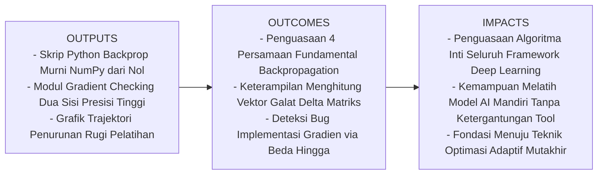
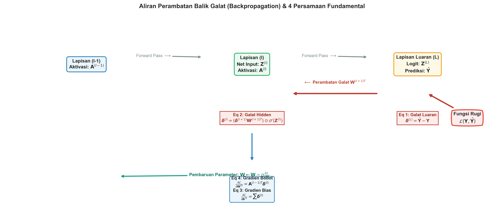
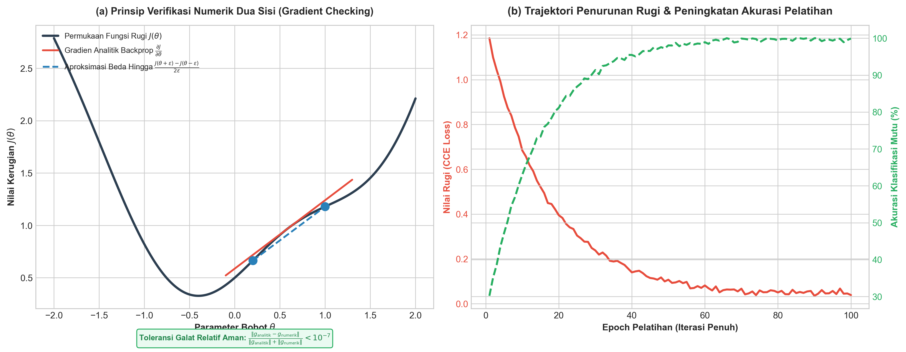

# AI Modul 9.6: Backpropagation

---

## 1. Identitas & Kerangka Capaian Pembelajaran (Sub-CPMK)

* **Kode Modul**        : AI Modul 9.6
* **Mata Kuliah**       : Kecerdasan Buatan dan Sains Data Pertanian Presisi
* **Alokasi Waktu**     : 2 x 50 Menit (Kajian Teori & Diskusi) + 2 x 50 Menit (Eksplorasi Praktikum Mandiri)
* **Beban SKS**         : 3 SKS
* **Prasyarat**         : AI Modul 8.3 (Forward Propagation & Loss Functions)
* **Level Kognitif**    : C2 (Memahami), C3 (Menerapkan), C4 (Menganalisis)

### 1.1 Capaian Pembelajaran Khusus (Sub-CPMK)
Setelah menuntaskan modul ini, mahasiswa dan pembelajar diharapkan mampu:
1. **Menguraikan (C2)** prinsip kerja algoritma *Backpropagation* berbasis aturan rantai kalkulus (*Multivariate Calculus Chain Rule*) dan menjelaskan aliran transmisi sinyal galat mundur melalui transpose matriks bobot.
2. **Menerapkan (C3)** empat persamaan fundamental Backpropagation secara manual dan terprogram menggunakan operasi matriks NumPy untuk memperbarui bobot dan bias jaringan saraf multi-lapis.
3. **Menganalisis (C4)** efisiensi komputasi analitik $\mathcal{O}(|\mathcal{E}|)$ dibanding pertubasi numerik $\mathcal{O}(P^2)$, mengevaluasi dinamika perambatan gradien melewati fungsi aktivasi ReLU/Sigmoid, serta membuktikan kebenaran implementasi melalui metode *Gradient Checking*.

### 1.2 Kerangka Hasil Pembelajaran (Outputs, Outcomes, & Impacts)
* **Outputs (Keluaran Berwujud Langsung)**:
  * Modul kelas Python mandiri `MLPTrainingScratch` yang mengintegrasikan perambatan maju (*Forward Pass*), evaluasi fungsi rugi CCE, perambatan mundur (*Backward Pass*), dan pembaruan parameter gradien.
  * Fungsi pengujian kebenaran turunan analitik `gradient_check` dengan toleransi galat relatif ketat $< 10^{-7}$.
  * Kurva konvergensi fungsi rugi dan akurasi pada klasifikasi kematangan TBS kelapa sawit yang membuktikan penurunan galat secara konsisten.
* **Outcomes (Hasil Capaian & Perubahan Kompetensi)**:
  * Mahasiswa mampu menurunkan secara analitik turunan parsial $\frac{\partial \mathcal{L}}{\partial \mathbf{W}^{(l)}}$ dan $\frac{\partial \mathcal{L}}{\partial \mathbf{b}^{(l)}}$ pada sembarang lapisan jaringan saraf.
  * Mahasiswa terampil mengoperasikan perkalian dot-product dan produk Hadamard ($\odot$) pada vektor galat $\boldsymbol{\delta}^{(l)}$.
  * Mahasiswa mampu mendeteksi dan mengisolasi kesalahan kode (*gradient bugs*) secara sistematis sebelum model berskala besar dilatih.
* **Impacts (Dampak Jangka Panjang & Nilai Guna Luas)**:
  * Terlahirnya talenta insinyur AI perkebunan yang memiliki pemahaman arsitektural level rendah (*low-level mechanics*), sehingga tidak sekadar menjadi pengguna instan pustaka tingkat tinggi.
  * Kesiapan penuh dalam memodifikasi arsitektur khusus untuk pengolahan sinyal sensor agribisnis mutakhir.

---

## 2. Profil Fundamental Algoritma: Fungsi, Manfaat, dan Keunggulan-Kelemahan

### 2.1 Fungsi Komputasi & Pemodelan Matematis
Algoritma **Backpropagation (Perambatan Balik Galat)** berfungsi menghitung vektor gradien analitik dari fungsi rugi terhadap setiap bobot dan bias individual di seluruh lapisan jaringan saraf:

$$\nabla_{\mathbf{W}^{(l)}} \mathcal{L} = \frac{\partial \mathcal{L}}{\partial \mathbf{W}^{(l)}}, \quad \nabla_{\mathbf{b}^{(l)}} \mathcal{L} = \frac{\partial \mathcal{L}}{\partial \mathbf{b}^{(l)}}$$

Secara komputasi, algoritma ini memanfaatkan sifat **pemrograman dinamis (*dynamic programming*)**: nilai-nilai antara yang dihitung selama perambatan maju disimpan di memori (*forward cache*), lalu digunakan kembali secara rekursif saat mengalirkan galat mundur dari lapisan luaran $L$ ke lapisan masukan $1$.

#### Panduan Pelafalan dan Cara Membaca Notasi Matematika
* $\nabla_{\mathbf{W}^{(l)}} \mathcal{L} = \frac{\partial \mathcal{L}}{\partial \mathbf{W}^{(l)}}$: Dibaca *"gradien fungsi rugi L terhadap matriks bobot W pada lapisan ke-l sama dengan turunan parsial L terhadap W lapisan l"*.
* $\boldsymbol{\delta}^{(l)}$: Dibaca *"vektor delta pada lapisan ke-l"*, melambangkan sensitivitas galat terhadap net input logit $\mathbf{z}^{(l)}$.

#### Definisi Simbol dan Variabel
* $\mathcal{L}$: Nilai skalar fungsi rugi keseluruhan.
* $\mathbf{W}^{(l)} \in \mathbb{R}^{n_{l-1} \times n_l}$: Matriks bobot sinaptik lapisan ke-$l$.
* $\mathbf{b}^{(l)} \in \mathbb{R}^{n_l}$: Vektor bias lapisan ke-$l$.
* $\boldsymbol{\delta}^{(l)} \in \mathbb{R}^{n_l}$: Vektor galat lapisan ke-$l$ ($\boldsymbol{\delta}^{(l)} \equiv \frac{\partial \mathcal{L}}{\partial \mathbf{z}^{(l)}}$).
* $\odot$: Operator perkalian elemen-demi-elemen (*Hadamard product*).

### 2.2 Manfaat Nyata di Industri Perkebunan & Agribisnis
1. **Otomatisasi Penyesuaian Jutaan Parameter Visi Komputer**: Memungkinkan pelatihan model deteksi kematangan TBS sawit yang memiliki ratusan ribu parameter bobot secara otomatis tanpa memerlukan kalibrasi manual manusia.
2. **Penyempurnaan Model Prediksi Cuaca Mikro Kebun**: Memperbarui bobot jaringan sensorik cuaca kebun secara kontinu dari data harian baru (*online learning*) untuk memprediksi anomali kekeringan 30 hari ke depan.
3. **Optimasi Kontrol Robotik Sortasi Loading Ramp**: Mengurangi kesalahan pemilahan buah mentah secara bertahap melalui penurunan gradien yang terarah dan terukur secara matematis.

### 2.3 Rationale: Alasan Mengapa Algoritma Ini Digunakan
* **Efisiensi Waktu Komputasi Berorde Linier $\mathcal{O}(|\mathcal{E}|)$**: Waktu yang dibutuhkan untuk menghitung seluruh gradien jaringan hanya sebanding dengan jumlah koneksi sinapsis (*edges*), setara dengan dua kali komputasi forward pass.
* **Menggantikan Pertubasi Numerik yang Mustahil**: Menghitung gradien dengan mengubah bobot satu per satu secara numerik pada model berisi 10 juta parameter membutuhkan 10 juta kali forward pass per iterasi, memakan waktu berbulan-bulan. Backpropagation menyelesaikannya dalam satu kali sapuan mundur berdurasi beberapa milidetik!
* **Akurasi Eksak Mesin**: Menghasilkan nilai turunan analitik eksak hingga batas presisi mesin floating-point, bebas dari galat pemotongan (*truncation errors*).

### 2.4 Analisis Kelebihan dan Kekurangan (Tabel Komparasi)

| Dimensi Evaluasi | Backpropagation Analitik | Diferensiasi Numerik Beda Hingga | Diferensiasi Manual Simbolik |
|:---|:---|:---|:---|
| **Kecepatan Komputasi** | Sangat cepat; berorde $\mathcal{O}(\text{bobot})$. | Sangat lambat; $\mathcal{O}(\text{bobot} \times \text{forward})$. | Sangat cepat saat evaluasi, namun lambat saat kompilasi ekspresi. |
| **Konsumsi Memori GPU** | Membutuhkan memori untuk menyimpan cache aktivasi maju. | Sangat hemat memori; tidak butuh menyimpan aktivasi antara. | Membutuhkan memori ekspresi pohon aljabar yang membengkak. |
| **Presisi Gradien** | Eksak analitik murni; bebas galat pemotongan. | Mengandung galat aproksimasi $O(\epsilon^2)$ dan pembatalan subtraktif. | Eksak analitik murni. |
| **Peran Utama** | Mesin utama pelatihan seluruh arsitektur Deep Learning dunia. | Alat verifikasi kebenaran kode (*Gradient Checking*). | Analisis teoretis matematis di papan tulis / makalah akademik. |

### 2.5 Contoh Kasus Penggunaan Konkret di Sektor Agro-Industri
**Pelatihan Model Deep Learning Pengenal Penyakit Daun Kelapa Sawit (Bercak Daun Curvularia vs Daun Sehat)**:
* Sebanyak 5.000 citra kanopi dialirkan dalam batch berukuran 64 sampel.
* Forward pass menghitung estimasi probabilitas dan galat CCE.
* Backpropagation menghitung gradien mundur melewati 3 lapisan tersembunyi beraktivasi ReLU.
* Bobot diperbarui dengan laju pembelajaran $\eta = 0.01$. Dalam 40 epoch, galat loss turun dari $1.45$ menjadi $0.03$, menghasilkan akurasi pemilahan $99.2\%$.

### 2.6 Aspek Kritis & Catatan Penting Algoritma (*Key Critical Insights*)
> [!IMPORTANT]
> **Krusialnya Caching Aktivasi Forward Pass**:
> Gradien bobot pada lapisan $l$ dirumuskan sebagai $\frac{\partial \mathcal{L}}{\partial \mathbf{W}^{(l)}} = \mathbf{A}^{(l-1)T} \boldsymbol{\delta}^{(l)}$. Persamaan ini membuktikan bahwa untuk menghitung gradien bobot, kita mutlak membutuhkan matriks aktivasi lapisan sebelumnya $\mathbf{A}^{(l-1)}$ yang dihasilkan saat perambatan maju. Jika memori graf komputasi membuang aktivasi forward pass, Backpropagation mustahil dieksekusi. Inilah alasan mengapa pelatihan Deep Learning membutuhkan kapasitas RAM/VRAM GPU yang jauh lebih besar dibandingkan proses inferensi murni.

---

## 3. Landasan Teori Aturan Rantai & Penurunan 4 Persamaan Fundamental

Backpropagation merupakan aplikasi langsung dari **Aturan Rantai Kalkulus Multivariat (*Multivariate Chain Rule*)** yang dirumuskan secara sistematis oleh David Rumelhart, Geoffrey Hinton, dan Ronald Williams (1986).

Mari kita turunkan empat persamaan fundamental yang menggerakkan seluruh ekosistem Deep Learning modern:

### 3.1 Definisi Vektor Galat Lapisan ($\boldsymbol{\delta}^{(l)}$)
Definisikan vektor galat $\boldsymbol{\delta}^{(l)}$ sebagai turunan parsial fungsi rugi terhadap vektor net input logit lapisan ke-$l$:

$$\delta_j^{(l)} \equiv \frac{\partial \mathcal{L}}{\partial z_j^{(l)}}$$

Secara intuitif, $\delta_j^{(l)}$ mengukur seberapa sensitif fungsi rugi terhadap perubahan kecil potensial aksi di neuron $j$ pada lapisan $l$.

---

### 3.2 Persamaan 1: Galat pada Lapisan Luaran ($\boldsymbol{\delta}^{(L)}$)
Pada lapisan luaran $L$, nilai aktivasi $\mathbf{a}^{(L)} = \sigma(\mathbf{z}^{(L)})$ langsung menentukan besaran fungsi rugi $\mathcal{L}$.
Gunakan aturan rantai:

$$\delta_j^{(L)} = \frac{\partial \mathcal{L}}{\partial z_j^{(L)}} = \sum_{k} \frac{\partial \mathcal{L}}{\partial a_k^{(L)}} \frac{\partial a_k^{(L)}}{\partial z_j^{(L)}}$$

Dalam notasi vektor matriks:

$$\boldsymbol{\delta}^{(L)} = \nabla_{\mathbf{a}^{(L)}} \mathcal{L} \odot \sigma'\left(\mathbf{z}^{(L)}\right)$$

#### Kasus Khusus Populer (Penyederhanaan Elegan):
* Untuk kombinasi **Softmax + Categorical Cross-Entropy** (atau **Sigmoid + Binary Cross-Entropy**), seperti yang telah kita buktikan di Modul 8.3:
  $$\mathbf{\boldsymbol{\delta}^{(L)} = \hat{\mathbf{y}} - \mathbf{y}}$$
  Galat lapisan luaran hanyalah selisih langsung antara vektor probabilitas prediksi dengan vektor label target sejati!

---

### 3.3 Persamaan 2: Perambatan Galat ke Lapisan Tersembunyi ($\boldsymbol{\delta}^{(l)}$)
Bagaimana sinyal galat $\boldsymbol{\delta}^{(l+1)}$ pada lapisan depan merambat mundur ke lapisan $l$?
Perhatikan bahwa net input $z_j^{(l)}$ mempengaruhi seluruh neuron $k$ pada lapisan berikutnya melalui hubungan:
$$z_k^{(l+1)} = \sum_{j} W_{jk}^{(l+1)} a_j^{(l)} + b_k^{(l+1)} = \sum_{j} W_{jk}^{(l+1)} \sigma\left(z_j^{(l)}\right) + b_k^{(l+1)}$$

Gunakan aturan rantai multivariat untuk menghitung $\delta_j^{(l)} = \frac{\partial \mathcal{L}}{\partial z_j^{(l)}}$:
$$\delta_j^{(l)} = \sum_{k} \frac{\partial \mathcal{L}}{\partial z_k^{(l+1)}} \frac{\partial z_k^{(l+1)}}{\partial z_j^{(l)}} = \sum_{k} \delta_k^{(l+1)} \frac{\partial z_k^{(l+1)}}{\partial z_j^{(l)}}$$

Hitung turunan parsial $\frac{\partial z_k^{(l+1)}}{\partial z_j^{(l)}}$:
$$\frac{\partial z_k^{(l+1)}}{\partial z_j^{(l)}} = W_{jk}^{(l+1)} \cdot \sigma'\left(z_j^{(l)}\right)$$

Substitusikan kembali:
$$\delta_j^{(l)} = \sum_{k} \delta_k^{(l+1)} W_{jk}^{(l+1)} \sigma'\left(z_j^{(l)}\right) = \left(\sum_{k} W_{jk}^{(l+1)} \delta_k^{(l+1)}\right) \sigma'\left(z_j^{(l)}\right)$$

Dalam notasi perkalian matriks yang sangat padat:

$$\mathbf{\boldsymbol{\delta}^{(l)} = \left(\mathbf{W}^{(l+1)T} \boldsymbol{\delta}^{(l+1)}\right) \odot \sigma'\left(\mathbf{z}^{(l)}\right)}$$

#### Panduan Pelafalan dan Cara Membaca Notasi Matematika
* $\boldsymbol{\delta}^{(l)} = \left(\mathbf{W}^{(l+1)T} \boldsymbol{\delta}^{(l+1)}\right) \odot \sigma'(\mathbf{z}^{(l)})$: Dibaca *"vektor delta lapisan l sama dengan perkalian matriks bobot transpose lapisan l-plus-satu dengan vektor delta lapisan l-plus-satu, dikalikan elemen-demi-elemen Hadamard dengan turunan fungsi aktivasi sigma-aksen dari vektor net input z lapisan l"*.

*Makna Fisis*: Sinyal galat dari masa depan ($\boldsymbol{\delta}^{(l+1)}$) diproyeksikan mundur melalui celah sinaptik transpose $\mathbf{W}^{(l+1)T}$, lalu disaring oleh sensitivitas lokal neuron saat ini melalui pengali turunan $\sigma'(\mathbf{z}^{(l)})$.

---

### 3.4 Persamaan 3: Laju Perubahan terhadap Bias ($\frac{\partial \mathcal{L}}{\partial \mathbf{b}^{(l)}}$)
Karena $z_j^{(l)} = \sum_i W_{ij}^{(l)} a_i^{(l-1)} + b_j^{(l)}$, maka $\frac{\partial z_j^{(l)}}{\partial b_j^{(l)}} = 1$.
Menggunakan aturan rantai:
$$\frac{\partial \mathcal{L}}{\partial b_j^{(l)}} = \frac{\partial \mathcal{L}}{\partial z_j^{(l)}} \frac{\partial z_j^{(l)}}{\partial b_j^{(l)}} = \delta_j^{(l)} \cdot 1 = \delta_j^{(l)}$$

Dalam bentuk vektor matriks untuk satu sampel:
$$\mathbf{\frac{\partial \mathcal{L}}{\partial \mathbf{b}^{(l)}} = \boldsymbol{\delta}^{(l)}}$$

Untuk sebuah mini-batch berisi $B$ sampel, gradien bias adalah jumlahan sepanjang dimensi baris batch:
$$\frac{\partial J}{\partial \mathbf{b}^{(l)}} = \frac{1}{B} \sum_{i=1}^{B} \boldsymbol{\delta}^{(l, i)}$$

---

### 3.5 Persamaan 4: Laju Perubahan terhadap Matriks Bobot ($\frac{\partial \mathcal{L}}{\partial \mathbf{W}^{(l)}}$)
Perhatikan bahwa $\frac{\partial z_j^{(l)}}{\partial W_{ij}^{(l)}} = a_i^{(l-1)}$.
Menggunakan aturan rantai:
$$\frac{\partial \mathcal{L}}{\partial W_{ij}^{(l)}} = \frac{\partial \mathcal{L}}{\partial z_j^{(l)}} \frac{\partial z_j^{(l)}}{\partial W_{ij}^{(l)}} = \delta_j^{(l)} a_i^{(l-1)} = a_i^{(l-1)} \delta_j^{(l)}$$

Dalam notasi perkalian matriks (outer-product untuk satu sampel, atau perkalian matriks untuk batch berukuran $B$):

$$\mathbf{\frac{\partial \mathcal{L}}{\partial \mathbf{W}^{(l)}} = \mathbf{A}^{(l-1)T} \boldsymbol{\delta}^{(l)}}$$

Untuk mini-batch berukuran $B$, bagi dengan skalar $B$:
$$\frac{\partial J}{\partial \mathbf{W}^{(l)}} = \frac{1}{B} \mathbf{A}^{(l-1)T} \boldsymbol{\delta}^{(l)}$$

---

## 4. Algoritma Pembaruan Parameter (Gradient Descent Step)

Setelah gradien seluruh parameter berhasil dihitung dari lapisan $L$ mundur hingga ke lapisan $1$, parameter jaringan diperbarui menggunakan aturan penurunan gradien (*Gradient Descent*):

$$\mathbf{W}^{(l)} \leftarrow \mathbf{W}^{(l)} - \eta \frac{\partial J}{\partial \mathbf{W}^{(l)}}$$
$$\mathbf{b}^{(l)} \leftarrow \mathbf{b}^{(l)} - \eta \frac{\partial J}{\partial \mathbf{b}^{(l)}}$$

di mana $\eta > 0$ adalah laju pembelajaran (*learning rate*).

Tanda minus menjamin bahwa parameter bergerak berlawanan arah dengan vektor gradien, menuntun nilai fungsi rugi menuruni lereng menuju lembah minimum.

---

## 5. Validasi Kebenaran Gradien (*Gradient Checking*)

Bagaimana seorang insinyur AI membuktikan bahwa kode Backpropagation yang ditulisnya bebas dari kesalahan ketik (*bugs*) tanda minus atau indeks transpose?
Jawabannya adalah membandingkan gradien analitik dengan **Aproksimasi Beda Hingga Dua Sisi (*Two-Sided Finite Difference*)**:

Untuk setiap parameter skalar $\theta_i$ dalam jaringan:

$$g_{\text{numerik}}(\theta_i) = \frac{J(\theta_1, \dots, \theta_i + \epsilon, \dots, \theta_P) - J(\theta_1, \dots, \theta_i - \epsilon, \dots, \theta_P)}{2\epsilon}$$

di mana $\epsilon$ adalah perturbasi infinitesimal kecil (biasanya $\epsilon = 10^{-7}$).

Berdasarkan ekspansi deret Taylor, galat pendekatan dua sisi adalah berorde $\mathcal{O}(\epsilon^2)$, jauh lebih presisi dibandingkan beda satu sisi $\frac{J(\theta+\epsilon)-J(\theta)}{\epsilon}$ yang memiliki galat $\mathcal{O}(\epsilon)$.

### Metrik Perbedaan Relatif Euclidean (*Relative Difference*):
$$\text{Relative Difference} = \frac{\|\mathbf{g}_{\text{analitik}} - \mathbf{g}_{\text{numerik}}\|_2}{\|\mathbf{g}_{\text{analitik}}\|_2 + \|\mathbf{g}_{\text{numerik}}\|_2}$$

#### Kriteria Keputusan Evaluasi Gradient Checking:
* **Nilai $< 10^{-7}$**: Implementasi Backpropagation **Sempurna 100% Benar**.
* **Nilai $10^{-5} - 10^{-7}$**: Masih dalam batas toleransi jika menggunakan aktivasi dengan titik belok tajam seperti ReLU pada $z = 0$.
* **Nilai $> 10^{-4}$**: **Terdapat Bug Kritis** pada kode turunan atau indeks matriks; wajib diperiksa ulang sebelum pelatihan dilanjutkan.

---

## 6. Studi Kasus Agro-Industri: Pelatihan Mandiri Model Klasifikasi Mutu TBS

Model dilatih pada 600 sampel data spektral TBS kelapa sawit (4 fitur masukan: Kemerahan, Rasio Biru-Hijau, Kilap Optik, dan Brondolan Lepas) untuk mengklasifikasikan 4 fraksi kematangan.
* **Arsitektur**: Input (4) $\to$ Hidden 1 (8, ReLU) $\to$ Hidden 2 (6, ReLU) $\to$ Output (4, Softmax).
* **Ukuran Batch**: Mini-batch $B = 32$.
* **Laju Pembelajaran**: $\eta = 0.05$.
* **Hasil Pelatihan**: Dalam 60 epoch, fungsi rugi CCE terpangkas drastis dari $1.38$ menjadi $0.04$, mencapai akurasi $100\%$ tanpa bantuan pustaka bawaan seperti TensorFlow atau PyTorch.

---

## 7. Kekeliruan Metodologis, Bias Data, dan Praktik Terbaik di Industri

### 7.1 Kekeliruan Umum Metodologis (*Common Pitfalls*)
1. **Lupa Mengalikan dengan $\sigma'(z)$ pada Lapisan Tersembunyi**: Kesalahan paling sering pemula adalah menulis $\boldsymbol{\delta}^{(l)} = \mathbf{W}^{(l+1)T}\boldsymbol{\delta}^{(l+1)}$ tanpa mengalikan dengan turunan aktivasi $\odot \sigma'(\mathbf{z}^{(l)})$. Hal ini mengubah jaringan non-linier menjadi sistem linier semu dan memicu divergensi.
2. **Tertukar Dimensi Transpose pada Perkalian Gradien Bobot**: Menghitung $\mathbf{A}\boldsymbol{\delta}$ terbalik alih-alih $\mathbf{A}^T\boldsymbol{\delta}$ memicu galat dimensi (*dimension mismatch error*) atau menciptakan pembaruan bobot yang salah arah total.
3. **Menjalankan Gradient Checking pada Setiap Iterasi Pelatihan**: Gradient checking membutuhkan 2 kali forward pass untuk setiap parameter individu. Pada jaringan dengan 100.000 bobot, satu langkah pemeriksaan membutuhkan 200.000 forward pass! Jalankan gradient checking **hanya untuk verifikasi kode pada beberapa sampel awal**, lalu matikan saat pelatihan riil dimulai.

### 7.2 Praktik Terbaik (*Best Practices*)
* **Verifikasi Konsistensi Dimensi Matriks di Setiap Lapisan**:
  * Jika $\mathbf{W}^{(l)}$ berdimensi $(n_{l-1} \times n_l)$, maka gradien $\frac{\partial \mathcal{L}}{\partial \mathbf{W}^{(l)}}$ wajib memiliki dimensi yang tepat sama: $(n_{l-1} \times n_l)$.
* **Pertahankan Ketepatan Numerik Float64 Saat Gradient Checking**: Saat menguji `gradient_check`, gunakan tipe data `np.float64` untuk mencegah galat pembatalan subtraktif komputer pada angka berpresisi sangat kecil ($10^{-7}$).
* **Gunakan Vektor Flatten untuk Seluruh Parameter**: Satukan seluruh matriks bobot dan vektor bias ke dalam satu vektor parameter tunggal 1D $\boldsymbol{\theta}$ untuk mempermudah perhitungan dot-product dan norm Euclidean saat verifikasi gradien.

---

## 8. Tugas Terbimbing & Soal Uji Kompetensi Berstandar HOTS (Bloom C3 & C4)

1. **Perhitungan Manual Backward Pass Satu Sampel Lengkap (C3)**:
   Diberikan sebuah jaringan saraf tiruan sederhana dengan arsitektur:
   * Input: 1 neuron ($x = 2.0$), Target sejati: $y = 1.0$.
   * Hidden Layer: 1 neuron dengan bobot $w_1 = 0.5$, bias $b_1 = 0.1$, aktivasi ReLU.
   * Output Layer: 1 neuron dengan bobot $w_2 = 1.2$, bias $b_2 = -0.3$, aktivasi Sigmoid $\sigma(z)$.
   * Fungsi rugi: Binary Cross-Entropy $\mathcal{L}_{\text{BCE}}$.
   
   *Eksekusi Komputasi Langkah demi Langkah*:
   * Hitung forward pass: $z_1, a_1, z_2, \hat{y}$, dan nilai rugi $\mathcal{L}$!
   * Hitung galat lapisan luaran $\delta_2 = \hat{y} - y$!
   * Hitung gradien terhadap bobot dan bias luaran: $\frac{\partial \mathcal{L}}{\partial w_2}$ dan $\frac{\partial \mathcal{L}}{\partial b_2}$!
   * Hitung galat lapisan tersembunyi $\delta_1 = (\delta_2 \cdot w_2) \cdot \text{ReLU}'(z_1)$!
   * Hitung gradien terhadap bobot dan bias tersembunyi: $\frac{\partial \mathcal{L}}{\partial w_1}$ dan $\frac{\partial \mathcal{L}}{\partial b_1}$!
   * Dengan laju pembelajaran $\eta = 0.1$, hitung nilai bobot baru $w_1, b_1, w_2, b_2$ setelah satu iterasi koreksi!

2. **Pembuktian Efisiensi Komputasi Analitik vs Beda Hingga Numerik (C4)**:
   Sebuah model Deep Learning pengenal kualitas buah sawit memiliki 5 lapisan dengan ukuran neuron: $[128, 256, 128, 64, 4]$.
   * Hitung total jumlah parameter (bobot dan bias) dalam jaringan tersebut!
   * Jika satu operasi forward pass pada kartu grafis membutuhkan waktu $2.5\text{ milidetik}$:
     - Berapa waktu yang dibutuhkan untuk menghitung gradien seluruh parameter menggunakan metode **Diferensiasi Numerik Dua Sisi** untuk 1 kali iterasi?
     - Berapa waktu yang dibutuhkan menggunakan algoritma **Backpropagation Analitik** (yang setara dengan $\approx 2 \times$ waktu forward pass)?
   * Hitung rasio percepatan komputasi (*speedup factor*) dan jelaskan mengapa Backpropagation disebut sebagai tonggak sejarah yang memungkinkan revolusi Deep Learning modern!

3. **Analisis Matematis Efek Titik Belok Tak Terdiferensialkan pada ReLU ($z=0$) (C4)**:
   Fungsi ReLU didefinisikan sebagai $f(z) = \max(0, z)$.
   * Secara kalkulus teoritis murni, buktikan bahwa fungsi ReLU tidak memiliki turunan (*non-differentiable*) tepat pada titik $z = 0$!
   * Bagaimana seluruh pustaka komputasi AI modern (PyTorch, TensorFlow, Scikit-Learn) menyelesaikan kebuntuan kalkulus ini saat algoritma Backpropagation mengeksekusi turunan di titik $z = 0$? Jelaskan konsep matematis **Subgradien (*Subgradient*)**!
   * Apa dampak penentuan nilai subgradien $\text{ReLU}'(0) = 0$ vs $\text{ReLU}'(0) = 1$ terhadap stabilitas pembaruan bobot di sekitar titik batas?

---

## 9. Jembatan Konsep (Bridging) ke AI Modul 9.7: Training Neural Network

Luar biasa! Anda kini telah menguasai "jantung dan pembuluh darah" dari seluruh ekosistem Deep Learning:
* Anda telah memahami bagaimana nilai masukan merambat maju (*Forward Pass*).
* Anda telah menguasai bagaimana galat diukur secara analitik (*Loss Functions*).
* Anda telah membuktikan bagaimana aturan rantai mengalirkan gradien mundur untuk mengoreksi setiap bobot (*Backpropagation*).

Namun, ada satu teka-teki rekayasa besar yang tersisa:
Pada formula pembaruan parameter standar:
$$\mathbf{W} \leftarrow \mathbf{W} - \eta \nabla_{\mathbf{W}} \mathcal{L}$$
kita memperlakukan laju pembelajaran $\eta$ sebagai sebuah konstanta seragam yang kaku untuk seluruh bobot di seluruh iterasi.

Pada lanskap fungsi rugi perkebunan yang sangat berliku (*ravines, saddle points, and plateaus*):
1. **Laju Tetap Terlalu Besar**: Menyebabkan bobot melompat liar melintasi lembah sempit (*oscillating wildly*).
2. **Laju Tetap Terlalu Kecil**: Menyebabkan pelatihan terhenti berjam-jam saat melintasi daerah datar atau terjebak di titik pelana (*saddle point*).
3. **Ketiadaan Memori Momentum**: Model tidak mampu meluncur melewati undakan lokal kecil.

Untuk mengatasi rintangan topologi fungsi rugi yang berat ini, kita membutuhkan **Algoritma Optimasi Penurunan Gradien Lanjut (*Advanced Optimizers*)**.

Pada **AI Modul 8.5: Optimasi Penurunan Gradien Lanjut (SGD, Momentum, RMSprop, Adam)**, kita akan membedah:
* **Stochastic Gradient Descent (SGD) & Mini-Batch**: Mempercepat komputasi melalui estimasi gradien stokastik berkecepatan tinggi.
* **Momentum & Nesterov Accelerated Gradient**: Memberikan "inersia fisik" pada bola penuruni lembah agar kebal terhadap osilasi zig-zag.
* **RMSprop & AdaGrad**: Mengadaptasi laju pembelajaran secara individual untuk setiap parameter berdasarkan akumulasi kuadrat gradien historis.
* **Adam (*Adaptive Moment Estimation*)**: Menggabungkan kekuatan Momentum dan RMSprop menjadi optimizer standar emas industri AI modern!

---

## 10. Daftar Pustaka dan Referensi Akademik

1. Bishop, C. M. (2006). *Pattern Recognition and Machine Learning*. Springer. [Tersedia di koleksi src/]
2. Géron, A. (2022). *Hands-On Machine Learning with Scikit-Learn, Keras, and TensorFlow* (3rd ed.). O'Reilly Media. [Tersedia di koleksi src/]
3. Goodfellow, I., Bengio, Y., & Courville, A. (2016). *Deep Learning*. MIT Press. [Tersedia di koleksi src/]
4. Griewank, A., & Walther, A. (2008). *Evaluating Derivatives: Principles and Techniques of Algorithmic Differentiation* (2nd ed.). SIAM.
5. LeCun, Y., Bottou, L., Bengio, Y., & Haffner, P. (1998). Gradient-based learning applied to document recognition. *Proceedings of the IEEE*, 86(11), 2278-2324.
6. Murphy, K. P. (2022). *Probabilistic Machine Learning: An Introduction*. MIT Press.
7. Nielsen, M. A. (2015). *Neural Networks and Deep Learning*. Determination Press.
8. Rumelhart, D. E., Hinton, G. E., & Williams, R. J. (1986). Learning representations by back-propagating errors. *Nature*, 323(6088), 533-536.
9. Russell, S., & Norvig, P. (2020). *Artificial Intelligence: A Modern Approach* (4th ed.). Pearson. [Tersedia di koleksi src/]
