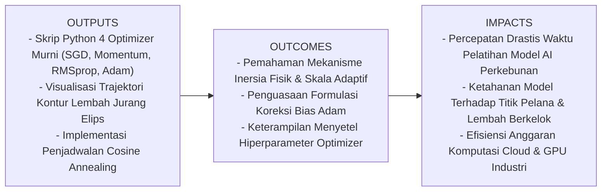
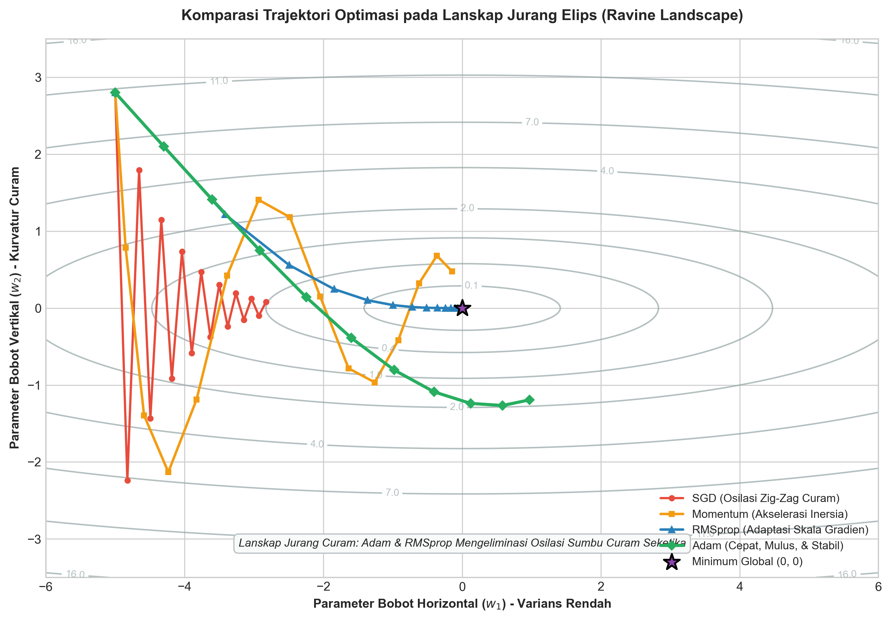
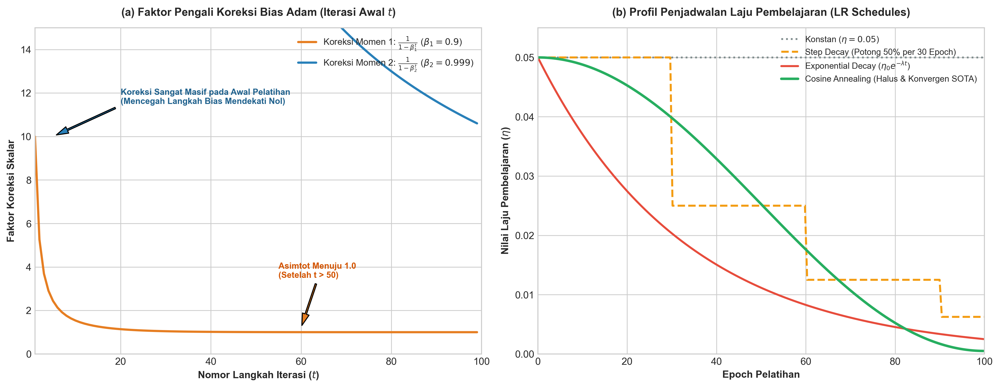

# AI Modul 9.7: Training Neural Network

---

## 1. Identitas & Kerangka Capaian Pembelajaran (Sub-CPMK)

* **Kode Modul**        : AI Modul 9.7
* **Mata Kuliah**       : Kecerdasan Buatan dan Sains Data Pertanian Presisi
* **Alokasi Waktu**     : 2 x 50 Menit (Kajian Teori & Diskusi) + 2 x 50 Menit (Eksplorasi Praktikum Mandiri)
* **Beban SKS**         : 3 SKS
* **Prasyarat**         : AI Modul 8.4 (Algoritma Backpropagation & Aturan Rantai Kalkulus)
* **Level Kognitif**    : C2 (Memahami), C3 (Menerapkan), C4 (Menganalisis)



### 1.1 Capaian Pembelajaran Khusus (Sub-CPMK)
Setelah menuntaskan modul ini, mahasiswa dan pembelajar diharapkan mampu:
1. **Menguraikan (C2)** prinsip kerja dan keterbatasan mendasar algoritma *Batch Gradient Descent*, *Stochastic Gradient Descent* (SGD), dan *Mini-Batch GD* dalam mengarungi lanskap fungsi rugi non-konveks berdimensi tinggi.
2. **Menerapkan (C3)** formulasi matematika algoritma *Momentum*, *RMSprop*, dan *Adam* (*Adaptive Moment Estimation*) lengkap dengan perhitungan koreksi bias analitik untuk mempercepat konvergensi model AI perkebunan presisi.
3. **Menganalisis (C4)** perbandingan trajektori optimasi pada permukaan jurang sempit (*ravine landscapes*), mengevaluasi dinamika peluruhan laju pembelajaran (*Learning Rate Schedules* seperti *Cosine Annealing*), serta mendiagnosis anomali divergensi pelatihan akibat hiperparameter yang tidak terkalibrasi.

### 1.2 Kerangka Hasil Pembelajaran (Outputs, Outcomes, & Impacts)
* **Outputs (Keluaran Berwujud Langsung)**:
  * Berkas kode program Python mandiri yang mengimplementasikan empat kelas optimizer (`SGD`, `Momentum`, `RMSprop`, `Adam`) murni dari nol dengan NumPy.
  * Grafik visualisasi perbandingan lintasan optimasi 2D pada permukaan fungsi uji non-konveks yang memperlihatkan eliminasi osilasi zig-zag.
  * Laporan perbandingan laju penurunan kerugian dan efisiensi waktu pelatihan pada model peramalan defisit air tanah multi-blok.
* **Outcomes (Hasil Capaian & Perubahan Kompetensi)**:
  * Mahasiswa terampil memilih optimizer yang paling tepat berdasarkan ukuran dataset, arsitektur jaringan, dan karakteristik derau data pertanian.
  * Mahasiswa memahami secara mendalam peran momen pertama (kecepatan gerak) dan momen kedua (redaman varians adaptif) pada algoritma Adam.
  * Mahasiswa mampu merancang strategi peluruhan laju belajar dinamis guna mengunci bobot model pada lembah minimum global yang stabil.
* **Impacts (Dampak Jangka Panjang & Nilai Guna Luas)**:
  * Penghematan signifikan pada durasi pelatihan komputasi GPU korporasi agribisnis (memangkas siklus iterasi dari beberapa hari menjadi hitungan jam).
  * Menghasilkan model prediksi agro-klimat dan inspeksi panen yang memiliki performa generalisasi lebih konsisten dan tahan banting.

---

## 2. Profil Fundamental Algoritma: Fungsi, Manfaat, dan Keunggulan-Kelemahan

### 2.1 Fungsi Komputasi & Pemodelan Matematis
Algoritma **Optimizer (Pengoptimal)** berfungsi memperbarui parameter bobot ($\mathbf{W}$) dan bias ($\mathbf{b}$) jaringan saraf secara iteratif berdasarkan informasi gradien $\nabla_{\boldsymbol{\theta}} \mathcal{L}$ yang dihasilkan oleh algoritma Backpropagation:

$$\boldsymbol{\theta}_{t+1} = \boldsymbol{\theta}_t - \Delta \boldsymbol{\theta}_t$$

Jika *Vanilla Gradient Descent* memperlakukan seluruh parameter dengan laju pembaruan skalar konstan ($\Delta \boldsymbol{\theta}_t = \eta \mathbf{g}_t$), maka **Optimizer Lanjut** memodelkan dinamika pembaruan sebagai **sistem fisik teredam adaptif**:
1. Menyimpan **momen inersia fisik (*first moment*)** untuk mempertahankan arah laju pada lintasan datar dan meredam osilasi liar.
2. Membagi langkah dengan **akar rata-rata kuadratik gradien (*second raw moment*)** untuk memperlambat langkah pada parameter yang berfluktuasi tajam dan mempercepat langkah pada parameter yang jarang diperbarui.

#### Panduan Pelafalan dan Cara Membaca Notasi Matematika
* $\boldsymbol{\theta}_{t+1} = \boldsymbol{\theta}_t - \Delta \boldsymbol{\theta}_t$: Dibaca *"vektor parameter teta pada langkah t-plus-satu sama dengan teta langkah ke-t dikurangi vektor pembaruan delta-teta langkah ke-t"*.
* $\mathbf{g}_t = \nabla_{\boldsymbol{\theta}} J(\boldsymbol{\theta}_t)$: Dibaca *"vektor gradien g pada langkah t sama dengan turunan fungsi biaya J terhadap parameter teta pada langkah t"*.

#### Definisi Simbol dan Variabel
* $\boldsymbol{\theta} \in \mathbb{R}^P$: Vektor gabungan seluruh parameter bobot dan bias jaringan berukuran total $P$.
* $\mathbf{g}_t$: Gradien stokastik fungsi rugi pada iterasi ke-$t$.
* $\eta$: Laju pembelajaran dasar (*base learning rate*).
* $\mathbf{m}_t$: Vektor estimasi momen pertama (kecepatan / rata-rata eksponensial gradien).
* $\mathbf{v}_t$: Vektor estimasi momen kedua (rata-rata eksponensial kuadrat gradien / varians tanpa pusat).

### 2.2 Manfaat Nyata di Industri Perkebunan & Agribisnis
1. **Peramalan Cekaman Air Tanah (*Soil Moisture Deficit*) Multi-Blok**: Mempercepat pelatihan model LSTM/MLP multi-input (curah hujan harian, radiasi matahari, kelembaban tanah, transpirasi) pada jutaan titik sensor IoT kebun sawit.
2. **Pelatihan Model Sortasi Buah Skala Besar**: Menghindarkan model visi komputer dari kendala titik pelana (*saddle points*) saat membedakan fraksi buah lewat matang vs buah busuk yang memiliki kemiripan spektral tinggi.
3. **Penyetelan Otomatis Model Lapangan Berdaya Rendah**: Menggunakan Adam memungkinkan teknisi kebun memperoleh model berkinerja tinggi menggunakan hiperparameter default ($\eta = 0.001$) tanpa memerlukan proses penalaan manual yang melelahkan.

### 2.3 Rationale: Alasan Mengapa Algoritma Ini Digunakan
* **Mengatasi Patologi Jurang Elips (*Ravines*)**: Pada data agribisnis dengan korelasi tinggi antar-variabel, lanskap fungsi rugi memiliki kurvatur yang sangat timpang: sangat curam pada satu arah namun sangat landai pada arah lainnya. Optimizer adaptif mengeliminasi lonjakan zig-zag pada sumbu curam sehingga model dapat meluncur cepat sepanjang lembah menuju titik minimum.
* **Meloloskan Diri dari Titik Pelana (*Saddle Points*)**: Pada jaringan saraf dalam dengan jutaan parameter, hampir seluruh titik stasioner lokal bukanlah minimum lokal, melainkan titik pelana (*saddle points* di mana gradien nol tetapi bukan titik terendah). Momentum memberikan energi kinetik bagi model untuk menggelinding keluar dari titik pelana tersebut.
* **Adaptasi Sifat Data Jarang (*Sparse Features*)**: Fitur-fitur agronomi yang jarang terjadi (seperti anomali serangan ulat api yang hanya muncul di 3 blok) akan menerima laju belajar efektif yang lebih besar, memastikan parameter terkait tetap terbarui secara adil.

### 2.4 Analisis Kelebihan dan Kekurangan (Tabel Komparasi)

| Nama Optimizer | Sifat Pembaruan Parameter | Keunggulan Utama | Kelemahan Utama | Kasus Penggunaan Ideal |
|:---|:---|:---|:---|:---|
| **Batch GD** | Seluruh dataset per pembaruan. | Konvergensi deterministik stabil menuju minimum lokal. | Sangat lambat; memori RAM membengkak jika dataset jutaan baris. | Dataset kecil berukuran $< 10.000$ sampel. |
| **SGD Murni** | Satu sampel per pembaruan. | Sangat cepat; mampu melompati cekungan dangkal berkat derau acak. | Osilasi sangat liar; tidak pernah benar-benar diam di titik minimum. | Pembelajaran daring (*online learning*) streaming sensor. |
| **SGD + Momentum** | Inersia kecepatan masa lalu. | Meredam osilasi vertikal; meluncur cepat di lembah datar. | Cenderung melompati minimum global (*overshooting*) jika momentum terlalu besar. | Visi komputer (CNN) dan klasifikasi citra daun standar. |
| **RMSprop** | Skala adaptif per parameter via EMA kuadrat gradien. | Mengatasi penurunan laju prematur AdaGrad; stabil pada data non-stasioner. | Membutuhkan penyetelan laju belajar dasar yang hati-hati. | Jaringan saraf sekuensial (RNN/LSTM) peramalan cuaca kebun. |
| **Adam** | Gabungan Momentum + RMSprop + Koreksi Bias. | Standar emas modern; konvergensi sangat cepat; kokoh dengan hiperparameter default. | Terkadang memiliki generalisasi akhir sedikit di bawah SGD berjadwal pada citra kompleks. | Standar *default* pertama untuk hampir seluruh proyek Deep Learning perkebunan. |

### 2.5 Contoh Kasus Penggunaan Konkret di Sektor Agro-Industri
**Sistem Cerdas Peramalan Dinamika Air Tanah dan Kebutuhan Irigasi Kelapa Sawit**:
* Dataset: 5 tahun data cuaca dan sensor tensiometer tanah (1.200.000 baris data per jam).
* Arsitektur: Multi-Layer Perceptron Dalam (4 Hidden Layers, 128-64-32-16 neuron).
* Pemilihan Optimizer: **Adam** dengan laju pembelajaran awal $\eta = 0.001$, $\beta_1 = 0.9$, $\beta_2 = 0.999$, dipadukan dengan penjadwalan *Cosine Annealing*.
* Hasil Komparasi: Adam mencapai konvergensi loss MSE $< 0.012$ hanya dalam 25 epoch, sedangkan SGD biasa masih berosilasi pada loss $0.085$ di epoch yang sama.

### 2.6 Aspek Kritis & Catatan Penting Algoritma (*Key Critical Insights*)
> [!IMPORTANT]
> **Mengapa Koreksi Bias (*Bias Correction*) Mutlak Diperlukan pada Adam?**
> Vektor momen pertama $\mathbf{m}_t$ dan momen kedua $\mathbf{v}_t$ diinisialisasi dengan angka nol pada awal pelatihan ($t=0$). Karena faktor peluruhan bernilai dekat dengan 1 ($\beta_1 = 0.9$ dan $\beta_2 = 0.999$), estimasi rata-rata bergerak eksponensial pada langkah-langkah awal akan sangat bias mendekati angka nol: $\mathbf{m}_1 = 0.1 \mathbf{g}_1$ dan $\mathbf{v}_1 = 0.001 \mathbf{g}_1^2$.
> Tanpa koreksi pembagian dengan skalar $(1 - \beta^t)$, langkah awal pembaruan parameter akan menjadi sangat lambat dan rapuh. Faktor koreksi $\frac{1}{1 - \beta_1^t}$ dan $\frac{1}{1 - \beta_2^t}$ mendongkrak estimasi momen pada awal iterasi, lalu secara alami menyatu menjadi $1.0$ seiring bertambahnya langkah $t$.

---

## 3. Klasifikasi Generasi & Landasan Matematis Lima Optimizer Utama

Mari kita bedah evolusi formulasi matematika optimasi dari model dasar hingga arsitektur adaptif modern:



### 3.1 Dari Batch GD, SGD, hingga Mini-Batch Gradient Descent
* **Batch Gradient Descent**: Menggunakan seluruh $N$ sampel data untuk satu kali langkah gradien:
  $$\mathbf{g}_t = \frac{1}{N} \sum_{i=1}^N \nabla_{\boldsymbol{\theta}} \mathcal{L}\left(\mathbf{x}^{(i)}, y^{(i)}\right)$$
  *Karakteristik*: Lintasan sangat mulus, namun komputasi sangat berat pada big data.
* **Stochastic Gradient Descent (SGD)**: Menggunakan hanya 1 sampel acak $i$:
  $$\mathbf{g}_t = \nabla_{\boldsymbol{\theta}} \mathcal{L}\left(\mathbf{x}^{(i)}, y^{(i)}\right)$$
  *Karakteristik*: Komputasi sangat ringan, namun lintasannya berfluktuasi sangat liar.
* **Mini-Batch Gradient Descent**: Menggunakan kelompok kecil sampel ($B = 32, 64, 128$):
  $$\mathbf{g}_t = \frac{1}{B} \sum_{i=1}^B \nabla_{\boldsymbol{\theta}} \mathcal{L}\left(\mathbf{x}^{(i)}, y^{(i)}\right)$$
  *Golden Standard*: Mengawinkan kecepatan komputasi paralelisasi GPU dengan stabilitas estimasi gradien.

---

### 3.2 Momentum: Memanfaatkan Inersia Fisika Newtonian
Diperkenalkan oleh Boris Polyak (1964), Momentum meniru pergerakan bola pejal bermassa yang menggelinding menuruni lereng bukit:

$$\mathbf{v}_t = \gamma \mathbf{v}_{t-1} + \eta \mathbf{g}_t$$
$$\boldsymbol{\theta}_{t+1} = \boldsymbol{\theta}_t - \mathbf{v}_t$$

#### Panduan Pelafalan dan Cara Membaca Notasi Matematika
* $\mathbf{v}_t = \gamma \mathbf{v}_{t-1} + \eta \mathbf{g}_t$: Dibaca *"vektor kecepatan v pada langkah t sama dengan koefisien gamma dikalikan kecepatan langkah t-minus-satu ditambah eta dikali vektor gradien g langkah t"*.

*Dinamika Fisis*:
* Koefisien momentum $\gamma \in [0.9, 0.99]$ bertindak sebagai gesekan permukaan.
* Pada dimensi yang gradiennya berganti-ganti tanda secara liar (seperti sumbu vertikal jurang), komponen $\mathbf{v}$ saling membatalkan menuju nol.
* Pada dimensi yang gradiennya menunjuk ke arah yang konsisten (seperti dasar lembah), komponen $\mathbf{v}$ berakselerasi terakumulasi, mempercepat bola meluncur menuju minimum global.

---

### 3.3 AdaGrad: Penyesuaian Laju Adaptif Berbasis Riwayat Gradien
Diusulkan oleh Duchi et al. (2011), AdaGrad menyesuaikan laju belajar secara individual untuk setiap parameter:

$$\mathbf{s}_t = \mathbf{s}_{t-1} + \mathbf{g}_t \odot \mathbf{g}_t$$
$$\boldsymbol{\theta}_{t+1} = \boldsymbol{\theta}_t - \frac{\eta}{\sqrt{\mathbf{s}_t} + \epsilon} \odot \mathbf{g}_t$$

*Limitasi Fatal AdaGrad*:
Karena $\mathbf{g}_t^2$ selalu positif, akumulator $\mathbf{s}_t$ bertambah monotonik seiring waktu. Akibatnya, faktor pembagi $\sqrt{\mathbf{s}_t}$ membesar tak berhingga, menyebabkan laju pembelajaran efektif menyusut hingga nol sebelum model sempat mendekati lembah optimal (*premature learning death*).

---

### 3.4 RMSprop: Redaman Eksponensial Kuadrat Gradien
Geoffrey Hinton (2012) mengatasi kelemahan fatal AdaGrad dengan mengganti penjumlahan kumulatif menjadi **Rata-Rata Bergerak Eksponensial (*Exponential Moving Average* / EMA)**:

$$\mathbf{s}_t = \beta \mathbf{s}_{t-1} + (1 - \beta) \mathbf{g}_t \odot \mathbf{g}_t$$
$$\boldsymbol{\theta}_{t+1} = \boldsymbol{\theta}_t - \frac{\eta}{\sqrt{\mathbf{s}_t} + \epsilon} \odot \mathbf{g}_t$$

#### Panduan Pelafalan dan Cara Membaca Notasi Matematika
* $\mathbf{s}_t = \beta \mathbf{s}_{t-1} + (1 - \beta) \mathbf{g}_t^2$: Dibaca *"vektor s langkah t sama dengan beta dikali s langkah t-minus-satu ditambah satu minus beta dikali kuadrat gradien g langkah t"*.
* Parameter $\beta \approx 0.9$ memastikan bahwa riwayat kuadrat gradien masa lalu dilupakan secara bertahap, sehingga laju belajar tidak pernah mati suri.

---

### 3.5 Adam (Adaptive Moment Estimation): Standar Emas Modern
Diformulasikan oleh Diederik Kingma dan Jimmy Ba (2014), Adam menggabungkan kekuatan **Momentum** (momen pertama / kecepatan) dan **RMSprop** (momen kedua / penyekalaan varians):



#### Algoritma Komputasi Langkah demi Langkah:
1. **Pembaruan Momen Pertama (Estimasi Rata-Rata Gradien)**:
   $$\mathbf{m}_t = \beta_1 \mathbf{m}_{t-1} + (1 - \beta_1) \mathbf{g}_t$$
2. **Pembaruan Momen Kedua (Estimasi Varians Kuadrat Gradien)**:
   $$\mathbf{v}_t = \beta_2 \mathbf{v}_{t-1} + (1 - \beta_2) \left(\mathbf{g}_t \odot \mathbf{g}_t\right)$$
3. **Koreksi Bias Momen Pertama (*First Moment Bias Correction*)**:
   $$\hat{\mathbf{m}}_t = \frac{\mathbf{m}_t}{1 - \beta_1^t}$$
4. **Koreksi Bias Momen Kedua (*Second Moment Bias Correction*)**:
   $$\hat{\mathbf{v}}_t = \frac{\mathbf{v}_t}{1 - \beta_2^t}$$
5. **Pembaruan Parameter Jaringan**:
   $$\boldsymbol{\theta}_{t+1} = \boldsymbol{\theta}_t - \frac{\eta}{\sqrt{\hat{\mathbf{v}}_t} + \epsilon} \odot \hat{\mathbf{m}}_t$$

#### Nilai Hiperparameter Standar Rekomendasi Industri (Kingma & Ba, 2014):
* Laju pembelajaran dasar: $\eta = 0.001$
* Faktor peluruhan momen 1: $\beta_1 = 0.9$
* Faktor peluruhan momen 2: $\beta_2 = 0.999$
* Konstanta stabilitas numerik: $\epsilon = 10^{-8}$

---

## 4. Penjadwalan Laju Pembelajaran (Learning Rate Schedules)

Mempertahankan laju belajar $\eta$ konstan sepanjang ratusan epoch sering kali membuat parameter model berosilasi di sekitar titik minimum tanpa pernah benar-benar mendarat di titik terdalam.

### 4.1 Step Decay (Peluruhan Bertahap)
Laju belajar dipotong dengan faktor skalar $\alpha \in [0.1, 0.5]$ setiap $k$ epoch:
$$\eta_t = \eta_0 \cdot \alpha^{\lfloor t / k \rfloor}$$

### 4.2 Exponential Decay (Peluruhan Eksponensial)
Laju belajar meluruh halus secara kontinu mengikuti fungsi eksponensial:
$$\eta_t = \eta_0 \cdot e^{-\lambda t}$$

### 4.3 Cosine Annealing Schedule (Loshchilov & Hutter, 2016)
Salah satu teknik penjadwalan tercanggih dalam literatur Deep Learning modern:
$$\eta_t = \eta_{\min} + \frac{1}{2}(\eta_{\max} - \eta_{\min})\left(1 + \cos\left(\frac{t}{T_{\max}} \pi\right)\right)$$

#### Panduan Pelafalan dan Cara Membaca Notasi Matematika
* $\eta_t = \eta_{\min} + \frac{1}{2}(\eta_{\max} - \eta_{\min})(1 + \cos(\frac{t}{T_{\max}} \pi))$: Dibaca *"eta langkah t sama dengan eta minimum ditambah setengah kali selisih eta maksimum dan eta minimum dikalikan satu ditambah kosinus dari t per T-maks dikali pi"*.

*Keunggulan*: Penurunan berlangsung sangat lembut pada awal iterasi, meluncur tajam di pertengahan, dan melandai sangat halus pada akhir pelatihan ($t \to T_{\max}$), memungkinkan parameter menetap dengan presisi sempurna di dasar lembah terendah.

---

## 5. Studi Kasus Agro-Industri: Peramalan Defisit Air Tanah Multi-Blok

### 5.1 Spesifikasi Masalah
Untuk mencegah kekeringan kanopi sawit (*water deficit* yang memicu keguguran bunga betina), sensor kebun merekam 5 variabel mikroklimat:
1. Suhu Udara Rata-rata ($24.0 - 36.5^\circ\text{C}$).
2. Kelembaban Relatif Udara ($45 - 95\%$).
3. Radiasi Matahari Harian ($10.0 - 28.0\text{ MJ/m}^2$).
4. Kecepatan Angin Rata-rata ($0.5 - 4.5\text{ m/s}$).
5. Hari Tanpa Hujan Berturut-turut ($0 - 25\text{ hari}$).

*Target Kontinu*: Defisit Air Kumulatif Tanah ($0 - 250\text{ mm}$).
Model: MLP Regresi (Arsitektur `5 -> 32 -> 16 -> 1`).

---

## 6. Panduan Implementasi Python dari Dasar (*Scratch Implementation*)

Berikut adalah implementasi modular kelas-kelas optimizer murni Python berbasis NumPy:

```python
import numpy as np

class OptimizerSGD:
    def __init__(self, lr=0.01):
        self.lr = lr
    def update(self, params, grads):
        for k in params:
            params[k] -= self.lr * grads[f'd{k}']

class OptimizerMomentum:
    def __init__(self, lr=0.01, gamma=0.9):
        self.lr = lr
        self.gamma = gamma
        self.v = {}
    def update(self, params, grads):
        for k in params:
            if k not in self.v:
                self.v[k] = np.zeros_like(params[k])
            self.v[k] = self.gamma * self.v[k] + self.lr * grads[f'd{k}']
            params[k] -= self.v[k]

class OptimizerRMSprop:
    def __init__(self, lr=0.001, beta=0.9, eps=1e-8):
        self.lr = lr
        self.beta = beta
        self.eps = eps
        self.s = {}
    def update(self, params, grads):
        for k in params:
            if k not in self.s:
                self.s[k] = np.zeros_like(params[k])
            g = grads[f'd{k}']
            self.s[k] = self.beta * self.s[k] + (1.0 - self.beta) * (g**2)
            params[k] -= (self.lr / (np.sqrt(self.s[k]) + self.eps)) * g

class OptimizerAdam:
    def __init__(self, lr=0.001, beta1=0.9, beta2=0.999, eps=1e-8):
        self.lr = lr
        self.beta1 = beta1
        self.beta2 = beta2
        self.eps = eps
        self.m = {}
        self.v = {}
        self.t = 0
    def update(self, params, grads):
        self.t += 1
        for k in params:
            if k not in self.m:
                self.m[k] = np.zeros_like(params[k])
                self.v[k] = np.zeros_like(params[k])
            g = grads[f'd{k}']
            # Momen pertama & kedua
            self.m[k] = self.beta1 * self.m[k] + (1.0 - self.beta1) * g
            self.v[k] = self.beta2 * self.v[k] + (1.0 - self.beta2) * (g**2)
            # Koreksi bias
            m_hat = self.m[k] / (1.0 - self.beta1**self.t)
            v_hat = self.v[k] / (1.0 - self.beta2**self.t)
            # Pembaruan parameter
            params[k] -= (self.lr / (np.sqrt(v_hat) + self.eps)) * m_hat
```

---

## 7. Kekeliruan Metodologis, Bias Data, dan Praktik Terbaik di Industri

### 7.1 Kekeliruan Umum Metodologis (*Common Pitfalls*)
1. **Menggunakan Laju Pembelajaran yang Sama untuk Adam dan SGD**: Menyetel $\eta = 0.1$ pada Adam (yang merupakan laju standar untuk SGD) akan merusak jaringan seketika (*loss explodes*). Adam membutuhkan laju awal yang jauh lebih kecil ($\eta = 0.001$ atau $0.0005$) karena langkahnya telah dinormalkan oleh akar varians.
2. **Lupa Menginkremen Langkah Waktu $t$ pada Adam**: Jika variabel $t$ dibiarkan bernilai $0$ atau tidak bertambah, pemutakhiran koreksi bias $\frac{1}{1 - \beta^t}$ akan mengalami pembagian dengan nol (`ZeroDivisionError`).
3. **Mengubah-ubah Nilai Hiperparameter $\beta_1$ dan $\beta_2$ Tanpa Rationale**: Mengubah $\beta_1$ menjadi $0.5$ atau $\beta_2$ menjadi $0.8$ merusak sifat memori jangka panjang Adam. Gunakan selalu nilai default teruji $\beta_1 = 0.9$ dan $\beta_2 = 0.999$.

### 7.2 Praktik Terbaik (*Best Practices*)
* **Mulailah Selalu dengan Adam sebagai Eksperimen Garis Dasar**: Saat mengembangkan model AI baru di perkebunan, gunakan Adam dengan $\eta = 0.001$ untuk verifikasi kelayakan model.
* **Gunakan Warmup Laju Pembelajaran pada Model Besar**: Awali pelatihan dengan laju sangat kecil selama 5 epoch pertama (*Linear Warmup*), lalu naikkan ke laju nominal sebelum memulai peluruhan *Cosine Annealing* guna mencegah instabilitas awal.
* **Terapkan Gradient Clipping pada Lanskap Sangat Curam**: Jika nilai norma gradien $\|\mathbf{g}\| > 1.0$, pangkas vektor gradien secara proporsional $\mathbf{g} \leftarrow \mathbf{g} \cdot \frac{1.0}{\|\mathbf{g}\|}$ untuk mencegah ledakan langkah (*gradient explosion*).

---

## 8. Tugas Terbimbing & Soal Uji Kompetensi Berstandar HOTS (Bloom C3 & C4)

1. **Perhitungan Manual Komputasi Dua Langkah Iterasi Optimizer Adam (C3)**:
   Sebuah parameter skalar $\theta$ memiliki nilai awal $\theta_0 = 2.0$.
   Hiperparameter optimizer Adam: $\eta = 0.1$, $\beta_1 = 0.9$, $\beta_2 = 0.999$, $\epsilon = 10^{-8}$.
   Nilai gradien yang dihasilkan Backpropagation pada dua langkah pertama berturut-turut adalah:
   * Langkah 1 ($t=1$): $g_1 = 0.40$
   * Langkah 2 ($t=2$): $g_2 = 0.20$
   
   *Hitung secara analitik langkah demi langkah*:
   * Untuk Langkah 1: Momen $m_1$, Momen $v_1$, Koreksi bias $\hat{m}_1$, Koreksi bias $\hat{v}_1$, dan nilai parameter baru $\theta_1$!
   * Untuk Langkah 2: Momen $m_2$, Momen $v_2$, Koreksi bias $\hat{m}_2$, Koreksi bias $\hat{v}_2$, dan nilai parameter akhir $\theta_2$!

2. **Analisis Matematis Mengapa Adam Berpotensi Gagal Konvergen Jika $\beta_2 < \beta_1$ (C4)**:
   Reddi, Kale, & Kumar (2018) dalam makalah legendaris *On the Convergence of Adam and Beyond* membuktikan bahwa pada beberapa lanskap optimasi tertentu, Adam dapat mengalami divergensi.
   * Analisislah peran suku pembagi $\sqrt{\hat{\mathbf{v}}_t}$ sebagai matriks prakondisi (*preconditioner matrix*). Apa yang terjadi pada ukuran langkah efektif jika gradien besar yang jarang muncul tiba-tiba terlupakan terlalu cepat oleh nilai $\beta_2$ yang kecil?
   * Jelaskan perbaikan yang diusulkan oleh algoritma **AMSGrad** dalam menjaga sifat monotonik non-menaik dari matriks varians: $\hat{v}_t = \max(\hat{v}_{t-1}, v_t)$!

3. **Desain Komparatif Penjadwalan Cosine Annealing vs Step Decay (C4)**:
   Sebuah jaringan saraf deep learning dilatih selama $T_{\max} = 120\text{ epoch}$ dengan laju dasar $\eta_0 = 0.04$ dan $\eta_{\min} = 0.0001$.
   * Hitung nilai laju pembelajaran efektif pada epoch ke-30, 60, dan 90 menggunakan **Cosine Annealing Schedule**!
   * Bandingkan kurva penurunan di atas dengan skema **Step Decay** yang memotong laju sebesar $50\%$ setiap 30 epoch!
   * Dari sudut pandang lanskap energi kimia/fisika molekuler, jelaskan mengapa bentuk kurva halus *Cosine Annealing* lebih efektif dalam mengendapkan parameter ke palung minimum yang lebar (*flat minima*) dibandingkan penurunan bertangga tajam!

---

## 9. Jembatan Konsep (Bridging) ke AI Modul 9.8: Hyperparameter Tuning

Selamat! Anda kini telah menguasai seluruh instrumen penggerak konvergensi model:
* Model Anda kini mampu merambat maju secara tensorial (*Forward Prop*).
* Mampu mengukur kesalahan secara analitik terkalibrasi (*Loss Functions*).
* Mampu menghitung gradien eksak secara otomatis (*Backpropagation*).
* Dan mampu mengarungi lembah non-konveks yang rumit dengan kecepatan dan stabilitas kelas dunia (*Adam & Cosine Annealing*).

Namun, ada satu musuh terbesar yang mengintai setiap insinyur Deep Learning:
**Ketika model Anda menjadi terlalu pintar dan memiliki kapasitas jutaan parameter, model tersebut akan cenderung "menghafal" data latih hingga akurasi 100%, namun gagal total ketika diuji pada kondisi perkebunan riil!**

Fenomena bencana ini adalah: **Overfitting (Kelebihan Pasak)**.

Pada modul pamungkas Part 8, yaitu **AI Modul 8.6: Regularisasi & Generalisasi Deep Learning**, kita akan melengkapi gudang senjata kita dengan teknik-teknik pertahanan SOTA:
* **L1 & L2 Regularization (Weight Decay)**: Memberikan denda kuadratik untuk mencegah bobot meledak terlalu besar.
* **Dropout (Srivastava et al., 2014)**: Mematikan sebagian neuron secara acak selama pelatihan guna memaksa jaringan membangun representasi redundan yang tahan banting.
* **Batch Normalization (Ioffe & Szegedy, 2015)**: Menstabilkan distribusi internal kanopi (*Internal Covariate Shift*) di setiap lapisan.
* **Early Stopping Berbasis Data Validasi**: Menghentikan pelatihan tepat sebelum model mulai menghafal derau.

---

## 10. Daftar Pustaka dan Referensi Akademik

1. Bishop, C. M. (2006). *Pattern Recognition and Machine Learning*. Springer. [Tersedia di koleksi src/]
2. Duchi, J., Hazan, E., & Singer, Y. (2011). Adaptive subgradient methods for online learning and stochastic optimization. *Journal of Machine Learning Research*, 12(Jul), 2121-2159.
3. Géron, A. (2022). *Hands-On Machine Learning with Scikit-Learn, Keras, and TensorFlow* (3rd ed.). O'Reilly Media. [Tersedia di koleksi src/]
4. Goodfellow, I., Bengio, Y., & Courville, A. (2016). *Deep Learning*. MIT Press. [Tersedia di koleksi src/]
5. Hinton, G. (2012). *Neural Networks for Machine Learning*. Coursera Lecture 6e.
6. Kingma, D. P., & Ba, J. (2014). Adam: A method for stochastic optimization. *arXiv preprint arXiv:1412.6980*.
7. Loshchilov, I., & Hutter, F. (2016). SGDR: Stochastic gradient descent with warm restarts. *arXiv preprint arXiv:1608.03983*.
8. Polyak, B. T. (1964). Some methods of speeding up the convergence of iteration methods. *USSR Computational Mathematics and Mathematical Physics*, 4(5), 1-17.
9. Reddi, S. J., Kale, S., & Kumar, S. (2018). On the convergence of Adam and beyond. *International Conference on Learning Representations (ICLR)*.
10. Russell, S., & Norvig, P. (2020). *Artificial Intelligence: A Modern Approach* (4th ed.). Pearson. [Tersedia di koleksi src/]
