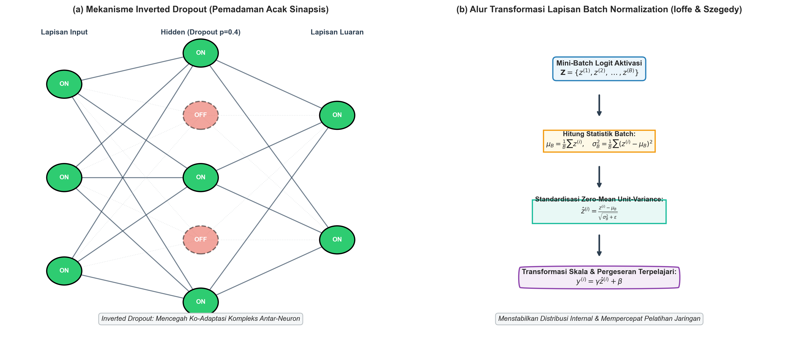
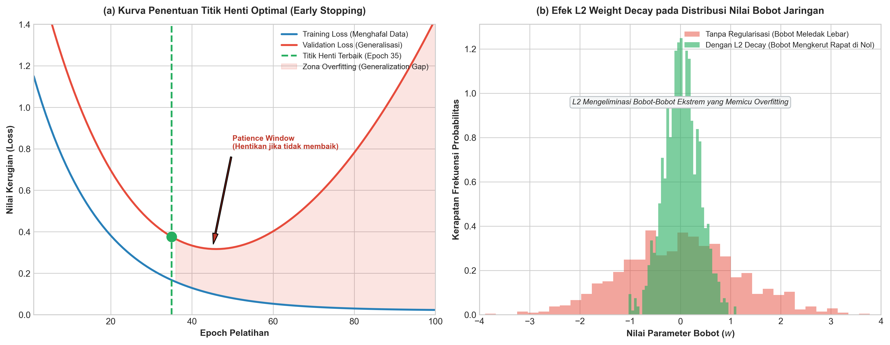

# AI Modul 9.8: Hyperparameter Tuning

---

## 1. Identitas & Kerangka Capaian Pembelajaran (Sub-CPMK)

* **Kode Modul**: AI Modul 9.8
* **Mata Kuliah**: Kecerdasan Buatan dan Sains Data Pertanian Presisi
* **Alokasi Waktu**: 2 x 50 Menit (Kajian Teori & Diskusi) + 2 x 50 Menit (Eksplorasi Praktikum Mandiri)
* **Beban SKS**: 3 SKS
* **Prasyarat**: AI Modul 9.7 (Training Neural Network)
* **Level Kognitif**: Bloom C2 (Memahami), C3 (Menerapkan), C4 (Menganalisis)

```flowchart LR
    A["OUTPUTS: Skrip NumPy & PyTorch Regularisasi (Weight Decay, Dropout, BatchNorm, Early Stopping)"] --> B["OUTCOMES: Mitigasi Overfitting & Stabilisasi Generalisasi Model"]
    B --> C["IMPACTS: Model Deep Learning Tangguh untuk Variasi Lapangan Agrokompleks"]
```

### 1.1 Capaian Pembelajaran Khusus (Sub-CPMK)
Setelah menyelesaikan modul pembelajaran ini secara tuntas, mahasiswa diharapkan memiliki kapabilitas untuk:
1. **Sub-CPMK 9.8.1 (C2):** Menguraikan dasar teoretis disparitas antara galat empiris (*training loss*) dan galat generalisasi (*validation loss*), serta membedah landasan matematis mekanisme penalti bobot ($L_1$ dan $L_2$ *Weight Decay*), *Inverted Dropout*, *Batch Normalization*, dan *Early Stopping*.
2. **Sub-CPMK 9.8.2 (C3):** Mengimplementasikan algoritma *Inverted Dropout* dan normalisasi lapisan mini-batch (*Batch Normalization*) lengkap dengan penyesuaian parameter skala ($\gamma$) dan geser ($\beta$) serta mekanisme pelacakan statistik berjalan (*running statistics*) untuk mode inferensi pada arsitektur jaringan saraf tiruan.
3. **Sub-CPMK 9.8.3 (C4):** Mendiagnosis fenomena *overfitting*, pergeseran kovariat internal (*internal covariate shift*), dan dinamika divergensi gradien pada data tabular multivariat spektral agrokompleks, lalu merumuskan konfigurasi regularisasi komposit yang optimal guna menjamin reliabilitas prediksi model di lapangan perkebunan.

### 1.2 Kerangka Hasil Pembelajaran (Outputs, Outcomes, & Impacts)
- **Luaran Langsung (*Outputs*):** Skrip program Python dan pustaka komputasi numerik murni NumPy serta implementasi PyTorch yang memuat modul regulerisasi (*Weight Decay, Dropout, BatchNorm2d/1d, EarlyStopping*) yang terverifikasi tanpa galat.
- **Dampak Pembelajaran (*Outcomes*):** Mahasiswa memiliki insting rekayasa pembelajaran mesin dalam membedah kapan sebuah model memerlukan penalti pembobotan atau modulasi statistik representasi fitur untuk mencegah fenomena hafalan sampel (*data memorization*).
- **Implikasi Jangka Panjang (*Impacts*):** Terciptanya model kecerdasan buatan berbasis *deep learning* sektor perkebunan dan kehutanan yang tangguh (*robust*), mampu bekerja stabil pada variasi lingkungan musiman baru, serta memiliki daya generalisasi tinggi saat diterapkan pada armada sensor IoT cerdas.

---

## 2. Profil Fundamental Regularisasi dan Generalisasi: Fungsi, Manfaat, dan Keunggulan-Kelemahan

### 2.1 Fungsi Komputasi & Pemodelan Matematis
Dalam paradigma *deep learning*, kapasitas representasional model ditentukan oleh jumlah parameter (bobot dan bias) yang kerap mencapai jutaan hingga miliaran angka. Teorema aproksimasi universal menjamin bahwa jaringan saraf tiruan mampu memetakan sembarang fungsi non-linier kompleks. Namun, fleksibilitas matematis yang sangat tinggi ini menjadi pedang bermata dua: jaringan memiliki kecenderungan alamiah untuk "menghafal" *noise* (derau) dan keanehan spesifik pada data latih (*empirical risk minimization*), alih-alih mempelajari pola struktural yang mendasarinya. 

Fungsi utama dari teknik regularisasi adalah membatasi kapasitas efektif model tanpa mengurangi kapasitas ekspresifnya, mengarahkan proses optimasi menuju solusi parameter yang lebih sederhana, memuluskan lanskap fungsi keputusan, serta menjamin bahwa performa prediksi model pada himpunan data baru yang belum pernah dilihat (*out-of-distribution* atau *test set*) tetap konsisten dengan performa data latih.

### 2.2 Manfaat Nyata di Industri Perkebunan & Agribisnis
Penerapan *deep learning* pada domain pertanian, perkebunan kelapa sawit, dan kehutanan menghadapi tantangan fundamental berupa tingginya variabilitas alami data (*environmental heterogeneity*). Manfaat strategis penerapan regularisasi mencakup:
1. **Ketahanan Terhadap Derau Sensor Lapangan:** Data spektral reflektansi daun dan sensor tanah sering kali terdistorsi oleh fluktuasi intensitas sinar matahari, kabut, kelembaban udara, dan debu. Regularisasi $L_2$ dan *Dropout* mencegah neuron mengandalkan satu kombinasi sinyal sensorik yang rentan derau.
2. **Kompensasi Keterbatasan Sampel Beranotasi:** Pengambilan sampel agronomi (misalnya destruksi daun untuk uji laboratorium kimia NPK atau penetapan rendemen minyak sawit) berbiaya sangat mahal, sehingga ukuran sampel data latih kerap berukuran kecil hingga menengah. Regularisasi bertindak sebagai penopang utama yang memungkinkan arsitektur *deep learning* yang dalam dilatih pada sampel terbatas tanpa mengalami *overfitting* fatal.
3. **Efisiensi Komputasi dan Portabilitas Edge AI:** Regularisasi $L_1$ mendorong terciptanya bobot-bobot nol (*sparse weights*), yang memfasilitasi pemangkasan parameter (*pruning*) guna penerapan model pada mikrokontroler pemetik buah otomatis bertenaga baterai rendah.

### 2.3 Rationale: Alasan Mengapa Metode Ini Digunakan
Secara teoretis, prinsip *Occam's Razor* menyatakan bahwa di antara hipotesis-hipotesis yang memiliki performa empiris setara, hipotesis dengan asumsi paling sederhana adalah yang paling mendekati kebenaran alamiah. 

Secara probabilistik, teknik regularisasi berpadanan langsung dengan estimasi *Maximum A Posteriori* (MAP) dalam kerangka inferensi Bayesian. Regularisasi $L_2$ mengasumsikan distribusi prior Gaussian zero-mean pada parameter bobot, sedangkan regularisasi $L_1$ mengasumsikan distribusi prior Laplace. Di sisi lain, *Dropout* dapat diinterpretasikan secara matematis sebagai aproksimasi Bayesian ensemble dari $2^N$ sub-jaringan berbeda yang berbagi parameter, mereduksi varians prediksi secara eksponensial. *Batch Normalization* memecahkan persoalan ketidakstabilan propagasi maju-mundur dengan menstandarkan masukan setiap lapisan tersembunyi, mereduksi korelasi spasial antaraktivasi, serta memuluskan permukaan gradien loss sehingga laju pembelajaran dapat ditingkatkan secara signifikan.

### 2.4 Analisis Kelebihan dan Kekurangan

| Teknik Regularisasi | Mekanisme Operasional | Keunggulan Utama | Kelemahan & Batasan | Kompleksitas Tambahan |
| :--- | :--- | :--- | :--- | :--- |
| **$L_2$ Regularization (*Weight Decay*)** | Menambahkan penalti kuadrat norma Euclidean bobot ke fungsi rugi. | Menghaluskan permukaan bobot, mencegah pembesaran parameter ekstrem, komputasi analitis sangat efisien. | Tidak menghasilkan sparsity parameter (bobot mengecil mendekati nol tetapi tidak tepat nol). | $\mathcal{O}(P)$ operasi penjumlahan pada gradien ($P$ = jumlah parameter). |
| **$L_1$ Regularization (*Lasso*)** | Menambahkan penalti nilai mutlak norma Manhattan bobot ke fungsi rugi. | Menghasilkan vektor bobot renggang (*sparse*), berfungsi otomatis sebagai seleksi fitur internal. | Fungsi tidak terdiferensiasi pada titik nol (memerlukan sub-gradien), kinerja kurang stabil jika fitur sangat multikolinear. | $\mathcal{O}(P)$ komputasi fungsi tanda (*sign function*). |
| **Inverted Dropout** | Mematikan neuron aktivasi secara acak dengan probabilitas $p$ saat pelatihan dan membagi aktivasi aktif dengan $(1-p)$. | Mencegah ko-adaptasi neuron (*co-adaptation*), mengaproksimasi ensemble arsitektur raksasa secara bebas biaya inferensi. | Memerlukan waktu konvergensi iterasi yang lebih banyak (2-3 kali lipat), tidak aktif saat inferensi. | Pembangkitan bilangan acak binomial $\mathcal{O}(N)$ pada setiap lapisan. |
| **Batch Normalization (BatchNorm)** | Menstandarkan nilai z-score mini-batch lalu melakukan transformasi skala ($\gamma$) dan pergeseran ($\beta$). | Mempercepat konvergensi secara masif, memungkinkan *learning rate* tinggi, memiliki efek samping regularisasi ringan. | Sangat sensitif terhadap ukuran mini-batch kecil ($m < 16$), komputasi inferensi memerlukan pelacakan *running statistics*. | Menyimpan 4 parameter per neuron ($\mu, \sigma^2, \gamma, \beta$) dan sinkronisasi antarperangkat. |
| **Early Stopping** | Menghentikan proses iterasi pelatihan saat galat validasi mulai mengalami peningkatan secara konsisten. | Murni heuristik tanpa modifikasi matematis fungsi rugi, menyelamatkan komputasi, menjamin titik generalisasi optimal. | Berisiko berhenti prematur pada dataran semu (*plateau*), memerlukan alokasi himpunan data validasi representatif. | Pemantauan metrik validasi dan pencadangan memori bobot terbaik (*checkpoint*). |

### 2.5 Contoh Kasus Penggunaan Konkret di Sektor Agro-Industri
1. **Model Estimasi Kandungan Nitrogen Daun Sawit Berbasis Spektroskopi Vis-NIR:**  
   Model dilatih menggunakan spektrum panjang gelombang 400–1000 nm (terdiri atas 600 kanal fitur kontinu). Jumlah pohon sawit sampel hanya 150 pohon. Tanpa regularisasi, MLP 3-lapisan langsung mengalami hafalan sempurna (*train loss* $\approx 0$, *val loss* melonjak tinggi). Penerapan $L_2$ *Weight Decay* ($\lambda = 10^{-3}$) dikombinasikan dengan *Inverted Dropout* ($p = 0.3$) berhasil menurunkan galat validasi rata-rata RMSE dari 0.84% menjadi 0.18% kadar N.
2. **Klasifikasi Citra Multispektral UAV untuk Pemetaan Tutupan Kanopi Hutan:**  
   Penggunaan *Batch Normalization* pada arsitektur dalam multi-skala memungkinkan model menggeneralisasi klasifikasi tegakan pohon jati dan mahoni di tengah perbedaan pencahayaan dramatis antara survei pagi hari dan siang terik di kawasan hutan lindung Wanagama.

### 2.6 Aspek Kritis & Catatan Penting Metode (*Key Critical Insights*)
- **Dikotomi Mode Pelatihan (*Training Mode*) vs Mode Inferensi (*Eval Mode*):**  
  Teknik seperti *Dropout* dan *Batch Normalization* memiliki perilaku yang berbeda secara fundamental pada saat pelatihan dibanding saat inferensi. Pada *Dropout*, pengacakan dinonaktifkan sepenuhnya saat pengujian. Pada *Batch Normalization*, saat inferensi model dilarang menggunakan mean dan varians dari mini-batch uji; model wajib menggunakan akumulasi rata-rata bergerak (*moving average*) yang telah dibekukan dari fase pelatihan. Kelalaian memanggil perintah `model.eval()` dalam PyTorch merupakan sumber kegagalan fatal performa di lingkungan produksi.
- **Sensitivitas Ukuran Mini-Batch pada BatchNorm:**  
  Jika ukuran mini-batch terlalu kecil ($m \le 4$), estimasi statistik mean ($\mu_{\mathcal{B}}$) dan varians ($\sigma_{\mathcal{B}}^2$) menjadi sangat bising (*noisy*), yang justru merusak kestabilan representasi fitur. Dalam skenario data pertanian dengan resolusi citra raksasa di mana mini-batch terbatas, praktisi wajib beralih ke *Layer Normalization* atau *Group Normalization*.

---

---

## 3. Landasan Teori Matematis & Statistik

```
+---------------------------------------------------------------------------------------------------+
|               ARSITEKTUR REGULARISASI: INVERTED DROPOUT DAN BATCH NORMALIZATION                   |
+---------------------------------------------------------------------------------------------------+
|                                                                                                   |
|  [Mini-Batch Input Z] ---> [Hitung Mean & Var] ---> [Standarisasi Z-Score] ---> [Skala & Geser]   |
|          z^(i)                  mu_B, sigma_B^2          z_hat = (z-mu)/sigma        z_tilde      |
|                                                                                    = gamma*z + beta
|                                                                                          |        |
|  [Aktivasi Dropout a] <--- [Inversi Skala 1/(1-p)] <--- [Masking Bernoulli] <-----------+        |
|                                   a_drop = a * r / (1-p)         r ~ Bern(1-p)                    |
+---------------------------------------------------------------------------------------------------+
```

### 3.1 Penalti Pembobotan Norma $L_2$ (*Weight Decay / Ridge*)
Fungsi rugi total dengan penalti $L_2$ didefinisikan sebagai penjumlahan antara fungsi rugi empiris awal $\mathcal{L}_0$ dengan kuadrat norma Frobenius matriks bobot di seluruh $L$ lapisan jaringan:

$$\mathcal{L}_{reg}(\mathbf{W}, \mathbf{b}) = \mathcal{L}_0(\mathbf{W}, \mathbf{b}) + \frac{\lambda}{2m} \sum_{l=1}^{L} \|\mathbf{W}^{[l]}\|_F^2$$

$$\|\mathbf{W}^{[l]}\|_F^2 = \sum_{i=1}^{n^{[l]}} \sum_{j=1}^{n^{[l-1]}} (W_{i,j}^{[l]})^2$$

#### Panduan Pelafalan Matematis
> "L-regulerisasi dari W kapital dan b vektor sama dengan L-nol dari W kapital dan b vektor, ditambah lambda per dua m, dikalikan penjumlahan dari el sama dengan satu hingga L kapital dari norma Frobenius kuadrat W matriks lapisan el."

| Simbol | Tipe Matematis | Definisi dan Keterangan Fisis |
| :--- | :--- | :--- |
| $\mathcal{L}_{reg}$ | Skalar Riil ($\mathbb{R}$) | Nilai fungsi rugi total teraturisasi yang dioptimalkan oleh algoritma. |
| $\mathcal{L}_0$ | Skalar Riil ($\mathbb{R}$) | Fungsi rugi empiris murni (misalnya *Cross-Entropy* atau MSE). |
| $\lambda$ | Skalar Non-negatif ($\mathbb{R}^+$) | Koefisien hiperparameter regularisasi (*weight decay coefficient*). |
| $m$ | Bilangan Bulat Positif ($\mathbb{Z}^+$) | Ukuran mini-batch sampel komputasi. |
| $L$ | Bilangan Bulat Positif ($\mathbb{Z}^+$) | Jumlah total lapisan tersembunyi dan keluaran dalam jaringan. |
| $\mathbf{W}^{[l]}$ | Matriks Dimensi $\mathbb{R}^{n^{[l]} \times n^{[l-1]}}$ | Matriks parameter bobot penimbang pada lapisan $l$. |
| $\|\cdot\|_F$ | Metrik Norma Riil | Norma Frobenius matriks, setara akar kuadrat jumlah elemen kuadrat. |

Dinamika penurunan gradien pada bobot $\mathbf{W}^{[l]}$ dengan penalti $L_2$ dirumuskan sebagai:

$$\frac{\partial \mathcal{L}_{reg}}{\partial \mathbf{W}^{[l]}} = \frac{\partial \mathcal{L}_0}{\partial \mathbf{W}^{[l]}} + \frac{\lambda}{m} \mathbf{W}^{[l]}$$

$$\mathbf{W}^{[l](t+1)} = \mathbf{W}^{[l](t)} - \eta \left( \frac{\partial \mathcal{L}_0}{\partial \mathbf{W}^{[l]}} + \frac{\lambda}{m} \mathbf{W}^{[l](t)} \right) = \left( 1 - \frac{\eta \lambda}{m} \right) \mathbf{W}^{[l](t)} - \eta \frac{\partial \mathcal{L}_0}{\partial \mathbf{W}^{[l]}}$$

Persamaan di atas menunjukkan mengapa regularisasi $L_2$ disebut *Weight Decay*: sebelum bobot diperbarui ke arah lawan gradien, nilai bobot lama $\mathbf{W}^{[l](t)}$ dipotong (*decayed*) oleh faktor pengali $(1 - \frac{\eta \lambda}{m})$ yang nilainya berada sedikit di bawah $1.0$.

### 3.2 Penalti Pembobotan Norma $L_1$ (*Lasso*)
Pada regularisasi $L_1$, penalti dihitung berdasarkan jumlah absolut dari seluruh koefisien parameter:

$$\mathcal{L}_{reg}(\mathbf{W}, \mathbf{b}) = \mathcal{L}_0(\mathbf{W}, \mathbf{b}) + \frac{\lambda}{m} \sum_{l=1}^{L} \|\mathbf{W}^{[l]}\|_1 = \mathcal{L}_0(\mathbf{W}, \mathbf{b}) + \frac{\lambda}{m} \sum_{l=1}^{L} \sum_{i} \sum_{j} |W_{i,j}^{[l]}|$$

Gradien terhadap bobot melibatkan fungsi tanda (*sub-gradient sign function*):

$$\frac{\partial \mathcal{L}_{reg}}{\partial \mathbf{W}^{[l]}} = \frac{\partial \mathcal{L}_0}{\partial \mathbf{W}^{[l]}} + \frac{\lambda}{m} \text{sign}(\mathbf{W}^{[l]})$$

$$\text{sign}(w) = \begin{cases} +1, & w > 0 \\ 0, & w = 0 \\ -1, & w < 0 \end{cases}$$

#### Panduan Pelafalan Matematis
> "Turunan parsial L-regulerisasi terhadap W matriks lapisan el sama dengan turunan parsial L-nol terhadap W matriks lapisan el, ditambah lambda per m dikalikan fungsi signum dari elemen-elemen matriks W lapisan el."

### 3.3 Algoritma Inverted Dropout
Dropout meniadakan kontribusi simpul neuron secara stokastik pada fase propagasi maju. Untuk mempertahankan skala ekspektasi aktivasi tanpa perlu mengalikan bobot pada fase inferensi, digunakan teknik *Inverted Dropout*:

$$\mathbf{r}^{[l]} \sim \text{Bernoulli}(1 - p)$$

$$\mathbf{\tilde{a}}^{[l]} = \frac{\mathbf{a}^{[l]} \odot \mathbf{r}^{[l]}}{1 - p}$$

#### Panduan Pelafalan Matematis
> "Vektor r lapisan el ditarik dari distribusi Bernoulli dengan parameter satu minus p. Vektor a-tilda lapisan el sama dengan hasil perkalian Hadamard vektor aktivasi a lapisan el dengan vektor biner r, dibagi dengan skalar satu minus p."

| Simbol | Tipe Matematis | Definisi dan Keterangan Fisis |
| :--- | :--- | :--- |
| $p$ | Skalar Probabilitas $[0, 1)$ | Tingkat dropout (*dropout rate*), probabilitas neuron dipadamkan. |
| $1 - p$ | Skalar Probabilitas $(0, 1]$ | Tingkat retensi neuron (*keep probability*). |
| $\mathbf{r}^{[l]}$ | Vektor Biner $\{0, 1\}^{n^{[l]}}$ | Masker penutup stokastik; bernilai 1 jika aktif, 0 jika dipadamkan. |
| $\mathbf{a}^{[l]}$ | Vektor Aktivasi $\mathbb{R}^{n^{[l]}}$ | Nilai keluaran fungsi aktivasi murni sebelum penapisan dropout. |
| $\odot$ | Operator Hadamard | Perkalian elemen-demi-elemen (*element-wise product*). |
| $\mathbf{\tilde{a}}^{[l]}$ | Vektor Aktivasi Tereduksi | Vektor aktivasi teregulasi yang diumpankan ke lapisan berikutnya. |

Secara matematis, ekspektasi nilai aktivasi tereduksi terbukti invariant terhadap nilai probabilitas retensi:

$$\mathbb{E}[\mathbf{\tilde{a}}^{[l]}] = \frac{\mathbb{E}[\mathbf{a}^{[l]} \odot \mathbf{r}^{[l]}]}{1 - p} = \frac{\mathbf{a}^{[l]} \cdot (1 - p)}{1 - p} = \mathbf{a}^{[l]}$$

Ekuivalensi ekspektasi ini memungkinkan model langsung dievaluasi pada saat inferensi dengan menetapkan $\mathbf{\tilde{a}}^{[l]} = \mathbf{a}^{[l]}$ tanpa penskalaan tambahan.

### 3.4 Batch Normalization (Ioffe & Szegedy, 2015)
Diberikan himpunan nilai pre-aktivasi mini-batch $\mathcal{B} = \{\mathbf{z}^{(1)}, \mathbf{z}^{(2)}, \dots, \mathbf{z}^{(m)}\}$ untuk lapisan tertentu dengan dimensi $d$:

1. **Rata-rata Mini-Batch:**
   $$\mu_{\mathcal{B}} = \frac{1}{m} \sum_{i=1}^{m} \mathbf{z}^{(i)}$$

2. **Varians Mini-Batch:**
   $$\sigma_{\mathcal{B}}^2 = \frac{1}{m} \sum_{i=1}^{m} (\mathbf{z}^{(i)} - \mu_{\mathcal{B}})^2$$

3. **Standarisasi Z-Score:**
   $$\hat{\mathbf{z}}^{(i)} = \frac{\mathbf{z}^{(i)} - \mu_{\mathcal{B}}}{\sqrt{\sigma_{\mathcal{B}}^2 + \epsilon}}$$

4. **Transformasi Skala dan Geser (*Affine Transformation*):**
   $$\mathbf{\tilde{z}}^{(i)} = \gamma \odot \hat{\mathbf{z}}^{(i)} + \beta \equiv \text{BN}_{\gamma, \beta}(\mathbf{z}^{(i)})$$

#### Panduan Pelafalan Matematis
> "Mu mini-batch sama dengan satu per m dikalikan sigma i sama dengan satu hingga m dari vektor z indeks i. Sigma kuadrat mini-batch sama dengan satu per m dikalikan sigma kuadrat selisih z indeks i terhadap mu mini-batch. Z-topi indeks i sama dengan selisih z indeks i dikurangi mu mini-batch, dibagi akar dari kuadrat varians mini-batch ditambah epsilon skalar penstabil. Z-tilda indeks i sama dengan gamma vektor skala dikalikan Hadamard z-topi indeks i, ditambah beta vektor pergeseran."

| Simbol | Tipe Matematis | Definisi dan Keterangan Fisis |
| :--- | :--- | :--- |
| $\mu_{\mathcal{B}}$ | Vektor Dimensi $\mathbb{R}^d$ | Nilai rata-rata empiris pre-aktivasi sepanjang dimensi batch sampel. |
| $\sigma_{\mathcal{B}}^2$ | Vektor Dimensi $\mathbb{R}^d$ | Varians empiris dari pre-aktivasi sepanjang dimensi batch sampel. |
| $\epsilon$ | Konstanta Riil ($10^{-5}$) | Skalar numerik penjamin pembagi tidak bernilai nol (*epsilon stabilizer*). |
| $\hat{\mathbf{z}}^{(i)}$ | Vektor Dimensi $\mathbb{R}^d$ | Vektor aktivasi terstandar dengan rata-rata 0 dan varians 1. |
| $\gamma$ | Vektor Parameter $\mathbb{R}^d$ | Parameter terpelajari (*learnable scale factor*) pengatur dispersi aktivasi. |
| $\beta$ | Vektor Parameter $\mathbb{R}^d$ | Parameter terpelajari (*learnable shift factor*) pengatur rata-rata aktivasi. |

Pada fase inferensi, parameter mini-batch $\mu_{\mathcal{B}}$ dan $\sigma_{\mathcal{B}}^2$ digantikan oleh estimasi rata-rata bergerak populasi (*running statistics*) yang diperbarui secara kontinu selama pelatihan dengan koefisien momentum $\alpha$:

$$\mu_{run} \leftarrow (1 - \alpha) \mu_{run} + \alpha \mu_{\mathcal{B}}$$

$$\sigma_{run}^2 \leftarrow (1 - \alpha) \sigma_{run}^2 + \alpha \sigma_{\mathcal{B}}^2$$

### 3.5 Pemantauan Kriteria Early Stopping
Kriteria penghentian dini dirumuskan melalui fungsi toleransi keterpurukan validasi:

$$\text{PatienceCounter}(t) = \begin{cases} 0, & \text{jika } \mathcal{L}_{val}^{(t)} < \mathcal{L}_{val}^{min} - \delta \\ \text{PatienceCounter}(t-1) + 1, & \text{lainnya} \end{cases}$$

Kondisi terminasi terpenuhi saat $\text{PatienceCounter}(t) \ge P_{threshold}$, di mana sistem segera menghentikan pelatihan dan mengembalikan parameter terbaik $\mathbf{\Theta}^* = \arg\min_{\mathbf{\Theta}} \mathcal{L}_{val}$.

---

---

## 4. Visualisasi Arsitektur & Prosedur Komputasi Numerik

Berikut adalah visualisasi komprehensif dari arsitektur *Inverted Dropout*, *Batch Normalization*, serta dinamika kurva evaluasi *Early Stopping* yang telah distandarkan untuk kebutuhan publikasi ilmiah.


*Gambar 1: Arsitektur komputasional Inverted Dropout dan Batch Normalization. (Kiri) Mekanisme pemutusan koneksi neuron secara stokastik dengan penskalaan balik inversi probabilitas $1/(1-p)$. (Kanan) Transformasi 4-tahap Batch Normalization dari reduksi dimensi batch, standarisasi numerik, hingga pemulihan kapasitas representasional melalui parameter affine $\gamma$ dan $\beta$.*


*Gambar 2: Analisis dinamika kurva evaluasi dan generalisasi. (Kiri) Mekanisme Early Stopping dengan batas kesabaran (patience) untuk menangkap bobot parameter optimal pada titik infleksi sebelum overfitting. (Kanan) Perbandingan disparitas galat empiris dan galat validasi pada model tanpa regularisasi vs model dengan kombinasi regularisasi terpadu.*

---

### Prosedur Komputasi & Alur Algoritma Numerik

Berikut adalah struktur algoritmik langkah-demi-langkah implementasi forward dan backward pass untuk lapisan *Inverted Dropout* dan *Batch Normalization*:

```
====================================================================================================
ALGORITMA 8.6: FORWARD & BACKWARD PASS INVERTED DROPOUT & BATCH NORMALIZATION
====================================================================================================
Masukan: 
  - Matriks aktivasi Z berukuran (m, d)
  - Parameter terpelajari gamma, beta berukuran (1, d)
  - Running mean mu_run, running variance var_run berukuran (1, d)
  - Hiperparameter: p (dropout rate), alpha (momentum BN), mode ('train' atau 'eval')
Keluaran:
  - Aktivasi teregulasi A_out, cache komputasi untuk backprop

PROSEDUR INVERTED DROPOUT (A, p, mode):
1. JIKA mode == 'train' MAKA:
     Pembangkitan mask: R = (np.random.rand(*A.shape) >= p).astype(float)
     A_drop = (A * R) / (1.0 - p)
     cache_dropout = (R, p)
     KEMBALIKAN A_drop, cache_dropout
2. LAINNYA (mode == 'eval'):
     KEMBALIKAN A, None

PROSEDUR BATCH NORMALIZATION FORWARD (Z, gamma, beta, mu_run, var_run, alpha, mode):
1. JIKA mode == 'train' MAKA:
     mu_B = (1.0 / m) * np.sum(Z, axis=0, keepdims=True)
     var_B = (1.0 / m) * np.sum((Z - mu_B)**2, axis=0, keepdims=True)
     Z_norm = (Z - mu_B) / np.sqrt(var_B + 1e-5)
     Z_tilde = gamma * Z_norm + beta
     
     // Pembaruan Statistik Berjalan
     mu_run = (1.0 - alpha) * mu_run + alpha * mu_B
     var_run = (1.0 - alpha) * var_run + alpha * var_B
     cache_bn = (Z, Z_norm, mu_B, var_B, gamma)
     KEMBALIKAN Z_tilde, mu_run, var_run, cache_bn
2. LAINNYA (mode == 'eval'):
     Z_norm = (Z - mu_run) / np.sqrt(var_run + 1e-5)
     Z_tilde = gamma * Z_norm + beta
     KEMBALIKAN Z_tilde, mu_run, var_run, None
====================================================================================================
```

---

---

## 5. Studi Kasus Komputasi & Dataset Agrokompleks

### Deskripsi Masalah dan Karakteristik Data
Dalam industri kelapa sawit presisi, pabrik kelapa sawit (PKS) memerlukan sistem automasi untuk memprediksi asam lemak bebas (*Free Fatty Acids* / FFA) dan rendemen minyak sawit mentah (*Crude Palm Oil* / CPO) berdasarkan 120 indikator fisik-kimiawi tanah, pemupukan mikro, curah hujan bulanan, serta reflektansi spektrometri tandan buah segar (TBS). 

Total sampel data yang tersedia sangat terbatas, yakni hanya $N = 350$ blok panen. Jaringan saraf tiruan multi-lapisan (MLP) dengan konfigurasi [120, 128, 64, 32, 1] memiliki total lebih dari 26.000 parameter bebas. Rasio antara jumlah parameter dan jumlah sampel mencapai $> 74:1$, memicu risiko *overfitting* ekstrem di mana model dengan cepat mencapai korelasi $R^2 = 0.99$ pada data latih namun anjlok hingga $R^2 < 0.20$ pada blok panen validasi.

### Implementasi Solusi Numerik Menggunakan NumPy & PyTorch
Berikut adalah skrip implementasi komputasi numerik murni yang merealisasikan teknik *Weight Decay*, *Inverted Dropout*, *Batch Normalization*, dan *Early Stopping* untuk mengatasi dilema over-parametrisasi data agrokompleks tersebut:

```python
import numpy as np

class RegularizedDenseLayer:
    """Lapisan Fully-Connected dengan L2 Regularization & Inverted Dropout terintegrasi."""
    def __init__(self, in_features, out_features, dropout_rate=0.0):
        self.W = np.random.randn(in_features, out_features) * np.sqrt(2.0 / in_features)
        self.b = np.zeros((1, out_features))
        self.dropout_rate = dropout_rate
        self.mask = None
        
    def forward(self, X, mode='train'):
        self.X = X
        self.Z = np.dot(X, self.W) + self.b
        
        # Inverted Dropout logic
        if mode == 'train' and self.dropout_rate > 0.0:
            self.mask = (np.random.rand(*self.Z.shape) >= self.dropout_rate).astype(float)
            self.Z_out = (self.Z * self.mask) / (1.0 - self.dropout_rate)
        else:
            self.Z_out = self.Z
            self.mask = None
        return self.Z_out

    def backward(self, dZ_out, l2_lambda=0.0, m=1):
        if self.mask is not None:
            dZ = (dZ_out * self.mask) / (1.0 - self.dropout_rate)
        else:
            dZ = dZ_out
            
        self.dW = np.dot(self.X.T, dZ) / m + (l2_lambda / m) * self.W
        self.db = np.sum(dZ, axis=0, keepdims=True) / m
        dX = np.dot(dZ, self.W.T)
        return dX


class BatchNormalizationLayer:
    """Implementasi Batch Normalization murni dengan pelacakan running statistics."""
    def __init__(self, num_features, momentum=0.1, eps=1e-5):
        self.gamma = np.ones((1, num_features))
        self.beta = np.zeros((1, num_features))
        self.running_mean = np.zeros((1, num_features))
        self.running_var = np.ones((1, num_features))
        self.momentum = momentum
        self.eps = eps

    def forward(self, Z, mode='train'):
        if mode == 'train':
            m = Z.shape[0]
            self.mu = np.mean(Z, axis=0, keepdims=True)
            self.var = np.var(Z, axis=0, keepdims=True)
            self.Z_norm = (Z - self.mu) / np.sqrt(self.var + self.eps)
            out = self.gamma * self.Z_norm + self.beta
            
            # Update running statistics (Exponential Moving Average)
            self.running_mean = (1 - self.momentum) * self.running_mean + self.momentum * self.mu
            self.running_var = (1 - self.momentum) * self.running_var + self.momentum * self.var
            return out
        else:
            Z_norm = (Z - self.running_mean) / np.sqrt(self.running_var + self.eps)
            return self.gamma * Z_norm + self.beta


class EarlyStoppingHandler:
    """Pemantau konvergensi validasi dengan toleransi patience."""
    def __init__(self, patience=10, min_delta=1e-4):
        self.patience = patience
        self.min_delta = min_delta
        self.counter = 0
        self.best_loss = np.inf
        self.early_stop = False
        self.best_weights = None

    def __call__(self, val_loss, current_weights):
        if val_loss < self.best_loss - self.min_delta:
            self.best_loss = val_loss
            self.counter = 0
            self.best_weights = current_weights
        else:
            self.counter += 1
            if self.counter >= self.patience:
                self.early_stop = True
```

---

---

## 6. Kekeliruan Metodologis dan Praktik Terbaik (*Common Pitfalls & Best Practices*)

### 6.1 Kekeliruan Umum Metodologis (*Common Pitfalls*)
Dalam menerapkan teknik regularisasi dan generalisasi pada arsitektur *deep learning*, praktisi kerap melakukan kekeliruan konseptual yang merusak integritas evaluasi:
1. **Mengaktifkan Dropout pada Saat Tahap Inferensi / Pengujian:**  
   Tidak menonaktifkan masker binomial saat inferensi mengakibatkan keluaran prediksi model bersifat stokastik dan tidak konsisten. Pada PyTorch, selalu pastikan `model.train()` beralih ke `model.eval()`, atau pada fungsi manual pastikan parameter `mode='eval'` diaktifkan.
2. **Menghitung Batch Normalization pada Seluruh Dataset Sebelum Pemisahan (*Data Leakage*):**  
   Melakukan standarisasi statistik batch sebelum pemisahan data latih dan uji membocorkan informasi sebaran data uji ke dalam proses optimasi, menghasilkan metrik validasi yang optimis semu.
3. **Menerapkan Penalti $L_2$ (*Weight Decay*) pada Parameter Bias ($b$):**  
   Secara teoritis, regularisasi ditujukan untuk membatasi kemiringan kurva hipotesis (*curvature/capacity*), bukan membatasi posisi translasi garis batas keputusan. Memaksakan penalti pada bias dapat menyebabkan model kesulitan menggeser nilai prediksi ke basis nilai target yang tinggi (*underfitting*).
4. **Salah Memahami Interaksi Dropout dan Batch Normalization (*The Dropout-BatchNorm Variance Shift*):**  
   Menempatkan lapisan *Dropout* tepat sebelum *Batch Normalization* dapat memicu ketidakstabilan numerik. Hal ini disebabkan varians mini-batch yang dihitung BN saat pelatihan terdistorsi oleh fluktuasi masker Bernoulli, namun saat evaluasi varians tersebut berubah secara drastis karena semua neuron aktif. Praktik terbaik adalah menempatkan *Batch Normalization* sebelum fungsi aktivasi non-linier, dan menaruh *Dropout* setelahnya jika memang diperlukan.

### 6.2 Mitigasi Bias Data Agronomi
1. **Bias Kebun Tunggal (*Single-Estate Sampling Bias*):**  
   Karakteristik tanah dan curah hujan pada satu perkebunan kelapa sawit sering kali homogen. Model yang dilatih tanpa teknik pengacakan blok geografis (*spatial-block cross validation*) akan mengalami *overfitting* spasial. Mitigasi dilakukan dengan menerapkan *spatial cross-validation* dan regularisasi bobot yang ketat.
2. **Bias Varietas Bibit Pertanian:**  
   Penyebaran varietas tanaman (misalnya klon bibit sawit Marihat vs Dami Mas) yang tidak seimbang dalam data latih menyebabkan model mengabaikan karakteristik spektral varietas minoritas. Penerapan regularisasi penalti selektif dan augmentasi representasi laten menjadi keharusan.

### 6.3 Praktik Terbaik Rekayasa Perangkat Lunak AI
1. **Penerapan *Gradient Clipping* Bersama Normalisasi Lapisan:**  
   Guna menjaga kestabilan aliran gradien pada jaringan saraf tiruan berbobot dalam, gunakan *gradient clipping* berbasis norma Euclidean maksimum ($\|\mathbf{g}\| \le \theta$) bersama dengan *Batch Normalization*.
2. **Automasi *Checkpointing* Berbasis Validasi:**  
   Jangan pernah menyimpan bobot jaringan dari *epoch* terakhir tanpa verifikasi metrik validasi (*unconditional checkpointing*). Selalu implementasikan mekanisme *ModelCheckpoint* yang memantau nilai metrik evaluasi independen (*validation loss* atau *validation F1-score*).

---

---

## 7. Rangkuman Modul

1. **Dilema Generalisasi vs Hafalan**: Model deep learning berkapasitas tinggi rentan mengalami *overfitting* pada variasi musiman data agrokompleks, menuntut regulasi kapasitas efektif jaringan.
2. **Penalti Bobot $L_2$ dan $L_1$**: *Weight Decay* ($L_2$) meredam magnitudo bobot secara proporsional menuju nol melalui peluruhan eksponensial, sedangkan Lasso ($L_1$) mendorong bobot bernilai nol eksak sehingga menciptakan seleksi fitur (*sparsity*).
3. **Inverted Dropout**: Teknik regularisasi stokastik yang menonaktifkan neuron secara acak dengan probabilitas $p$ saat pelatihan, diskalakan dengan faktor $1/(1-p)$ sehingga fase evaluasi (`model.eval()`) berjalan deterministik tanpa komputasi tambahan.
4. **Batch Normalization**: Menstabilkan distribusi aktivasi internal per mini-batch menggunakan rata-rata dan varians sampel, mereduksi sensitivitas inisialisasi bobot, serta berfungsi sebagai regularizer implisit yang mempercepat konvergensi.
5. **Early Stopping & Checkpointing**: Mekanisme pemantauan galat validasi dengan batas kesabaran (*patience*) yang secara otomatis memulihkan bobot terbaik (*best checkpoint restore*), mencegah pemborosan komputasi saat model mulai menghafal derau.

---

## 8. Latihan Soal & Tugas Analitis HOTS

### Deskripsi Proyek Mandiri Terpandu
Mahasiswa diwajibkan menyelesaikan proyek rekayasa generalisasi model cerdas berikut:

**Judul Proyek:**  
*Mitigasi Overfitting pada Arsitektur Deep Multi-Layer Perceptron untuk Diagnostik Kualitas Minyak Atsiri Sereh Wangi Berdasarkan Profil Kromatografi Gas.*

**Spesifikasi Teknis:**
1. **Dataset:** 450 sampel kromatogram fraksinasi kimia minyak atsiri serai wangi (*Cymbopogon nardus*) yang memuat 80 puncak retensi senyawa kimia volatil. Target luaran adalah kemurnian kandungan sitronelal (%).
2. **Tantangan Masalah:** Ukuran dataset kecil dengan multikolinearitas tinggi antar-puncak spektrum.
3. **Instruksi Tugas:**
   - Bangun arsitektur dasar MLP dengan 4 lapisan tersembunyi tanpa regularisasi sebagai model dasar (*baseline*). Plot kurva galat latih vs validasi dan buktikan terjadinya *overfitting*.
   - Bangun model pembanding dengan mengintegrasikan $L_2$ *Weight Decay* ($\lambda = 0.005$), *Inverted Dropout* ($p = 0.25$), dan *Batch Normalization*.
   - Konfigurasi modul *Early Stopping* dengan ambang batas `patience=15` dan buktikan pemulihan bobot terbaik (*best checkpoint restore*).
   - Analisis perbedaan bobot sebelum dan sesudah penalti $L_2$ melalui visualisasi histogram distribusi parameter bobot matriks.

---

### Rubrik Penilaian Holistik (*Higher-Order Thinking Skills*)

| Kriteria / Dimensi | Bobot (%) | Sangat Memuaskan (85 - 100) | Memuaskan (70 - 84) | Kurang Memuaskan (< 70) |
| :--- | :--- | :--- | :--- | :--- |
| **Pemahaman Teoretis & Matematis (C2)** | 25% | Mampu menurunkan secara analitis fungsi penalti $L_1/L_2$, membuktikan invarian ekspektasi *Inverted Dropout*, dan merumuskan transformasi 4-tahap *Batch Normalization* secara presisi. | Menjelaskan konsep dasar regularisasi dengan benar namun terdapat ketidaklengkapan dalam pembuktian analitis ekspektasi atau statistik berjalan BN. | Gagal menjelaskan prinsip dasar komputasi matematis penalti bobot atau salah memahami fungsi normalisasi mini-batch. |
| **Implementasi Komputasi & Pemrograman (C3)** | 35% | Berhasil mengonstruksi skrip Python murni NumPy untuk *Dropout*, *BatchNorm*, dan *EarlyStopping* yang teruji bebas galat, serta membedakan mode pelatihan dan evaluasi secara tepat. | Skrip program berjalan namun terdapat kelemahan logika minor (misalnya lupa menerapkan faktor $1/(1-p)$ pada saat pelatihan atau penanganan running average kurang mulus). | Program gagal dieksekusi (*runtime error*) atau logika penonaktifan dropout saat pengujian tidak diimplementasikan. |
| **Analisis Diagnostik & Solusi Rekayasa (C4)** | 40% | Mahasiswa mampu membaca anomali kurva belajar, mengidentifikasi gejala ledakan bobot atau pergeseran kovariat, serta merekomendasikan konfigurasi hiperparameter regularisasi komposit yang optimal. | Mampu membaca kurva belajar dasar namun analisis mitigasi bias dan penjelasan interaksi Dropout-BatchNorm kurang mendalam. | Tidak mampu menginterpretasikan grafik galat latih vs validasi dan tidak memahami konsep *early stopping*. |

---

---

## 9. Jembatan Konsep (Bridging) ke AI Modul 9.9: Framework Deep Learning (TensorFlow & PyTorch)

Dengan dituntaskannya Modul 8.6 ini, seluruh fondasi arsitektur Jaringan Saraf Tiruan (*Deep Neural Networks* / MLP), kalkulus propagasi maju dan mundur (*Backpropagation*), algoritma optimasi penurunan gradien adaptif (SGD, Momentum, RMSprop, Adam), serta teknik-teknik pengendalian generalisasi (*Weight Decay, Inverted Dropout, Batch Normalization, Early Stopping*) telah dikuasai secara mendalam.

Meskipun demikian, sebuah model dengan regularisasi paling canggih sekalipun akan gagal total jika kualitas representasi data masukan tidak dikelola dengan benar (*Garbage In, Garbage Out*). Dalam domain agrokompleks nyata—yang melibatkan ratusan pita reflektansi spektral Vis-NIR, sensor IoT kelembaban tanah, dan perbedaan afdeling perkebunan—terdapat bahaya laten yang sangat merusak: **autokorelasi spasial** dan **kebocoran data (*data leakage*)**. Membagi data secara acak tanpa memperhatikan batas geografis blok kebun akan memicu optimisme performa semu yang runtuh seketika saat diuji di afdeling baru.

Oleh karena itu, pada **AI Modul 8.7: Preprocessing Dataset**, kita akan beralih dari teori arsitektur murni menuju rekayasa alur kerja data (*data workflow engineering*) khusus deep learning:
* **Partisi Spasial Blok Kebun (*Spatial Block Partitioning*)**: Membagi data latih, validasi, dan uji berbasis blok geografis nyata guna menjamin validitas evaluasi generalisasi.
* **Isolasi Parameter Skala (*Strict Zero-Leakage Rule*)**: Memastikan seluruh transformasi skala ($Z$-score, Robust Scaler) dihitung (*fit*) murni dari data latih.
* **Konstruksi PyTorch Dataset & DataLoader Kustom**: Membangun generator mini-batch berkinerja tinggi lengkap dengan mekanisme *shuffling*, penanganan ketidakseimbangan kelas (*Weighted Random Sampling*), dan alokasi memori GPU (`pin_memory`).

---

## 10. Daftar Pustaka dan Referensi Akademik

1. Goodfellow, I., Bengio, Y., & Courville, A. (2016). *Deep Learning*. MIT Press.
2. Ioffe, S., & Szegedy, C. (2015). Batch Normalization: Accelerating Deep Network Training by Reducing Internal Covariate Shift. *Proceedings of the 32nd International Conference on Machine Learning (ICML 2015)*, PMLR 37:448-456.
3. Srivastava, N., Hinton, G., Krizhevsky, A., Sutskever, I., & Salakhutdinov, R. (2014). Dropout: A Simple Way to Prevent Neural Networks from Overfitting. *Journal of Machine Learning Research*, 15(56), 1929-1958.
4. Bishop, C. M. (2006). *Pattern Recognition and Machine Learning*. Springer.
5. Zhang, A., Lipton, Z. C., Li, M., & Smola, A. J. (2023). *Dive into Deep Learning*. Cambridge University Press.
6. Prechelt, L. (1998). Early Stopping - But When?. In G. Orr & K. R. Müller (Eds.), *Neural Networks: Tricks of the Trade*. Lecture Notes in Computer Science, vol 1524. Springer, Berlin, Heidelberg.
7. Li, X., Chen, S., Hu, X., & Yang, J. (2019). Understanding the Disharmony between Dropout and Batch Normalization by Variance Shift. *Proceedings of the IEEE/CVF Conference on Computer Vision and Pattern Recognition (CVPR 2019)*, 2682-2690.
8. Murphy, K. P. (2022). *Probabilistic Machine Learning: An Introduction*. MIT Press.
