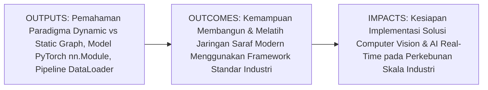
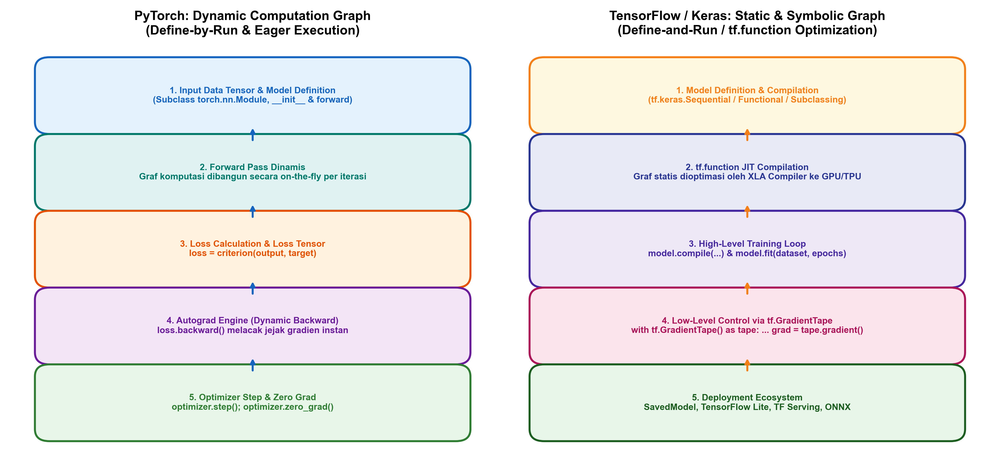
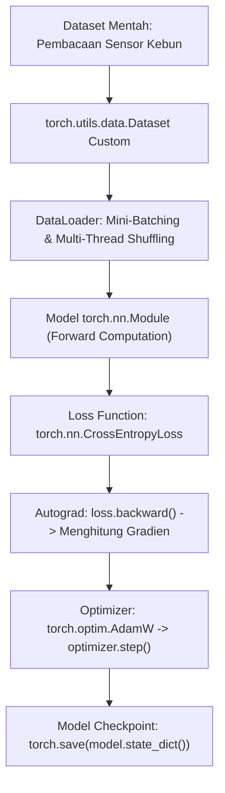

# AI Modul 9.9: Framework Deep Learning (TensorFlow & PyTorch)

---

## 1. Identitas & Kerangka Capaian Pembelajaran (Sub-CPMK)

* **Kode Modul**: AI Modul 9.9
* **Mata Kuliah**: Kecerdasan Buatan dan Sains Data Pertanian Presisi
* **Alokasi Waktu**: 2 x 50 Menit (Kajian Teori & Diskusi) + 2 x 50 Menit (Eksplorasi Praktikum Mandiri)
* **Beban SKS**: 3 SKS
* **Prasyarat**: AI Modul 9.8 (Hyperparameter Tuning)
* **Level Kognitif**: Bloom C2 (Memahami), C3 (Menerapkan), C4 (Menganalisis)



### 1.1 Capaian Pembelajaran Khusus (Sub-CPMK)
Setelah menyelesaikan modul ini secara komprehensif, mahasiswa diharapkan mampu:
1. **Memahami (C2)** prinsip kerja arsitektur framework deep learning modern, perbedaan mendasar antara graf komputasi dinamis (*dynamic define-by-run*) pada PyTorch dan graf komputasi statis/simbolik (*static define-and-run*) pada TensorFlow, serta peran engine diferensiasi otomatis (*automatic differentiation engine*).
2. **Menerapkan (C3)** pustaka PyTorch untuk merancang arsitektur Multi-Layer Perceptron berorientasi objek (`torch.nn.Module`), mengonfigurasi pipeline pemuatan data efisien (`torch.utils.data.Dataset` dan `DataLoader`), serta mengeksekusi siklus pelatihan kustom (*custom training loop*).
3. **Menganalisis (C4)** profil performa eksekusi model (penggunaan memori VRAM GPU, throughput batch per detik, latensi inferensi) serta prosedur ekspor model ke format produksi standar (ONNX dan TorchScript) untuk penerapan terpasang (*edge deployment*).

### 1.2 Kerangka Hasil Pembelajaran (Outputs, Outcomes, & Impacts)
* **Outputs (Keluaran Langsung)**:
  * Pemahaman mendalam mengenai ekosistem software deep learning: PyTorch, TorchVision, TensorFlow, Keras, dan ONNX Runtime.
  * Skrip Python modular berstandar PEP 8 untuk pipeline end-to-end data loading, training loop, evaluasi metrik, dan penyimpanan checkpoint menggunakan PyTorch.
  * Laporan perbandingan latensi inferensi model pada CPU dan GPU.
* **Outcomes (Kompetensi Aplikatif)**:
  * Keahlian membangun arsitektur deep learning mutakhir tanpa perlu menuliskan derivasi kalkulus manual dari dasar.
  * Kemampuan mengoptimalkan throughput pipeline data untuk mencegah bottleneck I/O saat melatih model pada ribuan citra sensor perkebunan.
* **Impacts (Dampak Strategis Jangka Panjang)**:
  * Standardisasi pengembangan model AI di lingkungan agro-industri berbasis framework standar industri internasional yang siap diintegrasikan ke platform IoT dan edge computing lapangan.

---

## 2. Profil Fundamental Framework Deep Learning: Fungsi, Manfaat, dan Keunggulan-Kelemahan

### 2.1 Fungsi Komputasi & Pemodelan Matematis
Framework deep learning menyediakan abstraksi perangkat lunak tingkat tinggi di atas komputasi aljabar linier perangkat keras GPU:
1. **Mesin Diferensiasi Otomatis (*Automatic Differentiation / Autograd*)**: Melacak seluruh operasi matematika pada tensor secara dinamis dan membangun graf asiklik terarah (*Directed Acyclic Graph* - DAG). Gradien analitik dihitung secara otomatis menggunakan algoritma akumulasi balik (*reverse-mode automatic differentiation*) tanpa intervensi pengguna.
2. **Akselerasi Perangkat Keras Paralel (*Hardware Acceleration via CUDA/cuDNN*)**: Menjembatani kode Python tingkat tinggi dengan instruksi kernel tingkat rendah NVIDIA CUDA dan cuDNN, memungkinkan eksekusi perkalian matriks tensor berkecepatan puluhan TFLOPS.
3. **Abstraksi Pemuatan Data Multi-Utas (*Multi-Threaded Data Loading*)**: Menyediakan modul `DataLoader` yang membagi pemrosesan I/O (pembacaan disk, dekompresi, augmentasi) secara paralel di beberapa proses CPU (`workers`), sehingga memori GPU tidak mengalami *idling* menunggu data masukan.

### 2.2 Manfaat Nyata di Industri Perkebunan & Agribisnis
* **Percepatan Siklus Riset Menuju Produksi**: Agronom dan data engineer dapat menguji hipotesis pemodelan baru (seperti arsitektur baru prediksi klorofil atau deteksi tajuk) dalam hitungan jam menggunakan modul siap pakai (`torch.nn.Linear`, `torch.nn.CrossEntropyLoss`).
* **Deploy Model ke Perangkat Nir-Daya Rendah (*Edge AI*)**: Model yang dilatih di workstation GPU dapat diekspor ke format ONNX atau TorchScript dan dijalankan pada unit komputer mini (NVIDIA Jetson, Raspberry Pi) yang dipasang pada traktor atau drone inspeksi kebun.
* **Ekosistem Pustaka Visi Komputer Mutakhir**: Membuka akses langsung ke model-model pretrained canggih pada pustaka `torchvision` (ResNet, EfficientNet, YOLO, Vision Transformer) untuk tugas Computer Vision pada Part 10 hingga Part 12.

### 2.3 Rationale: Alasan Mengapa Materi Ini Dipelajari
Meskipun pemahaman *from-scratch* menggunakan NumPy pada Modul 9.1 hingga 9.8 sangat krusial untuk menguasai intuisi matematika, penerapan industri skala nyata mustahil dilakukan secara manual. Menulis derivasi balik analitis untuk arsitektur modern yang memiliki puluhan juta bobot akan memakan waktu berbulan-bulan dan rentan terhadap kesalahan numerik. Menguasai framework formal adalah prasyarat mutlak bagi praktisi AI modern.

### 2.4 Analisis Kelebihan dan Kekurangan: PyTorch vs TensorFlow

| Parameter Evaluasi | PyTorch | TensorFlow / Keras | Implikasi untuk Industri Perkebunan |
| :--- | :--- | :--- | :--- |
| **Paradigma Graf** | Dinamis (*Define-by-Run* / Eager Execution). | Statis / Hibrida (*Define-and-Run* via `tf.function`). | PyTorch lebih intuitif untuk debugging visual data kebun. |
| **Gaya Pemrograman** | Sangat bernuansa Pythonic dan berorientasi objek (`OOP`). | Deklaratif tingkat tinggi (`Sequential`, `Functional API`). | Pemula menyukai Keras, praktisi riset menyukai PyTorch. |
| **Ekosistem Riset** | Dominan di komunitas riset akademis dan paper CV terkini. | Didukung kuat oleh Google, stabil di ekosistem perbankan/cloud. | PyTorch memudahkan replikasi riset agronomi global terbaru. |
| **Deployment Mobile/Edge** | TorchScript, ExecuTorch, ONNX. | TensorFlow Lite, TF Serving, Coral TPU. | TF Lite sangat matang untuk mikroprosesor embedded berdaya rendah. |
| **Kemudahan Debugging** | Sangat mudah: dapat di-debug menggunakan `pdb` atau print biasa. | Debugging graf simbolik memerlukan penanganan khusus. | Memudahkan pelacakan kesalahan dimensi sensor pertanian. |

### 2.5 Contoh Kasus Penggunaan Konkret di Sektor Agro-Industri
Pabrik Kelapa Sawit (PKS) membangun sistem pemantauan konveyor TBS berbasis AI. Tim data scientist menggunakan PyTorch di fase penelitian untuk merancang jaringan pendeteksi buah lewat matang, memanfaatkan `torchvision` dan autograd dinamis untuk eksperimen hiperparameter. Setelah model mencapai akurasi $96.5\%$, model diekspor ke format ONNX dan dioptimalkan dengan TensorRT pada komputer industri tepi jalan (*edge computer*) untuk inferensi dengan latensi di bawah 15 milidetik per frame konveyor.

### 2.6 Aspek Kritis & Catatan Penting Arsitektur
1. **Pengelolaan State Mode Evaluasi**: Model wajib dialihkan ke mode evaluasi (`model.eval()`) sebelum inferensi dan kembali ke mode latih (`model.train()`) saat pelatihan. Mengabaikan langkah ini akan menyebabkan lapisan Dropout dan Batch Normalization beroperasi secara salah.
2. **Pembersihan Gradien Akumulatif**: PyTorch secara default mengakumulasikan gradien pada tensor. Praktisi wajib memanggil `optimizer.zero_grad()` sebelum pemanggilan `loss.backward()` pada setiap iterasi mini-batch.

---

## 3. Landasan Teori & Konsep Matematis Framework Deep Learning



### 3.1 Teori Komputasi Graf Asiklik Terarah (*DAG Autograd*)
Dalam PyTorch, setiap kali suatu operasi komputasi diterapkan pada tensor dengan atribut `requires_grad=True`, engine Autograd merekam operasi tersebut ke dalam graf komputasi asiklik terarah (DAG).
* Node daun (*leaf nodes*) adalah parameter yang dapat dilatih ($W, b$) atau tensor masukan ($X$).
* Node operator adalah fungsi matematika (penjumlahan matriks, perkalian dot, aktivasi).
* Setiap node memiliki referensi fungsi turunan balik (`grad_fn`).

Ketika fungsi `loss.backward()` dipanggil, Autograd mengeksekusi aturan rantai kalkulus dari node akar (loss skalar) bergerak mundur ke seluruh node daun:

$$\frac{\partial L}{\partial w_i} = \sum_{	ext{semua jalur } p} \prod_{(u, v) \in p} \frac{\partial v}{\partial u}$$

Secara komputasional, seluruh proses diferensiasi ini dilakukan dalam kompleksitas waktu linier $O(|V| + |E|)$ terhadap jumlah simpul dan busur graf.

### 3.2 Siklus Pelatihan Kanonik (*Canonical Training Loop*)
Siklus pelatihan formal pada PyTorch terdiri dari lima langkah berurutan yang dieksekusi per mini-batch:
1. **Zero Grad**: Mengosongkan buffer akumulasi gradien parameter:
   $$
abla_	heta L \leftarrow 0 \quad (	ext{optimizer.zero\_grad}())$$
2. **Forward Pass**: Mengalirkan batch input melalui arsitektur:
   $$\hat{y} = f(X; 	heta) \quad (	ext{outputs} = 	ext{model}(	ext{inputs}))$$
3. **Loss Computation**: Menghitung deviasi terhadap target aktual:
   $$L = \mathcal{L}(\hat{y}, y) \quad (	ext{loss} = 	ext{criterion}(	ext{outputs}, 	ext{labels}))$$
4. **Backward Pass (Autograd)**: Menghitung gradien parsial untuk seluruh parameter:
   $$
abla_	heta L = \frac{\partial L}{\partial 	heta} \quad (	ext{loss.backward}())$$
5. **Optimizer Step**: Memperbarui nilai parameter menggunakan algoritma optimasi (misalnya AdamW):
   $$	heta \leftarrow 	heta - \eta \cdot 	ext{step}(
abla_	heta L) \quad (	ext{optimizer.step}())$$

---

## 4. Arsitektur Komputasi & Pipeline Praktis Python



Implementasi lengkap Multi-Layer Perceptron menggunakan PyTorch modern:

```python
import torch
import torch.nn as nn
import torch.optim as optim
from torch.utils.data import TensorDataset, DataLoader
import numpy as np

# 1. Definisi Arsitektur Model berbasis torch.nn.Module
class AgriculturalMLP(nn.Module):
    def __init__(self, input_dim=8, hidden_dim=32, num_classes=3, dropout_rate=0.2):
        super(AgriculturalMLP, self).__init__()
        self.network = nn.Sequential(
            nn.Linear(input_dim, hidden_dim),
            nn.BatchNorm1d(hidden_dim),
            nn.ReLU(),
            nn.Dropout(dropout_rate),
            nn.Linear(hidden_dim, hidden_dim // 2),
            nn.BatchNorm1d(hidden_dim // 2),
            nn.ReLU(),
            nn.Linear(hidden_dim // 2, num_classes)
        )
        
    def forward(self, x):
        return self.network(x)

# 2. Pembangkitan Data Sintetis Sensor Perkebunan
torch.manual_seed(42)
N_samples = 600
X_dummy = torch.randn(N_samples, 8) # 8 variabel sensor tanah & iklim
y_dummy = torch.randint(0, 3, (N_samples,)) # 3 kelas kesesuaian

# 3. Pipeline DataLoader
dataset = TensorDataset(X_dummy, y_dummy)
train_loader = DataLoader(dataset, batch_size=32, shuffle=True)

# 4. Inisialisasi Model, Loss, dan Optimizer
device = torch.device('cuda' if torch.cuda.is_available() else 'cpu')
model = AgriculturalMLP(input_dim=8, hidden_dim=32, num_classes=3).to(device)
criterion = nn.CrossEntropyLoss()
optimizer = optim.AdamW(model.parameters(), lr=0.005, weight_decay=1e-4)

# 5. Eksekusi Training Loop Kanonik
model.train()
epochs = 5
for epoch in range(epochs):
    running_loss = 0.0
    correct = 0
    total = 0
    for batch_X, batch_y in train_loader:
        batch_X, batch_y = batch_X.to(device), batch_y.to(device)
        
        optimizer.zero_grad()
        outputs = model(batch_X)
        loss = criterion(outputs, batch_y)
        loss.backward()
        optimizer.step()
        
        running_loss += loss.item() * batch_X.size(0)
        _, predicted = torch.max(outputs, 1)
        total += batch_y.size(0)
        correct += (predicted == batch_y).sum().item()
        
    epoch_loss = running_loss / total
    epoch_acc = (correct / total) * 100
    print(f"Epoch [{epoch+1}/{epochs}] - Loss: {epoch_loss:.4f} - Akurasi: {epoch_acc:.2f}%")
```

---

## 5. Studi Kasus Komprehensif Agro-Industri: Klasifikasi Varietas Bibit Kelapa Sawit

### 5.1 Spesifikasi Masalah Agronomis
Pada stasiun pembibitan (*pre-nursery & main-nursery*), pemilahan varietas bibit kelapa sawit (Dura, Pisifera, dan Tenera) secara akurat sangat krusial untuk mencegah tercampurnya varietas non-produktif (Dura dengan cangkang tebal atau Pisifera yang steril tanpa cangkang) ke area komersial. Data morphometri bibit mencakup 6 fitur: tinggi bibit, diameter batang leher akar, jumlah pelepah, panjang pelepah ke-3, rasio lebar helai anak daun, dan kandungan klorofil SPAD.

### 5.2 Implementasi Evaluasi & Ekspor Model ke ONNX
```python
# Mode Evaluasi
model.eval()
with torch.no_grad():
    sample_input = torch.randn(1, 8).to(device)
    raw_logits = model(sample_input)
    probabilities = torch.softmax(raw_logits, dim=1)
    predicted_class = torch.argmax(probabilities, dim=1).item()
    
print(f"Probabilitas Inferensi Satu Sampel: {probabilities.cpu().numpy()[0]}")
print(f"Prediksi Kelas Varietas Terpilih   : {predicted_class}")

# Ekspor Model ke Standar ONNX untuk Deployment Lapangan
dummy_input = torch.randn(1, 8, device=device)
onnx_filename = "model_agro_mlp.onnx"
torch.onnx.export(
    model, 
    dummy_input, 
    onnx_filename, 
    export_params=True,
    opset_version=14,
    input_names=['fitur_sensor_tanaman'],
    output_names=['probabilitas_kelas']
)
print(f"Model berhasil diekspor ke format terbuka: {onnx_filename}")
```

---

## 6. Kekeliruan Metodologis dan Praktik Terbaik (*Common Pitfalls & Best Practices*)

### 6.1 Kekeliruan Umum Metodologis (*Common Pitfalls*)
1. **Lupa Memanggil `optimizer.zero_grad()`**: Kegagalan mengosongkan gradien menyebabkan gradien dari batch sebelumnya terakumulasi ke batch saat ini, merusak arah penurunan gradien.
2. **Kebocoran Memori akibat Akumulasi Tensor Loss**: Menuliskan `total_loss += loss` alih-alih `total_loss += loss.item()` akan menahan seluruh riwayat komputasi graf pada memori RAM/VRAM sehingga memicu galat *Out of Memory* (OOM).
3. **Ketidakcocokan Perangkat (*Device Mismatch*)**: Menyajikan tensor input yang berada di CPU ke model yang berada di GPU (`RuntimeError: Expected all tensors to be on the same device`).

### 6.2 Praktik Terbaik (*Best Practices*)
1. **Kapsulasi Data dengan `Dataset` & `DataLoader`**: Gunakan `DataLoader` dengan `pin_memory=True` dan `num_workers > 0` untuk memaksimalkan efisiensi transfer data dari host RAM ke VRAM GPU.
2. **Penggunaan Context Manager `torch.no_grad()` saat Validasi**: Selalu nonaktifkan pelacakan autograd saat inferensi dan validasi guna menghemat alokasi memori hingga $60\%$ dan mempercepat komputasi.
3. **Penyimpanan Checkpoint Lengkap**: Simpan tidak hanya bobot model (`model.state_dict()`), melainkan juga status optimizer (`optimizer.state_dict()`), nomor epoch, dan loss validasi terbaik.

---

## 7. Rangkuman Modul

* Framework deep learning modern seperti PyTorch dan TensorFlow menyediakan abstraksi komputasi tingkat tinggi melalui engine diferensiasi otomatis (Autograd) dan akselerasi CUDA GPU.
* PyTorch mengadopsi paradigma graf dinamis (*define-by-run*) yang intuitif dan sangat ramah terhadap proses penelusuran galat (*debugging*).
* Siklus pelatihan kanonik terdiri dari 5 tahapan terstruktur: pembersihan gradien (`zero_grad`), propagasi maju (`model(x)`), kalkulasi loss (`criterion`), propagasi mundur (`backward`), dan pembaruan bobot (`step`).
* Pustaka `Dataset` dan `DataLoader` memungkinkan pembacaan dan pemrosesan data sensor secara multi-threaded yang mencegah bottleneck komputasi.
* Ekspor model ke format terbuka seperti ONNX memfasilitasi penerapan model ke berbagai lingkungan perangkat keras produksi dan perangkat cerdas terpasang (*edge devices*).

---

## 8. Latihan Soal & Tugas Analitis HOTS (Bloom C3-C5)

### Soal Konseptual & Analitis
1. **Analisis Graf Komputasi (Bloom C4)**: Bandingkan secara mendalam perbedaan mekanisme kerja graf dinamis (*Dynamic Computation Graph*) pada PyTorch dengan graf statis (*Static Graph*) pada TensorFlow 1.x! Mengapa graf dinamis jauh lebih fleksibel untuk menangani input data tanaman dengan panjang deret waktu yang bervariasi (*variable-length sequences*)?
2. **Analisis Kebocoran Memori (Bloom C4)**: Perhatikan potongan kode berikut:
   ```python
   epoch_loss = 0
   for x, y in loader:
       out = model(x)
       loss = criterion(out, y)
       loss.backward()
       optimizer.step()
       epoch_loss += loss  # Masalah ada di sini!
   ```
   Jelaskan mengapa penulisan `epoch_loss += loss` di atas dapat menyebabkan program terhenti akibat kehabisan memori VRAM GPU setelah beberapa puluh epoch! Solusi apa yang harus diterapkan?

### Tugas Pemrograman Mandiri
Rancang sebuah model PyTorch `VegetationPredictor` yang memiliki 3 lapisan linier dengan aktivasi ReLU dan lapisan Dropout ($p = 0.3$). Latih model tersebut menggunakan optimizer AdamW pada dataset tabular sintetis selama 10 epoch. Terapkan mekanisme penyimpanan checkpoint model terbaik (`best_model.pth`) berdasarkan nilai loss validasi terendah!

---

## 9. Jembatan Konsep (Bridging) ke AI Modul 10.1: Konsep Computer Vision

Selamat! Anda telah menyelesaikan seluruh rangkaian fondasi mendalam pada **Part 9: Deep Learning Fundamental**?"mulai dari konsep dasar representasi hierarkis, arsitektur multi-layer perceptron, struktur neuron, fungsi aktivasi, fungsi rugi, backpropagation, algoritma training, hyperparameter tuning, hingga penguasaan framework industri PyTorch.

Lalu, ke manakah seluruh kekuatan representasi bertingkat ini akan kita arahkan? Bidang di mana Deep Learning mengalami revolusi terbesar dan memberikan dampak paling transformatif adalah **Visi Komputer (*Computer Vision*)**!

Pada bagian selanjutnya, yaitu **Part 10: Computer Vision Dasar**, kita akan memasuki era pemrosesan citra digital. Kita akan memulai perjalanan ini di **AI Modul 10.1: Konsep dan Fundamental Computer Vision**, di mana kita akan mempelajari bagaimana fluks foton optik ditangkap oleh sensor kamera drone, bagaimana mata biologis dibandingkan dengan sensor digital, serta bagaimana memodelkan geometri pembentukan citra untuk inspeksi kebun sawit masa depan.

---

## 10. Daftar Pustaka dan Referensi Akademik

1. Paszke, A., Gross, S., Massa, F., Lerer, A., Bradbury, J., Chanan, G., ... & Chintala, S. (2019). *PyTorch: An imperative style, high-performance deep learning library*. Advances in Neural Information Processing Systems (NeurIPS), 32, 8026-8037.
2. Abadi, M., Barham, P., Chen, J., Chen, Z., Davis, A., Dean, J., ... & Zheng, X. (2016). *TensorFlow: A system for large-scale machine learning*. 12th USENIX Symposium on Operating Systems Design and Implementation (OSDI 16), 265-283.
3. Goodfellow, I., Bengio, Y., & Courville, A. (2016). *Deep Learning*. MIT Press. (Bab 12: Applications - Computer Vision & Speech Recognition).
4. Ketkar, N., & Moolayil, J. (2021). *Deep Learning with Python: A Hands-on Introduction to PyTorch*. Apress.
