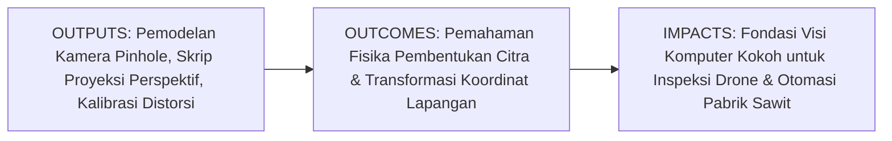
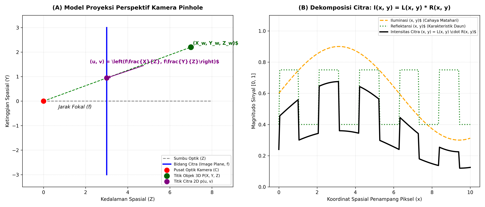
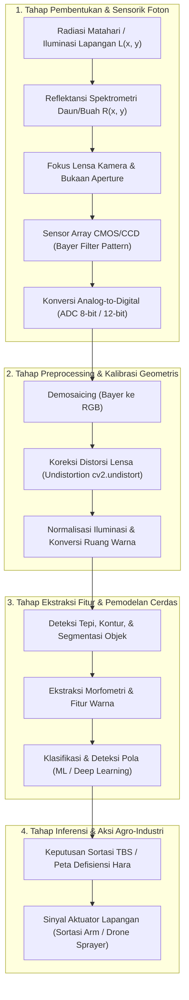

# AI Modul 10.1: Konsep dan Fundamental Computer Vision

---

## 1. Identitas & Kerangka Capaian Pembelajaran (Sub-CPMK)

* **Kode Modul**: AI Modul 10.1
* **Mata Kuliah**: Kecerdasan Buatan dan Sains Data Pertanian Presisi
* **Alokasi Waktu**: 2 x 50 Menit (Kajian Teori & Diskusi) + 2 x 50 Menit (Eksplorasi Praktikum Mandiri)
* **Beban SKS**: 3 SKS
* **Prasyarat**: AI Modul 8.11 (Pembuatan Sistem Prediksi Sederhana)
* **Level Kognitif**: Bloom C2 (Memahami), C3 (Menerapkan), C4 (Menganalisis)



### 1.1 Capaian Pembelajaran Khusus (Sub-CPMK)
Setelah menyelesaikan modul ini secara komprehensif, mahasiswa diharapkan mampu:
1. **Memahami (C2)** prinsip dasar pembentukan citra visual, analogi struktural antara sistem penglihatan biologis manusia (kornea, lensa, retina, sel fotoreseptor batang dan kerucut) dengan sistem penginderaan kamera digital (lensa optik, sensor CCD/CMOS, *Bayer color filter array*, dan konverter analog-ke-digital).
2. **Menerapkan (C3)** formulasi matematika model kamera lubang jarum (*pinhole camera model*), matriks transformasi intrinsik ($\mathbf{K}$) dan ekstrinsik ($[\mathbf{R} \mid \mathbf{t}]$), serta dekomposisi fungsi intensitas iluminasi-reflektansi ($I = L \cdot R$) menggunakan pustaka NumPy dan OpenCV pada citra kanopi perkebunan kelapa sawit.
3. **Menganalisis (C4)** tantangan komputasi visi (*vision challenges*) pada lingkungan terbuka (*unconstrained agricultural environment*)—mencakup variasi iluminasi matahari dinamis, distorsi lensa sudut lebar drone (*barrel distortion*), oklusi dedaunan, dan hilangnya informasi kedalaman 3D akibat proyeksi perspektif 2D.

### 1.2 Kerangka Hasil Pembelajaran (Outputs, Outcomes, & Impacts)
* **Outputs (Keluaran Langsung)**:
  * Pemahaman mendalam mengenai fisika optik pembentukan citra dan persamaan proyeksi geometri perspektif.
  * Skrip Python modular berstandar PEP 8 untuk simulasi proyeksi titik koordinat spasial 3D ke bidang piksel 2D dan kompensasi distorsi radial lensa.
  * Laporan analisis kuantitatif mengenai pergeseran nilai piksel akibat perubahan sudut datang sinar matahari (*solar zenith angle*) pada kanopi kelapa sawit.
* **Outcomes (Kompetensi Aplikatif)**:
  * Kemampuan mengonfigurasi parameter optik kamera dan merancang rig akuisisi citra yang andal untuk stasiun sortasi pabrik maupun armada drone pemantau kebun.
  * Keahlian dalam memisahkan komponen iluminasi lingkungan dari komponen reflektansi fisik tanaman guna mencegah galat klasifikasi spektral.
* **Impacts (Dampak Strategis Jangka Panjang)**:
  * Modernisasi operasional perkebunan melalui transisi dari inspeksi visual manual yang subyektif dan melelahkan menuju inspeksi optik otomatis presisi tinggi.
  * Peningkatan akurasi sensus populasi pohon sawit, estimasi kesehatan tanaman skala luas, dan efisiensi sortasi Tandan Buah Segar (TBS) di pabrik kelapa sawit.

---

## 2. Profil Fundamental Computer Vision: Fungsi, Manfaat, dan Keunggulan-Kelemahan

### 2.1 Fungsi Komputasi & Pemodelan Matematis
Visi Komputer (*Computer Vision*) adalah disiplin ilmu rekayasa komputasi yang bertujuan untuk **merekonstruksi, menginterpretasi, dan memahami dunia 3 dimensi nyata dari sekumpulan citra atau video 2 dimensi**. Secara matematis dan fungsional, visi komputer bekerja melalui:
1. **Pemetaan Proyeksi Optik ke Digital**: Mentransformasikan radiasi fluks foton elektromagnetik kontinu yang dipantulkan objek di ruang 3D ($\mathbb{R}^3$) menjadi kisi diskrit matriks intensitas energi berdimensi dua ($I(u, v) \in \mathbb{N}^{H \times W}$).
2. **Inversi Masalah Tak Tentu (*Solving Ill-Posed Inverse Problems*)**: Berbeda dengan grafika komputer (*computer graphics*) yang membangkitkan citra 2D dari model 3D, visi komputer melakukan pembalikan (*inversion*): mengestimasi sifat permukaan, geometri 3D, jarak kedalaman, dan label semantik objek hanya dari data matriks piksel 2D.
3. **Penyaringan Fitur Representatif**: Mereduksi redundansi jutaan nilai piksel mentah menjadi representasi kompak (titik sudut, tepi, kontur, tekstur, atau vektor fitur laten) yang memfasilitasi pengambilan keputusan terotomatisasi.

### 2.2 Manfaat Nyata di Industri Perkebunan & Agribisnis
Penerapan visi komputer memberikan transformasi efisiensi yang masif pada rantai nilai agro-industri kelapa sawit:
* **Sensus dan Inventarisasi Kanopi Pohon Otomatis**: Citra ortofoto dari wahana udara nirawak (*drone*) dianalisis untuk menghitung jumlah pohon sawit per blok perkebunan, mengukur diameter tajuk, dan memetakan tingkat kerapatan tanaman secara instan.
* **Sortasi Kematangan Tandan Buah Segar (TBS) di Pabrik Kelapa Sawit (PKS)**: Sistem kamera industri yang dipasang di atas konveyor *loading ramp* mengklasifikasikan fraksi kematangan buah (mentah, kurang matang, matang sempurna, lewat matang) secara objektif tanpa intervensi manual pekerja, meminimalkan penalti asam lemak bebas (FFA).
* **Deteksi Dini Hama & Penyakit Tanaman**: Mendeteksi gejala awal infeksi jamur busuk pangkal batang (*Ganoderma boninense*) atau serangan hama ulat api (*Setothosea asigna*) melalui diskolorasi daun dan kanopi yang terekam kamera multispektral.

### 2.3 Rationale: Alasan Mengapa Metode Ini Digunakan
Mengapa industri pertanian modern beralih ke Visi Komputer terlepas dari kompleksitas algoritmanya?
1. **Pengukuran Non-Destruktif & Nir-Sentuh (*Non-Contact Sensing*)**: Pemeriksaan visual tidak merusak jaringan tanaman, buah, atau komoditas panen, memungkinkan pemantauan berkelanjutan sepanjang siklus hidup tanaman.
2. **Eliminasi Subjektivitas & Kelelahan Manusia**: Mata manusia rentan terhadap ilusi optik, kelelahan fisik setelah memeriksa ribuan ton buah, serta inkonsistensi penilaian antar-operator. Algoritma visi komputer memberikan standar evaluasi yang konsisten $24/7$.
3. **Cakupan Skala Makro hingga Mikro**: Visi komputer dapat dioperasikan pada citra satelit (skala ratusan hektar), ortofoto drone (skala blok kebun), kamera stasiun sortasi (skala tandan buah), hingga mikroskop digital (skala spora jamur).
4. **Efisiensi Finansial Rantai Pasok**: Otomasi deteksi buah afkir di pintu masuk pabrik mencegah pemborosan energi perebusan (*sterilization energy*) dan penurunan mutu rendemen CPO.

### 2.4 Analisis Kelebihan dan Kekurangan

| Dimensi Evaluasi | Kelebihan (*Strengths*) | Kekurangan (*Limitations*) |
|:---|:---|:---|
| **Objektivitas Penilaian** | Konsistensi matematis tinggi; metrik warna dan bentuk diukur secara eksak tanpa dipengaruhi faktor emosional manusia. | Sangat sensitif terhadap anomali pencahayaan lingkungan jika tidak dikalibrasi secara radiometrik. |
| **Kecepatan & Skalabilitas** | Mampu memproses puluhan *frame per second* (FPS) pada kamera video dan memindai ribuan hektar citra drone dalam hitungan menit. | Memerlukan perangkat keras komputasi grafis (GPU/TPU) untuk pemrosesan citra resolusi tinggi secara *real-time*. |
| **Kekayaan Informasi** | Menyediakan informasi spasial, tekstur, geometri, dan spektral secara simultan dalam satu tangkapan data. | Mengalami kehilangan dimensi kedalaman (*loss of depth*) akibat pemipihan proyeksi perspektif 3D ke 2D. |
| **Keterandalan Lapangan** | Mampu beroperasi pada spektrum di luar batas mata manusia (Near-Infrared / NIR, Thermal Inframerah). | Menghadapi tantangan oklusi parah (daun saling tumpang tindih) dan bayangan tajam kanopi pohon di kebun. |

### 2.5 Contoh Kasus Penggunaan Konkret di Sektor Agro-Industri
1. **Inspeksi Kepadatan Gulma Menggunakan Kamera Traktor Otonom**: Sistem visi komputer mendeteksi rumpun gulma di antara gawangan pohon kelapa sawit dan secara selektif mengaktifkan nosel herbisida presisi (*spot spraying*), menghemat biaya pestisida hingga $60\%$.
2. **Pengukuran Luas Tajuk (*Canopy Coverage*) untuk Estimasi Kebutuhan Pupuk**: Drone terbang di atas afdeling perkebunan dan algoritma visi menghitung rasio tutupan hijau kanopi terhadap area tanah terbuka untuk rekomendasi dosis pupuk per pokok.
3. **Grading Otomatis Biji Kopi / Kernel Sawit**: Sistem konveyor berkecepatan tinggi memeriksa cacat bentuk, keretakan, dan diskolorasi kernel sawit menggunakan kamera *line-scan*.

### 2.6 Aspek Kritis & Catatan Penting Metode (*Key Critical Insights*)
* **Masalah Inversi yang Tak Ditentukan Sempurna (*Ill-Posed Inverse Problem*)**: Satu titik koordinat piksel $(u, v)$ pada citra 2D dapat berasal dari titik mana saja di sepanjang garis sinar proyeksi 3D tak berhingga. Untuk memulihkan ukuran fisik objek nyata, sistem visi komputer memerlukan informasi tambahan: skala referensi (*fiducial markers*), kamera stereo, sensor LiDAR, atau kalibrasi ketinggian terbang wahana drone.
* **Variabilitas Iluminasi Lapangan Terbuka**: Cahaya matahari berubah drastis antara jam 08:00 pagi, 12:00 siang, dan kondisi tertutup awan mendung (*cloud shadows*). Mengandalkan nilai intensitas RGB mentah tanpa normalisasi atau penyesuaian ruang warna (*color constancy*) akan menyebabkan model klasifikasi mutu buah runtuh di lapangan.
* **Distorsi Lensa Kamera**: Lensa sudut lebar (*wide-angle lens*) pada kamera drone murah sering kali menghasilkan distorsi barel melengkung (*barrel distortion*). Kalibrasi geometris kamera wajib dilakukan sebelum pengukuran jarak atau luas kanopi dilakukan.



---

## 3. Landasan Teori Matematis & Fisika Optik Pembentukan Citra

### 3.1 Model Pembentukan Citra: Iradians dan Reflektansi
Secara fisika optik, intensitas cahaya monokromatik yang ditangkap oleh elemen sensor pada koordinat spasial kontinu $(x, y)$ dinyatakan sebagai perkalian dua komponen fundamental:

$$I(x, y) = L(x, y) \cdot R(x, y)$$

Di mana nilai intensitas berada pada rentang terbatas fisik:
$$0 < I(x, y) < \infty, \quad 0 < L(x, y) < \infty, \quad 0 \leq R(x, y) \leq 1$$

#### Panduan Pelafalan dan Cara Membaca Notasi Matematika
* $I(x, y) = L(x, y) \cdot R(x, y)$: Dibaca *"I dari x koma y sama dengan L dari x koma y dikalikan R dari x koma y"*.
* $L(x, y)$: Melambangkan **Iluminasi (*Illumination*)**, yaitu jumlah energi fluks cahaya dari sumber radiasi (matahari atau lampu) yang jatuh mengenai permukaan objek per satuan luas (diukur dalam lux atau lumen $/ \text{m}^2$). Bersifat bervariasi lambat secara spasial.
* $R(x, y)$: Melambangkan **Reflektansi (*Reflectance*)**, yaitu proporsi energi cahaya yang dipantulkan kembali oleh permukaan materi objek (diukur dalam fraksi tanpa satuan $[0, 1]$). Bersifat unik terhadap sifat kimiawi daun atau kulit buah dan bervariasi cepat pada batas objek.
* $I(x, y)$: Melambangkan **Intensitas Citra (*Image Intensity*)** yang terukur oleh sensor.

### 3.2 Model Kamera Lubang Jarum (Pinhole Camera Model)
Model kamera lubang jarum memproyeksikan titik koordinat dunia 3D $\mathbf{P}_w = [X_w, Y_w, Z_w]^T$ ke bidang citra 2D $\mathbf{p} = [u, v]^T$ melalui pusat optik kamera $\mathbf{C}$.

Dalam geometri koordinat homogen (*homogeneous coordinates*), relasi proyeksi linier perspektif dinyatakan sebagai:

$$s \begin{bmatrix} u \\ v \\ 1 \end{bmatrix} = \mathbf{K} \begin{bmatrix} \mathbf{R} & \mathbf{t} \end{bmatrix} \begin{bmatrix} X_w \\ Y_w \\ Z_w \\ 1 \end{bmatrix}$$

Di mana:
* $s = Z_c$ adalah faktor skala kedalaman titik dalam koordinat kamera (*camera depth coordinate*).
* $\mathbf{K}$ adalah **Matriks Parameter Intrinsik Kamera** berukuran $3 \times 3$:

$$\mathbf{K} = \begin{bmatrix} f_x & s_{\theta} & c_x \\ 0 & f_y & c_y \\ 0 & 0 & 1 \end{bmatrix}$$

* $\begin{bmatrix} \mathbf{R} & \mathbf{t} \end{bmatrix}$ adalah **Matriks Parameter Ekstrinsik Kamera** berukuran $3 \times 4$, yang mentransformasikan titik dari koordinat dunia (*world frame*) ke koordinat kamera (*camera frame*):

$$\mathbf{R} \in \mathbb{R}^{3 \times 3} \quad (\text{Matriks Rotasi Ortonormal, } \mathbf{R}^T \mathbf{R} = \mathbf{I}), \quad \mathbf{t} \in \mathbb{R}^{3 \times 1} \quad (\text{Vektor Translasi Posisi})$$

#### Panduan Pelafalan dan Cara Membaca Notasi Matematika
* $s [u, v, 1]^T$: Dibaca *"skalar s dikalikan vektor kolom koordinat homogen u, v, satu"*.
* $\mathbf{K}$: Dibaca *"matriks kalibrasi intrinsik K"*.
* $f_x, f_y$: Dibaca *"jarak fokal f-x dan f-y dalam satuan piksel"*, di mana $f_x = f / d_x$ dan $f_y = f / d_y$ ($f$ adalah jarak fokal fisik dalam mm, $d_x, d_y$ adalah ukuran fisik piksel sensor).
* $c_x, c_y$: Dibaca *"titik prinsip c-x dan c-y"*, melambangkan titik perpotongan sumbu optik pada sensor citra (*principal point*), umumnya mendekati titik pusat sensor $(W/2, H/2)$.
* $s_{\theta}$: Parameter skew (kemiringan sudut sumbu sensor, bernilai 0 pada sensor modern persegi panjang).

### 3.3 Pemodelan Distorsi Lensa Optik (Radial & Tangensial)
Lensa fisik kamera nyata tidak mengikuti geometri *pinhole* sempurna. Lensa mengalami kelengkungan yang menyebabkan distorsi geometris.

#### 1. Distorsi Radial (Radial Distortion)
Terjadi karena berkas cahaya mengalami refraksi lebih kuat pada tepi lensa daripada di pusat lensa (*barrel* atau *pincushion distortion*):

$$\begin{aligned}
x_{\text{distorsi}} &= x_n (1 + k_1 r^2 + k_2 r^4 + k_3 r^6) \\
y_{\text{distorsi}} &= y_n (1 + k_1 r^2 + k_2 r^4 + k_3 r^6)
\end{aligned}$$

Di mana:
* $x_n = X_c / Z_c$ dan $y_n = Y_c / Z_c$ adalah koordinat ternormalisasi bidang kamera.
* $r^2 = x_n^2 + y_n^2$ adalah kuadrat jarak radial dari pusat optik.
* $k_1, k_2, k_3$ adalah koefisien distorsi radial.

#### 2. Distorsi Tangensial (Tangential Distortion)
Terjadi jika susunan lensa optik tidak terpasang sejajar secara sempurna dengan bidang datar sensor silikon:

$$\begin{aligned}
x_{\text{distorsi}} &= x_n + [2 p_1 x_n y_n + p_2 (r^2 + 2 x_n^2)] \\
y_{\text{distorsi}} &= y_n + [p_1 (r^2 + 2 y_n^2) + 2 p_2 x_n y_n]
\end{aligned}$$

Di mana $p_1, p_2$ adalah koefisien distorsi tangensial. Vektor parameter distorsi lengkap OpenCV dinyatakan sebagai $\mathbf{D} = [k_1, k_2, p_1, p_2, k_3]$.

---

## 4. Visualisasi Arsitektur & Pipeline Komputasi Visual

Pipeline komputasi visi komputer dirancang secara berjenjang (*hierarchical pipeline*) mulai dari akuisisi foton optik fisik hingga keluaran instruksi keputusan industri:



### Prosedur Komputasi & Alur Algoritma Numerik
Prosedur inti kalibrasi dan proyeksi geometris diimplementasikan melalui algoritma standar berikut:

```
====================================================================================================
ALGORITMA PROYEKSI PINHOLE & KOMPENSASI DISTORSI
Masukan:
  - Koordinat Objek 3D Dunia: P_w = [X_w, Y_w, Z_w]^T
  - Matriks Rotasi R (3x3), Vektor Translasi t (3x1)
  - Matriks Intrinsik K (3x3), Koefisien Distorsi D = [k1, k2, p1, p2, k3]
Keluaran:
  - Koordinat Piksel Terdistorsi (u_dist, v_dist) dan Koordinat Terkoreksi (u_ideal, v_ideal)

PROSEDUR:
1. Transformasi ke Koordinat Kamera:
     P_c = R * P_w + t  ==>  [X_c, Y_c, Z_c]^T
2. Normalisasi Perspektif:
     x_n = X_c / Z_c,   y_n = Y_c / Z_c
     r^2 = x_n^2 + y_n^2
3. Hitung Distorsi Lensa:
     radial_factor = 1 + k1 * r^2 + k2 * r^4 + k3 * r^6
     x_dist = x_n * radial_factor + 2 * p1 * x_n * y_n + p2 * (r^2 + 2 * x_n^2)
     y_dist = y_n * radial_factor + p1 * (r^2 + 2 * y_n^2) + 2 * p2 * x_n * y_n
4. Pemetaan ke Ruang Piksel Citra:
     u_dist = f_x * x_dist + c_x
     v_dist = f_y * y_dist + c_y
     u_ideal = f_x * x_n + c_x
     v_ideal = f_y * y_n + c_y
5. KEMBALIKAN (u_dist, v_dist), (u_ideal, v_ideal)
====================================================================================================
```

---

## 5. Studi Kasus Komputasi & Implementasi Python / OpenCV

Berikut adalah skrip implementasi komputasi mandiri menggunakan NumPy dan OpenCV yang memodelkan proses pembentukan citra, proyeksi kamera *pinhole*, kompensasi distorsi radial, dan dekomposisi reflektansi-iluminasi pada simulasi kanopi kelapa sawit:

```python
import numpy as np
import cv2
import matplotlib.pyplot as plt

def generate_synthetic_palm_canopy(width=640, height=480):
    """
    Membangkitkan citra sintetis kanopi pohon kelapa sawit dengan
    dekomposisi eksplisit komponen Iluminasi (L) dan Reflektansi (R).
    """
    np.random.seed(42)
    # 1. Komponen Reflektansi Fisik Tanaman R(x, y) [0.0, 1.0]
    # Pelepah sawit memiliki pola tekstur hijau tinggi
    Y, X = np.ogrid[:height, :width]
    center_y, center_x = height // 2, width // 2
    
    # Pola daun radial melingkar tajuk pohon sawit
    radius = np.sqrt((X - center_x)**2 + (Y - center_y)**2)
    angle = np.arctan2(Y - center_y, X - center_x)
    fronds = 0.5 + 0.4 * np.sin(16 * angle) * np.exp(-radius / 180.0)
    fronds = np.clip(fronds, 0.1, 0.9)
    
    # 2. Komponen Iluminasi Cahaya Matahari L(x, y)
    # Gradien sinar matahari condong dari sudut kiri atas
    illumination = 0.4 + 0.5 * (1.0 - (X + Y) / (width + height))
    
    # 3. Pembentukan Intensitas Citra I = L * R
    image_intensity = illumination * fronds
    image_uint8 = np.clip(image_intensity * 255.0, 0, 255).astype(np.uint8)
    
    return image_uint8, illumination, fronds

def project_3d_to_pixel(P_world, K, R, t, dist_coeffs=None):
    """
    Memproyeksikan koordinat 3D objek dunia (Xw, Yw, Zw) ke bidang piksel 2D
    menggunakan model kamera Pinhole dan distorsi lensa radial.
    """
    # 1. Transformasi Ekstrinsik (World Frame ke Camera Frame)
    P_cam = np.dot(R, P_world) + t
    Xc, Yc, Zc = P_cam.flatten()
    
    if Zc <= 0:
        raise ValueError("Titik objek berada di belakang bidang fokal kamera (Zc <= 0).")
        
    # 2. Koordinat Ter-normalisasi
    xn = Xc / Zc
    yn = Yc / Zc
    r2 = xn**2 + yn**2
    
    # 3. Aplikasi Distorsi Radial & Tangensial
    if dist_coeffs is not None:
        k1, k2, p1, p2, k3 = dist_coeffs
        radial = 1.0 + k1 * r2 + k2 * (r2**2) + k3 * (r2**3)
        x_dist = xn * radial + 2 * p1 * xn * yn + p2 * (r2 + 2 * xn**2)
        y_dist = yn * radial + p1 * (r2 + 2 * yn**2) + 2 * p2 * xn * yn
    else:
        x_dist, y_dist = xn, yn
        
    # 4. Proyeksi Intrinsik ke Koordinat Piksel
    fx, fy = K[0, 0], K[1, 1]
    cx, cy = K[0, 2], K[1, 2]
    
    u = fx * x_dist + cx
    v = fy * y_dist + cy
    
    return float(u), float(v)

# ==============================================================================
# EKSEKUSI PENGUJIAN KOMPUTASI DAN KALIBRASI
# ==============================================================================
if __name__ == "__main__":
    # 1. Bangkitkan Citra Sintetis Kanopi
    img, illum, refl = generate_synthetic_palm_canopy()
    
    # 2. Konfigurasi Parameter Kamera Drone Agrokompleks
    # Sensor 1/2.3 inci, f = 4.5 mm, Resolusi 3840 x 2160 di-resize ke 640 x 480
    fx, fy = 500.0, 500.0   # Jarak fokal dalam piksel
    cx, cy = 320.0, 240.0   # Titik pusat optik
    K = np.array([
        [fx, 0.0, cx],
        [0.0, fy, cy],
        [0.0, 0.0, 1.0]
    ], dtype=np.float64)
    
    # Koefisien Distorsi Barel Lensa Drone (k1 < 0 menunjukkan barrel distortion)
    dist_coeffs = [-0.15, 0.02, 0.001, -0.001, 0.0]
    
    # Posisi Kamera Drone Terbang pada Ketinggian 30 Meter
    # Drone menghadap tegak lurus ke bawah (Nadir view)
    R = np.array([
        [1.0, 0.0, 0.0],
        [0.0, -1.0, 0.0],
        [0.0, 0.0, -1.0]
    ], dtype=np.float64)
    t = np.array([[0.0], [0.0], [30.0]], dtype=np.float64)  # Ketinggian 30 meter
    
    # Titik Pusat Tajuk Pohon Sawit di Tanah: X = 2 meter, Y = 3 meter, Z = 0 meter
    P_palm = np.array([[2.0], [3.0], [0.0]], dtype=np.float64)
    
    # Proyeksi Titik 3D ke Piksel
    u_ideal, v_ideal = project_3d_to_pixel(P_palm, K, R, t, dist_coeffs=None)
    u_dist, v_dist = project_3d_to_pixel(P_palm, K, R, t, dist_coeffs=dist_coeffs)
    
    print("=== HASIL KALIBRASI DAN PROYEKSI KAMERA DRONE ===")
    print(f"Koordinat Objek 3D Lapangan    : X={P_palm[0,0]}m, Y={P_palm[1,0]}m, Z={P_palm[2,0]}m")
    print(f"Ketinggian Terbang Drone       : {t[2,0]} meter")
    print(f"Proyeksi Piksel Ideal (Tanpa Distorsi) : u = {u_ideal:.2f} px, v = {v_ideal:.2f} px")
    print(f"Proyeksi Piksel Terdistorsi (Real Lensa): u = {u_dist:.2f} px, v = {v_dist:.2f} px")
    print(f"Pergeseran Spasial Distorsi Lensa       : {np.sqrt((u_ideal-u_dist)**2 + (v_ideal-v_dist)**2):.2f} piksel")
```

---

## 6. Kekeliruan Metodologis dan Praktik Terbaik (*Common Pitfalls & Best Practices*)

### 6.1 Kekeliruan Umum Metodologis (*Common Pitfalls*)
Dalam rekayasa sistem visi komputer agrokompleks, praktisi kerap terjebak pada kekeliruan fundamental berikut:
1. **Mengabaikan Kalibrasi Distorsi Lensa Geometris**:  
   Langsung melakukan pengukuran luas tajuk pohon atau jarak antar-tanaman dari citra drone tanpa mengoreksi distorsi lensa sudut lebar (*lens undistortion*). Distorsi barel memampatkan piksel di tepi frame hingga $15-20\%$, menghasilkan estimasi luas kanopi yang bias signifikan.
2. **Asumsi Iluminasi Konstan (*Constant Lighting Assumption*)**:  
   Melatih model deteksi kematangan buah hanya pada citra yang diambil di dalam ruangan laboratorium dengan lampu studio, lalu menerapkannya langsung di lapangan terbuka. Di bawah sinar matahari terik, pantulan specular (*specular highlights*) pada lapisan lilin daun sawit merusak segmentasi warna berbasis batas ambang RGB sederhana.
3. **Pencampuran Ruang Warna yang Tidak Sesuai Karakteristik Masalah**:  
   Mempertahankan representasi warna RGB untuk segmentasi objek di bawah variasi bayangan. Pada ruang RGB, perubahan intensitas cahaya matahari akan mengubah ketiga saluran (R, G, dan B) secara bersamaan. Mengabaikan konversi ke ruang warna pemisah intensitas-krominans (seperti HSV atau Lab) adalah kegagalan metodologis umum.
4. **Kehilangan Informasi Skala Metrik Akibat Ketiadaan Kalibrasi Lapangan**:  
   Menyimpulkan ukuran buah atau luas daun murni dari jumlah piksel tanpa menyertakan objek acuan skala (*ground reference target*) atau informasi ketinggian terbang drone yang tervalidasi sensor barometer/RTK.

### 6.2 Mitigasi Bias Data Visual Agronomi
1. **Bias Waktu Pengambilan Citra (*Diurnal Solar Angle Bias*)**:  
   Sudut datang sinar matahari pada pukul 08:00 pagi menciptakan bayangan pohon sawit yang sangat panjang, sedangkan pada pukul 12:00 siang bayangan berada tepat di bawah tajuk. Standardisasi protokol akuisisi citra udara disarankan pada rentang sempit (pukul 09:30 - 11:30) untuk menjaga konsistensi geometri bayangan.
2. **Bias Lapisan Lilin Kutikula Daun (*Surface Specular Reflectance*)**:  
   Daun kelapa sawit memiliki lapisan kutikula mengkilap yang memicu pantulan cermin (*specular glare*). Pasang filter polarisasi sirkular (*Circular Polarizer / CPL filter*) pada lensa kamera drone untuk meredam pantulan silau sinar matahari.

### 6.3 Praktik Terbaik Rekayasa Perangkat Lunak Visi Komputer
1. **Standardisasi Kalibrasi Pola Papan Catur (*Checkerboard Calibration*)**:  
   Gunakan fungsi `cv2.calibrateCamera` dengan minimal 20 sudut pandang pola papan catur (*checkerboard pattern*) untuk mengestimasi matriks intrinsik $\mathbf{K}$ dan koefisien distorsi $\mathbf{D}$ secara presisi sebelum melakukan misi pemetaan.
2. **Pemanfaatan Akselerasi Vektor NumPy & Operasi Matriks OpenCV**:  
   Hindari pengulangan (*looping*) piksel murni Python `for y in range(H): for x in range(W)`. Selalu manfaatkan operasi *vectorized broadcasting* NumPy atau fungsi pustaka OpenCV yang telah dioptimasi dengan instruksi SIMD (AVX2/NEON) dan multi-threading.

---

## 7. Rangkuman Modul

1. **Visi Komputer** adalah rekayasa pembalikan (*inverse problem*) yang bertujuan merekonstruksi struktur geometri, kedalaman 3D, dan semantik dunia nyata dari representasi kisi intensitas cahaya 2D.
2. **Model Pembentukan Citra $I(x, y) = L(x, y) \cdot R(x, y)$** mendekomposisi nilai piksel menjadi komponen sumber iluminasi lingkungan $L$ dan reflektansi intrinsik materi biologis tanaman $R$.
3. **Model Kamera Pinhole** menghubungkan koordinat spasial 3D ke bidang piksel 2D melalui perkalian matriks intrinsik $\mathbf{K}$ (jarak fokal dan titik prinsip) dan matriks ekstrinsik $[\mathbf{R} \mid \mathbf{t}]$ (orientasi dan translasi kamera).
4. **Distorsi Lensa Optik** (radial dan tangensial) mendistorsi bentuk fisik citra lapangan, wajib dikompensasi secara matematis sebelum dilakukan pengukuran metrik agronomi presisi.
5. **Tantangan Lingkungan Terbuka** (variasi bayangan, pergeseran spektral, pantulan lilin daun) menuntut kalibrasi radiometrik sensor dan pemilihan ruang warna yang tepat di sektor perkebunan.

---

## 8. Latihan Soal & Tugas Analitis HOTS

### Soal Penalaran Konseptual & Analitis HOTS
1. **Analisis Proyeksi Pinhole Kamera Drone (C3)**:  
   Sebuah drone pemantau perkebunan terbang pada ketinggian $H = 50\text{ meter}$ di atas permukaan tanah datar, mengusung kamera dengan jarak fokal $f = 6\text{ mm}$ dan ukuran piksel sensor $d_x = d_y = 3.0\ \mu\text{m}$. Titik prinsip optik berada tepat di tengah sensor $(c_x, c_y) = (1920, 1080)$.  
   Dua pohon kelapa sawit di lapangan terpisah sejauh $\Delta X = 9\text{ meter}$.  
   * Hitung jarak fokal kamera dalam satuan piksel ($f_x$).
   * Hitung jarak spasial kedua pohon tersebut di bidang piksel citra sensor drone ($\Delta u$).
   * Tentukan nilai *Ground Sampling Distance* (GSD) dalam satuan $\text{cm/piksel}$.

2. **Dekomposisi Iluminasi-Reflektansi & Fenomena Bayangan Awan (C4)**:  
   Sebuah sensor multispektral merekam nilai intensitas piksel daun kelapa sawit sehat $I_1 = 180$ saat tersinari matahari langsung ($L_1 = 1.0$). Beberapa detik kemudian, awan tebal melintas sehingga iluminasi turun menjadi $L_2 = 0.4$, menghasilkan nilai intensitas terukur $I_2 = 72$.  
   * Apakah sifat reflektansi intrinsik daun $R$ mengalami perubahan? Buktikan secara matematis.
   * Mengapa algoritma deteksi defisiensi nitrogen berbasis ambang batas intensitas absolut $I$ akan salah mengklasifikasikan daun tersebut sebagai daun sakit ketika awan melintas?
   * Rumuskan strategi normalisasi matematis untuk mengatasi dampak pergeseran iluminasi $L$ tersebut.

3. **Diagnostik Distorsi Barel vs Pincushion (C4)**:  
   Pada pengujian kalibrasi lensa kamera aksi murah yang dipasang pada robot sortasi pabrik, diperoleh koefisien distorsi radial $k_1 = -0.28$ dan $k_2 = 0.05$.  
   * Jelaskan jenis distorsi yang dialami kamera tersebut (barel atau pincushion) berdasarkan tanda dari koefisien $k_1$.
   * Bagaimana dampak geometris distorsi ini terhadap estimasi volume tandan buah segar (TBS) yang berada di sudut tepi bidang citra konveyor jika distorsi tidak dikompensasi?

---

### Rubrik Penilaian Holistik (*Higher-Order Thinking Skills*)

| Kriteria / Dimensi | Bobot (%) | Sangat Memuaskan (85 - 100) | Memuaskan (70 - 84) | Kurang Memuaskan (< 70) |
|:---|:---|:---|:---|:---|
| **Pemahaman Teoretis & Fisika Optik (C2)** | 25% | Mampu membedah model $I=L \cdot R$, menurunkan persamaan proyeksi pinhole secara analitik, dan merumuskan pengaruh distorsi geometris secara presisi. | Menjelaskan konsep pinhole dan dekomposisi citra dengan benar namun kurang mendalam dalam aspek distorsi lensa. | Salah memahami model kamera pinhole atau gagal mengidentifikasi peran parameter intrinsik/ekstrinsik. |
| **Penerapan Komputasi & Pemrograman (C3)** | 35% | Berhasil mengonstruksi skrip Python/OpenCV untuk proyeksi koordinat 3D ke 2D dan simulasi reflektansi tanpa galat numerik. | Skrip berjalan baik namun terdapat kelemahan kecil dalam penanganan koordinat homogen atau normalisasi skala. | Program gagal dieksekusi (*runtime error*) atau rumus proyeksi perspektif salah secara aljabar. |
| **Analisis Diagnostik Masalah Lapangan (C4)** | 40% | Mampu menganalisis patologi visual agrokompleks (bayangan awan, sudut matahari, distorsi) dan merumuskan solusi rekayasa mitigasi yang komprehensif. | Mampu mengidentifikasi pengaruh bayangan namun strategi kompensasi iluminasi belum sepenuhnya tepat. | Gagal menganalisis dampak perubahan iluminasi atau tidak memahami konsep Ground Sampling Distance (GSD). |

---

## 9. Jembatan Konsep (Bridging) ke AI Modul 10.2: Representasi Citra Digital & Matriks Piksel

Pada Modul 10.1 ini, kita telah meletakkan fondasi sains optik dan fisika komputasi visi: bagaimana seberkas radiasi elektromagnetik dipantulkan oleh permukaan daun kelapa sawit, difokuskan melalui susunan lensa optik, dibiaskan oleh distorsi barel, dan akhirnya jatuh menyinari susunan elemen silikon sensor kamera digital.

Namun, bagaimana energi foton kontinu tersebut disimpan di dalam memori komputer? Bagaimana susunan kisi sensor silikon mengonversi muatan elektron analog menjadi susunan bilangan bulat diskrit dalam memori RAM yang siap diproses oleh algoritma kecerdasan buatan?

Pada **AI Modul 10.2: Representasi Citra Digital & Matriks Piksel**, kita akan menyelami arsitektur data visual digital:
* **Diskritisasi Spasial & Kuantisasi Intensitas**: Membedah resolusi spasial ($M \times N$) dan kedalaman bit (*bit depth*, $8\text{-bit}$ vs $16\text{-bit}$).
* **Struktur Tensor Citra Multidimensi**: Representasi array NumPy 2D (Grayscale) dan 3D (RGB/BGR) beserta efisiensi akses memori (*row-major contiguous memory*).
* **Operasi Matriks Piksel Murni**: Aritmatika piksel, pemotongan (*slicing*), pengindeksan spasial, serta transformasi titik (*point processing*) untuk menajamkan kontras fitur perkebunan.

---

## 10. Daftar Pustaka dan Referensi Akademik

1. Gonzalez, R. C., & Woods, R. E. (2018). *Digital Image Processing* (4th ed.). Pearson.
2. Szeliski, R. (2022). *Computer Vision: Algorithms and Applications* (2nd ed.). Springer.
3. Hartley, R., & Zisserman, A. (2004). *Multiple View Geometry in Computer Vision* (2nd ed.). Cambridge University Press.
4. Forsyth, D. A., & Ponce, J. (2015). *Computer Vision: A Modern Approach* (2nd ed.). Pearson.
5. Bradski, G., & Kaehler, A. (2008). *Learning OpenCV: Computer Vision with the OpenCV Library*. O'Reilly Media.
6. Zhang, Z. (2000). A flexible new technique for camera calibration. *IEEE Transactions on Pattern Analysis and Machine Intelligence*, 22(11), 1330-1334.
7. Mahlein, A. K. (2016). Plant disease detection by imaging sensors–parallels and specific demands for precision agriculture and plant phenotyping. *Plant Disease*, 100(2), 241-251.
8. Sankaran, S., Mishra, A., Ehsani, R., & Davis, C. (2010). A review of advanced techniques for detecting plant diseases. *Computers and Electronics in Agriculture*, 72(1), 1-13.
