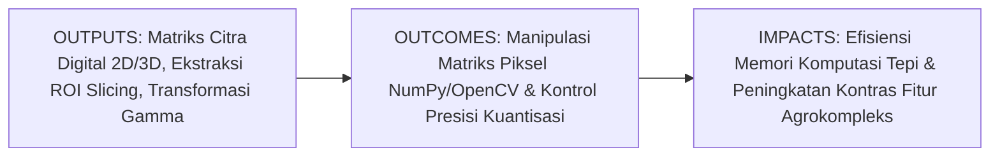
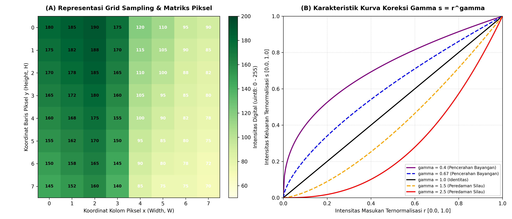
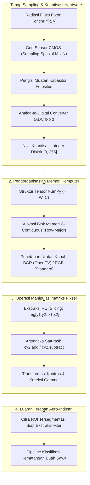

# AI Modul 10.2: Representasi Citra Digital dan Matriks Piksel

---

## 1. Identitas & Kerangka Capaian Pembelajaran (Sub-CPMK)

* **Kode Modul**: AI Modul 10.2
* **Mata Kuliah**: Kecerdasan Buatan dan Sains Data Pertanian Presisi
* **Alokasi Waktu**: 2 x 50 Menit (Kajian Teori & Diskusi) + 2 x 50 Menit (Eksplorasi Praktikum Mandiri)
* **Beban SKS**: 3 SKS
* **Prasyarat**: AI Modul 10.1 (Konsep dan Fundamental Computer Vision)
* **Level Kognitif**: Bloom C2 (Memahami), C3 (Menerapkan), C4 (Menganalisis)



### 1.1 Capaian Pembelajaran Khusus (Sub-CPMK)
Setelah menyelesaikan modul ini secara komprehensif, mahasiswa diharapkan mampu:
1. **Memahami (C2)** prinsip diskritisasi spasial (*sampling*) dan diskritisasi intensitas (*quantization*), konsep kedalaman bit (*bit depth*, $1\text{-bit}$, $8\text{-bit}$, $16\text{-bit}$, $32\text{-bit float}$), struktur memori array kontigu (*row-major layout*), serta perbedaan representasi monokromatik (Grayscale) vs polikromatik (RGB, BGR, dan Multispektral).
2. **Menerapkan (C3)** operasi manipulasi matriks piksel murni berbasis pustaka NumPy dan OpenCV—mencakup pengindeksan koordinat $(y, x)$, pemotongan wilayah minat (*Region of Interest / ROI slicing*), aritmatika citra bersaturasi vs modulo, serta penyesuaian kontras-kecerahan linier dan non-linier (*Gamma Correction*)—pada citra kanopi dan buah kelapa sawit.
3. **Menganalisis (C4)** patologi kuantisasi (*false contouring*), distorsi pereduksian resolusi (*spatial aliasing*), bahaya aritmatika *integer overflow/underflow* pada tipe data `uint8`, serta mengestimasi kebutuhan kapasitas memori RAM/VRAM untuk pemrosesan citra drone resolusi tinggi di lapangan perkebunan.

### 1.2 Kerangka Hasil Pembelajaran (Outputs, Outcomes, & Impacts)
* **Outputs (Keluaran Langsung)**:
  * Pemahaman mendalam mengenai struktur data array piksel multidimensi dalam arsitektur komputer modern.
  * Skrip Python berstandar PEP 8 untuk manipulasi piksel, pemotongan ROI brondolan kelapa sawit, dan algoritma koreksi gamma adaptif.
  * Laporan komparasi kuantitatif konsumsi memori dan histogram intensitas citra pada variasi kedalaman bit ($8\text{-bit}$ vs $16\text{-bit}$).
* **Outcomes (Kompetensi Aplikatif)**:
  * Kemampuan mengelola representasi citra digital secara efisien tanpa membebani memori kerja sistem komputer tepi (*edge computing device*).
  * Keahlian dalam mengisolasi wilayah objek tanaman penting dan memperbaiki kualitas citra yang mengalami *underexposure* pada bayangan kanopi kelapa sawit.
* **Impacts (Dampak Strategis Jangka Panjang)**:
  * Terwujudnya sistem pemrosesan citra perkebunan yang hemat daya dan berkecepatan tinggi pada armada drone pemantau kebun dan robotik sortasi pabrik kelapa sawit.
  * Standarisasi format representasi data visual digital yang siap diintegrasikan dengan algoritma pembelajaran mesin dan jaringan saraf konvolusional (CNN).

---

## 2. Profil Fundamental Representasi Citra Digital: Fungsi, Manfaat, dan Keunggulan-Kelemahan

### 2.1 Fungsi Komputasi & Pemodelan Matematis
Dalam paradigma komputasi visual, citra digital bukanlah sekadar berkas grafis, melainkan **fungsi intensitas spasial diskrit dua dimensi** $f(x, y)$, di mana $x$ dan $y$ adalah koordinat bidang spasial, dan nilai amplitudo $f$ pada sembarang pasangan koordinat $(x, y)$ disebut sebagai **intensitas** atau **derajat keabuan (*gray level*)** pada titik tersebut. Secara matematis, representasi citra digital berfungsi untuk:
1. **Representasi Matriks Diskrit**: Memetakan bidang spasial kontinu menjadi kisi berukuran $M \times N$ dengan koordinat baris $i \in \{0, 1, \dots, M-1\}$ dan kolom $j \in \{0, 1, \dots, N-1\}$.
2. **Representasi Tensor Multikanal**: Mengorganisasikan data visual warna polikromatik menjadi tensor rank-3 $\mathbf{I} \in \mathbb{R}^{H \times W \times C}$, di mana $H$ adalah tinggi (*height*), $W$ adalah lebar (*width*), dan $C$ adalah jumlah saluran spektral (*channels*).
3. **Fasilitasi Aljabar Linier Spasial**: Memungkinkan seluruh operasi penajaman, penyaringan, dan transformasi geometris dieksekusi melalui operasi aljabar matriks standar (perkalian titik, konvolusi, dan transposisi).

### 2.2 Manfaat Nyata di Industri Perkebunan & Agribisnis
Penerapan manipulasi matriks piksel memberikan efisiensi langsung pada operasional agro-industri:
* **Ekstraksi Wilayah Minat (*Region of Interest / ROI Slicing*)**: Dalam pemilahan tandan buah segar (TBS) di pabrik kelapa sawit, kamera mengambil citra keseluruhan bidang konveyor. Melalui pemotongan matriks piksel `img[y1:y2, x1:x2]`, sistem dapat mengabaikan latar belakang lantai konveyor dan hanya memproses matriks brondolan buah sawit, menghemat beban komputasi hingga $70\%$.
* **Pencerahan Bayangan Kanopi (*Shadow Enhancement via Gamma Correction*)**: Citra udara drone sering kali memiliki bagian bawah pelepah sawit yang gelap gulita akibat tertutup tajuk atas. Transformasi gamma non-linier mengangkat detail tekstur pelepah yang tersembunyi tanpa membuat area tanah yang terkena sinar matahari menjadi jenuh putih (*blown-out highlights*).
* **Efisiensi Penyimpanan Data Survei Udara**: Pemahaman mengenai kedalaman bit memungkinkan insinyur agronomi memilih kapan harus menggunakan format presisi $16\text{-bit}$ (pada sensor multispektral termal) dan kapan cukup menggunakan $8\text{-bit}$ (pada kamera ortofoto RGB), menghemat ruang penyimpanan server hingga ratusan gigabyte per blok kebun.

### 2.3 Rationale: Alasan Mengapa Metode Ini Digunakan
Mengapa praktisi kecerdasan buatan pertanian wajib menguasai representasi matriks piksel murni di samping pustaka tingkat tinggi?
1. **Akses Memori Berkecepatan Rendah (*Low-Level Memory Access*)**: Pustaka komputasi numerik modern seperti NumPy menyimpan matriks piksel dalam blok memori kontigu bergaya bahasa C (*C-contiguous memory layout*). Operasi pengirisan (*slicing*) tidak menyalin data baru ke RAM (*zero-copy view*), menghasilkan eksekusi tingkat sub-milidetik.
2. **Kesesuaian dengan Arsitektur GPU & Tensor PyTorch**: Model pembelajaran mendalam (*Deep Learning*) menerima masukan berupa tensor numerik terstandarisasi. Menguasai manipulasi matriks piksel adalah prasyarat mutlak sebelum mahasiswa mampu merancang pipeline augmentasi data citra untuk CNN.
3. **Kontrol Penuh atas Kuantisasi & Pembulatan Nilai**: Menghindari cacat aritmatika (*integer overflow/underflow*) yang kerap merusak segmentasi warna daun kelapa sawit saat menggunakan pustaka standar.

### 2.4 Analisis Kelebihan dan Kekurangan

| Dimensi Evaluasi | Kelebihan (*Strengths*) | Kekurangan (*Limitations*) |
|:---|:---|:---|
| **Kecepatan Akses Komputasi** | Akses elemen matriks $\mathcal{O}(1)$; operasi vektorisasi NumPy mengeksploitasi instruksi perangkat keras SIMD (AVX2/NEON). | Penggunaan loop eksplisit Python murni (`for y in ... for x in ...`) sangat lambat dan tidak dapat digunakan untuk komputasi *real-time*. |
| **Presisi Informasi Spektral** | Format floating-point ($32\text{-bit float}$) mempertahankan rentang dinamis tinggi (*High Dynamic Range* / HDR) dari sensor optik. | Konsumsi memori RAM melonjak 4 kali lipat dibandingkan format bilangan bulat standar `uint8`. |
| **Fleksibilitas Manipulasi** | Kemudahan pemotongan spasial (*ROI cropping*), pembalikan sumbu, dan penataan ulang dimensi (*transposing*). | Rentan terhadap galat mutasi data (*in-place modification*) jika pengirisan dilakukan tanpa pemanggilan metode `.copy()`. |
| **Keterbacaan Struktur** | Representasi matematis transparan; setiap piksel memiliki koordinat kartesius dan magnitudo fisik yang terdefinisi jelas. | Tidak menyertakan kompresi data bawaan; membutuhkan konversi ke format terkompresi (JPEG/PNG) sebelum transmisi jaringan telemetri drone. |

### 2.5 Contoh Kasus Penggunaan Konkret di Sektor Agro-Industri
1. **Segmentasi Brondolan Buah Sawit pada Meja Sortasi PKS**: Memotong matriks piksel berukuran $200 \times 200$ di sekitar brondolan buah yang lepas untuk menghitung rasio luas mesokarp terhadap cangkang.
2. **Kalibrasi Radiometrik Panel Reflektansi Udara Drone**: Mengisolasi ROI piksel panel abu-abu standar (*spectral calibration panel*) yang diletakkan di tanah sebelum penerbangan drone guna menentukan faktor skala konversi nilai digital (*Digital Number* / DN) ke nilai reflektansi permukaan kanopi.
3. **Deteksi Bercak Daun Klorosis (*Spot Cropping*)**: Mengekstraksi matriks piksel area bercak kuning pada daun sawit untuk dihitung nilai rerata intensitas RGB dan deviasi standarnya sebagai indikator keparahan defisiensi kalium.

### 2.6 Aspek Kritis & Catatan Penting Metode (*Key Critical Insights*)
* **Perbedaan Urutan Saluran Warna (BGR vs RGB)**: Pustaka OpenCV secara historis membaca citra berwarna dalam urutan kanal **BGR (Blue, Green, Red)**, sedangkan pustaka Matplotlib dan PyTorch menggunakan konvensi standar **RGB (Red, Green, Blue)**. Menampilkan citra OpenCV langsung ke Matplotlib tanpa konversi `cv2.cvtColor(img, cv2.COLOR_BGR2RGB)` akan menyebabkan daun kelapa sawit yang berwarna hijau tampak merah kebiruan, memicu interpretasi agronomi yang keliru.
* **Perangkap Aritmatika Bilangan Bulat Tak Bertanda (`uint8`)**: Tipe data `uint8` hanya mampu menampung nilai bulat dalam interval tertutup $[0, 255]$. Operasi penambahan menggunakan NumPy murni bersifat modulo ($250 + 20 = 14$), sedangkan operasi OpenCV bersifat jenuh bersaturasi (`cv2.add(250, 20) = 255`). Memahami disparitas ini sangat penting dalam perancangan algoritma peningkatan kecerahan citra.
* **Mekanisme View vs Copy pada Pengirisan ROI**: Ekspresi `roi = img[y1:y2, x1:x2]` dalam NumPy menghasilkan *view* (tampilan referensi memori yang sama), bukan duplikasi data independen. Mengubah nilai piksel pada `roi` secara otomatis akan mengubah piksel pada citra asli `img`. Jika modifikasi independen diperlukan, wajib memanggil `roi = img[y1:y2, x1:x2].copy()`.



---

## 3. Landasan Teori Matematis & Statistik Representasi Citra Digital

### 3.1 Sampling Spasial dan Teorema Nyquist-Shannon
Proses digitalisasi citra kontinu dimulai dari **sampling spasial**, yaitu pencuplikan nilai intensitas kontinu pada kisi koordinat diskrit yang berjarak teratur $\Delta x$ dan $\Delta y$.

Menurut **Teorema Pencuplikan Nyquist-Shannon**, agar struktur detail spasial pada objek tanaman (misalnya urat daun mikro atau duri pelepah) dapat direkonstruksi sempurna tanpa mengalami efek distorsi frekuensi (*aliasing*), frekuensi sampling spasial sensor ($f_s = 1/\Delta x$) wajib memenuhi ketidaksamaan:

$$f_s \ge 2 f_{\max}$$

Di mana $f_{\max}$ adalah frekuensi spasial tertinggi yang dikandung oleh pemandangan fisik objek. Jika $f_s < 2 f_{\max}$, fenomena **aliasing spasial** akan terjadi: detail frekuensi tinggi akan menyamar menjadi pola frekuensi rendah semu (seperti pola bergelombang berulang atau *Moiré patterns* pada barisan pohon kelapa sawit).

### 3.2 Kuantisasi Intensitas & Perhitungan Ukuran Memori
Setelah koordinat spasial didiskritisasi, nilai intensitas kontinu pada setiap piksel harus dipetakan ke dalam salah satu dari sekumpulan nilai diskrit berhingga melalui proses **kuantisasi intensitas**.

Jika jumlah bit yang dialokasikan untuk setiap sampel intensitas adalah $b$ bit, maka jumlah derajat keabuan (*gray levels*) diskrit yang tersedia adalah:

$$L = 2^b$$

Rentang nilai bulat yang dihasilkan berada pada interval tertutup:
$$f(x, y) \in \{0, 1, 2, \dots, 2^b - 1\}$$

Secara matematis, kuantisasi seragam (*uniform scalar quantization*) dari nilai intensitas fisik kontinu $f \in [f_{\min}, f_{\max}]$ menjadi nilai bilangan bulat $q$ dirumuskan sebagai:

$$q = \left\lfloor \frac{f - f_{\min}}{f_{\max} - f_{\min}} \cdot (2^b - 1) + 0.5 \right\rfloor$$

#### Perhitungan Kebutuhan Memori Citra Mentah Nir-Kompresi
Ukuran kapasitas memori penyimpanan yang dibutuhkan oleh sebuah citra digital mentah nir-kompresi (*uncompressed raw image*) berdimensi tinggi $H$, lebar $W$, jumlah saluran warna $C$, dan kedalaman $b$ bit per piksel dihitung melalui formulasi:

$$\text{Ukuran Memori (Bytes)} = H \times W \times C \times \frac{b}{8}$$

Sebagai contoh, satu frame citra ortofoto drone beresolusi $4\text{K}$ Ultra HD ($3840 \times 2160$ piksel) dengan 3 saluran warna RGB ($C = 3$) dan kedalaman $8\text{-bit}$ ($b = 8$) membutuhkan memori RAM sebesar:
$$\text{Memori} = 2160 \times 3840 \times 3 \times 1\text{ Byte} = 24.883.200\text{ Bytes} \approx 24.88\text{ MB (per frame)}$$

### 3.3 Aljabar Matriks Citra & Transformasi Intensitas Titik (Point Processing)
Operasi titik (*point processing*) memetakan nilai intensitas masukan $r = f(x, y)$ menjadi nilai intensitas keluaran $s = g(x, y)$ berdasarkan fungsi transformasi matematika mandiri tanpa bergantung pada piksel tetangga.

#### 1. Transformasi Kontras dan Kecerahan Linier
Fungsi transformasi linier dikendalikan oleh dua parameter skalar:

$$g(x, y) = \alpha \cdot f(x, y) + \beta$$

**Keterangan Simbol & Fungsi Operasional**:
* $\alpha > 0$: Parameter pengali pengatur **kontras (*contrast gain*)**. Jika $\alpha > 1$, kontras citra melebar (perbedaan gelap-terang semakin tegas); jika $0 < \alpha < 1$, kontras citra menyempit.
* $\beta \in \mathbb{R}$: Parameter penambah pengatur **kecerahan (*brightness bias*)**. Jika $\beta > 0$, seluruh piksel digeser menjadi lebih terang; jika $\beta < 0$, citra digeser menjadi lebih gelap.
* Nilai keluaran wajib dipotong (*clipping*) pada batas kuantisasi: $g(x, y) \leftarrow \min(\max(g(x, y), 0), 2^b - 1)$.

#### 2. Transformasi Daya Non-Linier (Koreksi Gamma)
Koreksi gamma memetakan nilai intensitas ternormalisasi $r \in [0.0, 1.0]$ menggunakan fungsi eksponensial:

$$s = c \cdot r^\gamma$$

**Keterangan Simbol & Karakteristik Fisika**:
* $r = f(x, y) / (2^b - 1)$: Nilai intensitas masukan yang diskalakan ke rentang $[0, 1]$.
* $s$: Nilai intensitas keluaran ternormalisasi $[0, 1]$.
* $c$: Konstanta skala (umumnya bernilai $c = 1.0$).
* $\gamma$ (gamma): Parameter kelengkungan kurva transformasi:
  * Jika $\gamma < 1.0$: Kurva melengkung ke atas, meregangkan intensitas gelap dan memampatkan intensitas terang (**mencerahkan detail bayangan gelap di bawah kanopi sawit**).
  * Jika $\gamma = 1.0$: Transformasi identitas linier murni ($s = r$).
  * Jika $\gamma > 1.0$: Kurva melengkung ke bawah, memampatkan intensitas gelap dan meregangkan intensitas terang (**meredam silau pantulan cahaya matahari yang berlebih**).

#### Panduan Pelafalan dan Cara Membaca Notasi Matematika
* $g(x, y) = \alpha \cdot f(x, y) + \beta$: Dibaca *"g dari x koma y sama dengan alfa dikalikan f dari x koma y ditambah beta"*.
* $s = c \cdot r^\gamma$: Dibaca *"s sama dengan c dikalikan r pangkat gamma"*.
* $H \times W \times C$: Dibaca *"H kali W kali C"*, melambangkan dimensi baris (tinggi), kolom (lebar), dan saluran warna.
* $\lfloor x \rfloor$: Dibaca *"fungsi lantai (floor) dari x"*, yaitu bilangan bulat terbesar yang lebih kecil atau sama dengan $x$.

---

## 4. Visualisasi Arsitektur & Pipeline Komputasi Matriks Piksel

Pipeline konversi data dari radiasi optik fisik menjadi representasi array memori komputer dan manipulasi matriks piksel dirancang secara terstruktur:



### Prosedur Komputasi & Alur Algoritma Numerik
Prosedur komputasi mandiri untuk pemrosesan matriks piksel dan koreksi gamma diimplementasikan melalui algoritma berikut:

```
====================================================================================================
ALGORITMA KOREKSI GAMMA DAN EKSTRAKSI ROI SAWIT
Masukan:
  - Citra Masukan I (Matriks uint8 berdimensi H x W x C)
  - Koordinat Batas ROI: (ymin, ymax, xmin, xmax)
  - Parameter Gamma: gamma > 0
Keluaran:
  - Citra Terkoreksi I_gamma, Citra Potongan ROI_sawit

PROSEDUR:
1. Validasi Batas Koordinat ROI:
     PASTIKAN 0 <= ymin < ymax <= H DAN 0 <= xmin < xmax <= W
2. Ekstraksi Salinan Mandiri (Deep Copy):
     ROI_sawit = DUPLIKASI(I[ymin:ymax, xmin:xmax])
3. Pembangkitan Tabel Pemetaan Cepat (Lookup Table / LUT):
     Inisialisasi array LUT berukuran 256 elemen bertipe uint8
     UNTUK r DARI 0 HINGGA 255:
       r_norm = r / 255.0
       s_norm = r_norm ^ (1.0 / gamma)
       LUT[r] = BULATKAN(s_norm * 255.0)
4. Transformasi Intensitas Matriks:
     I_gamma = cv2.LUT(I, LUT)
5. KEMBALIKAN I_gamma, ROI_sawit
====================================================================================================
```

---

## 5. Studi Kasus Komputasi & Implementasi Python / NumPy / OpenCV

Berikut adalah skrip implementasi komputasi mandiri menggunakan NumPy dan OpenCV yang menguji perbedaan operasi aritmatika jenuh vs modulo, melakukan ekstraksi ROI brondolan kelapa sawit, mendemonstrasikan fenomena *false contouring* pada kuantisasi bit rendah, serta mengaplikasikan koreksi gamma adaptif:

```python
import numpy as np
import cv2
import matplotlib.pyplot as plt

def generate_synthetic_oil_palm_fruit(width=400, height=400):
    """
    Membangkitkan citra sintetis brondolan kelapa sawit (Oil Palm Fresh Fruitlet)
    dengan gradasi warna kematangan mesokarp (oranye-merah) dan cangkang basal.
    """
    np.random.seed(100)
    # Matriks dasar RGB (H x W x 3)
    fruit_img = np.ones((height, width, 3), dtype=np.uint8) * 40  # Background gelap
    
    Y, X = np.meshgrid(np.arange(height), np.arange(width), indexing='ij')
    cy, cx = height // 2, width // 2
    
    # Geometri elips brondolan sawit
    a, b = 130.0, 90.0  # Sumbu semi-mayor dan semi-minor
    ellipse_dist = ((X - cx) / b)**2 + ((Y - cy) / a)**2
    mask = ellipse_dist <= 1.0
    
    # Gradien warna kematangan: merah-oranye di ujung, ungu-hitam di dasar
    y_norm = (Y - (cy - a)) / (2 * a)
    y_norm = np.clip(y_norm, 0.0, 1.0)
    
    # Red Channel: Tinggi di seluruh badan buah
    fruit_img[mask, 0] = np.clip(180 + 75 * (1.0 - y_norm[mask]), 0, 255).astype(np.uint8)
    # Green Channel: Menurun ke arah dasar (gradasi kematangan)
    fruit_img[mask, 1] = np.clip(40 + 80 * (1.0 - y_norm[mask]**2), 0, 255).astype(np.uint8)
    # Blue Channel: Sangat rendah (khas buah sawit matang)
    fruit_img[mask, 2] = np.clip(15 + 10 * y_norm[mask], 0, 255).astype(np.uint8)
    
    return fruit_img

def apply_gamma_correction(image, gamma=1.0):
    """
    Mengaplikasikan transformasi non-linier Gamma Correction
    menggunakan Lookup Table (LUT) berkecepatan tinggi O(1).
    """
    inv_gamma = 1.0 / gamma
    lut = np.array([
        np.clip(((i / 255.0) ** inv_gamma) * 255.0, 0, 255)
        for i in range(256)
    ], dtype=np.uint8)
    
    return cv2.LUT(image, lut)

def quantize_image_bits(image, bits=8):
    """
    Mensimulasikan reduksi kedalaman kuantisasi bit (False Contouring).
    """
    levels = 2 ** bits
    step = 256 // levels
    quantized = (image // step) * step
    return quantized.astype(np.uint8)

# ==============================================================================
# EKSEKUSI PENGUJIAN KOMPUTASI DAN DEMONSTRASI ARITMATIKA
# ==============================================================================
if __name__ == "__main__":
    # 1. Pembangkitan Citra Sintetis Buah Sawit
    palm_fruit = generate_synthetic_oil_palm_fruit()
    
    # 2. Demonstrasi Bahaya Aritmatika uint8: Modulo vs Saturasi
    a_pixel = np.array([240], dtype=np.uint8)
    b_pixel = np.array([30], dtype=np.uint8)
    
    numpy_overflow = a_pixel + b_pixel          # Overflow Modulo: (240 + 30) % 256 = 14
    opencv_saturated = cv2.add(a_pixel, b_pixel) # Saturasi Industri: min(240 + 30, 255) = 255
    
    print("=== PERBANDINGAN OPERASI ARITMATIKA PIKSEL (uint8) ===")
    print(f"Nilai Awal        : A = {a_pixel[0]}, B = {b_pixel[0]}")
    print(f"NumPy Add (Modulo): {a_pixel[0]} + {b_pixel[0]} = {numpy_overflow[0]}  <-- BAHAYA OVERFLOW!")
    print(f"OpenCV Add (Satur): cv2.add({a_pixel[0]}, {b_pixel[0]}) = {opencv_saturated[0, 0]} <-- AMAN (Saturated)\n")
    
    # 3. Ekstraksi Region of Interest (ROI) Bagian Tengah Buah Sawit
    # Koordinat: Y dari 150 ke 250, X dari 150 ke 250
    roi_fruit = palm_fruit[150:250, 150:250].copy()
    
    # 4. Pengujian Variasi Koreksi Gamma
    fruit_gamma_bright = apply_gamma_correction(palm_fruit, gamma=0.5)  # Mencerahkan bayangan
    fruit_gamma_dark = apply_gamma_correction(palm_fruit, gamma=2.2)    # Meredam silau
    
    # 5. Simulasi Pengurangan Kedalaman Kuantisasi Bit
    fruit_4bit = quantize_image_bits(palm_fruit, bits=4)  # 16 level intensitas
    fruit_2bit = quantize_image_bits(palm_fruit, bits=2)  # 4 level intensitas
    
    print("=== UKURAN MEMORI DATA CITRA NIR-KOMPRESI ===")
    h, w, c = palm_fruit.shape
    bytes_8bit = h * w * c * 1
    bytes_16bit = h * w * c * 2
    print(f"Dimensi Tensor       : {h} x {w} x {c} (Total Piksel: {h * w})")
    print(f"Alokasi Memori 8-bit : {bytes_8bit:,} Bytes ({bytes_8bit / 1024:.2f} KB)")
    print(f"Alokasi Memori 16-bit: {bytes_16bit:,} Bytes ({bytes_16bit / 1024:.2f} KB)")
    print(f"Dimensi Matriks ROI  : {roi_fruit.shape} (Piksel Terpilih: {roi_fruit.shape[0] * roi_fruit.shape[1]})")
```

---

## 6. Kekeliruan Metodologis dan Praktik Terbaik (*Common Pitfalls & Best Practices*)

### 6.1 Kekeliruan Umum Metodologis (*Common Pitfalls*)
Dalam pemrosesan matriks citra agrokompleks, peneliti dan perekayasa kerap melakukan kesalahan metodologis berikut:
1. **Penerapan Operasi Tambah/Kurang Tanpa Penjenuhan (*Unsaturated Arithmetic*)**:  
   Melakukan penyesuaian kecerahan langsung dengan operator penjumlahan biasa `img = img + 40`. Pada piksel daun terang bernilai 230, hasilnya meluap (*overflow*) menjadi 14, sehingga daun yang sangat terang secara paradoks berubah menjadi titik hitam gulita (*black spot artifact*).
2. **Kegagalan Pemisahan Referensi Memori (*Shallow Copy vs Deep Copy*)**:  
   Melakukan manipulasi anotasi bounding box atau penandaan piksel pada ROI `roi = img[y1:y2, x1:x2]` dengan asumsi citra mentah `img` tetap aman. Karena `roi` hanyalah *view* memori, citra asli ikut tercemar coretan grafis permanen. Selalu gunakan `.copy()` jika data mentah harus dipertahankan.
3. **Tertukarnya Konvensi Indeks Spasial $(X, Y)$ vs $(H, W)$**:  
   Menulis kode pengirisan `img[x, y]` dengan asumsi $x$ adalah sumbu pertama. Dalam NumPy, indeks pertama adalah baris vertikal ($y$), dan indeks kedua adalah kolom horizontal ($x$). Kesalahan ini memicu galat `IndexError` atau rotasi matriks $90^\circ$ yang tidak disengaja.
4. **Pembagian Skalar Tanpa Konversi Tipe Data Float**:  
   Mencoba menghitung normalisasi piksel menggunakan `img = img / 255` pada array bertipe `uint8` di lingkungan pustaka lama atau C-API, yang menghasilkan pembulatan bilangan bulat biner murni (semua piksel bernilai 0 atau 1).

### 6.2 Mitigasi Bias Data Visual Agronomi
1. **Bias Penjenuhan Sensor (*Sensor Saturation Bias*)**:  
   Pada pemotretan kanopi sawit di tengah hari cerah, area pelepah muda yang memantulkan sinar matahari langsung sering kali bernilai 255 pada ketiga saluran ($R=G=B=255$). Informasi tekstur daun pada area ini hilang secara permanen (*clipping loss*). Mitigasi dilakukan dengan mengaktifkan mode *Auto-Exposure Bracketing* (AEB) atau menurunkan exposure compensation kamera drone sebesar $-0.7\text{ EV}$.
2. **Bias Efek Kontur Semu (*False Contouring*) pada Segmentasi**:  
   Mengompresi citra multispektral ke format `uint8` secara tergesa-gesa dapat memicu garis batas buatan (*banding artifacts*) pada gradasi warna tanah kebun. Pertahankan data pada kedalaman $16\text{-bit}$ atau format `float32` selama tahap preprocessing hulu.

### 6.3 Praktik Terbaik Rekayasa Perangkat Lunak Visi Komputer
1. **Pemanfaatan Lookup Table (LUT) untuk Transformasi Intensitas**:  
   Jangan pernah menghitung fungsi eksponensial `r ** (1/gamma)` pada setiap piksel secara berulang di dalam array berukuran jutaan. Bangkitkan tabel pemetaan 256 elemen sekali saja, lalu panggil fungsi teroptimasi `cv2.LUT()`.
2. **Verifikasi Kontiguitas Array Memori (*Memory Contiguity Check*)**:  
   Sebelum mengirimkan array piksel hasil slicing ke fungsi C-Extension atau model PyTorch, periksa bendera `arr.flags['C_CONTIGUOUS']`. Jika bernilai `False` akibat operasi transposisi atau pembalikan sumbu, panggil `np.ascontiguousarray(arr)` guna menjamin efisiensi transfer data memori DMA.

---

## 7. Rangkuman Modul

1. **Citra Digital** direpresentasikan secara matematis sebagai matriks diskrit $f(x, y)$ untuk citra monokromatik (Grayscale) atau tensor rank-3 berukuran $H \times W \times C$ untuk citra multi-kanal.
2. **Sampling Spasial** menentukan resolusi geometris piksel dan wajib mematuhi kriteria Nyquist ($f_s \ge 2 f_{\max}$), sedangkan **Kuantisasi Intensitas** menentukan kedalaman bit ($L = 2^b$) yang mendefinisikan rentang dinamis nilai digital.
3. **Bahaya Aritmatika uint8**: Penjumlahan piksel menggunakan NumPy murni memicu *integer overflow* berbasis modulo $256$, sedangkan OpenCV mengaplikasikan fungsi jenuh bersaturasi (`cv2.add`) yang aman pada batas $[0, 255]$.
4. **Transformasi Titik Intensitas**: Transformasi linier ($g = \alpha f + \beta$) mengatur kontras dan kecerahan global, sedangkan transformasi non-linier **Koreksi Gamma** ($s = c \cdot r^\gamma$) secara efektif memulihkan detail bayangan gelap di bawah kanopi pelepah sawit tanpa menjenuhkan area terang.
5. **Manajemen Memori Efisien**: Operasi slicing ROI pada NumPy secara bawaan membentuk *view* tanpa konsumsi RAM tambahan, menuntut penggunaan eksplisit `.copy()` untuk mencegah pencemaran data mentah.

---

## 8. Latihan Soal & Tugas Analitis HOTS

### Soal Penalaran Konseptual & Analitis HOTS
1. **Kalkulasi Kebutuhan Memori dan Bandwidth Drone Ortofoto (C3)**:  
   Sebuah wahana drone melakukan pemetaan fotogrametri di perkebunan kelapa sawit seluas 500 hektar. Kamera drone merekam citra beresolusi $24\text{ Megapiksel}$ ($6000 \times 4000$ piksel) dengan 3 saluran warna RGB ($C = 3$) pada kecepatan rekam 2 frame per detik ($2\text{ FPS}$).  
   * Hitung ukuran memori satu frame citra mentah nir-kompresi dalam satuan Megabyte (MB) jika menggunakan kedalaman bit standar $8\text{-bit}$ per saluran.
   * Berapa laju *data throughput* (MB/detik) yang harus ditulis oleh sistem penyimpanan kartu memori drone?
   * Jika sensor diganti dengan sensor multispektral 5-kanal (Red, Green, Blue, RedEdge, NIR) dengan kedalaman $16\text{-bit}$ ($2\text{ Bytes/piksel}$) pada resolusi yang sama, hitung persentase kenaikan ukuran berkas citra per frame.

2. **Diagnostik Patologi Aritmatika Piksel Mesokarp Buah Sawit (C4)**:  
   Seorang analis data ingin meningkatkan kecerahan citra mesokarp buah sawit yang berada pada nilai intensitas rata-rata $I_{\text{awal}} = [220, 60, 10]$ (kanal BGR). Analis tersebut mengeksekusi dua baris kode alternatif berikut:  
   * Alternatif A: `img_A = img + 45` (menggunakan operator aritmatika NumPy).  
   * Alternatif B: `img_B = cv2.add(img, np.array([45, 45, 45], dtype=np.uint8))` (menggunakan fungsi OpenCV).  
   Tentukan nilai vektor piksel keluaran pada kedua alternatif tersebut. Jelaskan mengapa Alternatif A menghasilkan anomali visual fatal (perubahan warna drastis) pada brondolan buah sawit tersebut.

3. **Optimasi Kurva Gamma untuk Pemantauan Kanopi Berbayang (C4)**:  
   Citra kanopi kelapa sawit yang diambil pada pagi hari menunjukkan bahwa $60\%$ area pelepah berada di bawah naungan bayangan pohon tetangga dengan rentang intensitas ternormalisasi $r \in [0.05, 0.25]$.  
   * Pilihlah nilai parameter gamma yang tepat ($\gamma = 0.4$ atau $\gamma = 2.5$) untuk mengangkat informasi tekstur daun di area berbayang tersebut. Jelaskan alasan matematis di balik pilihan Anda berdasarkan kurva turunan pertama $ds/dr$.  
   * Apa konsekuensi visual yang terjadi pada area jalan perkebunan yang terkena sinar matahari langsung ($r = 0.95$) setelah transformasi gamma tersebut diaplikasikan?

---

### Rubrik Penilaian Holistik (*Higher-Order Thinking Skills*)

| Kriteria / Dimensi | Bobot (%) | Sangat Memuaskan (85 - 100) | Memuaskan (70 - 84) | Kurang Memuaskan (< 70) |
|:---|:---|:---|:---|:---|
| **Pemahaman Teoretis Representasi Matriks (C2)** | 25% | Mampu menguraikan prinsip sampling, kuantisasi, dan teorema Nyquist, serta membedakan konsep kedalaman bit dan tata letak memori secara presisi. | Menjelaskan struktur matriks citra dan kuantisasi dengan benar namun kurang mendalam dalam aspek perbandingan kedalaman bit. | Salah memahami konsep sampling/kuantisasi atau gagal membedakan representasi grayscale vs polikromatik. |
| **Keterampilan Pemrograman & Manipulasi Matriks (C3)** | 35% | Berhasil mengonstruksi skrip Python/NumPy/OpenCV untuk manipulasi piksel, ekstraksi ROI, dan koreksi gamma via LUT tanpa galat aritmatika. | Skrip program berjalan namun manipulasi dilakukan menggunakan loop lambat atau tidak mengantisipasi overflow uint8. | Program menghasilkan *runtime error* atau salah menerapkan aturan slicing koordinat spasial $(y, x)$. |
| **Analisis Diagnostik & Solusi Rekayasa (C4)** | 40% | Mampu menganalisis fenomena overflow modulo vs saturasi, mengevaluasi kurva gamma kanopi berbayang, dan menghitung throughput memori drone secara analitik. | Mampu menganalisis masalah overflow namun rekomendasi pemilihan parameter gamma belum sepenuhnya komprehensif. | Gagal mengidentifikasi penyebab distorsi aritmatika atau salah menghitung estimasi kebutuhan memori citra. |

---

## 9. Jembatan Konsep (Bridging) ke AI Modul 10.3: Piksel dan Ruang Warna (Color Spaces)

Pada Modul 10.2 ini, kita telah menguasai bagaimana data visual disimpan sebagai struktur matriks intensitas diskrit berdimensi dua dan tiga, bagaimana alokasi memori dikendalikan oleh kedalaman bit, serta bagaimana operasi matematika dasar dieksekusi pada tingkat piksel tunggal.

Namun, dalam seluruh demonstrasi sebelumnya, representasi warna polikromatik masih dibatasi pada ruang warna bawaan perangkat keras sensor kamera, yaitu **RGB (Red, Green, Blue)** atau **BGR**. 

Meskipun model warna RGB sangat ideal untuk perangkat keras penampil grafis (layar monitor) dan sensor kamera, ruang warna RGB memiliki kelemahan mendasar untuk pemrosesan citra cerdas: **informasi krominans (warna murni) dan informasi luminans (kecerahan/cahaya) tercampur aduk secara linier pada ketiga saluran secara simultan**. Ketika intensitas sinar matahari di kebun kelapa sawit berubah, ketiga nilai $R$, $G$, dan $B$ akan bergeser secara bersamaan, membuat algoritma segmentasi kematangan buah menjadi sangat tidak stabil.

Untuk mengatasi limitasi tersebut, kita perlu memisahkan komponen warna dari komponen pencahayaan. Inilah pintu masuk menuju **AI Modul 10.3: Piksel dan Ruang Warna (*Color Spaces*)**.

Pada **AI Modul 10.3**, kita akan membedah:
* **Ruang Warna Berorientasi Persepsi Manusia (HSV / HSL)**: Memisahkan corak warna murni (*Hue*), kejenuhan (*Saturation*), dan nilai intensitas (*Value/Brightness*).
* **Ruang Warna Persepsi Seragam CIE Lab & YCrCb**: Ruang warna standar internasional untuk mengisolasi luminans murni ($L$ atau $Y$) dari saluran kromatik diferensial ($a, b$ atau $Cr, Cb$).
* **Studi Kasus Segmentasi Warna Agro-Industri**: Membangun algoritma filter ambang batas batas warna (*Color Thresholding*) pada bidang HSV untuk memisahkan brondolan buah sawit matang dari buah mentah secara kebal terhadap bayangan matahari.

---

## 10. Daftar Pustaka dan Referensi Akademik

1. Gonzalez, R. C., & Woods, R. E. (2018). *Digital Image Processing* (4th ed.). Pearson.
2. Szeliski, R. (2022). *Computer Vision: Algorithms and Applications* (2nd ed.). Springer.
3. Bradski, G., & Kaehler, A. (2008). *Learning OpenCV: Computer Vision with the OpenCV Library*. O'Reilly Media.
4. Burger, W., & Burge, M. J. (2016). *Digital Image Processing: An Algorithmic Introduction Using Java* (2nd ed.). Springer.
5. Pratt, W. K. (2007). *Digital Image Processing: PIKS Scientific Inside* (4th ed.). John Wiley & Sons.
6. Jackway, P. T., & Deriche, R. (1996). Scale-space properties of the multiscale morphological dilation-erosion. *IEEE Transactions on Pattern Analysis and Machine Intelligence*, 18(1), 38-51.
7. Fadilah, N., Mohamad-Saleh, J., Abdul Halim, Z., & Ibrahim, H. (2012). Intelligent color vision system for ripeness classification of oil palm fresh fruit bunch. *Sensors*, 12(10), 14179-14195.
8. Alfatni, M. S. M., Shariff, A. R. M., Abdullah, M. Z., Marhaban, M. H. B., & Saaed, O. M. B. (2022). Oil palm fresh fruit bunch ripeness grading methods: A systematic review. *Computers and Electronics in Agriculture*, 198, 107040.
