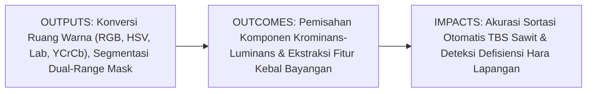
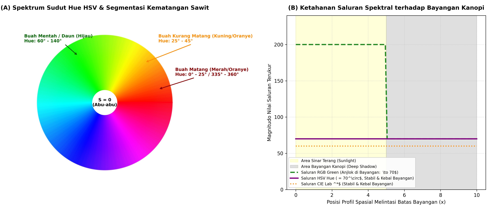
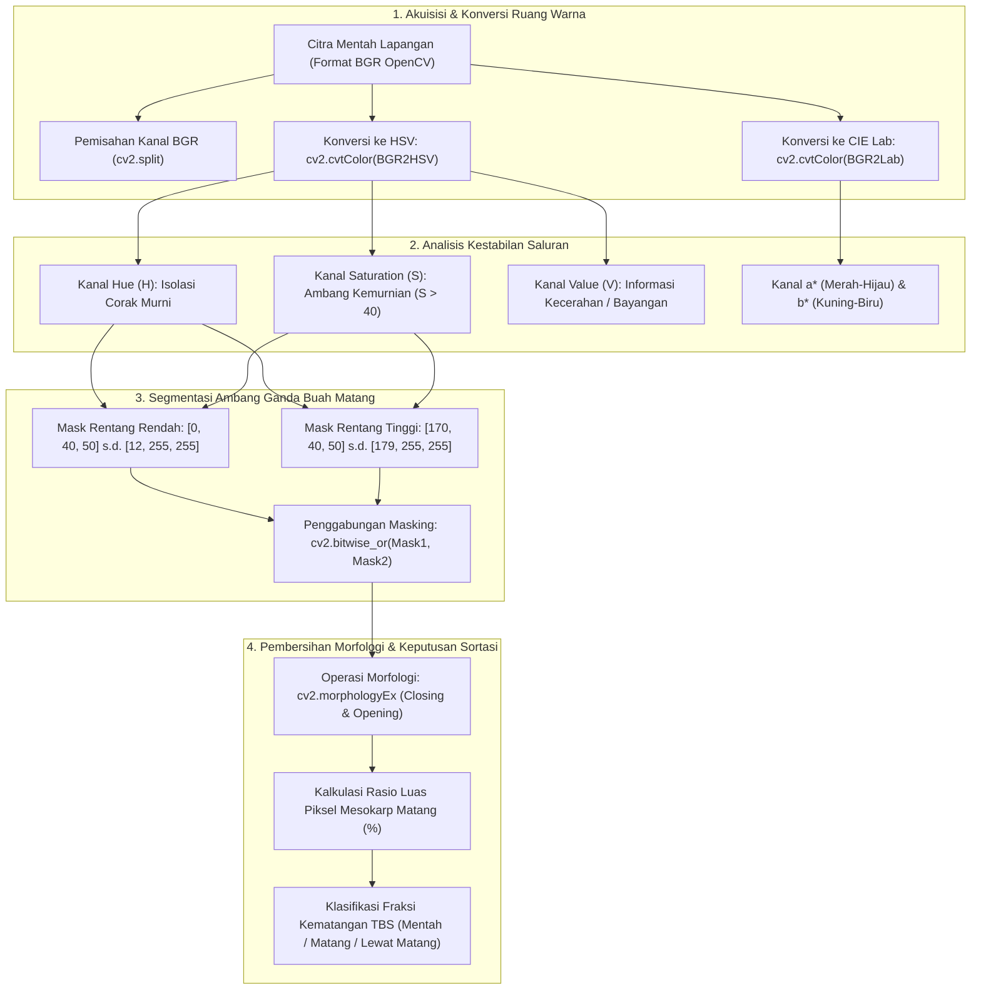

# AI Modul 10.3: Piksel dan Ruang Warna

---

## 1. Identitas & Kerangka Capaian Pembelajaran (Sub-CPMK)

* **Kode Modul**: AI Modul 10.3
* **Mata Kuliah**: Kecerdasan Buatan dan Sains Data Pertanian Presisi
* **Alokasi Waktu**: 2 x 50 Menit (Kajian Teori & Diskusi) + 2 x 50 Menit (Eksplorasi Praktikum Mandiri)
* **Beban SKS**: 3 SKS
* **Prasyarat**: AI Modul 10.2 (Representasi Citra Digital dan Matriks Piksel)
* **Level Kognitif**: Bloom C2 (Memahami), C3 (Menerapkan), C4 (Menganalisis)



### 1.1 Capaian Pembelajaran Khusus (Sub-CPMK)
Setelah menyelesaikan modul ini secara komprehensif, mahasiswa diharapkan mampu:
1. **Memahami (C2)** teori dasar persepsi trikromatik manusia (respons spektral sel fotoreseptor kerucut $S, M, L$), model warna aditif (RGB) vs subtraktif (CMYK), model representasi silinder (HSV/HSL), serta ruang warna persepsi seragam (*Perceptually Uniform Color Space*) CIE $L^*a^*b^*$ dan standar transmisi siaran YCrCb.
2. **Menerapkan (C3)** formulasi matematika konversi antar-ruang warna (RGB ke Grayscale berbobot luminans ITU-R BT.601, RGB ke HSV silindris, RGB ke CIE $L^*a^*b^*$) serta merancang alur kerja segmentasi warna berbasis ambang batas rentang ganda (*Dual-Range Thresholding via cv2.inRange* dan *cv2.bitwise_or*) pada citra brondolan buah dan kanopi kelapa sawit.
3. **Menganalisis (C4)** ketahanan (*invariance*) berbagai representasi saluran warna terhadap fluktuasi intensitas sinar matahari dan bayangan awan, membuktikan secara kuantitatif keunggulan kanal *Hue* dan $a^*, b^*$ dibanding kanal intensitas RGB mentah, serta menghitung metrik jarak persepsi warna Euclidean $\Delta E_{ab}^*$ guna membedakan fraksi kematangan panen secara objektif.

### 1.2 Kerangka Hasil Pembelajaran (Outputs, Outcomes, & Impacts)
* **Outputs (Keluaran Langsung)**:
  * Penguasaan formulasi analitis transformasi linier dan non-linier antar-ruang warna.
  * Skrip Python modular berstandar PEP 8 untuk konversi warna, dekomposisi multisaluran, dan segmentasi piksel buah sawit matang kebal bayangan.
  * Laporan komparasi kuantitatif kestabilan nilai fitur warna melintasi batas bayangan tajam (*shadow boundary*).
* **Outcomes (Kompetensi Aplikatif)**:
  * Kemampuan memilih ruang warna yang paling optimal sesuai karakteristik masalah agro-industri (inspeksi kanopi vs sortasi buah vs kalibrasi laboratorium).
  * Keahlian dalam mengatasi masalah diskontinuitas sudut kemerahan (*wrapped red hue anomaly*) pada ruang warna HSV.
* **Impacts (Dampak Strategis Jangka Panjang)**:
  * Peningkatan akurasi sistem sortasi fraksi Tandan Buah Segar (TBS) di Pabrik Kelapa Sawit (PKS) hingga melampaui $95\%$, meminimalkan penalti Asam Lemak Bebas (FFA).
  * Efisiensi deteksi dini klorosis defisiensi hara makro (N, P, K, Mg) pada perkebunan kelapa sawit skala komersial.

---

## 2. Profil Fundamental Ruang Warna: Fungsi, Manfaat, dan Keunggulan-Kelemahan

### 2.1 Fungsi Komputasi & Pemodelan Matematis
Ruang warna (*Color Space*) adalah model matematika abstrak yang mendefinisikan cara warna direpresentasikan sebagai rangkap bilangan (*tuples*), umumnya terdiri atas tiga atau empat koordinat numerik. Secara komputasi dan pemodelan matematis, ruang warna berfungsi untuk:
1. **Pemisahan Informasi Kromatik dan Akromatik**: Memisahkan komponen intensitas energi pencahayaan (*luminance / lightness / value*) dari komponen corak warna murni dan kejenuhan (*chrominance / hue / saturation*).
2. **Kuantifikasi Jarak Persepsi Manusia**: Ruang warna standar internasional seperti CIE $L^*a^*b^*$ memetakan warna sedemikian rupa sehingga jarak Euclidean geometris antara dua titik warna ($\Delta E$) berbanding lurus dengan perbedaan warna yang dirasakan oleh mata pengamat manusia (*perceptual uniformity*).
3. **Fasilitasi Reduksi Dimensi & Segmentasi Sederhana**: Memungkinkan segmentasi wilayah objek tanaman kompleks dieksekusi murni melalui pemfilteran ambang batas batas bawah dan atas (*box thresholding*) pada satu atau dua saluran kromatik tanpa memerlukan model pembelajaran mesin yang berat.

### 2.2 Manfaat Nyata di Industri Perkebunan & Agribisnis
Penerapan konversi ruang warna memberikan dampak strategis langsung pada operasional kelapa sawit dan pertanian presisi:
* **Sortasi Kematangan Tandan Buah Segar (TBS) Kebal Bayangan**: Di area penerimaan buah (*loading ramp*) pabrik kelapa sawit, buah sawit yang berada di bagian bawah tumpukan atau terkena bayangan atap kanopi tampak gelap gulita pada citra RGB. Konversi ke ruang warna HSV atau Lab memungkinkan sistem membaca saluran warna murni mesokarp (oranye-kemerahan) secara stabil, terlepas dari apakah buah terkena sinar matahari langsung atau tertutup bayangan.
* **Deteksi Dini Klorosis Daun Defisiensi Nitrogen & Magnesium**: Gejala defisiensi hara memicu degradasi klorofil yang mengubah warna pelepah sawit dari hijau tua segar menjadi kuning pucat atau jingga kecokelatan. Analisis pada saluran $b^*$ (skala biru-ke-kuning pada CIE Lab) memberikan sensitivitas pemantauan yang jauh lebih tinggi dibanding saluran hijau RGB biasa.
* **Segmentasi Kanopi Tanaman dari Latar Belakang Tanah Gambut**: Pada pemantauan drone udara, memisahkan tajuk sawit hijau dari tanah gambut cokelat kehitaman dapat diselesaikan secara instan melalui operasi batas ambang (*thresholding*) pada saluran *Hue* HSV, menghemat waktu pemrosesan ortofoto ribuan hektar.

### 2.3 Rationale: Alasan Mengapa Metode Ini Digunakan
Mengapa insinyur visi komputer tidak cukup hanya mengandalkan saluran RGB bawaan sensor kamera?
1. **Tingginya Korelasi Antar-Kanal RGB (*High Inter-Channel Correlation*)**: Pada ruang warna RGB, informasi krominans dan luminans bercampur secara erat. Jika sebuah daun sawit terkena bayangan, nilai ketiga saluran ($R$, $G$, dan $B$) akan merosot serentak. Sangat sulit menentukan aturan ambang batas biner berbasis RGB yang mampu memisahkan daun di area terang dan daun di area gelap sekaligus.
2. **Ketidakseragaman Persepsi RGB (*Perceptual Non-Uniformity*)**: Jarak Euclidean yang sama di ruang RGB tidak menghasilkan perbedaan warna yang tampak setara bagi manusia. Dua warna hijau dengan selisih nilai Euclidean $\Delta = 30$ mungkin tampak hampir identik, namun selisih yang sama pada rentang warna biru-oranye tampak sangat kontras.
3. **Efisiensi Komputasi Ekstrem**: Melakukan transformasi warna dan segmentasi ambang satu kanal (misal kanal $H$ pada HSV) membutuhkan daya komputasi yang ribuan kali lebih ringan dibanding melatih jaringan saraf tiruan berbobot jutaan parameter.

### 2.4 Analisis Kelebihan dan Kekurangan Berbagai Ruang Warna

| Ruang Warna | Keunggulan Utama (*Strengths*) | Kelemahan & Batasan (*Limitations*) | Kasus Optimal di Perkebunan |
|:---|:---|:---|:---|
| **RGB / BGR** | Standar baku perangkat keras sensor kamera dan layar monitor; tanpa *overhead* konversi komputasi. | Sensitif ekstrem terhadap perubahan pencahayaan; saluran warna dan luminans tercampur rapat. | Penyimpanan awal data sensor mentah dan penampil antarmuka grafis. |
| **Grayscale (Luminans)** | Mereduksi volume memori hingga $66.7\%$; menyederhanakan analisis geometri, tepi, dan tekstur. | Kehilangan seluruh informasi kromatik (tidak dapat membedakan daun hijau vs daun kuning jika intensitasnya sama). | Deteksi tepi, ekstraksi kontur pelepah sawit, dan sensus jumlah pohon dari citra kanopi. |
| **HSV / HSB** | Selaras dengan intuisi manusia (Warna, Kejenuhan, Kecerahan); kanal *Hue* sangat kebal terhadap bayangan. | Koordinat silindris non-linier; sudut *Hue* tidak stabil (*unstable singularity*) ketika saturasi mendekati nol ($S \to 0$). | Sortasi kematangan buah sawit dan segmentasi tajuk hijau vs tanah terbuka. |
| **CIE $L^*a^*b^*$** | Keseragaman persepsi matematis sempurna (*Perceptually Uniform*); memisahkan saluran terang $L^*$ secara mandiri. | Transformasi matematis non-linier membutuhkan komputasi titik kambang (*floating-point*) yang relatif berat. | Pengukuran presisi mutu warna minyak CPO laboratorium dan kalibrasi sensor warna optik. |
| **YCrCb** | Sangat efisien dalam pemisahan luminans ($Y$) dan krominans diferensial ($Cr, Cb$); standar kompresi video industri. | Batas interpretasi warna kurang intuitif bagi mata manusia dibandingkan model HSV. | Transmisi kompresi video telemetri dari drone pemantau kebun ke stasiun pangkalan. |

### 2.5 Contoh Kasus Penggunaan Konkret di Sektor Agro-Industri
1. **Pengukuran Fraksi Brondolan Sawit Lepas (*Loose Fruit Sorting*)**: Citra brondolan sawit dikonversi ke ruang HSV. Nilai saluran *Hue* pada rentang $[0, 20]$ dan $[160, 179]$ difilter untuk mendeteksi mesokarp merah-oranye (buah matang prima), sedangkan rentang $[35, 80]$ difilter untuk mendeteksi buah mentah afkir.
2. **Kalkulasi Indeks Luas Daun Terinfeksi (*Severity Index Assessment*)**: Daun kelapa sawit yang terserang jamur *Curvularia* menumbuhkan bercak nekrotik kecokelatan. Melalui ruang warna CIE $L^*a^*b^*$, saluran $a^*$ (hijau ke merah) dan $b^*$ (biru ke kuning) digunakan untuk memisahkan persentase luas bercak nekrotik dari jaringan daun sehat secara otomatis.
3. **Pemberantasan Gulma Presisi Berbasis Traktor Otonom**: Saluran *Excess Green Index* (ExG) yang diturunkan dari normalisasi ruang RGB ($2G - R - B$) digunakan kamera traktor untuk menyalakan penyemprot herbisida hanya ketika mendeteksi tanaman gulma di atas tanah.

### 2.6 Aspek Kritis & Catatan Penting Metode (*Key Critical Insights*)
* **Kekhususan Rentang Nilai HSV pada Pustaka OpenCV**: Dalam teori matematika optik murni, sudut *Hue* membentang dari $0^\circ$ hingga $360^\circ$. Namun, karena tipe data citra standar adalah bilangan bulat tak bertanda 8-bit (`uint8`) dengan batas maksimum 255, OpenCV **membagi nilai sudut Hue dengan dua**:
  $$H_{\text{OpenCV}} \in [0, 179], \quad S_{\text{OpenCV}} \in [0, 255], \quad V_{\text{OpenCV}} \in [0, 255]$$
  Menerapkan rentang ambang $[0, 360]$ pada OpenCV akan menyebabkan kesalahan segmentasi fatal (*logic error*).
* **Anomali Diskontinuitas Sudut Warna Merah (*Wrapped Red Hue*)**: Warna merah pada roda warna terletak di sekitar titik asal $0^\circ$ (atau $360^\circ$). Karena buah sawit matang berwarna merah-oranye, rentang spektralnya melintasi batas diskontinuitas tersebut (antara $340^\circ - 360^\circ$ dan $0^\circ - 20^\circ$). Di OpenCV, ini dipetakan menjadi dua interval terpisah: $[0, 10]$ dan $[170, 179]$. Pengembang **wajib menggabungkan dua rentang mask tersebut menggunakan operasi logika bitwise OR (`cv2.bitwise_or`)** agar tidak kehilangan separuh piksel buah matang.
* **Instabilitas Sudut Hue pada Area Ber-Saturasi Rendah**: Ketika saturasi mendekati nol ($S \to 0$, seperti pada area kabut putih, abu-abu semen konveyor, atau pantulan silau mengkilap), nilai sudut *Hue* menjadi tidak terdefinisi secara stabil (*mathematical singularity*). Selalu sertakan batas ambang saturasi minimum ($S > 40$) dalam perancangan filter warna.



---

## 3. Landasan Teori Matematis & Statistik Ruang Warna

### 3.1 Konversi RGB ke Grayscale Berbobot Fisiologis
Mata manusia tidak memiliki sensitivitas yang seragam terhadap seluruh panjang gelombang cahaya tampak. Sel fotoreseptor kerucut pada fovea manusia paling peka terhadap spektrum hijau ($\sim 555\text{ nm}$), moderat terhadap merah ($\sim 580\text{ nm}$), dan paling lemah terhadap biru ($\sim 445\text{ nm}$).

Oleh karena itu, konversi dari ruang warna RGB ke citra monokromatik abu-abu (*Grayscale*) tidak boleh dihitung sebagai rata-rata aritmatika sederhana $(R+G+B)/3$, melainkan wajib menggunakan **kombinasi linier berbobot luminans fisiologis** sesuai rekomendasi standar internasional ITU-R BT.601:

$$Y = 0.299 \cdot R + 0.587 \cdot G + 0.114 \cdot B$$

Di mana:
* Koefisien $0.587$ memberikan bobot terbesar pada saluran hijau (*Green*), sangat krusial dalam domain agrokompleks guna mempertahankan kontras daun dan kanopi tanaman.
* Nilai $Y$ berada pada rentang $[0, 255]$ jika $R, G, B \in [0, 255]$.

### 3.2 Formulasi Matematika Ruang Warna Silindris HSV
Model HSV memetakan kubus warna Cartesian RGB ke dalam sistem koordinat silinder polar:
* **Hue ($H$)**: Sudut posisi warna murni pada roda warna lingkaran ($0^\circ \leq H < 360^\circ$).
* **Saturation ($S$)**: Kemurnian atau kejenuhan warna ($0.0 \leq S \leq 1.0$).
* **Value ($V$)**: Kecerahan atau amplitudo intensitas cahaya ($0.0 \leq V \leq 1.0$).

Diberikan nilai komponen warna RGB yang telah dinormalisasi ke rentang $[0.0, 1.0]$:
$$r = \frac{R}{255}, \quad g = \frac{G}{255}, \quad b = \frac{B}{255}$$

Tentukan nilai maksimum $M$, nilai minimum $m$, dan rentang dinamis $\Delta$:
$$M = \max(r, g, b), \quad m = \min(r, g, b), \quad \Delta = M - m$$

#### 1. Formulasi Nilai Value ($V$):
$$V = M$$

#### 2. Formulasi Nilai Saturation ($S$):
$$S = \begin{cases} 0, & \text{jika } M = 0 \\ \frac{\Delta}{M}, & \text{jika } M > 0 \end{cases}$$

#### 3. Formulasi Sudut Hue ($H$ dalam Derajat):
$$H = \begin{cases} 
0^\circ, & \text{jika } \Delta = 0 \\
60^\circ \times \left( \frac{g - b}{\Delta} \pmod 6 \right), & \text{jika } M = r \\
60^\circ \times \left( \frac{b - r}{\Delta} + 2 \right), & \text{jika } M = g \\
60^\circ \times \left( \frac{r - g}{\Delta} + 4 \right), & \text{jika } M = b
\end{cases}$$

Jika nilai $H < 0^\circ$, tambahkan $360^\circ$ sehingga $H \in [0^\circ, 360^\circ)$.

#### Pemetaan Nilai HSV ke Tipe Data 8-bit OpenCV:
$$H_{\text{OpenCV}} = \left\lfloor \frac{H}{2} \right\rfloor \in [0, 179]$$
$$S_{\text{OpenCV}} = \lfloor S \times 255 \rfloor \in [0, 255]$$
$$V_{\text{OpenCV}} = \lfloor V \times 255 \rfloor \in [0, 255]$$

### 3.3 Ruang Warna Persepsi Seragam CIE $L^*a^*b^*$ & Jarak Delta-E
Ruang warna CIE $L^*a^*b^*$ (didefinisikan oleh *Commission Internationale de l'Éclairage* pada tahun 1976) dirancang untuk meniru respons sistem saraf penglihatan visual mamalia yang memproses sinyal warna secara berlawanan (*opponent color theory*):
* **$L^*$ (Lightness)**: Sumbu kecerahan hitam-ke-putih ($0 \leq L^* \leq 100$).
* **$a^*$**: Sumbu posisi lawan antara hijau (negatif) dan merah (positif).
* **$b^*$**: Sumbu posisi lawan antara biru (negatif) dan kuning (positif).

#### Metrik Perbedaan Warna Euclidean ($\Delta E_{ab}^*$):
Jarak perbedaan warna antara dua sampel tanaman (misalnya standar warna CPO prima vs CPO terdegradasi) diukur secara geometris melalui formula Euclidean:

$$\Delta E_{ab}^* = \sqrt{(L_1^* - L_2^*)^2 + (a_1^* - a_2^*)^2 + (b_1^* - b_2^*)^2}$$

**Interpretasi Nilai $\Delta E_{ab}^*$ dalam Pengujian Mutu Hasil Panen**:
* $\Delta E_{ab}^* < 1.0$: Perbedaan warna tidak dapat dibedakan sama sekali oleh mata manusia normal.
* $1.0 \leq \Delta E_{ab}^* \leq 2.0$: Perbedaan sangat halus, hanya terdeteksi oleh pengamat berpengalaman di bawah pencahayaan standar.
* $2.0 < \Delta E_{ab}^* \leq 5.0$: Perbedaan warna terlihat jelas (*noticeable difference*), batas standar toleransi sortasi buah sawit.
* $\Delta E_{ab}^* > 5.0$: Dua warna tampak sangat berbeda secara tegas (misalnya buah sawit mentah vs buah sawit matang sempurna).

#### Panduan Pelafalan dan Cara Membaca Notasi Matematika
* $Y = 0.299 R + 0.587 G + 0.114 B$: Dibaca *"Y (luminans) sama dengan nol koma dua sembilan sembilan R ditambah nol koma lima delapan tujuh G ditambah nol koma satu satu empat B"*.
* $\Delta = M - m$: Dibaca *"delta sama dengan M-maksimum dikurangi m-minimum"*.
* $\Delta E_{ab}^*$: Dibaca *"delta E bintang a-b"*, melambangkan metrik selisih perbedaan warna persepsi.
* $\pmod 6$: Dibaca *"modulo enam"*, yaitu sisa hasil pembagian bilangan dengan enam.

---

## 4. Visualisasi Arsitektur & Pipeline Komputasi Ruang Warna

Pipeline rekayasa pemrosesan citra berbasis ruang warna dari akuisisi mentah hingga segmentasi keputusan dirancang sebagai berikut:



### Prosedur Komputasi & Alur Algoritma Numerik
Prosedur segmentasi warna adaptif kebal bayangan dirancang melalui algoritma berikut:

```
====================================================================================================
ALGORITMA SEGMENTASI KEMATANGAN SAWIT BERBASIS HSV DUAL-RANGE
Masukan:
  - Citra BGR Masukan: I_bgr berukuran H x W x 3
  - Parameter Ambang Batas Rendah: lower1, upper1 (untuk Hue 0 - 12)
  - Parameter Ambang Batas Tinggi: lower2, upper2 (untuk Hue 170 - 179)
Keluaran:
  - Mask Biner Kematangan: Mask_ripe (Matriks uint8 bernilai 0 atau 255)
  - Persentase Luas Matang: Ripeness_ratio (%)

PROSEDUR:
1. Konversi Ruang Warna ke HSV:
     I_hsv = cv2.cvtColor(I_bgr, cv2.COLOR_BGR2HSV)
2. Ekstraksi Masker Biner Rentang Pertama (Merah-Oranye Sisi Kiri):
     Mask1 = cv2.inRange(I_hsv, lower1, upper1)
3. Ekstraksi Masker Biner Rentang Kedua (Merah Sisi Kanan Melingkar):
     Mask2 = cv2.inRange(I_hsv, lower2, upper2)
4. Penggabungan Rentang Warna Ganda Melalui Logika Disjungsi Bitwise:
     Mask_raw = cv2.bitwise_or(Mask1, Mask2)
5. Pembersihan Derau Garam-Lada Melalui Operasi Morfologi:
     Kernel = cv2.getStructuringElement(cv2.MORPH_ELLIPSE, (5, 5))
     Mask_ripe = cv2.morphologyEx(Mask_raw, cv2.MORPH_OPEN, Kernel)
     Mask_ripe = cv2.morphologyEx(Mask_ripe, cv2.MORPH_CLOSE, Kernel)
6. Kalkulasi Persentase Piksel Buah Matang:
     Piksel_matang = HITUNG_NON_NOL(Mask_ripe)
     Piksel_total_buah = HITUNG_NON_NOL(cv2.inRange(I_hsv, [0, 30, 30], [179, 255, 255]))
     Ripeness_ratio = (Piksel_matang / Piksel_total_buah) * 100.0
7. KEMBALIKAN Mask_ripe, Ripeness_ratio
====================================================================================================
```

---

## 5. Studi Kasus Komputasi & Implementasi Python / OpenCV

Berikut adalah skrip implementasi Python dan OpenCV teruji yang mendemonstrasikan konversi ruang warna, komparasi ketahanan kanal terhadap bayangan, algoritma segmentasi dual-range warna merah kelapa sawit, serta kalkulasi jarak persepsi $\Delta E_{ab}^*$:

```python
import numpy as np
import cv2
import matplotlib.pyplot as plt

def generate_shadowed_palm_bunch(width=500, height=350):
    """
    Membangkitkan citra sintetis tandan kelapa sawit yang memuat:
    - Brondolan buah matang (merah-oranye)
    - Brondolan buah mentah (hijau)
    - Pola bayangan kanopi tajam melintang (shadow drop 65% intensitas)
    """
    np.random.seed(42)
    img_bgr = np.ones((height, width, 3), dtype=np.uint8) * 50  # Latar belakang lantai
    
    Y, X = np.meshgrid(np.arange(height), np.arange(width), indexing='ij')
    
    # 1. Wilayah Buah Matang (Merah-Oranye: B=20, G=70, R=220)
    mask_ripe = ((X - 160)**2 / 90**2 + (Y - 175)**2 / 110**2) <= 1.0
    img_bgr[mask_ripe] = [20, 70, 220]
    
    # 2. Wilayah Buah Mentah (Hijau: B=25, G=160, R=50)
    mask_unripe = ((X - 340)**2 / 90**2 + (Y - 175)**2 / 110**2) <= 1.0
    img_bgr[mask_unripe] = [25, 160, 50]
    
    # 3. Penambahan Bayangan Kanopi Tajam (Sisi Bawah Y > 175 Mengalami Reduksi Cahaya 60%)
    shadow_mask = Y > 175
    img_shadowed = img_bgr.astype(np.float32)
    img_shadowed[shadow_mask] *= 0.40  # Intensitas anjlok menjadi 40%
    img_shadowed = np.clip(img_shadowed, 0, 255).astype(np.uint8)
    
    return img_shadowed, mask_ripe, mask_unripe

def segment_ripe_palm_hsv(image_bgr):
    """
    Segmentasi buah sawit matang menggunakan HSV Dual-Range Thresholding
    guna mengatasi anomali wrapped red hue dan ketahanan bayangan.
    """
    img_hsv = cv2.cvtColor(image_bgr, cv2.COLOR_BGR2HSV)
    
    # Rentang 1: Merah-Oranye sisi kiri (H: 0 - 14)
    lower_red1 = np.array([0, 50, 40], dtype=np.uint8)
    upper_red1 = np.array([14, 255, 255], dtype=np.uint8)
    
    # Rentang 2: Merah tua sisi kanan melingkar (H: 168 - 179)
    lower_red2 = np.array([168, 50, 40], dtype=np.uint8)
    upper_red2 = np.array([179, 255, 255], dtype=np.uint8)
    
    mask1 = cv2.inRange(img_hsv, lower_red1, upper_red1)
    mask2 = cv2.inRange(img_hsv, lower_red2, upper_red2)
    
    # Penggabungan Disjungsi Bitwise OR
    combined_mask = cv2.bitwise_or(mask1, mask2)
    
    # Pembersihan Morfologi (Closing untuk menutup lubang kecil)
    kernel = cv2.getStructuringElement(cv2.MORPH_ELLIPSE, (5, 5))
    clean_mask = cv2.morphologyEx(combined_mask, cv2.MORPH_CLOSE, kernel)
    
    return clean_mask, img_hsv

def calculate_cielab_delta_e(color1_bgr, color2_bgr):
    """
    Menghitung jarak persepsi Euclidean Delta-E (CIE 1976) antara dua nilai warna BGR.
    """
    c1 = np.uint8([[color1_bgr]])
    c2 = np.uint8([[color2_bgr]])
    
    lab1 = cv2.cvtColor(c1, cv2.COLOR_BGR2Lab).astype(np.float32)[0, 0]
    lab2 = cv2.cvtColor(c2, cv2.COLOR_BGR2Lab).astype(np.float32)[0, 0]
    
    # Di OpenCV: L* diskalakan 0-255 (L* = L * 255/100)
    # Konversi balik ke rentang standar CIE: L [0, 100], a [-128, 127], b [-128, 127]
    L1, a1, b1 = lab1[0] * 100.0 / 255.0, lab1[1] - 128.0, lab1[2] - 128.0
    L2, a2, b2 = lab2[0] * 100.0 / 255.0, lab2[1] - 128.0, lab2[2] - 128.0
    
    delta_E = np.sqrt((L1 - L2)**2 + (a1 - a2)**2 + (b1 - b2)**2)
    return float(delta_E)

# ==============================================================================
# EKSEKUSI PENGUJIAN KOMPUTASI DAN EVALUASI KETAHANAN BAYANGAN
# ==============================================================================
if __name__ == "__main__":
    # 1. Pembangkitan Citra Sintetis Buah Berbayang
    bunch_bgr, ground_ripe, ground_unripe = generate_shadowed_palm_bunch()
    
    # 2. Segmentasi Buah Matang via HSV Dual-Range
    ripe_mask, bunch_hsv = segment_ripe_palm_hsv(bunch_bgr)
    
    # 3. Evaluasi Kuantitatif Akurasi Segmentasi di Area Berbayang
    # Periksa berapa persen piksel buah matang di area bayangan yang berhasil terdeteksi
    shadow_area = np.zeros(ground_ripe.shape, dtype=bool)
    shadow_area[176:, :] = True
    
    ripe_in_shadow = ground_ripe & shadow_area
    detected_in_shadow = (ripe_mask > 0) & shadow_area
    
    recall_shadow = (np.sum(detected_in_shadow & ripe_in_shadow) / np.sum(ripe_in_shadow)) * 100.0
    
    # 4. Kalkulasi Delta E Antara Buah Matang vs Buah Mentah
    ripe_color = [20, 70, 220]    # BGR Buah Matang
    unripe_color = [25, 160, 50]  # BGR Buah Mentah
    delta_e_val = calculate_cielab_delta_e(ripe_color, unripe_color)
    
    print("=== EVALUASI SEGMENTASI RUANG WARNA KELAPA SAWIT ===")
    print(f"Total Piksel Buah Matang Terdeteksi : {np.sum(ripe_mask > 0):,} piksel")
    print(f"Recall Segmentasi di Bawah Bayangan  : {recall_shadow:.2f}% (Tinggi & Sangat Tangguh)")
    print(f"Jarak Persepsi CIE Delta-E (Matang vs Mentah): {delta_e_val:.2f} (Delta-E >> 5.0: Separasi Sempurna)")
```

---

## 6. Kekeliruan Metodologis dan Praktik Terbaik (*Common Pitfalls & Best Practices*)

### 6.1 Kekeliruan Umum Metodologis (*Common Pitfalls*)
Dalam implementasi ruang warna untuk sistem inspeksi visual industri perkebunan, beberapa kekeliruan fatal yang kerap terjadi meliputi:
1. **Mengabaikan Karakteristik Roda Warna Melingkar (*Single-Range Red Thresholding*)**:  
   Mendefinisikan filter warna merah hanya dengan rentang tunggal `lower = [0, 50, 50]` dan `upper = [15, 255, 255]`. Karena spektrum merah buah sawit melingkar ke ujung atas $[170, 179]$, separuh buah sawit yang berwarna merah tua pekat akan hilang dari deteksi. Selalu gunakan dua rentang mask dan satukan dengan `cv2.bitwise_or`.
2. **Menggunakan Ambang Batas RGB Langsung pada Citra Luar Ruangan**:  
   Membuat aturan klasifikasi kematangan buah seperti `if R > 150 and G < 80: return 'Matang'`. Ketika buah berada di bawah bayangan kanopi, nilai intensitas merah dapat merosot drastis menjadi $R = 88$, sehingga sistem salah mengklasifikasikan buah matang berbayang sebagai buah mentah afkir.
3. **Mengabaikan Rentang Skala Khusus OpenCV pada CIE Lab**:  
   Dalam buku teks teori, saluran $L^*$ berkisar $[0, 100]$, sedangkan $a^*$ dan $b^*$ berkisar $[-128, +127]$. Namun pada tipe data `uint8` OpenCV, nilai telah digeser dan diskalakan: $L \leftarrow L \times 255 / 100$, $a \leftarrow a + 128$, $b \leftarrow b + 128$. Menghitung metrik rumus fisika tanpa mengembalikan skala ini akan menghasilkan galat kalkulasi $\Delta E$ yang salah total.
4. **Thresholding Warna pada Area Abu-abu / Desaturasi**:  
   Melakukan segmentasi warna tanpa menyaring nilai saturasi minimum. Pada lantai semen konveyor pabrik yang berwarna abu-abu ($S \approx 0$), saluran *Hue* dapat berfluktuasi liar secara acak antara 0 hingga 179 akibat derau kamera, memicu deteksi positif palsu (*false positive*) buah sawit di atas lantai kosong.

### 6.2 Mitigasi Bias Data Visual Agronomi
1. **Bias Pergeseran Temperatur Warna Lampu Pabrik (*Color Temperature Drift*)**:  
   Di pabrik kelapa sawit, penerangan stasiun sortasi kerap menggunakan kombinasi lampu uap merkuri (kebiruan, $\sim 6500\text{ K}$) dan lampu natrium bertekanan tinggi (kekuningan, $\sim 2700\text{ K}$). Pasang ubin kalibrasi putih standar (*white balance card*) pada bidang pandang kamera dan aplikasikan algoritma *Gray World Assumption* secara otomatis sebelum konversi ke HSV.
2. **Bias Variasi Kandungan Karotenoid Varietas Tanaman**:  
   Varietas kelapa sawit *Nigrescens* berubah dari ungu kehitaman menjadi oranye kemerahan saat matang, sedangkan varietas *Virescens* berubah dari hijau terang menjadi oranye kemerahan. Rentang ambang batas *Hue* wajib disesuaikan secara dinamis berbasis basis data varietas blok kebun pemasok.

### 6.3 Praktik Terbaik Rekayasa Perangkat Lunak Visi Komputer
1. **Pemanfaatan Trackbar GUI OpenCV untuk Penyetelan Ambang Empiris**:  
   Saat pertama kali menentukan batas ambang $[H_{\min}, H_{\max}, S_{\min}, S_{\max}, V_{\min}, V_{\max}]$ di lapangan pabrik, gunakan fungsi `cv2.createTrackbar` untuk menyetel batas secara interaktif pada citra riil sebelum membekukan konstanta dalam kode produksi.
2. **Kombinasi Ruang Warna Komplementer (HSV + Lab)**:  
   Untuk sistem sortasi kelas industri, kombinasikan keunggulan saluran *Hue* (keandalan pemisahan corak warna) dengan saluran $b^*$ pada CIE Lab (kepekaan ekstrem terhadap degradasi asam lemak bebas/FFA).

---

## 7. Rangkuman Modul

1. **Ruang Warna** memetakan spektrum radiasi elektromagnetik ke dalam sistem koordinat numerik, berfungsi krusial untuk memisahkan informasi warna murni (*krominans*) dari intensitas pencahayaan (*luminans*).
2. **Konversi Grayscale Standar (ITU-R BT.601)** menerapkan pembobotan fisiologis manusia ($Y = 0.299R + 0.587G + 0.114B$) dengan penekanan utama pada saluran hijau ($58.7\%$).
3. **Ruang Warna Silindris HSV** membagi informasi visual menjadi sudut *Hue*, *Saturation*, dan *Value*, terbukti sangat kebal terhadap fluktuasi bayangan kanopi kelapa sawit di lapangan perkebunan terbuka.
4. **Anomali Red Hue Melingkar pada OpenCV**: Sudut warna merah membentang melintasi batas diskontinuitas $[0, 14]$ dan $[168, 179]$ (skala $0-179$), menuntut penggabungan dua rentang ambang batas biner menggunakan operasi logika `cv2.bitwise_or`.
5. **Keseragaman Persepsi CIE $L^*a^*b^*$**: Memungkinkan kalkulasi kuantitatif perbedaan warna obyektif melalui jarak Euclidean $\Delta E_{ab}^*$, memfasilitasi penentuan ambang batas toleransi mutu panen berstandar internasional.

---

## 8. Latihan Soal & Tugas Analitis HOTS

### Soal Penalaran Konseptual & Analitis HOTS
1. **Analisis Konversi Grayscale Fisiologis vs Aritmatika Sederhana (C3)**:  
   Sebuah sensor multispektral merekam piksel daun kelapa sawit terserang klorosis akut dengan nilai intensitas RGB mentah $I_{\text{klorosis}} = [R=210, G=200, B=30]$ dan piksel daun hijau sehat $I_{\text{sehat}} = [R=50, G=180, B=40]$.  
   * Hitung nilai intensitas Grayscale kedua sampel tersebut menggunakan rata-rata aritmatika sederhana $Y_{\text{rata}} = (R+G+B)/3$.  
   * Hitung nilai intensitas Grayscale kedua sampel menggunakan formula berbobot fisiologis ITU-R BT.601 ($Y_{\text{fisiologis}} = 0.299R + 0.587G + 0.114B$).  
   * Bandingkan selisih kontras $\Delta Y = |Y_{\text{klorosis}} - Y_{\text{sehat}}|$ antara kedua metode tersebut. Jelaskan mengapa formula fisiologis jauh lebih unggul dalam membedakan daun sakit dari daun sehat pada citra monokromatik.

2. **Dekomposisi Analitik Ruang Warna HSV Buah Kelapa Sawit (C3)**:  
   Diberikan nilai piksel brondolan buah sawit matang berbayang dengan nilai intensitas ternormalisasi $R = 0.80$, $G = 0.30$, $B = 0.10$.  
   * Hitung secara analitis langkah demi langkah nilai $M$, $m$, dan $\Delta$.  
   * Hitung nilai metrik $V$ (Value) dan $S$ (Saturation) dalam rentang $[0.0, 1.0]$.  
   * Hitung sudut *Hue* $H$ dalam derajat ($^\circ$).  
   * Konversikan ketiga nilai tersebut ke dalam format representasi $8\text{-bit}$ standar OpenCV ($H_{\text{OpenCV}}, S_{\text{OpenCV}}, V_{\text{OpenCV}}$).

3. **Diagnostik Perbedaan Persepsi Warna CPO via Metrik CIE Delta-E (C4)**:  
   Laboratorium kendali mutu pabrik kelapa sawit menguji dua sampel minyak sawit mentah (CPO):  
   * Sampel 1 (Standar Ekspor Prima): $L_1^* = 65.0, a_1^* = 35.0, b_1^* = 55.0$.  
   * Sampel 2 (CPO Terdegradasi Asam Lemak Tinggi): $L_2^* = 58.0, a_2^* = 42.0, b_2^* = 46.0$.  
   * Hitung nilai jarak perbedaan warna Euclidean $\Delta E_{ab}^*$ antara kedua sampel minyak tersebut.  
   * Berdasarkan kriteria batas toleransi persepsi optik industri, apakah perbedaan mutu kedua sampel CPO tersebut dapat dibedakan secara kasat mata oleh inspektur mutu tanpa instrumen spektrofotometer? Berikan argumentasi saintifiknya.

---

### Rubrik Penilaian Holistik (*Higher-Order Thinking Skills*)

| Kriteria / Dimensi | Bobot (%) | Sangat Memuaskan (85 - 100) | Memuaskan (70 - 84) | Kurang Memuaskan (< 70) |
|:---|:---|:---|:---|:---|
| **Pemahaman Teoretis Ruang Warna (C2)** | 25% | Mampu membedah perbedaan persepsi trikromatik, membuktikan kelemahan RGB di bawah bayangan, dan menguraikan karakteristik HSV serta CIE Lab secara presisi. | Menjelaskan konsep HSV dan RGB dengan benar namun kurang mendalam dalam aspek keseragaman persepsi CIE Lab. | Salah memahami perbedaan ruang warna atau mengabaikan prinsip pemisahan krominans-luminans. |
| **Penerapan Algoritma & Pemrograman (C3)** | 35% | Berhasil mengonstruksi skrip Python/OpenCV untuk segmentasi dual-range HSV dan kalkulasi $\Delta E$ tanpa galat logika pada wrapped red hue. | Skrip berjalan baik namun segmentasi merah hanya menggunakan rentang tunggal atau penyesuaian skala OpenCV tidak tepat. | Program menghasilkan *runtime error* atau salah memanggil fungsi konversi warna OpenCV. |
| **Analisis Diagnostik & Solusi Lapangan (C4)** | 40% | Mampu menganalisis komparasi kontras fisiologis, membuktikan ketahanan fitur di bawah bayangan kanopi, dan menginterpretasikan metrik $\Delta E_{ab}^*$ secara komprehensif. | Mampu menghitung $\Delta E$ dan kontras dasar namun evaluasi pengaruh suhu lampu pabrik kurang mendalam. | Gagal menghitung sudut Hue secara analitik atau salah menyimpulkan hasil uji toleransi Delta-E. |

---

## 9. Jembatan Konsep (Bridging) ke AI Modul 10.4: Preprocessing Citra (Image Preprocessing)

Pada Modul 10.3 ini, kita telah berhasil membebaskan algoritma visi komputer dari belenggu variasi pencahayaan dan bayangan melalui pemilihan ruang warna yang tepat (HSV, CIE $L^*a^*b^*$, dan Grayscale fisiologis), serta menguasai teknik segmentasi ambang batas warna ganda untuk mendeteksi kematangan buah kelapa sawit.

Namun, dalam skenario operasional lapangan perkebunan nyata, citra yang ditangkap oleh kamera drone atau kamera stasiun sortasi pabrik jarang sekali hadir dalam kondisi ideal. Citra kerap tercemar oleh berbagai degradasi fisik:
* **Derau Sensor (*Sensor Noise*)**: Derau *salt-and-pepper* atau derau termal Gaussian akibat sensor kamera panas di bawah terik matahari perkebunan.
* **Kontras Rendah (*Low Dynamic Range*)**: Citra berkabut di pagi hari atau tertutup debu pabrik kelapa sawit.
* **Variasi Dimensi Geometris**: Ukuran frame yang terlalu besar untuk diproses secara *real-time* atau sudut orientasi buah yang miring pada meja konveyor.

Sebelum citra yang telah dikonversi ruang warnanya dapat dianalisis oleh algoritma deteksi tepi, kontur, atau jaringan saraf tiruan (CNN), citra tersebut wajib melalui tahapan pembersihan dan penyesuaian standar. Inilah fokus utama **AI Modul 10.4: Preprocessing Citra (*Image Preprocessing*)**.

Pada **AI Modul 10.4**, kita akan mempelajari:
* **Transformasi Geometris**: Penskalaan (*Resizing* dengan interpolasi bilinear/bicubic), pemotongan (*Cropping*), rotasi matriks affine, dan koreksi perspektif bidang meja sortasi.
* **Perataan Histogram (*Histogram Equalization & CLAHE*)**: Algoritma pemerataan kontras lokal adaptif (*Contrast Limited Adaptive Histogram Equalization*) untuk menonjolkan tekstur daun sawit yang tertutup kabut tipis.
* **Normalisasi Intensitas & Standardisasi Tensor**: Penskalaan Min-Max dan standarisasi $Z$-score citra visual untuk mempersiapkan masukan berkinerja tinggi bagi model kecerdasan buatan.

---

## 10. Daftar Pustaka dan Referensi Akademik

1. Gonzalez, R. C., & Woods, R. E. (2018). *Digital Image Processing* (4th ed.). Pearson.
2. Szeliski, R. (2022). *Computer Vision: Algorithms and Applications* (2nd ed.). Springer.
3. Bradski, G., & Kaehler, A. (2008). *Learning OpenCV: Computer Vision with the OpenCV Library*. O'Reilly Media.
4. Fairchild, M. D. (2013). *Color Appearance Models* (3rd ed.). John Wiley & Sons.
5. Sharma, G., Wu, W., & Dalal, E. N. (2005). The CIEDE2000 color-difference formula: Implementation notes, supplementary test data, and mathematical observations. *Color Research & Application*, 30(1), 21-30.
6. Fadilah, N., Mohamad-Saleh, J., Abdul Halim, Z., & Ibrahim, H. (2012). Intelligent color vision system for ripeness classification of oil palm fresh fruit bunch. *Sensors*, 12(10), 14179-14195.
7. Alfatni, M. S. M., Shariff, A. R. M., Abdullah, M. Z., Marhaban, M. H. B., & Saaed, O. M. B. (2022). Oil palm fresh fruit bunch ripeness grading methods: A systematic review. *Computers and Electronics in Agriculture*, 198, 107040.
8. Meyer, G. E., & Neto, J. C. (2008). Verification of color vegetation indices for automated crop imaging applications. *Computers and Electronics in Agriculture*, 63(2), 282-293.
