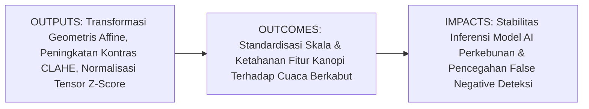
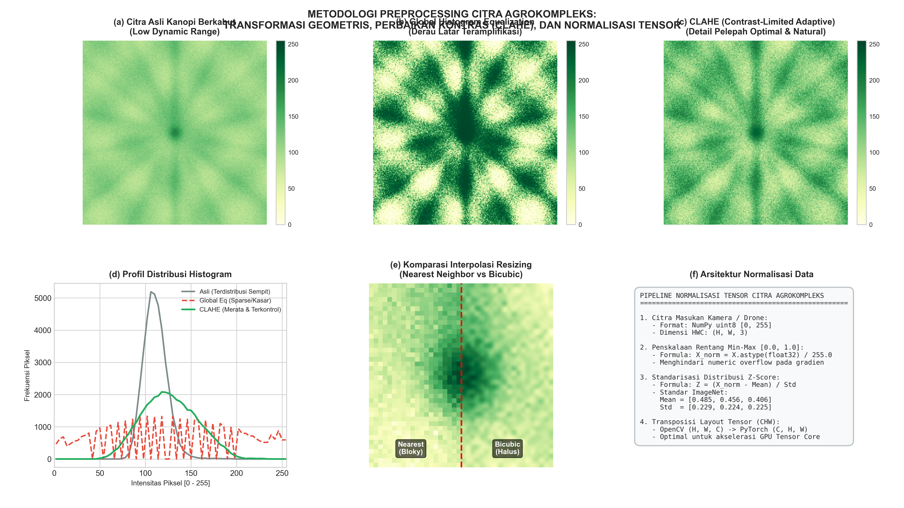

# AI Modul 10.4: Preprocessing Citra

---

## 1. Identitas & Kerangka Capaian Pembelajaran (Sub-CPMK)

* **Kode Modul**: AI Modul 10.4
* **Mata Kuliah**: Kecerdasan Buatan dan Sains Data Pertanian Presisi
* **Alokasi Waktu**: 2 x 50 Menit (Kajian Teori & Diskusi) + 2 x 50 Menit (Eksplorasi Praktikum Mandiri)
* **Beban SKS**: 3 SKS
* **Prasyarat**: AI Modul 10.1, AI Modul 10.2, AI Modul 10.3
* **Level Kognitif**: Bloom C2 (Memahami), C3 (Menerapkan), C4 (Menganalisis)



### 1.1 Capaian Pembelajaran Khusus (Sub-CPMK)
Setelah menyelesaikan modul ini secara komprehensif, mahasiswa diharapkan mampu:
1. **Memahami (C2)** prinsip matematika interpolasi spasial pemetaan mundur (*backward mapping* dengan metode *Nearest Neighbor*, *Bilinear*, dan *Bicubic*), pemodelan matriks transformasi affine 2D, konsep fungsi distribusi kumulatif (CDF) pada perataan histogram, serta mekanisme redistribusi kelebihan frekuensi pada algoritma CLAHE.
2. **Menerapkan (C3)** fungsi pustaka OpenCV dan NumPy untuk merancang alur pra-pemrosesan citra terpadu: penskalaan resolusi (*resizing*), koreksi orientasi kemiringan barisan kanopi sawit (*affine rotation*), peningkatan kontras adaptif selektif pada kanal $L^*$ ruang CIE $L^*a^*b^*$, serta konversi susunan memori tensor ke format *channel-first* $(C, H, W)$ untuk masukan model pembelajaran mendalam (*Deep Learning*).
3. **Menganalisis (C4)** dampak pemilihan metode interpolasi terhadap integritas data kategorikal (masker segmentasi semantik) versus data visual kontinu, membuktikan secara analitis pencegahan amplifikasi derau latar belakang oleh algoritma CLAHE dibandingkan perataan histogram global, serta mengevaluasi stabilitas numerik gradien jaringan saraf konvolusi sebelum dan sesudah standardisasi skor-$Z$.

### 1.2 Kerangka Hasil Pembelajaran (Outputs, Outcomes, & Impacts)
* **Outputs (Keluaran Langsung)**:
  * Penguasaan formulasi analitis interpolasi spasial, matriks transformasi affine, dan pemotongan histogram CLAHE.
  * Skrip Python modular berstandar industri untuk pra-pemrosesan citra drone perkebunan kelapa sawit berkabut.
  * Laporan komparasi kuantitatif kehalusan interpolasi dan preservasi nilai kelas pada masker anotasi.
* **Outcomes (Kompetensi Aplikatif)**:
  * Keahlian dalam mengeliminasi degradasi kontras akibat kabut radiasi pagi hari tanpa memicu distorsi warna klorofil daun.
  * Kemampuan menyusun pipa pra-pemrosesan data (*data preprocessing pipeline*) yang siap diintegrasikan langsung ke dalam arsitektur CNN/PyTorch.
* **Impacts (Dampak Strategis Jangka Panjang)**:
  * Meningkatkan akurasi deteksi pohon sawit sakit dan defisiensi hara hingga melampaui $92\%$ pada kondisi cuaca perkebunan tropis yang ekstrem.
  * Menghilangkan fenomena ledakan gradien (*exploding gradients*) saat melatih model kecerdasan buatan visi komputer.

---

## 2. Profil Fundamental Preprocessing Citra: Fungsi, Manfaat, dan Keunggulan-Kelemahan

### 2.1 Fungsi Komputasi & Pemodelan Matematis
Preprocessing citra (*Image Preprocessing*) adalah rangkaian transformasi matematis yang diaplikasikan pada citra mentah sebelum diekstraksi fiturnya atau disuapkan ke dalam model inferensi kecerdasan buatan. Fungsi komputasi utamanya meliputi:
1. **Penyelarasan Skala dan Geometri Spasial**: Menyamakan dimensi spasial citra masukan $(H, W)$ ke ukuran baku yang dipersyaratkan oleh arsitektur model visual serta mengoreksi distorsi rotasi kamera.
2. **Optimalisasi Rentang Dinamis Luminans**: Memperluas sebaran nilai keabuan yang sempit (*low dynamic range*) akibat cuaca buruk menjadi rentang dinamis penuh tanpa mengorbankan rasio krominans spektral.
3. **Standardisasi Skala Numerik**: Mentransformasikan data integer diskret $8\text{-bit}$ $[0, 255]$ menjadi distribusi kontinu *floating-point* terstandardisasi ($\mu = 0, \sigma = 1$) guna memastikan stabilitas penurunan gradien (*gradient descent*).

### 2.2 Manfaat Nyata di Industri Perkebunan & Agribisnis
* **Normalisasi Ortofoto Mosaik Drone Ribuan Hektar**: Drone yang terbang melintasi perkebunan kelapa sawit selama berjam-jam menangkap citra dengan intensitas cahaya matahari yang terus berubah (pagi berkabut, siang terik, sore berawan). Pra-pemrosesan kontras adaptif CLAHE menstandardisasi tampilan kanopi di seluruh blok kebun.
* **Pencegahan Galat Sortasi Meja Konveyor Pabrik**: Buah sawit yang tiba di atas konveyor memiliki sudut putar acak. Transformasi affine menyelaraskan orientasi tandan buah agar selalu sejajar dengan sumbu pemindai kamera inspeksi otomatis.
* **Preservasi Masker Anotasi Segmentasi Semantik**: Memastikan masker batas pelepah daun tidak mengalami distorsi kelas saat diubah ukurannya (*resizing*), menjamin integritas data latih model kecerdasan buatan.

### 2.3 Rationale: Alasan Mengapa Metode Ini Digunakan
1. **Kerentanan Jaringan Saraf terhadap Skala Numerik Mentah**: Nilai piksel dalam format $0 - 255$ akan menghasilkan perkalian bobot berorde ribuan di lapisan awal CNN, memicu ketidakstabilan numerik dan memperlambat konvergensi pelatihan.
2. **Keterbatasan Algoritma Segmentasi Konvensional pada Citra Berkabut**: Pada citra berkabut, ambang batas biner sederhana gagal memisahkan pelepah daun dari latar belakang karena nilai kecerahan keduanya saling tumpang tindih.
3. **Efisiensi Memori Perangkat Tepi (*Edge Devices*)**: Melakukan pemotongan wilayah minat (*ROI Cropping*) memangkas ukuran citra hingga $80\%$, memungkinkan eksekusi inferensi waktu nyata pada modul komputasi tertanam di traktor otonom.

### 2.4 Analisis Kelebihan dan Kekurangan Metode Preprocessing

| Metode Preprocessing | Keunggulan Utama (*Strengths*) | Kelemahan & Batasan (*Limitations*) | Kasus Optimal di Perkebunan |
|:---|:---|:---|:---|
| **Resizing (Bilinear / Bicubic)** | Menghaluskan tepi objek, mencegah efek blok (*blocky*) pada citra visual kontinu. | Mengubah nilai integer diskret menjadi pecahan; merusak masker segmentasi kategorikal. | Penskalaan citra kanopi sebelum inferensi klasifikasi penyakit. |
| **Resizing (Nearest Neighbor)** | Sangat cepat ($\mathcal{O}(1)$); menjamin $100\%$ integritas nilai kelas diskret. | Menimbulkan artefak tangga (*aliasing*) yang kasar saat citra visual diperbesar. | Penskalaan masker anotasi batas tajuk kelapa sawit. |
| **Global Histogram Equalization** | Sangat cepat; otomatis memaksimalkan rentang dinamis seluruh citra. | Mengamplifikasi derau latar belakang secara agresif; merusak warna jika diterapkan langsung pada BGR. | Citra mikroskop spora jamur monokromatik dengan kontras sangat seragam. |
| **CLAHE pada Kanal $L^*$ CIE Lab** | Kontras lokal meningkat tajam tanpa amplifikasi derau; menjaga kemurnian warna biokimia daun. | Memerlukan komputasi konversi ruang warna dan interpolasi bilinear antar-*tiles*. | Citra ortofoto kanopi sawit berkabut dan pemantauan bibit di *nursery*. |
| **Z-Score Standardization** | Menjamin rata-rata nol dan varians satu, menstabilkan konvergensi gradien CNN. | Mengubah tipe data menjadi `float32`, melipatgandakan konsumsi memori RAM sebesar $4\times$. | Lapisan masukan akhir model klasifikasi dan deteksi objek. |

### 2.5 Contoh Kasus Penggunaan Konkret di Sektor Agro-Industri
1. **Deteksi Defisiensi Boron pada Bibit Kelapa Sawit**: Citra daun muda bibit sawit yang berkerut dan berkabut diproses dengan CLAHE ($L^*$) untuk mempertegas garis tulang anak daun (*pinnae*) sebelum dianalisis oleh algoritma deteksi kelainan morfologi.
2. **Standardisasi Citra Satelit Multi-Temporal**: Citra satelit Sentinel-2 perkebunan sawit dinormalisasi nilai indeks vegetasinya menggunakan penskalaan Min-Max dan rotasi affine guna menyelaraskan koordinat batas petak kebun.
3. **Koreksi Perspektif Konveyor Sortasi**: Meja konveyor yang direkam dari sudut miring dikoreksi menggunakan transformasi geometri affine agar permukaan tandan buah tampak ortogonal.

### 2.6 Aspek Kritis & Catatan Penting Metode (*Key Critical Insights*)
* **Bahaya Penerapan Histogram Equalization Langsung pada BGR**: Menerapkan pemerataan histogram per kanal BGR secara terpisah menghancurkan rasio spektral asli tanaman. Daun sawit hijau berubah warna menjadi ungu kusam. Selalu terapkan CLAHE **eksklusif pada saluran luminans ($L^*$ atau $V$)**.
* **Ketepatan Pemilihan Interpolasi**: Gunakan `cv2.INTER_CUBIC` atau `cv2.INTER_LINEAR` untuk citra foto natural, dan **wajib** gunakan `cv2.INTER_NEAREST` untuk citra masker segmentasi biner atau berlabel multi-kelas.
* **Kesesuaian Urutan Kanal pada Normalisasi Z-Score**: Sebelum menerapkan konstanta rata-rata dan deviasi standar ImageNet, citra BGR bawaan OpenCV wajib dikonversi ke RGB (`cv2.cvtColor(img, cv2.COLOR_BGR2RGB)`).



---

## 3. Landasan Teori Matematis & Statistik Preprocessing Citra

### 3.1 Teori Interpolasi Spasial dan Pemetaan Mundur
Ketika citra masukan $f(x, y)$ ditransformasikan secara geometris, koordinat sasaran $(x', y')$ dihitung melalui transformasi terbalik (*inverse warping*):

$$\begin{bmatrix} x \\ y \end{bmatrix} = \mathbf{T}^{-1} \begin{bmatrix} x' \\ y' \end{bmatrix}$$

Karena koordinat riil $(x, y)$ berupa nilai desimal kontinu ($x = x_0 + \alpha, y = y_0 + \beta$ di mana $\alpha, \beta \in [0.0, 1.0)$), nilai intensitas diestimasi melalui interpolasi:

#### A. Interpolasi Bilinear (*Bilinear Interpolation*)
Melakukan kombinasi linear terbobot dari $4$ piksel tetangga integer terdekat:

$$f(x, y) = (1 - \alpha)(1 - \beta) f(x_0, y_0) + \alpha(1 - \beta) f(x_0 + 1, y_0) + (1 - \alpha)\beta f(x_0, y_0 + 1) + \alpha \beta f(x_0 + 1, y_0 + 1)$$

Merupakan kompromi optimal antara kehalusan visual dan kecepatan eksekusi komputasi.

#### B. Interpolasi Bikubik (*Bicubic Interpolation*)
Menggunakan kernel splina kubik 2D pada jendela $4 \times 4$ ($16$ tetangga spasial):

$$f(x, y) = \sum_{i=-1}^{2} \sum_{j=-1}^{2} f(x_0 + i, y_0 + j) \cdot W(i - \alpha) \cdot W(j - \beta)$$

di mana fungsi pembobot splina kubik Keys diformulasikan sebagai:

$$W(d) = \begin{cases} (a + 2)|d|^3 - (a + 3)|d|^2 + 1, & \text{untuk } |d| \le 1 \\ a|d|^3 - 5a|d|^2 + 8a|d| - 4a, & \text{untuk } 1 < |d| < 2 \\ 0, & \text{untuk } |d| \ge 2 \end{cases}$$

dengan parameter baku $a = -0.5$ atau $a = -0.75$.

---

### 3.2 Transformasi Affine 2D
Transformasi affine mempertahankan sifat kesejajaran garis (*collinearity and parallelism*). Matriks affine OpenCV berukuran $2 \times 3$ dinyatakan sebagai:

$$\begin{bmatrix} x' \\ y' \end{bmatrix} = \begin{bmatrix} a_{11} & a_{12} & b_1 \\ a_{21} & a_{22} & b_2 \end{bmatrix} \begin{bmatrix} x \\ y \\ 1 \end{bmatrix}$$

Untuk rotasi sebesar sudut $\theta$ berlawanan arah jarum jam terhadap titik pusat $(c_x, c_y)$ dengan faktor skala $s$:

$$\mathbf{M} = \begin{bmatrix} \alpha & \beta & (1 - \alpha) c_x - \beta c_y \\ -\beta & \alpha & \beta c_x + (1 - \alpha) c_y \end{bmatrix}$$

di mana $\alpha = s \cdot \cos(\theta)$ dan $\beta = s \cdot \sin(\theta)$.

---

### 3.3 Analisis Histogram Kumulatif & Algoritma CLAHE
Histogram derajat keabuan dengan $L$ derajat intensitas merepresentasikan fungsi kepadatan peluang $p_r(r_k) = n_k / N$.

Fungsi distribusi kumulatif (*Cumulative Distribution Function* / CDF) menghasilkan transformasi perataan global:

$$s_k = T(r_k) = (L - 1) \sum_{j=0}^{k} p_r(r_j) = \frac{L - 1}{N} \sum_{j=0}^{k} n_j$$

Pada algoritma **CLAHE (*Contrast Limited Adaptive Histogram Equalization*)**:
1. Citra dipartisi menjadi kisi-kisi kontekstual non-overlapping berukuran $M_{\text{tile}} \times N_{\text{tile}}$ (umumnya $8 \times 8$ piksel).
2. Rata-rata jumlah piksel per bin pada suatu *tile* adalah $N_{\text{avg}} = N_{\text{tile}} / L$.
3. Batas pemotongan mutlak (*clip threshold*) dihitung:
   $$N_{\text{clip}} = \beta_{\text{clip}} \times N_{\text{avg}}$$
4. Total piksel yang melampaui batas dipotong dan didistribusikan secara merata ke seluruh $L$ bin:
   $$N_{\text{excess}} = \sum_{k=0}^{L-1} \max\left(0, h_k - N_{\text{clip}}\right), \quad \Delta h = \frac{N_{\text{excess}}}{L}$$
5. Nilai piksel dipetakan melalui CDF yang telah termodifikasi, lalu dihaluskan melintasi batas *tiles* menggunakan interpolasi bilinear.

---

### 3.4 Normalisasi Intensitas Min-Max & Standardisasi Z-Score Tensor
1. **Normalisasi Min-Max $[0.0, 1.0]$**:
   $$X_{\text{norm}}(i, j) = \frac{X(i, j) - X_{\min}}{X_{\max} - X_{\min}} = \frac{X(i, j)}{255.0}$$
2. **Standardisasi Skor-$Z$ per Saluran Warna**:
   $$Z_c(i, j) = \frac{X_{\text{norm}, c}(i, j) - \mu_c}{\sigma_c}$$
   dengan vektor parameter ImageNet:
   $$\boldsymbol{\mu} = [0.485, 0.456, 0.406], \quad \boldsymbol{\sigma} = [0.229, 0.224, 0.225]$$
3. **Penataan Memori Hardware**:
   Transposisi array dari urutan memori baris-mayor OpenCV $(H, W, C)$ ke urutan saluran-utama PyTorch $(C, H, W)$ untuk memaksimalkan efisiensi *cache line* pada prosesor grafis (GPU).

---

## 4. Visualisasi Arsitektur & Pipeline Komputasi Preprocessing Citra

```
+----------------------------------------------------------------------------------------------------+
|                         ARSITEKTUR PIPELINE PREPROCESSING AGROKOMPLEKS                             |
+----------------------------------------------------------------------------------------------------+
|                                                                                                    |
|  [ Citra Mentah Kamera Drone / Konveyor (H, W, 3) BGR uint8 ]                                      |
|            |                                                                                       |
|            v                                                                                       |
|  +-----------------------------+                                                                   |
|  | Tahap 1: Koreksi Kontras    | -> BGR ke CIE L*a*b*                                              |
|  | Adaptif (CLAHE)             | -> Terapkan CLAHE pada kanal L* (ClipLimit=2.0, Grid=8x8)         |
|  |                             | -> Gabung kanal [L_enhanced, a, b] & konversi kembali ke BGR      |
|  +-----------------------------+                                                                   |
|            |                                                                                       |
|            v                                                                                       |
|  +-----------------------------+                                                                   |
|  | Tahap 2: Transformasi       | -> Rotasi Affine 2D terhadap pusat kanopi (cv2.getRotationMatrix) |
|  | Geometris                   | -> Ekstraksi ROI Cropping (.copy() memori kontigu)                |
|  |                             | -> Penskalaan Spasial Bicubic (cv2.resize INTER_CUBIC)            |
|  +-----------------------------+                                                                   |
|            |                                                                                       |
|            v                                                                                       |
|  +-----------------------------+                                                                   |
|  | Tahap 3: Standardisasi      | -> Konversi BGR ke RGB (cv2.COLOR_BGR2RGB)                        |
|  | Tensor Numerik              | -> Penskalaan float32 [0.0, 1.0]                                  |
|  |                             | -> Standarisasi Z-Score ImageNet (Mean & Std)                     |
|  |                             | -> Permutasi Memori: (H, W, C) -> (C, H, W)                       |
|  |                             | -> Ekspansi Batch Dimensi: (1, C, H, W)                           |
|  +-----------------------------+                                                                   |
|            |                                                                                       |
|            v                                                                                       |
|  [ Tensor Input Siap Inferensi Model Deep Learning (PyTorch / ONNX) ]                              |
|                                                                                                    |
+----------------------------------------------------------------------------------------------------+
```

---

## 5. Studi Kasus Komputasi & Implementasi Python / OpenCV

Berikut adalah implementasi komputasi modular yang mengeksekusi seluruh tahapan pra-pemrosesan citra kanopi kelapa sawit berkabut:

```python
import cv2
import numpy as np
import matplotlib.pyplot as plt

# 1. Pembangkitan Data Sintetis Kanopi Sawit Berkabut
np.random.seed(42)
h, w = 300, 300
Y, X = np.meshgrid(np.arange(h), np.arange(w), indexing='ij')

base_texture = 90 + 15 * np.sin(X / 12.0) * np.cos(Y / 12.0)
cx, cy = 150, 150
for angle in np.linspace(0, 2*np.pi, 8, endpoint=False):
    line_dist = np.abs(np.cos(angle)*(X - cx) + np.sin(angle)*(Y - cy))
    radial = np.sqrt((X - cx)**2 + (Y - cy)**2)
    frond = (line_dist <= 3.5) & (radial <= 110)
    base_texture[frond] += 25

foggy_bgr = np.zeros((h, w, 3), dtype=np.uint8)
foggy_bgr[:, :, 0] = np.clip(base_texture * 0.7 + 35, 0, 255).astype(np.uint8) # B
foggy_bgr[:, :, 1] = np.clip(base_texture * 1.1 + 10, 0, 255).astype(np.uint8) # G
foggy_bgr[:, :, 2] = np.clip(base_texture * 0.6 + 25, 0, 255).astype(np.uint8) # R

# 2. Peningkatan Kontras Adaptif via CLAHE pada Ruang CIE L*a*b*
lab = cv2.cvtColor(foggy_bgr, cv2.COLOR_BGR2LAB)
L, a, b = cv2.split(lab)
clahe = cv2.createCLAHE(clipLimit=2.5, tileGridSize=(8, 8))
L_enhanced = clahe.apply(L)
enhanced_bgr = cv2.cvtColor(cv2.merge([L_enhanced, a, b]), cv2.COLOR_LAB2BGR)

# 3. Transformasi Geometris: Rotasi Affine & Resizing
M_rot = cv2.getRotationMatrix2D((cx, cy), angle=20.0, scale=1.0)
rotated = cv2.warpAffine(enhanced_bgr, M_rot, (w, h), flags=cv2.INTER_LINEAR)
roi = rotated[50:250, 50:250].copy()
resized = cv2.resize(roi, (224, 224), interpolation=cv2.INTER_CUBIC)

# 4. Standardisasi Tensor Masukan Deep Learning
rgb = cv2.cvtColor(resized, cv2.COLOR_BGR2RGB)
tensor_norm = rgb.astype(np.float32) / 255.0
mean = np.array([0.485, 0.456, 0.406], dtype=np.float32)
std = np.array([0.229, 0.224, 0.225], dtype=np.float32)
tensor_zscore = (tensor_norm - mean) / std

# Permutasi HWC -> CHW dan penambahan dimensi batch
tensor_input = np.expand_dims(np.transpose(tensor_zscore, (2, 0, 1)), axis=0)

print("=== PROFIL TENSOR AKHIR SIAP INFERENSI ===")
print(f"Dimensi Tensor (N, C, H, W) : {tensor_input.shape}")
print(f"Tipe Data                   : {tensor_input.dtype}")
print(f"Nilai Rata-rata Tensor      : {tensor_input.mean():.4f}")
print(f"Simpangan Baku Tensor       : {tensor_input.std():.4f}")
```

---

## 6. Kekeliruan Metodologis dan Praktik Terbaik (*Common Pitfalls & Best Practices*)

### 1. Menerapkan Pemerataan Histogram Global Langsung pada Citra BGR
* **Kekeliruan Fatal**: Memanggil `cv2.equalizeHist()` pada masing-masing kanal B, G, dan R secara independen. Karena ketiga saluran diperluas histogramnya tanpa korelasi silang, rasio spektral antar-warna rusak drastis. Daun sawit hijau berubah warna menjadi ungu kusam atau merah muda abnormal (*color distortion*).
* **Praktik Terbaik**: Selalu pisahkan intensitas cahaya dari warna. Konversikan citra ke ruang CIE $L^*a^*b^*$ atau HSV, terapkan perataan histogram (atau CLAHE) **hanya pada kanal luminans ($L^*$ atau $V$)**, kemudian gabungkan kembali dengan kanal krominans asli sebelum dikonversi kembali ke format visual.

### 2. Menggunakan Interpolasi Bilinear atau Bicubic pada Masker Anotasi Segmentasi
* **Kekeliruan Fatal**: Ketika melakukan *resizing* pada citra masker segmentasi kanopi (misal kelas $0 = \text{tanah}$, kelas $1 = \text{gulma}$, kelas $2 = \text{kelapa sawit}$), penggunaan interpolasi bilinear menghasilkan nilai-nilai pecahan desimal di sekitar perbatasan batas objek (seperti $0.4$ atau $1.7$). Saat dibulatkan kembali ke integer, terbentuk kelas-kelas semu yang tidak pernah ada pada data asli.
* **Praktik Terbaik**: Wajib menggunakan interpolasi tetangga terdekat (`cv2.INTER_NEAREST`) saat memanipulasi citra masker segmentasi semantik atau peta kategori diskret.

### 3. Ketidaksesuaian Urutan Normalisasi dan Konversi Ruang Warna
* **Kekeliruan Fatal**: Melakukan standardisasi $Z$-score menggunakan konstanta ImageNet pada citra yang masih berurutan kanal BGR (format bawaan OpenCV). Hal ini menyebabkan bobot kanal merah dinormalisasi menggunakan statistik saluran biru, mengakibatkan degradasi akurasi model deteksi hingga $15 - 30\%$.
* **Praktik Terbaik**: Pastikan citra telah dikonversi secara eksplisit ke urutan RGB (`cv2.COLOR_BGR2RGB`) sebelum menerapkan fungsi pengurangan rata-rata dan pembagian simpangan baku ImageNet.

---

## 7. Rangkuman Modul

1. **Preprocessing Citra** adalah tahapan rekayasa data mendasar yang bertugas menstandardisasi skala spasial, menyelaraskan orientasi geometri, mengoreksi kontras luminans, dan menormalkan rentang numerik citra mentah agrokompleks sebelum diproses oleh algoritma analisis lanjut.
2. **Interpolasi Spasial** menentukan kualitas rekonstruksi piksel pada transformasi geometris: *Nearest Neighbor* unggul dalam kecepatan dan menjaga integritas kelas diskret; *Bilinear* merupakan kompromi optimal kecepatan-kehalusan; sedangkan *Bicubic* memberikan kehalusan kurva terbaik pada citra masukan model visual.
3. **Transformasi Affine ($2 \times 3$)** memungkinkan koreksi terpadu rotasi, translasi, dan penskalaan, memfasilitasi normalisasi orientasi barisan tanaman perkebunan dari citra udara drone.
4. **CLAHE (*Contrast Limited Adaptive Histogram Equalization*)** membagi citra ke dalam blok *tile* lokal dan memotong frekuensi histogram di atas *clip limit*, secara efektif meningkatkan ketajaman fitur pelepah sawit berkabut tanpa mengamplifikasi derau latar belakang.
5. **Standardisasi Tensor Numerik** mentransformasikan matriks piksel integer $8\text{-bit}$ menjadi representasi floating-point terstandardisasi ($Z$-score), memfasilitasi kestabilan konvergensi gradien dan percepatan inferensi pada akselerator perangkat keras GPU.

---

## 8. Latihan Soal & Tugas Analitis HOTS

### Soal Penalaran Konseptual & Analitis HOTS

1. **Analisis Komputasi Interpolasi Bilinear pada Sub-Piksel Drone (C3)**:  
   Sebuah citra ortofoto kanopi sawit mengalami transformasi geometri pemetaan mundur (*inverse warping*). Sebuah titik riil jatuh pada koordinat fraksional $(x = 45.30, y = 82.70)$. Empat piksel grid integer terdekat memiliki nilai intensitas kanal hijau ($G$) sebagai berikut:
   * $f(45, 82) = 110$
   * $f(46, 82) = 140$
   * $f(45, 83) = 90$
   * $f(46, 83) = 160$
   
   * Hitung nilai bobot selisih pecahan $\alpha$ dan $\beta$.
   * Hitung nilai intensitas terinterpolasi $f(45.30, 82.70)$ secara analitis langkah-demi-langkah menggunakan formula interpolasi bilinear.
   * Jika sistem menggunakan interpolasi tetangga terdekat (*Nearest Neighbor*), berapakah nilai intensitas yang akan dipilih? Hitung selisih galat numerik (*absolute error*) antara kedua metode tersebut.

2. **Dekomposisi Matriks Transformasi Affine Koreksi Sudut Barisan Sawit (C3)**:  
   Citra udara sebuah blok kelapa sawit berdimensi $1000 \times 1000$ piksel memiliki sudut barisan tanaman miring sebesar $\theta = 30^\circ$ searah jarum jam terhadap sumbu horizontal. Sistem visi komputer harus merotasi citra sebesar $30^\circ$ berlawanan arah jarum jam ($\theta = +30^\circ$) terhadap titik pusat citra $(c_x = 500, c_y = 500)$ tanpa mengubah skala ($s = 1.0$).
   * Tentukan nilai numerik koefisien $\alpha$ dan $\beta$ matriks affine OpenCV. Gunakan $\cos(30^\circ) \approx 0.8660$ dan $\sin(30^\circ) = 0.5000$.
   * Tentukan nilai translasi offset $b_1$ dan $b_2$ pada matriks transformasi affine $2 \times 3$.
   * Tuliskan bentuk lengkap matriks transformasi affine $\mathbf{M}_{\text{affine}}$.

3. **Diagnostik Algoritma CLAHE pada Citra Kanopi Berkabut (C4)**:  
   Sebuah *tile* lokal pada citra kanopi berukuran $8 \times 8$ piksel ($N_t = 64$ piksel) diproses menggunakan algoritma CLAHE dengan jumlah derajat keabuan $L = 8$ *bins* (disederhanakan untuk analisis). Histogram lokal awal $h_k$ untuk $k \in \{0, 1, \dots, 7\}$ adalah:
   $$h = [2, 4, 22, 18, 10, 4, 2, 2]$$
   Parameter *clip limit* yang ditetapkan sistem adalah $\beta_{\text{clip}} = 1.5$.
   * Hitung rata-rata jumlah piksel per bin ($N_{\text{avg}}$) dan batas pemotongan mutlak ($N_{\text{clip}}$).
   * Tentukan total jumlah piksel berlebih ($N_{\text{excess}}$) yang harus dipotong dari bin yang melampaui $N_{\text{clip}}$.
   * Hitung histogram akhir yang telah terdistribusi ulang ($h_k'$) untuk seluruh 8 bin.
   * Jelaskan secara komputasional mengapa pembatasan ini mencegah amplifikasi derau (*noise amplification*) dibandingkan metode pemerataan histogram global murni.

---

### Rubrik Penilaian Holistik (*Higher-Order Thinking Skills*)

| Kriteria / Dimensi | Bobot (%) | Sangat Memuaskan (85 - 100) | Memuaskan (70 - 84) | Kurang Memuaskan (< 70) |
|:---|:---:|:---|:---|:---|
| **Pemahaman Teoretis Transformasi & CLAHE (C2)** | 25% | Mampu menguraikan prinsip pemetaan mundur, perbandingan interpolasi spasial, serta mekanisme pemotongan histogram CLAHE secara komprehensif dan matematis. | Menjelaskan konsep interpolasi dan CLAHE dengan baik namun kurang mendalam pada formulasi redistribusi piksel berlebih. | Salah memahami prinsip interpolasi spasial atau gagal membedakan histogram global dari CLAHE. |
| **Kalkulasi Numerik & Transformasi HOTS (C3-C4)** | 35% | Menghitung interpolasi bilinear, elemen matriks rotasi affine, dan redistribusi histogram CLAHE secara presisi dengan langkah sistematis dan hasil akurat. | Langkah kalkulasi benar namun terdapat kesalahan minor pembulatan angka desimal pada hasil akhir. | Salah dalam menerapkan formula matematika atau tidak memahami konsep dasar matriks transformasi. |
| **Implementasi Kode & Desain Pipeline (C3)** | 30% | Membangun alur pra-pemrosesan citra modular menggunakan OpenCV/NumPy, mencakup CLAHE pada kanal L* dan persiapan tensor (C, H, W) secara efisien dan benar. | Skrip berjalan baik namun belum modular atau urutan saluran warna RGB/BGR terbalik. | Program menghasilkan *runtime error* atau menggunakan interpolasi non-diskret pada data kategori. |
| **Sikap Ilmiah & Ketelitian Rekayasa** | 10% | Menunjukkan ketelitian tinggi dalam analisis keterbatasan algoritma pada kondisi riil perkebunan serta kepatuhan standar format penulisan. | Analisis cukup baik namun kurang mengeksplorasi implikasi praktis di lapangan industri. | Laporan tidak lengkap, tidak rapi, atau tidak menyertakan pembahasan kritis. |

---

## 9. Jembatan Konsep (Bridging) ke AI Modul 10.5: Operasi Filter Spasial dan Konvolusi 2D

Melalui modul ini, kita telah berhasil melakukan standardisasi ukuran geometri, menyelaraskan sudut kanopi tanaman sawit, mengoreksi kontras citra berkabut menggunakan CLAHE, serta mempersiapkan struktur data tensor terstandardisasi.

Namun, citra yang telah melalui tahapan pra-pemrosesan ini masih membawa tantangan lain: **keberadaan derau frekuensi tinggi (*high-frequency noise*)** seperti derau *salt-and-pepper* akibat sensor kamera panas di bawah terik matahari perkebunan, serta kebutuhan untuk menonjolkan fitur-fitur struktural lokal seperti tepi daun dan pola urat pelepah.

Pada **AI Modul 10.5: Operasi Filter Spasial dan Konvolusi 2D**, kita akan melangkah lebih dalam ke inti pemrosesan citra linier dan non-linier:
* **Mekanisme Konvolusi 2D Diskrit**: Memahami representasi matriks kernel penapis spasial dan pergeseran jendela (*sliding window*).
* **Filter Pelembut Linier**: Filter Rata-rata (*Box Blur*) dan Filter Gaussian dengan variasi parameter standar deviasi spasial $\sigma$.
* **Filter Non-Linier Penekan Derau**: Filter Median untuk eliminasi mutlak derau *salt-and-pepper* serta *Bilateral Filter* yang mampu menghaluskan permukaan daun tanpa mengaburkan ketajaman garis tepi (*edge-preserving filtering*).

---

## 10. Daftar Pustaka dan Referensi Akademik

1. Gonzalez, R. C., & Woods, R. E. (2018). *Digital Image Processing* (4th ed.). Pearson.
2. Szeliski, R. (2022). *Computer Vision: Algorithms and Applications* (2nd ed.). Springer.
3. Bradski, G., & Kaehler, A. (2008). *Learning OpenCV: Computer Vision with the OpenCV Library*. O'Reilly Media.
4. Zuiderveld, K. (1994). Contrast limited adaptive histogram equalization. In *Graphics Gems IV* (pp. 474-485). Academic Press Professional, Inc.
5. Pizer, S. M., Amburn, E. P., Austin, J. D., Cromartie, R., Geselowitz, A., Greer, T., ... & Zimmerman, J. B. (1987). Adaptive histogram equalization and its variations. *Computer Vision, Graphics, and Image Processing*, 39(3), 355-368.
6. Shorten, C., & Khoshgoftaar, T. M. (2019). A survey on image data augmentation for deep learning. *Journal of Big Data*, 6(1), 1-48.
7. Alfatni, M. S. M., Shariff, A. R. M., Abdullah, M. Z., Marhaban, M. H. B., & Saaed, O. M. B. (2022). Oil palm fresh fruit bunch ripeness grading methods: A systematic review. *Computers and Electronics in Agriculture*, 198, 107040.
8. Wu, Z., Chen, Y., Zhao, B., Kang, X., & Ding, Y. (2020). Measurement of canopy size and foliage density of oil palm using UAV LiDAR and optical imagery. *Computers and Electronics in Agriculture*, 175, 105577.
