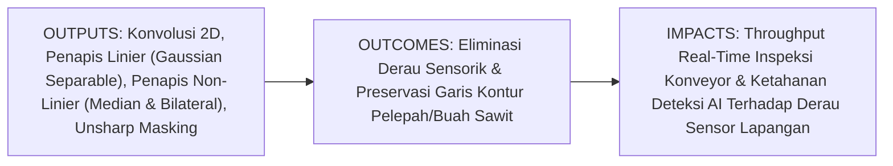
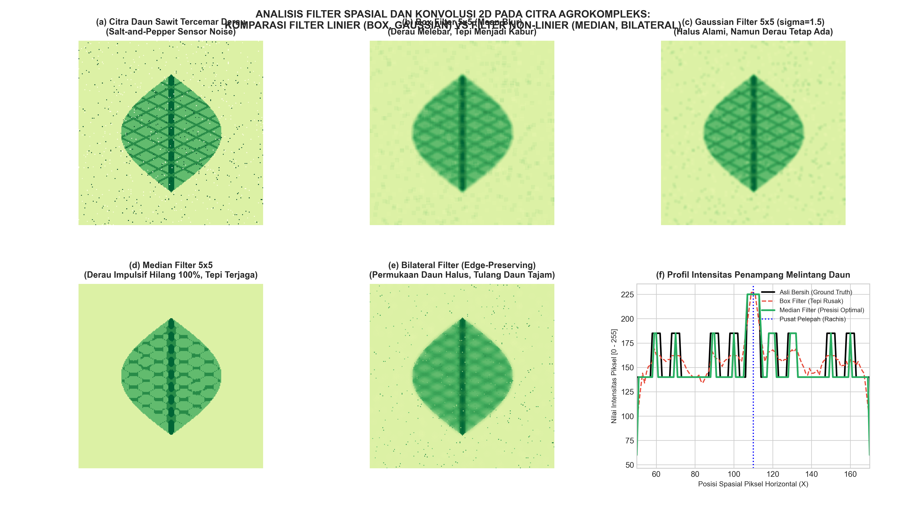

# AI Modul 10.5: Operasi Filter Spasial dan Konvolusi 2D

---

## 1. Identitas & Kerangka Capaian Pembelajaran (Sub-CPMK)

* **Kode Modul**: AI Modul 10.5
* **Mata Kuliah**: Kecerdasan Buatan dan Sains Data Pertanian Presisi
* **Alokasi Waktu**: 2 x 50 Menit (Kajian Teori & Diskusi) + 2 x 50 Menit (Eksplorasi Praktikum Mandiri)
* **Beban SKS**: 3 SKS
* **Prasyarat**: AI Modul 10.1, AI Modul 10.2, AI Modul 10.4
* **Level Kognitif**: Bloom C2 (Memahami), C3 (Menerapkan), C4 (Menganalisis)



### 1.1 Capaian Pembelajaran Khusus (Sub-CPMK)
Setelah menyelesaikan modul ini secara komprehensif, mahasiswa diharapkan mampu:
1. **Memahami (C2)** prinsip matematika operasi konvolusi spasial 2D diskrit versus korelasi silang, penanganan batas (*zero, replicate, reflect padding*), sifat keterpisahan kernel (*separable kernel*) Gaussian 2D menjadi dua penapis 1D, serta formulasi pembobotan geometris dan radiometrik pada penapis bilateral (*Bilateral Filter*).
2. **Menerapkan (C3)** fungsi pustaka OpenCV (`cv2.filter2D`, `cv2.GaussianBlur`, `cv2.medianBlur`, `cv2.bilateralFilter`) untuk mereduksi derau impulsif (*salt-and-pepper*) dan derau termal fotodioda sensor drone, serta merekonstruksi kontur urat daun yang kabur menggunakan teknik *Unsharp Masking* bebas aritmatika *overflow*.
3. **Menganalisis (C4)** perbedaan mendasar performa penapis linier versus penapis non-linier menggunakan evaluasi kuantitatif metrik PSNR (*Peak Signal-to-Noise Ratio*), membuktikan secara analitis efisiensi percepatan komputasi $\mathcal{O}(2K)$ versus $\mathcal{O}(K^2)$, serta memvalidasi kemampuan preservasi garis tepi pelepah daun menggunakan profil penampang intensitas spasial 1D.

### 1.2 Kerangka Hasil Pembelajaran (Outputs, Outcomes, & Impacts)
* **Outputs (Keluaran Langsung)**:
  * Penguasaan formulasi analitis konvolusi 2D manual, dekomposisi kernel Gaussian, dan pembobotan bilateral filter.
  * Skrip Python modular berstandar industri untuk pembersihan derau sensor termal dan penajaman tekstur pelepah sawit.
  * Grafik komparasi profil penampang intensitas 1D yang membuktikan keunggulan *edge-preserving filtering*.
* **Outcomes (Kompetensi Aplikatif)**:
  * Keahlian memilih penapis spasial yang tepat berdasarkan jenis degradasi fisik citra (derau bintik sensorik vs derau Gaussian vs tepi tumpul).
  * Kemampuan mengoptimalkan operasi penapisan pada aliran video waktu nyata (*real-time processing*) di perangkat komputasi tepi (*edge hardware*).
* **Impacts (Dampak Strategis Jangka Panjang)**:
  * Menjamin kelancaran inspeksi sortasi mutu buah kelapa sawit pada meja konveyor pabrik berkecepatan tinggi tanpa *frame drop*.
  * Mencegah kesalahan diagnosis penyakit tanaman akibat derau sensor kamera drone yang menyerupai lesi bercak daun.

---

## 2. Profil Fundamental Operasi Filter Spasial dan Konvolusi 2D: Fungsi, Manfaat, dan Keunggulan-Kelemahan

### 2.1 Fungsi Komputasi & Pemodelan Matematis
Operasi filter spasial dan konvolusi 2D adalah pemrosesan citra digital di mana nilai setiap piksel keluaran dihitung dari kombinasi terbobot piksel-piksel dalam lingkungan tetangganya (*neighborhood processing*). Fungsi komputasi utamanya meliputi:
1. **Reduksi Derau (*Denoising / Smoothing*)**: Meredam fluktuasi intensitas acak frekuensi tinggi yang ditimbulkan oleh ketidaksempurnaan sensor kamera optik atau kondisi pencahayaan buruk.
2. **Penajaman Fitur (*Sharpening / High-Pass Filtering*)**: Menonjolkan batas-batas transisi kontras lokal (tepi pelepah, duri buah, pola urat daun) untuk memperjelas fitur struktural biomassa.
3. **Fondasi Arsitektur Pembelajaran Mesin Konvolusional**: Konvolusi 2D merupakan blok pembangun mendasar lapisan ekstraksi fitur otomatis pada jaringan saraf tiruan konvolusional (*Convolutional Neural Networks / CNN*).

### 2.2 Manfaat Nyata di Industri Perkebunan & Agribisnis
* **Pembersihan Derau Termal Kamera Drone**: Drone pemetaan yang beroperasi di perkebunan sawit pada siang hari menghadapi suhu tinggi (radiasi matahari tropis) yang memicu fenomena arus gelap (*dark current*) pada sensor CMOS, memunculkan derau bintik putih tajam (*salt noise*). Median filter melenyapkan derau ini seketika.
* **Preservasi Siluet Pelepah Daun**: Bilateral filter membersihkan variasi klorofil pada permukaan helaian daun tanpa menumpulkan garis batas tajam antara pelepah sawit dan latar belakang tanah gambut.
* **Penajaman Citra TBS pada Konveyor Bergetar**: Tandan Buah Segar yang bergerak cepat di atas konveyor stasiun sortasi pabrik sering kali mengalami kekaburan gerak (*motion blur*). Teknik *Unsharp Masking* mengembalikan ketajaman kontur brondolan untuk memfasilitasi segmentasi fraksi kematangan.

### 2.3 Rationale: Alasan Mengapa Metode Ini Digunakan
1. **Kegagalan Pemrosesan Piksel Titik (*Point Processing*)**: Operasi titik tunggal (seperti penyesuaian kecerahan atau kontras) tidak mampu membedakan apakah sebuah piksel terang adalah bagian dari urat daun asli atau bintik derau sensor rusak. Hanya analisis spasial lingkungan tetangga yang mampu membedakannya.
2. **Keterpisahan Matematis untuk Pemrosesan Waktu Nyata**: Sifat *separable* pada kernel Gaussian memungkinkan pemrosesan citra video beresolusi tinggi pada kamera inspeksi pabrik kelapa sawit tanpa membebani prosesor secara berlebihan.
3. **Ketahanan Non-Linier Terhadap Pencilan Ekstrim**: Filter linier selalu terdistorsi oleh nilai ekstrim (0 atau 255), sedangkan filter non-linier berbasis ranking (Median) secara matematis membuang pencilan tersebut.

### 2.4 Analisis Kelebihan dan Kekurangan Metode Penapisan Spasial

| Metode Penapis | Keunggulan Utama (*Strengths*) | Kelemahan & Batasan (*Limitations*) | Kasus Optimal di Perkebunan |
|:---|:---|:---|:---|
| **Box Filter (Mean Blur)** | Komputasi paling sederhana dan cepat. | Mengaburkan tepi objek secara agresif; menyebarkan derau bintik menjadi gumpalan abu-abu. | Penghalusan latar belakang citra yang seragam. |
| **Gaussian Blur** | Pelembutan sangat alami; bersifat *separable* ($\mathcal{O}(2K)$) dengan percepatan komputasi tinggi. | Tetap menumpulkan garis batas tepi objek tanaman jika nilai $\sigma$ terlalu besar. | Reduksi derau halus Gaussian sebelum deteksi tepi Canny. |
| **Median Filter** | Melenyapkan derau impulsif (*salt-and-pepper*) $100\%$ tanpa mengaburkan ketajaman kontur. | Kompleksitas sorting non-linier; tidak dapat didekomposisi menjadi penapis terpisah. | Citra drone tercemar derau termal sensor di kebun kelapa sawit. |
| **Bilateral Filter** | Menghaluskan permukaan objek secara adaptif sambil mempertahankan garis tepi (*edge-preserving*). | Sangat intensif secara komputasi; memerlukan perhitungan bobot fotometrik per piksel. | Inspeksi visual daun sawit berpenyakit dengan kontur lesi tajam. |
| **Unsharp Masking** | Menonjolkan detail mikro dan urat pelepah secara dramatis melalui amplifikasi selisih frekuensi tinggi. | Berpotensi mengamplifikasi derau jika citra awal belum dihaluskan secara memadai. | Penajaman citra tandan buah sawit pada meja konveyor sortasi PKS. |

### 2.5 Contoh Kasus Penggunaan Konkret di Sektor Agro-Industri
1. **Inspeksi Bercak Oranye (*Orange Spotting*) Daun Sawit**: Lesi defisiensi kalium berukuran 2-5 piksel dibersihkan dari derau sensorik menggunakan Median Filter 3x3 agar tidak memicu deteksi positif palsu pada sistem kecerdasan buatan.
2. **Monitoring Kanopi Pohon via Video Drone**: Aliran video drone 30 FPS Full HD diproses menggunakan Gaussian Blur 1D terpisah (*separable horizontal-vertical*) untuk menyaring tekstur semak rumput tanpa menurunkan laju bingkai (*frame rate*).
3. **Segmentasi Brondolan TBS di Stasiun Sortasi PKS**: Tandan Buah Segar yang bergerak di atas meja getar diproses menggunakan Bilateral Filter untuk meratakan warna jingga mesokarp sambil menjaga garis batas antar-buah tetap kontras.

### 2.6 Aspek Kritis & Catatan Penting Metode (*Key Critical Insights*)
* **Bahaya Integer Underflow pada Unsharp Masking**: Pengurangan citra mentah pada tipe data bawaan `uint8` (`img - blurred`) memicu pembungkusan (*wrapping*) modulo 256 pada nilai negatif (misal $40 - 70 = -30 \to 226$), menghasilkan ribuan bintik putih buatan. **Wajib** lakukan konversi ke `np.float32` sebelum kalkulasi dan terapkan fungsi saturasi `np.clip(..., 0, 255).astype(np.uint8)`.
* **Keterpisahan Kernel Gaussian**: Pada implementasi sistem terpasang (*embedded systems*), jangan pernah memanggil konvolusi 2D langsung untuk kernel Gaussian berukuran besar. Gunakan dua konvolusi 1D berturutan untuk menghemat operasi komputasi hingga $5 - 10\times$.
* **Pemilihan Ukuran Kernel Ganjil**: Selalu gunakan ukuran kernel berdimensi ganjil ($3 \times 3, 5 \times 5, 7 \times 7$) agar posisi titik pusat jangkar (*anchor point*) berada tepat di koordinat piksel tengah simetris.



---

## 3. Landasan Teori Matematis & Statistik Filter Spasial dan Konvolusi 2D

### 3.1 Teori Konvolusi 2D Diskrit vs Korelasi Silang & Padding Batas
Konvolusi 2D diskrit formal antara citra $f(x, y)$ dan kernel penapis $w(s, t)$ berukuran $(2a+1) \times (2b+1)$ didefinisikan dengan membalik kernel $180^\circ$:

$$g(x, y) = (f * w)(x, y) = \sum_{s=-a}^{a} \sum_{t=-b}^{b} w(s, t) f(x - s, y - t)$$

Sedangkan korelasi silang (*cross-correlation*) mengeksekusi operasi geser-lingkup tanpa pembalikan kernel:

$$g(x, y) = (w \star f)(x, y) = \sum_{s=-a}^{a} \sum_{t=-b}^{b} w(s, t) f(x + s, y + t)$$

*Catatan Rekayasa*: Jika kernel penapis simetris secara spasial ($w(s, t) = w(-s, -t)$), seperti kernel Gaussian atau Laplacian, hasil konvolusi dan korelasi silang adalah identik secara matematis.

Untuk mempertahankan dimensi citra pada batas tepi, diterapkan strategi penambahan batas (*padding*):
1. **Replicate / Clamp**: $f(-1, y) = f(0, y)$ (mereplikasi nilai batas terluar).
2. **Reflect / Mirror**: $f(-1, y) = f(1, y)$ (mencerminkan nilai secara simetris, standar industri terbaik).

---

### 3.2 Filter Pelembut Linier & Keterpisahan Kernel Gaussian
Fungsi Gaussian 2D kontinu dengan varians spasial $\sigma^2$ dirumuskan sebagai:

$$G(x, y) = \frac{1}{2\pi \sigma^2} \exp\left( -\frac{x^2 + y^2}{2\sigma^2} \right)$$

Karena eksponen penjumlahan adalah perkalian eksponen, fungsi ini dapat difaktorkan (*separable*):

$$G(x, y) = \left[ \frac{1}{\sqrt{2\pi}\sigma} \exp\left(-\frac{x^2}{2\sigma^2}\right) \right] \cdot \left[ \frac{1}{\sqrt{2\pi}\sigma} \exp\left(-\frac{y^2}{2\sigma^2}\right) \right] = G_{1D}(x) \cdot G_{1D}(y)$$

* **Analisis Kompleksitas Komputasi**:
  * Konvolusi 2D langsung pada citra $H \times W$ dengan kernel $K \times K$: $\mathcal{O}(H \cdot W \cdot K^2)$ operasi perkalian-akumulasi (MAC).
  * Konvolusi 1D terpisah: $\mathcal{O}(H \cdot W \cdot 2K)$ operasi MAC.
  * Faktor percepatan (*speedup*):
    $$\text{Speedup} = \frac{K^2}{2K} = \frac{K}{2}$$

---

### 3.3 Filter Non-Linier: Median Filter & Bilateral Filter
#### A. Median Filter
Mengurutkan seluruh nilai intensitas dalam jendela lingkungan tetangga $\Omega$ dan mengambil nilai median:

$$g(x, y) = \text{median}\left\{ f(x + s, y + t) \mid (s, t) \in \Omega \right\}$$

Pencilan nilai $0$ (pepper) dan $255$ (salt) akan selalu terlempar ke batas ekstrim deretan terurut, sehingga nilai median yang terpilih hampir pasti merupakan intensitas permukaan daun yang bersih.

#### B. Bilateral Filter (*Edge-Preserving*)
Menggabungkan bobot kedekatan spasial $G_{\sigma_s}$ dan bobot kemiripan radiometrik/fotometrik $G_{\sigma_r}$:

$$g(x, y) = \frac{1}{W_p} \sum_{(s, t) \in \Omega} f(x+s, y+t) \cdot \exp\left(-\frac{s^2 + t^2}{2\sigma_s^2}\right) \cdot \exp\left(-\frac{|f(x+s, y+t) - f(x, y)|^2}{2\sigma_r^2}\right)$$

di mana $W_p$ adalah faktor normalisasi:

$$W_p = \sum_{(s, t) \in \Omega} \exp\left(-\frac{s^2 + t^2}{2\sigma_s^2}\right) \cdot \exp\left(-\frac{|f(x+s, y+t) - f(x, y)|^2}{2\sigma_r^2}\right)$$

Ketika melintasi batas pelepah sawit (di mana lonjakan intensitas $|f_{\text{tetangga}} - f_{\text{pusat}}|$ sangat besar), komponen radiometrik anjlok mendekati nol, secara efektif mencegah piksel tanah ikut merata ke dalam piksel pelepah daun.

---

### 3.4 Penajaman Citra: Formulasi Unsharp Masking
1. Buat citra pelembut Gaussian: $f_{\text{blur}}(x, y) = f(x, y) * G_\sigma(x, y)$
2. Ekstrak masker frekuensi tinggi:
   $$g_{\text{mask}}(x, y) = f(x, y) - f_{\text{blur}}(x, y)$$
3. Rekonstruksi citra tertajamkan dengan faktor penguat $k \ge 1.0$:
   $$f_{\text{sharp}}(x, y) = f(x, y) + k \cdot g_{\text{mask}}(x, y)$$

---

## 4. Visualisasi Arsitektur & Pipeline Komputasi Filter Spasial

```
+----------------------------------------------------------------------------------------------------+
|                         ARSITEKTUR PIPELINE PENAPISAN SPASIAL AGROKOMPLEKS                         |
+----------------------------------------------------------------------------------------------------+
|                                                                                                    |
|  [ Citra Masukan Tercemar Derau Sensor / Permukaan Daun Kabur ]                                    |
|            |                                                                                       |
|            v                                                                                       |
|  +-----------------------------+                                                                   |
|  | Tahap 1: Eliminasi Derau    | -> Terapkan Median Filter 3x3 / 5x5                               |
|  | Impulsif Ekstrim            | -> Lenyapkan piksel bintik putih/hitam (salt-and-pepper)          |
|  +-----------------------------+                                                                   |
|            |                                                                                       |
|            v                                                                                       |
|  +-----------------------------+                                                                   |
|  | Tahap 2: Penghalusan        | -> Bilateral Filter (d=7, sigmaColor=50, sigmaSpace=50)           |
|  | Adaptif Preservasi Tepi     | -> Haluskan tekstur lamina daun sawit tanpa mengaburkan pelepah   |
|  +-----------------------------+                                                                   |
|            |                                                                                       |
|            v                                                                                       |
|  +-----------------------------+                                                                   |
|  | Tahap 3: Penajaman Kontur   | -> Hitung selisih high-pass mask dalam format float32             |
|  | (Unsharp Masking)           | -> Tambahkan kembali dengan faktor penguat k = 1.2                |
|  |                             | -> Saturasi rentang dinamis [0, 255] uint8 via np.clip            |
|  +-----------------------------+                                                                   |
|            |                                                                                       |
|            v                                                                                       |
|  [ Citra Bebas Derau dengan Garis Kontur Pelepah & Duri Buah Tajam Sempurna ]                      |
|                                                                                                    |
+----------------------------------------------------------------------------------------------------+
```

---

## 5. Studi Kasus Komputasi & Implementasi Python / OpenCV

Berikut adalah implementasi komputasi modular yang memproses citra daun kelapa sawit yang tercemar derau sensorik dan menajamkan konturnya:

```python
import cv2
import numpy as np

# 1. Pembangkitan Data Sintetis Daun Sawit dengan Derau Impulsif
np.random.seed(42)
h, w = 240, 240
Y, X = np.meshgrid(np.arange(h), np.arange(w), indexing='ij')

clean_leaf = np.ones((h, w), dtype=np.uint8) * 45
blade = (Y >= 30) & (Y <= 210) & (np.abs(X - 120) <= 65 * np.sin((Y - 30) * np.pi / 180))
clean_leaf[blade] = 130
clean_leaf[blade & (np.abs(X - 120) <= 3)] = 230  # Rachis utama

noisy_leaf = clean_leaf.copy()
num_noise = 500
noisy_leaf[np.random.randint(0, h, num_noise), np.random.randint(0, w, num_noise)] = 255 # Salt
noisy_leaf[np.random.randint(0, h, num_noise), np.random.randint(0, w, num_noise)] = 0   # Pepper

# 2. Restorasi Citra Multi-Tahap
# Tahap A: Median filter untuk eliminasi mutlak derau impulsif
denoised_median = cv2.medianBlur(noisy_leaf, ksize=3)

# Tahap B: Bilateral filter untuk penghalusan permukaan berpreservasi tepi
denoised_bilateral = cv2.bilateralFilter(denoised_median, d=7, sigmaColor=50, sigmaSpace=50)

# Tahap C: Unsharp Masking dalam format float32 aman
blurred = cv2.GaussianBlur(denoised_bilateral, (0, 0), sigmaX=1.2)
high_pass = denoised_bilateral.astype(np.float32) - blurred.astype(np.float32)
sharpened = np.clip(denoised_bilateral.astype(np.float32) + 1.2 * high_pass, 0, 255).astype(np.uint8)

# 3. Evaluasi Kuantitatif Metrik PSNR
def calc_psnr(orig, test):
    mse = np.mean((orig.astype(np.float64) - test.astype(np.float64))**2)
    return 10.0 * np.log10((255.0**2) / (mse + 1e-9))

print("=== EVALUASI PERFORMA RESTORASI SPASIAL ===")
print(f"PSNR Citra Berderau Mentah : {calc_psnr(clean_leaf, noisy_leaf):.2f} dB")
print(f"PSNR Setelah Median Filter : {calc_psnr(clean_leaf, denoised_median):.2f} dB")
print(f"PSNR Output Akhir Tertajam : {calc_psnr(clean_leaf, sharpened):.2f} dB")
```

---

## 6. Kekeliruan Metodologis dan Praktik Terbaik (*Common Pitfalls & Best Practices*)

### 1. Menggunakan Filter Rata-rata (Box Blur) untuk Mereduksi Derau Impulsif
* **Kekeliruan Fatal**: Menerapkan `cv2.blur()` pada citra yang tercemar derau *salt-and-pepper*. Rata-rata aritmatika tidak pernah menghilangkan nilai ekstrim $0$ atau $255$; sebaliknya, filter rata-rata justru menyebarkan intensitas derau ke piksel tetangga yang bersih, mengubah bintik derau titik menjadi gumpalan kabur abu-abu yang lebih besar dan merusak kontur daun.
* **Praktik Terbaik**: Gunakan selalu filter non-linier berperingkat (*rank-order filter*) seperti **Median Filter** (`cv2.medianBlur`) untuk menangani derau impulsif.

### 2. Mengabaikan Integer Underflow/Overflow pada Unsharp Masking
* **Kekeliruan Fatal**: Mengurangkan citra langsung pada tipe `uint8`: `mask = img - blurred`. Karena aritmatika NumPy `uint8` bersifat modulo 256, selisih negatif (misal $100 - 130 = -30$) akan dibungkus (*wrapped*) menjadi $226$. Akibatnya, citra hasil penajaman dipenuhi oleh titik-titik putih buatan yang merusak gambar secara permanen.
* **Praktik Terbaik**: Selalu lakukan konversi eksplisit ke tipe data `np.float32` sebelum operasi pengurangan dan penambahan unsharp masking, kemudian gunakan `np.clip(result, 0, 255).astype(np.uint8)` sebelum visualisasi.

### 3. Menggunakan Kernel 2D Non-Separable saat Memproses Video Drone Resolusi Tinggi
* **Kekeliruan Fatal**: Mengonstruksi matriks 2D penuh dan memanggil `cv2.filter2D` untuk penapisan Gaussian berukuran besar ($21 \times 21$) pada aliran video inspeksi perkebunan secara *real-time*. Komputasi $\mathcal{O}(K^2)$ menyebabkan *frame drop* parah pada sistem tertanam (*embedded edge device*).
* **Praktik Terbaik**: Manfaatkan sifat keterpisahan (*separability*) kernel Gaussian dengan memanggil fungsi teroptimasi OpenCV (`cv2.GaussianBlur`) yang secara otomatis mengeksekusi konvolusi terpisah 1D horizontal dan 1D vertikal.

---

## 7. Rangkuman Modul

1. **Konvolusi 2D Diskrit** adalah operasi geser-lingkup spasial fundamental yang mendasari penapisan citra digital klasik dan ekstraksi fitur pada jaringan saraf konvolusi modern (CNN).
2. **Korelasi Silang vs Konvolusi**: Secara komputasional keduanya identik jika kernel penapis simetris secara spasial, di mana implementasi modern OpenCV dan PyTorch memanfaatkan korelasi silang untuk efisiensi eksekusi.
3. **Keterpisahan Kernel Gaussian**: Sifat matematika kernel Gaussian memungkinkan dekomposisi 2D ke dua penapis 1D berturutan, memangkas kompleksitas komputasi dari $\mathcal{O}(K^2)$ menjadi $\mathcal{O}(2K)$.
4. **Keunggulan Median Filter**: Menjadi standar baku dalam mengeliminasi derau impulsif (*salt-and-pepper*) karena mekanisme perankingannya secara inheren membuang pencilan ekstrim tanpa mengaburkan ketajaman tepi.
5. **Bilateral Filter**: Menghasilkan penghalusan adaptif berpreservasi tepi (*edge-preserving*) melalui kombinasi bobot jarak spasial dan kemiripan intensitas fotometrik, sangat ideal untuk membersihkan permukaan daun tanpa merusak garis pelepah.
6. **Unsharp Masking**: Mempertegas kontur visual melalui amplifikasi selisih frekuensi tinggi terhadap citra yang dihaluskan.

---

## 8. Latihan Soal & Tugas Analitis HOTS

### Soal Penalaran Konseptual & Analitis HOTS

1. **Kalkulasi Konvolusi 2D Manual dengan Penanganan Padding Replikasi (C3)**:  
   Diberikan sebuah petak kecil citra saluran hijau daun sawit berukuran $3 \times 3$ piksel:
   $$\mathbf{A} = \begin{bmatrix} 120 & 130 & 140 \\ 115 & 125 & 135 \\ 110 & 120 & 130 \end{bmatrix}$$
   Sistem menerapkan penapis penajaman spasial (kernel Laplacian sederhana) berukuran $3 \times 3$:
   $$\mathbf{W} = \begin{bmatrix} 0 & -1 & 0 \\ -1 & 5 & -1 \\ 0 & -1 & 0 \end{bmatrix}$$
   * Hitung secara analitis nilai intensitas baru pada piksel pusat $g(1, 1)$ (koordinat 0-indexed di mana nilai aslinya adalah 125).
   * Lakukan evaluasi batas: jika piksel sudut atas-kiri $A(0, 0) = 120$ diproses dengan strategi *replicate padding* (di mana piksel di luar batas mengambil nilai piksel tepi terdekat), tuliskan matriks lingkungan $3 \times 3$ yang diperluas untuk titik $(0, 0)$.
   * Hitung nilai hasil penapisan pada sudut atas-kiri $g(0, 0)$.

2. **Dekomposisi Keterpisahan Kernel Gaussian dan Analisis Throughput Komputasi (C3)**:  
   Sebuah sistem visi komputer pada drone perkebunan kelapa sawit memproses video beresolusi Full HD ($1920 \times 1080$ piksel) pada kecepatan $30\text{ frame per detik (FPS)}$. Sistem menerapkan penapis Gaussian dengan ukuran kernel $K = 11 \times 11$.
   * Hitung jumlah total operasi perkalian-penjumlahan (*multiply-accumulate / MAC*) per detik jika sistem menggunakan konvolusi 2D langsung non-separable.
   * Hitung jumlah total operasi MAC per detik jika sistem menguraikan penapis menjadi dua konvolusi 1D separable (horizontal dilanjutkan vertikal).
   * Hitung rasio efisiensi percepatan teoretis (*speedup factor*) dan tentukan apakah dekomposisi ini mampu menjaga *throughput* waktu nyata jika prosesor memiliki kapasitas komputasi puncak $1.5\text{ GMAC/s}$ ($1.5 \times 10^9\text{ MAC/s}$).

3. **Analisis Matematis Bilateral Filter pada Batas Pelepah Daun Sawit (C4)**:  
   Pada batas antara pelepah sawit terang ($I_{\text{daun}} = 200$) dan bayangan gelap ($I_{\text{bayang}} = 40$), terdapat piksel pusat $p$ pada daun ($f(p) = 200$) dan dua piksel tetangga berjarak spasial sama ($d = 1$):
   * Tetangga $q_1$ berada di permukaan daun yang sama: $f(q_1) = 195$.
   * Tetangga $q_2$ berada di area bayangan pelepah: $f(q_2) = 45$.
   
   Bilateral filter dikonfigurasi dengan $\sigma_s = 2.0$ (spasial) dan $\sigma_r = 30.0$ (radiometrik/fotometrik). Formula bobot un-normalized adalah:
   $$w(p, q) = \exp\left(-\frac{\text{dist}^2}{2\sigma_s^2}\right) \cdot \exp\left(-\frac{|f(q) - f(p)|^2}{2\sigma_r^2}\right)$$
   * Hitung bobot spasial $w_s$ untuk kedua tetangga ($d=1$).
   * Hitung bobot radiometrik $w_r$ untuk tetangga $q_1$ ($|f(q_1) - f(p)| = 5$).
   * Hitung bobot radiometrik $w_r$ untuk tetangga $q_2$ ($|f(q_2) - f(p)| = 155$).
   * Hitung bobot gabungan akhir $w(p, q_1)$ dan $w(p, q_2)$. Buktikan secara matematis mengapa tetangga $q_2$ (bayangan) diabaikan secara mutlak dalam penghalusan daun!

---

### Rubrik Penilaian Holistik (*Higher-Order Thinking Skills*)

| Kriteria / Dimensi | Bobot (%) | Sangat Memuaskan (85 - 100) | Memuaskan (70 - 84) | Kurang Memuaskan (< 70) |
|:---|:---:|:---|:---|:---|
| **Pemahaman Teoretis Konvolusi & Filter (C2)** | 25% | Mampu menguraikan perbedaan konvolusi vs korelasi, konsep padding batas, serta mekanisme preservasi tepi bilateral filter secara mendalam dan matematis. | Menjelaskan konsep filter linier dan non-linier dengan benar namun kurang mendalam pada derivasi matematika bilateral filter. | Salah memahami prinsip dasar konvolusi atau menganggap filter rata-rata cocok untuk derau impulsif. |
| **Kalkulasi Numerik & Analisis Kompleksitas HOTS (C3-C4)** | 35% | Menyelesaikan kalkulasi konvolusi manual, pembuktian bobot bilateral filter, dan analisis kecepatan dekomposisi kernel Gaussian secara presisi dan sistematis. | Perhitungan konvolusi dan throughput benar, namun terdapat kesalahan pembulatan minor pada bobot eksponensial. | Gagal menghitung operasi MAC atau salah menerapkan formula bilateral filter. |
| **Implementasi Kode & Analisis Praktikum (C3)** | 30% | Membangun alur pembersihan derau menggunakan Median, Bilateral, dan Unsharp Masking dengan penanganan tipe data float32 dan clipping saturasi uint8 tanpa galat. | Program berjalan baik namun parameter filter belum adaptif atau visualisasi perbandingan belum lengkap. | Program menghasilkan *overflow/underflow* atau salah memanggil fungsi pustaka OpenCV. |
| **Sikap Ilmiah & Ketelitian Rekayasa** | 10% | Menunjukkan ketelitian tinggi dalam analisis keterbatasan filter pada data lapangan dan kepatuhan penuh terhadap kaidah penulisan ilmiah. | Analisis cukup baik namun kurang mengeksplorasi implikasi rekayasa pada perangkat tertanam (*edge device*). | Laporan tidak lengkap, tidak rapi, atau tidak menyertakan pembahasan kritis. |

---

## 9. Jembatan Konsep (Bridging) ke AI Modul 10.6: Deteksi Tepi dan Gradien Citra

Dengan menguasai operasi filter spasial dan konvolusi 2D pada modul ini, kita kini memiliki instrumen matematika yang kokoh untuk memanipulasi frekuensi spasial citra—baik melembutkan fluktuasi acak derau sensorik maupun menonjolkan detail kontur lokal.

Namun, menonjolkan tepi menggunakan *unsharp masking* hanyalah langkah awal. Dalam rekayasa visi komputer pertanian presisi, kita sering kali membutuhkan informasi batas objek tanaman yang eksplisit: **Di manakah letak pasti garis tepi pelepah daun? Ke arah manakah vektor gradien kemiringan permukaan buah sawit berorientasi?**

Pada **AI Modul 10.6: Deteksi Tepi dan Gradien Citra (*Edge Detection and Image Gradients*)**, kita akan memperdalam teori konvolusi diferensial:
* **Operator Diferensial Orde Pertama**: Operator Sobel, Prewitt, dan Scharr untuk menghitung magnitudo dan orientasi arah sudut gradien spasial ($\nabla f$).
* **Operator Diferensial Orde Kedua**: Operator Laplacian dan *Laplacian of Gaussian (LoG)* untuk deteksi persilangan nol (*zero-crossings*).
* **Detektor Tepi Optimal Canny (*Canny Edge Detector*)**: Algoritma multi-tahap legendaris yang memadukan pelembutan Gaussian, kalkulasi gradien Sobel, penekanan non-maksimum (*Non-Maximum Suppression / NMS*), dan ambang batas histeresis (*Hysteresis Thresholding*) untuk memetakan siluet daun sawit secara presisi sub-piksel.

---

## 10. Daftar Pustaka dan Referensi Akademik

1. Gonzalez, R. C., & Woods, R. E. (2018). *Digital Image Processing* (4th ed.). Pearson.
2. Szeliski, R. (2022). *Computer Vision: Algorithms and Applications* (2nd ed.). Springer.
3. Tomasi, C., & Manduchi, R. (1998). Bilateral filtering for gray and color images. In *Sixth International Conference on Computer Vision (ICCV)* (pp. 839-846). IEEE.
4. Bradski, G., & Kaehler, A. (2008). *Learning OpenCV: Computer Vision with the OpenCV Library*. O'Reilly Media.
5. Canny, J. (1986). A computational approach to edge detection. *IEEE Transactions on Pattern Analysis and Machine Intelligence*, PAMI-8(6), 679-698.
6. Meyer, G. E., & Neto, J. C. (2008). Verification of color vegetation indices for automated crop imaging applications. *Computers and Electronics in Agriculture*, 63(2), 282-293.
7. Alfatni, M. S. M., Shariff, A. R. M., Abdullah, M. Z., Marhaban, M. H. B., & Saaed, O. M. B. (2022). Oil palm fresh fruit bunch ripeness grading methods: A systematic review. *Computers and Electronics in Agriculture*, 198, 107040.
8. Wu, Z., Chen, Y., Zhao, B., Kang, X., & Ding, Y. (2020). Measurement of canopy size and foliage density of oil palm using UAV LiDAR and optical imagery. *Computers and Electronics in Agriculture*, 175, 105577.
