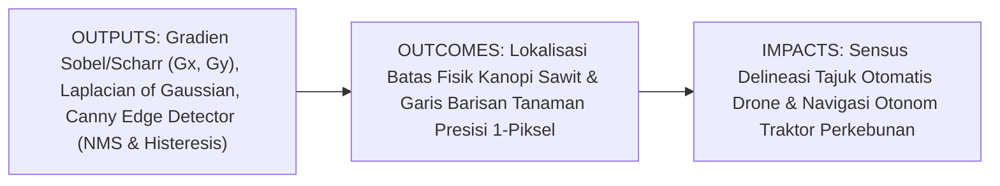
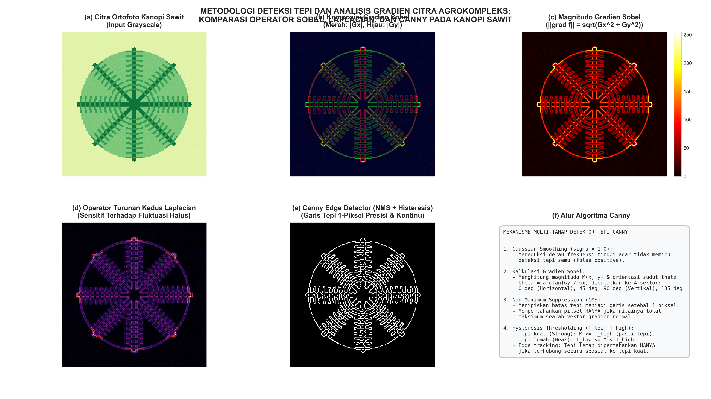

# AI Modul 10.6: Deteksi Tepi dan Gradien Citra

---

## 1. Identitas & Kerangka Capaian Pembelajaran (Sub-CPMK)

* **Kode Modul**: AI Modul 10.6
* **Mata Kuliah**: Kecerdasan Buatan dan Sains Data Pertanian Presisi
* **Alokasi Waktu**: 2 x 50 Menit (Kajian Teori & Diskusi) + 2 x 50 Menit (Eksplorasi Praktikum Mandiri)
* **Beban SKS**: 3 SKS
* **Prasyarat**: AI Modul 10.1, AI Modul 10.2, AI Modul 10.5
* **Level Kognitif**: Bloom C2 (Memahami), C3 (Menerapkan), C4 (Menganalisis)



### 1.1 Capaian Pembelajaran Khusus (Sub-CPMK)
Setelah menyelesaikan modul ini secara komprehensif, mahasiswa diharapkan mampu:
1. **Memahami (C2)** konsep kalkulus diferensial spasial diskrit, representasi vektor gradien 2D, hubungan ortogonalitas antara arah vektor gradien dengan arah fisik garis tepi, prinsip deteksi persilangan nol (*zero-crossings*) pada operator Laplacian/LoG, serta kriteria optimalitas algoritma Canny Edge Detector.
2. **Menerapkan (C3)** operator turunan pertama (Sobel, Prewitt, Scharr) dengan preservasi nilai bertanda (`cv2.CV_64F`) dan algoritma Canny (`cv2.Canny`) untuk mengekstraksi siluet pelepah kelapa sawit dan batas individual brondolan pada tandan buah segar (TBS) di meja konveyor.
3. **Menganalisis (C4)** mekanisme penekanan non-maksimum (*Non-Maximum Suppression / NMS*) melalui kuantisasi sudut ke dalam empat sektor arah ($0^\circ, 45^\circ, 90^\circ, 135^\circ$), menala pasangan ambang batas histeresis ($T_{\text{low}}, T_{\text{high}}$) untuk mencegah fragmentasi kontur pelepah, serta mengukur perimeter kanopi fisik riil terkalibrasi skala spasial GSD.

### 1.2 Kerangka Hasil Pembelajaran (Outputs, Outcomes, & Impacts)
* **Outputs (Keluaran Langsung)**:
  * Penguasaan formulasi analitis turunan parsial spasial, magnitudo Euclidean gradien, dan pelacakan kontur histeresis.
  * Skrip Python modular berstandar industri untuk deteksi tepi kanopi sawit dan estimasi keliling perimeter tajuk.
  * Visualisasi komparatif peta gradien horizontal, vertikal, dan kontur biner 1-piksel.
* **Outcomes (Kompetensi Aplikatif)**:
  * Keahlian dalam memetakan kontur terluar kanopi pohon kelapa sawit (*canopy crown boundary*) dari ortofoto drone beresolusi tinggi.
  * Kemampuan mengidentifikasi arah orientasi barisan tanaman (*crop rows*) untuk kendali kemudi traktor otonom.
* **Impacts (Dampak Strategis Jangka Panjang)**:
  * Otomasi perhitungan *Crown Projection Area* (CPA) perkebunan kelapa sawit skala puluhan ribu hektar untuk estimasi potensi hasil panen.
  * Meningkatkan keselamatan dan akurasi sistem kemudi navigasi robot pertanian di perkebunan komersial.

---

## 2. Profil Fundamental Deteksi Tepi dan Gradien Citra: Fungsi, Manfaat, dan Keunggulan-Kelemahan

### 2.1 Fungsi Komputasi & Pemodelan Matematis
Deteksi tepi dan analisis gradien citra adalah teknik pemrosesan tingkat menengah (*mid-level processing*) yang bertujuan melokalisasi batas-batas diskontinuitas intensitas visual. Fungsi komputasi utamanya meliputi:
1. **Reduksi Data Tanpa Kehilangan Informasi Struktural**: Mentransformasikan citra fotometrik berukuran jutaan bita menjadi peta garis biner ringkas yang hanya memuat siluet penting objek tanaman.
2. **Estimasi Orientasi Spasial**: Menghitung arah kemiringan permukaan daun dan sudut barisan tanaman melalui turunan parsial horizontal ($G_x$) dan vertikal ($G_y$).
3. **Penyediaan Titik Batas untuk Rekonstruksi Poligon**: Menghasilkan kontur kontinu setebal 1 piksel yang siap ditransformasikan menjadi representasi poligon geometris oleh modul analisis morfometri.

### 2.2 Manfaat Nyata di Industri Perkebunan & Agribisnis
* **Delineasi Tajuk Pohon Sawit (*Canopy Crown Delineation*)**: Citra ortofoto drone diproses dengan detektor tepi untuk memisahkan tajuk pelepah sawit dari vegetasi penutup tanah (*Mucuna bracteata*), menghasilkan batas luar pohon untuk sensus tegakan.
* **Segmentasi Brondolan Buah pada Konveyor Sortasi**: Memisahkan batas antar-brondolan kelapa sawit yang berhimpitan pada Tandan Buah Segar (TBS) di stasiun sortasi pabrik kelapa sawit (PKS) guna mengukur fraksi brondolan lepas secara otomatis.
* **Pelacakan Lorong Antar-Barisan (*Crop Row Tracking*)**: Memetakan garis tepi barisan pohon sawit untuk memandu traktor penyemprot herbisida otonom agar berjalan tepat di tengah lorong tanpa menabrak pokok tanaman.

### 2.3 Rationale: Alasan Mengapa Metode Ini Digunakan
1. **Kekebalan Terhadap Variasi Kecerahan Global**: Deteksi tepi berbasis turunan parsial hanya merespons selisih kontras lokal (*relative contrast*), sehingga sangat kebal terhadap perubahan tingkat kecerahan global akibat awan mendung.
2. **Kebutuhan Batas 1-Piksel yang Presisi**: Algoritma segmentasi ambang batas warna sering menghasilkan tepi objek yang tebal dan bergerigi. Operator Canny menghasilkan garis setebal 1 piksel yang sangat presisi (*single-pixel thin edges*).
3. **Efisiensi Komputasi Tinggi untuk Pemetaan Skala Luas**: Operasi gradien konvolusional dapat dihitung secara instan menggunakan akselerasi GPU, memungkinkan pemrosesan ortofoto berukuran gigapiksel dalam hitungan menit.

### 2.4 Analisis Kelebihan dan Kekurangan Metode Deteksi Tepi

| Metode Detektor | Keunggulan Utama (*Strengths*) | Kelemahan & Batasan (*Limitations*) | Kasus Optimal di Perkebunan |
|:---|:---|:---|:---|
| **Operator Sobel (3x3)** | Sederhana, cepat, memiliki efek pelembutan implisit untuk menekan derau bintik. | Garis tepi relatif tebal; sensitivitas sudut agak rendah pada kurva diagonal. | Deteksi garis barisan tanaman horizontal/vertikal. |
| **Operator Scharr (3x3)** | Akurasi simetri rotasional jauh lebih tinggi dibanding Sobel pada kernel kecil 3x3. | Sedikit lebih sensitif terhadap derau frekuensi tinggi dibanding Sobel. | Deteksi kontur melengkung pada siluet buah dan kanopi melingkar. |
| **Laplacian** | Operator skalar non-arah; mendeteksi seluruh tepi secara seragam dalam satu langkah. | Sangat sensitif terhadap derau sensorik; menghasilkan garis tepi ganda (*double edges*). | Analisis tekstur permukaan daun pada citra laboratorium bersih. |
| **Laplacian of Gaussian (LoG)** | Mengintegrasikan filter Gaussian untuk menekan derau sebelum mencari *zero-crossing*. | Memerlukan ukuran kernel besar; garis tepi dapat bergeser pada sudut tajam (*corner rounding*). | Deteksi bercak daun melingkar pada citra pembibitan (*nursery*). |
| **Canny Edge Detector** | Standar baku terbaik; menghasilkan tepi setebal 1 piksel, kontinu, dan minim tepi semu via histeresis. | Memerlukan penalaan dua parameter ambang batas histeresis ($T_{\text{low}}, T_{\text{high}}$). | Delineasi batas tajuk kelapa sawit dari ortofoto drone udara. |

### 2.5 Contoh Kasus Penggunaan Konkret di Sektor Agro-Industri
1. **Pengukuran Diameter Tajuk (*Crown Diameter*) Tanaman Belum Menghasilkan (TBM)**: Citra drone diproses dengan Canny Edge Detector untuk mendapatkan garis tepi pelepah terluar, kemudian diameter tajuk dihitung otomatis untuk memantau laju pertumbuhan vegetatif tahun pertama.
2. **Inspeksi Kepadatan Duri Tandan Buah Segar**: Operator Scharr diterapkan untuk mengekstrak respons gradien tajam duri tandan buah guna membedakan varietas sawit *Dura* dan *Tenera* di meja sortasi.
3. **Navigasi Traktor di Perkebunan Tebu dan Sawit**: Garis gradien Sobel vertikal digunakan oleh algoritma transformasi Hough untuk mendeteksi garis lurus barisan pokok tanaman sebagai acuan kendali kemudi otomatis.

### 2.6 Aspek Kritis & Catatan Penting Metode (*Key Critical Insights*)
* **Bahaya Fatal Tipe Data `cv2.CV_8U` pada Operator Gradien**: Turunan parsial dari terang-ke-gelap bernilai **negatif** (misal $40 - 180 = -140$). Jika pemanggilan fungsi menggunakan `cv2.CV_8U`, OpenCV akan memotong seluruh nilai negatif menjadi nol ($0$), menghilangkan separuh batas objek tanaman. **Wajib** gunakan tipe data floating-point bertanda `cv2.CV_64F`, hitung magnitudo mutlak atau $\sqrt{G_x^2 + G_y^2}$, lalu konversikan kembali ke `uint8`.
* **Arah Ortogonal Garis Tepi**: Ingat bahwa vektor gradien selalu menunjuk ke arah kenaikan intensitas tercepat, sehingga arah fisik garis pelepah daun selalu **tegak lurus ($90^\circ$)** terhadap sudut gradien $\theta$.
* **Rasio Ambang Batas Histeresis Canny**: Selalu gunakan rasio empiris standar industri antara $1:2$ hingga $1:3$ (contoh: $T_{\text{low}} = 40, T_{\text{high}} = 120$). Menetapkan ambang bawah terlalu tinggi memutus kontinuitas urat daun, sedangkan menetapkannya terlalu rendah memunculkan derau rumput mikro.



---

## 3. Landasan Teori Matematis & Statistik Deteksi Tepi dan Gradien Citra

### 3.1 Vektor Gradien Citra 2D & Sudut Ortogonal Garis Tepi
Pada fungsi intensitas kontinu 2D $f(x, y)$, vektor gradien $\nabla f$ didefinisikan sebagai:

$$\nabla f = \begin{bmatrix} G_x \\ G_y \end{bmatrix} = \begin{bmatrix} \frac{\partial f}{\partial x} \\ \frac{\partial f}{\partial y} \end{bmatrix}$$

Pada domain spasial diskret, turunan parsial dihitung menggunakan selisih terpusat (*central differences*):

$$G_x \approx \frac{f(x + 1, y) - f(x - 1, y)}{2}, \quad G_y \approx \frac{f(x, y + 1) - f(x, y - 1)}{2}$$

Besaran turunan ini menghasilkan dua metrik fundamental:
1. **Magnitudo Gradien ($M(x, y)$)**:
   $$M(x, y) = \|\nabla f\| = \sqrt{G_x^2 + G_y^2}$$
2. **Arah Sudut Gradien ($\theta(x, y)$)**:
   $$\theta(x, y) = \arctan\left(\frac{G_y}{G_x}\right)$$
   Arah fisik garis tepi (*edge orientation*) selalu tegak lurus sempurna terhadap arah gradien:
   $$\theta_{\text{edge}} = \theta(x, y) \pm 90^\circ$$

---

### 3.2 Operator Turunan Pertama: Sobel, Prewitt, dan Scharr
Operator turunan pertama memadukan diferensiasi pada satu sumbu dengan pelembutan pada sumbu ortogonal:

#### A. Kernel Sobel 3x3
$$\mathbf{S}_x = \begin{bmatrix} -1 & 0 & +1 \\ -2 & 0 & +2 \\ -1 & 0 & +1 \end{bmatrix}, \quad \mathbf{S}_y = \begin{bmatrix} -1 & -2 & -1 \\ 0 & 0 & 0 \\ +1 & +2 & +1 \end{bmatrix}$$

#### B. Kernel Scharr 3x3 (Optimasi Rotasional)
$$\mathbf{S}_{\text{charr}, x} = \begin{bmatrix} -3 & 0 & +3 \\ -10 & 0 & +10 \\ -3 & 0 & +3 \end{bmatrix}, \quad \mathbf{S}_{\text{charr}, y} = \begin{bmatrix} -3 & -10 & -3 \\ 0 & 0 & 0 \\ +3 & +10 & +3 \end{bmatrix}$$

Koefisien Scharr meminimalkan galat asimetri sudut pada kernel kecil $3 \times 3$, memberikan magnitudo yang konsisten pada kontur melengkung biomassa kelapa sawit.

---

### 3.3 Operator Turunan Kedua: Laplacian & Laplacian of Gaussian (LoG)
Turunan kedua mengukur kelengkungan lokal fungsi intensitas:

$$\nabla^2 f = \frac{\partial^2 f}{\partial x^2} + \frac{\partial^2 f}{\partial y^2}$$

Representasi diskret standar 8-tetangga:

$$\mathbf{L}_8 = \begin{bmatrix} 1 & 1 & 1 \\ 1 & -8 & 1 \\ 1 & 1 & 1 \end{bmatrix}$$

Karena sangat rentan terhadap derau bintik, operator Laplacian dipadukan dengan filter Gaussian, menghasilkan operator **Laplacian of Gaussian (LoG)**:

$$\text{LoG}(x, y) = -\frac{1}{\pi \sigma^4} \left( 1 - \frac{x^2 + y^2}{2\sigma^2} \right) \exp\left( -\frac{x^2 + y^2}{2\sigma^2} \right)$$

Titik tepi terdeteksi pada lokasi di mana nilai LoG melintasi angka nol (*zero-crossings*).

---

### 3.4 Algoritma Multi-Tahap Canny Edge Detector
Algoritma Canny mengeksekusi empat tahap sekuensial yang ketat:
1. **Gaussian Smoothing**: Mereduksi derau frekuensi tinggi menggunakan filter Gaussian dengan standar deviasi $\sigma$.
2. **Kalkulasi Gradien Sobel**: Menghitung matriks magnitudo $M(x, y)$ dan sudut orientasi $\theta(x, y)$.
3. **Non-Maximum Suppression (NMS)**:
   * Sudut kontinu $\theta(x, y)$ dikuantisasi ke 4 sektor arah: $0^\circ$ (horizontal), $45^\circ$ (diagonal kanan), $90^\circ$ (vertikal), dan $135^\circ$ (diagonal kiri).
   * Nilai $M(x, y)$ dibandingkan dengan dua tetangga searah vektor normal gradien. Jika $M(x, y)$ bukan nilai maksimum lokal, nilainya ditekan (*suppressed*) menjadi nol ($0$), menghasilkan garis tepi setebal tepat 1 piksel.
4. **Hysteresis Thresholding & Pelacakan Kontur**:
   * Menetapkan dua ambang batas $T_{\text{low}}$ dan $T_{\text{high}}$.
   * $M(x, y) \ge T_{\text{high}}$: Diklasifikasikan definitif sebagai **Tepi Kuat (*Strong Edge*)**.
   * $M(x, y) < T_{\text{low}}$: Dieliminasi langsung menjadi **Bukan Tepi (*Non-Edge*)**.
   * $T_{\text{low}} \le M(x, y) < T_{\text{high}}$: Diklasifikasikan sebagai **Tepi Lemah (*Weak Edge*)**, dan hanya dipertahankan jika terhubung secara spasial (8-konektivitas) dengan setidaknya satu piksel tepi kuat.

---

## 4. Visualisasi Arsitektur & Pipeline Komputasi Deteksi Tepi

```
+----------------------------------------------------------------------------------------------------+
|                         ARSITEKTUR PIPELINE DETEKSI TEPI AGROKOMPLEKS                              |
+----------------------------------------------------------------------------------------------------+
|                                                                                                    |
|  [ Citra Masukan Kanopi Kelapa Sawit / Brondolan TBS ]                                             |
|            |                                                                                       |
|            v                                                                                       |
|  +-----------------------------+                                                                   |
|  | Tahap 1: Pelembutan Awal    | -> Gaussian Blur (ksize=5x5, sigma=1.2)                           |
|  | (Noise Suppression)         | -> Meredam derau tekstur mikro sebelum diferensiasi               |
|  +-----------------------------+                                                                   |
|            |                                                                                       |
|            v                                                                                       |
|  +-----------------------------+                                                                   |
|  | Tahap 2: Kalkulasi Gradien  | -> Hitung Sobel/Scharr Gx dan Gy menggunakan tipe cv2.CV_64F      |
|  | Vektorial                   | -> Hitung Magnitudo M = sqrt(Gx^2 + Gy^2)                         |
|  |                             | -> Hitung Sudut Orientasi theta = arctan(Gy / Gx)                 |
|  +-----------------------------+                                                                   |
|            |                                                                                       |
|            v                                                                                       |
|  +-----------------------------+                                                                   |
|  | Tahap 3: Penipisan Tepi     | -> Kuantisasi sudut theta ke sektor [0, 45, 90, 135 deg]          |
|  | (Non-Maximum Suppression)   | -> Uji maksimum lokal searah gradien; tekan non-maksimum ke 0     |
|  |                             | -> Hasilkan garis kontur setebal 1 piksel                         |
|  +-----------------------------+                                                                   |
|            |                                                                                       |
|            v                                                                                       |
|  +-----------------------------+                                                                   |
|  | Tahap 4: Ambang Batas       | -> Klasifikasi piksel berdasar T_low dan T_high                   |
|  | Histeresis Ganda            | -> Lacak konektivitas spasial: pertahankan weak edge terhubung    |
|  |                             | -> Buang weak edge terisolasi (derau semu)                        |
|  +-----------------------------+                                                                   |
|            |                                                                                       |
|            v                                                                                       |
|  [ Peta Kontur Biner Presisi Siap Ekstraksi Morfometri & Sensus Pohon ]                            |
|                                                                                                    |
+----------------------------------------------------------------------------------------------------+
```

---

## 5. Studi Kasus Komputasi & Implementasi Python / OpenCV

Berikut adalah implementasi komputasi modular untuk mendeteksi tepi kanopi sawit dan mengestimasi keliling tajuk pohon:

```python
import cv2
import numpy as np

# 1. Pembangkitan Data Sintetis Kanopi Sawit
np.random.seed(42)
h, w = 240, 240
Y, X = np.meshgrid(np.arange(h), np.arange(w), indexing='ij')
cx, cy = 120, 120

canopy = np.ones((h, w), dtype=np.float32) * 55
crown = np.sqrt((X - cx)**2 + (Y - cy)**2) <= 90
canopy[crown] = 125

for angle in np.linspace(0, 2*np.pi, 8, endpoint=False):
    line_dist = np.abs(np.cos(angle)*(X - cx) + np.sin(angle)*(Y - cy))
    radial = np.sqrt((X - cx)**2 + (Y - cy)**2)
    frond = (line_dist <= 3.0) & (radial <= 95)
    canopy[frond] = 220

canopy_uint8 = np.clip(canopy + np.random.normal(0, 2.5, (h, w)), 0, 255).astype(np.uint8)

# 2. Perhitungan Gradien Sobel & Scharr Presisi Tinggi (CV_64F)
sobel_x = cv2.Sobel(canopy_uint8, cv2.CV_64F, 1, 0, ksize=3)
sobel_y = cv2.Sobel(canopy_uint8, cv2.CV_64F, 0, 1, ksize=3)
sobel_mag = np.sqrt(sobel_x**2 + sobel_y**2)

# 3. Detektor Tepi Optimal Canny
blurred = cv2.GaussianBlur(canopy_uint8, (5, 5), sigmaX=1.2)
canny_edges = cv2.Canny(blurred, threshold1=40, threshold2=120)

# 4. Kalkulasi Keliling Tajuk Fisik Terkalibrasi GSD (2.5 cm/piksel)
gsd_m = 0.025
edge_pixel_count = np.sum(canny_edges > 0)
perimeter_meters = edge_pixel_count * gsd_m

print("=== HASIL ANALISIS DETEKSI TEPI KANOPI SAWIT ===")
print(f"Magnitudo Gradien Maksimum : {sobel_mag.max():.2f}")
print(f"Jumlah Piksel Tepi Canny   : {edge_pixel_count} piksel")
print(f"Estimasi Keliling Tajuk    : {perimeter_meters:.2f} meter")
```

---

## 6. Kekeliruan Metodologis dan Praktik Terbaik (*Common Pitfalls & Best Practices*)

### 1. Menggunakan Tipe Data `uint8` Langsung pada Output `cv2.Sobel()`
* **Kekeliruan Fatal**: Memanggil `cv2.Sobel(img, cv2.CV_8U, 1, 0)`. Gradien spasial pada batas transisi terang-ke-gelap bernilai **negatif** (misal $50 - 200 = -150$). Tipe `CV_8U` secara otomatis memotong semua nilai negatif menjadi $0$. Akibatnya, sistem kehilangan separuh informasi tepi (hanya mendeteksi transisi gelap-ke-terang, sedangkan transisi terang-ke-gelap hilang total!).
* **Praktik Terbaik**: Selalu gunakan tipe data floating-point berpresisi tinggi bertanda `cv2.CV_64F` saat menghitung turunan parsial Sobel, hitung magnitudo mutlak atau $\sqrt{G_x^2 + G_y^2}$, lalu konversikan kembali ke `uint8` menggunakan `np.clip()`.

### 2. Mengabaikan Tahap Pelembutan Gaussian Sebelum Deteksi Tepi
* **Kekeliruan Fatal**: Menerapkan operator Sobel atau Laplacian langsung pada citra mentah berkabut yang memiliki derau sensor. Karena operator turunan bertindak sebagai filter pelewat-tinggi (*high-pass filter*), derau bintik sensor akan diamplifikasi secara masif, menghasilkan ribuan tepi semu (*false positive edges*) yang mengacaukan pemetaan kanopi.
* **Praktik Terbaik**: Wajib menerapkan pelembutan Gaussian awal ($\sigma \in [1.0, 1.5]$) sebelum kalkulasi gradien atau gunakan fungsi terintegrasi seperti `cv2.Canny()` yang telah menyertakan mekanisme pelembutan.

### 3. Rasio Ambang Batas Histeresis Canny yang Tidak Proporsional
* **Kekeliruan Fatal**: Menetapkan rasio ambang batas $T_{\text{low}}$ dan $T_{\text{high}}$ terlalu dekat (misal $T_{\text{low}} = 100, T_{\text{high}} = 110$) atau terbalik ($T_{\text{low}} > T_{\text{high}}$). Hal ini menyebabkan kontur pelepah terputus-putus (*fragmented contours*) dan kehilangan sifat kontinuitas tepi.
* **Praktik Terbaik**: Terapkan rasio empiris standar industri $1:2$ hingga $1:3$ (contoh: $T_{\text{low}} = 40, T_{\text{high}} = 120$). Ambang atas bertugas menangkap tepi pelepah primer yang tegas, sedangkan ambang bawah melacak kontinuitas urat daun yang lebih halus.

---

## 7. Rangkuman Modul

1. **Vektor Gradien Spasial 2D** ($\nabla f$) merepresentasikan laju dan arah perubahan intensitas tercepat, di mana arah garis tepi fisik selalu tegak lurus sempurna terhadap vektor gradien.
2. **Operator Sobel dan Scharr** menghitung turunan parsial pertama secara tangguh dengan mengintegrasikan filter pelembut implisit, di mana operator Scharr memberikan akurasi rotasional superior untuk kontur melengkung biomassa tanaman.
3. **Operator Laplacian** mendeteksi tepi melalui persilangan nol turunan kedua (*zero-crossings*), sangat sensitif terhadap detail halus namun rentan terhadap derau sehingga wajib dipadukan dengan pelembutan Gaussian (LoG).
4. **Canny Edge Detector** memenuhi kriteria detektor optimal melalui empat tahapan komprehensif: pelembutan Gaussian, kalkulasi gradien, penekanan non-maksimum (NMS) untuk menghasilkan kontur setebal 1 piksel, serta ambang batas ganda histeresis untuk menjamin kontinuitas tepi tanpa memicu tepi semu.

---

## 8. Latihan Soal & Tugas Analitis HOTS

### Soal Penalaran Konseptual & Analitis HOTS

1. **Kalkulasi Vektor Gradien Sobel dan Orientasi Tepi Pelepah Sawit (C3)**:  
   Sebuah petak citra berukuran $3 \times 3$ piksel merekam batas tepi pelepah sawit:
   $$\mathbf{I} = \begin{bmatrix} 40 & 50 & 180 \\ 45 & 55 & 185 \\ 40 & 50 & 180 \end{bmatrix}$$
   * Hitung nilai gradien horizontal $G_x$ menggunakan kernel Sobel $\mathbf{S}_x$.
   * Hitung nilai gradien vertikal $G_y$ menggunakan kernel Sobel $\mathbf{S}_y$.
   * Hitung magnitudo gradien eksak $M = \sqrt{G_x^2 + G_y^2}$ dan aproksimasi $M_{\text{approx}} = |G_x| + |G_y|$.
   * Hitung sudut orientasi vektor gradien $\theta$ dalam derajat. Berapakah sudut arah fisik garis tepi pelepah sawit tersebut?

2. **Analisis Algoritma Non-Maximum Suppression (NMS) pada Detektor Canny (C3)**:  
   Pada tahap NMS, sebuah piksel pusat $p$ pada koordinat $(x=50, y=50)$ memiliki magnitudo gradien $M(p) = 85$ dan sudut gradien kontinu $\theta = 72^\circ$. Matriks magnitudo gradien pada lingkungan tetangga $3 \times 3$ di sekitarnya adalah:
   $$\mathbf{M} = \begin{bmatrix} 40 & 92 & 70 \\ 50 & 85 & 80 \\ 30 & 75 & 60 \end{bmatrix}$$
   di mana elemen baris ke-2 kolom ke-2 adalah piksel pusat $M(50, 50) = 85$.
   * Ke dalam sektor sudut manakah sudut $\theta = 72^\circ$ dikuantisasi?
   * Tentukan dua piksel tetangga yang menjadi pembanding bagi piksel pusat $p$ berdasarkan sektor tersebut.
   * Berdasarkan kriteria NMS, apakah piksel pusat $p$ dipertahankan sebagai kandidat tepi atau ditekan menjadi $0$? Berikan justifikasi komputasionalnya.

3. **Diagnostik Ambang Batas Histeresis pada Pelacakan Siluet Buah Sawit (C4)**:  
   Sebuah sistem visi sortasi TBS menerapkan detektor Canny dengan ambang batas $T_{\text{low}} = 40$ dan $T_{\text{high}} = 100$. Sebuah segmen garis batas brondolan sawit memiliki rantai 5 piksel bersebelahan secara diagonal ($8\text{-konektivitas}$) dengan nilai magnitudo gradien hasil NMS:
   $$P_1 = 115, \quad P_2 = 70, \quad P_3 = 55, \quad P_4 = 35, \quad P_5 = 80$$
   * Klasifikasikan masing-masing dari kelima piksel tersebut ke dalam kategori: *Strong Edge*, *Weak Edge*, atau *Non-Edge*.
   * Lakukan penelusuran tepi (*edge tracking by hysteresis*): jelaskan secara runtut piksel mana saja yang akan dipertahankan pada citra tepi biner akhir dan piksel mana saja yang dieliminasi.
   * Apa dampak yang terjadi pada siluet buah sawit jika operator menaikkan $T_{\text{low}}$ menjadi $60$? Jelaskan implikasinya terhadap keutuhan kontur buah.

---

### Rubrik Penilaian Holistik (*Higher-Order Thinking Skills*)

| Kriteria / Dimensi | Bobot (%) | Sangat Memuaskan (85 - 100) | Memuaskan (70 - 84) | Kurang Memuaskan (< 70) |
|:---|:---:|:---|:---|:---|
| **Pemahaman Teoretis Kalkulus Gradien & Tepi (C2)** | 25% | Mampu menguraikan keterkaitan vektor gradien, sudut ortogonal garis tepi, operator orde 1 & 2, serta arsitektur 4-tahap Canny secara presisi dan matematis. | Menjelaskan konsep gradien dan Canny dengan benar namun kurang mendalam pada derivasi kuantisasi sudut NMS. | Salah memahami arah ortogonal gradien atau mengabaikan perlunya tipe data bertanda (`float64`). |
| **Kalkulasi Numerik & Analisis Kasus HOTS (C3-C4)** | 35% | Menyelesaikan kalkulasi konvolusi Sobel, sektor kuantisasi NMS, dan pelacakan histeresis secara presisi dengan langkah sistematis dan argumentasi logis. | Perhitungan numerik benar namun terdapat kesalahan minor pada pembulatan sudut atau evaluasi konektivitas tetangga. | Salah menerapkan formula magnitudo gradien atau gagal mengevaluasi histeresis rantai piksel. |
| **Implementasi Kode OpenCV & Keandalan Deteksi (C3)** | 30% | Membangun alur deteksi tepi modular (Sobel CV_64F, LoG, Canny) dengan visualisasi komparatif yang informatif dan bebas dari *runtime error*. | Program berjalan baik namun penalaan parameter histeresis belum optimal untuk citra kanopi. | Program menghasilkan pemotongan nilai negatif akibat tipe data `CV_8U` atau salah memanggil fungsi pustaka. |
| **Sikap Ilmiah & Ketelitian Rekayasa** | 10% | Menunjukkan ketelitian tinggi dalam analisis keterbatasan detektor pada data lapangan perkebunan dan kepatuhan penuh terhadap standar format modul. | Analisis cukup baik namun kurang mengeksplorasi implikasi rekayasa pada sistem sortasi cerdas. | Laporan tidak lengkap, tidak rapi, atau tidak menyertakan pembahasan kritis. |

---

## 9. Jembatan Konsep (Bridging) ke AI Modul 10.7: Ekstraksi Fitur dan Morfologi Citra

Dengan menyelesaikan modul ini, kita telah berhasil mengekstraksi representasi batas fisik tanaman berupa peta tepi biner (*binary edge maps*) dan kontur pelepah yang tipis dan kontinu.

Namun, peta tepi hasil detektor Canny sering kali masih memiliki tantangan struktural: garis tepi yang sedikit berlubang akibat oklusi daun, adanya tonjolan derau kecil di luar kanopi, serta kebutuhan untuk menghitung metrik geometri agronomi secara kuantitatif: **Berapa luas area kanopi tanaman? Berapa keliling perimeter pelepah? Berapakah rasio kebulatan (*circularity*) dan derajat elongasi tandan buah sawit?**

Pada **AI Modul 10.7: Ekstraksi Fitur dan Morfologi Citra (*Morphological Operations and Feature Extraction*)**, kita akan menuntaskan seluruh rangkaian Part 11:
* **Operasi Morfologi Biner Matematis**: Erosi (*Erosion*), Dilasi (*Dilation*), Pembukaan (*Opening* untuk membuang derau luar), dan Penutupan (*Closing* untuk menyambung lubang kontur).
* **Deteksi Kontur dan Hirarki Objek**: Algoritma pelacakan batas terhubung (*contour finding*) dan analisis relasi topologi anak-induk.
* **Deskriptor Morfometri Kanopi**: Kalkulasi luas piksel (*Area*), perimeter keliling (*Perimeter*), kotak pembatas berorientasi (*Bounding Box & Rotated Rect*), dan penentuan pusat massa (*Centroid*) untuk aplikasi sensus pohon dan sortasi otomatis kelapa sawit.

---

## 10. Daftar Pustaka dan Referensi Akademik

1. Gonzalez, R. C., & Woods, R. E. (2018). *Digital Image Processing* (4th ed.). Pearson.
2. Szeliski, R. (2022). *Computer Vision: Algorithms and Applications* (2nd ed.). Springer.
3. Canny, J. (1986). A computational approach to edge detection. *IEEE Transactions on Pattern Analysis and Machine Intelligence*, PAMI-8(6), 679-698.
4. Bradski, G., & Kaehler, A. (2008). *Learning OpenCV: Computer Vision with the OpenCV Library*. O'Reilly Media.
5. Marr, D., & Hildreth, E. (1980). Theory of edge detection. *Proceedings of the Royal Society of London. Series B. Biological Sciences*, 207(1167), 187-217.
6. Scharr, H. (2000). *Optimale Operatoren in der Digitalen Bildverarbeitung* (Doctoral dissertation, University of Heidelberg).
7. Alfatni, M. S. M., Shariff, A. R. M., Abdullah, M. Z., Marhaban, M. H. B., & Saaed, O. M. B. (2022). Oil palm fresh fruit bunch ripeness grading methods: A systematic review. *Computers and Electronics in Agriculture*, 198, 107040.
8. Wu, Z., Chen, Y., Zhao, B., Kang, X., & Ding, Y. (2020). Measurement of canopy size and foliage density of oil palm using UAV LiDAR and optical imagery. *Computers and Electronics in Agriculture*, 175, 105577.
