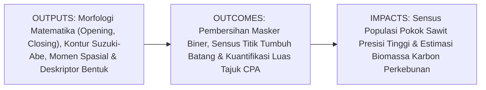
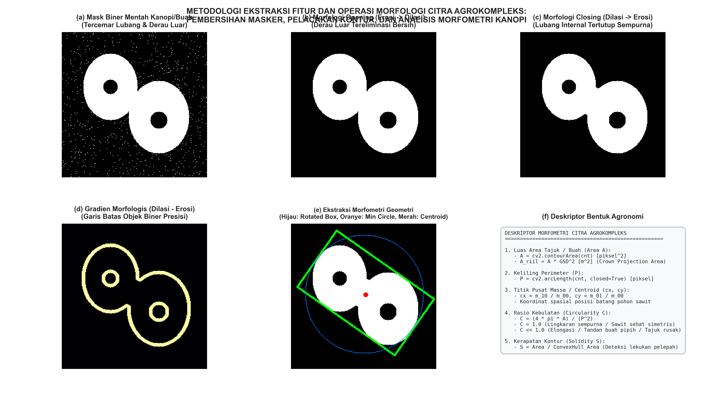

# AI Modul 10.7: Ekstraksi Fitur dan Morfologi Citra

---

## 1. Identitas & Kerangka Capaian Pembelajaran (Sub-CPMK)

* **Kode Modul**: AI Modul 10.7
* **Mata Kuliah**: Kecerdasan Buatan dan Sains Data Pertanian Presisi
* **Alokasi Waktu**: 2 x 50 Menit (Kajian Teori & Diskusi) + 2 x 50 Menit (Eksplorasi Praktikum Mandiri)
* **Beban SKS**: 3 SKS
* **Prasyarat**: AI Modul 10.1, AI Modul 10.2, AI Modul 10.3, AI Modul 10.6
* **Level Kognitif**: Bloom C2 (Memahami), C3 (Menerapkan), C4 (Menganalisis)



### 1.1 Capaian Pembelajaran Khusus (Sub-CPMK)
Setelah menyelesaikan modul ini secara komprehensif, mahasiswa diharapkan mampu:
1. **Memahami (C2)** prinsip matematika teori himpunan morfologi (erosi, dilasi, pembukaan, penutupan, gradien morfologis), sifat idempoten operasi gabungan, penelusuran batas topologis algoritma Suzuki-Abe, serta teori momen spasial dan momen terpusat invarian.
2. **Menerapkan (C3)** fungsi morfologi OpenCV (`cv2.morphologyEx`) dengan elemen penstruktur eliptikal (`cv2.MORPH_ELLIPSE`), fungsi pelacakan kontur (`cv2.findContours`), serta kalkulasi deskriptor bentuk geometris (luas area tajuk, keliling perimeter, kotak pembatas berorientasi, dan lingkaran minimum) pada citra ortofoto perkebunan kelapa sawit.
3. **Menganalisis (C4)** perubahan topologi masker biner akibat variasi ukuran dan bentuk elemen penstruktur, mengevaluasi pengaruh kalibrasi skala spasial GSD terhadap akurasi estimasi luas tutupan tajuk (*Crown Projection Area / CPA*), serta membuktikan kepekaan rasio kebulatan (*Circularity*) dalam mendeteksi asimetri tajuk pohon sawit akibat serangan hama pemakan pelepah.

### 1.2 Kerangka Hasil Pembelajaran (Outputs, Outcomes, & Impacts)
* **Outputs (Keluaran Langsung)**:
  * Penguasaan formulasi analitis erosi, dilasi, momen orde nol/pertama, dan rasio bentuk morfometri.
  * Skrip Python modular berstandar industri untuk pembersihan masker biner kanopi dan sensus tegakan pohon sawit otomatis.
  * Laporan rekapitulasi data inventarisasi pohon mencakup koordinat centroid $(c_x, c_y)$, luas CPA ($\text{m}^2$), dan diagnosis simetri tajuk.
* **Outcomes (Kompetensi Aplikatif)**:
  * Keahlian dalam memurnikan masker segmentasi kasar yang tercemar oleh lubang bayangan dan bintik gulma.
  * Kemampuan mengotomasi sensus pokok pohon sawit dari citra drone tanpa perlu pencacahan manual di lapangan.
* **Impacts (Dampak Strategis Jangka Panjang)**:
  * Menghemat biaya operasional survei sensus tegakan perkebunan kelapa sawit hingga $80\%$ sekaligus meningkatkan akurasi sensus hingga $\ge 98\%$.
  * Memfasilitasi pemodelan serapan hara tanaman secara individual berbasis luasan proyeksi kanopi (*precision fertilization*).

---

## 2. Profil Fundamental Ekstraksi Fitur dan Morfologi Citra: Fungsi, Manfaat, dan Keunggulan-Kelemahan

### 2.1 Fungsi Komputasi & Pemodelan Matematis
Morfologi matematika dan ekstraksi fitur geometris adalah tahapan penjembatan dari representasi citra biner bergradasi rendah (*low-level binary masks*) menuju parameter agronomi kuantitatif berbobot keputusan (*high-level agronomic descriptors*). Fungsi komputasi utamanya meliputi:
1. **Penyempurnaan Topologi Spasial**: Menghilangkan derau bintik terisolasi di luar objek (*Opening*), menutup rongga atau lubang internal (*Closing*), serta memisahkan dua objek yang saling bersinggungan tipis.
2. **Ekstraksi Garis Batas dan Hirarki Objek**: Mengubah kumpulan piksel biner menjadi rangkaian vektor koordinat poligon (*contours*) dan menyusun relasi topologis induk-anak (*parent-child hierarchy*).
3. **Kuantifikasi Morfometri Bentuk**: Menghitung luas area fisik, perimeter keliling, titik pusat massa (*centroid*), rasio kebulatan (*circularity*), dan rasio kerapatan (*solidity*) untuk karakterisasi kuantitatif biomassa.

### 2.2 Manfaat Nyata di Industri Perkebunan & Agribisnis
* **Sensus Otomatis Populasi Pokok Sawit**: Algoritma kontur mengekstrak centroid setiap kanopi pohon kelapa sawit pada ortofoto drone, menghasilkan titik koordinat spasial (titik GPS) setiap pokok sawit untuk sensus tegakan tanaman menghasilkan (TM).
* **Estimasi Luas Proyeksi Tajuk (*Crown Projection Area / CPA*)**: Menghitung luas tutupan tajuk hijau tiap pohon dalam satuan $\text{m}^2$ untuk menduga status nutrisi nitrogen dan potensi biomassa tegakan.
* **Sortasi Mutu Brondolan Buah di Pabrik**: Mengukur rasio kebulatan (*circularity*) dan volume elips brondolan kelapa sawit pada konveyor untuk mendeteksi buah partenokarpi (buah tanpa inti biji/kempes).

### 2.3 Rationale: Alasan Mengapa Metode Ini Digunakan
1. **Ketidaksempurnaan Masker Segmentasi Lapangan**: Masker biner hasil segmentasi warna atau deteksi tepi hampir selalu memiliki lubang akibat bayangan pelepah atau bintik semak di luar kanopi. Morfologi matematika memulihkan keutuhan bentuk biologis objek secara elegan.
2. **Kebutuhan Besaran Fisik Terukur**: Model kecerdasan buatan membutuhkan parameter input numerik yang bermakna. Deskriptor morfometri mengubah citra piksel menjadi angka-angka metrik agronomi yang dapat diintegrasikan dengan sistem GIS perkebunan.
3. **Kecepatan Eksekusi Ekstrem**: Operasi morfologi biner dan penelusuran kontur Suzuki-Abe berjalan dengan kompleksitas komputasi linear $\mathcal{O}(N)$, memungkinkan sensus ribuan pohon diselesaikan dalam hitungan detik.

### 2.4 Analisis Kelebihan dan Kekurangan Metode Morfologi & Fitur

| Metode / Operasi | Keunggulan Utama (*Strengths*) | Kelemahan & Batasan (*Limitations*) | Kasus Optimal di Perkebunan |
|:---|:---|:---|:---|
| **Erosi ($A \ominus B$)** | Mengikis tonjolan luar; memutus jembatan sempit antar-kanopi pohon yang berdekatan. | Mengurangi luas area total objek; menghilangkan objek-objek kecil yang sah. | Pemisahan tajuk pohon sawit yang saling bersinggungan. |
| **Dilasi ($A \oplus B$)** | Menutup celah kecil; mempertebal batas luar objek biomassa. | Memperbesar ukuran objek; berpotensi menggabungkan dua tajuk bertetangga menjadi satu. | Penyambungan rantai kontur pelepah yang terputus. |
| **Opening ($A \circ B$)** | Melenyapkan derau pulau luar tanpa mengubah ukuran makro objek utama (idempoten). | Tidak dapat menutup lubang di dalam tubuh objek kanopi. | Eliminasi derau bintik gulma tanah pada masker vegetasi. |
| **Closing ($A \bullet B$)** | Menutup lubang bayangan internal kanopi tanpa memperbesar dimensi luar tajuk (idempoten). | Tidak dapat membuang derau bintik di luar batas kanopi. | Penambalan lubang bayangan pada tajuk kanopi pohon. |
| **Contour Finding (Suzuki-Abe)** | Mengekstrak poligon batas terhubung dan koordinat titik sudut secara efisien. | Sensitif terhadap diskontinuitas; garis batas yang tidak tertutup menghasilkan poligon terbuka. | Ekstraksi kontur tajuk untuk kalkulasi luas area CPA. |
| **Spatial Moments ($m_{pq}$)** | Menghasilkan luas area dan titik pusat massa (*centroid*) secara instan dan eksak. | Memerlukan masker biner bebas lubang untuk mencegah pergeseran centroid. | Penentuan koordinat batang pohon untuk sensus tegakan. |

### 2.5 Contoh Kasus Penggunaan Konkret di Sektor Agro-Industri
1. **Deteksi Pohon Mati atau Tumbang (*Missing / Dead Tree Detection*)**: Hasil sensus centroid kontur kanopi dicocokkan dengan kisi-kisi pola tanam segitiga sama sisi ($9\text{ m} \times 9\text{ m}$). Titik kisi yang tidak memiliki centroid kanopi ditandai sebagai pohon mati atau titik sisip yang perlu disulam.
2. **Kalkulasi Indeks Tumpang Tindih Tajuk (*Canopy Overlap Index*)**: Kotak pembatas berorientasi (*Rotated Rect*) digunakan untuk menghitung persentase tumpang tindih antar-tajuk pohon dewasa guna menentukan jadwal penjarangan atau pemangkasan pelepah (*pruning*).
3. **Pemisahan Tandan Buah Segar dari Sampah Tangkai (*Rachis*)**: Operasi pembukaan dengan kernel elips memutus tangkai buah yang kurus dari badan utama tandan buah sawit di stasiun *thresher* pabrik kelapa sawit.

### 2.6 Aspek Kritis & Catatan Penting Metode (*Key Critical Insights*)
* **Bentuk Elemen Penstruktur Harus Selaras dengan Biologi Objek**: Penggunaan elemen penstruktur kotak (`MORPH_RECT`) menghasilkan distorsi sudut siku-siku $90^\circ$ yang tidak alami pada kanopi pohon. **Wajib** gunakan elemen penstruktur berbentuk elips (`cv2.MORPH_ELLIPSE`) untuk mempertahankan lengkungan alami biomassa tanaman.
* **Hierarki Kontur (`RETR_EXTERNAL` vs `RETR_TREE`)**: Jika tujuan utama adalah menghitung jejak tapak luar kanopi pohon sawit, **wajib** gunakan mode `cv2.RETR_EXTERNAL`. Menggunakan `cv2.RETR_TREE` akan mendeteksi batas lubang bayangan internal sebagai kontur terpisah yang melipatgandakan hitungan area secara keliru.
* **Kalibrasi Wajib dengan Skala Spasial GSD**: Besaran piksel tidak memiliki arti agronomis tanpa kalibrasi spasial. Luas fisik wajib dihitung dengan: $\text{Luas (m}^2\text{)} = \text{Area (px)} \times (\text{GSD}_{\text{meter}})^2$.



---

## 3. Landasan Teori Matematis & Statistik Ekstraksi Fitur dan Morfologi Citra

### 3.1 Teori Himpunan Morfologi Matematika
Dalam ruang diskret $\mathbb{Z}^2$, citra biner direpresentasikan sebagai himpunan koordinat latar depan $A \subset \mathbb{Z}^2$, dan elemen penstruktur sebagai himpunan $B \subset \mathbb{Z}^2$.

#### A. Erosi ($A \ominus B$)
Menguji apakah translasi elemen penstruktur $(B)_z$ termuat sepenuhnya di dalam himpunan $A$:

$$A \ominus B = \{ z \in \mathbb{Z}^2 \mid (B)_z \subseteq A \}$$

di mana $(B)_z = \{ b + z \mid b \in B \}$.

#### B. Dilasi ($A \oplus B$)
Menguji apakah pantulan elemen penstruktur $(\hat{B})_z$ beririsan dengan himpunan $A$:

$$A \oplus B = \{ z \in \mathbb{Z}^2 \mid (\hat{B})_z \cap A \neq \emptyset \}$$

di mana $\hat{B} = \{ -b \mid b \in B \}$.

---

### 3.2 Operasi Gabungan: Opening, Closing, dan Gradien Morfologis
1. **Pembukaan (*Opening*, $A \circ B$)**:
   $$A \circ B = (A \ominus B) \oplus B$$
   Bersifat idempoten: $(A \circ B) \circ B = A \circ B$. Menghilangkan tonjolan tipis dan melenyapkan pulau-pulau kecil di luar kanopi tanpa mengubah dimensi makro objek.
2. **Penutupan (*Closing*, $A \bullet B$)**:
   $$A \bullet B = (A \oplus B) \ominus B$$
   Bersifat idempoten: $(A \bullet B) \bullet B = A \bullet B$. Menutup lubang-lubang kecil internal dan menyambung celah kontur yang retak.
3. **Gradien Morfologis ($G_{\text{morph}}$)**:
   $$G_{\text{morph}}(A) = (A \oplus B) - (A \ominus B)$$
   Mengekstrak siluet batas terluar objek biner setebal dimensi elemen penstruktur.

---

### 3.3 Pelacakan Kontur Suzuki-Abe & Momen Spasial Citra
Kontur dilacak menggunakan algoritma penelusuran batas topologis Suzuki-Abe (1985).

#### Momen Spasial Orde $(p + q)$
$$m_{pq} = \sum_{x} \sum_{y} x^p y^q f(x, y)$$

* **Luas Area Piksel ($A$)**:
  $$A = m_{00} = \sum_{x} \sum_{y} f(x, y)$$
* **Titik Pusat Massa / Centroid ($c_x, c_y$)**:
  $$c_x = \frac{m_{10}}{m_{00}}, \quad c_y = \frac{m_{01}}{m_{00}}$$

#### Momen Terpusat (*Central Moments*, $\mu_{pq}$)
$$\mu_{pq} = \sum_{x} \sum_{y} (x - c_x)^p (y - c_y)^q f(x, y)$$

Momen terpusat orde kedua ($\mu_{20}, \mu_{02}, \mu_{11}$) menentukan sumbu utama dan derajat kepejalan (*elongation*) objek biomassa tanaman.

---

### 3.4 Deskriptor Morfometri Bentuk Agronomi
1. **Rasio Kebulatan (*Circularity / Form Factor*, $C$)**:
   $$C = \frac{4\pi A}{P^2}$$
   Untuk lingkaran sempurna: $C = 1.0$. Pada tajuk pohon kelapa sawit sehat yang simetris: $C \in [0.80, 0.95]$. Tajuk rusak atau terserang hama memiliki $C < 0.60$.
2. **Kerapatan Kontur (*Solidity*, $S$)**:
   $$S = \frac{A}{A_{\text{hull}}}$$
   di mana $A_{\text{hull}}$ adalah luas selubung cembung (*Convex Hull*). Mengukur kedalaman celah antar-pelepah sawit.
3. **Rasio Aspek (*Aspect Ratio*, $AR$) & Extent ($E$)**:
   $$AR = \frac{W_{\text{bbox}}}{H_{\text{bbox}}}, \quad E = \frac{A}{W_{\text{bbox}} \times H_{\text{bbox}}}$$

---

## 4. Visualisasi Arsitektur & Pipeline Komputasi Ekstraksi Fitur dan Morfologi

```
+----------------------------------------------------------------------------------------------------+
|                         ARSITEKTUR PIPELINE MORFOMETRI CITRA AGROKOMPLEKS                          |
+----------------------------------------------------------------------------------------------------+
|                                                                                                    |
|  [ Masker Biner Kasar Kanopi Pohon Sawit (Hasil Segmentasi Warna/Tepi) ]                           |
|            |                                                                                       |
|            v                                                                                       |
|  +-----------------------------+                                                                   |
|  | Tahap 1: Pembersihan Luar   | -> Operasi Opening dengan kernel elips (MORPH_ELLIPSE, 9x9)       |
|  | (Opening)                   | -> Lenyapkan derau gulma dan semak terisolasi di luar tajuk       |
|  +-----------------------------+                                                                   |
|            |                                                                                       |
|            v                                                                                       |
|  +-----------------------------+                                                                   |
|  | Tahap 2: Penambalan Dalam   | -> Operasi Closing dengan kernel elips (MORPH_ELLIPSE, 9x9)       |
|  | (Closing)                   | -> Tutup lubang bayangan pelepah internal kanopi                  |
|  +-----------------------------+                                                                   |
|            |                                                                                       |
|            v                                                                                       |
|  +-----------------------------+                                                                   |
|  | Tahap 3: Pelacakan Kontur   | -> Algoritma Suzuki-Abe (cv2.findContours RETR_EXTERNAL)          |
|  | Poligon Luar                | -> Filter kontur artefak berdasar batas minimum luas area         |
|  +-----------------------------+                                                                   |
|            |                                                                                       |
|            v                                                                                       |
|  +-----------------------------+                                                                   |
|  | Tahap 4: Ekstraksi Momen &  | -> Hitung Momen Spasial m00, m10, m01                             |
|  | Morfometri Kuantitatif      | -> Ekstrak Centroid (cx, cy) sebagai koordinat sensus pokok pohon |
|  |                             | -> Hitung Luas CPA riil (m^2) & Keliling Perimeter riil (m)      |
|  |                             | -> Hitung Rasio Kebulatan C = 4*pi*A / P^2 (Diagnostik Simetri)   |
|  |                             | -> Fitting Rotated Bounding Box (Orientasi Sudut Tajuk)           |
|  +-----------------------------+                                                                   |
|            |                                                                                       |
|            v                                                                                       |
|  [ Peta GIS Inventarisasi Sensus Tegakan & Diagnosis Kesehatan Tajuk Pohon Sawit ]                 |
|                                                                                                    |
+----------------------------------------------------------------------------------------------------+
```

---

## 5. Studi Kasus Komputasi & Implementasi Python / OpenCV

Berikut adalah implementasi komputasi modular untuk pembersihan morfologi, ekstraksi kontur, dan sensus tegakan pohon sawit:

```python
import cv2
import numpy as np

# 1. Pembangkitan Data Sintetis Masker Kanopi Sawit dengan Cacat Spasial
np.random.seed(42)
h, w = 300, 300
Y, X = np.meshgrid(np.arange(h), np.arange(w), indexing='ij')

# Pohon 1 (Kiri) & Pohon 2 (Kanan)
tree1 = ((X - 95)**2 / 55**2 + (Y - 115)**2 / 65**2) <= 1.0
tree2 = ((X - 205)**2 / 60**2 + (Y - 185)**2 / 70**2) <= 1.0
raw_mask = (tree1 | tree2).astype(np.uint8) * 255

# Tambahkan lubang internal dan derau luar
raw_mask[((X - 95)**2 + (Y - 115)**2) <= 14**2] = 0
raw_mask[((X - 205)**2 + (Y - 185)**2) <= 16**2] = 0
raw_mask[(np.random.rand(h, w) > 0.988) & (~(tree1 | tree2))] = 255

# 2. Pembersihan Morfologi (Opening dilanjutkan Closing)
se_ellipse = cv2.getStructuringElement(cv2.MORPH_ELLIPSE, (9, 9))
opened = cv2.morphologyEx(raw_mask, cv2.MORPH_OPEN, se_ellipse)
cleaned = cv2.morphologyEx(opened, cv2.MORPH_CLOSE, se_ellipse)

# 3. Pelacakan Kontur dan Ekstraksi Parameter Morfometri Terkalibrasi
contours, _ = cv2.findContours(cleaned, cv2.RETR_EXTERNAL, cv2.CHAIN_APPROX_SIMPLE)

gsd_m = 0.035 # Resolusi spasial 3.5 cm/piksel
print(f"=== LAPORAN SENSUS DAN MORFOMETRI KANOPI ({len(contours)} POHON) ===")

for idx, cnt in enumerate(contours):
    area_px = cv2.contourArea(cnt)
    perimeter_px = cv2.arcLength(cnt, closed=True)
    
    M = cv2.moments(cnt)
    cx = int(M['m10'] / M['m00']) if M['m00'] > 0 else 0
    cy = int(M['m01'] / M['m00']) if M['m00'] > 0 else 0
    
    circularity = (4.0 * np.pi * area_px) / (perimeter_px**2) if perimeter_px > 0 else 0
    cpa_m2 = area_px * (gsd_m**2)
    perimeter_m = perimeter_px * gsd_m
    
    print(f"Pohon ID #{idx + 1}:")
    print(f"  - Koordinat Batang (Centroid) : ({cx}, {cy})")
    print(f"  - Crown Projection Area (CPA) : {cpa_m2:.2f} m^2")
    print(f"  - Keliling Perimeter Tajuk    : {perimeter_m:.2f} meter")
    print(f"  - Rasio Kebulatan             : {circularity:.3f}")
    print(f"  - Status Pertumbuhan          : {'Simetris Sehat' if circularity >= 0.80 else 'Asimetris Rusak'}")
```

---

## 6. Kekeliruan Metodologis dan Praktik Terbaik (*Common Pitfalls & Best Practices*)

### 1. Menggunakan Elemen Penstruktur Berbentuk Persegi Panjang pada Objek Biologis
* **Kekeliruan Fatal**: Memanggil `cv2.getStructuringElement(cv2.MORPH_RECT, (K, K))` untuk memproses kanopi pohon atau buah sawit. Elemen penstruktur kotak memiliki sudut tajam $90^\circ$ yang mengikis kelengkungan alami biomassa, menghasilkan kontur buatan yang tampak kaku dan bersegi-segi (*blocky distortion*).
* **Praktik Terbaik**: Gunakan selalu elemen penstruktur berbentuk elips (`cv2.MORPH_ELLIPSE`) saat memproses organ tanaman, kanopi pohon, atau buah-buahan untuk menjaga kelengkungan dan kesimetrisan bentuk alami.

### 2. Menggunakan Kontur Internal (`cv2.RETR_TREE`) saat Menghitung Luas Kanopi
* **Kekeliruan Fatal**: Memanggil mode penelusuran `cv2.RETR_TREE` tanpa menyaring hirarki kontur. Jika tajuk pohon memiliki lubang di dalamnya, fungsi akan mendeteksi kontur luar dan kontur dalam secara terpisah. Penjumlahan langsung seluruh area kontur akan melipatgandakan hitungan luas tajuk secara keliru.
* **Praktik Terbaik**: Gunakan mode `cv2.RETR_EXTERNAL` jika hanya membutuhkan batas luar kanopi (*footprint*), atau lakukan iterasi hirarki dengan menyaring hanya kontur yang tidak memiliki induk (*parent == -1*).

### 3. Mengabaikan Skala Spasial Sensor (GSD) dalam Pelaporan Morfometri
* **Kekeliruan Fatal**: Melaporkan parameter morfometri hanya dalam satuan piksel (misal $\text{Area} = 15.000\text{ piksel}$). Tanpa integrasi nilai GSD (*Ground Sampling Distance*), parameter ini tidak memiliki nilai guna agronomis karena nilainya berubah drastis setiap kali elevasi terbang drone berubah.
* **Praktik Terbaik**: Kalibrasikan selalu ukuran piksel ke dimensi fisik riil: $\text{Luas (m}^2\text{)} = \text{Area (px)} \times \text{GSD}^2$, sehingga data kompatibel dengan sistem informasi geografis (GIS) perkebunan.

---

## 7. Rangkuman Modul

1. **Morfologi Matematika Biner** adalah teknik analisis bentuk berbasis teori himpunan yang memodifikasi topologi objek citra menggunakan elemen penstruktur (*structuring element*).
2. **Erosi dan Dilasi** adalah operasi fundamental: Erosi mengikis batas luar dan memutus jembatan sempit, sedangkan Dilasi menebalkan batas luar dan menyambung celah retak.
3. **Opening dan Closing** bersifat idempoten: *Opening* (Erosi $\to$ Dilasi) mengeliminasi derau latar belakang di luar tajuk, sedangkan *Closing* (Dilasi $\to$ Erosi) menutup lubang-lubang bayangan di dalam kanopi.
4. **Momen Spasial Citra ($m_{pq}$)** merangkum distribusi geometri piksel: Momen $m_{00}$ menghasilkan luas area objek, sedangkan rasio $m_{10}/m_{00}$ dan $m_{01}/m_{00}$ menentukan titik koordinat pusat massa (*centroid*).
5. **Deskriptor Morfometri Bentuk**: Metrik Rasio Kebulatan (*Circularity*), Kerapatan (*Solidity*), dan Rasio Aspek memungkinkan klasifikasi otomatis simetri tajuk pohon sawit dan grading mutu brondolan buah di pabrik secara objektif.

---

## 8. Latihan Soal & Tugas Analitis HOTS

### Soal Penalaran Konseptual & Analitis HOTS

1. **Analisis Matematis Operasi Erosi dan Dilasi 1D (C3)**:  
   Diberikan sebuah segmen baris citra biner $1\text{D}$ berpanjang $10$ piksel:
   $$A = [0, 0, 1, 1, 1, 1, 1, 1, 0, 0]$$
   dan sebuah elemen penstruktur linier simetris berukuran $3$ piksel dengan titik jangkar (*origin*) di pusat:
   $$B = [1, \mathbf{1}, 1]$$
   * Tentukan himpunan indeks piksel bernilai $1$ pada citra masukan $A$ (indeks $0 - 9$).
   * Hitung secara analitis hasil operasi Erosi $A \ominus B$. Tuliskan array hasil biner dan jelaskan bagaimana batas tepi objek terkikis.
   * Hitung secara analitis hasil operasi Dilasi $A \oplus B$. Tuliskan array hasil biner dan jelaskan bagaimana batas tepi objek menebal.
   * Dari kedua hasil di atas, tentukan hasil operasi Gradien Morfologis $G = (A \oplus B) - (A \ominus B)$.

2. **Kalkulasi Titik Pusat Massa (Centroid) dan Luas Area Tajuk Pohon Sawit (C3)**:  
   Sebuah tajuk pohon kelapa sawit muda terdeteksi pada ortofoto drone dan diwakili oleh daftar koordinat piksel $(x, y)$ berikut:
   $$\Omega = \{(10, 20), (11, 20), (12, 20), (10, 21), (11, 21), (12, 21), (11, 22)\}$$
   * Hitung nilai momen spasial orde nol $m_{00}$.
   * Hitung nilai momen spasial orde pertama $m_{10}$ dan $m_{01}$.
   * Tentukan koordinat titik pusat pertumbuhan pohon sawit / *centroid* $(c_x, c_y)$ secara eksak.
   * Jika drone terbang pada elevasi dengan nilai $\text{GSD} = 4.0\text{ cm/piksel}$, berapakah luas area proyeksi tajuk (*Crown Projection Area*) pohon tersebut dalam satuan centimeter persegi ($\text{cm}^2$) dan meter persegi ($\text{m}^2$)?

3. **Diagnostik Deskriptor Kebulatan (Circularity) pada Deteksi Kerusakan Tajuk (C4)**:  
   Sebuah model pemantauan kesehatan perkebunan mengevaluasi dua pohon kelapa sawit:
   * **Pohon A (Sehat Normal)**: Tajuk melingkar simetris sempurna dengan luas area $A_A = 28.27\text{ m}^2$ dan keliling perimeter $P_A = 18.85\text{ m}$.
   * **Pohon B (Terserang Hama Oryctes)**: Sebagian besar pelepah patah membentuk pola tajuk lonjong pipih tidak beraturan dengan luas area yang sama $A_B = 28.27\text{ m}^2$, namun memiliki keliling perimeter yang membengkak $P_B = 32.50\text{ m}$.
   
   * Hitung nilai rasio kebulatan (*Circularity*, $C$) untuk Pohon A dan Pohon B menggunakan formula $C = \frac{4\pi A}{P^2}$. (Gunakan $\pi \approx 3.14159$).
   * Analisis perbedaan signifikan nilai $C$ kedua pohon tersebut. Jelaskan mengapa rasio kebulatan mampu menjadi indikator diagnostik otomatis yang sangat efektif dalam mendeteksi serangan hama perusak pelepah di perkebunan kelapa sawit.

---

### Rubrik Penilaian Holistik (*Higher-Order Thinking Skills*)

| Kriteria / Dimensi | Bobot (%) | Sangat Memuaskan (85 - 100) | Memuaskan (70 - 84) | Kurang Memuaskan (< 70) |
|:---|:---:|:---|:---|:---|
| **Pemahaman Teoretis Morfologi & Kontur (C2)** | 25% | Mampu menguraikan prinsip himpunan erosi, dilasi, sifat idempoten opening/closing, serta keterkaitan momen spasial secara mendalam. | Menjelaskan konsep dasar morfologi dan momen dengan benar namun kurang mendalam pada derivasi matematika circularity. | Salah memahami efek erosi/dilasi atau keliru membedakan peran opening dan closing. |
| **Kalkulasi Numerik & Analisis Kasus HOTS (C3-C4)** | 35% | Menyelesaikan kalkulasi erosi/dilasi 1D, momen spasial centroid, dan perbandingan circularity tajuk rusak secara presisi dan sistematis. | Perhitungan numerik benar namun terdapat kesalahan pembulatan minor pada konversi satuan GSD m^2. | Salah menerapkan formula momen spasial atau gagal menghitung rasio kebulatan. |
| **Implementasi Kode OpenCV & Rekayasa Fitur (C3)** | 30% | Membangun alur pembersihan morfologi modular, pelacakan kontur Suzuki-Abe, dan ekstraksi parameter agronomi riil tanpa galat logika. | Program berjalan baik namun elemen penstruktur yang digunakan belum sesuai dengan geometri tanaman. | Program menghasilkan *runtime error* atau gagal menyaring kontur artefak. |
| **Sikap Ilmiah & Ketelitian Rekayasa** | 10% | Menunjukkan ketelitian tinggi dalam kalibrasi dimensi fisik riil (GSD) dan kepatuhan penuh terhadap standar format penulisan akademik. | Analisis cukup baik namun kurang mengeksplorasi implikasi rekayasa pada sensus perkebunan skala luas. | Laporan tidak lengkap, tidak rapi, atau tidak menyertakan pembahasan kritis. |

---

## 9. Jembatan Konsep (Bridging) ke Part 11: OpenCV untuk Pengolahan Citra & Video

Selamat! Dengan menyelesaikan **AI Modul 10.7**, Anda telah menuntaskan seluruh fondasi penting **Part 11: Computer Vision Dasar**—mulai dari pemahaman pembentukan citra, manipulasi matriks piksel, ruang warna HSV/Lab, pra-pemrosesan CLAHE, operasi penapisan konvolusi spasial 2D, deteksi tepi Canny, hingga ekstraksi morfometri kontur.

Seluruh teknik visi komputer klasik yang telah kita pelajari di Part 11 mengandalkan **rekayasa fitur manual (*handcrafted features*)**, di mana para insinyur pertanian harus merancang kernel dan ambang batas secara eksplisit untuk mendeteksi warna, tepi, dan bentuk buah sawit.

Namun, bagaimana jika variasi objek di lapangan perkebunan terlalu kompleks? Bagaimana jika sudut pencahayaan, varietas tanaman, dan latar belakang gulma berubah-ubah tanpa batas?

Pada **Part 11: OpenCV untuk Pengolahan Citra & Video**, kita akan memasuki era kecerdasan buatan modern:
* **Arsitektur Convolutional Neural Networks (CNN)**: Bagaimana jaringan saraf mempelajari secara mandiri (*feature learning*) kernel-kernel penapis konvolusi optimal yang telah kita pelajari di Modul 10.5 dan 9.6 secara otomatis langsung dari data citra.
* **Klasifikasi Citra Tanaman**: Mengklasifikasikan varietas dan penyakit daun kelapa sawit menggunakan arsitektur ResNet dan MobileNet.
* **Deteksi Objek (*Object Detection*)**: Melokalisasi dan menghitung tandan buah sawit secara *real-time* di meja sortasi menggunakan arsitektur YOLO (*You Only Look Once*).
* **Segmentasi Semantik (*Semantic Segmentation*)**: Memisahkan setiap helai pelepah daun dan kanopi pohon secara piksel-demi-piksel (*pixel-wise classification*) menggunakan arsitektur U-Net.

---

## 10. Daftar Pustaka dan Referensi Akademik

1. Gonzalez, R. C., & Woods, R. E. (2018). *Digital Image Processing* (4th ed.). Pearson.
2. Szeliski, R. (2022). *Computer Vision: Algorithms and Applications* (2nd ed.). Springer.
3. Serra, J. (1982). *Image Analysis and Mathematical Morphology*. Academic Press.
4. Suzuki, S., & Abe, K. (1985). Topological structural analysis of digitized binary images by border following. *Computer Vision, Graphics, and Image Processing*, 30(1), 32-46.
5. Bradski, G., & Kaehler, A. (2008). *Learning OpenCV: Computer Vision with the OpenCV Library*. O'Reilly Media.
6. Hu, M. K. (1962). Visual pattern recognition by moment invariants. *IRE Transactions on Information Theory*, 8(2), 179-187.
7. Alfatni, M. S. M., Shariff, A. R. M., Abdullah, M. Z., Marhaban, M. H. B., & Saaed, O. M. B. (2022). Oil palm fresh fruit bunch ripeness grading methods: A systematic review. *Computers and Electronics in Agriculture*, 198, 107040.
8. Wu, Z., Chen, Y., Zhao, B., Kang, X., & Ding, Y. (2020). Measurement of canopy size and foliage density of oil palm using UAV LiDAR and optical imagery. *Computers and Electronics in Agriculture*, 175, 105577.
