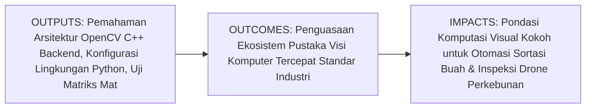
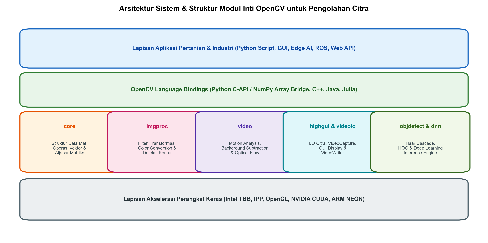
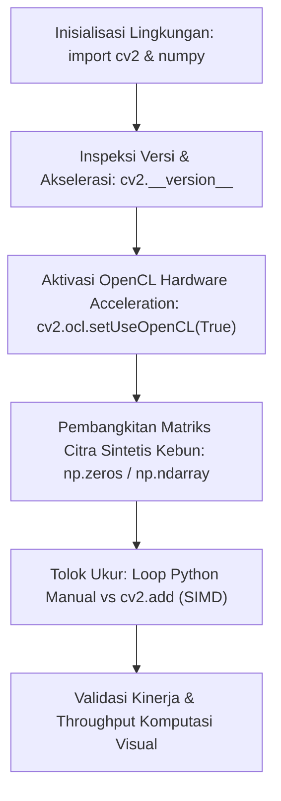

# AI Modul 11.1: Pengenalan OpenCV

---

## 1. Identitas & Kerangka Capaian Pembelajaran (Sub-CPMK)

* **Kode Modul**: AI Modul 11.1
* **Mata Kuliah**: Kecerdasan Buatan dan Sains Data Pertanian Presisi
* **Alokasi Waktu**: 2 x 50 Menit (Kajian Teori & Diskusi) + 2 x 50 Menit (Eksplorasi Praktikum Mandiri)
* **Beban SKS**: 3 SKS
* **Prasyarat**: AI Modul 10.7 (Feature Extraction)
* **Level Kognitif**: Bloom C2 (Memahami), C3 (Menerapkan), C4 (Menganalisis)



### 1.1 Capaian Pembelajaran Khusus (Sub-CPMK)
Setelah menyelesaikan modul ini secara komprehensif, mahasiswa diharapkan mampu:
1. **Memahami (C2)** arsitektur perangkat lunak OpenCV (*Open Source Computer Vision Library*), integrasi backend berbasis C++ berkinerja tinggi dengan antarmuka Python, pemetaan struktur data matriks internal (`cv::Mat`) ke array multidimensi NumPy (`ndarray`), serta lapisan akselerasi perangkat keras paralel (Intel IPP, TBB, dan OpenCL).
2. **Menerapkan (C3)** fungsi-fungsi dasar modul inti OpenCV (`cv2`) untuk inisialisasi lingkungan komputasi visual, inspeksi versi dan kapabilitas akselerasi prosesor, serta operasi aljabar tensor citra sederhana menggunakan Python 3.10.
3. **Menganalisis (C4)** perbedaan profil efisiensi komputasi antara perulangan manual Python (*nested loop*) dengan fungsi bawaan OpenCV teroptimasi C++ pada data matriks citra berskala resolusi tinggi perkebunan kelapa sawit.

### 1.2 Kerangka Hasil Pembelajaran (Outputs, Outcomes, & Impacts)
* **Outputs (Keluaran Langsung)**:
  * Pemahaman mendalam mengenai arsitektur modular OpenCV: `core`, `imgproc`, `highgui`, `videoio`, dan `dnn`.
  * Skrip Python modular berstandar PEP 8 untuk verifikasi pustaka OpenCV, pembacaan kapabilitas build sistem (`cv2.getBuildInformation()`), dan pengujian akselerasi OpenCL.
  * Hasil uji komparasi tolok ukur (*benchmark*) waktu eksekusi manipulasi piksel antara implementasi Python murni dan fungsi teroptimasi OpenCV.
* **Outcomes (Kompetensi Aplikatif)**:
  * Kemampuan menyiapkan lingkungan kerja visi komputer produksi yang stabil pada berbagai sistem operasi (Windows, Linux, lingkungan embedded).
  * Keahlian dalam memilih modul OpenCV yang tepat sesuai dengan kebutuhan inspeksi visual di sektor agro-industri.
* **Impacts (Dampak Strategis Jangka Panjang)**:
  * Modernisasi infrastruktur rekayasa perkebunan kelapa sawit melalui adopsi pustaka pengolahan citra standar industri yang teruji, cepat, andal, dan siap diintegrasikan dengan lini sortasi otomatis pabrik kelapa sawit.

---

## 2. Profil Fundamental OpenCV: Fungsi, Manfaat, dan Keunggulan-Kelemahan

### 2.1 Fungsi Komputasi & Pemodelan Matematis
OpenCV adalah pustaka perangkat lunak visi komputer dan pembelajaran mesin sumber terbuka paling populer di dunia, yang dirancang secara khusus untuk komputasi visual berkecepatan tinggi:
1. **Abstraksi Matriks Citra Terintegrasi**: Mengintegrasikan struktur data citra secara langsung dengan array NumPy `ndarray` di lingkungan Python, memungkinkan pertukaran data tanpa biaya penyalinan memori yang berlebihan (*zero-copy memory sharing*).
2. **Kompilasi Kernel C++ Teroptimasi**: Seluruh algoritma pengolahan citra mendasar (konvolusi spasial, transformasi Fourier, geometri affine, morfologi) ditulis dalam bahasa C/C++ dan dikompilasi menggunakan instruksi vektor SIMD (Single Instruction, Multiple Data) seperti AVX2, AVX-512, dan ARM NEON.
3. **Penyediaan Pipeline End-to-End**: Menyediakan rantai pipa lengkap dari akuisisi video perangkat keras, pra-pemrosesan citra tingkat rendah, ekstraksi kontur tingkat menengah, hingga inferensi model kecerdasan buatan tingkat tinggi (`cv2.dnn`).

### 2.2 Manfaat Nyata di Industri Perkebunan & Agribisnis
* **Kecepatan Tinggi pada Sortasi Konveyor Pabrik Kelapa Sawit (PKS)**: Mengolah citra aliran Tandan Buah Segar (TBS) dengan laju 60 frame per detik tanpa kehilangan frame (*zero frame drop*) untuk mendeteksi fraksi kematangan buah secara langsung.
* **Komputasi Efisien pada Wahana Nirawak (Drone)**: Algoritma OpenCV yang ringan dapat dijalankan langsung di dalam modul komputer pendamping (*companion computer* seperti Raspberry Pi atau Jetson Nano) yang terpasang pada drone pemantau tajuk sawit.
* **Ketahanan Operasional Industri**: Pustaka yang stabil dan matang sejak tahun 2000, meminimalkan risiko kegagalan sistem pada operasi pabrik yang berjalan nonstop 24 jam sehari.

### 2.3 Rationale: Alasan Mengapa OpenCV Digunakan
Mengapa praktisi dan akademisi memilih OpenCV dibandingkan pustaka citra Python lainnya (seperti PIL/Pillow atau scikit-image)?
1. **Performa Eksekusi Superior**: Algoritma konvolusi dan transformasi OpenCV rata-rata 10 hingga 50 kali lebih cepat daripada pustaka Python murni berkat optimasi assembly tingkat rendah.
2. **Dukungan Video Streaming Asli**: Memiliki antarmuka `cv2.VideoCapture` yang sangat matang untuk membaca kamera USB, kabel industri GigE Vision, dan protokol jaringan RTSP dari kamera pengawas kebun.
3. **Ekosistem Interoperabilitas Terluas**: Kompatibel penuh dengan PyTorch, TensorFlow, ROS (Robot Operating System), dan format terbuka ONNX.

### 2.4 Analisis Kelebihan dan Kekurangan (Tabel Komparasi)

| Parameter Evaluasi | Python PIL / Pillow | Scikit-Image | OpenCV (cv2) | Implikasi Agro-Industri |
| :--- | :--- | :--- | :--- | :--- |
| **Bahasa Inti Backend** | C / Python | Python / Cython | C++ / Assembly SIMD | OpenCV unggul mutlak pada pemrosesan video konveyor real-time. |
| **Format Warna Bawaan** | RGB | RGB | BGR (Historis) | Praktisi harus berhati-hati saat visualisasi dengan Matplotlib. |
| **Dukungan Streaming Video** | Tidak ada | Terbatas | Sangat Luas (RTSP, USB, File) | Sangat penting untuk integrasi CCTV loading ramp pabrik. |
| **Akselerasi GPU / OpenCL** | Tidak didukung | Parsial | Didukung Penuh (CUDA & OpenCL) | Memungkinkan pemrosesan citra ortofoto resolusi 4K secara cepat. |
| **Kompleksitas Pembelajaran** | Sangat Mudah | Menengah (Akademik) | Menengah hingga Mahir | Menuntut pemahaman sistem koordinat dan tipe data matriks. |

### 2.5 Contoh Kasus Penggunaan Konkret di Sektor Agro-Industri
Pabrik Kelapa Sawit PT Sawit Makmur memasang kamera industri beresolusi tinggi di atas pintu penerimaan buah (*hopper*). Setiap kali truk menuangkan buah sawit, kamera mengambil frame citra permukaan buah. Pustaka OpenCV digunakan untuk melakukan rotasi perspektif, pemotongan area konveyor secara otomatis, reduksi derau debu menggunakan filter bilateral, dan perhitungan rasio warna buah matang dalam waktu kurang dari 5 milidetik per tandan.

### 2.6 Aspek Kritis & Catatan Penting Arsitektur
1. **Konvensi Susunan Kanal BGR**: OpenCV secara default membaca citra berwarna dalam susunan kanal **Blue-Green-Red (BGR)**, bukan Red-Green-Blue (RGB). Menampilkan citra OpenCV langsung pada Matplotlib tanpa konversi warna akan menyebabkan dedaunan kelapa sawit yang berwarna hijau tampak kebiruan secara keliru.
2. **Manajemen Memori NumPy Array**: Operasi *slicing* pada citra menghasilkan *view*, bukan salinan mandiri (*copy*). Memodifikasi potongan citra tanpa method `.copy()` akan secara tidak sengaja mengubah data citra asli di memori.

---

## 3. Landasan Teori & Konsep Matematis OpenCV



### 3.1 Struktur Data Matriks dan Transformasi Aljabar
Secara matematis, citra digital dalam OpenCV direpresentasikan sebagai matriks dua dimensi untuk citra monokrom (grayscale) atau tensor berdimensi tiga untuk citra berwarna multi-kanal:

$$I \in \mathbb{R}^{H \times W \times C}$$

di mana:
* $H$ adalah tinggi citra (*height* / jumlah baris).
* $W$ adalah lebar citra (*width* / jumlah kolom).
* $C$ adalah jumlah kanal warna ($C=1$ untuk grayscale, $C=3$ untuk BGR).

Setiap elemen piksel pada posisi koordinat $(x, y)$ dan kanal $c$ dinyatakan sebagai integer tak bertanda 8-bit (*unsigned 8-bit integer*, `uint8`):

$$I(y, x, c) \in \{0, 1, 2, \dots, 255\}$$

Perhatikan bahwa dalam pengindeksan array NumPy, urutan dimensi adalah baris terlebih dahulu lalu kolom: `image[y, x]`, sedangkan dalam pemanggilan fungsi geometri OpenCV (seperti `cv2.resize` atau `cv2.circle`), parameter koordinat menggunakan urutan bidang kartesius: `(x, y)`.

### 3.2 Akselerasi Komputasi Paralel SIMD & OpenCL
Komputasi OpenCV mencapai kecepatan tinggi melalui implementasi vektorisasi instruksi prosesor. Misalkan kita melakukan operasi penyesuaian kecerahan pada seluruh piksel citra:

$$I_{\text{out}}(y, x) = \min(255, \; I_{\text{in}}(y, x) + \beta)$$

Pada perulangan biasa di tingkat interpreter Python, prosesor mengeksekusi satu per satu instruksi penjumlahan untuk setiap piksel dengan overhead interpretasi yang masif ($O(H \cdot W)$ clock cycles). Sebaliknya, kernel C++ OpenCV menggunakan register vektor SIMD (seperti AVX2 256-bit) yang mampu menjumlahkan 32 nilai piksel `uint8` secara simultan dalam satu siklus instruksi tunggal:

$$\text{Throughput SIMD} = \frac{N_{\text{piksel}}}{\text{Lebar Register (bit)} / 8} \quad \text{operasi per siklus}$$

Hal inilah yang mendasari efisiensi ekstrem OpenCV pada pemrosesan citra resolusi tinggi di lapangan perkebunan.

---

## 4. Arsitektur Komputasi & Pipeline Praktis Python



Implementasi Python untuk inisialisasi lingkungan OpenCV, pemeriksaan kapabilitas perangkat keras, dan pengujian tolok ukur kinerja:

```python
import cv2
import numpy as np
import time

# 1. Inspeksi Lingkungan dan Akselerasi OpenCV
print("=" * 60)
print(f"Versi OpenCV Terpasang : {cv2.__version__}")
print(f"Jumlah Thread CPU Aktif : {cv2.getNumThreads()}")

# Memeriksa dan mengaktifkan akselerasi OpenCL jika didukung
has_opencl = cv2.ocl.haveOpenCL()
print(f"Dukungan OpenCL Sistem : {has_opencl}")
if has_opencl:
    cv2.ocl.setUseOpenCL(True)
    print(f"Status Akselerasi OpenCL : {cv2.ocl.useOpenCL()}")
print("=" * 60)

# 2. Uji Tolok Ukur Kinerja: Python Loop vs OpenCV SIMD
height, width = 1080, 1920 # Resolusi Full HD
synthetic_canopy = np.random.randint(0, 256, (height, width, 3), dtype=np.uint8)

# Operasi: Penambahan Kecerahan +30 Piksel
# Metode A: OpenCV cv2.add (Teroptimasi C++ SIMD)
t_start = time.perf_counter()
for _ in range(50):
    result_cv2 = cv2.add(synthetic_canopy, np.array([30, 30, 30, 0], dtype=np.uint8)[:3])
t_cv2 = (time.perf_counter() - t_start) / 50.0

# Metode B: Python NumPy Vectorized
t_start = time.perf_counter()
for _ in range(50):
    result_np = np.clip(synthetic_canopy.astype(np.int16) + 30, 0, 255).astype(np.uint8)
t_np = (time.perf_counter() - t_start) / 50.0

print(f"Waktu Rata-rata cv2.add      : {t_cv2 * 1000.0:.3f} ms per frame")
print(f"Waktu Rata-rata NumPy Vector : {t_np * 1000.0:.3f} ms per frame")
print(f"Kecepatan Relatif OpenCV     : {t_np / max(t_cv2, 1e-6):.2f}x lebih cepat")
```

---

## 5. Studi Kasus Komprehensif Agro-Industri: Verifikasi Pipeline Akuisisi Citra PKS

### 5.1 Spesifikasi Masalah di Pabrik
Stasiun sortasi Pabrik Kelapa Sawit memproses 120 ton Tandan Buah Segar per jam. Kamera inspeksi menghasilkan aliran citra Full HD ($1920 \times 1080$) pada frekuensi 30 frame per detik. Sistem komputasi visual harus mampu memvalidasi integritas matriks citra, mengonfirmasi tidak adanya frame korup, dan melakukan pemeriksaan intensitas dasar dalam batasan waktu maksimal 10 milidetik per frame agar antrean konveyor tidak terhambat.

### 5.2 Implementasi Skrip Verifikasi & Pengecekan Integritas Citra
```python
# Simulasi pembangkitan citra kanopi kelapa sawit sintetis beresolusi Full HD
np.random.seed(42)
H, W = 1080, 1920
# Membuat pola kanopi kelapa sawit sintetis (dominan kanal hijau pada koordinat tengah)
frame_pks = np.zeros((H, W, 3), dtype=np.uint8)
Y, X = np.ogrid[:H, :W]
dist_center = np.sqrt((X - W//2)**2 + (Y - H//2)**2)
# Kanal Hijau (index 1 dalam BGR)
frame_pks[:, :, 1] = np.clip(180 - dist_center * 0.12, 40, 220).astype(np.uint8)
# Kanal Merah & Biru rendah
frame_pks[:, :, 0] = np.clip(60 - dist_center * 0.04, 10, 80).astype(np.uint8)
frame_pks[:, :, 2] = np.clip(90 - dist_center * 0.05, 20, 110).astype(np.uint8)

# Pipeline Inspeksi Integritas Citra
def inspect_frame_integrity(frame):
    start = time.perf_counter()
    if frame is None or frame.size == 0:
        return False, "Citra Kosong / Gagal Akuisisi", 0.0
    
    # Periksa tipe data dan rentang dimensi
    if frame.dtype != np.uint8:
        return False, "Tipe data citra bukan uint8", 0.0
        
    # Hitung rata-rata intensitas per kanal menggunakan cv2.mean
    mean_bgr = cv2.mean(frame)[:3]
    elapsed_ms = (time.perf_counter() - start) * 1000.0
    
    status_msg = f"Integritas Valid. Mean BGR: ({mean_bgr[0]:.1f}, {mean_bgr[1]:.1f}, {mean_bgr[2]:.1f})"
    return True, status_msg, elapsed_ms

is_valid, message, latency = inspect_frame_integrity(frame_pks)
print(f"Status Verifikasi Citra PKS : {is_valid}")
print(f"Keterangan Status           : {message}")
print(f"Latensi Pemrosesan Inspeksi : {latency:.3f} ms (Batas Ambang: < 10 ms)")
```

---

## 6. Kekeliruan Metodologis dan Praktik Terbaik (*Common Pitfalls & Best Practices*)

### 6.1 Kekeliruan Umum Metodologis (*Common Pitfalls*)
1. **Kebingungan Konvensi Koordinat `(x, y)` vs `(row, col)`**: Sering terjadi kesalahan saat mengakses piksel tertentu. Dalam array NumPy, elemen diakses dengan `img[y, x]` (baris dulu, kolom kemudian), sedangkan fungsi grafis OpenCV mengharapkan titik `(x, y)`.
2. **Masalah Saturasi Nilai Piksel (*Arithmetic Overflow*)**: Menggunakan operator penjumlahan Python biasa `+` pada array `uint8` akan menyebabkan efek *modulo overflow* ($250 + 20 = 14$ alih-alih $255$). Fungsi `cv2.add()` wajib digunakan karena menerapkan operasi *saturated arithmetic* ($\min(255, a+b)$).
3. **Lupa Melepaskan Sumber Daya (*Resource Leak*)**: Tidak memanggil `cap.release()` atau `cv2.destroyAllWindows()` pada akhir pemrosesan video dapat menyebabkan penguncian perangkat kamera USB oleh sistem operasi.

### 6.2 Praktik Terbaik (*Best Practices*)
1. **Manfaatkan Fungsi Teroptimasi OpenCV**: Hindari penulisan perulangan bertingkat `for y in range(H): for x in range(W)` dalam bahasa Python untuk manipulasi piksel. Gunakan fungsi vektor bawaan OpenCV (`cv2.add`, `cv2.multiply`, `cv2.bitwise_and`).
2. **Kloning Matriks Secara Eksplisit**: Gunakan `roi = img[y1:y2, x1:x2].copy()` jika ingin melakukan modifikasi terisolasi tanpa memengaruhi citra induk.
3. **Pengelolaan Lingkungan Multi-Thread**: Batasi jumlah thread CPU internal OpenCV (`cv2.setNumThreads(n)`) pada sistem server bersama agar tidak membebani alokasi prosesor lain.

---

## 7. Rangkuman Modul

* OpenCV adalah pustaka visi komputer berkinerja tinggi dengan backend berbasis C++ teroptimasi SIMD dan antarmuka Python terintegrasi array NumPy.
* Struktur citra dalam OpenCV direpresentasikan sebagai tensor multidimensi berurutan format BGR dengan tipe data `uint8`.
* Operasi aritmatika pada OpenCV menggunakan prinsip saturasi numerik (*saturation arithmetic*) yang mencegah galat overflow siklik.
* Akselerasi perangkat keras OpenCL dan multi-threading prosesor memungkinkan pemrosesan citra resolusi tinggi secara real-time pada stasiun inspeksi perkebunan.

---

## 8. Latihan Soal & Tugas Analitis HOTS (Bloom C3-C5)

### Soal Konseptual & Analitis
1. **Analisis Saturasi Aritmatika (Bloom C3)**: Diberikan dua nilai piksel bertipe `uint8`: $p_1 = 200$ dan $p_2 = 75$.
   * Berapakah hasil operasi jika dihitung menggunakan operator penambahan NumPy biasa: `np.uint8(200) + np.uint8(75)`?
   * Berapakah hasil operasi jika dihitung menggunakan `cv2.add(np.uint8([200]), np.uint8([75]))`?
   * Jelaskan dampak fatal perbedaan ini jika diterapkan pada penyesuaian kontras citra tajuk kelapa sawit di lapangan!
2. **Evaluasi Koordinat Spasial (Bloom C4)**: Seorang insinyur perkebunan ingin menggambar lingkaran pembatas tajuk pohon kelapa sawit pada koordinat horizontal 400 dan vertikal 300 dengan jari-jari 50 piksel pada citra berdimensi $600 \times 800$.
   * Tuliskan sintaks pemanggilan fungsi `cv2.circle()` yang benar!
   * Tuliskan sintaks pengirisan (*slicing*) NumPy untuk mengekstrak kotak pembatas (*bounding box*) tajuk tersebut!

### Tugas Pemrograman Mandiri
Rancang sebuah skrip Python menggunakan OpenCV untuk memuat citra sintetis beresolusi $1280 \times 720$. Lakukan penyesuaian kecerahan sebesar $+40$ menggunakan tiga metode berbeda: (1) nested for-loop Python murni, (2) operasi vektor NumPy, dan (3) `cv2.add()`. Catat waktu eksekusi masing-masing metode untuk 100 kali iterasi dan buat diagram batang perbandingannya!

---

## 9. Jembatan Konsep (Bridging) ke AI Modul 11.2: Image Reading dan Manipulation

Kita telah memahami arsitektur dasar OpenCV dan bagaimana ia beroperasi secara efisien di atas memori array NumPy. Namun, bagaimana cara membaca berbagai format citra dari media penyimpanan, mengelola resolusi spasial, melakukan rotasi geometris, serta memotong area minat (*Region of Interest*) secara terarah?

Pada **AI Modul 11.2: Image Reading dan Manipulation**, kita akan mempelajari secara mendalam fungsi `cv2.imread()`, parameter flag pembacaan citra, manipulasi geometri spasial (translasi, rotasi, penskalaan *affine*), pengirisan ROI pada tandan buah sawit, serta penyimpanan citra hasil olahan menggunakan `cv2.imwrite()`.

---

## 10. Daftar Pustaka dan Referensi Akademik

1. Bradski, G., & Kaehler, A. (2008). *Learning OpenCV: Computer Vision with the OpenCV Library*. O'Reilly Media.
2. Szeliski, R. (2022). *Computer Vision: Algorithms and Applications* (2nd ed.). Springer. (Bab 2: Image Formation & Data Structures).
3. Pulli, K., Baksheev, A., Joshi, K., & Bouguet, J. Y. (2012). Real-time computer vision with OpenCV. *Communications of the ACM*, 55(6), 61-69.
4. Gonzalez, R. C., & Woods, R. E. (2018). *Digital Image Processing* (4th ed.). Pearson.
