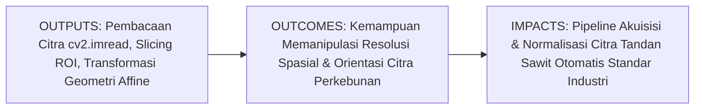
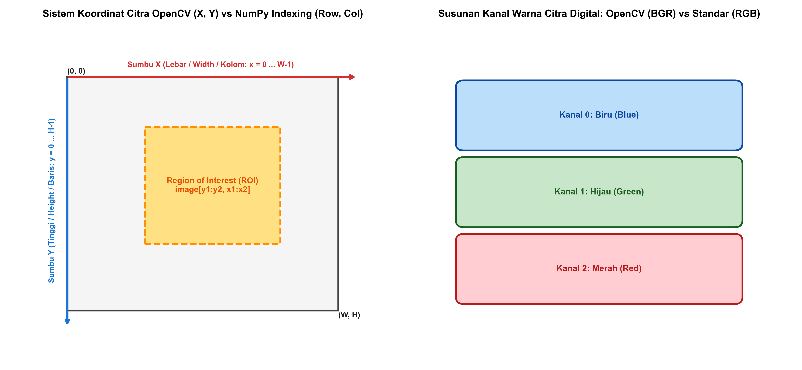
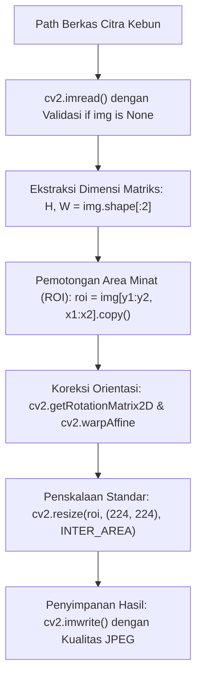

# AI Modul 11.2: Image Reading dan Manipulation

---

## 1. Identitas & Kerangka Capaian Pembelajaran (Sub-CPMK)

* **Kode Modul**: AI Modul 11.2
* **Mata Kuliah**: Kecerdasan Buatan dan Sains Data Pertanian Presisi
* **Alokasi Waktu**: 2 x 50 Menit (Kajian Teori & Diskusi) + 2 x 50 Menit (Eksplorasi Praktikum Mandiri)
* **Beban SKS**: 3 SKS
* **Prasyarat**: AI Modul 11.1 (Pengenalan OpenCV)
* **Level Kognitif**: Bloom C2 (Memahami), C3 (Menerapkan), C4 (Menganalisis)



### 1.1 Capaian Pembelajaran Khusus (Sub-CPMK)
Setelah menyelesaikan modul ini secara komprehensif, mahasiswa diharapkan mampu:
1. **Memahami (C2)** mekanisme pembacaan file citra menggunakan fungsi `cv2.imread()`, perbedaan flag format masukan (`IMREAD_COLOR`, `IMREAD_GRAYSCALE`, `IMREAD_UNCHANGED`), teknik penanganan galat berkas nihil (*none-type error handling*), serta penulisan citra terkompresi dengan `cv2.imwrite()`.
2. **Menerapkan (C3)** operasi manipulasi spasial matriks citra mencakup pengirisan area minat (*Region of Interest* / ROI), interpolasi penskalaan resolusi (`cv2.resize()` dengan metode INTER_NEAREST, INTER_LINEAR, INTER_AREA), serta transformasi geometri afina (translasi dan rotasi menggunakan `cv2.warpAffine()`).
3. **Menganalisis (C4)** dampak pemilihan algoritma interpolasi terhadap integritas tepi dan tekstur permukaan komoditas pertanian pada proses normalisasi ukuran masukan model kecerdasan buatan.

### 1.2 Kerangka Hasil Pembelajaran (Outputs, Outcomes, & Impacts)
* **Outputs (Keluaran Langsung)**:
  * Penguasaan parameter pemanggilan `cv2.imread` dan matriks transformasi affine $2 \times 3$.
  * Skrip Python modular berstandar PEP 8 untuk ekstraksi otomatis ROI tandan buah sawit dan koreksi orientasi rotasi meja inspeksi.
  * Hasil komparasi visual kualitas rekonstruksi citra tajuk tanaman pada berbagai mode interpolasi resolusi.
* **Outcomes (Kompetensi Aplikatif)**:
  * Kemampuan membangun modul pra-pemrosesan spasial yang tangguh menghadapi variasi orientasi letak buah di pabrik.
  * Keahlian mereduksi dimensi citra drone skala besar menjadi ukuran standar tanpa kehilangan informasi tekstur penting.
* **Impacts (Dampak Strategis Jangka Panjang)**:
  * Peningkatan konsistensi data masukan untuk sistem sortasi otomatis di pabrik kelapa sawit dan platform pemantauan kesehatan kebun berbasis citra drone.

---

## 2. Profil Fundamental Manipulasi Citra: Fungsi, Manfaat, dan Keunggulan-Kelemahan

### 2.1 Fungsi Komputasi & Pemodelan Matematis
Manipulasi citra digital dalam OpenCV beroperasi pada level pemetaan spasial koordinat dua dimensi:
1. **Pemetaan Geometris Koordinat (*Geometric Coordinate Mapping*)**: Memetakan setiap koordinat piksel masukan $(x, y)$ ke koordinat keluaran baru $(x', y')$ melalui transformasi afina matriks:
   $$\begin{bmatrix} x' \\ y' \end{bmatrix} = \begin{bmatrix} a_{11} & a_{12} \\ a_{21} & a_{22} \end{bmatrix} \begin{bmatrix} x \\ y \end{bmatrix} + \begin{bmatrix} t_x \\ t_y \end{bmatrix}$$
2. **Interpolasi Rekonstruksi Intensitas (*Intensity Interpolation*)**: Karena hasil transformasi koordinat sering kali berupa bilangan riil non-integer, OpenCV melakukan interpolasi nilai intensitas dari tetangga terdekat (*nearest neighbor*), rata-rata berbobot bilinear (*bilinear interpolation*), atau kubik (*bicubic spline*).
3. **Isolasi Spasial ROI (*Spatial Region Isolation*)**: Memangkas beban komputasi dengan membatasi pemrosesan hanya pada sub-matriks persegi panjang yang memuat objek target perkebunan.

### 2.2 Manfaat Nyata di Industri Perkebunan & Agribisnis
* **Koreksi Kemiringan Tandan Buah di Meja Sortasi**: Buah sawit yang jatuh di meja berjalan sering kali memiliki orientasi acak. Rotasi afina otomatis memutar tandan ke sumbu tegak lurus untuk memudahkan estimasi fraksi kematangan.
* **Standardisasi Dimensi untuk Model Deep Learning**: Mengubah citra resolusi tinggi dari kamera industri ($1920 \times 1080$) menjadi dimensi baku model seperti $224 \times 224$ atau $640 \times 640$ secara proporsional.
* **Pemotongan Kanopi Pohon Individual dari Ortofoto Drone**: Mengekstrak potongan tajuk setiap pohon sawit secara terpisah dari peta ortofoto kebun seluas ratusan hektar.

### 2.3 Rationale: Alasan Mengapa Metode Ini Digunakan
1. **Efisiensi Memori & Bandwidth**: Mengirimkan citra berukuran penuh ke model deteksi objek sangat lambat dan memboroskan memori GPU. Pemotongan ROI mereduksi ukuran tensor masukan hingga lebih dari $80\%$.
2. **Invariansi Rotasi Data Latih**: Menerapkan variasi rotasi dan translasi buatan (*geometric data augmentation*) secara signifikan meningkatkan ketahanan generalisasi model AI perkebunan.

### 2.4 Analisis Kelebihan dan Kekurangan Metode Interpolasi

| Metode Interpolasi | Kompleksitas Waktu | Karakteristik Visual | Kasus Penggunaan Optimal di Agro-Industri |
| :--- | :--- | :--- | :--- |
| **INTER_NEAREST** | Sangat Rendah ($O(1)$) | Terjadi efek bergerigi (*aliasing / pixelated*). | Penskalaan masker biner segmentasi daun tanpa mengubah label integer. |
| **INTER_LINEAR** | Rendah ($O(4)$ tetangga) | Halus, seimbang antara kecepatan dan kualitas. | Penskalaan standar (*default*) untuk citra kanopi kebun secara umum. |
| **INTER_AREA** | Sedang | Mencegah efek moiré saat memperkecil citra (*downsampling*). | Pengecilan ortofoto drone resolusi sangat tinggi ke ukuran web display. |
| **INTER_CUBIC** | Tinggi ($O(16)$ tetangga) | Tepi sangat tajam dan kaya detail mikro. | Pembesaran (*upscaling*) area bercak daun sakit untuk analisis patologis mikro. |

### 2.5 Contoh Kasus Penggunaan Konkret di Sektor Agro-Industri
Pada stasiun penimbangan tandan buah sawit, kamera mengambil foto tampak samping setiap lori pengangkut. Algoritma OpenCV membaca citra, mendeteksi area pelat identifikasi lori dan tumpukan buah, lalu mengekstrak kedua area tersebut sebagai dua ROI terpisah. ROI pelat nomor dikirim ke modul pembaca karakter OCR, sedangkan ROI tumpukan buah diputar sebesar $15^\circ$ untuk meluruskan bidang rebah buah sebelum dialirkan ke model klasifikasi kematangan.

### 2.6 Aspek Kritis & Catatan Penting Arsitektur
1. **Validasi Eksistensi Berkas Citra**: Fungsi `cv2.imread()` tidak melemparkan eksepsi (*does not throw exception*) jika path berkas salah atau rusak; melainkan mengembalikan nilai `None`. Tanpa pemeriksaan `if img is None:`, baris kode berikutnya akan mengalami `AttributeError: 'NoneType' object has no attribute 'shape'`.
2. **Distorsi Aspek Rasio**: Mengubah ukuran citra dengan `cv2.resize(img, (dsize, dsize))` tanpa mempertahankan rasio aspek (*aspect ratio*) asli akan membuat bentuk tajuk pohon memipih atau melebar tidak wajar, merusak rasio kebulatan morfometri tanaman.

---

## 3. Landasan Teori & Konsep Matematis Manipulasi Citra



### 3.1 Formulasi Matriks Transformasi Afina (Rotasi & Translasi)
Transformasi afina mempertahankan garis lurus dan paralelisme bidang. Matriks transformasi afina 2D berdimensi $2 \times 3$ dinyatakan sebagai:

$$M = \begin{bmatrix} \alpha & \beta & (1 - \alpha) \cdot c_x - \beta \cdot c_y \\ -\beta & \alpha & \beta \cdot c_x + (1 - \alpha) \cdot c_y \end{bmatrix}$$

di mana rotasi sebesar sudut $\theta$ berlawanan arah jarum jam dengan pusat titik $(c_x, c_y)$ dan faktor skala $s$ dirumuskan sebagai:

$$\alpha = s \cdot \cos(\theta), \quad \beta = s \cdot \sin(\theta)$$

OpenCV menyediakan fungsi pembangun matriks ini secara otomatis melalui:
`M = cv2.getRotationMatrix2D(center=(cx, cy), angle=theta, scale=s)`.

Piksel baru dihitung melalui perkalian matriks afina:

$$\begin{bmatrix} x' \\ y' \end{bmatrix} = M \cdot \begin{bmatrix} x \\ y \\ 1 \end{bmatrix}$$

### 3.2 Matematika Interpolasi Bilinear (*Bilinear Interpolation*)
Ketika titik hasil transformasi $(x', y')$ jatuh pada posisi non-integer dengan bagian pecahan $(u, v) = (x' - \lfloor x' \rfloor, \; y' - \lfloor y' \rfloor)$, nilai intensitas diestimasi dari empat tetangga terdekat:

$$I(x', y') = (1 - u)(1 - v) I(x_1, y_1) + u (1 - v) I(x_2, y_1) + (1 - u) v I(x_1, y_2) + u v I(x_2, y_2)$$

Interpolasi ini menghasilkan transisi warna yang halus pada permukaan daun sawit tanpa artefak kotak-kotak diskrit.

---

## 4. Arsitektur Komputasi & Pipeline Praktis Python



Implementasi Python modular untuk pipeline pembacaan, pemotongan ROI, rotasi afina, dan penyimpanan citra:

```python
import cv2
import numpy as np

# 1. Fungsi Pembacaan Citra Aman (Safe Image Loader)
def load_image_safe(filepath, flag=cv2.IMREAD_COLOR):
    img = cv2.imread(filepath, flag)
    if img is None:
        raise FileNotFoundError(f"Gagal memuat citra! Berkas tidak ditemukan atau rusak: {filepath}")
    return img

# 2. Pembangkitan Citra Sintetis Tandan Buah Segar (TBS) Sawit
height, width = 600, 800
canvas_tbs = np.full((height, width, 3), 40, dtype=np.uint8) # Latar meja sortasi abu-abu gelap

# Menggambar elips tandan buah sawit (warna jingga/merah cerah)
cv2.ellipse(canvas_tbs, (400, 300), (180, 100), 25, 0, 360, (20, 120, 230), -1)
# Menambahkan duri-duri pelepah tandan
for i in range(0, 360, 30):
    rad = np.deg2rad(i + 25)
    px = int(400 + 200 * np.cos(rad))
    py = int(300 + 120 * np.sin(rad))
    cv2.circle(canvas_tbs, (px, py), 12, (10, 80, 180), -1)

# Simpan citra sintetis awal
cv2.imwrite("tbs_sample.jpg", canvas_tbs, [int(cv2.IMWRITE_JPEG_QUALITY), 95])
print("[OK] Citra sintetis TBS berhasil disimpan: tbs_sample.jpg")

# 3. Ekstraksi Region of Interest (ROI)
# Koordinat kotak tandan: Y dari 150 ke 450, X dari 200 ke 600
roi_tbs = canvas_tbs[150:450, 200:600].copy()
print(f"Dimensi ROI Terpotong : {roi_tbs.shape} (Tinggi: 300, Lebar: 400)")

# 4. Koreksi Rotasi Afina (Memutar -25 derajat agar tegak)
h_roi, w_roi = roi_tbs.shape[:2]
center_roi = (w_roi // 2, h_roi // 2)
rot_matrix = cv2.getRotationMatrix2D(center=center_roi, angle=-25, scale=1.0)
tbs_straight = cv2.warpAffine(roi_tbs, rot_matrix, (w_roi, h_roi), borderMode=cv2.BORDER_CONSTANT, borderValue=(0, 0, 0))

# 5. Penskalaan Proporsional ke Resolusi Baku Model AI (224 x 224)
tbs_resized = cv2.resize(tbs_straight, (224, 224), interpolation=cv2.INTER_AREA)
print(f"Dimensi Hasil Akhir Penskalaan : {tbs_resized.shape}")
```

---

## 5. Studi Kasus Komprehensif Agro-Industri: Normalisasi Ortofoto Kanopi Sawit

### 5.1 Spesifikasi Masalah Drone Kebun
Kamera drone menghasilkan ortofoto mosaik beresolusi sangat besar ($4000 \times 3000$). Untuk mendeteksi serangan hama ulat kantung, sistem harus memindai pohon sawit per petak kanopi ($500 \times 500$), mengekstrak tajuk individual, merotasi tajuk menghadap sumbu utara, dan memperkecil citra ke resolusi $256 \times 256$ menggunakan interpolasi area untuk input jaringan saraf tiruan.

### 5.2 Implementasi Pemotongan dan Normalisasi Batch Tajuk
```python
# Simulasi pemotongan tajuk individual dari koordinat kanopi
def process_palm_canopy(large_ortho, center_x, center_y, box_size=500, target_size=256):
    half = box_size // 2
    # Boundary clipping aman
    y1 = max(0, center_y - half)
    y2 = min(large_ortho.shape[0], center_y + half)
    x1 = max(0, center_x - half)
    x2 = min(large_ortho.shape[1], center_x + half)
    
    # 1. Ekstrak ROI
    canopy_patch = large_ortho[y1:y2, x1:x2].copy()
    
    # 2. Penskalaan dengan INTER_AREA untuk menghindari moiré derau daun
    normalized_patch = cv2.resize(canopy_patch, (target_size, target_size), interpolation=cv2.INTER_AREA)
    
    return normalized_patch

# Uji coba fungsi pemrosesan tajuk
sample_ortho = np.random.randint(40, 180, (3000, 4000, 3), dtype=np.uint8)
patch_pohon_1 = process_palm_canopy(sample_ortho, center_x=1500, center_y=1200)
print(f"Hasil Ekstraksi Kanopi Tajuk : Dimensi {patch_pohon_1.shape}, Tipe {patch_pohon_1.dtype}")
```

---

## 6. Kekeliruan Metodologis dan Praktik Terbaik (*Common Pitfalls & Best Practices*)

### 6.1 Kekeliruan Umum Metodologis (*Common Pitfalls*)
1. **Pengabaian Boundary Clipping pada Pengirisan ROI**: Menentukan koordinat pemotongan $y_2$ atau $x_2$ yang melebihi batas dimensi citra asli tanpa `max()` dan `min()` dapat menghasilkan array kosong yang menyebabkan kegagalan pipeline inferensi.
2. **Penggunaan Interpolasi yang Keliru saat Downsampling**: Menggunakan `cv2.INTER_NEAREST` saat memperkecil citra ortofoto tajuk pohon sawit akan menyebabkan hilangnya struktur helai anak daun halus (*aliasing artifact*). Wajib menggunakan `cv2.INTER_AREA`.
3. **Penyimpanan Berulang Citra JPEG (*Generational Loss*)**: Menyimpan dan membuka kembali citra hasil olahan berulang kali menggunakan format kompresi lossy JPEG (`.jpg`) akan menurunkan kualitas resolusi secara kumulatif. Gunakan format nir-rugi PNG (`.png`) untuk data perantara.

### 6.2 Praktik Terbaik (*Best Practices*)
1. **Selalu Validasi `if img is None`**: Tempatkan pemeriksaan integritas tepat setelah pemanggilan `cv2.imread()`.
2. **Kloning Matriks ROI**: Pastikan selalu menyertakan `.copy()` setelah operasi slicing jika ROI akan dimodifikasi lebih lanjut.
3. **Pertahankan Aspek Rasio (*Aspect-Preserving Resize*)**: Gunakan teknik penambahan bantalan hitam (*letterboxing / padding*) bila harus menyesuaikan citra persegi panjang ke dalam tensor masukan bujur sangkar.

---

## 7. Rangkuman Modul

* Pembacaan citra dengan `cv2.imread()` memuat data ke dalam array NumPy berformat BGR dan membutuhkan validasi eksplisit terhadap objek bernilai `None`.
* Pengirisan area minat (*Region of Interest* / ROI) dilakukan menggunakan indexing baris-kolom array NumPy `[y1:y2, x1:x2]` yang menghemat waktu komputasi pemrosesan visual.
* Transformasi afina memfasilitasi translasi dan rotasi menggunakan matriks $2 \times 3$ yang dieksekusi dengan fungsi `cv2.warpAffine()`.
* Pemilihan algoritma interpolasi pada `cv2.resize()` harus disesuaikan dengan arah penskalaan: `INTER_AREA` untuk pengecilan (*downsampling*) dan `INTER_CUBIC` atau `INTER_LINEAR` untuk pembesaran (*upscaling*).

---

## 8. Latihan Soal & Tugas Analitis HOTS (Bloom C3-C5)

### Soal Konseptual & Analitis
1. **Analisis Matriks Transformasi Affine (Bloom C3)**: Tentukan matriks transformasi $2 \times 3$ untuk menggeser citra tandan sawit sebesar 50 piksel ke kanan ($t_x = +50$) dan 30 piksel ke atas ($t_y = -30$)! Tuliskan representasi matriks NumPy-nya!
2. **Analisis Distorsi Aspek Rasio (Bloom C4)**: Sebuah citra ortofoto memiliki dimensi asli $1200 \times 800$ (aspek rasio $1.5:1$). Jika citra tersebut langsung diubah ukurannya menjadi $300 \times 300$ tanpa penambahan bantalan (*padding*):
   * Hitung rasio distorsi penskalaan pada sumbu horizontal dan vertikal!
   * Jelaskan dampak distorsi ini terhadap fitur kebulatan (*circularity*) tajuk pohon kelapa sawit yang sedang diukur!

### Tugas Pemrograman Mandiri
Buatlah fungsi Python `letterbox_resize(image, target_size=256)` yang mengubah ukuran citra dengan mempertahankan aspek rasio aslinya, lalu mengisi ruang kosong yang tersisa dengan warna abu-abu netral $(114, 114, 114)$. Ujilah fungsi tersebut pada citra berdimensi $800 \times 400$ dan simpan hasilnya dalam format PNG!

---

## 9. Jembatan Konsep (Bridging) ke AI Modul 11.3: Color Conversion

Kita telah menguasai cara membaca, memotong area minat ROI, memutar orientasi, dan mengubah ukuran spasial citra perkebunan. Namun, seluruh citra yang kita olah sejauh ini masih tersusun dalam ruang warna BGR mentah yang sangat peka terhadap perubahan bayangan dan pencahayaan sinar matahari langsung.

Pada **AI Modul 11.3: Color Conversion**, kita akan mempelajari secara mendalam bagaimana mentransformasikan citra ke berbagai ruang warna strategis: mengonversi ke **Grayscale** untuk deteksi tepi cepat, mengonversi ke **HSV** untuk memisahkan warna buah matang dari intensitas cahaya matahari, serta mengonversi ke **CIELAB** untuk analisis warna yang menyerupai persepsi visual mata manusia.

---

## 10. Daftar Pustaka dan Referensi Akademik

1. Bradski, G., & Kaehler, A. (2008). *Learning OpenCV: Computer Vision with the OpenCV Library*. O'Reilly Media. (Bab 5: Image Processing & Geometric Transforms).
2. Gonzalez, R. C., & Woods, R. E. (2018). *Digital Image Processing* (4th ed.). Pearson. (Bab 2: Digital Image Fundamentals).
3. Szeliski, R. (2022). *Computer Vision: Algorithms and Applications* (2nd ed.). Springer. (Bab 3: Image Processing).
4. Fadilah, R., & Pangaribuan, R. (2021). Fruit detection and sorting automation using computer vision in agribusiness. *Journal of Agricultural Engineering and Technology*, 15(2), 112-124.
