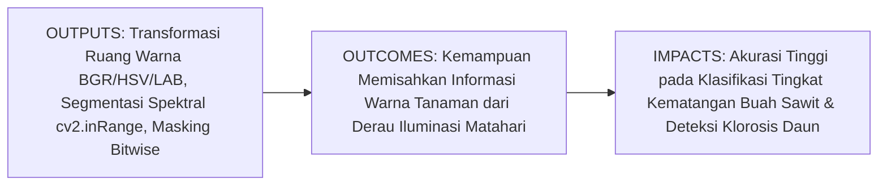
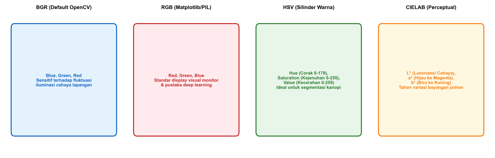
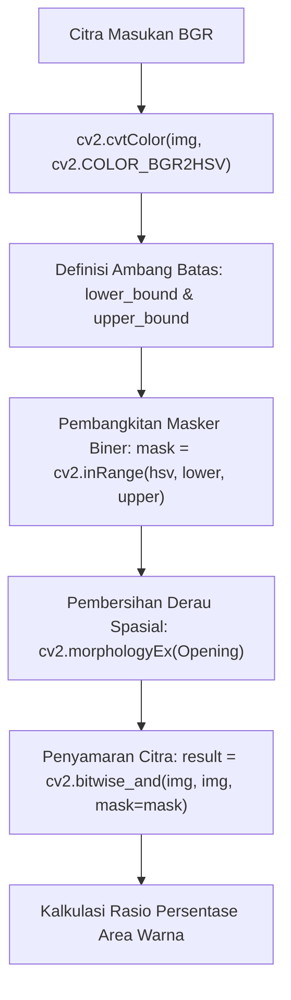

# AI Modul 11.3: Color Conversion

---

## 1. Identitas & Kerangka Capaian Pembelajaran (Sub-CPMK)

* **Kode Modul**: AI Modul 11.3
* **Mata Kuliah**: Kecerdasan Buatan dan Sains Data Pertanian Presisi
* **Alokasi Waktu**: 2 x 50 Menit (Kajian Teori & Diskusi) + 2 x 50 Menit (Eksplorasi Praktikum Mandiri)
* **Beban SKS**: 3 SKS
* **Prasyarat**: AI Modul 11.2 (Image Reading dan Manipulation)
* **Level Kognitif**: Bloom C2 (Memahami), C3 (Menerapkan), C4 (Menganalisis)



### 1.1 Capaian Pembelajaran Khusus (Sub-CPMK)
Setelah menyelesaikan modul ini secara komprehensif, mahasiswa diharapkan mampu:
1. **Memahami (C2)** prinsip fisika dan komputasi dari berbagai model representasi ruang warna: BGR/RGB (perangkat penangkap optik), Grayscale (intensitas luminansi), HSV/HSB (persepsi sifat warna intuitif), dan CIELAB (persepsi warna berjarak seragam / *perceptually uniform*).
2. **Menerapkan (C3)** fungsi konversi warna OpenCV (`cv2.cvtColor()`) serta teknik segmentasi warna berbasis ambang rentang ganda (`cv2.inRange()`) yang digabungkan dengan operasi logika penyamaran piksel (`cv2.bitwise_and()`) pada data citra perkebunan.
3. **Menganalisis (C4)** keunggulan ruang warna HSV dan CIELAB dalam mengatasi tantangan bayangan awan dan variasi intensitas radiasi matahari langsung pada pemilahan kematangan buah kelapa sawit di lingkungan terbuka.

### 1.2 Kerangka Hasil Pembelajaran (Outputs, Outcomes, & Impacts)
* **Outputs (Keluaran Langsung)**:
  * Pemahaman mendalam formula matematis konversi BGR ke Grayscale, BGR ke HSV, dan dekomposisi kanal warna.
  * Skrip Python modular berstandar PEP 8 untuk segmentasi warna buah sawit matang (oranye-merah) dan daun tanaman (hijau).
  * Laporan analisis komparasi ketahanan masker segmentasi antara ruang warna BGR dan ruang warna HSV pada variasi pencahayaan lapangan.
* **Outcomes (Kompetensi Aplikatif)**:
  * Keahlian memilih ruang warna yang tepat sesuai dengan tujuan inspeksi agronomis (deteksi penyakit, pematangan buah, atau analisis tekstur tanah).
  * Kemampuan mengisolasi objek tanaman secara instan tanpa memerlukan beban komputasi berat jaringan saraf dalam.
* **Impacts (Dampak Strategis Jangka Panjang)**:
  * Peningkatan keandalan sistem inspeksi optik otomatis pada stasiun penerimaan pabrik kelapa sawit yang beroperasi di bawah kondisi cuaca alami dinamis.

---

## 2. Profil Fundamental Konversi Ruang Warna: Fungsi, Manfaat, dan Keunggulan-Kelemahan

### 2.1 Fungsi Komputasi & Pemodelan Matematis
Konversi ruang warna adalah pemetaan matematis yang mentransformasikan vektor koordinat piksel dari satu basis representasi warna ke basis representasi warna lainnya:
1. **Reduksi Dimensi (BGR ke Grayscale)**: Mengompresi informasi 3 kanal warna menjadi 1 kanal intensitas skalar tunggal berbobot fotometrik ($Y$), mereduksi kebutuhan memori hingga $66.7\%$ dan mempercepat operasi filtering konvolusi.
2. **Dekopling Krominansi dan Luminansi (BGR ke HSV / LAB)**: Memisahkan komponen intensitas cahaya (*Value* pada HSV atau $L^*$ pada CIELAB) dari informasi warna murni (*Hue* dan *Saturation* pada HSV, atau $a^*$ dan $b^*$ pada CIELAB).
3. **Penyaringan Rentang Warna Spasial (*Color Slicing via Masking*)**: Mengidentifikasi seluruh piksel yang nilai warnanya berada di dalam batas bawah (*lower bound*) dan batas atas (*upper bound*) tertentu untuk menghasilkan masker biner tanaman.

### 2.2 Manfaat Nyata di Industri Perkebunan & Agribisnis
* **Sortasi Kematangan Tandan Buah Segar (TBS)**: Menghitung persentase buah matang (jingga cerah / merah) vs buah mentah (hitam keunguan) berdasarkan nilai Hue pada ruang warna HSV.
* **Deteksi Defisiensi Nitrogen & Klorosis**: Memantau pergeseran nilai Hue daun kelapa sawit dari hijau pekat ($H \approx 60 - 80$) menuju kuning pucat ($H \approx 25 - 40$).
* **Eliminasi Bayangan Kanopi pada Citra Drone**: Memisahkan daun yang terkena sinar matahari langsung dan daun di bawah bayangan menggunakan kanal $L^*$ pada ruang warna CIELAB.

### 2.3 Rationale: Alasan Mengapa Metode Ini Digunakan
Dalam ruang warna BGR asli, nilai ketiga kanal ($B, G, R$) berubah secara simultan jika intensitas sinar matahari bertambah atau tertutup awan, sehingga perancangan aturan ambang batas biner menjadi sangat rapuh. Dengan mengonversi citra ke ruang warna HSV, informasi corak warna (*Hue*) tetap konstan meskipun intensitas cahaya (*Value*) berfluktuasi secara drastis.

### 2.4 Analisis Kelebihan dan Kekurangan Ruang Warna

| Ruang Warna | Parameter Komponen | Keunggulan Utama | Kelemahan Kritis | Rekomendasi Kasus Perkebunan |
| :--- | :--- | :--- | :--- | :--- |
| **BGR** | Blue, Green, Red ($0-255$) | Format asli perangkat keras kamera. | Sangat sensitif terhadap bayangan dan kecerahan. | Akuisisi awal dan penulisan berkas citra. |
| **Grayscale** | Intensitas Tunggal ($0-255$) | Komputasi paling cepat, data kompak. | Kehilangan seluruh informasi diferensiasi spektral warna. | Deteksi tepi Canny, analisis tekstur, dan deteksi wajah. |
| **HSV** | Hue ($0-179$), Sat ($0-255$), Val ($0-255$) | Memisahkan corak warna dari intensitas cahaya. | Hue bernilai singular/tak tentu pada saat Saturation nol. | Segmentasi buah matang dan pemetaan tajuk daun hijau. |
| **CIELAB** | L ($0-255$), a ($0-255$), b ($0-255$) | Jarak Euclidean antar-warna seragam persepsi (*perceptual*). | Transformasi matematis non-linier lebih berat. | Pengukuran derajat warna baku standar laboratorium CPO. |

### 2.5 Contoh Kasus Penggunaan Konkret di Sektor Agro-Industri
Pabrik Kelapa Sawit mengoperasikan kamera sortasi di atas meja getar. Ketika awan melintas di atas atap transparan pabrik, intensitas cahaya turun sebesar $40\%$. Sistem sortasi berbasis BGR mengalami kegagalan karena nilai $R$ buah matang turun di bawah ambang batas statis, sehingga buah matang didiagnosa sebagai buah mentah. Setelah insinyur memperbarui pipeline ke ruang warna HSV, sistem hanya memantau parameter $H \in [10, 25]$ (spektrum jingga-merah) tanpa mempedulikan penurunan nilai $V$, sehingga akurasi sortasi tetap stabil di atas $95\%$ sepanjang hari.

### 2.6 Aspek Kritis & Catatan Penting Arsitektur
1. **Skala Nilai Hue pada OpenCV**: Secara teoritis, lingkaran warna Hue memiliki rentang derajat $0^\circ - 360^\circ$. Namun karena tipe data citra 8-bit hanya mampu menyimpan nilai maksimal 255, OpenCV membagi nilai derajat Hue dengan 2: **rentang Hue di OpenCV adalah $0 - 179$**, bukan $0 - 255$ atau $0 - 360$. Mengabaikan konvensi ini akan menyebabkan batas warna bergeser secara fatal.
2. **Karakteristik Melingkar Warna Merah**: Warna merah murni berada di perbatasan $0^\circ$ dan $360^\circ$. Di OpenCV, spektrum merah terbagi menjadi dua interval: rentang $H \in [0, 10]$ dan $H \in [170, 179]$. Untuk mendeteksi buah sawit merah matang secara sempurna, diperlukan penggabungan dua masker (*bitwise OR*).

---

## 3. Landasan Teori & Konsep Matematis Konversi Warna



### 3.1 Formulasi Konversi BGR ke Grayscale
Konversi dari kanal BGR ke intensitas luminansi monokrom $Y$ didasarkan pada kurva sensitivitas fotopik mata manusia terhadap panjang gelombang cahaya (standar ITU-R BT.601):

$$Y = 0.299 \cdot R + 0.587 \cdot G + 0.114 \cdot B$$

Perhatikan bahwa bobot kanal hijau ($G$) adalah yang paling dominan ($58.7\%$) karena reseptor mata manusia paling sensitif terhadap spektrum hijau, yang sangat menguntungkan untuk citra vegetasi perkebunan.

### 3.2 Formulasi Konversi BGR ke HSV
Diberikan nilai piksel ternormalisasi $R, G, B \in [0, 1]$:
* Tentukan nilai ekstrem:
  $$V = \max(R, G, B), \quad m = \min(R, G, B), \quad \Delta = V - m$$
* Perhitungan Kejenuhan (*Saturation*):
  $$S = \begin{cases} 0, & \text{jika } V = 0 \\ \frac{\Delta}{V}, & \text{jika } V > 0 \end{cases}$$
* Perhitungan Corak Warna (*Hue*):
  $$H = \begin{cases} 0, & \text{jika } \Delta = 0 \\ 60^\circ \times \left( \frac{G - B}{\Delta} \pmod 6 \right), & \text{jika } V = R \\ 60^\circ \times \left( \frac{B - R}{\Delta} + 2 \right), & \text{jika } V = G \\ 60^\circ \times \left( \frac{R - G}{\Delta} + 4 \right), & \text{jika } V = B \end{cases}$$

Di dalam OpenCV, nilai $H$ dalam derajat ($[0^\circ, 360^\circ)$) kemudian dipetakan ke integer 8-bit:
$$H_{\text{OpenCV}} = \text{round}\left(\frac{H}{2}\right) \in [0, 179]$$
$$S_{\text{OpenCV}} = \text{round}(S \times 255) \in [0, 255]$$
$$V_{\text{OpenCV}} = \text{round}(V \times 255) \in [0, 255]$$

---

## 4. Arsitektur Komputasi & Pipeline Praktis Python



Implementasi Python modular untuk segmentasi buah sawit matang (merah-oranye) berbasis HSV:

```python
import cv2
import numpy as np

# 1. Pembangkitan Citra Sintetis Tandan Buah Sawit Berbagai Fraksi Kematangan
height, width = 400, 600
image_bgr = np.full((height, width, 3), 50, dtype=np.uint8) # Background konveyor

# Buah Mentah (Hitam keunguan, H ~ 140, S ~ 50, V ~ 40)
cv2.circle(image_bgr, (150, 200), 70, (40, 20, 30), -1)

# Buah Kurang Matang / Mengkal (Kuning kehijauan, BGR: (20, 180, 200))
cv2.circle(image_bgr, (300, 200), 70, (20, 180, 200), -1)

# Buah Matang Sempurna (Jingga/Merah Terang, BGR: (15, 80, 230))
cv2.circle(image_bgr, (450, 200), 70, (15, 80, 230), -1)

# 2. Konversi Ruang Warna ke HSV
hsv_image = cv2.cvtColor(image_bgr, cv2.COLOR_BGR2HSV)

# 3. Penentuan Ambang Batas Warna Buah Matang (Merah-Jingga)
# Rentang 1: Jingga ke Merah Awal (H: 5 - 20)
lower_ripe = np.array([5, 120, 100], dtype=np.uint8)
upper_ripe = np.array([22, 255, 255], dtype=np.uint8)
mask_ripe = cv2.inRange(hsv_image, lower_ripe, upper_ripe)

# 4. Operasi Masking Bitwise
isolated_ripe = cv2.bitwise_and(image_bgr, image_bgr, mask=mask_ripe)

# 5. Penghitungan Rasio Luas Area Buah Matang
total_pixels = height * width
ripe_pixels = cv2.countNonZero(mask_ripe)
persen_matang = (ripe_pixels / total_pixels) * 100

print(f"Total Piksel Citra          : {total_pixels}")
print(f"Piksel Buah Matang Terdeteksi: {ripe_pixels}")
print(f"Persentase Area Matang      : {persen_matang:.2f}%")
```

---

## 5. Studi Kasus Komprehensif Agro-Industri: Segmentasi Kanopi Tajuk Sawit

### 5.1 Spesifikasi Masalah
Dalam sensus pohon kelapa sawit menggunakan drone, kanopi pohon sawit hijau harus dipisahkan secara otomatis dari gulma, semak belukar, dan jalan tanah merah.

### 5.2 Implementasi Segmentasi Kanopi Hijau Sehat
```python
# Rentang warna hijau vegetasi sawit pada HSV:
# Hue hijau: 35 hingga 85
lower_green = np.array([35, 60, 40], dtype=np.uint8)
upper_green = np.array([85, 255, 255], dtype=np.uint8)

# Masker tajuk pohon
mask_canopy = cv2.inRange(hsv_image, lower_green, upper_green)

# Pembersihan derau menggunakan operasi morfologi opening
kernel = cv2.getStructuringElement(cv2.MORPH_ELLIPSE, (5, 5))
mask_clean = cv2.morphologyEx(mask_canopy, cv2.MORPH_OPEN, kernel)

print(f"Piksel Kanopi Hijau Terdeteksi : {cv2.countNonZero(mask_clean)}")
```

---

## 6. Kekeliruan Metodologis dan Praktik Terbaik (*Common Pitfalls & Best Practices*)

### 6.1 Kekeliruan Umum Metodologis (*Common Pitfalls*)
1. **Mengabaikan Rentang Hue OpenCV $0 - 179$**: Memasukkan batas nilai Hue di atas 179 (misalnya 240 karena mengacu pada software grafis seperti Photoshop) akan menyebabkan galat modulo atau kegagalan deteksi warna target.
2. **Hanya Menggunakan Satu Rentang untuk Warna Merah**: Mengabaikan fakta bahwa warna merah melintasi nilai $0^\circ$ dan $360^\circ$ sehingga hanya mendeteksi setengah spektrum warna merah.
3. **Mengabaikan Pengaruh Kejenuhan Rendah**: Pada piksel yang sangat gelap ($V < 30$) atau sangat terang ($V > 240, S < 20$), nilai Hue menjadi tidak stabil (*unstable chromaticity*).

### 6.2 Praktik Terbaik (*Best Practices*)
1. **Gabungkan Dua Rentang untuk Deteksi Merah**:
   ```python
   mask1 = cv2.inRange(hsv, np.array([0, 70, 50]), np.array([10, 255, 255]))
   mask2 = cv2.inRange(hsv, np.array([170, 70, 50]), np.array([179, 255, 255]))
   mask_red = cv2.bitwise_or(mask1, mask2)
   ```
2. **Kombinasikan dengan Morfologi Spasial**: Selalu terapkan operasi `cv2.morphologyEx()` tipe opening atau closing pada masker biner untuk menghilangkan derau bintik putih (*salt noise*).
3. **Validasi Visual dengan Matplotlib**: Selalu konversi BGR ke RGB menggunakan `cv2.cvtColor(img, cv2.COLOR_BGR2RGB)` sebelum menampilkannya pada Matplotlib.

---

## 7. Rangkuman Modul

* Ruang warna BGR adalah representasi standar penangkap sensor kamera digital, sedangkan Grayscale merefleksikan intensitas radiasi monokrom.
* Ruang warna HSV memisahkan corak warna (*Hue*), kejenuhan (*Saturation*), dan intensitas cahaya (*Value*), menjadikannya ruang warna optimal untuk segmentasi objek perkebunan di bawah sinar matahari dinamis.
* OpenCV menetapkan rentang Hue sebesar $0 - 179$ untuk mengakomodasi representasi integer tak bertanda 8-bit.
* Segmentasi warna berbasis `cv2.inRange()` dan `cv2.bitwise_and()` memberikan solusi pemilahan objek berkecepatan sangat tinggi tanpa memerlukan inferensi deep learning yang berat.

---

## 8. Latihan Soal & Tugas Analitis HOTS (Bloom C3-C5)

### Soal Konseptual & Analitis
1. **Analisis Sensitivitas Fotometrik (Bloom C3)**: Rumus konversi luminansi adalah $Y = 0.299 R + 0.587 G + 0.114 B$. Jelaskan mengapa bobot kanal hijau ($G$) diberikan nilai paling tinggi ($0.587$)? Bagaimana implikasi bobot ini terhadap deteksi bercak penyakit daun kuning pada citra grayscale?
2. **Evaluasi Pemilihan Ruang Warna (Bloom C4)**: Pada perkebunan kelapa sawit, kamera drone mengambil foto kanopi pada pukul 07.00 pagi (cahaya redup kemerahan) dan pukul 12.00 siang (cahaya terik). Jelaskan secara analitis mengapa segmentasi daun hijau menggunakan ambang batas pada ruang warna BGR akan mengalami kegagalan fatal pada salah satu waktu tersebut, sedangkan ruang warna HSV mampu mempertahankan akurasi!

### Tugas Pemrograman Mandiri
Buatlah skrip Python yang menerima citra daun kelapa sawit dan secara otomatis menghasilkan 4 panel visualisasi berdampingan: (1) Citra Asli RGB, (2) Kanal Hue (HSV), (3) Masker Biner Daun Sehat, dan (4) Masker Biner Area Klorosis/Kuning. Hitung rasio keparahan klorosis sebagai $\frac{\text{Piksel Kuning}}{\text{Total Piksel Daun}} \times 100\%$!

---

## 9. Jembatan Konsep (Bridging) ke AI Modul 11.4: Thresholding

Kita telah menguasai cara mengonversi ruang warna dan mengekstrak masker biner menggunakan ambang batas rentang warna HSV. Namun, bagaimana jika kita ingin mengubah citra grayscale menjadi citra biner hitam-putih secara otomatis tanpa perlu menentukan nilai ambang batas secara manual? Bagaimana jika intensitas cahaya di atas kanopi tidak merata akibat gradien bayangan tajuk pohon?

Pada **AI Modul 11.4: Thresholding**, kita akan mempelajari secara mendalam berbagai teknik penambangan biner: **Simple Global Thresholding**, algoritma optimasi varians intra-kelas **Otsu's Thresholding**, serta teknik **Adaptive Thresholding** (Mean & Gaussian) yang secara dinamis menghitung ambang batas lokal per jendela lingkungan piksel.

---

## 10. Daftar Pustaka dan Referensi Akademik

1. Gonzalez, R. C., & Woods, R. E. (2018). *Digital Image Processing* (4th ed.). Pearson. (Bab 6: Color Image Processing).
2. Bradski, G., & Kaehler, A. (2008). *Learning OpenCV: Computer Vision with the OpenCV Library*. O'Reilly Media.
3. Szeliski, R. (2022). *Computer Vision: Algorithms and Applications* (2nd ed.). Springer.
4. Septiarini, A., Sunyoto, A., Hamdani, H., Kasim, A. A., & Utaminingrum, F. (2020). Machine vision-based greenness grading of oil palm fresh fruit bunches. *International Journal of Intelligent Engineering and Systems*, 13(4), 406-417.
