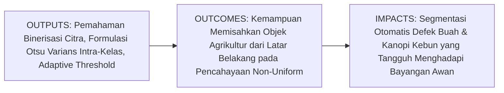
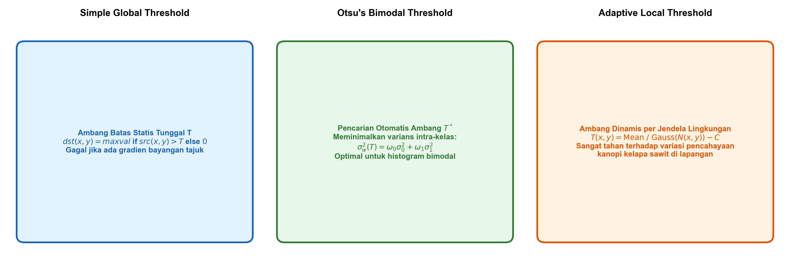
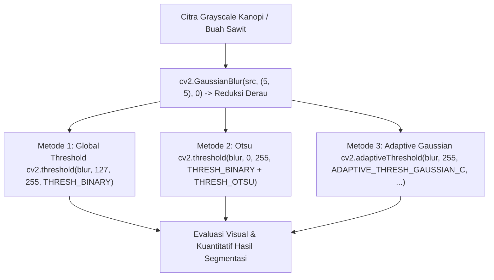

# AI Modul 11.4: Thresholding

---

## 1. Identitas & Kerangka Capaian Pembelajaran (Sub-CPMK)

* **Kode Modul**: AI Modul 11.4
* **Mata Kuliah**: Kecerdasan Buatan dan Sains Data Pertanian Presisi
* **Alokasi Waktu**: 2 x 50 Menit (Kajian Teori & Diskusi) + 2 x 50 Menit (Eksplorasi Praktikum Mandiri)
* **Beban SKS**: 3 SKS
* **Prasyarat**: AI Modul 11.3 (Color Conversion)
* **Level Kognitif**: Bloom C2 (Memahami), C3 (Menerapkan), C4 (Menganalisis)



### 1.1 Capaian Pembelajaran Khusus (Sub-CPMK)
Setelah menyelesaikan modul ini secara komprehensif, mahasiswa diharapkan mampu:
1. **Memahami (C2)** prinsip dasar binerisasi citra, pembagian kelas latar depan (*foreground*) dan latar belakang (*background*), perbedaan mendasar antara penambangan ambang batas global (*global thresholding*), metode penentuan ambang batas optimal otomatis Otsu, serta penambangan ambang batas adaptif lokal (*adaptive local thresholding*).
2. **Menerapkan (C3)** fungsi `cv2.threshold()` dengan berbagai tipe flag penambangan (`THRESH_BINARY`, `THRESH_BINARY_INV`, `THRESH_OTSU`) serta `cv2.adaptiveThreshold()` dengan algoritma Mean dan Gaussian menggunakan pustaka OpenCV pada citra pertanian.
3. **Menganalisis (C4)** formulasi matematika varians antar-kelas (*inter-class variance*) pada algoritma Otsu serta mengevaluasi trade-off ukuran jendela lingkungan (*block size*) pada penanganan gradien bayangan tajuk kelapa sawit di lapangan.

### 1.2 Kerangka Hasil Pembelajaran (Outputs, Outcomes, & Impacts)
* **Outputs (Keluaran Langsung)**:
  * Derivasi matematis fungsi objektif Otsu untuk histogram bimodal.
  * Skrip Python modular berstandar PEP 8 yang membandingkan performa binerisasi ambang global statis, Otsu, dan Adaptif Gaussian.
  * Plot visual hasil segmentasi biner tandan buah sawit di bawah kondisi pencahayaan tidak seragam (*non-uniform illumination*).
* **Outcomes (Kompetensi Aplikatif)**:
  * Keahlian menentukan teknik binerisasi yang paling tepat berdasarkan karakteristik histogram intensitas citra komoditas pertanian.
  * Kemampuan mengisolasi kontur cacat permukaan buah tanpa terpengaruh oleh gradien bayangan alami.
* **Impacts (Dampak Strategis Jangka Panjang)**:
  * Peningkatan akurasi sortasi otomatis di pabrik kelapa sawit dan keandalan sistem inspeksi drone terhadap fluktuasi cuaca perkebunan.

---

## 2. Profil Fundamental Thresholding: Fungsi, Manfaat, dan Keunggulan-Kelemahan

### 2.1 Fungsi Komputasi & Pemodelan Matematis
Thresholding (penambangan nilai ambang batas) adalah operasi segmentasi citra tingkat dasar yang mentransformasikan citra berskala abu-abu kontinu ($I(x, y) \in [0, 255]$) menjadi citra biner hitam-putih ($B(x, y) \in \{0, 255\}$):
1. **Pemisahan Semantik Biner**: Membagi populasi piksel ke dalam dua hipotesis kelas: objek minat ($\mathcal{C}_1$) dan latar belakang ($\mathcal{C}_0$) berdasarkan nilai ambang $T$:
   $$B(x, y) = \begin{cases} 255, & \text{jika } I(x, y) \ge T \\ 0, & \text{jika } I(x, y) < T \end{cases}$$
2. **Optimasi Varians Statistik (Metode Otsu)**: Mencari nilai ambang batas optimal $T^*$ yang memaksimalkan separabilitas antar-kelas secara otomatis tanpa intervensi manusia.
3. **Kompensasi Iluminasi Lokal (Metode Adaptif)**: Menghitung nilai ambang batas dinamis $T(x, y)$ untuk setiap piksel berdasarkan rata-rata atau pembobotan Gaussian pada jendela lingkungan berukuran $B \times B$.

### 2.2 Manfaat Nyata di Industri Perkebunan & Agribisnis
* **Segmentasi Bercak Daun Penyakit Hawar/Bercak**: Mengisolasi lesi nekrotik berwarna gelap pada daun kelapa sawit untuk mengukur luas keparahan infeksi secara objektif.
* **Deteksi Butir Brondolan Sawit**: Memisahkan butiran buah sawit yang terlepas di lantai konveyor dari permukaan pelat besi meja sortasi.
* **Binarisasi Citra Tajuk Ortofoto Drone**: Memisahkan kanopi vegetasi hijau pekat dari permukaan tanah perkebunan dan rumput liar.

### 2.3 Rationale: Alasan Mengapa Metode Ini Digunakan
1. **Komputasi Sangat Ringan**: Operasi thresholding dieksekusi dalam kompleksitas $O(H \cdot W)$ dan dapat diparalelisasi penuh pada GPU atau mikroprosesor murah.
2. **Prasyarat Ekstraksi Kontur**: Sebagian besar algoritma analisis bentuk dan pelacakan topologi kontur di OpenCV mensyaratkan citra masukan bertipe biner.

### 2.4 Analisis Kelebihan dan Kekurangan Metode Thresholding

| Metode | Parameter Kunci | Keunggulan Utama | Kelemahan Kritis | Skenario Penggunaan Kebun |
| :--- | :--- | :--- | :--- | :--- |
| **Global Threshold** | Nilai ambang statis $T$ | Kecepatan eksekusi tercepat. | Gagal total jika intensitas cahaya tidak merata. | Ruang inspeksi tertutup dengan lampu studio konstan. |
| **Otsu Binarization** | Tanpa parameter (otomatis) | Menemukan ambang optimal secara mandiri pada histogram bimodal. | Menghasilkan binarisasi buruk jika histogram bersifat unimodal. | Sortasi buah di stasiun dengan pencahayaan semi-terkontrol. |
| **Adaptive Gaussian** | Ukuran jendela ($B$), offset $C$ | Sangat tahan terhadap gradien bayangan awan dan sudut cahaya matahari. | Lebih lambat secara komputasi, sensitif terhadap derau bintik. | Citra ortofoto drone dan kamera pengawas luar ruangan. |

### 2.5 Contoh Kasus Penggunaan Konkret di Sektor Agro-Industri
Sebuah armada drone memotret blok perkebunan sawit pada sore hari saat matahari berada di sudut rendah ($30^\circ$). Bayangan tajuk pohon yang panjang menutupi separuh kanopi pohon di sebelahnya. Penambangan global statis gagal total karena kanopi yang berada di bawah bayangan memiliki nilai intensitas yang sama dengan tanah terbuka. Dengan menerapkan **Adaptive Gaussian Thresholding** dengan ukuran jendela $B = 31$, sistem mampu mengisolasi daun di bawah bayangan secara sempurna karena nilai ambang batas lokal beradaptasi terhadap intensitas lingkungan sekitarnya.

### 2.6 Aspek Kritis & Catatan Penting Arsitektur
1. **Ukuran Jendela Wajib Bilangan Ganjil**: Parameter `blockSize` pada `cv2.adaptiveThreshold()` wajib bernilai bilangan ganjil yang lebih besar dari 1 (misalnya 11, 21, 31). Memasukkan angka genap akan memicu `cv::Exception`.
2. **Kebutuhan Pra-Filtering Blur**: Sebelum menerapkan metode Otsu atau Adaptive, sangat disarankan menerapkan penapis Gaussian blur halus (`cv2.GaussianBlur(img, (5, 5), 0)`) untuk mereduksi derau frekuensi tinggi yang dapat mendistorsi puncak histogram.

---

## 3. Landasan Teori & Konsep Matematis Thresholding



### 3.1 Formulasi Matematis Algoritma Otsu (1979)
Misalkan sebuah citra grayscale memiliki $L$ tingkat keabuan ($[0, 1, \dots, L-1]$) dengan total $N$ piksel. Probabilitas kemunculan tingkat keabuan $i$ dinyatakan sebagai:

$$p_i = \frac{n_i}{N}, \quad \sum_{i=0}^{L-1} p_i = 1$$

Jika kita membagi piksel menjadi dua kelas $\mathcal{C}_0$ (rentang $[0, T]$) dan $\mathcal{C}_1$ (rentang $[T+1, L-1]$):
1. **Probabilitas Kumulatif Kelas**:
   $$\omega_0(T) = \sum_{i=0}^{T} p_i, \quad \omega_1(T) = \sum_{i=T+1}^{L-1} p_i = 1 - \omega_0(T)$$
2. **Nilai Rata-rata Intensitas Kelas**:
   $$\mu_0(T) = \sum_{i=0}^{T} \frac{i \cdot p_i}{\omega_0(T)}, \quad \mu_1(T) = \sum_{i=T+1}^{L-1} \frac{i \cdot p_i}{\omega_1(T)}$$
3. **Rata-rata Intensitas Total Citra**:
   $$\mu_T = \sum_{i=0}^{L-1} i \cdot p_i = \omega_0(T) \mu_0(T) + \omega_1(T) \mu_1(T)$$
4. **Varians Antar-Kelas (*Between-Class Variance*)**:
   $$\sigma_b^2(T) = \omega_0(T) (\mu_0(T) - \mu_T)^2 + \omega_1(T) (\mu_1(T) - \mu_T)^2 = \omega_0(T) \omega_1(T) (\mu_0(T) - \mu_1(T))^2$$

Ambang batas optimal $T^*$ adalah nilai $T \in [0, L-1]$ yang memaksimalkan varians antar-kelas:

$$T^* = \arg\max_{0 \le T < L-1} \sigma_b^2(T)$$

### 3.2 Formulasi Adaptive Gaussian Thresholding
Untuk setiap piksel $(x, y)$, nilai ambang batas lokal dihitung dari bobot kernel Gaussian $G$ pada jendela $B \times B$:

$$T(x, y) = \left( \sum_{u=-k}^{k} \sum_{v=-k}^{k} G(u, v) \cdot I(x+u, y+v) \right) - C$$

di mana $k = \frac{B - 1}{2}$ dan $C$ adalah konstanta pengurang untuk mengeliminasi derau latar belakang.

---

## 4. Arsitektur Komputasi & Pipeline Praktis Python



Implementasi Python modular pengujian komparasi metode thresholding:

```python
import cv2
import numpy as np

# 1. Pembangkitan Citra Sintetis Kanopi dengan Gradien Bayangan Tajuk
H, W = 400, 600
# Gradien bayangan horizontal (kiri terang ~ 200, kanan gelap ~ 50)
grad_x = np.linspace(200, 50, W, dtype=np.float32)
background_gradient = np.tile(grad_x, (H, 1))

# Menambahkan objek daun sawit (bercak lebih terang relatif terhadap latar sekitarnya)
canopy_synth = background_gradient.copy()
cv2.ellipse(canopy_synth, (180, 200), (90, 45), -20, 0, 360, 240, -1)
cv2.ellipse(canopy_synth, (420, 200), (90, 45), 20, 0, 360, 110, -1) # Daun di bawah bayangan
canopy_gray = np.clip(canopy_synth, 0, 255).astype(np.uint8)

# 2. Pra-pemrosesan: Reduksi Derau dengan Gaussian Blur
blurred = cv2.GaussianBlur(canopy_gray, (5, 5), 0)

# 3. Metode A: Global Thresholding Statis (T = 127)
_, thresh_global = cv2.threshold(blurred, 127, 255, cv2.THRESH_BINARY)

# 4. Metode B: Otsu Binarization Otomatis
otsu_thresh, thresh_otsu = cv2.threshold(blurred, 0, 255, cv2.THRESH_BINARY + cv2.THRESH_OTSU)

# 5. Metode C: Adaptive Gaussian Thresholding (BlockSize=31, C=5)
thresh_adaptive = cv2.adaptiveThreshold(
    blurred, 255, cv2.ADAPTIVE_THRESH_GAUSSIAN_C, cv2.THRESH_BINARY, blockSize=31, C=5
)

print(f"Ambang Batas Optimal Otsu Ditemukan: T* = {otsu_thresh:.1f}")
print(f"Piksel Objek Terdeteksi Global     : {cv2.countNonZero(thresh_global)}")
print(f"Piksel Objek Terdeteksi Otsu       : {cv2.countNonZero(thresh_otsu)}")
print(f"Piksel Objek Terdeteksi Adaptif    : {cv2.countNonZero(thresh_adaptive)}")
```

---

## 5. Studi Kasus Komprehensif Agro-Industri: Deteksi Lesi Hawar Daun Sawit

### 5.1 Spesifikasi Masalah
Penyakit hawar daun (*Curvularia maculans*) menghasilkan bercak nekrotik gelap pada helai daun kelapa sawit muda. Permukaan daun sering kali memiliki pantulan lilin kutikula (*waxy glare*) yang mengacaukan penambangan global.

### 5.2 Implementasi Segmentasi Lesi Daun Berbasis Otsu Terbalik
```python
# Simulasi helai daun terang dengan bercak nekrotik gelap di tengah
leaf_surface = np.full((300, 500), 190, dtype=np.uint8)
# Bercak penyakit gelap (intensitas rendah ~ 60)
cv2.circle(leaf_surface, (200, 150), 35, 60, -1)
cv2.circle(leaf_surface, (280, 160), 25, 55, -1)
# Tambahkan derau Gaussian halus
noise = np.random.normal(0, 10, leaf_surface.shape).astype(np.int16)
leaf_noisy = np.clip(leaf_surface.astype(np.int16) + noise, 0, 255).astype(np.uint8)

# Pembersihan blur
leaf_blur = cv2.GaussianBlur(leaf_noisy, (5, 5), 0)

# Karena lesi berwarna gelap, gunakan THRESH_BINARY_INV + THRESH_OTSU
# Bercak gelap akan bernilai 255 (putih), daun normal bernilai 0 (hitam)
opt_t, lesion_mask = cv2.threshold(leaf_blur, 0, 255, cv2.THRESH_BINARY_INV + cv2.THRESH_OTSU)

lesion_area = cv2.countNonZero(lesion_mask)
print(f"Ambang Pemisahan Lesi Gelap : T = {opt_t:.1f}")
print(f"Total Luas Area Lesi Penyakit: {lesion_area} piksel")
```

---

## 6. Kekeliruan Metodologis dan Praktik Terbaik (*Common Pitfalls & Best Practices*)

### 6.1 Kekeliruan Umum Metodologis (*Common Pitfalls*)
1. **Mengabaikan Tahap Gaussian Blur**: Menerapkan Otsu atau Adaptive langsung pada citra mentah berderau tinggi akan menghasilkan artefak masker berpasir (*salt-and-pepper noise*).
2. **Memilih Block Size Terlalu Kecil pada Adaptive**: Jika ukuran `blockSize` lebih kecil daripada ukuran fisik objek kanopi, bagian tengah kanopi yang seragam akan dianggap sebagai latar belakang (*hollow object effect*).
3. **Menerapkan Otsu pada Citra yang Tidak Bimodal**: Jika citra didominasi oleh satu latar belakang seragam tanpa objek kontras, Otsu akan memotong histogram di tengah-tengah secara keliru.

### 6.2 Praktik Terbaik (*Best Practices*)
1. **Aturan Pemilihan Block Size**: Pastikan ukuran `blockSize` selalu lebih besar dari diameter objek terkecil yang ingin dideteksi.
2. **Kombinasi dengan Morfologi**: Terapkan operasi `cv2.morphologyEx(mask, cv2.MORPH_CLOSE, kernel)` setelah binerisasi untuk menutup lubang-lubang kecil pada objek.
3. **Pemeriksaan Visual Histogram**: Plot histogram intensitas citra terlebih dahulu untuk memverifikasi keberadaan dua puncak (*bimodal distribution*).

---

## 7. Rangkuman Modul

* Thresholding mengonversi citra grayscale menjadi biner untuk memisahkan objek target dari latar belakang.
* Metode Otsu secara matematis mencari ambang batas optimal $T^*$ yang memaksimalkan varians antar-kelas tanpa memerlukan parameter manual.
* Adaptive Thresholding menghitung ambang batas lokal secara dinamis per jendela tetangga, menjadikannya solusi terbaik untuk citra pertanian dengan gradien bayangan tajuk.
* Tahap pra-pemrosesan Gaussian blur merupakan langkah esensial untuk menjamin kestabilan dan kemulusan masker biner hasil segmentasi.

---

## 8. Latihan Soal & Tugas Analitis HOTS (Bloom C3-C5)

### Soal Konseptual & Analitis
1. **Analisis Varians Otsu (Bloom C4)**: Suatu citra kecil memiliki 10 piksel dengan intensitas: $[10, 12, 15, 18, 20, 180, 190, 200, 210, 220]$.
   * Hitung nilai $\omega_0$ dan $\omega_1$ jika dipilih ambang batas $T = 50$!
   * Hitung nilai rata-rata kelas $\mu_0$ dan $\mu_1$!
   * Hitung varians antar-kelas $\sigma_b^2(T)$ dan jelaskan mengapa nilai ini mendekati optimal!
2. **Evaluasi Fenomena Objek Berlubang (Bloom C4)**: Mengapa penggunaan parameter `blockSize = 7` pada citra kanopi kelapa sawit yang memiliki diameter 150 piksel menghasilkan masker kanopi yang berlubang di tengah (*hollow mask*)? Jelaskan mekanisme matematis penyebab kegagalan tersebut!

### Tugas Pemrograman Mandiri
Buatlah skrip Python yang membandingkan segmentasi daun sawit dengan gradien bayangan menggunakan: (1) `cv2.THRESH_BINARY`, (2) `cv2.THRESH_OTSU`, dan (3) `cv2.ADAPTIVE_THRESH_GAUSSIAN_C`. Hitung nilai Intersection-over-Union (IoU) ketiga metode tersebut terhadap masker ground truth aktual dan sajikan dalam bentuk tabel komparasi!

---

## 9. Jembatan Konsep (Bridging) ke AI Modul 11.5: Contour Detection

Melalui operasi thresholding, kita telah berhasil mentransformasikan citra berwarna yang kompleks menjadi masker biner bersih yang memisahkan objek target dari latar belakang. Namun, citra biner hanyalah sekumpulan kisi piksel bernilai 0 dan 255. Bagaimana cara sistem mengenali bahwa sekumpulan piksel putih tersebut adalah sebuah tandan buah sawit yang utuh? Bagaimana cara mengukur luas area, perimeter, dan koordinat pusatnya?

Pada **AI Modul 11.5: Contour Detection**, kita akan melangkah dari representasi piksel biner menuju analisis topologi bentuk tingkat lanjut: memahami **Algoritma Suzuki-Abe**, mengekstraksi hierarki kontur pohon (`RETR_TREE`, `RETR_EXTERNAL`), menghitung momen spasial centroid ($C_x, C_y$), serta mengukur rasio kebulatan (*Circularity*) untuk sensus perkebunan otomatis.

---

## 10. Daftar Pustaka dan Referensi Akademik

1. Otsu, N. (1979). A threshold selection method from gray-level histograms. *IEEE Transactions on Systems, Man, and Cybernetics*, 9(1), 62-66.
2. Gonzalez, R. C., & Woods, R. E. (2018). *Digital Image Processing* (4th ed.). Pearson. (Bab 10: Image Segmentation).
3. Bradski, G., & Kaehler, A. (2008). *Learning OpenCV: Computer Vision with the OpenCV Library*. O'Reilly Media.
4. Fadilah, R., Mohamad, N., & Abdullah, M. Z. (2020). Automated segmentation of agricultural commodities under unconstrained illumination. *Computers and Electronics in Agriculture*, 178, 105788.
