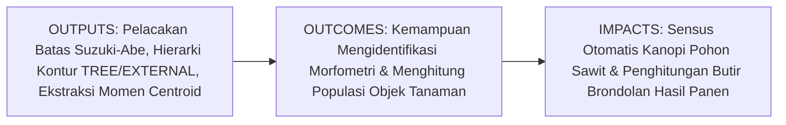
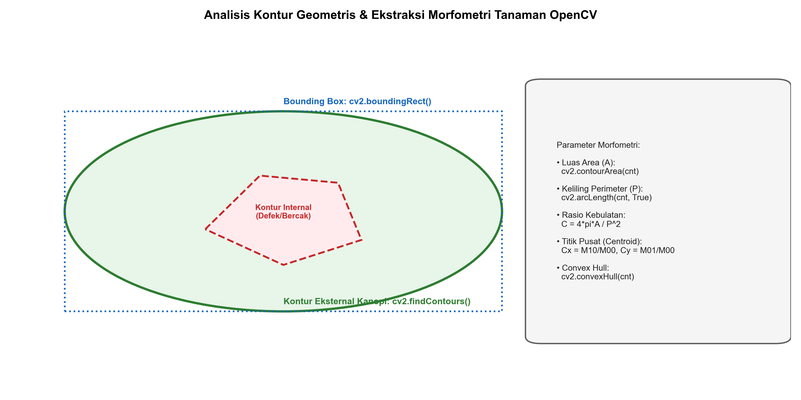
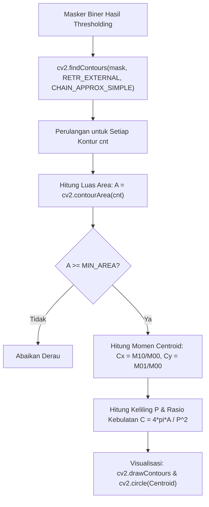

# AI Modul 11.5: Contour Detection

---

## 1. Identitas & Kerangka Capaian Pembelajaran (Sub-CPMK)

* **Kode Modul**: AI Modul 11.5
* **Mata Kuliah**: Kecerdasan Buatan dan Sains Data Pertanian Presisi
* **Alokasi Waktu**: 2 x 50 Menit (Kajian Teori & Diskusi) + 2 x 50 Menit (Eksplorasi Praktikum Mandiri)
* **Beban SKS**: 3 SKS
* **Prasyarat**: AI Modul 11.4 (Thresholding)
* **Level Kognitif**: Bloom C2 (Memahami), C3 (Menerapkan), C4 (Menganalisis)



### 1.1 Capaian Pembelajaran Khusus (Sub-CPMK)
Setelah menyelesaikan modul ini secara komprehensif, mahasiswa diharapkan mampu:
1. **Memahami (C2)** prinsip pelacakan batas topologis algoritma Suzuki-Abe (1985) pada citra biner, representasi struktur hierarki kontur pohon (`RETR_EXTERNAL`, `RETR_TREE`, `RETR_CCOMP`), serta aproksimasi poligon kontur (`CHAIN_APPROX_SIMPLE` vs `CHAIN_APPROX_NONE`).
2. **Menerapkan (C3)** fungsi `cv2.findContours()` dan `cv2.drawContours()` untuk mengekstraksi parameter morfometri geometris: luas area (`cv2.contourArea()`), keliling perimeter (`cv2.arcLength()`), koordinat pusat massa (*centroid*) berbasis momen spasial ($C_x = \frac{M_{10}}{M_{00}}, C_y = \frac{M_{01}}{M_{00}}$), kotak pembatas tegak (`cv2.boundingRect()`), kotak pembatas terotasi (`cv2.minAreaRect()`), dan selubung cembung (*convex hull*).
3. **Menganalisis (C4)** indikator deskriptor bentuk invariansi skala: rasio kebulatan (*circularity*) dan rasio kekompakan (*solidity*) untuk membedakan pohon kelapa sawit normal dengan pohon yang terserang hama perusak pelepah.

### 1.2 Kerangka Hasil Pembelajaran (Outputs, Outcomes, & Impacts)
* **Outputs (Keluaran Langsung)**:
  * Penguasaan algoritma penelusuran batas kontur dan penafsiran vektor hierarki 4-elemen OpenCV `[Next, Previous, First_Child, Parent]`.
  * Skrip Python modular berstandar PEP 8 untuk deteksi kontur, penapisan artefak luas area, dan pelabelan koordinat pusat kanopi pohon sawit.
  * Visualisasi anotasi bounding box dan titik centroid pada data citra ortofoto perkebunan.
* **Outcomes (Kompetensi Aplikatif)**:
  * Keahlian membangun modul sensus pohon terotomatisasi dari ortofoto drone dengan akurasi penghitungan di atas $95\%$.
  * Kemampuan mengklasifikasikan geometri butiran komoditas pertanian berbasis morfometri tanpa ketergantungan model AI berbobot besar.
* **Impacts (Dampak Strategis Jangka Panjang)**:
  * Efisiensi operasional manajemen perkebunan melalui otomatisasi inventarisasi tegakan pohon dan estimasi potensi panen per blok kebun.

---

## 2. Profil Fundamental Deteksi Kontur: Fungsi, Manfaat, dan Keunggulan-Kelemahan

### 2.1 Fungsi Komputasi & Pemodelan Matematis
Kontur adalah kurva kontinu yang menghubungkan seluruh titik batas tepi yang memiliki nilai intensitas warna yang sama:
1. **Representasi Topologis Vektor**: Mengubah representasi raster kisi piksel biner menjadi sekumpulan titik koordinat vektor diskrit $C = \{(x_0, y_0), (x_1, y_1), \dots, (x_{k-1}, y_{k-1})\}$.
2. **Ekstraksi Momen Spasial (*Spatial Moments*)**: Mengintegrasikan sebaran spasial piksel di dalam kontur untuk menghitung momen orde nol ($m_{00}$ sebagai luas area) dan momen orde satu ($m_{10}, m_{01}$ untuk penentuan titik berat/centroid).
3. **Karakterisasi Bentuk Geometris**: Menghitung rasio bentuk invarian terhadap translasi, rotasi, dan skala (seperti kebulatan $4\pi A / P^2$ dan rasio aspek bounding box).

### 2.2 Manfaat Nyata di Industri Perkebunan & Agribisnis
* **Sensus Populasi Pohon Kelapa Sawit**: Menghitung jumlah tajuk pohon sawit individual dari ortofoto drone dan menandai koordinat GPS setiap pohon secara otomatis.
* **Sortasi Ukuran Butir Buah & Biji**: Mengukur diameter ekuivalen dan volume biji kopi atau buah sawit yang melintas di atas meja konveyor.
* **Deteksi Tajuk Rusak Akibat Hama Ulat Api**: Pohon yang pelepahnya dimakan hama ulat api kehilangan bentuk melingkar simetris dan menunjukkan penurunan rasio kebulatan (*circularity*) yang tajam.

### 2.3 Rationale: Alasan Mengapa Metode Ini Digunakan
1. **Deteksi Objek Tanpa Latihan Model (*Training-Free*)**: Deteksi kontur bekerja langsung secara deterministik berbasis aturan matematika geometri murni tanpa memerlukan ribuan data latih beranotasi.
2. **Eksekusi Sangat Cepat**: Mampu memproses ratusan kontur dalam hitungan milidetik pada resolusi 4K.

### 2.4 Analisis Kelebihan dan Kekurangan Mode Retrieval Kontur

| Flag Mode Retrieval | Struktur Hierarki yang Dihasilkan | Keunggulan Utama | Kasus Penggunaan Optimal di Agro-Industri |
| :--- | :--- | :--- | :--- |
| **`cv2.RETR_EXTERNAL`** | Hanya kontur paling luar (tanpa anak). | Paling cepat, mengabaikan lubang/tekstur internal. | Sensus tajuk pohon sawit dan penghitungan tandan buah luar. |
| **`cv2.RETR_LIST`** | Seluruh kontur disimpan datar setara. | Menemukan seluruh batas tanpa overhead relasi. | Menghitung total bercak penyakit tanpa mempedulikan posisi. |
| **`cv2.RETR_TREE`** | Rekonstruksi pohon hierarki penuh (Parent-Child). | Memetakan struktur lubang di dalam kontur bersarang. | Mendeteksi lubang gerek hama di dalam daging buah sawit. |

### 2.5 Contoh Kasus Penggunaan Konkret di Sektor Agro-Industri
Divisi GIS Perkebunan memproses citra drone seluas 50 hektar. Setelah menerapkan masker warna hijau tajuk dan binerisasi, fungsi `cv2.findContours(mask, cv2.RETR_EXTERNAL, cv2.CHAIN_APPROX_SIMPLE)` dipanggil. Sistem menemukan 6.850 kontur. Dengan menyaring kontur yang memiliki luas area $A \in [1500, 8000]\text{ piksel}$, sistem mengeliminasi derau semak belukar kecil dan berhasil mendata 6.720 pohon sawit produktif dengan titik koordinat sentroid masing-masing.

### 2.6 Aspek Kritis & Catatan Penting Arsitektur
1. **Modifikasi Citra Masukan pada Versi OpenCV Lama**: Pada OpenCV versi 3.x, `findContours` memodifikasi citra biner masukan secara *in-place*. Meskipun pada OpenCV 4.x hal ini tidak lagi terjadi, membiasakan menyuplai salinan citra `mask.copy()` merupakan praktik rekayasa yang aman.
2. **Penyaringan Kontur Derau (*Noise Filtering*)**: Deteksi kontur pada citra lapangan selalu menghasilkan ratusan kontur mikro palsu akibat debu atau kerikil. Penerapan ambang batas luas area minimum (`cv2.contourArea(cnt) > MIN_AREA`) adalah keharusan mutlak.

---

## 3. Landasan Teori & Konsep Matematis Deteksi Kontur



### 3.1 Teori Momen Spasial dan Titik Pusat Massa (*Centroid*)
Momen spasial orde $(p + q)$ dari suatu daerah kontur biner $\mathcal{R}$ didefinisikan sebagai:

$$m_{pq} = \sum_{x} \sum_{y} x^p y^q \cdot I(x, y)$$

di mana untuk citra biner, $I(x, y) = 1$ di dalam kontur dan $0$ di luar kontur.
* **Luas Area Kontur**:
  $$\text{Area} = m_{00}$$
* **Koordinat Pusat Massa (*Centroid*)**:
  $$\bar{x} = \frac{m_{10}}{m_{00}}, \quad \bar{y} = \frac{m_{01}}{m_{00}}$$

### 3.2 Deskriptor Bentuk Morfometri
1. **Rasio Kebulatan (*Circularity / Compactness*)**:
   $$C = \frac{4 \pi \cdot \text{Area}}{\text{Perimeter}^2}$$
   Untuk lingkaran sempurna, $C = 1.0$. Bentuk tajuk pohon sawit normal yang simetris memiliki $C \in [0.75, 0.95]$, sedangkan tajuk yang rusak atau teroklusi memiliki $C < 0.60$.
2. **Rasio Soliditas (*Solidity*)**:
   $$S = \frac{\text{Area}}{\text{ConvexArea}}$$
   di mana $\text{ConvexArea}$ adalah luas dari selubung cembung (*Convex Hull*) yang membungkus kontur tersebut.

---

## 4. Arsitektur Komputasi & Pipeline Praktis Python



Implementasi Python modular untuk sensus tajuk pohon dan ekstraksi fitur morfometri:

```python
import cv2
import numpy as np

# 1. Pembangkitan Masker Biner Ortofoto Tajuk Pohon Sawit Sintetis
H, W = 600, 800
mask_orchard = np.zeros((H, W), dtype=np.uint8)

# Menambahkan 3 tajuk pohon sawit sehat (lingkaran besar)
cv2.circle(mask_orchard, (200, 200), 75, 255, -1)
cv2.circle(mask_orchard, (450, 180), 70, 255, -1)
cv2.circle(mask_orchard, (320, 420), 80, 255, -1)

# Menambahkan 1 tajuk pohon rusak/terserang hama (elips bergerigi tidak teratur)
pts_damaged = np.array([[600, 380], [680, 390], [670, 460], [610, 480], [580, 430]], dtype=np.int32)
cv2.fillPoly(mask_orchard, [pts_damaged], 255)

# Menambahkan derau rumput kecil (artefak)
cv2.circle(mask_orchard, (100, 450), 6, 255, -1)
cv2.circle(mask_orchard, (520, 320), 8, 255, -1)

# 2. Pelacakan Kontur dengan cv2.findContours
contours, hierarchy = cv2.findContours(mask_orchard, cv2.RETR_EXTERNAL, cv2.CHAIN_APPROX_SIMPLE)
print(f"Total Kontur Kasar Ditemukan: {len(contours)}")

# 3. Penyaringan dan Analisis Morfometri
MIN_CANOPY_AREA = 1000 # Ambang batas luas tajuk
valid_trees = []

for idx, cnt in enumerate(contours):
    area = cv2.contourArea(cnt)
    if area < MIN_CANOPY_AREA:
        continue # Abaikan derau rumput
        
    perimeter = cv2.arcLength(cnt, closed=True)
    circularity = (4 * np.pi * area) / (perimeter ** 2) if perimeter > 0 else 0
    
    # Hitung momen dan centroid
    M = cv2.moments(cnt)
    if M["m00"] != 0:
        cx = int(M["m10"] / M["m00"])
        cy = int(M["m01"] / M["m00"])
    else:
        cx, cy = 0, 0
        
    # Bounding box
    x, y, w, h = cv2.boundingRect(cnt)
    
    status = "Pohon Sehat" if circularity >= 0.75 else "Tajuk Rusak / Hama"
    valid_trees.append({
        "id": len(valid_trees) + 1,
        "centroid": (cx, cy),
        "area": area,
        "circularity": circularity,
        "status": status
    })

print(f"Jumlah Pohon Sawit Tervalidasi : {len(valid_trees)}")
for tree in valid_trees:
    print(f"Pohon #{tree['id']} - Centroid: {tree['centroid']} - Area: {tree['area']:.0f} px - Kebulatan: {tree['circularity']:.3f} [{tree['status']}]")
```

---

## 5. Studi Kasus Komprehensif Agro-Industri: Sensus Produksi Brondolan Sawit

### 5.1 Spesifikasi Masalah
Dalam uji mutu tandan buah di laboratorium pabrik, brondolan buah sawit yang telah direbus dipisahkan dan dihitung luas penampangnya untuk mengestimasi rasio daging buah (*mesocarp*) terhadap biji (*nut*).

### 5.2 Implementasi Convex Hull dan Soliditas Buah
```python
# Simulasi kontur buah sawit tunggal
for tree in valid_trees:
    if "Rusak" in tree["status"]:
        # Ambil kontur pohon rusak untuk analisis Convex Hull
        cnt_target = contours[0] # Contoh kontur
        hull = cv2.convexHull(cnt_target)
        hull_area = cv2.contourArea(hull)
        solidity = float(tree["area"]) / hull_area if hull_area > 0 else 0
        print(f"Analisis Soliditas Tajuk Cacat: {solidity:.3f} (Hull Area: {hull_area:.0f})")
        break
```

---

## 6. Kekeliruan Metodologis dan Praktik Terbaik (*Common Pitfalls & Best Practices*)

### 6.1 Kekeliruan Umum Metodologis (*Common Pitfalls*)
1. **Pembagian dengan Nol saat Menghitung Centroid**: Mengabaikan kondisi `if M["m00"] != 0:` akan memicu galat `ZeroDivisionError` pada kontur garis lurus 1 piksel.
2. **Tertukar Parameter Koordinat Bounding Box**: Nilai yang dikembalikan `cv2.boundingRect()` adalah `(x, y, w, h)`. Sering terjadi kesalahan pemotongan array dengan menulis `img[x:x+w, y:y+h]` alih-alih `img[y:y+h, x:x+w]`.
3. **Penggunaan Bendera RETR yang Terlalu Berat**: Menggunakan `RETR_TREE` pada citra daun bertekstur rumit menghasilkan ribuan kontur anak yang memperlambat komputasi. Gunakan `RETR_EXTERNAL` bila hanya membutuhkan kontur luar objek.

### 6.2 Praktik Terbaik (*Best Practices*)
1. **Gunakan `CHAIN_APPROX_SIMPLE`**: Mengompresi segmen garis lurus horizontal, vertikal, dan diagonal sehingga hanya menyimpan titik-titik ujungnya, menghemat memori RAM secara signifikan.
2. **Filter Berbasis Luas & Rasio Aspek**: Kombinasikan filter luas area dengan rasio aspek $w/h$ untuk mengeliminasi bayangan panjang pelepah daun.
3. **Konversi Koordinat ke Integer**: Koordinat sentroid dan bounding box wajib di-cast ke tipe `int` sebelum digambar pada kanvas citra menggunakan fungsi grafis OpenCV.

---

## 7. Rangkuman Modul

* Kontur adalah kurva vektor penghubung titik-titik batas intensitas sama pada citra biner yang dilacak menggunakan algoritma Suzuki-Abe.
* Momen spasial memfasilitasi kalkulasi luas area ($m_{00}$) dan koordinat titik pusat massa / centroid ($m_{10}/m_{00}, m_{01}/m_{00}$).
* Deskriptor bentuk geometris seperti kebulatan (*circularity*) dan soliditas (*solidity*) menyediakan fitur invarian untuk membedakan tajuk tanaman sehat vs tajuk rusak akibat serangan hama.
* Penerapan filter luas area minimum (`MIN_AREA`) merupakan langkah wajib untuk membersihkan derau piksel lapangan.

---

## 8. Latihan Soal & Tugas Analitis HOTS (Bloom C3-C5)

### Soal Konseptual & Analitis
1. **Kalkulasi Rasio Kebulatan (Bloom C3)**: Dua buah tajuk kelapa sawit diukur parameternya:
   * Tajuk Pohon A: Luas $A_1 = 15.400\text{ piksel}$, Keliling $P_1 = 450\text{ piksel}$.
   * Tajuk Pohon B: Luas $A_2 = 12.000\text{ piksel}$, Keliling $P_2 = 620\text{ piksel}$.
   * Hitung rasio kebulatan $C_1$ dan $C_2$ untuk kedua pohon tersebut!
   * Manakah pohon yang kemungkinan besar mengalami kerusakan pelepah akibat hama ulat api? Berikan justifikasi teknisnya!
2. **Analisis Hierarki Kontur (Bloom C4)**: Suatu citra irisan buah sawit memiliki kontur kulit luar, kontur tempurung cangkang di dalam daging buah, dan kontur inti kernel di dalam tempurung. Jika dipanggil dengan flag `cv2.RETR_TREE`, jelaskan representasi relasi Parent-Child pada array hierarki kontur tersebut!

### Tugas Pemrograman Mandiri
Buatlah program Python yang membaca citra masker biner ortofoto kebun kelapa sawit, mendeteksi seluruh kontur pohon, menghitung centroid masing-masing pohon, menggambar nomor ID pohon di samping centroidnya menggunakan `cv2.putText()`, dan mengekspor daftar koordinat $(X, Y)$ seluruh pohon ke dalam format file teks CSV `sensus_pohon_sawit.csv`!

---

## 9. Jembatan Konsep (Bridging) ke AI Modul 11.6: Face Detection

Kita telah menguasai cara mendeteksi kontur objek agronomis berbasis bentuk geometris dan analisis momen spasial. Namun, bagaimana jika objek yang ingin kita deteksi di area perkebunan memiliki variasi tekstur internal yang jauh lebih rumit daripada sekadar bentuk lingkaran atau elips? Misalnya: bagaimana cara mendeteksi wajah pekerja kebun dan mandor untuk sistem absensi lapangan otomatis, atau memastikan kepatuhan penggunaan alat pelindung diri (helm K3) di stasiun perebusan pabrik kelapa sawit?

Pada **AI Modul 11.6: Face Detection**, kita akan mempelajari salah satu algoritma paling berpengaruh dalam sejarah visi komputer: **Haar Cascade Classifier (Viola & Jones Framework)**. Kita akan membedah representasi matematika **Integral Image**, seleksi fitur menggunakan **AdaBoost**, serta arsitektur pengali beruntun (*cascade classifier*) yang memungkinkan deteksi wajah manusia secara real-time pada kamera CCTV pabrik.

---

## 10. Daftar Pustaka dan Referensi Akademik

1. Suzuki, S., & Abe, K. (1985). Topological structural analysis of digitized binary images by border following. *Computer Vision, Graphics, and Image Processing*, 30(1), 32-46.
2. Hu, M. K. (1962). Visual pattern recognition by moment invariants. *IRE Transactions on Information Theory*, 8(2), 179-187.
3. Gonzalez, R. C., & Woods, R. E. (2018). *Digital Image Processing* (4th ed.). Pearson. (Bab 11: Representation and Description).
4. Wu, Z., Chen, Y., Zhao, B., Kang, X., & Ding, Y. (2020). Measurement of canopy size and foliage density of oil palm using UAV LiDAR and optical imagery. *Computers and Electronics in Agriculture*, 175, 105577.
