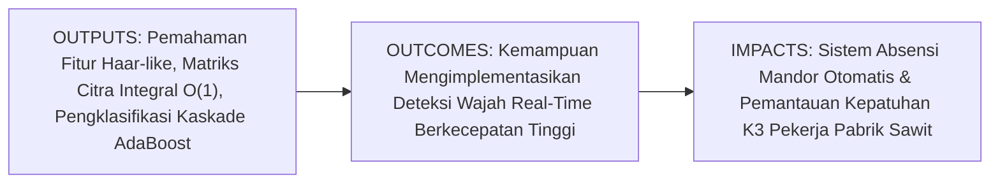
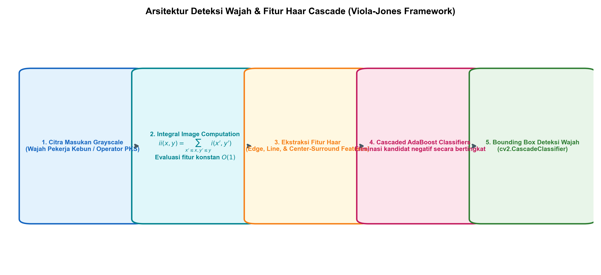
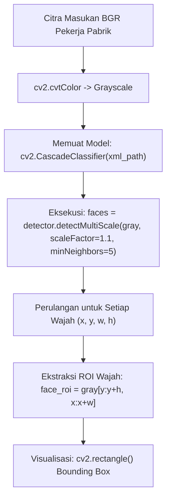

# AI Modul 11.6: Face Detection

---

## 1. Identitas & Kerangka Capaian Pembelajaran (Sub-CPMK)

* **Kode Modul**: AI Modul 11.6
* **Mata Kuliah**: Kecerdasan Buatan dan Sains Data Pertanian Presisi
* **Alokasi Waktu**: 2 x 50 Menit (Kajian Teori & Diskusi) + 2 x 50 Menit (Eksplorasi Praktikum Mandiri)
* **Beban SKS**: 3 SKS
* **Prasyarat**: AI Modul 11.5 (Contour Detection)
* **Level Kognitif**: Bloom C2 (Memahami), C3 (Menerapkan), C4 (Menganalisis)



### 1.1 Capaian Pembelajaran Khusus (Sub-CPMK)
Setelah menyelesaikan modul ini secara komprehensif, mahasiswa diharapkan mampu:
1. **Memahami (C2)** kerangka kerja seminal deteksi objek cepat Viola-Jones (2001), konsep matematika fitur Haar-like (fitur tepi, garis, dan pusat), representasi citra integral (*integral image*) untuk evaluasi kotak berkecepatan konstan $O(1)$, seleksi fitur adaptif AdaBoost, serta arsitektur pengklasifikasi kaskade (*attentional cascade*).
2. **Menerapkan (C3)** kelas `cv2.CascadeClassifier()` dari modul `cv2.objdetect` untuk mendeteksi wajah pekerja kebun dan mata operator secara real-time pada citra statis dan aliran video menggunakan model XML pra-latih (*pre-trained Haar cascades*).
3. **Menganalisis (C4)** sensitivitas parameter deteksi multi-skala: faktor penskalaan piramida (`scaleFactor`), batas ambang konsensus tetangga (`minNeighbors`), serta ukuran kotak minimum (`minSize`) terhadap tingkat deteksi benar (*true positives*) dan alarm palsu (*false positives*) di area industri kelapa sawit.

### 1.2 Kerangka Hasil Pembelajaran (Outputs, Outcomes, & Impacts)
* **Outputs (Keluaran Langsung)**:
  * Penguasaan algoritma kalkulasi citra integral dan pembuktian evaluasi area 4-titik referensi.
  * Skrip Python modular berstandar PEP 8 untuk deteksi wajah pekerja, penandaan bounding box, dan pemotongan ROI wajah.
  * Laporan evaluasi komparasi performa deteksi pada variasi parameter `scaleFactor` dan `minNeighbors`.
* **Outcomes (Kompetensi Aplikatif)**:
  * Keahlian merancang sistem absensi biometrik lapangan berbasis kamera gerbang masuk perkebunan.
  * Kemampuan mengintegrasikan deteksi wajah dengan protokol verifikasi kepatuhan alat pelindung diri (helm keselamatan K3).
* **Impacts (Dampak Strategis Jangka Panjang)**:
  * Peningkatan disiplin dan keselamatan kerja operasional pabrik kelapa sawit melalui pengawasan visual otomatis yang transparan dan akurat.

---

## 2. Profil Fundamental Deteksi Wajah: Fungsi, Manfaat, dan Keunggulan-Kelemahan

### 2.1 Fungsi Komputasi & Pemodelan Matematis
Deteksi wajah dalam kerangka kerja Viola-Jones adalah proses klasifikasi biner spasial yang melokalisasi keberadaan dan posisi wajah manusia di dalam kisi citra:
1. **Ekstraksi Fitur Haar-like Berbobot**: Mengukur perbedaan intensitas antara area gelap (mata, alis) dan area terang (pipi, dahi, hidung) menggunakan kernel persegi panjang berbobot:
   $$\Delta = \sum_{\text{kotak hitam}} I(x, y) - \sum_{\text{kotak putih}} I(x, y)$$
2. **Akselerasi Citra Integral**: Menghitung jumlah total intensitas pada sembarang persegi panjang hanya menggunakan 4 nilai sudut pada matriks kumulatif, menghasilkan waktu eksekusi independen terhadap ukuran jendela ($O(1)$).
3. **Penyaringan Bertingkat (*Cascade Rejection*)**: Rangkaian puluhan pengklasifikasi lemah (*weak classifiers*) yang disusun secara seri, di mana jendela citra non-wajah langsung dieliminasi pada tahap-tahap awal ($> 90\%$ jendela ditolak pada 2 tahap pertama), sehingga prosesor hanya fokus memproses kandidat yang sangat menyerupai wajah.

### 2.2 Manfaat Nyata di Industri Perkebunan & Agribisnis
* **Sistem Absensi Otomatis Pekerja Kebun di Pintu Gerbang Blok**: Memverifikasi kehadiran ratusan pemanen dan mandor secara nirkontak saat menaiki truk pengangkut kebun.
* **Pengawasan Keselamatan Kerja (K3) di Pabrik Kelapa Sawit**: Memastikan operator stasiun perebusan (*sterilizer*) dan pemurnian (*clarifier*) berada di pos jaga dan mengenakan helm pengaman.
* **Keamanan Aset Pabrik & Kantor Kebun**: Memantau akses personel ke gudang bahan kimia pemupukan dan ruang kendali listrik PKS.

### 2.3 Rationale: Alasan Mengapa Metode Ini Digunakan
Meskipun saat ini terdapat model deteksi wajah berbasis Deep Learning (seperti MTCNN, RetinaFace, atau YOLO-Face), Haar Cascade Classifier tetap menjadi pilihan utama untuk sistem terpasang berdaya sangat rendah (*low-power edge devices* seperti Raspberry Pi atau ESP32-CAM) karena kebutuhan memori dan daya komputasinya yang sangat minimal.

### 2.4 Analisis Kelebihan dan Kekurangan Haar Cascade

| Parameter Evaluasi | Haar Cascade Classifier (Viola-Jones) | Deep Learning Face Detector (RetinaFace/YOLO) | Implikasi di Area Perkebunan |
| :--- | :--- | :--- | :--- |
| **Kebutuhan Hardware** | CPU standar berdaya sangat rendah (tanpa GPU). | Memerlukan GPU atau akselerator NPU khusus. | Haar Cascade ideal untuk kamera baterai surya mandiri di kebun. |
| **Kecepatan Inferensi** | Sangat cepat (15 - 30 FPS pada CPU biasa). | Sedang hingga berat pada CPU biasa. | Responsivitas tinggi untuk kamera pengawas pintu gerbang. |
| **Ketahanan Sudut Wajah** | Optimal pada wajah tampak depan (*frontal face*). | Mampu mendeteksi wajah menyamping (*profile*) ekstrem. | Pekerja perlu diarahkan melihat ke arah kamera saat absensi. |
| **Ketahanan Oklusi** | Rentan gagal jika wajah tertutup masker/helm tebal. | Sangat tahan terhadap oklusi parsial. | Perlu pencahayaan lampu bantu di pos pengawas pabrik. |

### 2.5 Contoh Kasus Penggunaan Konkret di Sektor Agro-Industri
Pabrik Kelapa Sawit PT Sawit Sentosa memasang unit komputer mini dengan kamera USB di pintu masuk stasiun boiler. Setiap pekerja yang mendekati area berbahaya dipindai menggunakan Haar Cascade. Dalam waktu 35 milidetik, sistem mendeteksi kotak wajah pekerja dan mengekstrak ROI kepala di atas wajah untuk memverifikasi warna helm keselamatan. Jika helm tidak terdeteksi, alarm peringatan berbunyi secara otomatis sebelum pintu gerbang mesin dapat dibuka.

### 2.6 Aspek Kritis & Catatan Penting Arsitektur
1. **Penyediaan Berkas XML Model Pra-latih**: `cv2.CascadeClassifier` membutuhkan path berkas XML (seperti `haarcascade_frontalface_default.xml`). Jika path salah, objek classifier akan kosong (`classifier.empty() == True`) dan memicu kegagalan diam-diam (*silent failure*).
2. **Ketergantungan Citra Grayscale**: Haar Cascade beroperasi secara eksklusif pada citra berdimensi tunggal (*grayscale*). Citra berwarna wajib dikonversi dengan `cv2.cvtColor(frame, cv2.COLOR_BGR2GRAY)` sebelum pemanggilan `detectMultiScale`.

---

## 3. Landasan Teori & Konsep Matematis Deteksi Wajah



### 3.1 Teori Citra Integral (*Integral Image*)
Citra integral $ii(x, y)$ pada koordinat $(x, y)$ didefinisikan sebagai jumlah seluruh nilai piksel yang berada di sebelah kiri dan atas titik tersebut (inklusif):

$$ii(x, y) = \sum_{x' \le x, \; y' \le y} i(x', y')$$

Citra integral dapat dibangun secara efisien dalam satu kali lintasan (*single pass*) $O(H \cdot W)$ menggunakan relasi rekursif:

$$s(x, y) = s(x, y-1) + i(x, y)$$
$$ii(x, y) = ii(x-1, y) + s(x, y)$$

di mana $s(x, y)$ adalah jumlah kumulatif baris, dengan kondisi batas $s(x, -1) = 0$ dan $ii(-1, y) = 0$.

### 3.2 Evaluasi Persegi Panjang dalam Waktu Konstan $O(1)$
Diberikan empat titik sudut persegi panjang $D$: $1(x_1, y_1), 2(x_2, y_1), 3(x_1, y_2),$ dan $4(x_2, y_2)$:

$$\sum_{(x, y) \in D} i(x, y) = ii(4) + ii(1) - ii(2) - ii(3)$$

Hanya dibutuhkan tiga operasi penambahan/pengurangan sederhana terlepas dari apakah ukuran kotak adalah $24 \times 24$ piksel atau $500 \times 500$ piksel.

### 3.3 Struktur Parameter `detectMultiScale`
Metode `detectMultiScale(image, scaleFactor, minNeighbors, minSize)` mengendalikan proses piramida citra dan fusi deteksi:
* `scaleFactor`: Faktor pengecilan citra pada setiap tingkat piramida (misalnya $1.1$ berarti citra diperkecil $10\%$ per tingkat).
* `minNeighbors`: Jumlah minimum kotak kandidat bertetangga yang harus mendeteksi wajah di lokasi yang sama agar lolos verifikasi konsensus.
* `minSize`: Batas ukuran terkecil wajah yang dicari (misalnya `(30, 30)` piksel).

---

## 4. Arsitektur Komputasi & Pipeline Praktis Python



Implementasi Python modular untuk deteksi wajah pekerja menggunakan Haar Cascade:

```python
import cv2
import numpy as np
import os

# 1. Menemukan Path Bawaan Model Haar Cascade di OpenCV
cascade_path = cv2.data.haarcascades + 'haarcascade_frontalface_default.xml'
if not os.path.exists(cascade_path):
    raise FileNotFoundError(f"Berkas Haar Cascade tidak ditemukan: {cascade_path}")

face_cascade = cv2.CascadeClassifier(cascade_path)
if face_cascade.empty():
    raise RuntimeError("Gagal memuat CascadeClassifier!")
print(f"[OK] Berkas Haar Cascade Berhasil Dimuat: {os.path.basename(cascade_path)}")

# 2. Pembangkitan Citra Sintetis Pekerja Pabrik Sawit
# (Simulasi kepala pekerja dengan mata, alis, dan mulut berintensitas kontras)
H, W = 400, 600
worker_img = np.full((H, W, 3), 180, dtype=np.uint8) # Latar dinding pabrik

# Gambar Wajah 1 (Pekerja A)
cv2.ellipse(worker_img, (200, 200), (60, 80), 0, 0, 360, (190, 160, 140), -1) # Kulit
cv2.circle(worker_img, (180, 180), 8, (40, 30, 20), -1) # Mata Kiri
cv2.circle(worker_img, (220, 180), 8, (40, 30, 20), -1) # Mata Kanan
cv2.line(worker_img, (170, 165), (190, 165), (20, 20, 20), 4) # Alis Kiri
cv2.line(worker_img, (210, 165), (230, 165), (20, 20, 20), 4) # Alis Kanan
cv2.ellipse(worker_img, (200, 240), (25, 10), 0, 0, 180, (50, 40, 120), -1) # Mulut

# Konversi ke Grayscale
gray_worker = cv2.cvtColor(worker_img, cv2.COLOR_BGR2GRAY)

# 3. Deteksi Multi-Skala
faces = face_cascade.detectMultiScale(
    gray_worker,
    scaleFactor=1.1,
    minNeighbors=3,
    minSize=(50, 50)
)
print(f"Jumlah Wajah Terdeteksi: {len(faces)}")

# Anotasi Kotak Deteksi
vis_worker = worker_img.copy()
for (x, y, w, h) in faces:
    cv2.rectangle(vis_worker, (x, y), (x+w, y+h), (0, 255, 0), 2)
    cv2.putText(vis_worker, "Pekerja Terverifikasi", (x, y - 10), cv2.FONT_HERSHEY_SIMPLEX, 0.6, (0, 255, 0), 2)
```

---

## 5. Studi Kasus Komprehensif Agro-Industri: Verifikasi Kehadiran Mandor di Pos Lapangan

### 5.1 Spesifikasi Masalah
Kamera pos timbangan perkebunan merekam kehadiran mandor panen setiap pagi. Sistem harus mendeteksi wajah mandor yang berdiri pada jarak $1.5 - 3.0\text{ meter}$ dari kamera, mengekstrak potongan wajah resolusi $100 \times 100$, dan menyimpannya sebagai berkas log harian berstempel waktu.

### 5.2 Implementasi Ekstraksi ROI Wajah untuk Biometrik
```python
def extract_and_log_faces(frame, detector, output_dir="face_logs"):
    os.makedirs(output_dir, exist_ok=True)
    gray = cv2.cvtColor(frame, cv2.COLOR_BGR2GRAY)
    detections = detector.detectMultiScale(gray, scaleFactor=1.1, minNeighbors=4, minSize=(60, 60))
    
    extracted_faces = []
    for idx, (x, y, w, h) in enumerate(detections):
        # Ekstrak ROI wajah aman
        face_roi = frame[y:y+h, x:x+w].copy()
        face_norm = cv2.resize(face_roi, (100, 100), interpolation=cv2.INTER_AREA)
        
        filename = os.path.join(output_dir, f"mandor_{idx+1}.jpg")
        cv2.imwrite(filename, face_norm)
        extracted_faces.append(face_norm)
        
    return len(detections), extracted_faces

count, faces_list = extract_and_log_faces(worker_img, face_cascade)
print(f"Berhasil mengekstrak {count} wajah mandor ke direktori log.")
```

---

## 6. Kekeliruan Metodologis dan Praktik Terbaik (*Common Pitfalls & Best Practices*)

### 6.1 Kekeliruan Umum Metodologis (*Common Pitfalls*)
1. **Nilai `scaleFactor` Terlalu Besar (Misalnya 1.5)**: Pengecilan citra sebesar $50\%$ per tingkat akan melompati ukuran wajah pekerja yang berada pada jarak menengah sehingga wajah gagal terdeteksi (*false negative*). Gunakan nilai moderat seperti $1.05 - 1.15$.
2. **Nilai `minNeighbors` Terlalu Kecil (Misalnya 0 atau 1)**: Mengakibatkan munculnya puluhan kotak deteksi palsu pada tekstur dinding pabrik atau tumpukan buah sawit. Gunakan nilai $4 - 6$ untuk lingkungan industri.
3. **Menerapkan Deteksi pada Citra BGR Asli**: Melewatkan citra 3-kanal ke fungsi `detectMultiScale` akan menghasilkan galat runtime karena model Haar Cascade hanya dirancang untuk matriks intensitas 1-kanal.

### 6.2 Praktik Terbaik (*Best Practices*)
1. **Gunakan Parameter `minSize` Sesuai Jarak**: Batasi ukuran kotak minimum (misalnya `minSize=(60, 60)`) untuk mencegah prosesor membuang waktu memeriksa kotak-kotak mikro yang mustahil berupa wajah manusia.
2. **Koreksi Iluminasi dengan Histogram Equalization**: Terapkan `cv2.equalizeHist(gray)` sebelum deteksi untuk meningkatkan kontras wajah di bawah kondisi pencahayaan pos kebun yang temaram.
3. **Validasi Model dengan `empty()`**: Selalu periksa `if face_cascade.empty():` segera setelah inisialisasi berkas XML.

---

## 7. Rangkuman Modul

* Kerangka kerja Viola-Jones mendeteksi wajah melalui kombinasi fitur Haar-like, komputasi citra integral berkecepatan $O(1)$, seleksi AdaBoost, dan pengklasifikasi kaskade bertingkat.
* Citra integral memungkinkan penjumlahan intensitas piksel persegi panjang sembarang ukuran hanya dalam 4 referensi akses memori.
* Fungsi `cv2.CascadeClassifier.detectMultiScale()` menyediakan deteksi multi-skala yang sangat efisien pada prosesor CPU berdaya rendah.
* Parameter `scaleFactor` dan `minNeighbors` mengendalikan keseimbangan antara sensitivitas deteksi dan penekanan alarm palsu.

---

## 8. Latihan Soal & Tugas Analitis HOTS (Bloom C3-C5)

### Soal Konseptual & Analitis
1. **Kalkulasi Citra Integral Manual (Bloom C3)**: Diberikan citra kecil $3 \times 3$ dengan intensitas piksel:
   $$I = \begin{bmatrix} 2 & 3 & 1 \\ 4 & 1 & 5 \\ 3 & 2 & 2 \end{bmatrix}$$
   * Hitung matriks citra integral $ii(x, y)$ untuk seluruh koordinat!
   * Gunakan 4 nilai sudut citra integral untuk menghitung jumlah total piksel pada sub-matriks kotak $2 \times 2$ kanan bawah ($x \in [1, 2], y \in [1, 2]$)! Buktikan bahwa hasilnya persis sama dengan $1 + 5 + 2 + 2 = 10$!
2. **Evaluasi Sensitivitas Parameter Kaskade (Bloom C4)**: Pada kamera pos gerbang pabrik sawit, dilaporkan bahwa sistem sering kali mendeteksi pola serat karung goni sebagai wajah manusia. Parameter manakah antara `scaleFactor` dan `minNeighbors` yang harus disesuaikan untuk mengatasi alarm palsu tersebut? Jelaskan mekanisme internalnya!

### Tugas Pemrograman Mandiri
Rancang sebuah sistem verifikasi K3 Python yang mendeteksi wajah pekerja menggunakan Haar Cascade, lalu secara otomatis mengekstrak area kepala di atas wajah ($y - 0.6h$ hingga $y$) untuk mendeteksi keberadaan warna helm keselamatan kuning/putih menggunakan ruang warna HSV yang telah dipelajari pada Modul 11.3!

---

## 9. Jembatan Konsep (Bridging) ke AI Modul 11.7: Video Processing

Kita telah menguasai cara mendeteksi kontur objek dan wajah manusia pada citra statis menggunakan OpenCV. Namun, di dunia industri perkebunan yang sebenarnya—seperti konveyor tandan buah sawit yang bergerak nonstop atau kamera CCTV pemantau dermaga tongkang CPO—data visual tidak hadir sebagai gambar tunggal yang terisolasi, melainkan sebagai aliran kontinu puluhan gambar per detik yang terikat oleh dimensi waktu (*temporal stream*).

Pada **AI Modul 11.7: Video Processing**, kita akan melangkah memasuki dimensi pemrosesan video: memahami abstraksi `cv2.VideoCapture` dan `cv2.VideoWriter`, teknik demuxing dan decoding frame video, penghitungan laju bingkai per detik (*Frames Per Second* / FPS) secara presisi, serta teknik penulisan stream terkompresi menggunakan codec industri H.264/MP4V.

---

## 10. Daftar Pustaka dan Referensi Akademik

1. Viola, P., & Jones, M. (2001). Rapid object detection using a boosted cascade of simple features. *Proceedings of the 2001 IEEE Computer Society Conference on Computer Vision and Pattern Recognition (CVPR)*, 1, I-511.
2. Viola, P., & Jones, M. J. (2004). Robust real-time face detection. *International Journal of Computer Vision*, 57(2), 137-154.
3. Bradski, G., & Kaehler, A. (2008). *Learning OpenCV: Computer Vision with the OpenCV Library*. O'Reilly Media. (Bab 13: Recognition).
4. Lienhart, R., & Maydt, J. (2002). An extended set of Haar-like features for rapid object detection. *Proceedings. International Conference on Image Processing*, 1, I-900.
