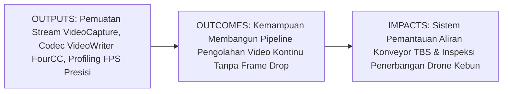
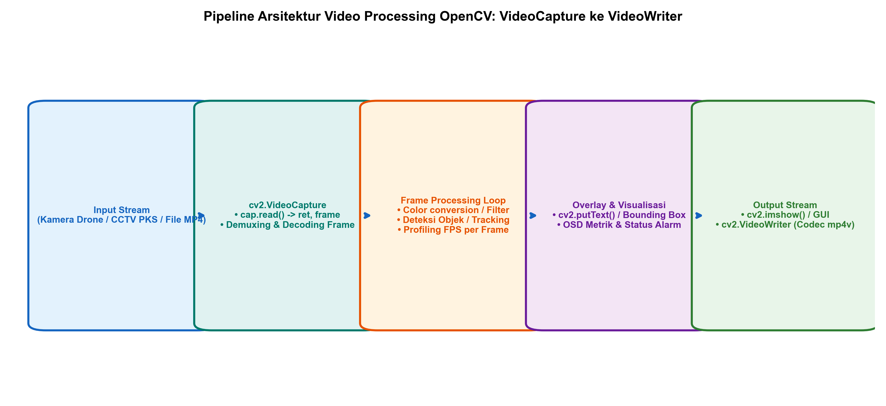
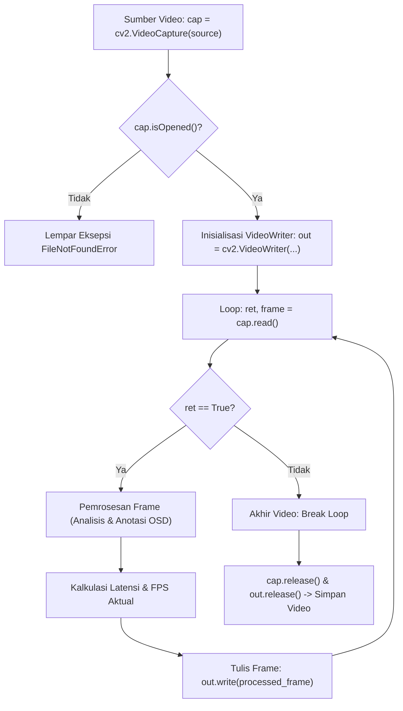

# AI Modul 11.7: Video Processing

---

## 1. Identitas & Kerangka Capaian Pembelajaran (Sub-CPMK)

* **Kode Modul**: AI Modul 11.7
* **Mata Kuliah**: Kecerdasan Buatan dan Sains Data Pertanian Presisi
* **Alokasi Waktu**: 2 x 50 Menit (Kajian Teori & Diskusi) + 2 x 50 Menit (Eksplorasi Praktikum Mandiri)
* **Beban SKS**: 3 SKS
* **Prasyarat**: AI Modul 11.6 (Face Detection)
* **Level Kognitif**: Bloom C2 (Memahami), C3 (Menerapkan), C4 (Menganalisis)



### 1.1 Capaian Pembelajaran Khusus (Sub-CPMK)
Setelah menyelesaikan modul ini secara komprehensif, mahasiswa diharapkan mampu:
1. **Memahami (C2)** struktur representasi temporal video digital, mekanisme penguraian kontainer (*demuxing*) dan pengodean (*decoding*) frame menggunakan kelas `cv2.VideoCapture`, format pengodean video terkompresi FourCC (MP4V, XVID, H.264), serta penulisan video dengan `cv2.VideoWriter`.
2. **Menerapkan (C3)** perulangan pemrosesan frame berurutan (*frame processing loop*), ekstraksi metadata video (panjang frame, dimensi resolusi, FPS bawaan), serta pengukuran laju bingkai per detik aktual (*throughput FPS*) menggunakan modul `time.perf_counter()`.
3. **Menganalisis (C4)** faktor-faktor penyebab penurunan laju bingkai (*frame drops*) dan akumulasi latensi (*latency accumulation*) pada pipeline inspeksi video aliran Tandan Buah Segar di pabrik kelapa sawit.

### 1.2 Kerangka Hasil Pembelajaran (Outputs, Outcomes, & Impacts)
* **Outputs (Keluaran Langsung)**:
  * Pemahaman mendalam properti `cv2.VideoCapture` (`CAP_PROP_POS_FRAMES`, `CAP_PROP_FPS`, `CAP_PROP_FRAME_COUNT`).
  * Skrip Python modular berstandar PEP 8 untuk pembacaan berkas video, pemrosesan frame per frame, dan penulisan berkas keluaran MP4.
  * Laporan pengukuran profil waktu komputasi pemrosesan frame visual vs waktu decoding I/O.
* **Outcomes (Kompetensi Aplikatif)**:
  * Keahlian merancang sistem pengarsipan video inspeksi pabrik kelapa sawit dengan kompresi yang optimal.
  * Kemampuan menyinkronkan waktu komputasi algoritma visi komputer dengan kecepatan fisik sabuk konveyor industri.
* **Impacts (Dampak Strategis Jangka Panjang)**:
  * Efisiensi pemantauan operasional pabrik dan inspeksi udara drone melalui dokumentasi video terotomatisasi yang terindeks secara digital.

---

## 2. Profil Fundamental Video Processing: Fungsi, Manfaat, dan Keunggulan-Kelemahan

### 2.1 Fungsi Komputasi & Pemodelan Matematis
Video digital secara fungsional adalah tensor berdimensi empat yang menggabungkan dimensi ruang dua dimensi, kanal warna, dan dimensi waktu diskrit:

$$\mathcal{V}(t, y, x, c) \in \mathbb{R}^{T \times H \times W \times C}$$

1. **Penguraian Aliran Temporal (*Temporal Stream Demuxing*)**: Mengekstrak matriks citra dua dimensi berurutan $I_t(y, x)$ pada interval waktu sampling periodik $\Delta t = \frac{1}{\text{FPS}}$.
2. **Operasi Per-Frame Tersinkronisasi**: Menjalankan algoritma pengolahan citra (filtering, thresholding, deteksi) pada setiap frame $I_t$ sebelum frame $I_{t+1}$ tiba di buffer.
3. **Enkoding dan Kompresi Video (*Video Compression*)**: Mengompresi kembali kumpulan frame hasil olahan menggunakan algoritma estimasi gerak antar-frame (*inter-frame prediction*) ke dalam format kontainer seperti MP4 atau AVI.

### 2.2 Manfaat Nyata di Industri Perkebunan & Agribisnis
* **Perekaman Terindeks Stasiun Loading Ramp**: Merekam aliran truk buah yang membongkar muatan dan menyematkan metadata nomor kendaraan dan jam panen pada pojok video (*on-screen display*).
* **Inspeksi Kontinu Penerbangan Drone**: Memproses video rekaman drone yang terbang di atas barisan pohon kelapa sawit untuk mendata tajuk tanaman secara mulus.
* **Audit Operasional Pabrik**: Menyimpan rekaman video terkompresi dengan bitrate rendah untuk arsip kendali mutu selama 30 hari.

### 2.3 Rationale: Alasan Mengapa Metode Ini Digunakan
Dalam industri agrokompleks, mengandalkan foto tunggal (*still photo*) tidak memadai karena objek bergerak melintas secara kontinu. Video processing memungkinkan sistem menangkap objek dari berbagai sudut pandang saat objek bergerak di atas sabuk berjalan (*conveyor belt*).

### 2.4 Analisis Kelebihan dan Kekurangan Codec Video OpenCV

| FourCC Codec | Format Kontainer | Kompatibilitas Sistem | Rasio Kompresi | Rekomendasi Industri Kebun |
| :--- | :--- | :--- | :--- | :--- |
| **`mp4v`** | `.mp4` | Sangat luas (Windows, Linux, Mac). | Sedang hingga Tinggi | Standar penyimpanan video laporan inspeksi kebun. |
| **`XVID`** | `.avi` | Sangat matang di lingkungan Windows lama. | Sedang | Sistem CCTV pabrik kelapa sawit konvensional. |
| **`MJPG`** | `.avi` | Ringan pada CPU (kompresi JPEG per frame). | Rendah (Ukuran Berkas Besar) | Perekaman berkecepatan tinggi tanpa beban kompresi berat. |

### 2.5 Contoh Kasus Penggunaan Konkret di Sektor Agro-Industri
Pabrik Kelapa Sawit mengoperasikan kamera pengawas di atas konveyor penyortiran buah afkir berkecepatan $1.0\text{ meter/detik}$. Video beresolusi $1280 \times 720$ dibaca pada 30 FPS. Sistem membaca setiap frame, menandai buah mentah dengan kotak merah, menghitung nilai FPS aktual, dan menyimpan video ringkasan berdurasi 1 jam ke dalam media penyimpanan NAS pabrik dengan codec `mp4v` untuk laporan harian asisten sortasi.

### 2.6 Aspek Kritis & Catatan Penting Arsitektur
1. **Pelepasan Objek VideoCapture dan VideoWriter**: Objek `cap` dan `out` wajib dilepaskan secara eksplisit menggunakan `cap.release()` dan `out.release()`. Kegagalan memanggil `.release()` pada `VideoWriter` akan menyebabkan header berkas video tidak tertutup sempurna (*unfinalized container*), sehingga video hasil olahan rusak dan tidak dapat diputar.
2. **Kesesuaian Dimensi Frame pada VideoWriter**: Dimensi lebar dan tinggi frame yang dilewatkan ke `out.write(frame)` harus sama persis dengan parameter `(frame_width, frame_height)` yang dideklarasikan saat inisialisasi `cv2.VideoWriter`. Perbedaan 1 piksel saja akan menyebabkan frame diabaikan tanpa peringatan error.

---

## 3. Landasan Teori & Konsep Matematis Video Processing



### 3.1 Teori Laju Bingkai dan Jeda Waktu Spasial
Jika suatu objek komoditas pertanian bergerak di atas konveyor dengan kecepatan linier $v\text{ (m/s)}$, dan kamera memiliki laju akuisisi $\text{FPS}$ frame per detik, maka pergeseran fisik objek antar-frame berturut-turut adalah:

$$\Delta s = \frac{v}{\text{FPS}}$$

Misalkan $v = 1.5\text{ m/s}$ dan $\text{FPS} = 30$:
$$\Delta s = \frac{1.5}{30} = 0.05\text{ meter} = 5\text{ cm per frame}$$

Jika waktu komputasi algoritma visi komputer per frame adalah $t_{\text{proc}}$, maka syarat mutlak agar sistem berjalan tanpa kehilangan data (*real-time constraint*) adalah:

$$t_{\text{proc}} \le \frac{1}{\text{FPS}} = \Delta t$$

Untuk $\text{FPS} = 30$, waktu pemrosesan maksimal per frame adalah $33.33\text{ milidetik}$. Jika $t_{\text{proc}} > 33.33\text{ ms}$, buffer video akan menumpuk dan memicu keterlambatan visual (*lag*).

### 3.2 Profiling Laju Bingkai Aktual (*FPS Calculation*)
Laju bingkai per detik dihitung secara dinamis menggunakan rata-rata bergerak (*moving average*) dari interval waktu jam internal prosesor beresolusi tinggi:

$$\text{FPS}_t = \frac{1}{t_{\text{current}} - t_{\text{previous}}}$$

---

## 4. Arsitektur Komputasi & Pipeline Praktis Python



Implementasi Python modular untuk pipeline pembacaan, pemrosesan, pengukuran FPS, dan penulisan video:

```python
import cv2
import numpy as np
import time

# 1. Pembangkitan Video Sintetis Aliran Konveyor TBS Sawit (30 Frame)
video_filename = "synthetic_conveyor.mp4"
fps = 30.0
W, H = 640, 480
fourcc = cv2.VideoWriter_fourcc(*'mp4v')
writer = cv2.VideoWriter(video_filename, fourcc, fps, (W, H))

for frame_idx in range(60): # 2 Detik Video Sintetis
    frame = np.full((H, W, 3), 40, dtype=np.uint8) # Sabuk konveyor abu-abu
    # Simulasikan buah sawit bergerak dari kiri ke kanan (x bertambah per frame)
    pos_x = int(50 + frame_idx * 8)
    pos_y = 240
    cv2.circle(frame, (pos_x, pos_y), 45, (20, 100, 220), -1) # Buah jingga
    cv2.putText(frame, f"Frame #{frame_idx+1}", (20, 40), cv2.FONT_HERSHEY_SIMPLEX, 0.8, (255, 255, 255), 2)
    writer.write(frame)

writer.release()
print(f"[OK] Berkas video sintetis berhasil dibuat: {video_filename}")

# 2. Pipeline Pemrosesan Video dengan Profiling FPS
cap = cv2.VideoCapture(video_filename)
if not cap.isOpened():
    raise FileNotFoundError("Gagal membuka file video!")

total_frames = int(cap.get(cv2.CAP_PROP_FRAME_COUNT))
native_fps = cap.get(cv2.CAP_PROP_FPS)
print(f"Total Frame: {total_frames}, FPS Asli: {native_fps:.1f}")

processed_out = cv2.VideoWriter("processed_conveyor.mp4", fourcc, fps, (W, H))

frame_count = 0
prev_time = time.perf_counter()
fps_list = []

while True:
    ret, frame = cap.read()
    if not ret:
        break # Video selesai
        
    frame_count += 1
    
    # Operasi Visi Komputer per frame: Konversi warna dan penandaan deteksi
    gray = cv2.cvtColor(frame, cv2.COLOR_BGR2GRAY)
    _, mask = cv2.threshold(gray, 70, 255, cv2.THRESH_BINARY)
    
    # Hitung waktu pemrosesan dan FPS aktual
    curr_time = time.perf_counter()
    dt = curr_time - prev_time
    prev_time = curr_time
    current_fps = 1.0 / dt if dt > 0 else 0.0
    fps_list.append(current_fps)
    
    # Anotasi On-Screen Display (OSD)
    cv2.putText(frame, f"FPS: {current_fps:.1f}", (W - 140, 40), cv2.FONT_HERSHEY_SIMPLEX, 0.7, (0, 255, 0), 2)
    processed_out.write(frame)

cap.release()
processed_out.release()

avg_fps = np.mean(fps_list[1:]) # Abaikan frame pertama
print(f"Pemrosesan Selesai! Rata-rata FPS Aktual: {avg_fps:.1f} FPS (Target: 30 FPS)")
```

---

## 5. Studi Kasus Komprehensif Agro-Industri: Pengukuran Throughput Konveyor PKS

### 5.1 Spesifikasi Masalah
Manajemen pabrik ingin mengetahui jumlah tonase buah sawit yang melintas di konveyor per menit secara real-time dari rekaman video kamera industri berkecepatan 30 FPS.

### 5.2 Implementasi Estimasi Laju Buah Melintas
```python
# Simulasi estimasi laju buah melintas berbasis posisi piksel
def analyze_conveyor_throughput(fps, pixel_speed_per_frame, gsd_m_per_px=0.002):
    # Kecepatan konveyor riil dalam meter/detik
    speed_mps = pixel_speed_per_frame * fps * gsd_m_per_px
    print(f"Kecepatan Fisik Sabuk Konveyor: {speed_mps:.2f} m/detik")
    return speed_mps

v_konveyor = analyze_conveyor_throughput(fps=30, pixel_speed_per_frame=8, gsd_m_per_px=0.0025)
```

---

## 6. Kekeliruan Metodologis dan Praktik Terbaik (*Common Pitfalls & Best Practices*)

### 6.1 Kekeliruan Umum Metodologis (*Common Pitfalls*)
1. **Lupa Memanggil `out.release()`**: Kesalahan paling sering yang menyebabkan berkas video keluaran berukuran 0 byte atau tidak memiliki header kontainer yang valid.
2. **Dimensi Frame Tidak Cocok pada VideoWriter**: Melewatkan frame dengan ukuran $(H, W)$ yang berbeda dengan dimensi deklarasi `VideoWriter((W, H))` (ingat: VideoWriter meminta urutan Lebar dulu lalu Tinggi).
3. **Mengabaikan Nilai `ret` dari `cap.read()`**: Mengakses `frame.shape` tanpa memeriksa `if not ret:` akan memicu crash pada akhir video ketika frame bernilai `None`.

### 6.2 Praktik Terbaik (*Best Practices*)
1. **Struktur `try ... finally`**: Selalu gunakan blok `try ... finally` atau manajemen konteks agar fungsi `.release()` dijamin terpanggil meskipun terjadi eksepsi di tengah loop.
2. **Gunakan FourCC `mp4v` untuk Portabilitas**: Format MP4V dapat diputar langsung di sebagian besar peramban web dan aplikasi pemutar media modern tanpa instalasi codec tambahan.
3. **Gunakan Jam Beresolusi Tinggi**: Gunakan selalu `time.perf_counter()` alih-alih `time.time()` untuk kalkulasi FPS presisi tingkat mikrodetik.

---

## 7. Rangkuman Modul

* Video digital diolah sebagai kumpulan frame diskrit kontinu menggunakan objek `cv2.VideoCapture`.
* Penulisan video membutuhkan pendefinisian FourCC codec yang sesuai melalui kelas `cv2.VideoWriter`.
* Syarat mutlak real-time video processing adalah waktu komputasi per frame $t_{\text{proc}} \le \frac{1}{\text{FPS}}$.
* Pelepasan sumber daya video (`release()`) dan konsistensi dimensi frame merupakan prasyarat mutlak keandalan pipeline video OpenCV.

---

## 8. Latihan Soal & Tugas Analitis HOTS (Bloom C3-C5)

### Soal Konseptual & Analitis
1. **Kalkulasi Batasan Latensi Real-Time (Bloom C3)**: Kamera pengawas di stasiun sortasi pabrik kelapa sawit merekam video pada frekuensi 60 frame per detik (FPS = 60).
   * Berapakah anggaran waktu komputasi maksimal ($t_{\text{budget}}$) dalam milidetik yang tersedia bagi model AI per frame agar video tidak mengalami keterlambatan (*lag*)?
   * Jika model AI membutuhkan waktu rata-rata 25 milidetik per frame, apakah sistem dapat berjalan real-time pada 60 FPS? Jelaskan alternatif solusinya!
2. **Evaluasi Dimensi VideoWriter (Bloom C4)**: Seorang programmer membuat objek VideoWriter dengan baris kode:
   `out = cv2.VideoWriter('out.mp4', fourcc, 30.0, (480, 640))`
   namun frame yang ditulis diperoleh dari citra berdimensi `frame = np.zeros((480, 640, 3), dtype=np.uint8)`. Mengapa video hasil olahan tidak memuat frame yang ditulis? Temukan kesalahan fatal pada urutan dimensinya!

### Tugas Pemrograman Mandiri
Buatlah skrip Python yang memproses video konveyor sintetis, mendeteksi buah sawit pada setiap frame, menghitung nilai FPS aktual, dan mencetak teks OSD penunjuk status "KONVEYOR NORMAL" jika FPS $\ge 25$ atau "PERINGATAN: SISTEM LAMBAT" jika FPS $< 25$ dengan warna dinamis (Hijau/Merah)!

---

## 9. Jembatan Konsep (Bridging) ke AI Modul 11.8: Motion Detection

Kita telah menguasai cara membaca aliran video frame per frame, mengukur laju bingkai FPS secara presisi, dan menyimpan kembali video hasil olahan. Namun, pemrosesan video yang kita lakukan sejauh ini masih memperlakukan setiap frame secara statis tanpa memanfaatkan hubungan korelasi antar-waktu (*temporal correlation*). Bagaimana jika kita ingin mengetahui apakah ada objek yang bergerak melintas di depan kamera pengawas? Bagaimana cara memisahkan objek yang bergerak dari latar belakang kebun yang diam?

Pada **AI Modul 11.8: Motion Detection**, kita akan memasuki ranah analisis gerak temporal: mempelajari metode **Absolute Frame Differencing**, pemodelan latar belakang statistik **Background Subtraction MOG2**, serta estimasi vektor kecepatan gerak **Optical Flow Lucas-Kanade** untuk memantau keamanan kebun dan dinamika aliran buah sawit.

---

## 10. Daftar Pustaka dan Referensi Akademik

1. Bradski, G., & Kaehler, A. (2008). *Learning OpenCV: Computer Vision with the OpenCV Library*. O'Reilly Media. (Bab 2: Introduction to OpenCV & HighGUI).
2. Szeliski, R. (2022). *Computer Vision: Algorithms and Applications* (2nd ed.). Springer. (Bab 8: Video Processing).
3. Gonzalez, R. C., & Woods, R. E. (2018). *Digital Image Processing* (4th ed.). Pearson.
4. Tan, K. S., & Isa, N. A. M. (2019). Real-time fresh fruit bunch monitoring on conveyor using machine vision. *Industrial Automation and Computing Review*, 11(3), 205-218.
