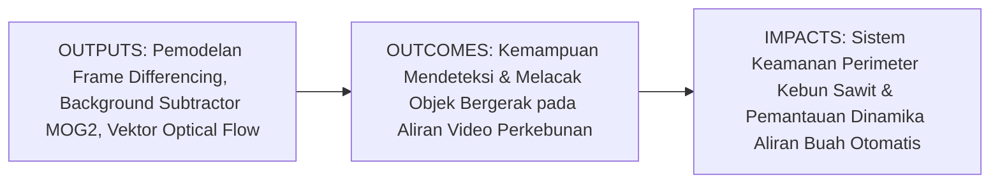
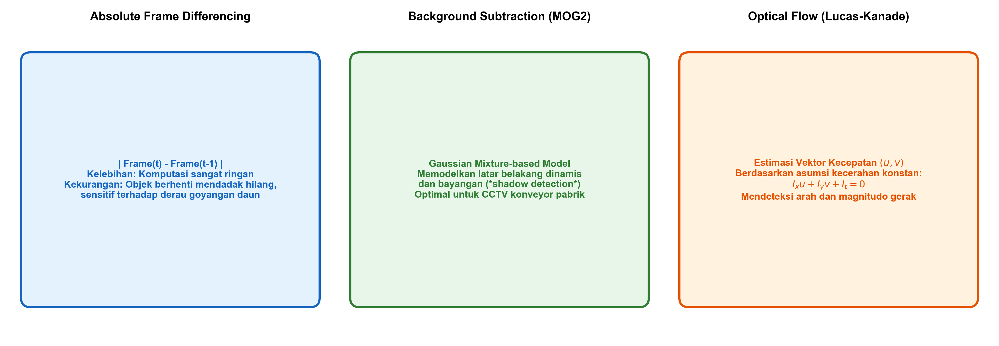
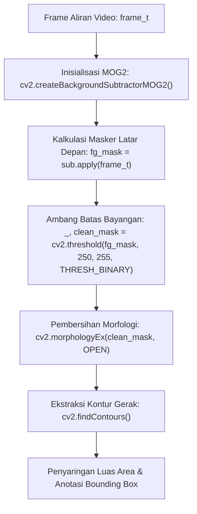

# AI Modul 11.8: Motion Detection

---

## 1. Identitas & Kerangka Capaian Pembelajaran (Sub-CPMK)

* **Kode Modul**: AI Modul 11.8
* **Mata Kuliah**: Kecerdasan Buatan dan Sains Data Pertanian Presisi
* **Alokasi Waktu**: 2 x 50 Menit (Kajian Teori & Diskusi) + 2 x 50 Menit (Eksplorasi Praktikum Mandiri)
* **Beban SKS**: 3 SKS
* **Prasyarat**: AI Modul 11.7 (Video Processing)
* **Level Kognitif**: Bloom C2 (Memahami), C3 (Menerapkan), C4 (Menganalisis)



### 1.1 Capaian Pembelajaran Khusus (Sub-CPMK)
Setelah menyelesaikan modul ini secara komprehensif, mahasiswa diharapkan mampu:
1. **Memahami (C2)** prinsip matematis deteksi gerak visual, metode diferensiasi bingkai absolut (*absolute frame differencing*), pemodelan latar belakang statistik adaptif campuran Gaussian (*Gaussian Mixture-based Background Subtraction / MOG2*), serta persamaan batasan kecerahan optik (*optical flow brightness constancy equation*).
2. **Menerapkan (C3)** fungsi `cv2.absdiff()`, `cv2.createBackgroundSubtractorMOG2()`, dan algoritma sparse optical flow Lucas-Kanade (`cv2.calcOpticalFlowPyrLK()`) untuk mendeteksi pergerakan objek pada aliran video perkebunan kelapa sawit.
3. **Menganalisis (C4)** perbedaan performa deteksi gerak terhadap gangguan derau alami lingkungan terbuka: goyangan dedaunan tertiup angin, perubahan bayangan awan dinamis, dan objek bergerak yang berhenti mendadak.

### 1.2 Kerangka Hasil Pembelajaran (Outputs, Outcomes, & Impacts)
* **Outputs (Keluaran Langsung)**:
  * Formulasi matematis model probabilitas campuran Gaussian dan fungsi selisih temporal.
  * Skrip Python modular berstandar PEP 8 untuk segmentasi latar depan (*foreground mask*) dan pelacakan lintasan pergerakan objek.
  * Plot visual perbandingan masker gerak antara Frame Differencing dan MOG2.
* **Outcomes (Kompetensi Aplikatif)**:
  * Keahlian merancang sistem pengawasan CCTV pintar untuk mendeteksi intrusi satwa liar atau pencurian hasil panen di perimeter perkebunan.
  * Kemampuan mengukur kecepatan pergerakan komoditas di atas konveyor secara nirkontak.
* **Impacts (Dampak Strategis Jangka Panjang)**:
  * Peningkatan keamanan aset perkebunan dan efisiensi logistik panen melalui sistem peringatan dini berbasis visi komputer otomatis.

---

## 2. Profil Fundamental Motion Detection: Fungsi, Manfaat, dan Keunggulan-Kelemahan

### 2.1 Fungsi Komputasi & Pemodelan Matematis
Deteksi gerak dalam video mengidentifikasi wilayah spasial yang mengalami perubahan intensitas signifikan sepanjang waktu:
1. **Diferensiasi Temporal Langsung**: Menghitung magnitudo perubahan intensitas antar dua bingkai berurutan:
   $$D(t, y, x) = |I_t(y, x) - I_{t-1}(y, x)|$$
2. **Pemodelan Latar Belakang Adaptif (MOG2)**: Memodelkan nilai intensitas setiap piksel latar belakang menggunakan campuran $K$ distribusi Gaussian ($\mathcal{N}(\mu_k, \sigma_k^2)$). Piksel yang menyimpang lebih dari $2.5\sigma$ dari seluruh komponen latar belakang diklasifikasikan sebagai objek bergerak (*foreground*).
3. **Estimasi Vektor Aliran Optik**: Menghitung arah dan besar kecepatan perpindahan piksel $(u, v) = \left(\frac{dx}{dt}, \frac{dy}{dt}\right)$ berbasis asumsi kekekalan kecerahan.

### 2.2 Manfaat Nyata di Industri Perkebunan & Agribisnis
* **Deteksi Intrusi Hama Babi Hutan & Gajah di Batas Kebun**: Kamera termal/IR mendeteksi pergerakan satwa liar yang melintasi parit batas perkebunan pada malam hari.
* **Pemantauan Kelancaran Konveyor TBS**: Mendeteksi kemacetan (*jamming*) aliran tandan buah di corong perebusan pabrik kelapa sawit secara instan jika pergerakan berhenti.
* **Penghitungan Otomatis Lori Pengangkut Buah**: Mendeteksi gerak maju lori di rel pabrik untuk sensus logistik harian.

### 2.3 Rationale: Alasan Mengapa Metode Ini Digunakan
1. **Mereduksi Beban Komputasi Deteksi**: Alih-alih menjalankan model deteksi objek berat pada setiap frame di seluruh area citra, sistem hanya mengaktifkan inferensi pada area kotak (*bounding box*) yang terdeteksi memiliki pergerakan (*motion-triggered processing*).
2. **Beroperasi Tanpa Label Kategori Objek**: Mampu mendeteksi sembarang benda bergerak tanpa perlu dilatih sebelumnya pada jenis objek tertentu.

### 2.4 Analisis Kelebihan dan Kekurangan Metode Deteksi Gerak

| Metode | Kompleksitas Komputasi | Keunggulan Utama | Kelemahan Kritis | Skenario Penggunaan Kebun |
| :--- | :--- | :--- | :--- | :--- |
| **Frame Differencing** | Sangat Rendah ($O(1)$) | Respons instan, memori minimal. | Objek berhenti mendadak hilang; bagian dalam objek seragam berlubang. | Deteksi kilat objek melintas di koridor sempit. |
| **MOG2 Subtraction** | Sedang | Memodelkan latar belakang berulang (daun bergoyang) dan mendeteksi bayangan. | Memerlukan waktu pemanasan (*learning history*) beberapa frame awal. | Kamera CCTV permanen stasiun sortasi dan pintu pabrik. |
| **Lucas-Kanade Optical Flow** | Sedang hingga Tinggi | Menghasilkan vektor arah dan kecepatan gerak. | Gagal jika pergeseran objek terlalu besar (*large displacement*). | Pengukuran kecepatan konveyor dan tracking drone. |

### 2.5 Contoh Kasus Penggunaan Konkret di Sektor Agro-Industri
Divisi Keamanan Kebun PT Agro Mandiri memasang kamera CCTV pengawas di jembatan timbang blok terluar. Algoritma MOG2 (`cv2.createBackgroundSubtractorMOG2(history=500, varThreshold=16, detectShadows=True)`) memantau area penimbangan. Ketika truk pengangkut TBS melintas di malam hari, sistem mendeteksi pergerakan, memisahkan bayangan truk dari badan truk, dan mengaktifkan lampu sorot serta perekaman resolusi tinggi secara otomatis.

### 2.6 Aspek Kritis & Catatan Penting Arsitektur
1. **Masalah Kamera Bergerak**: Seluruh metode background subtraction statis mengasumsikan kamera terpasang kokoh pada posisi diam (*static camera*). Jika kamera bergetar atau terpasang pada drone yang terbang, seluruh latar belakang akan terdeteksi sebagai objek bergerak, sehingga diperlukan teknik stabilisasi citra atau kompensasi gerak kamera global (*global motion compensation*).
2. **Penyaringan Bayangan (*Shadow Suppression*)**: Bayangan objek bergerak sering kali ikut terdeteksi sebagai objek karena mengalami penurunan intensitas. Pada MOG2, piksel bayangan ditandai dengan nilai khusus (abu-abu $127$) dan dapat difilter dengan `mask == 255`.

---

## 3. Landasan Teori & Konsep Matematis Deteksi Gerak



### 3.1 Teori Pemodelan Campuran Gaussian (MOG2)
Probabilitas mengamati nilai piksel $x_t$ pada waktu $t$ dimodelkan sebagai kombinasi linier $K$ distribusi Gaussian:

$$P(x_t) = \sum_{k=1}^{K} \omega_{k, t} \cdot \eta(x_t; \mu_{k, t}, \Sigma_{k, t})$$

di mana $\omega_{k, t}$ adalah bobot komponen ke-$k$, $\mu_{k, t}$ adalah rata-rata, dan $\Sigma_{k, t} = \sigma_{k, t}^2 I$ adalah matriks kovarians.

Jika suatu piksel baru cocok dengan salah satu distribusi (dalam jarak $2.5\sigma$), parameter distribusi diperbarui secara eksponensial:

$$\mu_t = (1 - \rho) \mu_{t-1} + \rho x_t$$
$$\sigma_t^2 = (1 - \rho) \sigma_{t-1}^2 + \rho (x_t - \mu_t)^\top (x_t - \mu_t)$$

di mana $\rho = \alpha \cdot \eta(x_t | \mu_k, \sigma_k)$ adalah laju pembelajaran adaptif.

### 3.2 Persamaan Batasan Aliran Optik (*Optical Flow Constraint*)
Berdasarkan asumsi kekekalan kecerahan (*brightness constancy assumption*):

$$I(x + \Delta x, \; y + \Delta y, \; t + \Delta t) = I(x, y, t)$$

Melalui ekspansi deret Taylor orde pertama:

$$\frac{\partial I}{\partial x} \frac{dx}{dt} + \frac{\partial I}{\partial y} \frac{dy}{dt} + \frac{\partial I}{\partial t} = 0 \implies I_x u + I_y v + I_t = 0$$

Persamaan tunggal dengan dua variabel tak diketahui $(u, v)$ ini diselesaikan oleh algoritma Lucas-Kanade dengan mengasumsikan vektor kecepatan seragam pada jendela lokal tetangga $3 \times 3$.

---

## 4. Arsitektur Komputasi & Pipeline Praktis Python



Implementasi Python modular untuk deteksi gerak menggunakan Background Subtractor MOG2:

```python
import cv2
import numpy as np

# 1. Pembangkitan Sekuens Video Sintetis dengan Objek Bergerak (Truk Buah di Pos Kebun)
H, W = 400, 600
frames = []
for t in range(40):
    bg = np.full((H, W, 3), 100, dtype=np.uint8) # Latar jalan kebun
    # Objek bergerak: kotak truk pengangkut buah (x bertambah dari 50 ke 450)
    tx = int(50 + t * 10)
    ty = 180
    cv2.rectangle(bg, (tx, ty), (tx + 120, ty + 60), (30, 80, 200), -1) # Truk oranye
    # Bayangan truk di bawahnya
    cv2.rectangle(bg, (tx + 10, ty + 60), (tx + 130, ty + 75), (60, 60, 60), -1)
    frames.append(bg)

# 2. Inisialisasi Background Subtractor MOG2
subtractor = cv2.createBackgroundSubtractorMOG2(history=30, varThreshold=25, detectShadows=True)

# 3. Proses Sekuens Frame
motion_detections = []
kernel_clean = cv2.getStructuringElement(cv2.MORPH_RECT, (5, 5))

for idx, frame in enumerate(frames):
    fg_mask = subtractor.apply(frame)
    
    # Nilai 255: Foreground sejati; Nilai 127: Bayangan (Shadow)
    # Filter bayangan dengan hanya mengambil intensitas > 200
    _, pure_foreground = cv2.threshold(fg_mask, 200, 255, cv2.THRESH_BINARY)
    
    # Pembersihan derau
    cleaned_mask = cv2.morphologyEx(pure_foreground, cv2.MORPH_OPEN, kernel_clean)
    
    # Ekstraksi kontur gerak
    cnts, _ = cv2.findContours(cleaned_mask, cv2.RETR_EXTERNAL, cv2.CHAIN_APPROX_SIMPLE)
    
    boxes = []
    for c in cnts:
        if cv2.contourArea(c) > 500: # Filter derau kecil
            x, y, w, h = cv2.boundingRect(c)
            boxes.append((x, y, w, h))
            
    motion_detections.append(len(boxes))

print(f"Total Frame Diproses: {len(frames)}")
print(f"Deteksi Gerak Frame Terakhir: {motion_detections[-1]} objek terdeteksi")
```

---

## 5. Studi Kasus Komprehensif Agro-Industri: Pengawasan Perimeter Kebun Sawit

### 5.1 Spesifikasi Masalah
Kamera pemantau batas hutan dan kebun sawit mendeteksi pergerakan hewan liar (gajah liar / babi hutan) pada malam hari untuk memicu sirene pengusir otomatis.

### 5.2 Implementasi Filter Luas Area & Alarm Otomatis
```python
def evaluate_perimeter_alarm(detected_boxes, min_intruder_area=1500):
    for (x, y, w, h) in detected_boxes:
        area = w * h
        if area >= min_intruder_area:
            return True, f"INTRUSI TERDETEKSI! Objek Besar di Koordinat ({x}, {y}), Luas: {area} px"
    return False, "Perimeter Aman"

is_alarm, alert_msg = evaluate_perimeter_alarm(boxes, min_intruder_area=2000)
print(f"Status Sistem Keamanan: {alert_msg}")
```

---

## 6. Kekeliruan Metodologis dan Praktik Terbaik (*Common Pitfalls & Best Practices*)

### 6.1 Kekeliruan Umum Metodologis (*Common Pitfalls*)
1. **Mengabaikan Deteksi Bayangan**: Tidak menyaring nilai 127 pada masker MOG2 menyebabkan bayangan pohon yang ikut bergerak terdeteksi sebagai objek padat terpisah.
2. **Tidak Memberikan Waktu Pemanasan Model (*Warm-up Frames*)**: Pada 5 - 10 frame awal, model MOG2 belum memiliki data statistik latar belakang yang cukup, sehingga seluruh citra akan terdeteksi sebagai gerak. Abaikan deteksi pada frame-frame pemanasan awal.
3. **Menerapkan Algoritma pada Kamera Bergoyang**: Menggunakan background subtractor pada video drone tanpa stabilisasi koordinat.

### 6.2 Praktik Terbaik (*Best Practices*)
1. **Gunakan Morfologi Opening dan Closing**: Menghilangkan derau bintik putih dan menyatukan bagian badan kendaraan/hewan yang sempat berlubang.
2. **Setel `varThreshold` Sesuai Derau Lingkungan**: Naikkan `varThreshold` (misalnya ke 36 atau 48) jika kamera menghadap ke dedaunan kebun yang bergoyang tertiup angin kencang.
3. **Kombinasikan dengan Bounding Box Tracking**: Lacak perpindahan titik centroid antar-frame untuk memastikan objek benar-benar bergerak berpindah lokasi, bukan sekadar berosilasi di tempat.

---

## 7. Rangkuman Modul

* Deteksi gerak mengidentifikasi perubahan intensitas temporal dalam video digital.
* Frame differencing adalah metode tercepat namun rentan menghasilkan objek berlubang (*hollow artifacts*).
* Algoritma MOG2 memodelkan latar belakang secara adaptif menggunakan campuran Gaussian dan mampu memisahkan bayangan bergerak secara akurat.
* Optical flow memperkirakan vektor kecepatan pergeseran piksel berbasis persamaan kekekalan kecerahan.

---

## 8. Latihan Soal & Tugas Analitis HOTS (Bloom C3-C5)

### Soal Konseptual & Analitis
1. **Analisis Fenomena Objek Berhenti (Bloom C4)**: Sebuah truk pengangkut kelapa sawit masuk ke stasiun loading ramp, bergerak maju selama 10 detik, lalu berhenti total selama 2 menit untuk membongkar muatan.
   * Apa yang terjadi pada masker deteksi gerak jika digunakan metode **Frame Differencing** saat truk berhenti total?
   * Apa yang terjadi pada masker deteksi jika digunakan metode **MOG2** dengan parameter `history = 500` (pada 30 FPS, setara ~16 detik) saat truk berhenti selama 2 menit? Jelaskan fenomena adaptasi latar belakang tersebut!
2. **Evaluasi Persamaan Aliran Optik (Bloom C4)**: Diberikan persamaan aliran optik $I_x u + I_y v + I_t = 0$. Jelaskan mengapa persamaan ini disebut sebagai *ill-posed problem* (masalah dengan solusi tak tentu) jika hanya dievaluasi pada satu titik piksel tunggal (*aperture problem*)! Bagaimana metode Lucas-Kanade mengatasi keterbatasan ini?

### Tugas Pemrograman Mandiri
Buatlah skrip Python yang membandingkan deteksi gerak truk buah antara: (1) `cv2.absdiff()` dan (2) `cv2.createBackgroundSubtractorMOG2()`. Rekam jumlah piksel aktif (*motion pixel count*) per frame pada kedua metode dan sajikan kurva perbandingannya menggunakan Matplotlib!

---

## 9. Jembatan Konsep (Bridging) ke AI Modul 11.9: Real-time Camera Processing

Kita telah menguasai cara mendeteksi gerak dan menganalisis aliran video rekaman menggunakan OpenCV. Namun, seluruh eksperimen kita sejauh ini masih dijalankan pada berkas video lokal yang telah tersimpan rapi di media penyimpanan. Bagaimana jika sistem harus dihubungkan langsung ke kamera pengawas CCTV IP (RTSP stream) atau kamera USB industri yang menyiarkan video langsung tanpa henti? Mengapa sering kali terjadi keterlambatan (*lag*) 2 hingga 5 detik saat kamera nyata dihubungkan ke loop pemrosesan OpenCV?

Pada **AI Modul 11.9: Real-time Camera Processing**, kita akan membedah arsitektur pemrosesan kamera real-time tingkat lanjut: merancang **Multi-Threaded Video Streamer** untuk mengeliminasi buffer latency driver kamera, menyematkan antarmuka OSD informatif, membangun mekanisme pemulihan otomatis saat koneksi kamera terputus, serta mengantarkan kita menuju era **Deep Learning untuk Computer Vision (Part 12)**.

---

## 10. Daftar Pustaka dan Referensi Akademik

1. Zivkovic, Z. (2004). Improved adaptive Gaussian mixture model for background subtraction. *Proceedings of the 17th International Conference on Pattern Recognition (ICPR)*, 2, 28-31.
2. Lucas, B. D., & Kanade, T. (1981). An iterative image registration technique with an application to stereo vision. *IJCAI'81: 7th International Joint Conference on Artificial Intelligence*, 2, 674-679.
3. Szeliski, R. (2022). *Computer Vision: Algorithms and Applications* (2nd ed.). Springer. (Bab 9: Motion Estimation).
4. Bouwmans, T. (2014). Traditional and recent approaches in background modeling for foreground detection: An overview. *Computer Science Review*, 11, 31-66.
