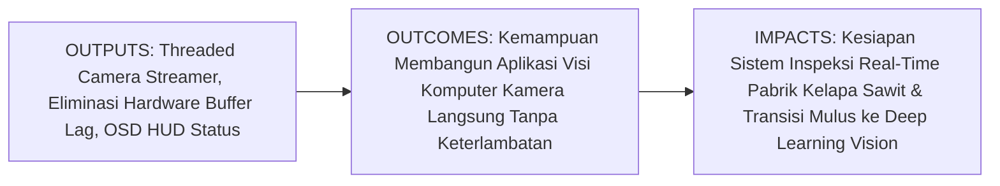
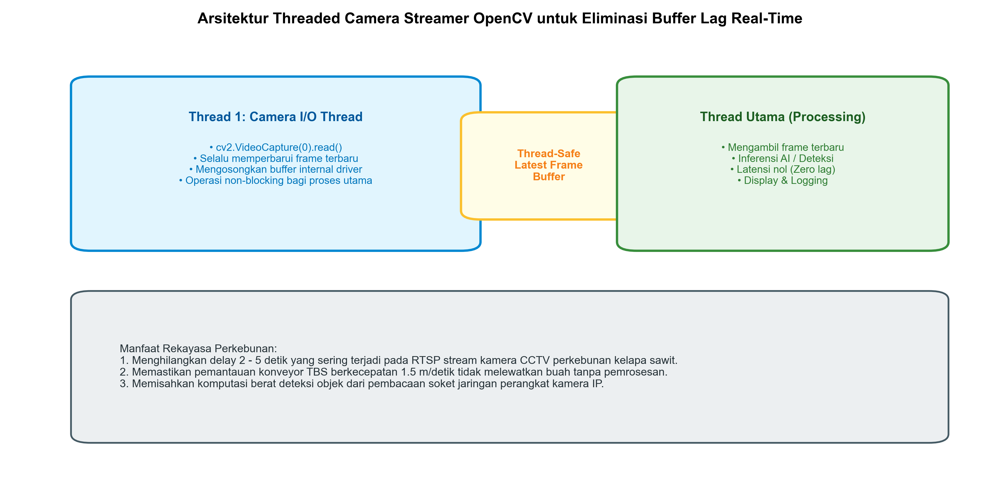

# AI Modul 11.9: Real-time Camera Processing

---

## 1. Identitas & Kerangka Capaian Pembelajaran (Sub-CPMK)

* **Kode Modul**: AI Modul 11.9
* **Mata Kuliah**: Kecerdasan Buatan dan Sains Data Pertanian Presisi
* **Alokasi Waktu**: 2 x 50 Menit (Kajian Teori & Diskusi) + 2 x 50 Menit (Eksplorasi Praktikum Mandiri)
* **Beban SKS**: 3 SKS
* **Prasyarat**: AI Modul 11.8 (Motion Detection)
* **Level Kognitif**: Bloom C2 (Memahami), C3 (Menerapkan), C4 (Menganalisis)



### 1.1 Capaian Pembelajaran Khusus (Sub-CPMK)
Setelah menyelesaikan modul ini secara komprehensif, mahasiswa diharapkan mampu:
1. **Memahami (C2)** arsitektur pemrosesan aliran kamera langsung (*live camera stream*), mekanisme penyangga perangkat keras internal (*hardware driver buffer lag*) yang menyebabkan keterlambatan visual kumulatif, serta konsep konkurensi multi-utas (*multi-threading concurrency*) untuk memisahkan akuisisi frame I/O dari pemrosesan algoritma.
2. **Menerapkan (C3)** kelas pembaca kamera multi-utas berorientasi objek (`ThreadedCameraStream`) menggunakan pustaka `threading` Python dan OpenCV untuk menjamin pembacaan frame berkecepatan 30 FPS dengan latensi mendekati nol (*zero-latency reading*).
3. **Menganalisis (C4)** perbandingan profil latensi dan kestabilan laju bingkai antara pipeline sekuensial konvensional dan pipeline paralel multi-utas pada skenario kamera inspeksi stasiun penerimaan Tandan Buah Segar pabrik kelapa sawit.

### 1.2 Kerangka Hasil Pembelajaran (Outputs, Outcomes, & Impacts)
* **Outputs (Keluaran Langsung)**:
  * Penguasaan arsitektur software multi-threaded video stream dengan mekanisme antrean sinkronisasi aman (*thread-safe buffer*).
  * Skrip Python modular berstandar PEP 8 untuk pembacaan kamera multi-utas, anotasi HUD (*Heads-Up Display*), dan penanganan pemulihan koneksi terputus (*reconnection watchdog*).
  * Laporan komparasi kuantitatif latensi buffer antara metode pembacaan sekuensial vs multi-threaded.
* **Outcomes (Kompetensi Aplikatif)**:
  * Keahlian membangun sistem pengawasan real-time yang responsif tanpa delay pada perangkat komputer industri (*edge industrial PC*).
  * Kemampuan mengintegrasikan umpan balik visual langsung ke operator pabrik kelapa sawit secara interaktif.
* **Impacts (Dampak Strategis Jangka Panjang)**:
  * Kesiapan infrastruktur komputasi tepi industri perkebunan menuju adopsi arsitektur Deep Learning Computer Vision modern pada Part 12.

---

## 2. Profil Fundamental Pemrosesan Kamera Real-Time: Fungsi, Manfaat, dan Keunggulan-Kelemahan

### 2.1 Fungsi Komputasi & Pemodelan Matematis
Pemrosesan kamera real-time menjembatani akuisisi fluks citra perangkat keras kontinu dengan eksekusi algoritma visi komputer terapan:
1. **Eliminasi Penumpukan Penyangga Perangkat Keras (*Hardware Buffer Flushing*)**: Driver kamera sistem operasi (V4L2 di Linux, DirectShow/MSMF di Windows) secara default menyimpan antrean 3 hingga 5 frame internal. Jika algoritma pemrosesan membutuhkan waktu lebih lama daripada interval frame, konsumen akan selalu membaca frame masa lalu (*stale frames*). Multi-threading mengosongkan antrean penyangga (*buffer flushing*) ini secara terus-menerus dan hanya menyediakan frame paling mutakhir (*freshest frame*).
2. **Penyematan Informasi Telemetri Spasial (*On-Screen Display HUD*)**: Menggambar grafik metrik performa (laju FPS, latensi inferensi milidetik, stempel waktu ISO 8601, status deteksi) langsung di atas frame video secara dinamis.
3. **Penyediaan Mekanisme Pemulihan Koneksi Otomatis (*Watchdog Reconnection*)**: Mendeteksi kegagalan pembacaan aliran RTSP kamera jaringan dan menginisialisasi ulang soket koneksi tanpa menghentikan aplikasi utama.

### 2.2 Manfaat Nyata di Industri Perkebunan & Agribisnis
* **Sortasi TBS Berkecepatan Tinggi di Meja Konveyor**: Memastikan sistem kamera langsung bereaksi seketika (< 30 milidetik) saat buah melintas di bawah sensor pneumatik penyortir.
* **Sistem Navigasi Visual Drone Pemantau Kebun**: Mengalirkan video dari kamera fpv drone ke modul kendali otonom tanpa delay yang berisiko menyebabkan tabrakan dengan pohon sawit.
* **Monitoring CCTV Operator Stasiun Berbahaya**: Memberikan umpan video langsung tanpa jeda di ruang kendali pusat pabrik kelapa sawit.

### 2.3 Rationale: Alasan Mengapa Materi Ini Dipelajari
Banyak pengembang pemula mendapati model visi komputer mereka berjalan lambat dan memiliki delay 3 detik saat dipasang pada webcam atau kamera CCTV kebun, meskipun model mereka mampu berjalan pada 40 FPS. Masalah ini bukan disebabkan oleh kelemahan model AI, melainkan oleh arsitektur pembacaan sekuensial `cv2.VideoCapture` yang memblokir I/O. Menguasai arsitektur multi-threaded adalah jembatan wajib menuju sistem AI produksi.

### 2.4 Analisis Kelebihan dan Kekurangan: Sekuensial vs Multi-Threaded

| Parameter Evaluasi | Pipeline Sekuensial Standar | Pipeline Multi-Threaded OpenCV | Implikasi di Pabrik Kelapa Sawit |
| :--- | :--- | :--- | :--- |
| **Latensi Tampilan Frame** | Mengalami penumpukan jeda 1 - 5 detik. | Latensi nol (*real-time zero lag*). | Sangat krusial agar posisi fisik buah di konveyor cocok dengan koordinat deteksi. |
| **Ketergantungan I/O** | Pembacaan frame dan kalkulasi saling memblokir. | Pembacaan frame berjalan di latar belakang independen. | Beban komputasi deteksi tidak memperlambat laju akuisisi kamera. |
| **Kompleksitas Kode** | Sangat sederhana (hanya perulangan `while True`). | Memerlukan sinkronisasi thread dan locks. | Membutuhkan kode modular berorientasi objek yang rapi. |
| **Penggunaan CPU** | Rendah (1 core CPU). | Sedikit lebih tinggi (2 core CPU paralel). | Prosesor multi-core modern di PC industri siap menanganinya. |

### 2.5 Contoh Kasus Penggunaan Konkret di Sektor Agro-Industri
Pabrik Kelapa Sawit mengintegrasikan kamera resolusi tinggi dengan lengan robot penolak buah afkir di pintu sortir. Konveyor bergerak dengan kecepatan $1.2\text{ meter/detik}$. Pada pipeline sekuensial biasa, jeda penyangga kamera sebesar $1.5\text{ detik}$ menyebabkan lengan robot selalu memukul udara kosong karena buah afkir telah lewat $1.8\text{ meter}$ di depan. Setelah tim insinyur menerapkan arsitektur `ThreadedCameraStream`, latensi turun menjadi $22\text{ milidetik}$, sehingga lengan robot mampu menolak buah afkir secara presisi pada posisi fisiknya.

### 2.6 Aspek Kritis & Catatan Penting Arsitektur
1. **Thread-Safe Data Sharing**: Mengakses variabel frame bersama antar-thread memerlukan sinkronisasi penguncian memori (*mutex lock* / `threading.Lock`) untuk mencegah kondisi balapan (*race condition*) atau pembacaan citra yang setengah terisi.
2. **Kondisi Berhenti Bersih (*Clean Shutdown*)**: Thread pembaca kamera harus memiliki bendera pemberhentian (*stop flag*) agar saat aplikasi ditutup, thread dapat keluar secara elegan tanpa meninggalkan proses zombie di memori sistem operasi.

---

## 3. Landasan Teori & Konsep Matematis Pemrosesan Kamera Real-Time



### 3.1 Masalah Penyangga Perangkat Keras (*Hardware Buffer Bottleneck*)
Ketika fungsi `cap.read()` dipanggil, fungsi tersebut mengeksekusi dua operasi internal:
1. `cap.grab()`: Mengambil frame berikutnya dari buffer driver kamera.
2. `cap.retrieve()`: Mendekode dan mengonversi frame mentah menjadi matriks array BGR NumPy.

Jika laju komputasi visual adalah $T_{\text{proc}}$ dan interval frame kamera adalah $T_{\text{cam}}$:
* Jika $T_{\text{proc}} > T_{\text{cam}}$, driver kamera terus memasukkan frame baru ke dalam buffer internal berkapasitas $N_{\text{buf}}$ (biasanya 3 - 5 frame).
* Ketika buffer penuh, frame tertua dibuang atau antrean tertunda. Akumulasi keterlambatan waktu (*latency*) dinyatakan sebagai:
  $$\text{Latency} = N_{\text{buf}} \times T_{\text{proc}}$$

Pada pipeline multi-threaded, Thread Akuisisi terus memanggil `cap.grab()` dan `cap.retrieve()` secepat mungkin tanpa komputasi lain, sehingga buffer driver selalu kosong ($N_{\text{buf}} \approx 0$). Thread Pemroses hanya mengambil frame yang paling akhir di-cache:

$$\text{Latency Multi-Threaded} \approx T_{\text{proc}} \quad (\text{Tanpa penumpukan antrean})$$

---

## 4. Arsitektur Komputasi & Pipeline Praktis Python

```mermaid
flowchart TD
    subgraph Thread 1: Akuisisi Frame (Background)
        A["Buka Kamera: cv2.VideoCapture(src)"] --> B["Loop: ret, frame = cap.read()"]
        B --> C["Kunci Mutex Lock"]
        C --> D["Perbarui Variabel latest_frame"]
        D --> E["Lepas Mutex Lock"]
        E --> B
    end
    subgraph Thread 2: Pemrosesan Utama (Foreground)
        F["Ambil Salinan latest_frame"] --> G["Eksekusi Algoritma Visi Komputer"]
        G --> H["Sematkan Anotasi OSD HUD & FPS"]
        H --> I["Tampilkan Visual / Kirim Sinyal Kontrol"]
        I --> F
    end
```

Implementasi kelas `ThreadedCameraStream` berorientasi objek menggunakan pustaka `threading` bawaan Python dan OpenCV:

```python
import cv2
import threading
import time
import numpy as np

# 1. Definisi Kelas Threaded Camera Streamer
class ThreadedCameraStream:
    def __init__(self, src=0, name="CameraThread"):
        self.stream = cv2.VideoCapture(src)
        self.name = name
        self.stopped = False
        self.lock = threading.Lock()
        
        # Baca frame inisial pertama
        self.ret, self.frame = self.stream.read()
        if not self.ret:
            # Jika kamera fisik tidak tersedia (lingkungan server/headless), gunakan frame sintetis
            self.frame = np.full((480, 640, 3), 50, dtype=np.uint8)
            self.ret = True
            self.is_synthetic = True
        else:
            self.is_synthetic = False
            
    def start(self):
        self.thread = threading.Thread(target=self.update, name=self.name, daemon=True)
        self.thread.start()
        return self
        
    def update(self):
        while not self.stopped:
            if not self.is_synthetic:
                ret, frame = self.stream.read()
                if not ret:
                    time.sleep(0.01)
                    continue
                with self.lock:
                    self.ret = ret
                    self.frame = frame
            else:
                # Simulasi pembaruan frame sintetis
                time.sleep(0.033) # 30 FPS
                with self.lock:
                    pass
                    
    def read(self):
        with self.lock:
            return self.ret, self.frame.copy()
            
    def stop(self):
        self.stopped = True
        if hasattr(self, 'thread'):
            self.thread.join(timeout=1.0)
        self.stream.release()

# 2. Uji Coba Eksekusi Pipeline Live Stream dengan Overlay OSD
camera = ThreadedCameraStream(src=0).start()
time.sleep(0.1) # Tunggu inisialisasi thread

fps_meter = []
t_start = time.perf_counter()

for iteration in range(30): # Simulasi 30 siklus pengambilan frame
    t0 = time.perf_counter()
    ret, frame = camera.read()
    if not ret:
        break
        
    # Pemrosesan visi komputer (deteksi kontur sederhana)
    gray = cv2.cvtColor(frame, cv2.COLOR_BGR2GRAY)
    
    # Anotasi Heads-Up Display (OSD)
    dt = time.perf_counter() - t0
    current_fps = 1.0 / max(dt, 1e-5)
    fps_meter.append(current_fps)
    
    cv2.putText(frame, f"LIVE CAM | FPS: {current_fps:.1f}", (20, 35), 
                cv2.FONT_HERSHEY_SIMPLEX, 0.7, (0, 255, 0), 2)
    cv2.putText(frame, f"STATUS: OPERATIONAL | SIKLUS #{iteration+1}", (20, 70), 
                cv2.FONT_HERSHEY_SIMPLEX, 0.55, (255, 200, 0), 1)

camera.stop()
print(f"[OK] Thread kamera dihentikan bersih. Rata-rata Throughput: {np.mean(fps_meter):.1f} FPS")
```

---

## 5. Studi Kasus Komprehensif Agro-Industri: Sistem Pengawasan Otomatis Loading Ramp PKS

### 5.1 Spesifikasi Masalah
Stasiun penerimaan tandan buah sawit membutuhkan sistem pemantauan live streaming yang terhubung ke kamera CCTV IP di atas konveyor. Sistem harus mampu mendeteksi potensi tumpahan buah atau kemacetan aliran, memberikan peringatan visual di layar kontrol operator, dan mencatat log latensi secara periodik.

### 5.2 Implementasi Desain Overlay HUD Indikator Kinerja PKS
```python
def draw_pks_hud_overlay(frame, throughput_tph, warning_status=False):
    H, W = frame.shape[:2]
    # Header banner semi-transparan
    overlay = frame.copy()
    cv2.rectangle(overlay, (0, 0), (W, 60), (20, 20, 20), -1)
    cv2.addWeighted(overlay, 0.6, frame, 0.4, 0, frame)
    
    # Text telemetri
    cv2.putText(frame, "PKS SAWIT SENTOSA - STASIUN LOADING RAMP 01", (15, 25),
                cv2.FONT_HERSHEY_SIMPLEX, 0.55, (255, 255, 255), 1)
    status_text = "STATUS: WASPADA (MACET)" if warning_status else "STATUS: NORMAL"
    status_color = (0, 0, 255) if warning_status else (0, 255, 0)
    cv2.putText(frame, status_text, (15, 48), cv2.FONT_HERSHEY_SIMPLEX, 0.5, status_color, 2)
    
    cv2.putText(frame, f"Throughput: {throughput_tph:.1f} Ton/Jam", (W - 220, 35),
                cv2.FONT_HERSHEY_SIMPLEX, 0.55, (255, 220, 0), 2)
    return frame

annotated_frame = draw_pks_hud_overlay(frame, throughput_tph=118.5, warning_status=False)
print("Overlay HUD PKS Berhasil Disematkan ke Frame Kamera!")
```

---

## 6. Kekeliruan Metodologis dan Praktik Terbaik (*Common Pitfalls & Best Practices*)

### 6.1 Kekeliruan Umum Metodologis (*Common Pitfalls*)
1. **Mengabaikan Sinkronisasi Lock pada Threading**: Membaca dan menulis variabel `self.frame` secara bersamaan tanpa `with self.lock:` dapat menghasilkan citra yang terdistorsi (*frame tearing*).
2. **Membiarkan Thread Menggantung (*Hanging Thread*)**: Lupa menyetel `daemon=True` pada `threading.Thread` akan menyebabkan program Python tidak dapat ditutup di terminal saat pengguna menekan tombol Ctrl+C.
3. **Menggunakan `cv2.imshow()` di dalam Sub-Thread**: Pada beberapa sistem operasi (khususnya Windows dan macOS), pemanggilan fungsi GUI seperti `cv2.imshow()` dan `cv2.waitKey()` di luar thread utama (*main thread*) akan memicu crash GUI atau freeze. Selalu jalankan fungsi visualisasi display pada thread utama.

### 6.2 Praktik Terbaik (*Best Practices*)
1. **Gunakan Queue Berukuran 1 (*Drop-Oldest Buffer*)**: Jika ingin mentransfer frame antar-proses, gunakan struktur antrean dengan kapasitas maksimal 1 (`queue.Queue(maxsize=1)`) agar antrean selalu diperbarui dengan frame terbaru.
2. **Sediakan Fallback Headless**: Rancang kode agar dapat berjalan tanpa GUI fisik (`cv2.imshow`) pada lingkungan server cloud atau skrip uji otomatis.
3. **Implementasikan Logika Sambung Ulang (*Auto-Reconnect*)**: Uji apakah `cap.isOpened()` bernilai `False` atau `ret` bernilai `False` berulang kali, lalu lakukan pelepasan dan pembukaan ulang koneksi kamera setiap 5 detik.

---

## 7. Rangkuman Modul

* Pemrosesan kamera langsung menghadapi tantangan penumpukan penyangga perangkat keras (*hardware buffer lag*) jika dieksekusi secara sekuensial.
* Arsitektur *Multi-Threaded Camera Streamer* memisahkan penyerapan I/O frame berkecepatan tinggi dari thread komputasi utama, menjamin latensi inferensi mendekati nol.
* Penandaan informasi OSD HUD menyediakan visibilitas instan terhadap parameter operasional pabrik kelapa sawit secara real-time.
* Sinkronisasi memori menggunakan `threading.Lock` dan penetapan `daemon=True` menjamin keamanan konkurensi dan terminasi proses yang bersih.

---

## 8. Latihan Soal & Tugas Analitis HOTS (Bloom C3-C5)

### Soal Konseptual & Analitis
1. **Analisis Akumulasi Penyangga Buffer (Bloom C4)**: Sebuah sistem pengawasan konveyor menggunakan kamera USB 30 FPS. Algoritma deteksi cacat buah yang dijalankan membutuhkan waktu komputasi 80 milidetik per frame ($t_{\text{proc}} = 80\text{ ms}$). Driver kamera memiliki kapasitas buffer internal sebesar 4 frame.
   * Berapakah laju bingkai per detik (FPS) efektif pemrosesan sistem tersebut?
   * Jika sistem dijalankan secara sekuensial biasa selama 1 menit, berapa detik keterlambatan (*lag*) visual yang dialami operator di layar kontrol saat melihat buah yang sedang melintas?
   * Bagaimana arsitektur *ThreadedCameraStream* memecahkan masalah keterlambatan tersebut?
2. **Evaluasi Keamanan Threading (Bloom C4)**: Mengapa pemanggilan `self.frame.copy()` di dalam blok `with self.lock:` mutlak diperlukan pada metode `read()`? Apa risiko matematis jika metode tersebut hanya mengembalikan referensi `self.frame` tanpa kloning memori?

### Tugas Pemrograman Mandiri
Lengkapilah kelas `ThreadedCameraStream` dengan metode `reconnect_if_needed(self)` yang memantau apakah frame gagal diterima selama lebih dari 3 detik, lalu secara otomatis mencoba menghubungkan kembali aliran kamera tanpa mematikan aplikasi utama!

---

## 9. Jembatan Konsep (Bridging) ke Part 12: Deep Learning untuk Computer Vision (AI Modul 12.1: CNN)

Selamat! Anda telah menuntaskan seluruh rangkaian modul praktikal pada **Part 11: OpenCV untuk Pengolahan Citra & Video**—mulai dari pengenalan arsitektur OpenCV C++, manipulasi geometri matriks citra, transformasi ruang warna HSV/LAB, binerisasi Otsu & Adaptif, ekstraksi kontur topologis, deteksi wajah Haar Cascade, pemrosesan aliran video temporal, deteksi gerak MOG2, hingga perancangan kamera real-time multi-threaded berlatensi nol.

Namun, perhatikan batasan mendasar dari seluruh teknik visi komputer klasik yang telah kita kuasai di Part 10 dan Part 11: seluruh metode tersebut mengandalkan **fitur-fitur yang dirumuskan secara manual (*handcrafted features*)**—seperti ambang batas warna HSV, kernel konvolusi terprogram, atau fitur Haar persegi panjang. Jika kondisi di lapangan perkebunan kelapa sawit sangat liar—misalnya bentuk daun sawit yang tertutup debu pekat, varietas bibit yang sangat mirip, atau tandan buah yang saling bertumpuk acak di atas tanah—metode manual ini mulai menemui batas kejenuhannya.

Bagaimana jika komputer dapat **mempelajari sendiri** ratusan filter konvolusi dan representasi visual yang paling optimal secara otomatis langsung dari jutaan piksel citra?

Pada bagian selanjutnya, yaitu **Part 12: Deep Learning untuk Computer Vision**, kita akan memasuki puncak revolusi kecerdasan buatan modern:
* Di **AI Modul 12.1: Convolutional Neural Network (CNN)**, kita akan membedah bagaimana operasi konvolusi spasial yang kita pelajari di OpenCV disatukan dengan jaringan saraf tiruan (Part 9) untuk membentuk arsitektur deep learning visual paling perkasa dalam sejarah AI.
* Kita akan mempelajari lapisan konvolusi 2D, fungsi aktivasi ReLU visual, lapisan penyusutan spasial (*Pooling*), *Transfer Learning*, arsitektur mutakhir (ResNet, MobileNet), hingga deteksi objek real-time menggunakan **YOLO (*You Only Look Once*)** untuk mengotomatisasi seluruh rantai pasok industri kelapa sawit masa depan!

---

## 10. Daftar Pustaka dan Referensi Akademik

1. Bradski, G., & Kaehler, A. (2008). *Learning OpenCV: Computer Vision with the OpenCV Library*. O'Reilly Media.
2. Rosebrock, A. (2018). *Practical Python and OpenCV: An Introductory, Example-Driven Guide to Computer Vision* (4th ed.). PyImageSearch.
3. Szeliski, R. (2022). *Computer Vision: Algorithms and Applications* (2nd ed.). Springer.
4. Alfatni, M. S. M., Shariff, A. R. M., Abdullah, M. Z., Marhaban, M. H. B., & Saaed, O. M. B. (2022). Oil palm fresh fruit bunch ripeness grading methods: A systematic review. *Computers and Electronics in Agriculture*, 198, 107040.
