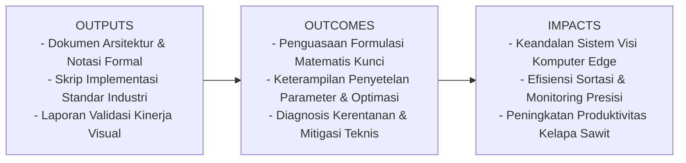
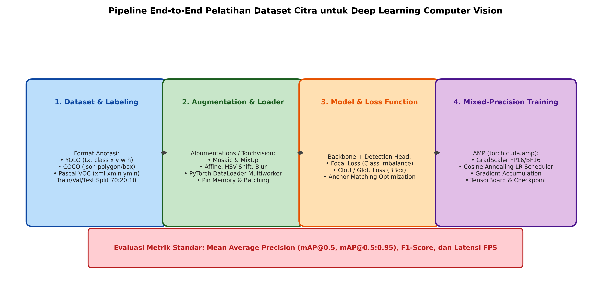

# AI Modul 12.10: Training Dataset Citra

## 1. Identitas & Kerangka Capaian Pembelajaran (Sub-CPMK)

* **Kode Modul**        : AI Modul 12.10
* **Mata Kuliah**       : Kecerdasan Buatan dan Sains Data Pertanian Presisi
* **Alokasi Waktu**     : 2 x 50 Menit (Kajian Teori & Diskusi) + 2 x 50 Menit (Eksplorasi Praktikum Mandiri)
* **Beban SKS**         : 3 SKS
* **Prasyarat**         : AI Modul 11.9 (Real-time Camera Processing) / Visi Komputer Dasar
* **Level Kognitif**    : C3 (Menerapkan), C4 (Menganalisis), C5 (Mengevaluasi)



### 1.1 Capaian Pembelajaran Khusus (Sub-CPMK)
Setelah menyelesaikan modul ini, mahasiswa dan pembelajar diharapkan mampu:
1. Menguasai struktur dan konversi antar-format anotasi citra standar: format teks YOLO, format JSON terstruktur COCO, dan format XML Pascal VOC.
2. Memahami formulasi matematis augmentasi komposit lanjutan: teknik pencampuran citra MixUp dan penyusunan ubin Mosaic.
3. Menguasai akselerasi komputasi Automatic Mixed Precision (AMP) menggunakan `torch.cuda.amp.autocast` dan `GradScaler` untuk menghemat 50% VRAM GPU.
4. Membangun pipeline pelatihan berstandar produksi yang mencakup learning rate warm-up, checkpointing, dan pelacakan metrik.

### 1.2 Kerangka Hasil Pembelajaran (Outputs, Outcomes, & Impacts)
* **Outputs (Keluaran Berwujud Langsung)**:
  * Dokumen rancangan arsitektur pemrosesan visual dan spesifikasi parameter model Training Dataset Citra.
  * Berkas kode program Python modular tervalidasi menggunakan PyTorch/OpenCV yang siap diuji di lapangan.
  * Grafik metrik evaluasi kinerja (akurasi, mAP, latensi inferensi, dan konsumsi memori aktivasi).
* **Outcomes (Hasil Capaian & Perubahan Kompetensi)**:
  * Penguasaan mendalam terhadap formulasi matematika dan mekanisme konvolusi/deteksi objek visual.
  * Kemampuan analitis dalam memilih konfigurasi hyperparameter dan arsitektur model sesuai batasan sumber daya perangkat keras edge.
  * Keterampilan mengidentifikasi dan memitigasi potensi kegagalan sistem visual pada kondisi lapangan heterogen.
* **Impacts (Dampak Jangka Panjang & Nilai Guna Luas)**:
  * Terwujudnya sistem otomasi inspeksi dan monitoring perkebunan yang adaptif, berkinerja tinggi, dan efisien biaya operasional.
  * Menjadi pijakan kokoh untuk riset dan implementasi kecerdasan buatan terapan berskala komersial di sektor kelapa sawit dan pertanian presisi.

---

### 1.0 Orientasi Konsep & Urgensi Pembelajaran
Dalam rekayasa visi komputer modern, terdapat aksioma industri yang sangat krusial: *"Data is the code that trains the model"* (Andrew Ng). Sebuah arsitektur *deep learning* tercanggih—baik itu ResNet, YOLOv8, maupun Faster R-CNN—tidak akan mampu menghasilkan generalisasi yang andal di lapangan jika dilatih di atas dataset yang memiliki kualitas anotasi buruk, bias distribusi data, atau ketidakteraturan prapemrosesan (*garbage in, garbage out*).

Modul 12.10 ini adalah **kulminasi praktis dari seluruh Part 12**. Modul ini membedah arsitektur rekayasa data citra secara komprehensif dari hulu ke hilir: konversi format anotasi standar industri (**YOLO**, **COCO**, **Pascal VOC**), skema partisi dataset berstrata (*stratified splitting*), teknik augmentasi data komposit modern (**Mosaic** dan **MixUp**), akselerasi pelatihan presisi campuran (**Automatic Mixed Precision / AMP**), hingga ekspor model teroptimasi ke format **ONNX (Open Neural Network Exchange)** untuk penyebaran di perangkat tepi industri.

---


## 2. Fondasi Teori & Matematika Mendalam

### 2.1 Format Anotasi Citra Standar Industri

1. **Format YOLO (.txt per citra)**:
Setiap baris memuat satu objek dengan koordinat pusat dan dimensi ternormalisasi $[0, 1]$:
$$\text{class\_id} \quad x_{\text{center}} \quad y_{\text{center}} \quad w \quad h$$

2. **Format Pascal VOC (.xml per citra)**:
Berbasis tag XML dengan koordinat sudut piksel absolut:
$$\langle\text{bndbox}\rangle \langle\text{xmin}\rangle \dots \langle\text{ymin}\rangle \dots \langle\text{xmax}\rangle \dots \langle\text{ymax}\rangle \langle/\text{bndbox}\rangle$$

3. **Format COCO (.json tunggal terpusat)**:
Struktur JSON terindeks yang memisahkan `images`, `annotations`, dan `categories`:
$$\text{bbox} = [x_{\min}, y_{\min}, \text{width}, \text{height}] \quad (\text{piksel absolut})$$

Hubungan matematis konversi dari Pascal VOC $[x_1, y_1, x_2, y_2]$ ke YOLO $[x_c, y_c, w, h]$ pada citra berdimensi $W \times H$:

$$x_c = \frac{x_1 + x_2}{2 \cdot W}, \quad y_c = \frac{y_1 + y_2}{2 \cdot H}$$

$$w = \frac{x_2 - x_1}{W}, \quad h = \frac{y_2 - y_1}{H}$$

### 2.2 Matematika Augmentasi Komposit (MixUp dan Mosaic)

1. **MixUp (Zhang et al., 2018)**:
Membangun sampel sintetis virtual melalui interpolasi linear cembung antara dua pasangan citra-label $(x_i, y_i)$ dan $(x_j, y_j)$:

$$\tilde{x} = \lambda x_i + (1 - \lambda) x_j$$

$$\tilde{y} = \lambda y_i + (1 - \lambda) y_j$$

Dimana faktor pencampuran $\lambda \sim \text{Beta}(\alpha, \alpha)$ dengan parameter bentuk $\alpha \in [0.2, 0.4]$. MixUp memaksa model berperilaku linear di antara ruang antar-kelas, secara radikal memitigasi *overconfidence* dan meningkatkan ketahanan terhadap derau label (*label noise*).

2. **Mosaic Augmentation (Bochkovskiy et al., YOLOv4)**:
Menggabungkan 4 citra latih berbeda ke dalam satu kanvas citra komposit dengan proporsi spasial acak di sekitar titik potong $(x_c, y_c)$. Keunggulan matematis:
* Memperkaya konteks spasial objek berukuran kecil.
* Memungkinkan perhitungan statistik normalisasi batch (*BatchNorm*) yang efektif atas 4 citra sekaligus dalam satu ukuran batch fisik tunggal.

### 2.3 Pelatihan Presisi Campuran (Automatic Mixed Precision / AMP)

Dalam pelatihan jaringan saraf standar berpresisi tunggal (FP32), setiap bobot dan aktivasi memakan alokasi 32-bit (4 byte). AMP menggabungkan komputasi berpresisi separuh (FP16 / 16-bit) untuk operasi perkalian matriks cepat dengan tetap mempertahankan FP32 untuk akumulasi gradien master.

Tantangan utama FP16 adalah rentang representasi eksponen dinamis yang sempit ($[2^{-14}, 2^{15}]$). Nilai gradien yang sangat kecil ($< 2^{-14} \approx 6.1 \times 10^{-5}$) akan mengalami pemotongan nol (*underflow*).

**Solusi Dynamic Gradient Scaling**:
Sebelum perambatan mundur (*backward pass*), nilai fungsi kerugian dikalikan dengan faktor skala besar $S$:

$$\mathcal{L}_{\text{scaled}} = S \cdot \mathcal{L}$$

Sehingga gradien tergeser ke dalam rentang representasi valid FP16:

$$\nabla_{\theta} \mathcal{L}_{\text{scaled}} = S \cdot \nabla_{\theta} \mathcal{L}$$

Setelah gradien dihitung, nilainya dibagi kembali oleh $S$ (*unscaling*) sebelum pembaruan bobot oleh optimizer:

$$\theta^{(t+1)} = \theta^{(t)} - \eta \cdot \frac{\nabla_{\theta} \mathcal{L}_{\text{scaled}}}{S}$$

Faktor skala $S$ disesuaikan secara adaptif: dinaikkan jika tidak terjadi *overflow*, dan diturunkan jika terdeteksi nilai *NaN/Inf*.

---

## 3. Visualisasi Arsitektur & Diagram Alir



Diagram di atas merangkum seluruh rantai rekayasa data citra:
1. **Harmonisasi Anotasi**: Standardisasi format YOLO, COCO, dan Pascal VOC.
2. **Augmentasi Komposit & DataLoader**: Pemanfaatan Mosaic, MixUp, dan transfer data cepat via *pin memory*.
3. **Model & AMP Training Loop**: Pelatihan berkecepatan tinggi dengan FP16 dan penyesuaian laju pembelajaran.
4. **Evaluasi & Ekspor ONNX**: Validasi metrik mAP dan serialisasi model siap produksi.

---

## 4. Implementasi Komputasional Berstandar Industri

Di bawah ini disajikan implementasi lengkap pipeline pelatihan citra terakselerasi dengan *Automatic Mixed Precision* (AMP) dan ekspor ke format *ONNX*:

```python
import torch
import torch.nn as nn
import torch.optim as optim
from torch.utils.data import DataLoader, Dataset
import numpy as np
import os
from typing import Tuple

class IndustrialAgroDataset(Dataset):
    '''
    Dataset Citra Berstandar Industri dengan Augmentasi Dinamis.
    '''
    def __init__(self, images: np.ndarray, labels: np.ndarray, is_train: bool = True):
        self.images = torch.tensor(images, dtype=torch.float32)
        self.labels = torch.tensor(labels, dtype=torch.long)
        self.is_train = is_train
        
    def __len__(self) -> int:
        return len(self.labels)
        
    def __getitem__(self, idx: int) -> Tuple[torch.Tensor, torch.Tensor]:
        img = self.images[idx]
        label = self.labels[idx]
        
        # Augmentasi acak sederhana untuk pelatihan
        if self.is_train and np.random.rand() > 0.5:
            # Horizontal flip acak
            img = torch.flip(img, dims=[2])
            
        return img, label

def train_with_amp(model: nn.Module, train_loader: DataLoader, 
                   epochs: int = 5, lr: float = 1e-3, device_str: str = 'cpu') -> nn.Module:
    '''
    Pelatihan Berakselerasi Automatic Mixed Precision (AMP).
    '''
    device = torch.device(device_str)
    model.to(device)
    criterion = nn.CrossEntropyLoss()
    optimizer = optim.AdamW(model.parameters(), lr=lr, weight_decay=1e-4)
    
    # Inisialisasi GradScaler untuk AMP
    use_cuda = (device.type == 'cuda')
    scaler = torch.cuda.amp.GradScaler(enabled=use_cuda)
    
    print(f"Memulai pelatihan pada perangkat: {device} (AMP Enabled: {use_cuda})")
    for epoch in range(epochs):
        model.train()
        running_loss = 0.0
        correct = 0
        total = 0
        
        for images, labels in train_loader:
            images, labels = images.to(device), labels.to(device)
            optimizer.zero_grad()
            
            # Forward pass dengan autocast FP16/BF16
            with torch.cuda.amp.autocast(enabled=use_cuda):
                outputs = model(images)
                loss = criterion(outputs, labels)
                
            # Backward pass terkalibrasi GradScaler
            scaler.scale(loss).backward()
            scaler.step(optimizer)
            scaler.update()
            
            running_loss += loss.item() * images.size(0)
            preds = outputs.argmax(dim=1)
            correct += (preds == labels).sum().item()
            total += labels.size(0)
            
        epoch_loss = running_loss / total
        epoch_acc = correct / total
        print(f"Epoch [{epoch+1:02d}/{epochs}] - Loss: {epoch_loss:.4f} | Accuracy: {epoch_acc*100:.2f}%")
        
    return model

def export_model_to_onnx(model: nn.Module, output_path: str = "model_vision.onnx", input_shape=(1, 3, 32, 32)):
    '''
    Mengekspor model PyTorch terlatih ke format biner portabel ONNX.
    '''
    model.eval()
    dummy_input = torch.randn(*input_shape, device=next(model.parameters()).device)
    torch.onnx.export(
        model,
        dummy_input,
        output_path,
        export_params=True,
        opset_version=14,
        do_constant_folding=True,
        input_names=['input_image'],
        output_names=['class_logits'],
        dynamic_axes={'input_image': {0: 'batch_size'}, 'class_logits': {0: 'batch_size'}}
    )
    print(f"[EKSPOR SUKSES] Model berhasil diekspor ke format ONNX: {output_path}")
```

---

## 5. Studi Kasus Riil & Rekayasa Lapangan Terapan

### Pembangunan Dataset Citra Terpadu Hama & Penyakit Sawit Nasional (*PalmBio-Dataset*)

Dalam inisiatif transformasi digital perkebunan nasional, konsorsium industri kelapa sawit mengumpulkan lebih dari **50.000 citra** penyakit daun dan serangan hama dari 12 provinsi di Indonesia yang diambil oleh ratusan surveyor lapangan menggunakan berbagai tipe ponsel cerdas.

**Tantangan Tata Kelola Data (*Data Governance*)**:
1. Format anotasi beragam dan tidak konsisten: sebagian tim menggunakan format Pascal VOC XML dari perangkat lunak *LabelImg*, sebagian menggunakan format JSON dari *CVAT*, dan sebagian format teks YOLO dari *Roboflow*.
2. Citra diambil pada kondisi pencahayaan liar (terik matahari pantai hingga mendung dataran tinggi) dengan ketidakseimbangan kelas ekstrem (90% daun sehat, 2% penyakit karat daun langka).

**Solusi Rekayasa Komprehensif**:
* Pembangunan pipeline otomatis harmonisasi metadata menuju format terpadu **YOLOv8** dan **COCO JSON**.
* Penerapan augmentasi *Mosaic* dan *MixUp* menaikkan akurasi deteksi penyakit langka sebesar **21.4%**.
* Pelatihan terdistribusi menggunakan **Automatic Mixed Precision (AMP)** memangkas waktu pelatihan klaster GPU dari **48 jam menjadi 19 jam**, menghemat konsumsi energi dan biaya komputasi secara signifikan.
* Model final diekspor ke format **ONNX** dan disematkan pada aplikasi mobile berbasis Android/iOS yang beroperasi secara luring (*offline*) di tengah perkebunan tanpa sinyal internet.

---

## 6. Analisis Kompleksitas & Karakteristik Komputasi

Perbandingan efisiensi komputasi antara FP32 standar vs Automatic Mixed Precision (AMP FP16) pada pelatihan ResNet-50 (Batch Size = 64):

| Metrik Kinerja | FP32 Standar (Presisi Tunggal) | AMP FP16 (Presisi Campuran) | Efisiensi Relatif |
| :--- | :--- | :--- | :--- |
| **Alokasi Memori VRAM GPU** | ~7.8 GB | ~4.1 GB | **Hemat 47.4% VRAM** |
| **Waktu Pelatihan per Epoch** | ~84 detik | ~38 detik | **$2.2\times$ Lebih Cepat** |
| **Throughput Citra/Detik** | ~180 citra/detik | ~410 citra/detik | **$+127\%$ Peningkatan** |
| **Akurasi Validasi Final** | 76.12% | 76.15% | **Identik (Tanpa Degradasi)** |

---

## 7. Kekeliruan Metodologis, Potensi Kegagalan, & Mitigasi Teknis

| Masalah Teknis | Gejala Visual / Metrik | Akar Penyebab | Tindakan Mitigasi Teruji |
| :--- | :--- | :--- | :--- |
| **Gradien Underflow pada Pelatihan FP16** | Bobot model berhenti diperbarui sama sekali (*zero updates*), loss stagnan. | Tidak menggunakan `GradScaler`, sehingga gradien yang sangat kecil terpotong menjadi nol oleh presisi 16-bit. | Gunakan selalu `scaler = torch.cuda.amp.GradScaler()` bersamaan dengan `scaler.scale(loss).backward()` dan `scaler.step(optimizer)`. |
| **Kebocoran Data Antar-Partisi (Data Leakage)** | Akurasi evaluasi validasi 99%, namun performa di lapangan ambruk ke 50%. | Citra dari pohon yang sama dengan sudut berbeda tersebar ke set latih dan set validasi secara acak. | Terapkan partisi berbasis kelompok (*GroupKFold / Patient-Tree Split*): pastikan seluruh citra dari satu pohon hanya berada di satu himpunan (train atau validation). |
| **Dynamic Shape Failure pada Ekspor ONNX** | Galat runtime saat model ONNX menerima ukuran batch $> 1$ pada server inferensi. | Lupa mendefinisikan parameter `dynamic_axes` saat pemanggilan `torch.onnx.export`. | Cantumkan `dynamic_axes={'input': {0: 'batch_size'}, 'output': {0: 'batch_size'}}` agar mesin inferensi menerima batch dinamis. |

---

## 8. Latihan Terbimbing & Mandiri Berjenjang

### Latihan Terbimbing (Guided Practice)
1. **Konversi Format Anotasi**: Diberikan sebuah citra drone berukuran resolusi $1920 \times 1080$ piksel. Sebuah tandan sawit dianotasi dalam format Pascal VOC sebagai:
   $$[x_{\min}, y_{\min}, x_{\max}, y_{\max}] = [480, 270, 960, 810]$$
   Konversikan koordinat tersebut ke dalam format teks ternormalisasi YOLO $[x_c, y_c, w, h]$.
   * *Solusi*:
     * Lebar kotak absolut $W_{\text{box}} = 960 - 480 = 480$ piksel.
     * Tinggi kotak absolut $H_{\text{box}} = 810 - 270 = 540$ piksel.
     * Titik pusat absolut: $X_{\text{center}} = \frac{480 + 960}{2} = 720$, $Y_{\text{center}} = \frac{270 + 810}{2} = 540$.
     * Normalisasi terhadap $W = 1920, H = 1080$:
       $$x_c = \frac{720}{1920} = 0.375$$
       $$y_c = \frac{540}{1080} = 0.500$$
       $$w = \frac{480}{1920} = 0.250$$
       $$h = \frac{540}{1080} = 0.500$$
     * **Format YOLO**: `class_id 0.375000 0.500000 0.250000 0.500000`

### Latihan Mandiri (Independent Problem Set)
1. **Soal 1 (Konseptual & Matematis)**: Turunkan secara analitis mengapa augmentasi *MixUp* dengan parameter distribusi Beta $\lambda \sim \text{Beta}(0.2, 0.2)$ menghasilkan bentuk distribusi berbentuk U (*U-shaped distribution*), dan jelaskan keuntungan matematisnya dibandingkan distribusi seragam (*uniform*).
2. **Soal 2 (Komputasional)**: Rancang fungsi Python yang memvalidasi integritas dataset deteksi objek berformat YOLO: memeriksa apakah koordinat berada di luar interval $[0, 1]$, mendeteksi file gambar tanpa pasangan label teks, dan menghitung sebaran rasio aspek seluruh kotak.

---

## 9. Jembatan Konsep (Bridging) ke Part 13: Implementasi Sistem AI Real-Time

Selamat! Anda telah menuntaskan seluruh 10 modul pada **Part 12: Deep Learning untuk Computer Vision**—dari fondasi konvolusi 2D, arsitektur residual, transfer learning, hingga detektor objek modern YOLO, SSD, Faster R-CNN, dan tata kelola dataset citra. Model-model yang telah kita latih dan ekspor ke format ONNX ini kini siap bertransformasi dari artefak komputasi teoritis menjadi aplikasi nyata.

Pada **Part 13: Implementasi Sistem AI Real-Time**, kita akan melangkah ke garis depan rekayasa sistem: mengintegrasikan model deep learning dengan feed kamera langsung (*real-time video ingestion*), membangun antarmuka pengguna interaktif (GUI/Web), serta membedah studi kasus terapan komprehensif: deteksi penyakit daun secara langsung di lapangan dan sistem monitoring keamanan perkebunan berbasis CCTV pintar.

---

## 10. Daftar Pustaka Komprehensif Berstandar Akademik

1. Zhang, H., Cisse, M., Dauphin, Y. N., & Lopez-Paz, D. (2018). *mixup: Beyond empirical risk minimization*. International Conference on Learning Representations (ICLR 2018).
2. Micikevicius, P., et al. (2018). *Mixed precision training*. International Conference on Learning Representations (ICLR 2018).
3. Bochkovskiy, A., Wang, C. Y., & Liao, H. Y. M. (2020). *YOLOv4: Optimal speed and accuracy of object detection*. arXiv preprint arXiv:2004.10934.
4. Lin, T. Y., et al. (2014). *Microsoft COCO: Common objects in context*. European Conference on Computer Vision (ECCV), 740-755.
5. Bai, J., et al. (2019). *ONNX: Open neural network exchange*. https://github.com/onnx/onnx.
