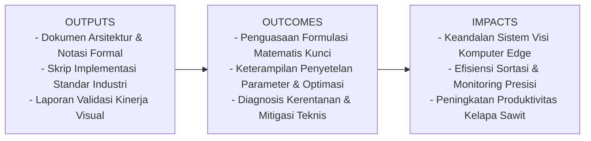
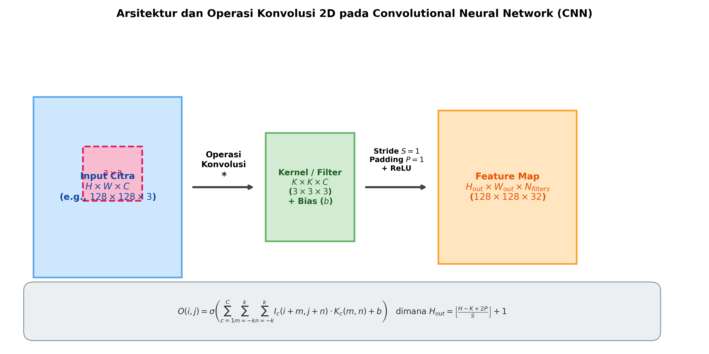

# AI Modul 12.1: Convolutional Neural Network (CNN)

## 1. Identitas & Kerangka Capaian Pembelajaran (Sub-CPMK)

* **Kode Modul**        : AI Modul 12.1
* **Mata Kuliah**       : Kecerdasan Buatan dan Sains Data Pertanian Presisi
* **Alokasi Waktu**     : 2 x 50 Menit (Kajian Teori & Diskusi) + 2 x 50 Menit (Eksplorasi Praktikum Mandiri)
* **Beban SKS**         : 3 SKS
* **Prasyarat**         : AI Modul 11.9 (Real-time Camera Processing) / Visi Komputer Dasar
* **Level Kognitif**    : C3 (Menerapkan), C4 (Menganalisis), C5 (Mengevaluasi)



### 1.1 Capaian Pembelajaran Khusus (Sub-CPMK)
Setelah menyelesaikan modul ini, mahasiswa dan pembelajar diharapkan mampu:
1. Memahami formulasi matematis diskrit operasi konvolusi 2D, mekanisme cross-correlation, peran kernel/filter, serta pengaruh stride dan padding.
2. Menguasai analisis pertumbuhan receptive field efektif sepanjang kedalaman lapisan jaringan.
3. Mengimplementasikan lapisan konvolusi secara manual berbasis operasi matriks murni NumPy serta pustaka `torch.nn.Conv2d` pada PyTorch.
4. Menganalisis efisiensi komputasi FLOPs (Floating Point Operations) dan konsumsi memori aktivasi konvolusi.

### 1.2 Kerangka Hasil Pembelajaran (Outputs, Outcomes, & Impacts)
* **Outputs (Keluaran Berwujud Langsung)**:
  * Dokumen rancangan arsitektur pemrosesan visual dan spesifikasi parameter model Convolutional Neural Network (CNN).
  * Berkas kode program Python modular tervalidasi menggunakan PyTorch/OpenCV yang siap diuji di lapangan.
  * Grafik metrik evaluasi kinerja (akurasi, mAP, latensi inferensi, dan konsumsi memori aktivasi).
* **Outcomes (Hasil Capaian & Perubahan Kompetensi)**:
  * Penguasaan mendalam terhadap formulasi matematika dan mekanisme konvolusi/deteksi objek visual.
  * Kemampuan analitis dalam memilih konfigurasi hyperparameter dan arsitektur model sesuai batasan sumber daya perangkat keras edge.
  * Keterampilan mengidentifikasi dan memitigasi potensi kegagalan sistem visual pada kondisi lapangan heterogen.
* **Impacts (Dampak Jangka Panjang & Nilai Guna Luas)**:
  * Terwujudnya sistem otomasi inspeksi dan monitoring perkebunan yang adaptif, berkinerja tinggi, dan efisien biaya operasional.
  * Menjadi pijakan kokoh untuk riset dan implementasi kecerdasan buatan terapan berskala komersial di sektor kelapa sawit dan pertanian presisi.

---

### 1.0 Orientasi Konsep & Urgensi Pembelajaran
Convolutional Neural Network (CNN) adalah pilar fundamental dalam visi komputer modern yang dirancang khusus untuk memproses data berstruktur kisi (*grid-structured data*), seperti citra digital dua dimensi ($H \times W \times C$). Sebelum hadirnya CNN, pendekatan *Multi-Layer Perceptron* (MLP) konvensional mengharuskan perataan citra (*flattening*) menjadi satu dimensi panjang ($H \cdot W \cdot C$), yang mengakibatkan dua limitasi komputasi mendasar: hilangnya relasi spasial antar-piksel tetangga (*spatial topology destruction*) dan ledakan kombinatorial jumlah bobot parameter yang memicu *overfitting* ekstrem.

CNN merevolusi paradigma pemrosesan visual melalui tiga prinsip komputasi fundamental: **pembagian bobot (*weight sharing*)**, **konektivitas lokal (*sparse/local connectivity*)**, dan **invariansi pergeseran (*translation equivariance*)**. Dalam sektor agroindustri dan bioinformatika modern—seperti pemilahan otomatis tandan buah segar (TBS) kelapa sawit, deteksi hawar daun (*leaf blight*), hingga estimasi luas kanopi hutan tanaman industri melalui drone—CNN bertindak sebagai mesin ekstraksi hierarki visual otomatis yang mampu mengubah piksel mentah menjadi representasi semantik berdaya pisah tinggi.

---

## 2. Fondasi Teori & Matematika Mendalam

### 2.1 Formulasi Operasi Konvolusi Diskrit 2D dan Cross-Correlation

Dalam literatur matematika murni, operasi konvolusi antara citra masukan $I$ dan kernel $K$ berukuran $(2k+1) \times (2k+1)$ didefinisikan dengan membalik kernel (*kernel flipping*):

$$S(i, j) = (I * K)(i, j) = \sum_{m=-k}^{k} \sum_{n=-k}^{k} I(i - m, j - n) K(m, n)$$

Namun, dalam seluruh kerangka kerja *deep learning* modern (seperti PyTorch dan TensorFlow), operasi yang diimplementasikan secara komputasional adalah **korelasi silang (*cross-correlation*)** tanpa pembalikan kernel, karena kernel dipelajari secara dinamis melalui proses *backpropagation*:

$$O(i, j) = (I \star K)(i, j) = \sum_{m=-k}^{k} \sum_{n=-k}^{k} I(i + m, j + n) K(m, n)$$

Untuk citra masukan multi-kanal dengan dimensi $(C_{in}, H_{in}, W_{in})$ yang diproses oleh sekumpulan $C_{out}$ filter berukuran $(C_{in}, K_h, K_w)$, nilai aktivasi pada kanal keluaran ke-$c_{out}$ di koordinat $(i, j)$ sebelum fungsi aktivasi adalah:

$$O(c_{out}, i, j) = b(c_{out}) + \sum_{c_{in}=1}^{C_{in}} \sum_{m=0}^{K_h - 1} \sum_{n=0}^{K_w - 1} I(c_{in}, i \cdot S_h + m, j \cdot S_w + n) \cdot W(c_{out}, c_{in}, m, n)$$

Dimana:
* $W(c_{out}, c_{in}, m, n)$ adalah bobot tensor kernel berdimensi $(C_{out}, C_{in}, K_h, K_w)$.
* $b(c_{out})$ adalah skalar bias untuk kanal keluaran ke-$c_{out}$.
* $S_h, S_w$ adalah langkah pergeseran (*stride*) vertikal dan horizontal.

### 2.2 Relasi Dimensi Spasial (Spatial Output Dimension)

Ukuran spasial peta fitur keluaran ($H_{out}, W_{out}$) dikontrol secara ketat oleh dimensi masukan ($H_{in}, W_{in}$), ukuran kernel ($K$), *padding* ($P$), dan *stride* ($S$) melalui fungsi lantai (*floor function*):

$$H_{out} = \left\lfloor \frac{H_{in} - K_h + 2P_h}{S_h} \right\rfloor + 1$$

$$W_{out} = \left\lfloor \frac{W_{in} - K_w + 2P_w}{S_w} \right\rfloor + 1$$

Jika $S = 1$, kita dapat mempertahankan resolusi spasial yang identik (*same padding*) dengan memilih:

$$P = \frac{K - 1}{2} \quad (\text{untuk } K \text{ bernilai ganjil})$$

### 2.3 Analisis Receptive Field

*Receptive Field* ($RF$) adalah area spasial pada citra masukan asli yang memengaruhi nilai aktivasi neuron pada lapisan tertentu. Untuk lapisan ke-$l$, ukuran *receptive field* efektif $RF_l$ dapat dihitung secara rekursif:

$$RF_l = RF_{l-1} + (K_l - 1) \cdot J_{l-1}$$

$$J_l = J_{l-1} \cdot S_l$$

Dimana:
* $RF_0 = 1$ (piksel tunggal pada citra masukan).
* $J_l$ adalah *jump* spasial kumulatif antar-fitur.
* $S_l$ adalah *stride* pada lapisan ke-$l$.

Formula ini membuktikan bahwa menumpuk dua lapisan konvolusi $3 \times 3$ ($S=1$) menghasilkan *receptive field* setara lapisan $5 \times 5$, namun hanya membutuhkan $2 \times (3^2) = 18$ bobot dibandingkan $1 \times (5^2) = 25$ bobot, dengan keuntungan tambahan berupa penyisipan fungsi non-linearitas ganda.

---

## 3. Visualisasi Arsitektur & Diagram Alir



Diagram di atas mengilustrasikan mekanisme konvolusi multi-kanal:
1. **Tensor Citra Masukan**: Berdimensi $(H \times W \times C)$, di mana setiap kanal warna diproses secara paralel oleh sub-filter terkait.
2. **Koleksi Filter/Kernel**: Melakukan pergeseran spasial (*sliding window*) dengan *stride* tertentu. Operasi perkalian titik (*dot product*) elemen-demi-elemen diakumulasikan sepanjang kedalaman kanal.
3. **Peta Fitur Keluaran (*Feature Map*)**: Menghasilkan representasi respons visual terhadap pola lokal (seperti orientasi gradien tepi, tekstur serat daun, atau pola bintik penyakit).

---

## 4. Implementasi Komputasional Berstandar Industri

Di bawah ini disajikan implementasi lengkap konvolusi 2D: dari algoritma eksplisit berbasis NumPy untuk pemahaman mekanika dasar, hingga modul modular berbasis PyTorch berstandar produksi.

```python
import torch
import torch.nn as nn
import numpy as np

def conv2d_forward_numpy(X: np.ndarray, W: np.ndarray, b: np.ndarray, stride: int = 1, padding: int = 0) -> np.ndarray:
    '''
    Implementasi konvolusi 2D murni berbasis NumPy untuk verifikasi matematis.
    X: Input array dimensi (N, C_in, H, W)
    W: Kernel weights dimensi (C_out, C_in, Kh, Kw)
    b: Bias array dimensi (C_out,)
    '''
    N, C_in, H_in, W_in = X.shape
    C_out, _, Kh, Kw = W.shape
    
    H_out = int(np.floor((H_in - Kh + 2 * padding) / stride)) + 1
    W_out = int(np.floor((W_in - Kw + 2 * padding) / stride)) + 1
    
    X_pad = np.pad(X, ((0, 0), (0, 0), (padding, padding), (padding, padding)), mode='constant')
    out = np.zeros((N, C_out, H_out, W_out), dtype=np.float32)
    
    for n in range(N):
        for c_out in range(C_out):
            for i in range(H_out):
                h_start = i * stride
                h_end = h_start + Kh
                for j in range(W_out):
                    w_start = j * stride
                    w_end = w_start + Kw
                    
                    patch = X_pad[n, :, h_start:h_end, w_start:w_end]
                    out[n, c_out, i, j] = np.sum(patch * W[c_out]) + b[c_out]
                    
    return out

class AgroPalmLeafCNN(nn.Module):
    '''
    Arsitektur CNN Standar Industri untuk Deteksi Patologi Daun Bibit Kelapa Sawit.
    '''
    def __init__(self, num_classes: int = 2):
        super(AgroPalmLeafCNN, self).__init__()
        
        # Blok Ekstraksi Fitur 1
        self.conv1 = nn.Conv2d(in_channels=3, out_channels=16, kernel_size=3, stride=1, padding=1)
        self.bn1 = nn.BatchNorm2d(16)
        self.relu1 = nn.ReLU(inplace=True)
        self.pool1 = nn.MaxPool2d(kernel_size=2, stride=2)
        
        # Blok Ekstraksi Fitur 2
        self.conv2 = nn.Conv2d(in_channels=16, out_channels=32, kernel_size=3, stride=1, padding=1)
        self.bn2 = nn.BatchNorm2d(32)
        self.relu2 = nn.ReLU(inplace=True)
        self.pool2 = nn.MaxPool2d(kernel_size=2, stride=2)
        
        # Classifier Head
        self.gap = nn.AdaptiveAvgPool2d((1, 1))
        self.dropout = nn.Dropout(p=0.4)
        self.fc = nn.Linear(32, num_classes)
        
    def forward(self, x: torch.Tensor) -> torch.Tensor:
        # Resolusi input: (N, 3, 64, 64)
        x = self.pool1(self.relu1(self.bn1(self.conv1(x)))) # -> (N, 16, 32, 32)
        x = self.pool2(self.relu2(self.bn2(self.conv2(x)))) # -> (N, 32, 16, 16)
        x = self.gap(x)                                     # -> (N, 32, 1, 1)
        x = torch.flatten(x, 1)                             # -> (N, 32)
        x = self.dropout(x)
        logits = self.fc(x)                                 # -> (N, num_classes)
        return logits
```

---

## 5. Studi Kasus Riil & Rekayasa Lapangan Terapan

### Inspeksi Otomatis Penyakit Bercak Daun (*Curvularia maculans*) pada Bibit Kelapa Sawit

Pada pembibitan kelapa sawit (*pre-nursery* dan *main-nursery*), serangan jamur *Curvularia maculans* memunculkan lesi nekrotik melingkar berdiameter 1-3 mm dengan halo kekuningan. Jika tidak diisolasi dalam waktu 48 jam, spora dapat menginfeksi seluruh petak pembibitan, menyebabkan penurunan vigor hingga 40%.

Pemeriksaan manual oleh mandor kebun memiliki kelemahan:
1. Kelelahan visual (*eye fatigue*) setelah menginspeksi lebih dari 500 bibit.
2. Variasi intensitas cahaya matahari tropis yang mengaburkan batas lesi nekrotik.

**Penyelesaian Rekayasa Berbasis CNN**:
* Menggunakan sensor kamera RGB beresolusi sedang ($640 \times 480$) yang dipasang pada portal *conveyor* pemindahan polybag.
* CNN mengekstrak filter tepi pada lapisan pertama untuk menangkap batas lesi yang tajam, kemudian mengombinasikannya pada lapisan kedua menjadi filter pola bintik sirkular berkontras tinggi (*texture pattern detector*).
* Model menghasilkan klasifikasi biner: Sehat (*Healthy*) vs Terinfeksi (*Infected*) dengan ambang batas keandalan $\tau = 0.85$.

---

## 6. Analisis Kompleksitas & Karakteristik Komputasi

### 6.1 Kompleksitas Parameter dan FLOPs

Untuk satu lapisan konvolusi 2D standar tanpa bias:
* **Jumlah Parameter Bobot**:

$$P_{weights} = C_{out} \times C_{in} \times K_h \times K_w$$

* **Jumlah Parameter dengan Bias**:

$$P_{total} = C_{out} \times (C_{in} \times K_h \times K_w + 1)$$

* **Kompleksitas Komputasi (FLOPs)**:
Setiap piksel pada peta fitur keluaran membutuhkan $(2 \cdot C_{in} \cdot K_h \cdot K_w - 1)$ operasi perkalian dan penjumlahan. Total FLOPs lapisan konvolusi:

$$\text{FLOPs} \approx 2 \times H_{out} \times W_{out} \times (C_{in} \cdot K_h \cdot K_w) \times C_{out}$$

### 6.2 Konsumsi Memori Aktivasi (*Memory Footprint*)

Dalam fase pelatihan (*forward-pass*), setiap lapisan konvolusi harus menyimpan seluruh tensor peta fitur keluaran di VRAM GPU untuk komputasi gradien saat *backpropagation*:

$$\text{Memory}_{\text{act}} = N \times C_{out} \times H_{out} \times W_{out} \times 4 \text{ bytes (FP32)}$$

Sebagai contoh, jika ukuran batch $N = 64$, $C_{out} = 64$, $H_{out} = 128$, $W_{out} = 128$, maka memori aktivasi satu lapisan saja mencapai:

$$64 \times 64 \times 128 \times 128 \times 4 \approx 268.435.456 \text{ bytes} \approx 256 \text{ MB}$$

Hal ini menjelaskan mengapa *batch size* besar pada resolusi citra tinggi kerap memicu galat *CUDA Out of Memory* (OOM).

---

## 7. Kekeliruan Metodologis, Potensi Kegagalan, & Mitigasi Teknis

| Masalah Teknis | Gejala Visual / Metrik | Akar Penyebab | Tindakan Mitigasi Teruji |
| :--- | :--- | :--- | :--- |
| **Grid Boundary Mismatch** | Galat runtime `RuntimeError: Calculated padded input size per channel: (H_out x W_out). Kernel size: (Kh x Kw). Kernel size can't be greater than actual input size` | Nilai *stride* terlalu besar atau *padding* kurang sehingga dimensi peta fitur mengecil hingga $< K$. | Gunakan formula dimensi eksplisit. Pilih *same padding* ($P = (K-1)/2$) dan verifikasi ukuran tensor dengan `print(x.shape)` di forward pass. |
| **Penyusutan Sudut Citra (*Border Degradation*)** | Akurasi deteksi objek di tepi citra merosot tajam dibandingkan di area tengah. | Penggunaan `padding=0` (*valid convolution*) yang mengabaikan informasi piksel di sepanjang batas tepi citra. | Terapkan *reflection padding* atau *replicate padding* jika informasi batas daun sangat esensial bagi diagnosis patologi. |
| **Dying ReLU pada Lapisan Konvolusi Awal** | 60-80% peta fitur menghasilkan matriks nol mutlak (*dead channels*). | *Learning rate* terlalu tinggi dikombinasikan dengan inisialisasi bobot yang buruk memicu gradien negatif masif. | Terapkan inisialisasi Kaiming He (`nn.init.kaiming_normal_`), sisipkan `BatchNorm2d`, atau beralih ke `LeakyReLU(negative_slope=0.01)`. |

---

## 8. Latihan Terbimbing & Mandiri Berjenjang

### Latihan Terbimbing (Guided Practice)
1. **Analisis Manual**: Hitung ukuran keluaran spasial ($H_{out}, W_{out}$) dan total parameter lapisan `nn.Conv2d(3, 64, kernel_size=5, stride=2, padding=2)` jika citra masukan berukuran $256 \times 256 \times 3$.
   * *Solusi*:
     $$H_{out} = \left\lfloor \frac{256 - 5 + 2(2)}{2} \right\rfloor + 1 = \left\lfloor \frac{255}{2} \right\rfloor + 1 = 127 + 1 = 128$$
     $$W_{out} = 128$$
     $$\text{Parameter} = 64 \times (3 \times 5 \times 5 + 1) = 64 \times 76 = 4.864 \text{ bobot}$$

### Latihan Mandiri (Independent Problem Set)
1. **Soal 1 (Konseptual)**: Buktikan secara matematis bahwa susunan tiga lapisan konvolusi $3 \times 3$ berurutan memiliki *receptive field* yang identik dengan satu lapisan konvolusi $7 \times 7$. Hitung rasio efisiensi jumlah parameter bobotnya jika kanal masuk dan keluar semuanya berjumlah $C$.
2. **Soal 2 (Komputasional)**: Buat modul PyTorch kustom `DepthwiseSeparableConv2d` yang membagi konvolusi standar menjadi *depthwise convolution* (`groups=C_in`) diikuti *pointwise convolution* ($1 \times 1$). Bandingkan penghematan FLOPs-nya terhadap konvolusi standar pada tensor berdimensi $128 \times 128 \times 64$.

---

## 9. Jembatan Konsep (Bridging) ke AI Modul 12.2: Arsitektur CNN

Pada modul ini, kita telah menguasai operasi dasar konvolusi 2D, pembentukan *feature map*, dan perhitungan *receptive field*. Namun, menyusun lapisan-lapisan konvolusi menjadi sebuah arsitektur yang sangat dalam (*very deep networks*) memunculkan tantangan baru: degradasi performa dan lenyapnya gradien (*vanishing gradient*).

Pada **AI Modul 12.2: Arsitektur CNN**, kita akan membedah secara historis dan komparatif evolusi arsitektur legendaris dunia: **LeNet-5**, **AlexNet**, **VGG**, hingga terobosan revolusioner *residual learning* pada **ResNet**.

---

## 10. Daftar Pustaka Komprehensif Berstandar Akademik

1. LeCun, Y., Bottou, L., Bengio, Y., & Haffner, P. (1998). *Gradient-based learning applied to document recognition*. Proceedings of the IEEE, 86(11), 2278-2324.
2. Goodfellow, I., Bengio, Y., & Courville, A. (2016). *Deep Learning* (Chapter 9: Convolutional Networks). MIT Press.
3. Krizhevsky, A., Sutskever, I., & Hinton, G. E. (2012). *ImageNet classification with deep convolutional neural networks*. Advances in Neural Information Processing Systems (NeurIPS 2012), 25, 1097-1105.
4. Paszke, A., et al. (2019). *PyTorch: An imperative style, high-performance deep learning library*. Advances in Neural Information Processing Systems (NeurIPS 2019), 32.
5. He, K., Zhang, X., Ren, S., & Sun, J. (2015). *Delving deep into rectifiers: Surpassing human-level performance on ImageNet classification*. Proceedings of the IEEE International Conference on Computer Vision (ICCV), 1026-1034.
