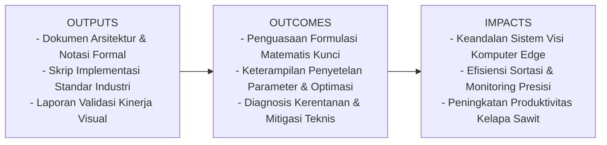
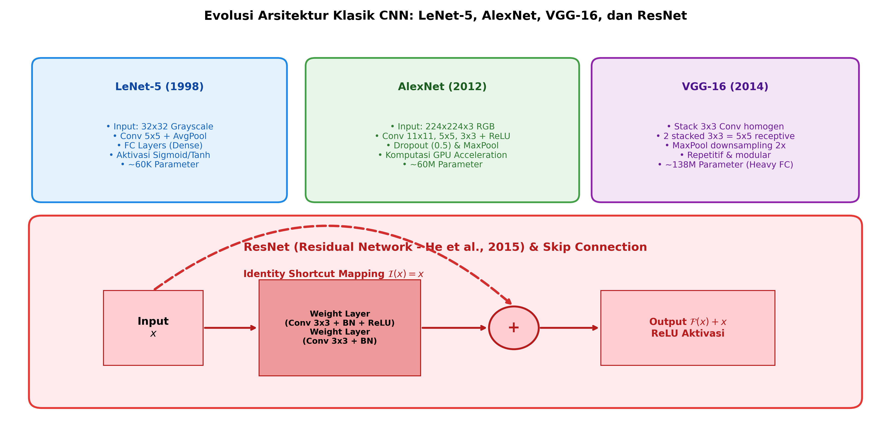

# AI Modul 12.2: Arsitektur CNN

## 1. Identitas & Kerangka Capaian Pembelajaran (Sub-CPMK)

* **Kode Modul**        : AI Modul 12.2
* **Mata Kuliah**       : Kecerdasan Buatan dan Sains Data Pertanian Presisi
* **Alokasi Waktu**     : 2 x 50 Menit (Kajian Teori & Diskusi) + 2 x 50 Menit (Eksplorasi Praktikum Mandiri)
* **Beban SKS**         : 3 SKS
* **Prasyarat**         : AI Modul 11.9 (Real-time Camera Processing) / Visi Komputer Dasar
* **Level Kognitif**    : C3 (Menerapkan), C4 (Menganalisis), C5 (Mengevaluasi)



### 1.1 Capaian Pembelajaran Khusus (Sub-CPMK)
Setelah menyelesaikan modul ini, mahasiswa dan pembelajar diharapkan mampu:
1. Membedah secara komparatif arsitektur klasik terpenting: LeNet-5, AlexNet, VGG, dan ResNet.
2. Memahami formulasi matematis degradation problem dan mekanisme pemulihan gradien melalui residual connection (identitas pintas).
3. Menganalisis parameter footprint dan kelemahan lapisan Fully-Connected masif pada VGG.
4. Mengimplementasikan blok residual (BasicBlock dan Bottleneck) berbasis PyTorch murni berstandar industri.

### 1.2 Kerangka Hasil Pembelajaran (Outputs, Outcomes, & Impacts)
* **Outputs (Keluaran Berwujud Langsung)**:
  * Dokumen rancangan arsitektur pemrosesan visual dan spesifikasi parameter model Arsitektur CNN.
  * Berkas kode program Python modular tervalidasi menggunakan PyTorch/OpenCV yang siap diuji di lapangan.
  * Grafik metrik evaluasi kinerja (akurasi, mAP, latensi inferensi, dan konsumsi memori aktivasi).
* **Outcomes (Hasil Capaian & Perubahan Kompetensi)**:
  * Penguasaan mendalam terhadap formulasi matematika dan mekanisme konvolusi/deteksi objek visual.
  * Kemampuan analitis dalam memilih konfigurasi hyperparameter dan arsitektur model sesuai batasan sumber daya perangkat keras edge.
  * Keterampilan mengidentifikasi dan memitigasi potensi kegagalan sistem visual pada kondisi lapangan heterogen.
* **Impacts (Dampak Jangka Panjang & Nilai Guna Luas)**:
  * Terwujudnya sistem otomasi inspeksi dan monitoring perkebunan yang adaptif, berkinerja tinggi, dan efisien biaya operasional.
  * Menjadi pijakan kokoh untuk riset dan implementasi kecerdasan buatan terapan berskala komersial di sektor kelapa sawit dan pertanian presisi.

---

### 1.0 Orientasi Konsep & Urgensi Pembelajaran
Dalam perkembangan visi komputer, perancangan topologi jaringan konvolusional telah mengalami lompatan paradigma yang sangat radikal: dari jaringan dangkal (*shallow networks*) dengan puluhan ribu parameter pada era 1990-an hingga jaringan sangat dalam (*very deep networks*) dengan ratusan juta parameter yang diperkuat mekanisme residual modern. Memahami evolusi arsitektur ini bukan sekadar studi retrospektif sejarah kecerdasan buatan, melainkan syarat mutlak dalam memahami prinsip rekayasa jaringan: rasio kedalaman vs lebar, efisiensi kernel homogen, mitigasi degradasi gradien, dan trade-off antara akurasi model vs latensi inferensi.

Dalam domain agroindustri—seperti pemilahan otomatis kematangan tandan buah segar (TBS) kelapa sawit di pabrik kelapa sawit (PKS) atau pemetaan tutupan lahan perkebunan via satelit resolusi tinggi—arsitektur CNN bertindak sebagai tulang punggung (*backbone*) ekstraksi representasi visual. Pemilihan arsitektur yang keliru dapat menyebabkan *inference bottleneck* pada komputer tepi (*edge devices*) atau kegagalan konvergensi saat dilatih pada dataset yang kompleks.

---

## 2. Fondasi Teori & Matematika Mendalam

### 2.1 LeNet-5 (1998) dan AlexNet (2012)

LeNet-5 (LeCun et al., 1998) mengawali arsitektur CNN modern untuk pengenalan karakter tulisan tangan (MNIST), yang mengombinasikan konvolusi $5 \times 5$, *average pooling*, dan fungsi aktivasi sigmoid/tanh. Keterbatasan komputasi CPU era tersebut membatasi kedalamannya hingga 5 lapisan terbobot.

Lompatan kuantum terjadi pada 2012 melalui AlexNet (Krizhevsky et al., 2012) yang memenangkan kompetisi ImageNet (ILSVRC 2012). AlexNet memperkenalkan 4 inovasi kunci:
1. Penggunaan fungsi aktivasi **ReLU** non-saturasi ($\max(0, x)$) yang mempercepat konvergensi gradien secara drastis dibanding sigmoid.
2. Penggunaan **Dropout** ($p=0.5$) pada lapisan *Fully-Connected* untuk memitigasi *overfitting*.
3. Akselerasi komputasi paralel menggunakan **GPU** (NVIDIA GTX 580 ganda).
4. Skema augmentasi data ekstensif (pemotongan acak dan pembalikan horizontal).

### 2.2 VGG Network (Simonyan & Zisserman, 2014)

VGG menetapkan standar baru dalam rekayasa visi komputer: menggantikan filter berukuran besar ($11 \times 11$ atau $7 \times 7$) dengan **tumpukan filter kecil homogen berukuran $3 \times 3$**.

Secara matematis, dua lapisan konvolusi $3 \times 3$ berurutan memiliki *receptive field* efektif yang setara dengan satu lapisan konvolusi $5 \times 5$:

$$RF_2 = 3 + (3 - 1) = 5$$

Tiga lapisan konvolusi $3 \times 3$ setara dengan satu lapisan $7 \times 7$:

$$RF_3 = 5 + (3 - 1) = 7$$

Namun, jika diasumsikan jumlah kanal masuk dan keluar adalah $C$:
* Parameter 3 lapisan $3 \times 3$: $3 \times (3 \times 3 \times C^2) = 27 C^2$.
* Parameter 1 lapisan $7 \times 7$: $1 \times (7 \times 7 \times C^2) = 49 C^2$.

Dengan demikian, arsitektur VGG mengurangi parameter sebesar $44.9\%$ sekaligus memberikan keuntungan penyisipan 3 fungsi non-linearitas ReLU bertingkat. Kelemahan fatal VGG adalah alokasi bobot pada tiga lapisan Fully-Connected di bagian akhir ($4096 \times 4096 \times 1000$) yang menyumbang $> 100\text{ juta parameter}$ dari total 138 juta parameter VGG-16.

### 2.3 ResNet dan Formulasi Residual Learning (He et al., 2015)

Sebelum ResNet, penambahan kedalaman lapisan jaringan ($> 20\text{ lapisan}$) tidak menghasilkan akurasi yang lebih tinggi, melainkan memicu fenomena **degradasi jaringan (*degradation problem*)**: *training error* dan *test error* keduanya memburuk secara simultan, bukan karena *overfitting*, melainkan karena sulitnya mengoptimasi fungsi pemetaan identitas pada ruang parameter non-linear yang sangat dalam.

He et al. merumuskan konsep **Residual Learning**: daripada memaksa lapisan tumpukan mendekati pemetaan dasar $H(x)$ secara langsung, biarkan lapisan tersebut mendekati pemetaan residual:

$$F(x) = H(x) - x$$

Sehingga fungsi pemetaan aslinya direkonstruksi menjadi:

$$H(x) = F(x) + x$$

Secara komputasional, formulasi ini diimplementasikan melalui koneksi pintas (*shortcut/skip connection*) yang melakukan penjumlahan elemen-demi-elemen (*element-wise addition*):

$$y = \sigma(F(x, \{W_i\}) + x)$$

Jika pemetaan residual $F(x) \to 0$ (kondisi bobot mengecil mendekati nol), maka fungsi jaringan secara alami mereduksi menjadi fungsi identitas $H(x) \approx x$. Dengan demikian, performa jaringan yang lebih dalam dijamin tidak akan lebih buruk daripada jaringan yang lebih dangkal.

Dalam perambatan balik gradien (*backpropagation*), turunan fungsi kerugian $L$ terhadap masukan blok residual $x$ adalah:

$$\frac{\partial L}{\partial x} = \frac{\partial L}{\partial y} \frac{\partial y}{\partial x} = \frac{\partial L}{\partial y} \left( \frac{\partial F}{\partial x} + 1 \right) = \frac{\partial L}{\partial y} \frac{\partial F}{\partial x} + \frac{\partial L}{\partial y}$$

Suku penambahan $+1$ pada turunan memastikan bahwa gradien $\frac{\partial L}{\partial y}$ dapat mengalir secara langsung tanpa hambatan (*unimpeded gradient highway*) menuju lapisan-lapisan paling awal jaringan, bahkan jika turunan bobot $\frac{\partial F}{\partial x}$ mendekati nol. Ini sepenuhnya mengeliminasi bahaya lenyapnya gradien (*vanishing gradient*).

---

## 3. Visualisasi Arsitektur & Diagram Alir



Diagram di atas merangkum pergeseran struktur arsitektur:
1. **LeNet & AlexNet**: Lapisan konvolusi heterogen berukuran besar diikuti lapisan padat (*dense layers*) yang boros komputasi.
2. **VGG-16**: Desain homogen berbasis tumpukan $3 \times 3$, membagi jaringan menjadi blok-blok ekstraksi fitur modular.
3. **ResNet Residual Block**: Penambahan jalur jalan pintas identitas (*identity shortcut*) yang merevolusi kedalaman jaringan hingga 50, 101, bahkan 152 lapisan tanpa degradasi optimasi.

---

## 4. Implementasi Komputasional Berstandar Industri

Di bawah ini disajikan implementasi lengkap blok bangunan residual modern: **BasicBlock** (untuk ResNet-18/34) dan perakitan arsitektur **ResNet-18 Mini** menggunakan PyTorch murni.

```python
import torch
import torch.nn as nn
from typing import Type, Optional

class ResidualBasicBlock(nn.Module):
    '''
    Blok Residual Dasar (BasicBlock) untuk ResNet-18 dan ResNet-34.
    '''
    expansion: int = 1
    
    def __init__(self, in_channels: int, out_channels: int, stride: int = 1, downsample: Optional[nn.Module] = None):
        super(ResidualBasicBlock, self).__init__()
        
        # Lapisan Konvolusi 1
        self.conv1 = nn.Conv2d(in_channels, out_channels, kernel_size=3, stride=stride, padding=1, bias=False)
        self.bn1 = nn.BatchNorm2d(out_channels)
        self.relu = nn.ReLU(inplace=True)
        
        # Lapisan Konvolusi 2
        self.conv2 = nn.Conv2d(out_channels, out_channels, kernel_size=3, stride=1, padding=1, bias=False)
        self.bn2 = nn.BatchNorm2d(out_channels)
        
        # Jalur pintas (shortcut)
        self.downsample = downsample
        self.stride = stride
        
    def forward(self, x: torch.Tensor) -> torch.Tensor:
        identity = x
        
        out = self.conv1(x)
        out = self.bn1(out)
        out = self.relu(out)
        
        out = self.conv2(out)
        out = self.bn2(out)
        
        # Jika dimensi spasial atau kanal berubah, proyeksikan identitas
        if self.downsample is not None:
            identity = self.downsample(x)
            
        out += identity
        out = self.relu(out)
        return out

class AgroResNet18(nn.Module):
    '''
    Arsitektur ResNet-18 yang Dioptimasi untuk Klasifikasi Kematangan Buah Sawit.
    '''
    def __init__(self, num_classes: int = 4):
        super(AgroResNet18, self).__init__()
        self.in_channels = 32
        
        # Stem Layer (Input Adapter)
        self.stem = nn.Sequential(
            nn.Conv2d(3, 32, kernel_size=3, stride=1, padding=1, bias=False),
            nn.BatchNorm2d(32),
            nn.ReLU(inplace=True)
        )
        
        # Tahap Residual
        self.layer1 = self._make_layer(32, blocks=2, stride=1)
        self.layer2 = self._make_layer(64, blocks=2, stride=2)
        self.layer3 = self._make_layer(128, blocks=2, stride=2)
        
        # Classifier Head (GAP + Linear)
        self.gap = nn.AdaptiveAvgPool2d((1, 1))
        self.fc = nn.Linear(128, num_classes)
        
    def _make_layer(self, out_channels: int, blocks: int, stride: int) -> nn.Sequential:
        downsample = None
        if stride != 1 or self.in_channels != out_channels:
            downsample = nn.Sequential(
                nn.Conv2d(self.in_channels, out_channels, kernel_size=1, stride=stride, bias=False),
                nn.BatchNorm2d(out_channels)
            )
            
        layers = []
        layers.append(ResidualBasicBlock(self.in_channels, out_channels, stride, downsample))
        self.in_channels = out_channels
        for _ in range(1, blocks):
            layers.append(ResidualBasicBlock(out_channels, out_channels))
            
        return nn.Sequential(*layers)
        
    def forward(self, x: torch.Tensor) -> torch.Tensor:
        x = self.stem(x)
        x = self.layer1(x)
        x = self.layer2(x)
        x = self.layer3(x)
        x = self.gap(x)
        x = torch.flatten(x, 1)
        return self.fc(x)
```

---

## 5. Studi Kasus Riil & Rekayasa Lapangan Terapan

### Klasifikasi Mutu Kematangan Tandan Buah Segar (TBS) Kelapa Sawit Berbasis ResNet

Di pabrik kelapa sawit (PKS), sortasi kematangan TBS menentukan rendemen minyak sawit mentah (*Crude Palm Oil* / CPO) dan kadar asam lemak bebas (*Free Fatty Acid* / FFA). Buah terbagi menjadi 4 fraksi standar:
* **Fraksi 0**: Mentah (*Unripe* - warna hitam keunguan, 0% brondolan lepas).
* **Fraksi 1-2**: Mengkal (*Underripe* - mulai kemerahan, < 25% brondolan lepas).
* **Fraksi 3-4**: Matang Sempurna (*Ripe* - oranye kemerahan terang, rendemen CPO optimal > 22%).
* **Fraksi 5**: Lewat Matang (*Overripe* - merah tua kecokelatan, FFA melonjak tinggi merusak kualitas).

**Tantangan Lapangan**:
Variasi sudut pandang kamera, pencahayaan alami di stasiun *loading ramp*, dan tumpukan janjang membuat model dangkal (seperti LeNet) gagal membedakan tekstur permukaan buah mengkal vs matang. VGG-16 menghasilkan akurasi yang memadai namun terlalu lambat dioperasikan pada sistem komputasi tepi (*Jetson Orin Nano*) karena besarnya footprint memori.

**Hasil Rekayasa**:
Implementasi arsitektur **ResNet-18** mampu memproses 45 *frame per second* (FPS) pada perangkat tepi, dengan akurasi klasifikasi mencapai **96.8%**, jauh mengungguli arsitektur tanpa skip connection.

---

## 6. Analisis Kompleksitas & Karakteristik Komputasi

Perbandingan arsitektur CNN pada masukan citra standar $224 \times 224 \times 3$:

| Arsitektur | Kedalaman Lapisan | Jumlah Parameter | Operasi Komputasi (FLOPs) | Akurasi Top-1 ImageNet |
| :--- | :--- | :--- | :--- | :--- |
| **LeNet-5** | 5 | ~60 Ribu | ~0.001 GFLOPs | ~N/A (Khusus Digit) |
| **AlexNet** | 8 | ~61 Juta | ~0.72 GFLOPs | ~57.1% |
| **VGG-16** | 16 | ~138 Juta | ~15.5 GFLOPs | ~71.5% |
| **ResNet-18** | 18 | ~11.7 Juta | ~1.8 GFLOPs | ~69.8% |
| **ResNet-50** | 50 | ~25.6 Juta | ~4.1 GFLOPs | ~76.1% |

**Wawasan Komputasional Kritis**:
Perhatikan bahwa **ResNet-50** memiliki parameter yang **$5.4\times$ lebih sedikit** dan FLOPs **$3.8\times$ lebih rendah** daripada **VGG-16**, namun menghasilkan akurasi ImageNet yang **$4.6\%$ lebih tinggi**. Ini adalah bukti superioritas desain *bottleneck residual* dan penggantian lapisan Fully-Connected dengan *Global Average Pooling* (GAP).

---

## 7. Kekeliruan Metodologis, Potensi Kegagalan, & Mitigasi Teknis

| Masalah Teknis | Gejala Visual / Metrik | Akar Penyebab | Tindakan Mitigasi Teruji |
| :--- | :--- | :--- | :--- |
| **Dimension Mismatch pada Skip Connection** | Galat runtime `RuntimeError: The size of tensor a (64) must match the size of tensor b (32) at non-singleton dimension 1` | Dimensi kanal masukan $x$ berbeda dengan keluaran residual $F(x)$, biasanya terjadi saat *stride=2* atau penambahan kanal. | Sisipkan lapisan proyeksi $1 \times 1$ konvolusi dengan *stride* identik pada jalur identitas (`downsample = nn.Sequential(nn.Conv2d(..., kernel_size=1, stride=stride))`). |
| **Pengabaian Batch Normalization sebelum Addition** | Pelatihan model ResNet tidak stabil, loss berosilasi liar atau meledak. | Menempatkan aktivasi ReLU sebelum operasi penjumlahan residual (`out = relu(F(x)) + x`), bukan setelah penjumlahan (`out = relu(F(x) + x)`). | Ikuti konvensi standar: `out = self.bn2(out); out += identity; out = self.relu(out)`. |
| **Overparameterization pada Dataset Terbatas** | Akurasi training mencapai 100%, namun akurasi validasi macet di 65% (Overfitting ekstrem). | Menggunakan VGG-16 atau ResNet-101 tanpa pre-training pada dataset lokal berukuran $< 2.000$ sampel. | Gunakan arsitektur kompak seperti ResNet-18 mini atau terapkan strategi *Transfer Learning* dengan membekukan bobot (*weight freezing*). |

---

## 8. Latihan Terbimbing & Mandiri Berjenjang

### Latihan Terbimbing (Guided Practice)
1. **Analisis Parameter**: Hitung jumlah parameter pada satu blok `ResidualBasicBlock` di mana `in_channels = 64` dan `out_channels = 64` (tanpa bias karena menggunakan *BatchNorm*).
   * *Solusi*:
     * Conv1: $64 \times 64 \times 3 \times 3 = 36.864$ bobot.
     * BN1: $2 \times 64 = 128$ parameter ($\gamma$ dan $\beta$).
     * Conv2: $64 \times 64 \times 3 \times 3 = 36.864$ bobot.
     * BN2: $2 \times 64 = 128$ parameter.
     * Total Parameter Blok: $36.864 + 128 + 36.864 + 128 = 73.984$ parameter.

### Latihan Mandiri (Independent Problem Set)
1. **Soal 1 (Konseptual & Matematis)**: Turunkan secara analitis mengapa lapisan Fully-Connected di akhir jaringan VGG-16 ($7 \times 7 \times 512 \to 4096$) membutuhkan parameter bobot lebih dari 100 juta. Jelaskan bagaimana *Global Average Pooling* (GAP) pada ResNet memangkas jumlah ini menjadi hanya beberapa ribu parameter.
2. **Soal 2 (Komputasional)**: Rancang arsitektur **ResNet Bottleneck Block** (yang digunakan pada ResNet-50/101/152) yang menggunakan kompresi $1 \times 1$ conv $\to 3 \times 3$ conv $\to 1 \times 1$ conv ekspansi ($4\times$). Verifikasi bahwa tensor masukan berdimensi $(N, 256, 14, 14)$ menghasilkan dimensi keluaran yang konsisten.

---

## 9. Jembatan Konsep (Bridging) ke AI Modul 12.3: Pooling

Pada modul ini, kita telah menyaksikan bagaimana arsitektur modern mereduksi dimensi spasial secara berkala sembari melipatgandakan jumlah kanal fitur. Di samping *strided convolution*, operasi subsampling yang paling fundamental adalah **Pooling**.

Pada **AI Modul 12.3: Pooling**, kita akan membedah secara mendalam mekanika matematika di balik **Max Pooling**, **Average Pooling**, dan terobosan **Global Average Pooling (GAP)**: bagaimana pooling menciptakan invariansi terhadap translasi dan distorsi citra, serta dampaknya terhadap rekonstruksi fitur spasial.

---

## 10. Daftar Pustaka Komprehensif Berstandar Akademik

1. LeCun, Y., et al. (1998). *Gradient-based learning applied to document recognition*. Proceedings of the IEEE, 86(11), 2278-2324.
2. Krizhevsky, A., Sutskever, I., & Hinton, G. E. (2012). *ImageNet classification with deep convolutional neural networks*. Advances in Neural Information Processing Systems (NeurIPS 2012), 25, 1097-1105.
3. Simonyan, K., & Zisserman, A. (2014). *Very deep convolutional networks for large-scale image recognition*. arXiv preprint arXiv:1409.1556 (ICLR 2015).
4. He, K., Zhang, X., Ren, S., & Sun, J. (2016). *Deep residual learning for image recognition*. Proceedings of the IEEE Conference on Computer Vision and Pattern Recognition (CVPR), 770-778.
5. Lin, M., Chen, Q., & Yan, S. (2013). *Network in network*. arXiv preprint arXiv:1312.4400 (ICLR 2014).
