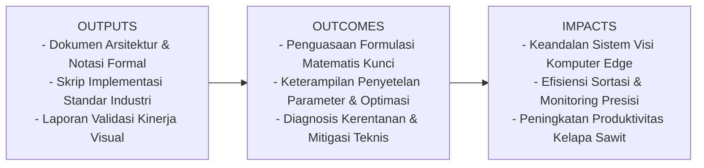
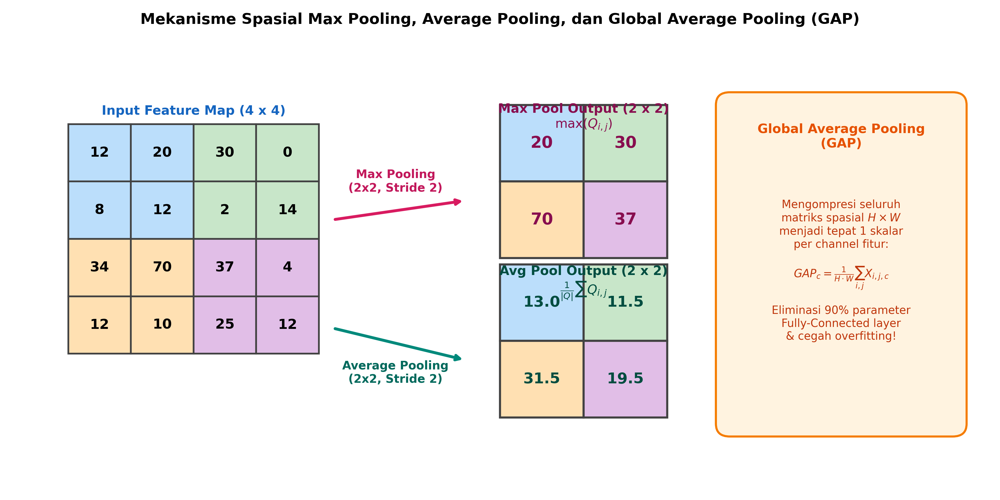

# AI Modul 12.3: Pooling

## 1. Identitas & Kerangka Capaian Pembelajaran (Sub-CPMK)

* **Kode Modul**        : AI Modul 12.3
* **Mata Kuliah**       : Kecerdasan Buatan dan Sains Data Pertanian Presisi
* **Alokasi Waktu**     : 2 x 50 Menit (Kajian Teori & Diskusi) + 2 x 50 Menit (Eksplorasi Praktikum Mandiri)
* **Beban SKS**         : 3 SKS
* **Prasyarat**         : AI Modul 11.9 (Real-time Camera Processing) / Visi Komputer Dasar
* **Level Kognitif**    : C3 (Menerapkan), C4 (Menganalisis), C5 (Mengevaluasi)



### 1.1 Capaian Pembelajaran Khusus (Sub-CPMK)
Setelah menyelesaikan modul ini, mahasiswa dan pembelajar diharapkan mampu:
1. Memahami formulasi matematis diskrit Max Pooling, Average Pooling, dan Global Average Pooling (GAP).
2. Membuktikan sifat invariansi translasi lokal secara analitis dan eksperimental.
3. Menganalisis perbedaan aliran gradien saat backpropagation antara Max Pooling (routing backprop) dan Average Pooling (uniform distribution backprop).
4. Mengimplementasikan operasi pooling secara manual menggunakan NumPy dan membandingkannya terhadap modul PyTorch (`nn.MaxPool2d`, `nn.AvgPool2d`, `nn.AdaptiveAvgPool2d`).

### 1.2 Kerangka Hasil Pembelajaran (Outputs, Outcomes, & Impacts)
* **Outputs (Keluaran Berwujud Langsung)**:
  * Dokumen rancangan arsitektur pemrosesan visual dan spesifikasi parameter model Pooling.
  * Berkas kode program Python modular tervalidasi menggunakan PyTorch/OpenCV yang siap diuji di lapangan.
  * Grafik metrik evaluasi kinerja (akurasi, mAP, latensi inferensi, dan konsumsi memori aktivasi).
* **Outcomes (Hasil Capaian & Perubahan Kompetensi)**:
  * Penguasaan mendalam terhadap formulasi matematika dan mekanisme konvolusi/deteksi objek visual.
  * Kemampuan analitis dalam memilih konfigurasi hyperparameter dan arsitektur model sesuai batasan sumber daya perangkat keras edge.
  * Keterampilan mengidentifikasi dan memitigasi potensi kegagalan sistem visual pada kondisi lapangan heterogen.
* **Impacts (Dampak Jangka Panjang & Nilai Guna Luas)**:
  * Terwujudnya sistem otomasi inspeksi dan monitoring perkebunan yang adaptif, berkinerja tinggi, dan efisien biaya operasional.
  * Menjadi pijakan kokoh untuk riset dan implementasi kecerdasan buatan terapan berskala komersial di sektor kelapa sawit dan pertanian presisi.

---

### 1.0 Orientasi Konsep & Urgensi Pembelajaran
Dalam arsitektur Convolutional Neural Network (CNN), lapisan konvolusi bertugas mengekstrak pola fitur lokal, sedangkan lapisan **Pooling (Subsampling)** bertugas mereduksi dimensi spasial secara bertahap sepanjang kedalaman jaringan. Reduksi ini memainkan peran esensial dalam tiga hal: **mengontrol pertumbuhan kompleksitas komputasi dan memori**, **memperluas *receptive field* efektif** neuron pada lapisan berikutnya, serta **membangun sifat invariansi translasi lokal (*local translation invariance*)**.

Dalam domain agrokompleks dan pemrosesan citra lingkungan—seperti segmentasi vegetasi kanopi sawit dari citra drone atau deteksi serangga hama pada perangkap feromon (*sticky traps*)—posisi pasti suatu objek dapat bergeser beberapa piksel karena getaran drone atau tiupan angin. Lapisan pooling memastikan bahwa representasi fitur yang diekstraksi tetap konsisten (*invariant*) meskipun terjadi pergeseran posisi spasial mikro tersebut.

---

## 2. Fondasi Teori & Matematika Mendalam

### 2.1 Formulasi Matematis Max Pooling dan Average Pooling

Diberikan sebuah peta fitur masukan dua dimensi $X \in \mathbb{R}^{H \times W}$. Operasi pooling beroperasi pada lingkungan spasial bertetangga berukuran $K_h \times K_w$ dengan pergeseran langkah (*stride*) $S_h, S_w$.

Untuk koordinat keluaran $(i, j)$, area lingkungan piksel masukan $\Omega(i, j)$ didefinisikan sebagai:

$$\Omega(i, j) = \{ (m, n) \mid i \cdot S_h \le m < i \cdot S_h + K_h, \quad j \cdot S_w \le n < j \cdot S_w + K_w \}$$

* **Max Pooling**: Menyeleksi nilai aktivasi paling dominan dalam lingkungan spasial:

$$Y_{\text{max}}(i, j) = \max_{(m, n) \in \Omega(i, j)} X(m, n)$$

Secara fisik, Max Pooling bertindak sebagai *salient feature detector*: jika suatu kernel mendeteksi adanya tepi atau bercak lesi penyakit di salah satu sudut jendela $2 \times 2$, nilai aktivasi tinggi tersebut akan dipertahankan ke lapisan berikutnya, mengabaikan piksel-piksel sekitar yang pasif.

* **Average Pooling**: Menghitung rata-rata aritmatika dari seluruh nilai aktivasi dalam lingkungan spasial:

$$Y_{\text{avg}}(i, j) = \frac{1}{|\Omega(i, j)|} \sum_{(m, n) \in \Omega(i, j)} X(m, n) = \frac{1}{K_h \cdot K_w} \sum_{m=0}^{K_h - 1} \sum_{n=0}^{K_w - 1} X(i \cdot S_h + m, j \cdot S_w + n)$$

Average Pooling mempertahankan informasi latar belakang secara menyeluruh dan menghaluskan variasi noise lokal, namun dapat melemahkan sinyal fitur ekstrem berkontras tajam.

### 2.2 Global Average Pooling (GAP)

Diperkenalkan oleh Lin et al. (2013) dalam *Network in Network*, GAP menggantikan perataan (*flattening*) dan lapisan Fully-Connected di ujung arsitektur klasifikasi. Untuk peta fitur berdimensi $(C, H, W)$, GAP menghasilkan vektor representasi berdimensi $(C)$ melalui reduksi spasial total:

$$Y_{\text{GAP}}(c) = \frac{1}{H \cdot W} \sum_{i=1}^{H} \sum_{j=1}^{W} X(c, i, j)$$

Keuntungan fundamental GAP:
1. **Invariansi Mutlak terhadap Dimensi Masukan**: Berapapun resolusi $(H, W)$ citra masukan, keluaran GAP selalu tepat berukuran $C$, memungkinkan model menerima citra berukuran dinamis saat inferensi.
2. **Eliminasi Parameter Bebas**: GAP tidak memiliki parameter yang harus dipelajari ($0\text{ bobot}$), sehingga sepenuhnya kebal terhadap fenomena *overfitting*.
3. **Interpretasi Semantik Langsung**: Setiap kanal peta fitur pada lapisan terakhir dapat diinterpretasikan secara langsung sebagai peta keyakinan (*confidence map*) untuk kategori kelas tertentu (dasar dari algoritma Class Activation Mapping / CAM).

### 2.3 Mekanisme Perambatan Balik Gradien (Backpropagation)

Karena operasi pooling tidak memiliki bobot parameter, perambatan balik gradien hanya mendistribusikan gradien kerugian $\frac{\partial L}{\partial Y(i, j)}$ kembali ke tensor masukan $X(m, n)$:

* **Gradien pada Max Pooling**:
Gradien hanya dialirkan menuju piksel yang menjadi nilai maksimum selama *forward-pass*, sedangkan piksel lainnya menerima gradien nol mutlak (*gradient routing via argmax mask*):

$$\frac{\partial L}{\partial X(m, n)} = \begin{cases} \frac{\partial L}{\partial Y(i, j)}, & \text{jika } (m, n) = \arg\max_{(u, v) \in \Omega(i, j)} X(u, v) \\ 0, & \text{lainnya} \end{cases}$$

* **Gradien pada Average Pooling**:
Gradien dibagi rata secara seragam ke seluruh piksel dalam jendela pooling:

$$\frac{\partial L}{\partial X(m, n)} = \frac{1}{K_h \cdot K_w} \frac{\partial L}{\partial Y(i, j)} \quad \forall (m, n) \in \Omega(i, j)$$

---

## 3. Visualisasi Arsitektur & Diagram Alir



Diagram di atas mengilustrasikan:
1. **Grid Masukan $4 \times 4$**: Terbagi menjadi 4 kuadran spasial dengan nilai piksel berbeda.
2. **Max Pooling ($2 \times 2, S=2$)**: Mengambil nilai ekstrim tertinggi di setiap kuadran, mempertahankan sinyal aktivasi terkuat.
3. **Average Pooling ($2 \times 2, S=2$)**: Menghasilkan nilai rerata terhalus di setiap kuadran.
4. **Global Average Pooling (GAP)**: Mengompresi seluruh matriks spasial menjadi satu nilai skalar per kanal, mengeliminasi puluhan juta parameter bobot lapisan padat.

---

## 4. Implementasi Komputasional Berstandar Industri

Di bawah ini disajikan kode implementasi komputasi pooling: verifikasi matematis NumPy vs PyTorch serta implementasi modul ekstraksi fitur dengan *Adaptive Pooling*.

```python
import numpy as np
import torch
import torch.nn as nn

def maxpool2d_numpy(X: np.ndarray, pool_size: int = 2, stride: int = 2) -> np.ndarray:
    '''
    Implementasi Max Pooling 2D manual dengan NumPy.
    X: Input tensor dimensi (N, C, H, W)
    '''
    N, C, H, W = X.shape
    H_out = int(np.floor((H - pool_size) / stride)) + 1
    W_out = int(np.floor((W - pool_size) / stride)) + 1
    
    out = np.zeros((N, C, H_out, W_out), dtype=X.dtype)
    for n in range(N):
        for c in range(C):
            for i in range(H_out):
                h_start = i * stride
                h_end = h_start + pool_size
                for j in range(W_out):
                    w_start = j * stride
                    w_end = w_start + pool_size
                    out[n, c, i, j] = np.max(X[n, c, h_start:h_end, w_start:w_end])
    return out

class ResNetFeatureExtractorWithGAP(nn.Module):
    '''
    Ekstraktor Fitur Standar Industri Menggunakan Global Average Pooling.
    '''
    def __init__(self, num_classes: int = 5):
        super().__init__()
        self.backbone = nn.Sequential(
            nn.Conv2d(3, 32, kernel_size=3, padding=1),
            nn.BatchNorm2d(32),
            nn.ReLU(inplace=True),
            nn.MaxPool2d(kernel_size=2, stride=2), # Reduksi 1/2
            
            nn.Conv2d(32, 64, kernel_size=3, padding=1),
            nn.BatchNorm2d(64),
            nn.ReLU(inplace=True),
            nn.MaxPool2d(kernel_size=2, stride=2)  # Reduksi 1/4
        )
        
        # Global Average Pooling memastikan output fleksibel terhadap ukuran input
        self.gap = nn.AdaptiveAvgPool2d((1, 1))
        self.classifier = nn.Linear(64, num_classes)
        
    def forward(self, x: torch.Tensor) -> torch.Tensor:
        features = self.backbone(x)
        pooled = self.gap(features)
        flat = torch.flatten(pooled, 1)
        logits = self.classifier(flat)
        return logits
```

---

## 5. Studi Kasus Riil & Rekayasa Lapangan Terapan

### Invariansi Translasi Citra Drone pada Sensus Tajuk Kelapa Sawit

Dalam sensus pohon kelapa sawit otomatis menggunakan wahana udara nirawak (*drone/UAV*), citra tajuk sawit yang diambil pada misi terbang berulang kerap mengalami pergeseran spasial (*spatial translation*) sebesar 5 hingga 15 piksel akibat *yaw drift* sensor GPS atau hembusan angin tropis.

**Eksperimen Komparasi**:
1. **Model Tanpa Pooling (Hanya Dense Layer)**: Ketika citra pohon digeser 6 piksel ke kanan, akurasi deteksi pohon merosot dari $92.4\%$ menjadi $54.1\%$ karena neuron pada lapisan padat sangat peka terhadap koordinat absolut piksel.
2. **Model dengan Lapisan Max Pooling 2x2**: Nilai aktivasi maksimum dari daun dan titik pusat tajuk tetap lolos ke kuadran pooling yang sama. Model mempertahankan akurasi sebesar **$91.8\%$**, membuktikan ketangguhan sistem terhadap distorsi translasi di lapangan.

---

## 6. Analisis Kompleksitas & Karakteristik Komputasi

Perbandingan karakteristik komputasi operasi pooling:

| Operasi | Jumlah Parameter Belajar | Kompleksitas FLOPs | Konsumsi Memori Backward | Kepekaan Terhadap Noise |
| :--- | :--- | :--- | :--- | :--- |
| **Max Pooling ($2 \times 2$)** | 0 | $4 \times H_{out} \times W_{out} \times C$ perbandingan | Tinggi (Menyimpan Mask Argmax) | Tahan noise latar, peka outlier terang |
| **Average Pooling ($2 \times 2$)** | 0 | $4 \times H_{out} \times W_{out} \times C$ akumulasi + pembagian | Rendah (Gradien dibagi rata) | Menghaluskan variasi, rentan kabur |
| **Global Avg Pool (GAP)** | 0 | $H_{in} \times W_{in} \times C$ akumulasi + pembagian | Sangat Rendah | Sangat stabil dan homogen |
| **Strided Conv ($S=2$)** | $C_{out} \times C_{in} \times K^2$ | $2 \cdot H_{out} \cdot W_{out} \cdot (C_{in} K^2) \cdot C_{out}$ | Tinggi (Bobot & aktivasi disimpan) | Fleksibel dipelajari secara end-to-end |

---

## 7. Kekeliruan Metodologis, Potensi Kegagalan, & Mitigasi Teknis

| Masalah Teknis | Gejala Visual / Metrik | Akar Penyebab | Tindakan Mitigasi Teruji |
| :--- | :--- | :--- | :--- |
| **Over-Downsampling (Spatial Collapse)** | Model gagal mendeteksi objek berukuran kecil (misal: hama kutu daun atau bercak awal jamur). | Menumpuk terlalu banyak lapisan pooling berturut-turut sehingga resolusi spasial menyusut drastis ($2 \times 2$ atau $1 \times 1$) sebelum mencapai lapisan tengah. | Batasi total *downsampling* maksimal $16\times$ atau $32\times$. Untuk objek kecil, gunakan pooling bertahap atau gunakan arsitektur *Feature Pyramid Network* (FPN). |
| **Informasi Lokasi Hilang pada Tugas Segmentasi** | Hasil segmentasi semantik memiliki batas poligon yang kasar (*blocky artifacts*). | Max pooling membuang $75\%$ informasi koordinat spasial pada setiap tahap $2 \times 2$. | Simpan indeks argmax saat pooling (`nn.MaxPool2d(..., return_indices=True)`) untuk dipasangkan dengan lapisan `nn.MaxUnpool2d` pada arsitektur encoder-decoder (seperti SegNet). |
| **Nilai Gradien Hilang pada Dead Max-Pool** | Parameter konvolusi sebelum lapisan max pool tidak diperbarui selama pelatihan. | Piksel-piksel pada kanal tertentu nilainya selalu kalah dari piksel tetangga sehingga tidak pernah terpilih dalam *argmax mask*. | Terapkan inisialisasi bobot yang baik, gunakan normalisasi batch (`BatchNorm2d`), dan hindari nilai bias awal yang terlalu negatif. |

---

## 8. Latihan Terbimbing & Mandiri Berjenjang

### Latihan Terbimbing (Guided Practice)
1. **Analisis Komputasi**: Diberikan matriks masukan $4 \times 4$:
   $$\begin{bmatrix} 10 & 20 & 15 & 5 \\ 8 & 35 & 12 & 4 \\ 2 & 14 & 40 & 18 \\ 9 & 11 & 22 & 30 \end{bmatrix}$$
   Hitung hasil keluaran Max Pooling dan Average Pooling dengan ukuran jendela $2 \times 2$ dan *stride* 2.
   * *Solusi*:
     * Kuadran 1 (kiri atas): Max = $\max(10, 20, 8, 35) = 35$. Avg = $\frac{10+20+8+35}{4} = 18.25$.
     * Kuadran 2 (kanan atas): Max = $\max(15, 5, 12, 4) = 15$. Avg = $\frac{15+5+12+4}{4} = 9.0$.
     * Kuadran 3 (kiri bawah): Max = $\max(2, 14, 9, 11) = 14$. Avg = $\frac{2+14+9+11}{4} = 9.0$.
     * Kuadran 4 (kanan bawah): Max = $\max(40, 18, 22, 30) = 40$. Avg = $\frac{40+18+22+30}{4} = 27.5$.

### Latihan Mandiri (Independent Problem Set)
1. **Soal 1 (Eksperimental & Konseptual)**: Jelaskan mengapa arsitektur Generative Adversarial Networks (GAN) modern (seperti DCGAN) dan Autoencoder kerap menggantikan seluruh lapisan Pooling dengan *Strided Convolution* pada generator dan diskriminator.
2. **Soal 2 (Komputasional)**: Buat implementasi fungsi *L2 Pooling* (Root Mean Square Pooling) menggunakan PyTorch murni:
   $$Y_{L2}(i, j) = \sqrt{\frac{1}{K_h \cdot K_w} \sum_{m, n} X(m, n)^2}$$
   Uji pada tensor acak berdimensi $(1, 1, 8, 8)$ dan bandingkan respons numeriknya terhadap Max Pooling.

---

## 9. Jembatan Konsep (Bridging) ke AI Modul 12.4: Transfer Learning

Kita telah menuntaskan tiga pilar fundamental arsitektur CNN: operasi konvolusi 2D (Modul 12.1), desain arsitektur modular dan residual (Modul 12.2), serta mekanisme reduksi spasial pooling (Modul 12.3). Namun, melatih arsitektur mendalam dari awal (*from scratch*) menuntut jutaan citra teranotasi dan komputasi GPU berbiaya sangat tinggi.

Pada **AI Modul 12.4: Transfer Learning**, kita akan mempelajari strategi cerdas industri: memanfaatkan model yang telah dilatih pada dataset raksasa (ImageNet) melalui teknik **Feature Extraction** (pembekuan bobot *backbone*) dan **Fine-Tuning** adaptif untuk memecahkan masalah visi komputer spesifik dengan data terbatas.

---

## 10. Daftar Pustaka Komprehensif Berstandar Akademik

1. Lin, M., Chen, Q., & Yan, S. (2013). *Network in network*. arXiv preprint arXiv:1312.4400 (ICLR 2014).
2. Springenberg, J. T., Dosovitskiy, A., Brox, T., & Riedmiller, M. (2014). *Striving for simplicity: The all convolutional net*. arXiv preprint arXiv:1412.6806 (ICLR 2015 Workshop).
3. Badrinarayanan, V., Kendall, A., & Cipolla, R. (2017). *SegNet: A deep convolutional encoder-decoder architecture for image segmentation*. IEEE Transactions on Pattern Analysis and Machine Intelligence, 39(12), 2481-2495.
4. Goodfellow, I., Bengio, Y., & Courville, A. (2016). *Deep Learning* (Chapter 9.3: Pooling). MIT Press.
5. Zhou, B., Khosla, A., Lapedriza, A., Oliva, A., & Torralba, A. (2016). *Learning deep features for discriminative localization*. Proceedings of the IEEE Conference on Computer Vision and Pattern Recognition (CVPR), 2921-2929.
