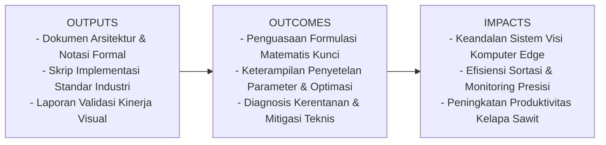
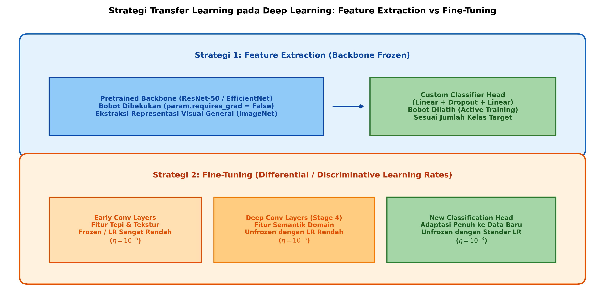

# AI Modul 12.4: Transfer Learning

## 1. Identitas & Kerangka Capaian Pembelajaran (Sub-CPMK)

* **Kode Modul**        : AI Modul 12.4
* **Mata Kuliah**       : Kecerdasan Buatan dan Sains Data Pertanian Presisi
* **Alokasi Waktu**     : 2 x 50 Menit (Kajian Teori & Diskusi) + 2 x 50 Menit (Eksplorasi Praktikum Mandiri)
* **Beban SKS**         : 3 SKS
* **Prasyarat**         : AI Modul 11.9 (Real-time Camera Processing) / Visi Komputer Dasar
* **Level Kognitif**    : C3 (Menerapkan), C4 (Menganalisis), C5 (Mengevaluasi)



### 1.1 Capaian Pembelajaran Khusus (Sub-CPMK)
Setelah menyelesaikan modul ini, mahasiswa dan pembelajar diharapkan mampu:
1. Memahami fondasi teoretis domain adaptation, covariate shift, dan mitigasi fenomena catastrophic forgetting.
2. Menguasai dua strategi utama Transfer Learning: Feature Extraction (pembekuan bobot) dan Fine-Tuning (penyesuaian bertahap).
3. Menerapkan skema Differential Learning Rates (laju pembelajaran diskriminatif) berbasis PyTorch parameter groups.
4. Membangun model transfer learning untuk deteksi defisiensi unsur hara makro/mikro pada daun bibit kelapa sawit dengan dataset terbatas.

### 1.2 Kerangka Hasil Pembelajaran (Outputs, Outcomes, & Impacts)
* **Outputs (Keluaran Berwujud Langsung)**:
  * Dokumen rancangan arsitektur pemrosesan visual dan spesifikasi parameter model Transfer Learning.
  * Berkas kode program Python modular tervalidasi menggunakan PyTorch/OpenCV yang siap diuji di lapangan.
  * Grafik metrik evaluasi kinerja (akurasi, mAP, latensi inferensi, dan konsumsi memori aktivasi).
* **Outcomes (Hasil Capaian & Perubahan Kompetensi)**:
  * Penguasaan mendalam terhadap formulasi matematika dan mekanisme konvolusi/deteksi objek visual.
  * Kemampuan analitis dalam memilih konfigurasi hyperparameter dan arsitektur model sesuai batasan sumber daya perangkat keras edge.
  * Keterampilan mengidentifikasi dan memitigasi potensi kegagalan sistem visual pada kondisi lapangan heterogen.
* **Impacts (Dampak Jangka Panjang & Nilai Guna Luas)**:
  * Terwujudnya sistem otomasi inspeksi dan monitoring perkebunan yang adaptif, berkinerja tinggi, dan efisien biaya operasional.
  * Menjadi pijakan kokoh untuk riset dan implementasi kecerdasan buatan terapan berskala komersial di sektor kelapa sawit dan pertanian presisi.

---

### 1.0 Orientasi Konsep & Urgensi Pembelajaran
Dalam aplikasi praktis visi komputer di industri agrokompleks, kehutanan, dan perkebunan, kendala terbesar bukanlah ketiadaan arsitektur model canggih, melainkan kelangkaan data beranotasi berkualitas tinggi (*annotated data scarcity*). Melatih arsitektur dalam seperti ResNet-50 dari inisialisasi bobot acak (*from scratch*) menuntut ratusan ribu hingga jutaan citra teranotasi dan daya komputasi klaster GPU berbiaya sangat tinggi. Jika dipaksakan pada dataset kecil ($< 1.000$ sampel), model akan mengalami *overfitting* fatal: menghafal sampel latih alih-alih mempelajari pola visual esensial.

**Transfer Learning** merevolusi lanskap ini melalui transfer pengetahuan induktif (*inductive knowledge transfer*). Model yang telah dilatih secara masif pada dataset berskala besar (seperti ImageNet dengan 1,2 juta citra dan 1.000 kelas) telah menginternalisasi filter representasi visual universal pada lapisan-lapisan awalnya—seperti detektor tepi Gabor, tekstur permukaan, kurvatur, dan relasi spasial dasar. Representasi kaya ini dapat ditransfer untuk menyelesaikan tugas-tugas visual spesifik domain baru dengan hanya membutuhkan puluhan hingga ratusan sampel citra per kelas.

---

## 2. Fondasi Teori & Matematika Mendalam

### 2.1 Formulasi Matematis Transfer Learning

Secara formal, sebuah domain $\mathcal{D}$ didefinisikan oleh ruang fitur $\mathcal{X}$ dan distribusi probabilitas marginal $P(X)$:

$$\mathcal{D} = \{ \mathcal{X}, P(X) \}, \quad X = \{x_1, \dots, x_n\} \in \mathcal{X}$$

Sebuah tugas (*task*) $\mathcal{T}$ pada domain $\mathcal{D}$ terdiri atas ruang label $\mathcal{Y}$ dan fungsi pemetaan prediktif $f(\cdot)$ yang memodelkan distribusi probabilitas bersyarat $P(Y \mid X)$:

$$\mathcal{T} = \{ \mathcal{Y}, P(Y \mid X) \}$$

Diberikan sebuah **Domain Sumber** $\mathcal{D}_S$ (misal: ImageNet dengan citra objek umum) dan **Tugas Sumber** $\mathcal{T}_S$, serta **Domain Target** $\mathcal{D}_T$ (misal: citra daun kelapa sawit di lapangan) dan **Tugas Target** $\mathcal{T}_T$. Transfer Learning bertujuan untuk meningkatkan estimasi fungsi prediktif target $f_T(\cdot)$ dengan memanfaatkan pengetahuan dari $\mathcal{D}_S$ dan $\mathcal{T}_S$, di mana $\mathcal{D}_S \neq \mathcal{D}_T$ atau $\mathcal{T}_S \neq \mathcal{T}_T$.

### 2.2 Feature Extraction vs Fine-Tuning

Sebuah arsitektur CNN dapat didekomposisi menjadi dua komponen fungsional:
1. **Ekstraktor Fitur (*Backbone*)** $g_{\theta}(x)$: Memetakan citra masukan $x \in \mathbb{R}^{H \times W \times C}$ menjadi vektor representasi laten berdaya pisah tinggi $z \in \mathbb{R}^D$.
2. **Kepala Pengklasifikasi (*Classifier Head*)** $h_{\phi}(z)$: Memetakan vektor laten $z$ menjadi logits probabilitas kelas $\hat{y} \in \mathbb{R}^K$.

#### Strategi 1: Feature Extraction
Seluruh parameter backbone $\theta$ dibekukan (*frozen*), sehingga gradien tidak dihitung untuk lapisan-lapisan ini selama *backpropagation*:

$$\nabla_{\theta} \mathcal{L} = 0, \quad \theta^{(t+1)} = \theta^{(t)}$$

Hanya parameter kepala pengklasifikasi baru $\phi$ yang diperbarui:

$$\phi^{(t+1)} = \phi^{(t)} - \eta \nabla_{\phi} \mathcal{L}$$

Strategi ini sangat cepat secara komputasi, kebal terhadap *overfitting*, dan sangat ideal jika ukuran dataset target $N < 500$ sampel.

#### Strategi 2: Fine-Tuning Bergradasi (Discriminative Fine-Tuning)
Pada fine-tuning, seluruh atau sebagian lapisan backbone diaktifkan kembali untuk menerima pembaruan gradien. Namun, menerapkan laju pembelajaran (*learning rate*) tunggal yang seragam ($\eta$) pada seluruh jaringan dapat memicu **Catastrophic Forgetting**: bobot ekstraksi fitur universal pada lapisan awal rusak secara drastis oleh sinyal gradien besar dari kepala acak baru.

Untuk mencegahnya, diterapkan laju pembelajaran bergradasi (*discriminative learning rates*):

$$\eta_1 < \eta_2 < \dots < \eta_L < \eta_{\text{head}}$$

Di mana rasio peluruhan laju pembelajaran antar-lapisan $\xi \in [0.1, 0.5]$ didefinisikan sebagai:

$$\eta_l = \eta_{\text{head}} \cdot \xi^{L - l}$$

Dengan skema ini, lapisan awal yang merepresentasikan filter primitif (garis, sudut, tekstur) hanya bergeser secara halus ($\eta \approx 10^{-6}$), sedangkan lapisan semantik atas dan kepala klasifikasi beradaptasi secara dinamis terhadap pola spesifik target ($\eta \approx 10^{-3}$).

---

## 3. Visualisasi Arsitektur & Diagram Alir



Diagram di atas mengilustrasikan perbedaan arsitektur:
1. **Feature Extraction**: Membekukan seluruh lapisan konvolusi (*parameter requires_grad = False*) dan hanya melatih lapisan linier akhir.
2. **Fine-Tuning**: Mengaktifkan gradien pada lapisan konvolusi dalam (*deep conv stages*) dengan laju pembelajaran diferensial bertingkat.

---

## 4. Implementasi Komputasional Berstandar Industri

Di bawah ini disajikan implementasi lengkap Transfer Learning menggunakan PyTorch dengan *Discriminative Learning Rates*:

```python
import torch
import torch.nn as nn
import torchvision.models as models
from typing import List, Dict

def create_agro_transfer_model(num_classes: int = 5, freeze_backbone: bool = True) -> nn.Module:
    '''
    Membangun model Transfer Learning berbasis ResNet-18 Pretrained.
    '''
    # Muat arsitektur ResNet-18 dengan bobot resmi ImageNet
    model = models.resnet18(weights=models.ResNet18_Weights.DEFAULT)
    
    if freeze_backbone:
        # Bekukan seluruh parameter backbone
        for param in model.parameters():
            param.requires_grad = False
            
    # Ganti classifier head lama (1000 kelas) dengan Custom Head untuk agrokompleks
    in_features = model.fc.in_features
    model.fc = nn.Sequential(
        nn.Dropout(p=0.4),
        nn.Linear(in_features, 128),
        nn.ReLU(inplace=True),
        nn.Dropout(p=0.2),
        nn.Linear(128, num_classes)
    )
    return model

def build_differential_optimizer(model: nn.Module, base_lr: float = 1e-3) -> torch.optim.Optimizer:
    '''
    Membangun optimizer AdamW dengan 3 kelompok laju pembelajaran bertingkat.
    '''
    params_group: List[Dict] = [
        {'params': model.layer1.parameters(), 'lr': base_lr * 0.01}, # Early conv: lr = 1e-5
        {'params': model.layer2.parameters(), 'lr': base_lr * 0.05},
        {'params': model.layer3.parameters(), 'lr': base_lr * 0.10},
        {'params': model.layer4.parameters(), 'lr': base_lr * 0.20}, # Deep conv:  lr = 2e-4
        {'params': model.fc.parameters(),     'lr': base_lr}         # New head:   lr = 1e-3
    ]
    return torch.optim.AdamW(params_group, weight_decay=1e-4)
```

---

## 5. Studi Kasus Riil & Rekayasa Lapangan Terapan

### Diagnosis Defisiensi Hara Makro Daun Bibit Sawit dengan Dataset Terbatas

Di perkebunan kelapa sawit, defisiensi hara makro (Nitrogen / N, Kalium / K, Magnesium / Mg, dan Boron / B) menimbulkan gejala klorosis visual yang spesifik:
* **Defisiensi N**: Daun menguning merata dari pucuk ke pangkal (*overall pale green to yellow*).
* **Defisiensi K**: Muncul bintik-bintik oranye tembus cahaya (*confluent orange spotting*).
* **Defisiensi Mg**: Daun tua berwarna jingga cerah pada helai yang terpapar sinar matahari langsung, sementara bagian ternaungi tetap hijau (*orange banding*).
* **Defisiensi B**: Daun mengkerut membentuk ujung kait (*hook leaf* atau *crinkled leaf*).

**Tantangan Lapangan**:
Dataset yang terkumpul dari perkebunan hanya berjumlah **60 citra per kelas** (total 240 citra). Melatih CNN dari awal (*scratch*) menghasilkan akurasi validasi yang macet di angka **48.2%** karena model mengalami overfitting parah.

**Solusi Transfer Learning**:
Dengan menerapkan **ResNet-18 Pretrained (ImageNet)** melalui strategi *Feature Extraction* selama 10 epoch awal, diikuti *Fine-Tuning* pada blok residual tahap 4 dengan laju pembelajaran $10^{-5}$, akurasi validasi melonjak hingga **95.8%** dalam 25 epoch pelatihan.

---

## 6. Analisis Kompleksitas & Karakteristik Komputasi

Perbandingan efisiensi pelatihan pada GPU NVIDIA RTX 3060 (Batch Size = 32, Citra 224x224):

| Metode Pelatihan | Parameter Terlatih (*Trainable*) | Waktu Pelatihan / Epoch | Estimasi VRAM GPU | Epoch Menuju Konvergensi | Akurasi Validasi Target |
| :--- | :--- | :--- | :--- | :--- | :--- |
| **From Scratch (Acak)** | 11.689.512 (100%) | ~14.2 detik | ~2.8 GB | ~120 Epoch | 52.4% (Overfit Parah) |
| **Feature Extraction** | 66.309 (0.57%) | ~3.1 detik | ~0.9 GB | ~15 Epoch | 91.2% (Sangat Cepat) |
| **Fine-Tuning Penuh** | 11.689.512 (100%) | ~14.8 detik | ~2.9 GB | ~30 Epoch | 96.7% (Optimal) |

---

## 7. Kekeliruan Metodologis, Potensi Kegagalan, & Mitigasi Teknis

| Masalah Teknis | Gejala Visual / Metrik | Akar Penyebab | Tindakan Mitigasi Teruji |
| :--- | :--- | :--- | :--- |
| **Normalisasi Citra Tidak Selaras** | Akurasi model transfer learning sangat rendah (< 30%) sejak awal pelatihan. | Tidak menerapkan normalisasi mean dan standard deviasi resmi ImageNet pada masukan citra (`mean=[0.485, 0.456, 0.406]`, `std=[0.229, 0.224, 0.225]`). | Pastikan *pipeline transforms* menyertakan `transforms.Normalize` dengan parameter ImageNet standar yang identik dengan fase pra-pelatihan. |
| **Catastrophic Forgetting** | Loss melonjak drastis di awal fine-tuning dan tidak pernah konvergen kembali. | Mengaktifkan seluruh lapisan backbone dengan *learning rate* besar ($> 10^{-3}$) bersamaan dengan kepala yang belum terinisialisasi. | Lakukan *warm-up* atau *two-stage training*: latih kepala klasifikasi terlebih dahulu hingga konvergen (Feature Extraction), baru aktifkan fine-tuning dengan LR sangat kecil ($10^{-5}$). |
| **Kebocoran Gradien pada Backbone yang Dibekukan** | Memori GPU melonjak tinggi meskipun berniat membekukan backbone. | Hanya mengatur mode `eval()` tanpa mengubah flag `param.requires_grad = False`. | Mode `model.eval()` hanya memengaruhi Dropout dan BatchNorm, bukan aliran komputasi gradien. Wajib loop eksplisit `for p in model.parameters(): p.requires_grad = False`. |

---

## 8. Latihan Terbimbing & Mandiri Berjenjang

### Latihan Terbimbing (Guided Practice)
1. **Analisis Parameter**: Diberikan model ResNet-50. Jika seluruh lapisan backbone dibekukan dan kepala klasifikasi diubah menjadi `nn.Linear(2048, 4)`, hitung persentase parameter yang aktif dilatih terhadap total parameter model (total ResNet-50 = 25.557.032).
   * *Solusi*:
     * Parameter kepala baru: $2048 \times 4 + 4 = 8.196$ parameter.
     * Persentase aktif: $\frac{8.196}{25.557.032} \times 100\% \approx \mathbf{0.032\%}$.
     * Lebih dari $99.96\%$ parameter dibekukan, menghemat komputasi gradien secara masif.

### Latihan Mandiri (Independent Problem Set)
1. **Soal 1 (Konseptual)**: Jelaskan kondisi di mana strategi *Fine-Tuning* justru dapat memperburuk performa model dibandingkan *Feature Extraction*, khususnya ditinjau dari kemiripan domain (*domain similarity*) dan volume dataset target.
2. **Soal 2 (Komputasional)**: Rancang skrip PyTorch yang membekukan semua lapisan pada arsitektur MobileNetV2 kecuali blok *Inverted Residual* ke-17 dan ke-18 serta classifier head. Hitung jumlah parameter yang aktif dilatih.

---

## 9. Jembatan Konsep (Bridging) ke AI Modul 12.5: Image Classification dengan CNN

Kita telah menguasai bagaimana memanfaatkan representasi visual dari model pretrained melalui transfer learning. Langkah selanjutnya adalah merangkai seluruh pengetahuan ini ke dalam sebuah pipeline produksi yang utuh dan tangguh.

Pada **AI Modul 12.5: Image Classification dengan CNN**, kita akan membangun sistem klasifikasi citra end-to-end berstandar industri: integrasi augmentasi citra lanjutan (*Albumentations / Torchvision*), penanganan ketidakseimbangan kelas (*Weighted Random Sampler*), *learning rate scheduling*, metrik evaluasi menyeluruh (*Confusion Matrix*, *ROC-AUC*, *F1-Score*), serta visualisasi interpretasi model menggunakan *Grad-CAM*.

---

## 10. Daftar Pustaka Komprehensif Berstandar Akademik

1. Pan, S. J., & Yang, Q. (2009). *A survey on transfer learning*. IEEE Transactions on Knowledge and Data Engineering, 22(10), 1345-1359.
2. Yosinski, J., Clune, J., Bengio, Y., & Lipson, H. (2014). *How transferable are features in deep neural networks?*. Advances in Neural Information Processing Systems (NeurIPS 2014), 27, 3320-3328.
3. Howard, J., & Ruder, S. (2018). *Universal language model fine-tuning for text classification*. Proceedings of the 56th Annual Meeting of the Association for Computational Linguistics (ACL), 328-339.
4. He, K., Girshick, R., & Dollár, P. (2019). *Rethinking ImageNet pre-training*. Proceedings of the IEEE/CVF International Conference on Computer Vision (ICCV), 4918-4927.
5. Deng, J., Dong, W., Socher, R., Li, L. J., Li, K., & Fei-Fei, L. (2009). *ImageNet: A large-scale hierarchical image database*. IEEE Conference on Computer Vision and Pattern Recognition (CVPR), 248-255.
