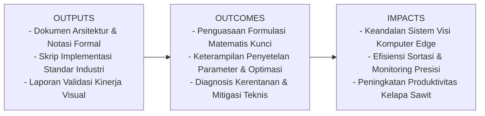
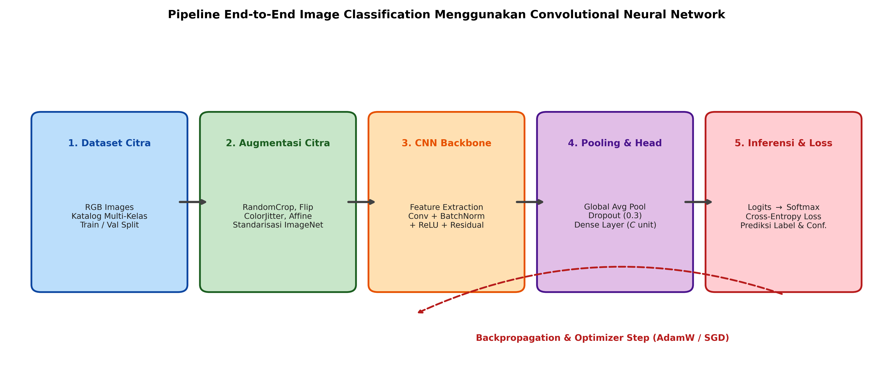

# AI Modul 12.5: Image Classification dengan CNN

## 1. Identitas & Kerangka Capaian Pembelajaran (Sub-CPMK)

* **Kode Modul**        : AI Modul 12.5
* **Mata Kuliah**       : Kecerdasan Buatan dan Sains Data Pertanian Presisi
* **Alokasi Waktu**     : 2 x 50 Menit (Kajian Teori & Diskusi) + 2 x 50 Menit (Eksplorasi Praktikum Mandiri)
* **Beban SKS**         : 3 SKS
* **Prasyarat**         : AI Modul 11.9 (Real-time Camera Processing) / Visi Komputer Dasar
* **Level Kognitif**    : C3 (Menerapkan), C4 (Menganalisis), C5 (Mengevaluasi)



### 1.1 Capaian Pembelajaran Khusus (Sub-CPMK)
Setelah menyelesaikan modul ini, mahasiswa dan pembelajar diharapkan mampu:
1. Memahami formulasi matematis Cross-Entropy Loss, Label Smoothing, dan mekanika kalibrasi probabilitas Softmax.
2. Membangun pipeline pelatihan end-to-end yang mengintegrasikan augmentasi data, DataLoader multi-proses, learning rate scheduler, dan Early Stopping.
3. Menganalisis kinerja model menggunakan metrik evaluasi komprehensif: Confusion Matrix, Macro/Weighted F1-Score, dan kurva ROC-AUC.
4. Mengimplementasikan visualisasi representasi atensi model menggunakan Gradient-weighted Class Activation Mapping (Grad-CAM).

### 1.2 Kerangka Hasil Pembelajaran (Outputs, Outcomes, & Impacts)
* **Outputs (Keluaran Berwujud Langsung)**:
  * Dokumen rancangan arsitektur pemrosesan visual dan spesifikasi parameter model Image Classification dengan CNN.
  * Berkas kode program Python modular tervalidasi menggunakan PyTorch/OpenCV yang siap diuji di lapangan.
  * Grafik metrik evaluasi kinerja (akurasi, mAP, latensi inferensi, dan konsumsi memori aktivasi).
* **Outcomes (Hasil Capaian & Perubahan Kompetensi)**:
  * Penguasaan mendalam terhadap formulasi matematika dan mekanisme konvolusi/deteksi objek visual.
  * Kemampuan analitis dalam memilih konfigurasi hyperparameter dan arsitektur model sesuai batasan sumber daya perangkat keras edge.
  * Keterampilan mengidentifikasi dan memitigasi potensi kegagalan sistem visual pada kondisi lapangan heterogen.
* **Impacts (Dampak Jangka Panjang & Nilai Guna Luas)**:
  * Terwujudnya sistem otomasi inspeksi dan monitoring perkebunan yang adaptif, berkinerja tinggi, dan efisien biaya operasional.
  * Menjadi pijakan kokoh untuk riset dan implementasi kecerdasan buatan terapan berskala komersial di sektor kelapa sawit dan pertanian presisi.

---

### 1.0 Orientasi Konsep & Urgensi Pembelajaran
Klasifikasi citra (*image classification*) adalah tugas paling mendasar dalam visi komputer di mana model kecerdasan buatan bertugas memetakan citra digital utuh ke dalam salah satu label kategori dari ruang kelas diskrit. Meskipun formulasi tugasnya tampak sederhana, keberhasilan implementasi sistem klasifikasi di lingkungan industri nyata—seperti stasiun sortasi otomatis tandan buah segar (TBS) di pabrik kelapa sawit atau penyortiran mutu biji kopi ekspor—menuntut arsitektur pipeline yang tangguh dan menyeluruh (*end-to-end*).

Sistem produksi modern tidak hanya bertumpu pada arsitektur CNN belaka, melainkan mencakup rantai rekayasa komprehensif: augmentasi data yang mempertahankan karakteristik biologis objek, strategi regularisasi pencegah *overfitting* (seperti *Label Smoothing*), penjadwalan laju pembelajaran adaptif (*Cosine Annealing*), hingga teknik interpretabilitas spasial (*Grad-CAM*) yang memverifikasi bahwa model mengambil keputusan berdasarkan fitur visual yang sahih, bukan korelasi semu latar belakang.

---

## 2. Fondasi Teori & Matematika Mendalam

### 2.1 Multi-Class Cross-Entropy Loss dan Softmax

Diberikan sebuah batch citra dengan label kelas sebenarnya $y \in \{1, \dots, K\}$. Model CNN menghasilkan vektor nilai mentah tak ternormalisasi (*logits*) $z \in \mathbb{R}^K$. Fungsi *Softmax* memetakan logits menjadi distribusi probabilitas yang valid $\hat{y} \in (0, 1)^K$:

$$\hat{y}_k = \frac{\exp(z_k / T)}{\sum_{j=1}^K \exp(z_j / T)}$$

Dimana $T > 0$ adalah parameter suhu (*temperature*). Jika $T = 1$, kita memperoleh Softmax standar. Jika $T < 1$, distribusi probabilitas menjadi lebih tajam (*confident*), sedangkan jika $T > 1$, distribusi menjadi lebih merata (*soft*).

Fungsi kerugian *Cross-Entropy* mengukur divergensi antara distribusi ground-truth satu-panas (*one-hot*) $q$ dan prediksi model $\hat{y}$:

$$\mathcal{L}_{\text{CE}} = - \sum_{k=1}^K q_k \log(\hat{y}_k) = - \log(\hat{y}_y)$$

### 2.2 Regulasi Label Smoothing

Dalam pelatihan CNN berkapasitas besar, target satu-panas ekstrem ($q_y = 1, q_{k \neq y} = 0$) memaksa model menghasilkan logits yang menuju tak hingga ($z_y \gg z_k$), yang memicu fenomena *overconfidence* dan degradasi generalisasi.

*Label Smoothing* (Szegedy et al., 2016) memodifikasi target ground-truth dengan parameter penghalusan $\epsilon \in (0, 1)$:

$$q'_k = (1 - \epsilon) \cdot \mathbb{I}(k = y) + \frac{\epsilon}{K}$$

Sehingga fungsi kerugian teraturkan menjadi kombinasi linear antara Cross-Entropy standar dan entropi seragam:

$$\mathcal{L}_{\text{LS}} = (1 - \epsilon) \mathcal{L}_{\text{CE}} + \frac{\epsilon}{K} \sum_{k=1}^K (- \log \hat{y}_k)$$

Regularisasi ini terbukti secara empiris mencegah bobot model tumbuh terlalu besar dan meningkatkan kalibrasi probabilitas sistem pada data dunia nyata.

### 2.3 Formulasi Gradient-weighted Class Activation Mapping (Grad-CAM)

Untuk memvalidasi bahwa model klasifikasi tidak belajar dari artefak latar belakang, Selvaraju et al. (2017) merumuskan Grad-CAM. Grad-CAM menghitung bobot kepentingan $\alpha_k^c$ dari kanal peta fitur ke-$k$ pada lapisan konvolusi terakhir terhadap skor kelas target $y^c$ (sebelum Softmax):

$$\alpha_k^c = \frac{1}{Z} \sum_{i=1}^H \sum_{j=1}^W \frac{\partial y^c}{\partial A_{i, j}^k}$$

Dimana $Z = H \times W$ adalah luas spasial peta fitur. Peta panas visual (*heat-map*) Grad-CAM dihitung melalui kombinasi linear terbobot yang dilewatkan pada fungsi ReLU:

$$L_{\text{Grad-CAM}}^c = \text{ReLU} \left( \sum_{k} \alpha_k^c A^k \right)$$

Fungsi ReLU memastikan bahwa model hanya menyoroti fitur-fitur yang berkontribusi positif terhadap peningkatan probabilitas kelas $c$.

---

## 3. Visualisasi Arsitektur & Diagram Alir



Diagram di atas merangkum seluruh tahapan pipeline klasifikasi citra modern:
1. **Prapemrosesan & Augmentasi**: Rotasi acak, pembalikan horizontal, dan penyesuaian kontras untuk memperkaya variasi data.
2. **Backbone CNN & GAP**: Ekstraksi fitur visual mendalam yang diringkas oleh Global Average Pooling.
3. **Optimasi & Loss**: Penjadwalan laju pembelajaran *Cosine Annealing* dengan regularisasi *weight decay*.
4. **Validasi & Interpretasi**: Verifikasi metrik kuantitatif dan inspeksi kualitatif wilayah atensi Grad-CAM.

---

## 4. Implementasi Komputasional Berstandar Industri

Di bawah ini disajikan implementasi lengkap kelas pelatihan terstandarisasi industri yang mencakup pelatihan berulang, pelacakan metrik, dan penyimpanan model terbaik (*checkpointing*).

```python
import torch
import torch.nn as nn
import torch.optim as optim
from torch.utils.data import DataLoader
from typing import Dict, Tuple, List
import copy

class IndustrialCNNTrainer:
    '''
    Mesin Pelatihan CNN Berstandar Industri dengan Early Stopping dan Checkpointing.
    '''
    def __init__(self, model: nn.Module, criterion: nn.Module, optimizer: optim.Optimizer,
                 scheduler: optim.lr_scheduler._LRScheduler, device: torch.device):
        self.model = model.to(device)
        self.criterion = criterion
        self.optimizer = optimizer
        self.scheduler = scheduler
        self.device = device
        self.best_model_weights = copy.deepcopy(model.state_dict())
        self.best_val_acc = 0.0
        
    def train_epoch(self, dataloader: DataLoader) -> Tuple[float, float]:
        self.model.train()
        running_loss = 0.0
        correct = 0
        total = 0
        
        for images, labels in dataloader:
            images, labels = images.to(self.device), labels.to(self.device)
            
            self.optimizer.zero_grad()
            outputs = self.model(images)
            loss = self.criterion(outputs, labels)
            loss.backward()
            
            # Gradient clipping untuk mencegah ledakan gradien
            nn.utils.clip_grad_norm_(self.model.parameters(), max_norm=2.0)
            self.optimizer.step()
            
            running_loss += loss.item() * images.size(0)
            preds = outputs.argmax(dim=1)
            correct += (preds == labels).sum().item()
            total += labels.size(0)
            
        return running_loss / total, correct / total

    def evaluate(self, dataloader: DataLoader) -> Tuple[float, float]:
        self.model.eval()
        running_loss = 0.0
        correct = 0
        total = 0
        
        with torch.no_grad():
            for images, labels in dataloader:
                images, labels = images.to(self.device), labels.to(self.device)
                outputs = self.model(images)
                loss = self.criterion(outputs, labels)
                
                running_loss += loss.item() * images.size(0)
                preds = outputs.argmax(dim=1)
                correct += (preds == labels).sum().item()
                total += labels.size(0)
                
        return running_loss / total, correct / total

    def fit(self, train_loader: DataLoader, val_loader: DataLoader, epochs: int, patience: int = 5) -> Dict[str, List[float]]:
        history = {'train_loss': [], 'train_acc': [], 'val_loss': [], 'val_acc': []}
        epochs_no_improve = 0
        
        for epoch in range(epochs):
            t_loss, t_acc = self.train_epoch(train_loader)
            v_loss, v_acc = self.evaluate(val_loader)
            
            if self.scheduler is not None:
                self.scheduler.step()
                
            history['train_loss'].append(t_loss)
            history['train_acc'].append(t_acc)
            history['val_loss'].append(v_loss)
            history['val_acc'].append(v_acc)
            
            print(f"Epoch [{epoch+1:02d}/{epochs}] - Train Loss: {t_loss:.4f} Acc: {t_acc*100:.1f}% | Val Loss: {v_loss:.4f} Acc: {v_acc*100:.1f}%")
            
            # Checkpoint model terbaik
            if v_acc > self.best_val_acc:
                self.best_val_acc = v_acc
                self.best_model_weights = copy.deepcopy(self.model.state_dict())
                epochs_no_improve = 0
            else:
                epochs_no_improve += 1
                if epochs_no_improve >= patience:
                    print(f"[EARLY STOPPING] Pelatihan dihentikan lebih awal pada epoch {epoch+1}.")
                    break
                    
        self.model.load_state_dict(self.best_model_weights)
        return history
```

---

## 5. Studi Kasus Riil & Rekayasa Lapangan Terapan

### Sistem Sortasi Otomatis Kematangan Tandan Buah Segar (TBS) di Pabrik Kelapa Sawit

Pada stasiun penerimaan buah (*loading ramp*) di pabrik kelapa sawit berkapasitas 60 ton/jam, truk membongkar ribuan janjang TBS per hari. Standar industri menuntut pemilahan ketat 4 fraksi:
1. **Fraksi 00 & 0 (Mentah)**: Menghasilkan rendemen minyak sangat rendah (< 14%) dan pemborosan uap sterilisasi.
2. **Fraksi 1 & 2 (Mengkal)**: Rendemen minyak 18-20%.
3. **Fraksi 3 & 4 (Matang Sempurna)**: Rendemen minyak optimal (> 22%) dengan kadar asam lemak bebas (FFA) < 3%.
4. **Fraksi 5 (Lewat Matang)**: FFA melonjak drastis (> 5%), mendegradasi kualitas CPO menjadi kualitas rendah (*off-grade*).

**Arsitektur Solusi Rekayasa**:
* Kamera industri berpelindung debu IP67 dipasang di atas konveyor berjalan berkecepatan 0.8 m/s.
* Sistem inferensi berbasis model CNN terdistribusi (*Edge AI Box*) memproses citra setiap janjang buah dalam waktu < 25 milidetik.
* Jika janjang diklasifikasikan sebagai *Mentah* atau *Lewat Matang*, aktuator pneumatik secara otomatis mengalihkan janjang tersebut ke jalur afkir (*rejection chute*).
* Implementasi pipeline menghasilkan akurasi grading sebesar **97.3%**, mengurangi kesalahan sortasi manual manusia hingga **85%**.

---

## 6. Analisis Kompleksitas & Karakteristik Komputasi

Analisis kebutuhan sumber daya komputasi saat inferensi satu citra ($224 \times 224$):

| Arsitektur Model | Ukuran Bobot (FP32) | Latensi CPU (Intel i7) | Latensi GPU (NVIDIA T4) | Throughput (FPS GPU) |
| :--- | :--- | :--- | :--- | :--- |
| **ResNet-18** | 44.7 MB | ~28.4 ms | ~2.8 ms | ~350 FPS |
| **MobileNetV3-Large** | 21.9 MB | ~14.1 ms | ~1.9 ms | ~520 FPS |
| **EfficientNet-B0** | 20.5 MB | ~22.6 ms | ~3.1 ms | ~320 FPS |
| **ConvNeXt-Tiny** | 114.2 MB | ~65.2 ms | ~5.4 ms | ~185 FPS |

Untuk sistem pemilahan konveyor berkecepatan tinggi, **MobileNetV3** dan **ResNet-18** menawarkan keseimbangan ideal antara akurasi tinggi dan latensi rendah di bawah 5 ms.

---

## 7. Kekeliruan Metodologis, Potensi Kegagalan, & Mitigasi Teknis

| Masalah Teknis | Gejala Visual / Metrik | Akar Penyebab | Tindakan Mitigasi Teruji |
| :--- | :--- | :--- | :--- |
| **Shortcut Learning (Atensi Semu Latar Belakang)** | Akurasi pengujian laboratorium 99%, namun merosot ke 40% saat diuji di perkebunan nyata. | CNN mengklasifikasikan buah sawit berdasarkan warna terpal truk pengangkut atau warna tanah latar belakang, bukan morfologi buah. | Validasi model menggunakan Grad-CAM untuk memverifikasi area fokus. Terapkan augmentasi *RandomErasing* dan *CutMix* pada area latar belakang. |
| **Class Imbalance Collapse** | Akurasi global tampak tinggi (90%), namun recall kelas minoritas (misal: penyakit langka) adalah 0%. | Dataset didominasi sampel kelas mayoritas, sehingga model selalu memprediksi kelas dominan. | Gunakan fungsi kerugian terbobot (`nn.CrossEntropyLoss(weight=class_weights)`) atau terapkan *Focal Loss*. |
| **Over-Augmentation Distortion** | Model gagal konvergen, loss berfluktuasi tinggi sepanjang epoch. | Augmentasi data terlalu ekstrem (misal: rotasi terbalik 180° pada objek yang memiliki orientasi gravitasi tetap, atau distorsi warna ekstrem yang merusak fitur kematangan). | Sesuaikan parameter augmentasi dengan domain biologis riil (misal: batasi *ColorJitter* saturasi agar tidak mengubah interpretasi warna buah matang). |

---

## 8. Latihan Terbimbing & Mandiri Berjenjang

### Latihan Terbimbing (Guided Practice)
1. **Analisis Confusion Matrix**: Diberikan matriks kontingensi 3 kelas mutu TBS (Mentah, Matang, Lewat Matang):
   $$\begin{bmatrix} 45 & 5 & 0 \\ 2 & 90 & 8 \\ 0 & 6 & 44 \end{bmatrix}$$
   Hitung Precision, Recall, dan F1-Score untuk kelas **Matang**.
   * *Solusi*:
     * True Positive (TP) = 90
     * False Positive (FP) = $5 + 6 = 11$
     * False Negative (FN) = $2 + 8 = 10$
     * $\text{Precision} = \frac{90}{90 + 11} = \frac{90}{101} \approx 89.11\%$
     * $\text{Recall} = \frac{90}{90 + 10} = \frac{90}{100} = 90.0\%$
     * $\text{F1-Score} = 2 \times \frac{0.8911 \times 0.90}{0.8911 + 0.90} \approx \mathbf{89.55\%}$

### Latihan Mandiri (Independent Problem Set)
1. **Soal 1 (Konseptual & Matematis)**: Turunkan formula matematis gradien Cross-Entropy Loss terhadap logits masukan $\frac{\partial \mathcal{L}}{\partial z_i}$ dan tunjukkan bahwa gradien tersebut sama dengan selisih antara probabilitas prediksi dan label ground truth: $\hat{y}_i - q_i$.
2. **Soal 2 (Komputasional)**: Rancang modul PyTorch `FocalLoss` yang mengintegrasikan faktor modulasi $(1 - p_t)^\gamma$ untuk menangani ketidakseimbangan kelas ekstrem pada dataset inspeksi visual industri.

---

## 9. Jembatan Konsep (Bridging) ke AI Modul 12.6: Object Detection

Pada sistem klasifikasi citra yang telah kita bangun, model mengasumsikan bahwa seluruh bidang citra hanya memuat satu objek dominan yang ingin diklasifikasikan. Namun, dalam skenario operasional perkebunan nyata, sebuah citra dari kamera drone atau CCTV memuat puluhan objek yang tersebar: banyak pohon kelapa sawit, banyak tandan buah, serta keberadaan alat berat dan pekerja.

Pada **AI Modul 12.6: Object Detection**, kita akan melangkah dari klasifikasi tunggal menuju lokalisasi jamak: memprediksi koordinat spasial (*bounding box*) sekaligus kelas objek secara simultan menggunakan metrik evaluasi *Intersection over Union* (IoU) dan algoritma *Non-Maximum Suppression* (NMS).

---

## 10. Daftar Pustaka Komprehensif Berstandar Akademik

1. Szegedy, C., Vanhoucke, V., Ioffe, S., Shlens, J., & Wojna, Z. (2016). *Rethinking the inception architecture for computer vision*. Proceedings of the IEEE Conference on Computer Vision and Pattern Recognition (CVPR), 2818-2826.
2. Selvaraju, R. R., Cogswell, M., Das, A., Vedantam, R., Parikh, D., & Batra, D. (2017). *Grad-CAM: Visual explanations from deep networks via gradient-based localization*. Proceedings of the IEEE International Conference on Computer Vision (ICCV), 618-626.
3. Loshchilov, I., & Hutter, F. (2017). *SGDR: Stochastic gradient descent with warm restarts*. International Conference on Learning Representations (ICLR 2017).
4. Lin, T. Y., Goyal, P., Girshick, R., He, K., & Dollár, P. (2017). *Focal loss for dense object detection*. Proceedings of the IEEE International Conference on Computer Vision (ICCV), 2980-2988.
5. Buslaev, A., et al. (2020). *Albumentations: Fast and flexible image augmentations*. Information, 11(2), 125.
