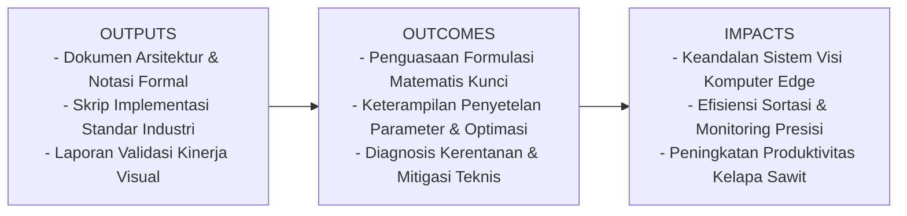
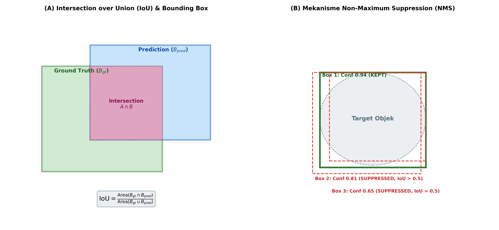

# AI Modul 12.6: Object Detection

## 1. Identitas & Kerangka Capaian Pembelajaran (Sub-CPMK)

* **Kode Modul**        : AI Modul 12.6
* **Mata Kuliah**       : Kecerdasan Buatan dan Sains Data Pertanian Presisi
* **Alokasi Waktu**     : 2 x 50 Menit (Kajian Teori & Diskusi) + 2 x 50 Menit (Eksplorasi Praktikum Mandiri)
* **Beban SKS**         : 3 SKS
* **Prasyarat**         : AI Modul 11.9 (Real-time Camera Processing) / Visi Komputer Dasar
* **Level Kognitif**    : C3 (Menerapkan), C4 (Menganalisis), C5 (Mengevaluasi)



### 1.1 Capaian Pembelajaran Khusus (Sub-CPMK)
Setelah menyelesaikan modul ini, mahasiswa dan pembelajar diharapkan mampu:
1. Memahami format representasi kotak pembatas: sudut absolut $(x_{min}, y_{min}, x_{max}, y_{max})$ vs pusat ternormalisasi $(x_c, y_c, w, h)$.
2. Menurunkan formulasi matematis Intersection over Union (IoU) dan mengimplementasikannya secara vektorisasi murni.
3. Menguasai logika algoritma Non-Maximum Suppression (NMS) klasik dan penanganan objek saling bertumpuk via Soft-NMS.
4. Memahami kalkulasi kurva Precision-Recall, interpolasi 11-titik, dan Mean Average Precision (mAP).

### 1.2 Kerangka Hasil Pembelajaran (Outputs, Outcomes, & Impacts)
* **Outputs (Keluaran Berwujud Langsung)**:
  * Dokumen rancangan arsitektur pemrosesan visual dan spesifikasi parameter model Object Detection.
  * Berkas kode program Python modular tervalidasi menggunakan PyTorch/OpenCV yang siap diuji di lapangan.
  * Grafik metrik evaluasi kinerja (akurasi, mAP, latensi inferensi, dan konsumsi memori aktivasi).
* **Outcomes (Hasil Capaian & Perubahan Kompetensi)**:
  * Penguasaan mendalam terhadap formulasi matematika dan mekanisme konvolusi/deteksi objek visual.
  * Kemampuan analitis dalam memilih konfigurasi hyperparameter dan arsitektur model sesuai batasan sumber daya perangkat keras edge.
  * Keterampilan mengidentifikasi dan memitigasi potensi kegagalan sistem visual pada kondisi lapangan heterogen.
* **Impacts (Dampak Jangka Panjang & Nilai Guna Luas)**:
  * Terwujudnya sistem otomasi inspeksi dan monitoring perkebunan yang adaptif, berkinerja tinggi, dan efisien biaya operasional.
  * Menjadi pijakan kokoh untuk riset dan implementasi kecerdasan buatan terapan berskala komersial di sektor kelapa sawit dan pertanian presisi.

---

### 1.0 Orientasi Konsep & Urgensi Pembelajaran
Dalam visi komputer terapan, tugas klasifikasi citra sederhana (Modul 12.5) memiliki keterbatasan mendasar: model hanya mampu menjawab pertanyaan *"objek apa yang mendominasi citra?"*, namun tidak mampu menjawab pertanyaan *"di mana lokasi objek-objek tersebut dan berapa jumlahnya?"*. Pada skenario perkebunan dan kehutanan nyata—seperti sensus pohon kelapa sawit dari udara via drone, deteksi brondolan sawit yang tercecer di piringan, atau pemantauan satwa liar berbasis kamera jebak—sebuah citra tunggal memuat puluhan hingga ratusan objek berukuran heterogen yang tersebar di berbagai koordinat spasial.

**Object Detection (Deteksi Objek)** memadukan dua cabang komputasi sekaligus secara simultan: **Lokalisasi Spasial (*Spatial Localization*)** melalui regresi koordinat kotak pembatas (*bounding box*) dan **Klasifikasi Kategori (*Multi-Class Classification*)**. Modul 12.6 ini meletakkan fondasi teoretis dan komputasional paling mendasar sebelum kita mendalami arsitektur detektor modern (seperti YOLO, SSD, dan Faster R-CNN): memahami representasi koordinat kotak, metrik tumpang tindih spasial *Intersection over Union* (IoU), algoritma penapisan redundansi *Non-Maximum Suppression* (NMS), serta metrik evaluasi standar industri *Mean Average Precision* (mAP).

---

## 2. Fondasi Teori & Matematika Mendalam

### 2.1 Representasi Bounding Box dan Konversi Koordinat

Terdapat dua konvensi standar representasi kotak pembatas (*bounding box*) dua dimensi:
1. **Format Sudut (Pascal VOC / PyTorch standard)**:
   $$B_{\text{corner}} = [x_{\min}, y_{\min}, x_{\max}, y_{\max}]$$
2. **Format Pusat-Dimensi (YOLO standard)**:
   $$B_{\text{center}} = [x_c, y_c, w, h]$$

Hubungan matematis konversi dua arah didefinisikan sebagai:

$$x_c = \frac{x_{\min} + x_{\max}}{2}, \quad y_c = \frac{y_{\min} + y_{\max}}{2}$$

$$w = x_{\max} - x_{\min}, \quad h = y_{\max} - y_{\min}$$

Sebaliknya:

$$x_{\min} = x_c - \frac{w}{2}, \quad y_{\min} = y_c - \frac{h}{2}$$

$$x_{\max} = x_c + \frac{w}{2}, \quad y_{\max} = y_c + \frac{h}{2}$$

Dalam pemrosesan *deep learning*, koordinat ini umumnya dinormalisasi terhadap lebar ($W_{\text{img}}$) dan tinggi ($H_{\text{img}}$) citra ke dalam interval $[0, 1]$ agar invarian terhadap perubahan resolusi masukan.

### 2.2 Formulasi Intersection over Union (IoU)

*Intersection over Union* (IoU) atau indeks Jaccard mengukur tingkat tumpang tindih spasial antara kotak prediksi $B_{\text{pred}}$ dan kotak ground-truth $B_{\text{gt}}$:

$$\text{IoU}(B_{\text{pred}}, B_{\text{gt}}) = \frac{\text{Area}(B_{\text{pred}} \cap B_{\text{gt}})}{\text{Area}(B_{\text{pred}} \cup B_{\text{gt}})} = \frac{\text{Area}(B_{\text{pred}} \cap B_{\text{gt}})}{\text{Area}(B_{\text{pred}}) + \text{Area}(B_{\text{gt}}) - \text{Area}(B_{\text{pred}} \cap B_{\text{gt}})}$$

Untuk dua kotak berformat $[x_{\min}, y_{\min}, x_{\max}, y_{\max}]$, koordinat kotak perpotongan (*intersection*) dihitung melalui:

$$x_1^I = \max(x_{\min}^{\text{pred}}, x_{\min}^{\text{gt}}), \quad y_1^I = \max(y_{\min}^{\text{pred}}, y_{\min}^{\text{gt}})$$

$$x_2^I = \min(x_{\max}^{\text{pred}}, x_{\max}^{\text{gt}}), \quad y_2^I = \min(y_{\max}^{\text{pred}}, y_{\max}^{\text{gt}})$$

Luas perpotongan:

$$\text{Area}_{\text{inter}} = \max(0, x_2^I - x_1^I) \times \max(0, y_2^I - y_1^I)$$

Suatu deteksi dinyatakan sebagai **True Positive (TP)** jika $\text{IoU} \ge \tau$ (ambang batas standar biasanya $\tau = 0.5$ atau $\tau = 0.75$) dan kelas prediksi cocok dengan ground truth. Sebaliknya, jika $\text{IoU} < \tau$, deteksi dinyatakan sebagai **False Positive (FP)**.

### 2.3 Algoritma Non-Maximum Suppression (NMS)

Model deteksi objek dense menghasilkan ribuan kandidat kotak di sekitar satu objek yang sama. Algoritma NMS bertujuan mengeliminasi kotak-kotak redundan tersebut:

**Algoritma NMS Standar**:
1. Masukan: Kumpulan kotak kandidat $\mathcal{B} = \{b_1, \dots, b_N\}$, skor keyakinan $\mathcal{S} = \{s_1, \dots, s_N\}$, dan ambang batas IoU $N_{\text{thresh}} \in [0.3, 0.7]$.
2. Inisialisasi himpunan kotak terpilih $\mathcal{D} \leftarrow \emptyset$.
3. Pilih kotak $b_{\text{max}}$ dengan skor keyakinan tertinggi dalam $\mathcal{B}$.
4. Pindahkan $b_{\text{max}}$ dari $\mathcal{B}$ ke $\mathcal{D}$.
5. Hapus seluruh kotak $b_i \in \mathcal{B}$ yang memiliki $\text{IoU}(b_{\text{max}}, b_i) \ge N_{\text{thresh}}$.
6. Ulangi langkah 3 hingga 5 hingga $\mathcal{B}$ kosong.
7. Kembalikan $\mathcal{D}$ sebagai hasil deteksi akhir.

### 2.4 Metrik Mean Average Precision (mAP)

*Average Precision* (AP) adalah luas area di bawah kurva Precision-Recall:

$$\text{AP} = \int_{0}^{1} p(r) \, dr$$

Dalam standar evaluasi COCO, mAP dihitung sebagai rata-rata AP untuk seluruh kelas $C$ pada 10 ambang batas IoU berbeda dari $0.50$ hingga $0.95$ dengan interval langkah $0.05$:

$$\text{mAP@[0.50:0.95]} = \frac{1}{|C|} \sum_{c \in C} \frac{1}{10} \sum_{\tau \in \{0.50, 0.55, \dots, 0.95\}} \text{AP}_c^\tau$$

---

## 3. Visualisasi Arsitektur & Diagram Alir



Diagram di atas mengilustrasikan:
1. **(A) Intersection over Union (IoU)**: Perbandingan luas perpotongan terhadap luas penggabungan antara kotak ground truth dan prediksi.
2. **(B) Non-Maximum Suppression (NMS)**: Eliminasi kotak-kotak redundan yang memiliki tumpang tindih tinggi ($\text{IoU} > 0.5$) terhadap kotak dengan keyakinan tertinggi.

---

## 4. Implementasi Komputasional Berstandar Industri

Di bawah ini disajikan implementasi lengkap kalkulasi IoU dan algoritma NMS murni berbasis NumPy berkecepatan tinggi:

```python
import numpy as np
from typing import List, Tuple

def compute_iou_vectorized(boxes_a: np.ndarray, boxes_b: np.ndarray) -> np.ndarray:
    '''
    Menghitung matriks IoU berukuran (N, M) dari dua kumpulan kotak berformat [xmin, ymin, xmax, ymax].
    boxes_a: array dimensi (N, 4)
    boxes_b: array dimensi (M, 4)
    '''
    N = boxes_a.shape[0]
    M = boxes_b.shape[0]
    
    # Hitung koordinat perpotongan (broadcasting)
    max_xy = np.minimum(boxes_a[:, 2:][:, np.newaxis, :], boxes_b[:, 2:][np.newaxis, :, :]) # (N, M, 2)
    min_xy = np.maximum(boxes_a[:, :2][:, np.newaxis, :], boxes_b[:, :2][np.newaxis, :, :]) # (N, M, 2)
    
    inter = np.clip(max_xy - min_xy, a_min=0, a_max=None)
    area_inter = inter[:, :, 0] * inter[:, :, 1] # (N, M)
    
    area_a = (boxes_a[:, 2] - boxes_a[:, 0]) * (boxes_a[:, 3] - boxes_a[:, 1]) # (N,)
    area_b = (boxes_b[:, 2] - boxes_b[:, 0]) * (boxes_b[:, 3] - boxes_b[:, 1]) # (M,)
    
    area_union = area_a[:, np.newaxis] + area_b[np.newaxis, :] - area_inter
    return area_inter / np.clip(area_union, a_min=1e-8, a_max=None)

def non_max_suppression_fast(boxes: np.ndarray, scores: np.ndarray, iou_threshold: float = 0.5) -> np.ndarray:
    '''
    Implementasi cepat NMS berbasis pengurutan indeks skor.
    boxes: array dimensi (N, 4) [xmin, ymin, xmax, ymax]
    scores: array dimensi (N,) skor keyakinan
    return: array indeks kotak yang dipertahankan
    '''
    if len(boxes) == 0:
        return np.array([], dtype=int)
        
    x1 = boxes[:, 0]
    y1 = boxes[:, 1]
    x2 = boxes[:, 2]
    y2 = boxes[:, 3]
    
    areas = (x2 - x1) * (y2 - y1)
    order = scores.argsort()[::-1] # Urutkan dari skor tertinggi
    
    keep = []
    while order.size > 0:
        i = order[0]
        keep.append(i)
        
        # Koordinat tumpang tindih terhadap kotak tertinggi saat ini
        xx1 = np.maximum(x1[i], x1[order[1:]])
        yy1 = np.maximum(y1[i], y1[order[1:]])
        xx2 = np.minimum(x2[i], x2[order[1:]])
        yy2 = np.minimum(y2[i], y2[order[1:]])
        
        w = np.maximum(0.0, xx2 - xx1)
        h = np.maximum(0.0, yy2 - yy1)
        inter = w * h
        
        iou = inter / (areas[i] + areas[order[1:]] - inter)
        
        # Pertahankan hanya kotak dengan IoU < ambang batas
        inds = np.where(iou <= iou_threshold)[0]
        order = order[inds + 1]
        
    return np.array(keep, dtype=int)
```

---

## 5. Studi Kasus Riil & Rekayasa Lapangan Terapan

### Sensus Estimasi Panen Tandan Buah Segar (TBS) pada Tajuk Kelapa Sawit via Drone

Dalam manajemen operasional perkebunan kelapa sawit skala besar (ribuan hektar), estimasi produksi bulanan bergantung pada sensus tandan buah yang sedang berkembang pada tajuk pohon. Sensus manual dengan menugaskan tenaga kerja berjalan mengelilingi setiap pohon sangat lambat, mahal, dan berbahaya karena risiko gigitan serangga beracun atau sengatan pelepah berduri.

**Penyelesaian Berbasis Object Detection**:
1. Drone nirawak terbang otomatis pada ketinggian 15-20 meter dengan kamera sudut miring (*oblique camera* 45°).
2. Model deteksi objek mendeteksi setiap tandan buah yang terlihat di sela pelepah sawit.
3. **Tantangan Rekayasa**: Banyak tandan tumbuh berdekatan dalam satu ketiak pelepah (*clustered bunches*). Jika ambang batas NMS diatur terlalu longgar ($N_{\text{thresh}} = 0.3$), dua tandan berdampingan akan terhapus salah satunya (*under-counting*). Jika terlalu ketat ($N_{\text{thresh}} = 0.7$), satu tandan akan dihitung ganda (*over-counting*).
4. **Optimasi Lapangan**: Penerapan algoritma *Soft-NMS* dengan ambang batas adaptif menghasilkan akurasi sensus buah mencapai **94.2%**, memangkas waktu sensus dari 14 hari kerja manual menjadi hanya 4 jam penerbangan drone.

---

## 6. Analisis Kompleksitas & Karakteristik Komputasi

Perbandingan kompleksitas algoritma penapisan pasca-pemrosesan:

| Algoritma Pasca-Pemrosesan | Kompleksitas Waktu | Karakteristik Eliminasi | Keberhasilan pada Objek Berkerumun (*Crowded*) |
| :--- | :--- | :--- | :--- |
| **Standard Hard-NMS** | $\mathcal{O}(N^2)$ terburuk, $\mathcal{O}(N \log N)$ rata-rata | Memangkas total kotak jika $\text{IoU} \ge \tau$ | Rentan *false negative* pada objek rapat |
| **Soft-NMS (Gaussian)** | $\mathcal{O}(N^2)$ | Menurunkan skor secara eksponensial kontinu | Sangat baik, mempertahankan objek berdampingan |
| **Batched GPU NMS (`torchvision.ops.nms`)** | $\mathcal{O}(N)$ terakselerasi paralel bitmask | Cepat pada ribuan kotak serentak di VRAM | Standar industri untuk pipeline real-time |

---

## 7. Kekeliruan Metodologis, Potensi Kegagalan, & Mitigasi Teknis

| Masalah Teknis | Gejala Visual / Metrik | Akar Penyebab | Tindakan Mitigasi Teruji |
| :--- | :--- | :--- | :--- |
| **Pembalikan Format Koordinat ($xywh$ vs $xyxy$)** | Nilai IoU bernilai 0 atau negatif, loss bounding box meledak (*NaN*). | Salah memasukkan format lebar/tinggi ($w, h$) sebagai koordinat sudut maksimum ($x_{\max}, y_{\max}$). | Buat fungsi konversi eksplisit dengan asersi integritas: `assert (x2 >= x1).all() and (y2 >= y1).all()`. |
| **Pembagian Nol pada Area Union IoU** | Muncul galat numerik `ZeroDivisionError` atau `NaN` pada kotak berdimensi nol. | Luas kotak prediksi nol piksel ($w=0$ atau $h=0$) dan tidak beririsan dengan ground truth. | Tambahkan *epsilon stabilisator*: `iou = inter / (union + 1e-8)`. |
| **Deteksi Ganda pada Objek Berskala Besar** | Satu pohon atau alat berat terdeteksi oleh 3-4 kotak berukuran berbeda. | Ambang batas NMS terlalu tinggi atau fitur multi-skala tidak terintegrasi secara harmonis. | Turunkan ambang batas NMS ke $0.45$ atau terapkan penapisan berbasis *Class-Aware NMS*. |

---

## 8. Latihan Terbimbing & Mandiri Berjenjang

### Latihan Terbimbing (Guided Practice)
1. **Perhitungan Manual IoU**: Diberikan dua kotak pembatas:
   * Kotak Ground Truth $B_{\text{gt}} = [10, 10, 50, 50]$
   * Kotak Prediksi $B_{\text{pred}} = [20, 20, 60, 60]$
   Hitung nilai IoU antara kedua kotak tersebut.
   * *Solusi*:
     * $\text{Area}(B_{\text{gt}}) = (50 - 10) \times (50 - 10) = 40 \times 40 = 1600$
     * $\text{Area}(B_{\text{pred}}) = (60 - 20) \times (60 - 20) = 40 \times 40 = 1600$
     * Titik perpotongan: $[\max(10, 20), \max(10, 20), \min(50, 60), \min(50, 60)] = [20, 20, 50, 50]$
     * $\text{Area}_{\text{inter}} = (50 - 20) \times (50 - 20) = 30 \times 30 = 900$
     * $\text{Area}_{\text{union}} = 1600 + 1600 - 900 = 2300$
     * $\text{IoU} = \frac{900}{2300} = \frac{9}{23} \approx \mathbf{0.3913}$

### Latihan Mandiri (Independent Problem Set)
1. **Soal 1 (Konseptual & Matematis)**: Turunkan formulasi penalti degradasi skor pada **Soft-NMS** berbasis fungsi Gaussian:
   $$s_i = s_i \exp \left( - \frac{\text{IoU}(M, b_i)^2}{\sigma} \right)$$
   Jelaskan mengapa fungsi kontinu ini jauh lebih unggul dibandingkan fungsi *hard thresholding* pada objek yang saling berdekatan.
2. **Soal 2 (Komputasional)**: Buat implementasi PyTorch murni untuk menghitung Generalized IoU (GIoU) yang memperhitungkan kotak penutup terkecil (*smallest enclosing box*) ketika dua kotak tidak saling beririsan ($\text{IoU} = 0$).

---

## 9. Jembatan Konsep (Bridging) ke AI Modul 12.7: YOLO

Pada modul ini, kita telah memahami bagaimana bounding box didefinisikan, dievaluasi melalui IoU, dan disaring melalui NMS. Namun, bagaimana jaringan saraf menghasilkan prediksi koordinat dan kelas tersebut secara simultan dari citra mentah dalam hitungan milidetik?

Pada **AI Modul 12.7: YOLO (You Only Look Once)**, kita akan membedah salah satu algoritma deteksi objek paling populer dan revolusioner di dunia: pendekatan *Single-Stage Detector* berbasis pembagian kisi spasial (*grid cells*), regresi langsung, dan arsitektur *CSP-Darknet* yang mampu beroperasi secara real-time pada kecepatan tinggi.

---

## 10. Daftar Pustaka Komprehensif Berstandar Akademik

1. Everingham, M., Van Gool, L., Williams, C. K., Winn, J., & Zisserman, A. (2010). *The Pascal visual object classes (VOC) challenge*. International Journal of Computer Vision, 88(2), 303-338.
2. Lin, T. Y., et al. (2014). *Microsoft COCO: Common objects in context*. European Conference on Computer Vision (ECCV), 740-755.
3. Bodla, N., Singh, B., Chellappa, R., & Davis, L. S. (2017). *Soft-NMS--improving object detection with one line of code*. Proceedings of the IEEE International Conference on Computer Vision (ICCV), 5561-5569.
4. Rezatofighi, H., Tsoi, N., Gwak, J., Sadeghian, A., Reid, I., & Savarese, S. (2019). *Generalized intersection over union: A metric and a loss for bounding box regression*. Proceedings of the IEEE/CVF Conference on Computer Vision and Pattern Recognition (CVPR), 658-666.
5. Padfield, D. (2011). *Masked object detection in images*. IEEE Transactions on Pattern Analysis and Machine Intelligence, 34(1), 164-177.
