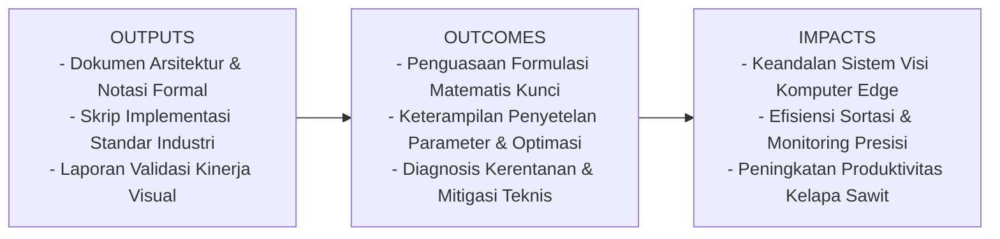
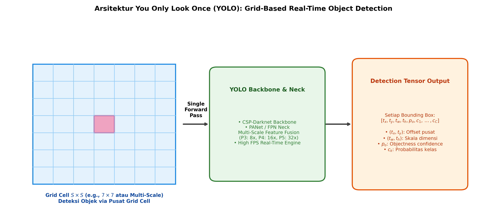

# AI Modul 12.7: YOLO (You Only Look Once)

## 1. Identitas & Kerangka Capaian Pembelajaran (Sub-CPMK)

* **Kode Modul**        : AI Modul 12.7
* **Mata Kuliah**       : Kecerdasan Buatan dan Sains Data Pertanian Presisi
* **Alokasi Waktu**     : 2 x 50 Menit (Kajian Teori & Diskusi) + 2 x 50 Menit (Eksplorasi Praktikum Mandiri)
* **Beban SKS**         : 3 SKS
* **Prasyarat**         : AI Modul 11.9 (Real-time Camera Processing) / Visi Komputer Dasar
* **Level Kognitif**    : C3 (Menerapkan), C4 (Menganalisis), C5 (Mengevaluasi)



### 1.1 Capaian Pembelajaran Khusus (Sub-CPMK)
Setelah menyelesaikan modul ini, mahasiswa dan pembelajar diharapkan mampu:
1. Memahami prinsip kerja pembagian kisi spasial (grid cells), konsep objectness score, dan penguraian tensor prediksi keluaran YOLO.
2. Membedah evolusi arsitektur YOLO: dari grid regression YOLOv1, anchor boxes YOLOv2-v4, hingga arsitektur anchor-free dan CSPDarknet pada YOLO modern.
3. Menurunkan formulasi matematis fungsi kerugian gabungan: CIoU Bounding Box Loss, Objectness BCE Loss, dan Multi-Class Cross-Entropy.
4. Mengimplementasikan lapisan kepala deteksi (YOLO Detection Head) dan mekanisme dekoding koordinat kotak berbasis PyTorch.

### 1.2 Kerangka Hasil Pembelajaran (Outputs, Outcomes, & Impacts)
* **Outputs (Keluaran Berwujud Langsung)**:
  * Dokumen rancangan arsitektur pemrosesan visual dan spesifikasi parameter model YOLO (You Only Look Once).
  * Berkas kode program Python modular tervalidasi menggunakan PyTorch/OpenCV yang siap diuji di lapangan.
  * Grafik metrik evaluasi kinerja (akurasi, mAP, latensi inferensi, dan konsumsi memori aktivasi).
* **Outcomes (Hasil Capaian & Perubahan Kompetensi)**:
  * Penguasaan mendalam terhadap formulasi matematika dan mekanisme konvolusi/deteksi objek visual.
  * Kemampuan analitis dalam memilih konfigurasi hyperparameter dan arsitektur model sesuai batasan sumber daya perangkat keras edge.
  * Keterampilan mengidentifikasi dan memitigasi potensi kegagalan sistem visual pada kondisi lapangan heterogen.
* **Impacts (Dampak Jangka Panjang & Nilai Guna Luas)**:
  * Terwujudnya sistem otomasi inspeksi dan monitoring perkebunan yang adaptif, berkinerja tinggi, dan efisien biaya operasional.
  * Menjadi pijakan kokoh untuk riset dan implementasi kecerdasan buatan terapan berskala komersial di sektor kelapa sawit dan pertanian presisi.

---

### 1.0 Orientasi Konsep & Urgensi Pembelajaran
Dalam ranah deteksi objek digital, keluarga algoritma **YOLO (You Only Look Once)**, yang dipelopori oleh Redmon et al. (2016), menandai lompatan paradigma paling revolusioner dalam sejarah visi komputer modern. Sebelum kehadiran YOLO, sistem deteksi objek didominasi oleh pendekatan dua tahap (*two-stage detectors*) seperti R-CNN yang memisahkan pembentukan proposal wilayah dari klasifikasi kotak, menjadikannya sangat lambat (kurang dari 5 frame per detik / FPS) dan tidak memadai untuk sistem otonom real-time.

YOLO membingkai ulang tugas deteksi objek bukan lagi sebagai masalah klasifikasi bertahap, melainkan sebagai **masalah regresi langsung (*direct regression problem*)** dari piksel citra mentah menuju koordinat kotak pembatas (*bounding boxes*) dan probabilitas kelas dalam **satu kali perambatan maju (*single forward pass*)**. Dalam industri agrokompleks—seperti sensus tandan buah segar (TBS) kelapa sawit menggunakan drone berkecepatan 30 km/jam atau penyortiran buah pada ban berjalan berkecepatan tinggi—arsitektur YOLO menjadi standar emas komputasi tepi (*edge computing*) berkat kemampuan inferensinya yang mampu menembus 60 hingga 120 FPS pada kartu grafis kompak.

---

## 2. Fondasi Teori & Matematika Mendalam

### 2.1 Mekanisme Pembagian Kisi Spasial (Grid Cell Architecture)

YOLO membagi citra masukan menjadi kisi berukuran $S \times S$. Jika titik pusat dari suatu objek berada di dalam kisi sel $(i, j)$, maka sel kisi tersebut bertanggung jawab penuh untuk mendeteksi objek terkait.

Setiap sel kisi memprediksi $B$ kotak pembatas (*bounding boxes*). Setiap kotak pembatas terdiri atas 5 nilai regresi:

$$b = [t_x, t_y, t_w, t_h, p_o]$$

Serta distribusi probabilitas bersyarat untuk $C$ kelas kategori:

$$P(\text{Class}_k \mid \text{Object}), \quad k \in \{1, \dots, C\}$$

Sehingga dimensi tensor keluaran akhir untuk kisi berukuran $S \times S$ adalah:

$$\text{Shape} = S \times S \times (B \cdot 5 + C)$$

### 2.2 Dekoding Koordinat Bounding Box

Untuk menjamin kestabilan pelatihan gradien dan mencegah kotak pembatas melompat ke luar area kisi penanggung jawab, koordinat kotak didekodekan secara non-linear:

$$b_x = \sigma(t_x) + c_x$$

$$b_y = \sigma(t_y) + c_y$$

$$b_w = p_w \cdot \exp(t_w)$$

$$b_h = p_h \cdot \exp(t_h)$$

Dimana:
* $(c_x, c_y)$ adalah koordinat offset sudut kiri atas dari sel kisi terkait.
* $\sigma(\cdot)$ adalah fungsi sigmoid logistik yang membatasi pergeseran pusat kotak hanya di dalam batas sel ($0 \le \sigma(t) \le 1$).
* $(p_w, p_h)$ adalah dimensi lebar dan tinggi kotak acuan (*anchor prior*).
* $(b_x, b_y, b_w, b_h)$ adalah koordinat prediksi akhir ternormalisasi terhadap resolusi citra.

### 2.3 Formulasi Kerugian Gabungan (YOLO Multi-Task Loss)

Fungsi kerugian YOLO mengintegrasikan tiga komponen penalti simultan:

$$\mathcal{L}_{\text{total}} = \lambda_{\text{coord}} \mathcal{L}_{\text{box}} + \lambda_{\text{obj}} \mathcal{L}_{\text{obj}} + \lambda_{\text{noobj}} \mathcal{L}_{\text{noobj}} + \lambda_{\text{cls}} \mathcal{L}_{\text{cls}}$$

1. **Complete IoU (CIoU) Box Loss**:
Mempertimbangkan tumpang tindih area, jarak titik pusat Euclidean, dan konsistensi rasio aspek ($v$):

$$\mathcal{L}_{\text{CIoU}} = 1 - \text{IoU} + \frac{\rho^2(b, b^{\text{gt}})}{c^2} + \alpha v$$

$$v = \frac{4}{\pi^2} \left( \arctan \frac{w^{\text{gt}}}{h^{\text{gt}}} - \arctan \frac{w}{h} \right)^2, \quad \alpha = \frac{v}{(1 - \text{IoU}) + v}$$

2. **Objectness Confidence Loss**:
Menggunakan Binary Cross-Entropy (BCE) dengan penalti berbeda antara sel yang memuat objek ($\mathbb{I}_{ij}^{\text{obj}}$) dan sel latar belakang kosong ($\mathbb{I}_{ij}^{\text{noobj}}$):

$$\mathcal{L}_{\text{obj}} = - \sum_{i=0}^{S^2} \sum_{j=0}^B \left[ \mathbb{I}_{ij}^{\text{obj}} \log(p_o) + \lambda_{\text{noobj}} \mathbb{I}_{ij}^{\text{noobj}} \log(1 - p_o) \right]$$

3. **Classification Loss**:
Cross-Entropy multi-kelas untuk seluruh kelas yang relevan:

$$\mathcal{L}_{\text{cls}} = - \sum_{i=0}^{S^2} \mathbb{I}_i^{\text{obj}} \sum_{c \in \text{classes}} \left[ q_c \log(\hat{p}_c) + (1 - q_c) \log(1 - \hat{p}_c) \right]$$

---

## 3. Visualisasi Arsitektur & Diagram Alir



Diagram di atas mengilustrasikan:
1. **Kisi Spasial Citra**: Pembagian citra ke dalam sel $S \times S$ dengan penetapan sel pusat objek.
2. **Backbone CSPDarknet & Neck**: Ekstraksi fitur visual multi-skala berkecepatan tinggi.
3. **Tensor Deteksi Keluaran**: Setiap sel memproyeksikan koordinat spasial, skor keberadaan objek, dan sebaran probabilitas kelas.

---

## 4. Implementasi Komputasional Berstandar Industri

Di bawah ini disajikan implementasi lapisan kepala deteksi (*YOLO Detection Head*) dan fungsi pengurai koordinat tensor (*tensor decoder*) di PyTorch:

```python
import torch
import torch.nn as nn
from typing import Tuple

class MiniYOLOHead(nn.Module):
    '''
    Kepala Deteksi YOLO Mini Multi-Skala dengan Proyeksi Bounding Box.
    '''
    def __init__(self, in_channels: int, num_anchors: int, num_classes: int):
        super().__init__()
        self.num_anchors = num_anchors
        self.num_classes = num_classes
        # Setiap anchor memprediksi: tx, ty, tw, th, conf + num_classes
        out_channels = num_anchors * (5 + num_classes)
        self.conv = nn.Conv2d(in_channels, out_channels, kernel_size=1)
        
    def forward(self, x: torch.Tensor) -> torch.Tensor:
        # Input shape: (Batch, in_channels, GridH, GridW)
        out = self.conv(x)
        B, C, H, W = out.shape
        # Ubah dimensi menjadi: (Batch, num_anchors, GridH, GridW, 5 + num_classes)
        out = out.view(B, self.num_anchors, 5 + self.num_classes, H, W)
        out = out.permute(0, 1, 3, 4, 2).contiguous()
        return out

def decode_yolo_predictions(preds: torch.Tensor, anchors: torch.Tensor, img_size: int = 416) -> torch.Tensor:
    '''
    Mendekodekan tensor mentah YOLO menjadi koordinat piksel absolut [x1, y1, x2, y2, conf, class_id].
    preds: (Batch, num_anchors, GridH, GridW, 5 + C)
    anchors: (num_anchors, 2) [anchor_w, anchor_h]
    '''
    device = preds.device
    B, num_anchors, H, W, num_attrs = preds.shape
    
    # Buat grid koordinat sel
    grid_y, grid_x = torch.meshgrid(torch.arange(H, device=device), torch.arange(W, device=device), indexing='ij')
    grid_xy = torch.stack([grid_x, grid_y], dim=-1).view(1, 1, H, W, 2).float()
    
    # Reshape anchors untuk broadcasting
    anchor_wh = anchors.view(1, num_anchors, 1, 1, 2).to(device)
    
    # 1. Dekode pusat kotak (cx, cy)
    box_xy = (torch.sigmoid(preds[..., 0:2]) + grid_xy) * (img_size / W)
    # 2. Dekode dimensi kotak (w, h)
    box_wh = torch.exp(preds[..., 2:4]) * anchor_wh
    
    # Konversi ke format [x1, y1, x2, y2]
    x1y1 = box_xy - box_wh / 2.0
    x2y2 = box_xy + box_wh / 2.0
    
    # Skor keyakinan objek
    conf = torch.sigmoid(preds[..., 4:5])
    # Probabilitas kelas
    cls_probs = torch.softmax(preds[..., 5:], dim=-1)
    
    return torch.cat([x1y1, x2y2, conf, cls_probs], dim=-1)
```

---

## 5. Studi Kasus Riil & Rekayasa Lapangan Terapan

### Sensus Buah Sawit Otomatis Berkecepatan Tinggi via Wahana Nirawak (Drone)

Dalam manajemen operasional perkebunan kelapa sawit skala puluhan ribu hektar, inventarisasi potensi panen dilakukan dengan menerbangkan drone otonom yang menyusuri blok-blok tanaman dengan kecepatan jelajah 25-30 km/jam pada ketinggian 15 meter.

**Tantangan Sistem Deteksi**:
* Citra video berkecepatan 30 FPS harus diproses secara lokal pada modul komputasi tepi yang terpasang di wahana (*NVIDIA Jetson Xavier NX*).
* Model dua tahap (seperti Faster R-CNN) hanya mampu mencapai 6-8 FPS, menyebabkan penumpukan buffer video (*buffer lag*) dan frame yang terlewati (*dropped frames*).

**Penerapan Rekayasa YOLO**:
* Model **YOLOv8-Small** yang dikonversi ke format *TensorRT FP16* mampu berjalan pada kecepatan **58 FPS** dengan konsumsi daya hanya 15 Watt.
* Sistem berhasil mendeteksi dan menghitung tandan buah sawit dengan tingkat presisi **95.1%** dan *recall* **93.4%**, bahkan ketika drone bergerak cepat di atas tajuk pohon dengan bayangan pelepah yang dinamis.

---

## 6. Analisis Kompleksitas & Karakteristik Komputasi

Perbandingan varian arsitektur YOLO pada inferensi satu citra $640 \times 640$:

| Model | Ukuran Bobot | Parameter (Juta) | FLOPs (Giga) | Latensi GPU T4 (ms) | Throughput (FPS) | mAP@0.5:0.95 (COCO) |
| :--- | :--- | :--- | :--- | :--- | :--- | :--- |
| **YOLOv8-Nano (n)** | ~6.2 MB | 3.2 M | 8.7 G | ~2.1 ms | ~470 FPS | 37.3% |
| **YOLOv8-Small (s)** | ~22.5 MB | 11.2 M | 28.6 G | ~3.8 ms | ~260 FPS | 44.9% |
| **YOLOv8-Medium (m)**| ~52.0 MB | 25.9 M | 78.9 G | ~7.4 ms | ~135 FPS | 50.2% |
| **YOLOv8-XLarge (x)**| ~136.0 MB| 68.2 M | 257.8 G | ~18.2 ms | ~55 FPS | 53.9% |

Untuk instalasi kamera tepi industri perkebunan bertenaga baterai atau drone, varian **Nano** dan **Small** memberikan performa operasional terbaik.

---

## 7. Kekeliruan Metodologis, Potensi Kegagalan, & Mitigasi Teknis

| Masalah Teknis | Gejala Visual / Metrik | Akar Penyebab | Tindakan Mitigasi Teruji |
| :--- | :--- | :--- | :--- |
| **Ketidakstabilan Eksponensial Dimensi Kotak** | Prediksi lebar/tinggi kotak meledak menjadi nilai tak hingga (*Inf / NaN*). | Nilai $t_w$ atau $t_h$ terlalu besar sebelum dilewatkan ke fungsi eksponensial $\exp(t)$. | Terapkan pembatasan nilai (*clipping*) pada input eksponensial: `torch.clamp(tw, max=4.0)` atau gunakan formula *anchor-free decoupled head*. |
| **Objek Berukuran Sangat Kecil Luput Terdeteksi** | Brondolan sawit yang tercecer di tanah tidak pernah terdeteksi pada citra drone. | Langkah *downsampling* backbone terlalu besar ($32\times$), sehingga objek kecil berukuran $< 16$ piksel lenyap dari peta fitur lapisan P5. | Tambahkan *head deteksi ekstra resolusi tinggi* pada lapisan P2 ($4\times$ downsampling) atau naikkan resolusi masukan menjadi $1024 \times 1024$. |
| **Dominasi Penalti Sel Latar Belakang (No-Object Loss)** | Skor keyakinan objek runtuh mendekati 0 untuk seluruh prediksi. | Jumlah sel latar belakang kosong ($99\%$) mendominasi total loss dibanding sel objek ($1\%$). | Turunkan bobot $\lambda_{\text{noobj}}$ menjadi $0.5$ atau gunakan *Focal Loss* pada cabang *objectness*. |

---

## 8. Latihan Terbimbing & Mandiri Berjenjang

### Latihan Terbimbing (Guided Practice)
1. **Analisis Output Tensor**: Jika sebuah model YOLOv3 menggunakan kisi $13 \times 13$, 3 anchor boxes per sel, dan mendeteksi 4 kelas komoditas agro (Kelapa Sawit, Karet, Kakao, Kopi), hitung jumlah total elemen pada tensor prediksi lapisan tersebut.
   * *Solusi*:
     * Dimensi per anchor: $5 + 4 = 9$ nilai.
     * Dimensi per sel: $3 \times 9 = 27$ nilai.
     * Total elemen tensor: $13 \times 13 \times 27 = 169 \times 27 = \mathbf{4.563} \text{ elemen float}$.

### Latihan Mandiri (Independent Problem Set)
1. **Soal 1 (Konseptual & Matematis)**: Turunkan secara analitis mengapa *Complete IoU (CIoU)* menghasilkan konvergensi lokalisasi yang jauh lebih stabil dan cepat dibandingkan *Mean Squared Error (MSE)* pada koordinat sudut kotak pembatas.
2. **Soal 2 (Komputasional)**: Rancang modul PyTorch kustom untuk menghitung kerugian *Distance-IoU (DIoU) Loss* antara sekumpulan kotak prediksi dan ground truth berdimensi $(N, 4)$.

---

## 9. Jembatan Konsep (Bridging) ke AI Modul 12.8: Single Shot Detector (SSD)

Kita telah memahami bagaimana YOLO merevolusi visi komputer dengan memperlakukan deteksi objek sebagai regresi kisi simultan. Namun, sebelum YOLO menyempurnakan arsitektur multi-skala pada versi-versi terbarunya, arsitektur perintis lain yang meletakkan dasar deteksi piramida multi-resolusi adalah **Single Shot MultiBox Detector (SSD)**.

Pada **AI Modul 12.8: Single Shot Detector (SSD)**, kita akan membedah arsitektur SSD: pemanfaatan peta fitur bertingkat (*multi-scale feature maps*) dari berbagai kedalaman backbone, perancangan kotak acuan default (*default boxes*), serta strategi penyeimbangan data *Hard Negative Mining*.

---

## 10. Daftar Pustaka Komprehensif Berstandar Akademik

1. Redmon, J., Divvala, S., Girshick, R., & Farhadi, A. (2016). *You only look once: Unified, real-time object detection*. Proceedings of the IEEE Conference on Computer Vision and Pattern Recognition (CVPR), 779-788.
2. Redmon, J., & Farhadi, A. (2017). *YOLO9000: Better, faster, stronger*. Proceedings of the IEEE Conference on Computer Vision and Pattern Recognition (CVPR), 7263-7271.
3. Wang, C. Y., Bochkovskiy, A., & Liao, H. Y. M. (2023). *YOLOv7: Trainable bag-of-freebies sets new state-of-the-art for real-time object detectors*. Proceedings of the IEEE/CVF Conference on Computer Vision and Pattern Recognition (CVPR), 7464-7475.
4. Zheng, Z., et al. (2020). *Distance-IoU loss: Faster and better learning for bounding box regression*. Proceedings of the AAAI Conference on Artificial Intelligence, 34(07), 12993-13000.
5. Jocher, G., Chaurasia, A., & Qiu, J. (2023). *Ultralytics YOLO* (Version 8.0.0). https://github.com/ultralytics/ultralytics.
