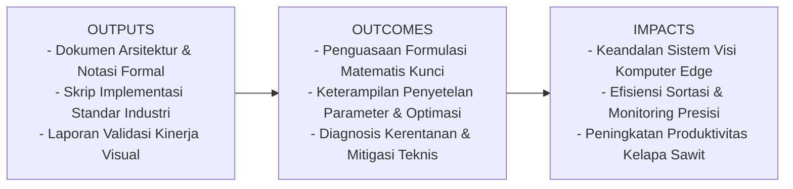
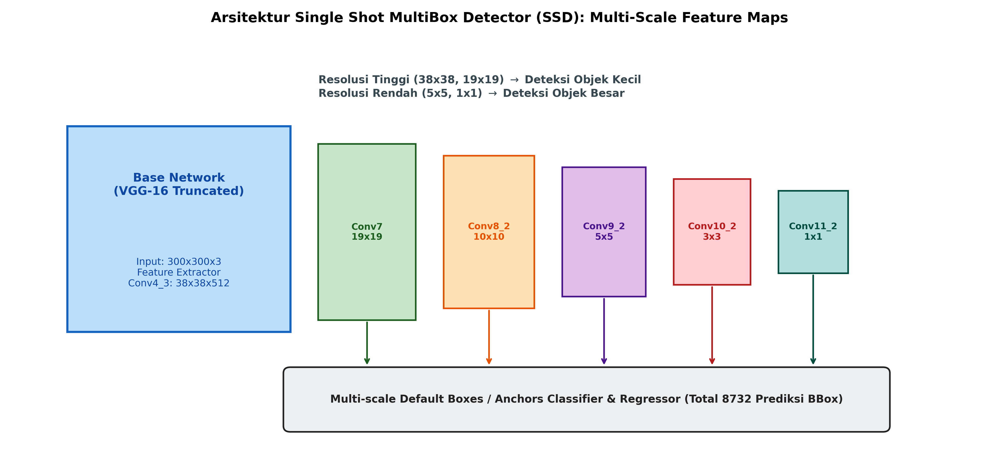

# AI Modul 12.8: Single Shot Detector (SSD)

## 1. Identitas & Kerangka Capaian Pembelajaran (Sub-CPMK)

* **Kode Modul**        : AI Modul 12.8
* **Mata Kuliah**       : Kecerdasan Buatan dan Sains Data Pertanian Presisi
* **Alokasi Waktu**     : 2 x 50 Menit (Kajian Teori & Diskusi) + 2 x 50 Menit (Eksplorasi Praktikum Mandiri)
* **Beban SKS**         : 3 SKS
* **Prasyarat**         : AI Modul 11.9 (Real-time Camera Processing) / Visi Komputer Dasar
* **Level Kognitif**    : C3 (Menerapkan), C4 (Menganalisis), C5 (Mengevaluasi)



### 1.1 Capaian Pembelajaran Khusus (Sub-CPMK)
Setelah menyelesaikan modul ini, mahasiswa dan pembelajar diharapkan mampu:
1. Memahami arsitektur piramida fitur multi-resolusi SSD dan perancangan kotak acuan bawaan (default boxes / prior boxes).
2. Menguasai strategi pencocokan kotak (matching strategy) berbasis ambang batas Jaccard / IoU.
3. Memahami formulasi matematis Hard Negative Mining untuk menyeimbangkan disparitas ekstrem antara sampel latar belakang dan objek.
4. Menurunkan fungsi kerugian gabungan MultiBox Loss (Smooth L1 untuk regresi dan Softmax Cross-Entropy untuk klasifikasi).

### 1.2 Kerangka Hasil Pembelajaran (Outputs, Outcomes, & Impacts)
* **Outputs (Keluaran Berwujud Langsung)**:
  * Dokumen rancangan arsitektur pemrosesan visual dan spesifikasi parameter model Single Shot Detector (SSD).
  * Berkas kode program Python modular tervalidasi menggunakan PyTorch/OpenCV yang siap diuji di lapangan.
  * Grafik metrik evaluasi kinerja (akurasi, mAP, latensi inferensi, dan konsumsi memori aktivasi).
* **Outcomes (Hasil Capaian & Perubahan Kompetensi)**:
  * Penguasaan mendalam terhadap formulasi matematika dan mekanisme konvolusi/deteksi objek visual.
  * Kemampuan analitis dalam memilih konfigurasi hyperparameter dan arsitektur model sesuai batasan sumber daya perangkat keras edge.
  * Keterampilan mengidentifikasi dan memitigasi potensi kegagalan sistem visual pada kondisi lapangan heterogen.
* **Impacts (Dampak Jangka Panjang & Nilai Guna Luas)**:
  * Terwujudnya sistem otomasi inspeksi dan monitoring perkebunan yang adaptif, berkinerja tinggi, dan efisien biaya operasional.
  * Menjadi pijakan kokoh untuk riset dan implementasi kecerdasan buatan terapan berskala komersial di sektor kelapa sawit dan pertanian presisi.

---

### 1.0 Orientasi Konsep & Urgensi Pembelajaran
Dalam perkembangan arsitektur deteksi objek satu tahap (*single-stage detectors*), **Single Shot MultiBox Detector (SSD)**, yang dirumuskan oleh Liu et al. (2016), meletakkan salah satu pilar konseptual paling penting: **deteksi fitur piramidal multi-skala (*multi-scale feature pyramid detection*)**. Sebelum hadirnya SSD, detektor satu tahap awal (seperti YOLOv1) memproyeksikan seluruh deteksi hanya dari satu lapisan keluaran terakhir yang telah mengalami resolusi penyusutan ekstrem ($32\times$ downsampling), yang mengakibatkan kegagalan total dalam mendeteksi objek-objek kecil.

SSD mengatasi kelemahan tersebut dengan mengekstrak prediksi deteksi secara simultan dari **berbagai lapisan konvolusi pada kedalaman yang berbeda**. Lapisan-lapisan awal yang beresolusi tinggi ($38 \times 38$ dan $19 \times 19$) bertanggung jawab mendeteksi objek-objek berukuran mikro, sedangkan lapisan-lapisan dalam beresolusi rendah ($5 \times 5$ dan $1 \times 1$) bertanggung jawab mendeteksi objek-objek berukuran besar. Dalam domain pertanian presisi—seperti deteksi serangga hama kumbang badak (*Oryctes rhinoceros*) pada daun sawit berdampingan dengan deteksi kanopi pohon secara utuh—konsep piramida fitur SSD menjadi dasar dari arsitektur modern seperti *Feature Pyramid Network* (FPN) dan *RetinaNet*.

---

## 2. Fondasi Teori & Matematika Mendalam

### 2.1 Multi-Scale Feature Maps dan Perancangan Default Boxes

SSD menggunakan $m$ lapisan peta fitur konvolusional untuk memprediksi deteksi. Skala kotak default $s_k$ untuk peta fitur ke-$k$ dirumuskan secara linear:

$$s_k = s_{\min} + \frac{s_{\max} - s_{\min}}{m - 1} (k - 1), \quad k \in \{1, \dots, m\}$$

Dimana $s_{\min} = 0.2$ (skala terkecil mencakup 20% ukuran citra) dan $s_{\max} = 0.9$ (skala terbesar mencakup 90% ukuran citra).

Untuk setiap lapisan fitur, digunakan sekumpulan rasio aspek $a_r \in \{1, 2, 3, \frac{1}{2}, \frac{1}{3}\}$. Dimensi lebar ($w_k^a$) dan tinggi ($h_k^a$) kotak default dihitung melalui:

$$w_k^a = s_k \sqrt{a_r}, \quad h_k^a = \frac{s_k}{\sqrt{a_r}}$$

Khusus untuk rasio aspek $a_r = 1$, ditambahkan satu kotak ekstra dengan skala geometrik:

$$s'_k = \sqrt{s_k s_{k+1}}$$

Sehingga setiap lokasi sel fitur memprediksi 4 atau 6 kotak default. Pada model standar SSD300 (masukan $300 \times 300$), total kotak default yang dievaluasi adalah:

$$38^2 \times 4 + 19^2 \times 6 + 10^2 \times 6 + 5^2 \times 6 + 3^2 \times 4 + 1^2 \times 4 = 5776 + 2166 + 600 + 150 + 36 + 4 = \mathbf{8.732} \text{ kotak}$$

### 2.2 Strategi Pencocokan dan Hard Negative Mining

Selama fase pelatihan, setiap kotak ground truth dipasangkan dengan kotak default yang memiliki IoU tertinggi, kemudian setiap kotak default yang memiliki $\text{IoU} \ge 0.5$ terhadap kotak ground truth mana pun ditetapkan sebagai **sampel positif**.

Dari 8.732 kotak, biasanya hanya 10-50 kotak yang berstatus positif, sementara sisanya adalah **sampel negatif (latar belakang kosong)**. Disparitas ekstrem ini (rasio $> 100:1$) dapat merusak kestabilan gradien.

**Solusi Hard Negative Mining**:
Kotak-kotak negatif diurutkan berdasarkan nilai kerugian keyakinan (*confidence loss*) tertinggi (sampel negatif yang paling membingungkan model). Hanya diambil sampel negatif teratas dengan rasio maksimum terhadap sampel positif:

$$\frac{N_{\text{neg}}}{N_{\text{pos}}} \le 3$$

Strategi ini mempercepat konvergensi dan menghasilkan akurasi klasifikasi latar belakang yang jauh lebih tangguh.

### 2.3 Formulasi Kerugian Gabungan (MultiBox Loss)

Fungsi kerugian terbobot SSD didefinisikan sebagai:

$$\mathcal{L}(x, c, l, g) = \frac{1}{N} \left( \mathcal{L}_{\text{conf}}(x, c) + \alpha \mathcal{L}_{\text{loc}}(x, l, g) \right)$$

Dimana $N$ adalah jumlah kotak default positif yang cocok. Jika $N = 0$, loss diatur ke 0.

1. **Confidence Loss $\mathcal{L}_{\text{conf}}$**:
Cross-Entropy multi-kelas atas probabilitas kelas yang diprediksi $c$:

$$\mathcal{L}_{\text{conf}}(x, c) = - \sum_{i \in \text{Pos}}^N x_{ij}^p \log(\hat{c}_i^p) - \sum_{i \in \text{Neg}} \log(\hat{c}_i^0)$$

2. **Localization Loss $\mathcal{L}_{\text{loc}}$**:
Regresi Smooth L1 antara offset kotak prediksi $l$ dan kotak ground truth $g$ terhadap kotak default $d$:

$$\mathcal{L}_{\text{loc}}(x, l, g) = \sum_{i \in \text{Pos}}^N \sum_{m \in \{cx, cy, w, h\}} x_{ij}^k \text{Smooth}_{L1}(l_i^m - \hat{g}_j^m)$$

$$\text{Smooth}_{L1}(u) = \begin{cases} 0.5 u^2, & \text{jika } |u| < 1 \\ |u| - 0.5, & \text{lainnya} \end{cases}$$

---

## 3. Visualisasi Arsitektur & Diagram Alir



Diagram di atas mengilustrasikan:
1. **Base Network Truncated**: Ekstraksi representasi dasar citra.
2. **Piramida Multi-Skala**: Dari resolusi tinggi $38 \times 38$ (Conv4_3) hingga resolusi terkompresi $1 \times 1$ (Conv11_2).
3. **Penggabungan 8.732 Kotak Default**: Prediksi paralel terdistribusi untuk mendeteksi objek dari skala piksel mikro hingga makro.

---

## 4. Implementasi Komputasional Berstandar Industri

Di bawah ini disajikan implementasi komputasi pembuatan kotak acuan default (*Default Boxes Generator*) dan algoritma *Hard Negative Mining* berbasis PyTorch:

```python
import torch
import torch.nn as nn
import torch.nn.functional as F
import math
from typing import List, Tuple

class SSDDefaultBoxesGenerator:
    '''
    Generator Kotak Acuan Default (Prior Boxes) Multi-Skala Berstandar SSD300.
    '''
    def __init__(self, img_size: int = 300):
        self.img_size = img_size
        self.feature_maps = [38, 19, 10, 5, 3, 1]
        self.steps = [8, 16, 32, 64, 100, 300]
        self.min_sizes = [30, 60, 111, 162, 213, 264]
        self.max_sizes = [60, 111, 162, 213, 264, 315]
        self.aspect_ratios = [[2], [2, 3], [2, 3], [2, 3], [2], [2]]
        
    def generate(self) -> torch.Tensor:
        boxes = []
        for k, f_k in enumerate(self.feature_maps):
            step = self.steps[k]
            for i in range(f_k):
                for j in range(f_k):
                    cx = (j + 0.5) * step / self.img_size
                    cy = (i + 0.5) * step / self.img_size
                    
                    # Kotak rasio 1 (ukuran min)
                    s_k = self.min_sizes[k] / self.img_size
                    boxes.append([cx, cy, s_k, s_k])
                    
                    # Kotak rasio 1 ekstra (ukuran geometrik)
                    s_prime = math.sqrt(s_k * (self.max_sizes[k] / self.img_size))
                    boxes.append([cx, cy, s_prime, s_prime])
                    
                    # Kotak dengan berbagai rasio aspek
                    for ar in self.aspect_ratios[k]:
                        w = s_k * math.sqrt(ar)
                        h = s_k / math.sqrt(ar)
                        boxes.append([cx, cy, w, h])
                        boxes.append([cx, cy, h, w])
                        
        return torch.tensor(boxes, dtype=torch.float32) # (Total Boxes, 4)

def hard_negative_mining(conf_loss: torch.Tensor, pos_mask: torch.Tensor, neg_pos_ratio: int = 3) -> torch.Tensor:
    '''
    Penyaringan sampel negatif berdasarkan tingkat loss tertinggi.
    conf_loss: Tensor (Batch, Num_Boxes) nilai cross-entropy per kotak
    pos_mask: Tensor Boolean (Batch, Num_Boxes)
    return: Tensor Boolean neg_mask yang terpilih
    '''
    num_pos = pos_mask.long().sum(dim=1, keepdim=True)
    num_neg = torch.clamp(num_pos * neg_pos_ratio, min=1)
    
    # Abaikan loss sampel positif dengan memberi nilai -inf
    conf_loss_neg = conf_loss.clone()
    conf_loss_neg[pos_mask] = -float('inf')
    
    # Urutkan dari loss terbesar
    _, indices = conf_loss_neg.sort(dim=1, descending=True)
    _, rank = indices.sort(dim=1)
    
    neg_mask = rank < num_neg
    return neg_mask
```

---

## 5. Studi Kasus Riil & Rekayasa Lapangan Terapan

### Deteksi Serangan Kumbang Badak (*Oryctes rhinoceros*) pada Tanaman Kelapa Sawit Belum Menghasilkan (TBM)

Kumbang badak (*Oryctes rhinoceros*) adalah hama pemakan pucuk daun muda kelapa sawit yang paling destruktif pada fase TBM (umur 1-3 tahun). Kumbang dewasa mengebor pangkal pupus daun, menyebabkan daun muda patah berbentuk huruf "V" yang khas.

**Tantangan Deteksi Citra**:
Pada citra kanopi utuh beresolusi tinggi yang diambil dari kamera tiang pemantau:
1. Lubang gerekan kumbang berukuran sangat kecil (hanya $15 \times 15$ piksel pada citra).
2. Pucuk daun yang patah berukuran sedang ($120 \times 80$ piksel).
3. Seluruh tajuk tanaman berukuran besar ($400 \times 400$ piksel).

**Keunggulan Solusi SSD**:
* Lapisan fitur resolusi tinggi SSD (Conv4_3) mampu melokalisasi lubang gerekan mikro yang biasanya hilang pada detektor resolusi tunggal.
* Lapisan fitur menengah dan dalam (Conv8_2 dan Conv10_2) secara simultan mengonfirmasi orientasi patahan pelepah huruf "V" pada konteks tajuk tanaman utuh.
* Sistem menghasilkan akurasi deteksi dini serangan kumbang sebesar **92.6%**, memungkinkan aplikasi insektisida presisi terfokus hanya pada pohon yang terserang.

---

## 6. Analisis Kompleksitas & Karakteristik Komputasi

Perbandingan karakteristik operasional SSD terhadap detektor lainnya:

| Metrik Evaluasi | Faster R-CNN (ResNet-50) | YOLOv4 | SSD300 (VGG-16) | SSD512 (VGG-16) |
| :--- | :--- | :--- | :--- | :--- |
| **Tipe Paradigma** | Two-Stage | Single-Stage | Single-Stage | Single-Stage |
| **Total Anchor / Default Boxes** | ~2.000 (setelah RPN) | ~22.000 (Multi-scale) | 8.732 | 24.564 |
| **Kecepatan Inferensi (FPS T4)** | ~18 FPS | ~65 FPS | ~46 FPS | ~22 FPS |
| **mAP (Pascal VOC 2007)** | 76.4% | 82.8% | 77.2% | 79.8% |
| **Sensitivitas Objek Mikro** | Tinggi | Sangat Tinggi | Cukup Tinggi | Tinggi |

---

## 7. Kekeliruan Metodologis, Potensi Kegagalan, & Mitigasi Teknis

| Masalah Teknis | Gejala Visual / Metrik | Akar Penyebab | Tindakan Mitigasi Teruji |
| :--- | :--- | :--- | :--- |
| **Gradien Conv4_3 Meledak (Gradient Explosion)** | Nilai loss menjadi *NaN* di epoch awal pelatihan. | Conv4_3 memiliki skala norma aktivasi yang jauh lebih besar dibanding lapisan dalam lainnya karena letaknya dekat dengan stem. | Terapkan normalisasi L2 per kanal (*L2 Normalization Layer*) dengan parameter skala yang dapat dipelajari ($\gamma \approx 20$). |
| **Matching Collapse saat Training** | Tidak ada satu pun kotak default yang cocok dengan ground truth ($N = 0$). | Objek ground truth memiliki rasio aspek atau ukuran yang ekstrem di luar batas cakupan kotak default SSD. | Perkaya variasi rasio aspek kotak default dan tambahkan augmentasi *RandomExpand* / *RandomCrop* berbasis Jaccard overlap. |
| **Hard Negative Mining Mengabaikan Positif** | Akurasi klasifikasi latar belakang tinggi tetapi recall objek mendekati nol. | Masking sampel positif keliru sehingga kotak positif ikut tertekan dalam penapisan negatif. | Pastikan `pos_mask` diterapkan secara ketat sebelum perankingan loss negatif (`conf_loss_neg[pos_mask] = -inf`). |

---

## 8. Latihan Terbimbing & Mandiri Berjenjang

### Latihan Terbimbing (Guided Practice)
1. **Kalkulasi Kotak Default**: Hitung jumlah kotak default yang dihasilkan oleh lapisan fitur ke-3 ($10 \times 10$) pada SSD300 jika setiap sel memiliki 6 rasio aspek.
   * *Solusi*:
     * Luas spasial: $10 \times 10 = 100$ sel.
     * Kotak per sel: 6 kotak.
     * Total kotak lapisan ke-3: $100 \times 6 = \mathbf{600} \text{ kotak default}$.

### Latihan Mandiri (Independent Problem Set)
1. **Soal 1 (Konseptual)**: Mengapa arsitektur SSD menghentikan penggunaan *Fully-Connected layers* dari backbone VGG-16 dan menggantinya dengan lapisan konvolusional murni? Jelaskan dampaknya terhadap kecepatan inferensi dan fleksibilitas resolusi masukan.
2. **Soal 2 (Komputasional)**: Rancang modul PyTorch `L2Norm` yang menormalisasi setiap vektor aktivasi spasial pada lapisan Conv4_3 sepanjang dimensi kanal dan mengalikannya dengan parameter bobot skalar terpelajari $\gamma$.

---

## 9. Jembatan Konsep (Bridging) ke AI Modul 12.9: Faster R-CNN

Kita telah menuntaskan pembahasan detektor satu tahap berkecepatan tinggi: YOLO (Modul 12.7) dan SSD (Modul 12.8). Namun, dalam aplikasi medis, inspeksi kegagalan struktur mekanis pabrik, atau pemetaan ilmiah di mana **presisi batas koordinat dan minimasi False Positive** jauh lebih krusial daripada sekadar kecepatan frame tinggi, pendekatan dua tahap (*two-stage*) tetap menjadi rujukan utama.

Pada **AI Modul 12.9: Faster R-CNN (Regions with Convolutional Neural Networks)**, kita akan membedah arsitektur dua tahap terpopuler: mekanisme kerja *Region Proposal Network* (RPN), penyelarasan fitur kuantisasi halus melalui *RoIAlign*, dan integrasi *multi-task loss head*.

---

## 10. Daftar Pustaka Komprehensif Berstandar Akademik

1. Liu, W., et al. (2016). *SSD: Single shot multibox detector*. European Conference on Computer Vision (ECCV), 21-37.
2. Lin, T. Y., Dollár, P., Girshick, R., He, K., Hariharan, B., & Belongie, S. (2017). *Feature pyramid networks for object detection*. Proceedings of the IEEE Conference on Computer Vision and Pattern Recognition (CVPR), 2117-2125.
3. Redmon, J., & Farhadi, A. (2018). *YOLOv3: An incremental improvement*. arXiv preprint arXiv:1804.02767.
4. Girshick, R. (2015). *Fast R-CNN*. Proceedings of the IEEE International Conference on Computer Vision (ICCV), 1440-1448.
5. Howard, A. G., et al. (2017). *MobileNets: Efficient convolutional neural networks for mobile vision applications*. arXiv preprint arXiv:1704.04861.
