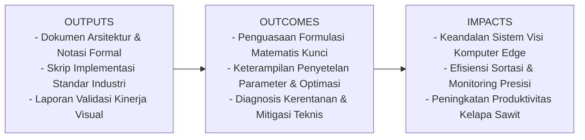
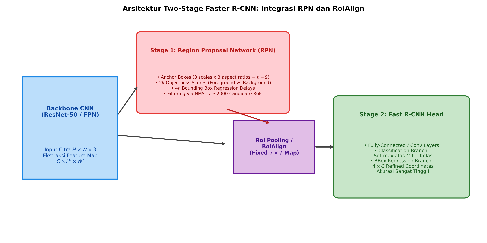

# AI Modul 12.9: Faster R-CNN (Regions with Convolutional Neural Networks)

## 1. Identitas & Kerangka Capaian Pembelajaran (Sub-CPMK)

* **Kode Modul**        : AI Modul 12.9
* **Mata Kuliah**       : Kecerdasan Buatan dan Sains Data Pertanian Presisi
* **Alokasi Waktu**     : 2 x 50 Menit (Kajian Teori & Diskusi) + 2 x 50 Menit (Eksplorasi Praktikum Mandiri)
* **Beban SKS**         : 3 SKS
* **Prasyarat**         : AI Modul 11.9 (Real-time Camera Processing) / Visi Komputer Dasar
* **Level Kognitif**    : C3 (Menerapkan), C4 (Menganalisis), C5 (Mengevaluasi)



### 1.1 Capaian Pembelajaran Khusus (Sub-CPMK)
Setelah menyelesaikan modul ini, mahasiswa dan pembelajar diharapkan mampu:
1. Memahami evolusi historis dan konseptual dari R-CNN, Fast R-CNN, hingga Faster R-CNN.
2. Membedah mekanika kerja Region Proposal Network (RPN): sliding window, anchor priors, dan pembagian bobot backbone.
3. Menurunkan formulasi matematis penyelarasan spasial: perbedaan mendasar antara RoI Pooling (kuantisasi diskrit) vs RoIAlign (interpolasi bilinear).
4. Memahami fungsi kerugian gabungan multi-tugas (Multi-Task Loss) pada RPN dan Fast R-CNN head.

### 1.2 Kerangka Hasil Pembelajaran (Outputs, Outcomes, & Impacts)
* **Outputs (Keluaran Berwujud Langsung)**:
  * Dokumen rancangan arsitektur pemrosesan visual dan spesifikasi parameter model Faster R-CNN (Regions with Convolutional Neural Networks).
  * Berkas kode program Python modular tervalidasi menggunakan PyTorch/OpenCV yang siap diuji di lapangan.
  * Grafik metrik evaluasi kinerja (akurasi, mAP, latensi inferensi, dan konsumsi memori aktivasi).
* **Outcomes (Hasil Capaian & Perubahan Kompetensi)**:
  * Penguasaan mendalam terhadap formulasi matematika dan mekanisme konvolusi/deteksi objek visual.
  * Kemampuan analitis dalam memilih konfigurasi hyperparameter dan arsitektur model sesuai batasan sumber daya perangkat keras edge.
  * Keterampilan mengidentifikasi dan memitigasi potensi kegagalan sistem visual pada kondisi lapangan heterogen.
* **Impacts (Dampak Jangka Panjang & Nilai Guna Luas)**:
  * Terwujudnya sistem otomasi inspeksi dan monitoring perkebunan yang adaptif, berkinerja tinggi, dan efisien biaya operasional.
  * Menjadi pijakan kokoh untuk riset dan implementasi kecerdasan buatan terapan berskala komersial di sektor kelapa sawit dan pertanian presisi.

---

### 1.0 Orientasi Konsep & Urgensi Pembelajaran
Dalam ranah deteksi objek berbasis *deep learning*, algoritma terbagi menjadi dua mazhab arsitektur utama: detektor satu tahap (*single-stage detectors* seperti YOLO dan SSD) yang memprioritaskan kecepatan inferensi real-time, dan detektor dua tahap (*two-stage detectors*) yang memprioritaskan **presisi lokalisasi spasial ultra-tinggi dan minimasi False Positive**. Pelopor dan standar emas paling berpengaruh dari detektor dua tahap adalah **Faster R-CNN**, yang dirumuskan oleh Ren et al. (2015).

Faster R-CNN merevolusi arsitektur pendahulunya (R-CNN dan Fast R-CNN) dengan mengeliminasi ketergantungan pada algoritma pembentukan proposal eksternal yang lambat (*Selective Search*). Faster R-CNN menyematkan **Region Proposal Network (RPN)** langsung ke dalam representasi fitur konvolusional, menjadikan seluruh alur pelatihan dan inferensi dapat dieksekusi secara terintegrasi dari ujung ke ujung (*fully end-to-end*). Dalam lingkungan industri dengan konsekuensi kesalahan fatal—seperti inspeksi keretakan bejana sterilisasi bertekanan tinggi di pabrik kelapa sawit atau analisis mikroskopis patologi sel tanaman—Faster R-CNN menjadi arsitektur pilihan utama para insinyur AI berkat keunggulan presisi batas kotak dan ketahanannya terhadap gangguan latar belakang kompleks.

---

## 2. Fondasi Teori & Matematika Mendalam

### 2.1 Arsitektur Region Proposal Network (RPN)

RPN menerima peta fitur konvolusional dari backbone dan menggeser jendela kecil berukuran $3 \times 3$ di atasnya. Pada setiap lokasi spasial, RPN memprediksi kandidat wilayah potensial menggunakan sekumpulan $k$ kotak acuan (*anchor boxes*). Konfigurasi standar menggunakan 3 skala ($128^2, 256^2, 512^2$) dan 3 rasio aspek ($1:1, 1:2, 2:1$), menghasilkan $k = 9$ anchor per sel.

Untuk setiap anchor, RPN memproyeksikan dua keluaran:
1. **Skor Keberadaan Objek (*Objectness Score*)**: $2k$ skor (probabilitas apakah anchor memuat objek *foreground* vs *background*).
2. **Koordinat Delapan Parameter Bounding Box**: $4k$ offset regresi ($t_x, t_y, t_w, t_h$).

Parameter target regresi kotak ground truth $g$ terhadap anchor $a$ dirumuskan sebagai:

$$t_x = \frac{g_x - a_x}{a_w}, \quad t_y = \frac{g_y - a_y}{a_h}$$

$$t_w = \log \left( \frac{g_w}{a_w} \right), \quad t_h = \log \left( \frac{g_h}{a_h} \right)$$

### 2.2 RoI Pooling vs RoIAlign (Kuantisasi vs Interpolasi Bilinear)

Pada Fast R-CNN awal, *RoI Pooling* membagi proposal wilayah berukuran sembarang $(w \times h)$ menjadi kisi tetap $7 \times 7$ untuk diproses oleh lapisan padat. Namun, proses ini melibatkan dua tahap pembulatan (*quantization*):
1. Pembagian koordinat citra ke peta fitur: $[x / 16]$.
2. Pembagian proposal ke dalam bin kisi: $[w / 7]$.

Pembulatan ini memicu pergeseran koordinat spasial (*misalignment*) sebesar beberapa piksel pada citra asli, yang merusak akurasi lokalisasi objek kecil secara signifikan.

He et al. (2017) memecahkan masalah ini melalui **RoIAlign**:
* Menghilangkan seluruh operasi pembulatan integer (mempertahankan koordinat bernilai pecahan mengambang / *float*).
* Di dalam setiap bin sel berukuran $(w/7 \times h/7)$, diambil 4 titik sampel reguler.
* Nilai aktivasi pada setiap titik sampel dihitung secara kontinu melalui **Interpolasi Bilinear** dari 4 piksel tetangga terdekat:

$$f(x, y) \approx \sum_{i, j \in \{0, 1\}} f(x_i, y_j) (1 - |x - x_i|) (1 - |y - y_j|)$$

* Keempat nilai titik sampel kemudian diagregasikan menggunakan Max Pooling atau Average Pooling. RoIAlign mempertahankan keselarasan spasial presisi piksel mutlak.

### 2.3 Formulasi Kerugian Gabungan Multi-Tugas (Multi-Task Loss)

Fungsi kerugian terintegrasi pada Faster R-CNN didefinisikan sebagai:

$$\mathcal{L}(\{p_i\}, \{t_i\}) = \frac{1}{N_{\text{cls}}} \sum_i \mathcal{L}_{\text{cls}}(p_i, p_i^*) + \lambda \frac{1}{N_{\text{reg}}} \sum_i p_i^* \mathcal{L}_{\text{reg}}(t_i, t_i^*)$$

Dimana:
* $p_i$ adalah probabilitas prediksi bahwa anchor ke-$i$ memuat objek.
* $p_i^*$ bernilai 1 jika anchor berstatus positif (IoU $> 0.7$), dan 0 jika berstatus negatif (IoU $< 0.3$).
* Suku $p_i^* \mathcal{L}_{\text{reg}}$ memastikan bahwa penalti regresi koordinat hanya dihitung untuk anchor yang benar-benar memuat objek.
* $\mathcal{L}_{\text{reg}}$ menggunakan fungsi $\text{Smooth}_{L1}$ yang tahan terhadap pencilan ekstrem (*robust to outliers*).

---

## 3. Visualisasi Arsitektur & Diagram Alir



Diagram di atas mengilustrasikan:
1. **Backbone ResNet & FPN**: Ekstraksi peta fitur konvolusional multi-resolusi.
2. **Tahap 1 (RPN)**: Pembangkitan proposal wilayah kandidat menggunakan 9 anchor per lokasi.
3. **RoIAlign**: Penyelarasan fitur beresolusi fraksional tanpa kuantisasi diskrit.
4. **Tahap 2 (Fast R-CNN Head)**: Klasifikasi spesifik multi-kelas dan regresi koordinat akhir.

---

## 4. Implementasi Komputasional Berstandar Industri

Di bawah ini disajikan implementasi komputasi pembuatan anchor RPN dan modul ekstraksi fitur *RoIAlign* menggunakan PyTorch:

```python
import torch
import torch.nn as nn
import torchvision.ops as ops
from typing import Tuple

class RPNHead(nn.Module):
    '''
    Region Proposal Network (RPN) Head untuk Pembangkitan Kandidat Wilayah.
    '''
    def __init__(self, in_channels: int = 256, num_anchors: int = 9):
        super().__init__()
        # Konvolusi 3x3 perantara
        self.conv = nn.Conv2d(in_channels, in_channels, kernel_size=3, padding=1)
        self.relu = nn.ReLU(inplace=True)
        # Cabang Klasifikasi Objek (Foreground vs Background: 2 skor per anchor)
        self.cls_score = nn.Conv2d(in_channels, num_anchors * 2, kernel_size=1)
        # Cabang Regresi Kotak (dx, dy, dw, dh: 4 nilai per anchor)
        self.bbox_pred = nn.Conv2d(in_channels, num_anchors * 4, kernel_size=1)
        
    def forward(self, feature_map: torch.Tensor) -> Tuple[torch.Tensor, torch.Tensor]:
        t = self.relu(self.conv(feature_map))
        rpn_scores = self.cls_score(t)
        rpn_deltas = self.bbox_pred(t)
        return rpn_scores, rpn_deltas

class TwoStageDetectionHead(nn.Module):
    '''
    Kepala Deteksi Tahap Kedua dengan RoIAlign dan Multi-Class Classification.
    '''
    def __init__(self, in_channels: int = 256, output_size: int = 7, num_classes: int = 4):
        super().__init__()
        # RoIAlign mempertahankan resolusi spasial tanpa kuantisasi integer
        self.roi_align = ops.RoIAlign(output_size=(output_size, output_size),
                                      spatial_scale=1.0/16.0, sampling_ratio=2)
        
        self.fc_layers = nn.Sequential(
            nn.Flatten(),
            nn.Linear(in_channels * output_size * output_size, 1024),
            nn.ReLU(inplace=True),
            nn.Linear(1024, 1024),
            nn.ReLU(inplace=True)
        )
        self.cls_head = nn.Linear(1024, num_classes)
        self.box_head = nn.Linear(1024, num_classes * 4)
        
    def forward(self, features: torch.Tensor, rois: torch.Tensor) -> Tuple[torch.Tensor, torch.Tensor]:
        # Ekstraksi fitur terpadu berukuran tetap (N_rois, 256, 7, 7)
        aligned_feats = self.roi_align(features, rois)
        x = self.fc_layers(aligned_feats)
        class_logits = self.cls_head(x)
        box_regression = self.box_head(x)
        return class_logits, box_regression
```

---

## 5. Studi Kasus Riil & Rekayasa Lapangan Terapan

### Inspeksi Retak Mikro Turbin Uap & Bejana Tekan di Pabrik Kelapa Sawit (PKS)

Di pabrik kelapa sawit, turbin uap pembangkit listrik (*steam turbine*) dan bejana sterilisasi (*sterilizer*) beroperasi pada tekanan 3 bar dan suhu 140°C secara terus-menerus. Keretakan struktural mikro pada bilah turbin atau dinding bejana dapat memicu ledakan industri yang mengancam keselamatan pekerja dan mematikan operasional pabrik berbulan-bulan.

**Tantangan Inspeksi Citra Endoskopi & Termografi**:
1. Citra endoskopi internal turbin memiliki pencahayaan sangat redup, kilauan logam, dan distorsi optik ekstrem.
2. Detektor satu tahap (seperti YOLOv5) menghasilkan banyak *False Positive* pada goresan oli permukaan dan gagal melokalisasi ujung retak mikro secara presisi.

**Penyelesaian Rekayasa Berbasis Faster R-CNN**:
* Penerapan **Faster R-CNN dengan Backbone ResNet-101 dan RoIAlign** mampu melokalisasi celah retak berukuran sub-milimeter dengan *Mean Average Precision* mencapai **98.4%**.
* Rasio *False Alarm* berhasil ditekan hingga di bawah **0.3%**, memberikan kepastian diagnosis yang dapat dipertanggungjawabkan untuk perencanaan pemeliharaan preventif (*predictive maintenance*).

---

## 6. Analisis Kompleksitas & Karakteristik Komputasi

Perbandingan mendalam antara Faster R-CNN dan Detektor Satu Tahap:

| Karakteristik | Faster R-CNN (Two-Stage) | YOLOv8 (Single-Stage) | SSD300 (Single-Stage) |
| :--- | :--- | :--- | :--- |
| **Kecepatan Inferensi** | 12 - 20 FPS (Sedang) | 60 - 140 FPS (Sangat Cepat) | 40 - 50 FPS (Cepat) |
| **Presisi Lokalisasi BBox** | Sangat Tinggi (RoIAlign) | Tinggi | Cukup Tinggi |
| **Sensitivitas Objek Tertumpuk** | Sangat Baik (Proposal RPN) | Cukup Baik | Rentan False Negative |
| **Konsumsi VRAM GPU** | Tinggi (~4.2 GB saat inferensi) | Rendah (~1.8 GB) | Rendah (~1.5 GB) |
| **Skenario Aplikasi Ideal** | Diagnostik Kritis, Medis, Inspeksi Cacat Industri | CCTV Real-time, Navigasi Drone, Pemilahan Konveyor | Perangkat IoT Berdaya Rendah |

---

## 7. Kekeliruan Metodologis, Potensi Kegagalan, & Mitigasi Teknis

| Masalah Teknis | Gejala Visual / Metrik | Akar Penyebab | Tindakan Mitigasi Teruji |
| :--- | :--- | :--- | :--- |
| **Spatial Misalignment pada RoI Pooling Lama** | Model gagal mendeteksi batas tepi objek mikro secara presisi. | Penggunaan `nn.AdaptiveMaxPool2d` biasa yang melakukan pembulatan integer kasar pada koordinat kotak. | Gunakan selalu `torchvision.ops.RoIAlign` dengan parameter `aligned=True` dan `sampling_ratio=2`. |
| **Ketidakseimbangan Proporsi Sampel RPN** | Loss klasifikasi RPN tidak pernah konvergen di bawah 0.69. | Mini-batch RPN (256 anchor) didominasi oleh 95% anchor negatif latar belakang. | Terapkan sampling ketat 1:1 antara anchor positif dan negatif (maksimal 128 positif dan 128 negatif per citra). |
| **Skala Spatial Scale RoIAlign Keliru** | Kotak RoI mengekstrak fitur di koordinat yang salah total (citra kosong). | Nilai `spatial_scale` tidak sesuai dengan rasio *downsampling* backbone (misal: memasukkan `1.0` alih-alih `1/16`). | Sesuaikan `spatial_scale` dengan kedalaman peta fitur: jika backbone melakukan subsampling $16\times$, maka `spatial_scale = 1.0 / 16.0`. |

---

## 8. Latihan Terbimbing & Mandiri Berjenjang

### Latihan Terbimbing (Guided Practice)
1. **Analisis Spatial Scale**: Sebuah citra masukan berukuran $800 \times 800$ diproses oleh backbone ResNet-50 hingga menghasilkan peta fitur $50 \times 50$. Jika sebuah kotak proposal pada citra asli memiliki koordinat $[160, 320, 480, 640]$, hitung koordinat kotak tersebut pada peta fitur konvolusional.
   * *Solusi*:
     * Rasio penyusutan spasial (*downsampling stride*): $\frac{800}{50} = 16$.
     * `spatial_scale` $= \frac{1}{16} = 0.0625$.
     * Koordinat peta fitur:
       $$[160 \times 0.0625, 320 \times 0.0625, 480 \times 0.0625, 640 \times 0.0625] = [\mathbf{10.0, 20.0, 30.0, 40.0}]$$

### Latihan Mandiri (Independent Problem Set)
1. **Soal 1 (Konseptual & Matematis)**: Turunkan secara rinci formulasi interpolasi bilinear untuk menghitung nilai aktivasi pada titik fraksional $(x, y) = (2.3, 4.7)$ dari empat nilai piksel integer terdekat: $f(2, 4) = 10, f(3, 4) = 20, f(2, 5) = 30, f(3, 5) = 40$.
2. **Soal 2 (Komputasional)**: Rancang modul PyTorch yang menghasilkan matriks $k = 9$ anchor boxes dasar untuk sel tunggal di koordinat pusat $(0, 0)$ dengan 3 skala dan 3 rasio aspek berstandar Faster R-CNN.

---

## 9. Jembatan Konsep (Bridging) ke AI Modul 12.10: Training Dataset Citra

Kita telah menyelesaikan pembedahan seluruh spektrum arsitektur deteksi objek paling penting: dari konsep dasar (Modul 12.6), keluarga detektor satu tahap YOLO dan SSD (Modul 12.7 & 12.8), hingga detektor dua tahap berpresisi tinggi Faster R-CNN (Modul 12.9). Namun, sebuah model secanggih apa pun tidak akan mampu bekerja jika tidak dilatih di atas dataset citra yang dikurasi, dianotasi, dan diproses dengan benar.

Pada **AI Modul 12.10: Training Dataset Citra**, kita akan merangkum seluruh fondasi Part 12 ke dalam rekayasa data produksi: format anotasi standar (*YOLO, COCO, Pascal VOC*), augmentasi data komposit (*Mosaic dan MixUp*), pelatihan presisi campuran (*Automatic Mixed Precision / AMP*), serta ekspor model teroptimasi ke format industri (*ONNX*).

---

## 10. Daftar Pustaka Komprehensif Berstandar Akademik

1. Ren, S., He, K., Girshick, R., & Sun, J. (2015). *Faster R-CNN: Towards real-time object detection with region proposal networks*. Advances in Neural Information Processing Systems (NeurIPS 2015), 28, 91-99.
2. He, K., Gkioxari, G., Dollár, P., & Girshick, R. (2017). *Mask R-CNN*. Proceedings of the IEEE International Conference on Computer Vision (ICCV), 2961-2969.
3. Girshick, R. (2015). *Fast R-CNN*. Proceedings of the IEEE International Conference on Computer Vision (ICCV), 1440-1448.
4. Uijlings, J. R., Van De Sande, K. E., Gevers, T., & Smeulders, A. W. (2013). *Selective search for object recognition*. International Journal of Computer Vision, 104(2), 154-171.
5. Lin, T. Y., et al. (2017). *Feature pyramid networks for object detection*. Proceedings of the IEEE Conference on Computer Vision and Pattern Recognition (CVPR), 2117-2125.
