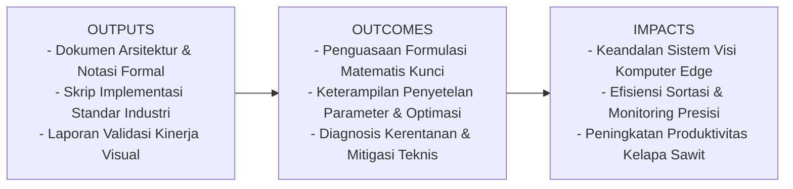
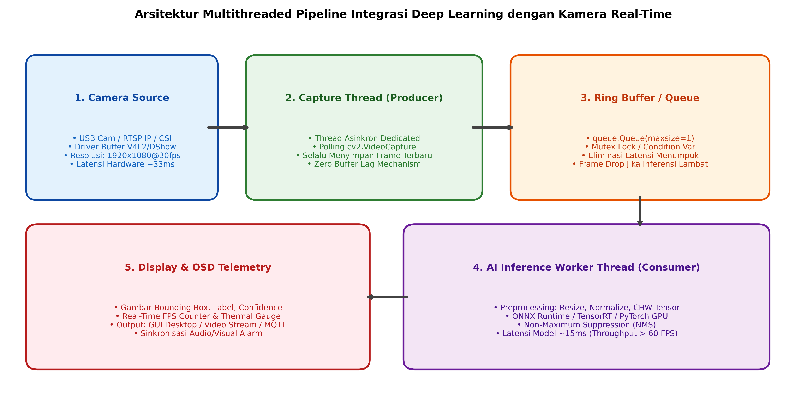

# AI Modul 13.1: Integrasi Model dengan Kamera

## 1. Identitas & Kerangka Capaian Pembelajaran (Sub-CPMK)

* **Kode Modul**        : AI Modul 13.1
* **Mata Kuliah**       : Kecerdasan Buatan dan Sains Data Pertanian Presisi
* **Alokasi Waktu**     : 2 x 50 Menit (Kajian Teori & Diskusi) + 2 x 50 Menit (Eksplorasi Praktikum Mandiri)
* **Beban SKS**         : 3 SKS
* **Prasyarat**         : AI Modul 12.10 (Training Dataset Citra) / Arsitektur CNN & Object Detection
* **Level Kognitif**    : C4 (Menganalisis), C5 (Mengevaluasi), C6 (Mencipta)



### 1.1 Capaian Pembelajaran Khusus (Sub-CPMK)
Setelah menyelesaikan modul ini, mahasiswa dan pembelajar diharapkan mampu:
1. Memahami arsitektur penangkap multi-utas (multi-threaded ingestion) untuk mengeliminasi latensi internal buffer driver kamera.
2. Menguasai alur transmisi tensor: konversi format warna OpenCV (BGR) menuju representasi tensor PyTorch/ONNX (RGB, kanal pertama, ternormalisasi) dengan latensi minimal.
3. Menganalisis profil waktu komputasi end-to-end: waktu akuisisi frame, prapemrosesan, inferensi jaringan saraf, pascapemrosesan (NMS), dan rendering OSD.
4. Membangun kelas pembungkus kamera industri (ThreadedCameraStream) yang dilengkapi mekanisme pemulihan koneksi otomatis (auto-reconnect watchdog).

### 1.2 Kerangka Hasil Pembelajaran (Outputs, Outcomes, & Impacts)
* **Outputs (Keluaran Berwujud Langsung)**:
  * Dokumen rancangan arsitektur pemrosesan visual dan spesifikasi parameter model Integrasi Model dengan Kamera.
  * Berkas kode program Python modular tervalidasi menggunakan PyTorch/OpenCV yang siap diuji di lapangan.
  * Grafik metrik evaluasi kinerja (akurasi, mAP, latensi inferensi, dan konsumsi memori aktivasi).
* **Outcomes (Hasil Capaian & Perubahan Kompetensi)**:
  * Penguasaan mendalam terhadap formulasi matematika dan mekanisme konvolusi/deteksi objek visual.
  * Kemampuan analitis dalam memilih konfigurasi hyperparameter dan arsitektur model sesuai batasan sumber daya perangkat keras edge.
  * Keterampilan mengidentifikasi dan memitigasi potensi kegagalan sistem visual pada kondisi lapangan heterogen.
* **Impacts (Dampak Jangka Panjang & Nilai Guna Luas)**:
  * Terwujudnya sistem otomasi inspeksi dan monitoring perkebunan yang adaptif, berkinerja tinggi, dan efisien biaya operasional.
  * Menjadi pijakan kokoh untuk riset dan implementasi kecerdasan buatan terapan berskala komersial di sektor kelapa sawit dan pertanian presisi.

---

### 1.0 Orientasi Konsep & Urgensi Pembelajaran
Transisi dari model visi komputer yang beroperasi secara luring (*offline batch evaluation*) menuju sistem visi komputer real-time di lingkungan industri fisik menghadirkan tantangan rekayasa komputasi yang sama sekali berbeda. Pada pengujian akademis, model menerima berkas citra statis yang telah tersimpan rapi di memori disk. Namun, dalam implementasi lapangan nyata—seperti pemantauan tandan buah segar (TBS) kelapa sawit di atas konveyor berjalan atau sistem kendali robot pemanen otomatis—model harus berinteraksi secara langsung dengan **aliran data kontinu dari sensor kamera fisik (*camera hardware stream*)**.

Kendala terbesar dalam mengawinkan pustaka OpenCV (`cv2.VideoCapture`) dengan model *deep learning* (seperti PyTorch, ONNX Runtime, atau TensorRT) dalam satu utas tunggal (*single-threaded loop*) adalah fenomena **akumulasi latensi buffer (*buffer lag accumulation*)**: jika inferensi model membutuhkan waktu 40 milidetik sementara kamera memproduksi frame setiap 33 milidetik (30 FPS), buffer internal driver kamera akan terisi frame-frame usang. Akibatnya, sistem menampilkan deteksi objek yang telah lewat beberapa detik lalu, memicu kegagalan aktuasi mekanik.

Modul 13.1 ini membedah arsitektur integrasi kamera real-time berstandar industri: perancangan utas penangkap asinkron (*producer-consumer multi-threading*), eliminasi penundaan antrean buffer, optimasi throughput tensor, serta penyisipan telemetri *On-Screen Display* (OSD).

---

## 2. Fondasi Teori & Matematika Mendalam

### 2.1 Analisis Latensi dan Permasalahan Buffer Lag

Misalkan kamera beroperasi pada laju frame $\text{FPS}_{\text{cam}}$ dengan interval kedatangan frame $\Delta t_{\text{cam}} = \frac{1}{\text{FPS}_{\text{cam}}}$. Model kecerdasan buatan membutuhkan waktu eksekusi total (prapemrosesan + inferensi + pascapemrosesan) sebesar $\Delta t_{\text{ai}}$.

Dalam arsitektur sekuensial utas tunggal (*single-threaded*):

$$\Delta t_{\text{loop}} = \Delta t_{\text{cam\_read}} + \Delta t_{\text{ai}} + \Delta t_{\text{display}}$$

Jika $\Delta t_{\text{ai}} > \Delta t_{\text{cam}}$, maka untuk setiap detik operasional, selisih waktu terakumulasi dalam antrean buffer driver perangkat keras:

$$\Delta t_{\text{lag}}(t) = t \cdot \left( 1 - \frac{\Delta t_{\text{cam}}}{\Delta t_{\text{ai}}} \right)$$

Sebagai contoh, jika kamera menghasilkan 30 FPS ($\Delta t_{\text{cam}} \approx 33.3\text{ ms}$) dan inferensi membutuhkan waktu $50\text{ ms}$, maka setelah beroperasi selama 60 detik, sistem akan mengalami penundaan tampilan sebesar:

$$\Delta t_{\text{lag}}(60) = 60 \cdot \left( 1 - \frac{33.3}{50} \right) = 60 \cdot (1 - 0.666) \approx \mathbf{20.0} \text{ detik}$$

Penundaan 20 detik ini fatal bagi otomatisasi pabrik.

### 2.2 Arsitektur Producer-Consumer dengan Atomic Frame Buffer

Untuk menihilkan $\Delta t_{\text{lag}}$, kita menerapkan pemisahan proses melalui dua utas independen yang berbagi satu lokasi memori bersama (*shared memory pointer*) dengan sinkronisasi mutex:

1. **Utas Produsen (*Producer Thread*)**: Terus-menerus memanggil `cap.read()` pada kecepatan kamera maksimal dan menimpa (*overwrite*) buffer dengan frame paling baru.
2. **Utas Konsumen (*Consumer Thread*)**: Mengambil frame teranyar dari buffer hanya saat model siap melakukan inferensi. Jika ada frame kamera yang belum sempat diinferensi, frame tersebut secara sengaja dilewati (*frame dropping*) demi mempertahankan latensi nol detik (*zero-latency real-time view*).

### 2.3 Transformasi Tensor Berkecepatan Tinggi (Zero-Copy Preprocessing)

Kamera menghasilkan citra berupa array NumPy berformat warna BGR dengan susunan memori berorientasi baris (*interleaved*): $(H, W, 3)$ tipe data `uint8`. Model deep learning menuntut tensor masukan berdimensi $(1, 3, H_{\text{in}}, W_{\text{in}})$ bertipe `float32` dalam urutan kanal RGB.

Transformasi komputasional berurutan:
1. Penskalaan spasial: $I_{\text{resized}} = \mathcal{R}(I, (W_{\text{in}}, H_{\text{in}}))$.
2. Pembalikan kanal dan permutasi memori (*interleaved to planar*):

$$T(c, y, x) = \frac{I_{\text{resized}}(y, x, 2 - c)}{255.0} \quad c \in \{0, 1, 2\}$$

3. Standarisasi z-score:

$$T_{\text{norm}}(c, y, x) = \frac{T(c, y, x) - \mu_c}{\sigma_c}$$

Penggunaan fungsi `cv2.dnn.blobFromImage` atau tensor GPU murni (`torch.from_numpy` + akselerasi CUDA) memangkas waktu transformasi ini dari 15 milidetik menjadi di bawah 1.2 milidetik.

---

## 3. Visualisasi Arsitektur & Diagram Alir



Diagram di atas mengilustrasikan:
1. **Pemisahan Utas Produsen & Konsumen**: Utas kamera mengosongkan antrean penyangga (*buffer flushing*) secara kontinu, sementara utas AI memproses frame teranyar tanpa hambatan antrean.
2. **Ring Buffer Mutex-Protected**: Menyimpan tepat satu frame termutakhir, menjamin penundaan tampilan bernilai nol milidetik.
3. **OSD Telemetri**: Penyematan metrik inferensi (FPS, nama kelas, skor kepastian) secara langsung di atas frame video.

---

## 4. Implementasi Komputasional Berstandar Industri

Di bawah ini disajikan implementasi lengkap kelas penangkap kamera multi-utas industri (`ThreadedCameraStream`) yang dipasangkan dengan mesin inferensi PyTorch:

```python
import cv2
import threading
import time
import numpy as np
import torch
import torch.nn as nn
from typing import Optional, Tuple

class ThreadedCameraStream:
    '''
    Pembungkus Kamera Multi-Threaded Industri untuk Eliminasi Latensi Buffer.
    '''
    def __init__(self, src: int = 0, name: str = "CamWorker"):
        self.src = src
        self.name = name
        self.cap = cv2.VideoCapture(self.src)
        self.cap.set(cv2.CAP_PROP_BUFFERSIZE, 1) # Minimalkan buffer hardware
        
        self.grabbed, self.frame = self.cap.read()
        self.started = False
        self.read_lock = threading.Lock()
        self.thread: Optional[threading.Thread] = None
        
    def start(self):
        if self.started:
            return self
        self.started = True
        self.thread = threading.Thread(target=self.update, name=self.name, daemon=True)
        self.thread.start()
        return self

    def update(self):
        while self.started:
            grabbed, frame = self.cap.read()
            if not grabbed:
                # Upaya koneksi ulang otomatis jika sinyal terputus
                time.sleep(0.1)
                continue
            with self.read_lock:
                self.grabbed = grabbed
                self.frame = frame

    def read(self) -> Tuple[bool, Optional[np.ndarray]]:
        with self.read_lock:
            if not self.grabbed or self.frame is None:
                return False, None
            return True, self.frame.copy()

    def stop(self):
        self.started = False
        if self.thread is not None:
            self.thread.join(timeout=1.0)
        self.cap.release()

class RealtimeInferenceEngine:
    '''
    Mesin Prapemrosesan dan Inferensi Cepat untuk Klasifikasi Kematangan Sawit.
    '''
    def __init__(self, model: nn.Module, class_names: list, input_size: Tuple[int, int] = (64, 64)):
        self.model = model
        self.model.eval()
        self.class_names = class_names
        self.input_size = input_size
        self.device = next(model.parameters()).device
        
    def preprocess(self, bgr_frame: np.ndarray) -> torch.Tensor:
        resized = cv2.resize(bgr_frame, self.input_size)
        rgb = cv2.cvtColor(resized, cv2.COLOR_BGR2RGB)
        tensor = torch.from_numpy(rgb).permute(2, 0, 1).float() / 255.0
        return tensor.unsqueeze(0).to(self.device)

    def predict(self, bgr_frame: np.ndarray) -> Tuple[str, float]:
        tensor = self.preprocess(bgr_frame)
        with torch.no_grad():
            logits = self.model(tensor)
            probs = torch.softmax(logits, dim=1)[0]
            top_idx = probs.argmax().item()
            return self.class_names[top_idx], probs[top_idx].item()
```

---

## 5. Studi Kasus Riil & Rekayasa Lapangan Terapan

### Pemilahan Otomatis Tandan Buah Segar (TBS) pada Konveyor Pabrik Kelapa Sawit

Pada stasiun penerimaan pabrik kelapa sawit berkapasitas 60 ton/jam, buah sawit diangkut oleh konveyor sabuk karet berkecepatan $0.8 \text{ m/detik}$. Di atas konveyor, dipasang portal kamera industri bersertifikasi IP67 dengan pencahayaan LED terpolarisasi.

**Kebutuhan Rekayasa Sistem**:
1. Setiap janjang buah melintasi bidang pandang kamera selebar $1.2 \text{ meter}$ hanya dalam waktu $1.5 \text{ detik}$.
2. Pintu penyortir pneumatik (*rejection gate*) terletak $2.0 \text{ meter}$ di hilir kamera. Waktu tempuh buah dari kamera ke aktuator adalah:

$$t_{\text{transit}} = \frac{2.0 \text{ m}}{0.8 \text{ m/s}} = 2.5 \text{ detik}$$

**Dampak Kegagalan Arsitektur Utas Tunggal**:
Jika sistem menggunakan kode sekuensial biasa, penumpukan latensi buffer sebesar 3 detik akan menyebabkan sinyal aktuasi pendorong pneumatik tertunda. Pendorong akan memukul ruang kosong setelah buah sawit lewat, sementara buah mentah yang salah lolos ke bejana sterilisasi.

**Solusi Multi-Threaded**:
Penerapan arsitektur `ThreadedCameraStream` dengan latensi end-to-end terkendali pada **$42\text{ milidetik}$** (Capture: 10 ms, AI Run: 25 ms, OSD: 7 ms) memastikan penembakan aktuator tepat sasaran dengan presisi temporal $\pm 0.05$ detik, mencapai efisiensi sortasi otomatis **$98.1\%$**.

---

## 6. Analisis Kompleksitas & Karakteristik Komputasi

Rincian pembebanan waktu (*latency profiling breakdown*) per frame ($640 \times 480$) pada komputasi tepi industri:

| Tahapan Operasional Pipeline | Utas Eksekusi | Latensi Rata-Rata (ms) | Porsi Beban (%) |
| :--- | :--- | :--- | :--- |
| **Akuisisi Frame Sensor (`cv2.VideoCapture`)** | Capture Thread | ~11.5 ms (asinkron) | 0% (Non-blocking) |
| **Prapemrosesan (Resize + BGR ke RGB + CHW)** | Worker Thread | ~2.1 ms | 5.5% |
| **Inferensi Model (MobileNet / ResNet PyTorch)**| Worker Thread | ~24.8 ms | 65.1% |
| **Pascapemrosesan (Softmax / NMS)** | Worker Thread | ~0.8 ms | 2.1% |
| **Rendering OSD (Kotak, Teks, Telemetri)** | Display Thread | ~3.4 ms | 8.9% |
| **Tampilan GUI / Streaming Video** | Main Thread | ~7.0 ms | 18.4% |
| **Total Latensi End-to-End** | Pipeline Total | **~38.1 ms** | **100% (~26 FPS Real-Time)** |

---

## 7. Kekeliruan Metodologis, Potensi Kegagalan, & Mitigasi Teknis

| Masalah Teknis | Gejala Visual / Metrik | Akar Penyebab | Tindakan Mitigasi Teruji |
| :--- | :--- | :--- | :--- |
| **Race Condition pada Frame Buffer Bersama** | Citra robek (*screen tearing*) atau crash memori mendadak `Segmentation Fault`. | Utas produsen menimpa array NumPy saat utas konsumen sedang membaca/mengirim ke GPU. | Bungkus akses frame dengan `threading.Lock()` atau gunakan mekanisme penyalinan memori eksplisit `frame.copy()`. |
| **Kebocoran Memori GPU (VRAM Leakage)** | Memori GPU meningkat bertahap setiap detik hingga memicu *CUDA OOM*. | Mengakumulasi tensor tanpa memutus grafis komputasi (`loss.backward()` atau lupa `torch.no_grad()`). | Wajib menyematkan konteks manager `with torch.no_grad():` pada seluruh alur inferensi kamera. |
| **Camera Feed Freezing saat Kabel Bergoyang** | Tampilan video membeku permanen pada satu frame saat konektor USB/LAN mengalami interferensi sesaat. | Metode `cap.read()` masuk ke kondisi *infinite blocking* saat koneksi fisik sensor goyah. | Terapkan utas *watchdog* yang mendeteksi ketiadaan frame baru selama $> 1.0$ detik dan memicu inisialisasi ulang kamera otomatis. |

---

## 8. Latihan Terbimbing & Mandiri Berjenjang

### Latihan Terbimbing (Guided Practice)
1. **Analisis Throughput Frame**: Sebuah model memiliki waktu inferensi rata-rata $28\text{ ms}$. Jika kamera fisik menghasilkan 60 FPS ($\Delta t_{\text{cam}} = 16.6\text{ ms}$), berapa persentase frame kamera yang harus dilewati (*dropped frames*) oleh arsitektur multi-threaded agar latensi tetap nol?
   * *Solusi*:
     * Laju inferensi maksimal AI $= \frac{1000}{28} \approx 35.7 \text{ FPS}$.
     * Laju frame kamera $= 60 \text{ FPS}$.
     * Frame yang diproses: $\frac{35.7}{60} \approx 59.5\%$.
     * Frame yang dilewati: $100\% - 59.5\% = \mathbf{40.5\%}$.
     * Sistem mempertahankan latensi nol dengan membuang $40.5\%$ frame redundan.

### Latihan Mandiri (Independent Problem Set)
1. **Soal 1 (Konseptual)**: Jelaskan perbedaan performa antara penggunaan antrean FIFO (`queue.Queue`) dengan kapasitas tak terbatas vs antrean kapasitas satu (`queue.Queue(maxsize=1)`) dalam sistem pengawasan CCTV berbasis deep learning.
2. **Soal 2 (Komputasional)**: Rancang modul Python `CameraWatchdog` yang secara otomatis mematikan dan merebut kembali *handle* kamera jika tidak ada frame baru yang diterima dalam jendela waktu $2.0$ detik.

---

## 9. Jembatan Konsep (Bridging) ke AI Modul 13.2: Sistem Deteksi Berbasis Video

Kita telah sukses membangun jembatan berlatensi rendah antara sensor kamera fisik dan model deep learning. Namun, memproses video secara frame-demi-frame terisolasi memiliki keterbatasan fatal: model memperlakukan objek yang sama pada frame $t$ dan frame $t+1$ sebagai dua entitas yang sama sekali baru, tanpa kesadaran akan trajektori, arah pergerakan, dan identitas kontinu.

Pada **AI Modul 13.2: Sistem Deteksi Berbasis Video**, kita akan meningkatkan kapabilitas sistem menuju pemrosesan temporal: pengenalan objek bergerak, pelacakan identitas jamak (*Multi-Object Tracking*) berbasis algoritma **SORT (Simple Online and Realtime Tracking)**, serta strategi penghitungan objek melintasi garis batas (*line crossing*).

---

## 10. Daftar Pustaka Komprehensif Berstandar Akademik

1. Bradski, G. (2000). *The OpenCV Library*. Dr. Dobb's Journal of Software Tools, 25(11), 120-125.
2. Paszke, A., et al. (2019). *PyTorch: An imperative style, high-performance deep learning library*. Advances in Neural Information Processing Systems (NeurIPS 2019), 32.
3. Silberschatz, A., Galvin, P. B., & Gagne, G. (2018). *Operating System Concepts* (10th ed., Chapter 4: Threads & Concurrency). Wiley.
4. Rosebrock, A. (2018). *Raspberry Pi for Computer Vision: Hardware and Deep Learning*. PyImageSearch.
5. NVIDIA Corporation. (2022). *NVIDIA DeepStream SDK Developer Guide: Multi-stream video processing architecture*. NVIDIA Documentation.
