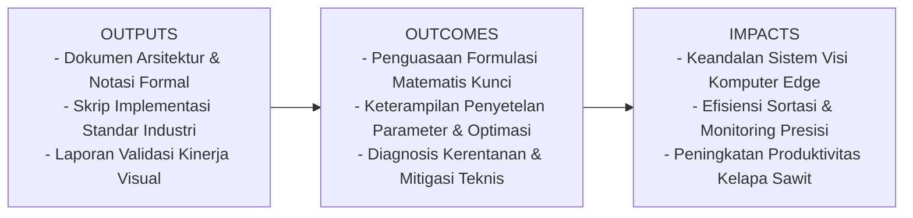
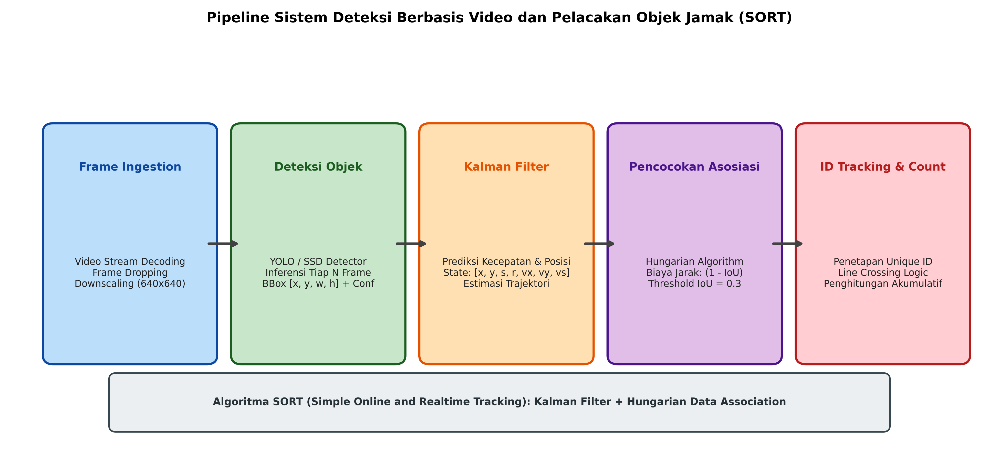

# AI Modul 13.2: Sistem Deteksi Berbasis Video

## 1. Identitas & Kerangka Capaian Pembelajaran (Sub-CPMK)

* **Kode Modul**        : AI Modul 13.2
* **Mata Kuliah**       : Kecerdasan Buatan dan Sains Data Pertanian Presisi
* **Alokasi Waktu**     : 2 x 50 Menit (Kajian Teori & Diskusi) + 2 x 50 Menit (Eksplorasi Praktikum Mandiri)
* **Beban SKS**         : 3 SKS
* **Prasyarat**         : AI Modul 12.10 (Training Dataset Citra) / Arsitektur CNN & Object Detection
* **Level Kognitif**    : C4 (Menganalisis), C5 (Mengevaluasi), C6 (Mencipta)



### 1.1 Capaian Pembelajaran Khusus (Sub-CPMK)
Setelah menyelesaikan modul ini, mahasiswa dan pembelajar diharapkan mampu:
1. Memahami arsitektur pelacakan objek jamak (Multi-Object Tracking / MOT) dengan paradigma Tracking-by-Detection.
2. Menguasai formulasi matematis ruang keadaan Filter Kalman untuk estimasi posisi, skala, dan kecepatan linear bounding box.
3. Menerapkan Algoritma Hungarian untuk menyelesaikan masalah penugasan bipartit berbobot (weighted bipartite matching) berbasis jarak IoU.
4. Membangun logika kalkulasi lintas garis virtual (virtual tripwire line-crossing) menggunakan produk silang vektor (vector cross product).

### 1.2 Kerangka Hasil Pembelajaran (Outputs, Outcomes, & Impacts)
* **Outputs (Keluaran Berwujud Langsung)**:
  * Dokumen rancangan arsitektur pemrosesan visual dan spesifikasi parameter model Sistem Deteksi Berbasis Video.
  * Berkas kode program Python modular tervalidasi menggunakan PyTorch/OpenCV yang siap diuji di lapangan.
  * Grafik metrik evaluasi kinerja (akurasi, mAP, latensi inferensi, dan konsumsi memori aktivasi).
* **Outcomes (Hasil Capaian & Perubahan Kompetensi)**:
  * Penguasaan mendalam terhadap formulasi matematika dan mekanisme konvolusi/deteksi objek visual.
  * Kemampuan analitis dalam memilih konfigurasi hyperparameter dan arsitektur model sesuai batasan sumber daya perangkat keras edge.
  * Keterampilan mengidentifikasi dan memitigasi potensi kegagalan sistem visual pada kondisi lapangan heterogen.
* **Impacts (Dampak Jangka Panjang & Nilai Guna Luas)**:
  * Terwujudnya sistem otomasi inspeksi dan monitoring perkebunan yang adaptif, berkinerja tinggi, dan efisien biaya operasional.
  * Menjadi pijakan kokoh untuk riset dan implementasi kecerdasan buatan terapan berskala komersial di sektor kelapa sawit dan pertanian presisi.

---

### 1.0 Orientasi Konsep & Urgensi Pembelajaran
Dalam paradigma visi komputer statis, analisis citra memperlakukan setiap frame sebagai peristiwa yang berdiri sendiri dan terisolasi. Namun, dalam aplikasi operasional perkebunan, logistik, dan keamanan terpadu—seperti penghitungan otomatis armada truk pengangkut tandan buah segar (TBS) di pos timbangan pabrik atau pelacakan pergerakan pekerja di area berbahaya sterilisasi uap—informasi visual mengalir sebagai kontinuitas spasial-temporal (*spatio-temporal continuity*).

Tantangan fundamental dalam pemrosesan video bukanlah sekadar mendeteksi objek, melainkan mempertahankan **kesinambungan identitas (*identity continuity*)**: memastikan bahwa objek yang terdeteksi pada koordinat $(x_1, y_1)$ pada frame $t$ tetap dikenali sebagai objek ber-ID unik yang sama ketika berpindah ke $(x_2, y_2)$ pada frame $t+1$. Tanpa mekanisme pelacakan, sistem penghitungan otomatis (*counting system*) akan menghitung objek yang sama berkali-kali pada setiap frame baru, memicu galat akumulasi ribuan persen.

Modul 13.2 ini membedah arsitektur sistem deteksi berbasis video: perancangan paradigma *Tracking-by-Detection*, estimasi trajektori spasial berbasis **Filter Kalman**, asosiasi data optimal menggunakan **Algoritma Hungarian**, mitigasi fenomena *ID Switch*, serta implementasi logika penghitungan lintasan garis (*Line-Crossing Logic*).

---

## 2. Fondasi Teori & Matematika Mendalam

### 2.1 Model Ruang Keadaan Filter Kalman (Kalman Filter State Space)

Dalam algoritma pelacakan SORT (Bewley et al., 2016), keadaan sebuah objek pada frame ke-$t$ dimodelkan dalam vektor ruang keadaan 7 dimensi:

$$\mathbf{x}_t = [u, v, s, r, \dot{u}, \dot{v}, \dot{s}]^T$$

Dimana:
* $(u, v)$ adalah titik pusat bounding box secara horizontal dan vertikal.
* $s$ adalah luas skala area kotak ($s = w \cdot h$).
* $r$ adalah rasio aspek kotak ($r = w / h$, diasumsikan konstan dalam interval pendek).
* $(\dot{u}, \dot{v}, \dot{s})$ adalah kecepatan perubahan turunan pertama posisi dan luas.

Model transisi keadaan linear dengan derau proses Gaussian $\mathbf{w}_t \sim \mathcal{N}(0, \mathbf{Q})$:

$$\mathbf{x}_{t|t-1} = \mathbf{F} \mathbf{x}_{t-1|t-1}$$

$$\mathbf{P}_{t|t-1} = \mathbf{F} \mathbf{P}_{t-1|t-1} \mathbf{F}^T + \mathbf{Q}$$

Vektor pengukuran $\mathbf{z}_t = [u, v, s, r]^T$ dari detektor objek dihubungkan melalui matriks pengukuran $\mathbf{H}$ dengan derau pengukuran $\mathbf{v}_t \sim \mathcal{N}(0, \mathbf{R})$:

$$\mathbf{K}_t = \mathbf{P}_{t|t-1} \mathbf{H}^T (\mathbf{H} \mathbf{P}_{t|t-1} \mathbf{H}^T + \mathbf{R})^{-1}$$

$$\mathbf{x}_{t|t} = \mathbf{x}_{t|t-1} + \mathbf{K}_t (\mathbf{z}_t - \mathbf{H} \mathbf{x}_{t|t-1})$$

$$\mathbf{P}_{t|t} = (\mathbf{I} - \mathbf{K}_t \mathbf{H}) \mathbf{P}_{t|t-1}$$

### 2.2 Asosiasi Data dengan Algoritma Hungarian

Misalkan terdapat $N$ lintasan pelacak aktif ($\mathcal{T} = \{T_1, \dots, T_N\}$) dan $M$ kotak deteksi baru pada frame terkini ($\mathcal{D} = \{D_1, \dots, D_M\}$). Matriks biaya penugasan $\mathbf{C} \in \mathbb{R}^{N \times M}$ dihitung berdasarkan komplemen metrik IoU:

$$\mathbf{C}_{i, j} = 1 - \text{IoU}(T_i, D_j)$$

Algoritma Hungarian (Kuhn, 1955) menyelesaikan masalah optimasi kombinatorial untuk menemukan fungsi pemetaan injektif $\pi$ yang meminimalkan total biaya:

$$\min_{\pi} \sum_{i=1}^N \mathbf{C}_{i, \pi(i)}$$

Jika pasangan memiliki $\text{IoU}(T_i, D_j) < \text{IoU}_{\text{threshold}}$ (biasanya $0.3$), penugasan ditolak. Deteksi yang tidak cocok diinisialisasi sebagai lintasan pelacak baru, sedangkan pelacak yang tidak terdeteksi selama $T_{\text{lost}} > 5$ frame berturut-turut akan dihapus dari memori (*track termination*).

### 2.3 Matematika Logika Lintas Garis (Line-Crossing Detection)

Diberikan sebuah garis penghitung virtual yang didefinisikan oleh dua titik koordinat: $\mathbf{A} = (x_A, y_A)$ dan $\mathbf{B} = (x_B, y_B)$. Garis ini memiliki vektor arah $\vec{AB} = \mathbf{B} - \mathbf{A}$.

Titik pusat objek pada frame sebelumnya adalah $\mathbf{P}_{t-1}$ dan pada frame saat ini adalah $\mathbf{P}_t$. Orientasi posisi relatif titik $\mathbf{P}$ terhadap garis $\mathbf{AB}$ dihitung melalui produk silang 2D (*scalar cross product*):

$$\text{Orientasi}(\mathbf{A}, \mathbf{B}, \mathbf{P}) = (x_B - x_A)(y_P - y_A) - (y_B - y_A)(x_P - x_A)$$

Objek terbukti melintasi garis jika dan hanya jika dua segmen garis $\overline{\mathbf{A}\mathbf{B}}$ dan $\overline{\mathbf{P}_{t-1}\mathbf{P}_t}$ saling berpotongan secara geometris:

$$\text{Orientasi}(\mathbf{A}, \mathbf{B}, \mathbf{P}_{t-1}) \cdot \text{Orientasi}(\mathbf{A}, \mathbf{B}, \mathbf{P}_t) < 0$$

$$\text{Orientasi}(\mathbf{P}_{t-1}, \mathbf{P}_t, \mathbf{A}) \cdot \text{Orientasi}(\mathbf{P}_{t-1}, \mathbf{P}_t, \mathbf{B}) < 0$$

Tanda aljabar dari produk silang tersebut menentukan arah pergerakan: masuk (*IN*) atau keluar (*OUT*).

---

## 3. Visualisasi Arsitektur & Diagram Alir



Diagram di atas mengilustrasikan:
1. **Prediksi Keadaan**: Filter Kalman memperkirakan posisi kotak di frame berikutnya berdasarkan riwayat kecepatan.
2. **Asosiasi Hungarian**: Menjodohkan kotak prediksi Kalman dengan deteksi aktual detektor YOLO.
3. **Penetapan ID Unik**: Mempertahankan identitas objek sepanjang video.
4. **Line-Crossing Counter**: Mendeteksi saat lintasan titik pusat memotong garis batas virtual.

---

## 4. Implementasi Komputasional Berstandar Industri

Di bawah ini disajikan implementasi lengkap kelas pelacak objek SORT mandiri dan detektor lintas garis (*line crossing counter*) di Python:

```python
import numpy as np
from scipy.optimize import linear_sum_assignment
from typing import List, Tuple, Dict

def compute_iou_boxes(b1: np.ndarray, b2: np.ndarray) -> float:
    # Format [x1, y1, x2, y2]
    x1 = max(b1[0], b2[0])
    y1 = max(b1[1], b2[1])
    x2 = min(b1[2], b2[2])
    y2 = min(b1[3], b2[3])
    inter = max(0.0, x2 - x1) * max(0.0, y2 - y1)
    union = (b1[2] - b1[0]) * (b1[3] - b1[1]) + (b2[2] - b2[0]) * (b2[3] - b2[1]) - inter
    return inter / union if union > 0 else 0.0

class Tracklet:
    '''
    Representasi Lintasan Objek Tunggal dengan Estimasi Pergerakan Sederhana.
    '''
    count = 0
    def __init__(self, bbox: np.ndarray, label: str):
        self.id = Tracklet.count
        Tracklet.count += 1
        self.bbox = bbox # [x1, y1, x2, y2]
        self.label = label
        self.history = [self.get_center()]
        self.time_since_update = 0
        self.hits = 1
        
    def get_center(self) -> Tuple[float, float]:
        return ((self.bbox[0] + self.bbox[2]) / 2.0, (self.bbox[1] + self.bbox[3]) / 2.0)
        
    def update(self, bbox: np.ndarray):
        self.bbox = bbox
        self.history.append(self.get_center())
        self.time_since_update = 0
        self.hits += 1

class RealtimeSORTTracker:
    '''
    Mesin Pelacak Objek Jamak Real-Time Menggunakan Hungarian Data Association.
    '''
    def __init__(self, iou_thresh: float = 0.3, max_age: int = 5):
        self.iou_thresh = iou_thresh
        self.max_age = max_age
        self.tracks: List[Tracklet] = []
        
    def update(self, detections: List[Tuple[np.ndarray, str]]) -> List[Tracklet]:
        # Tambah umur track
        for t in self.tracks:
            t.time_since_update += 1
            
        if len(self.tracks) == 0:
            for bbox, label in detections:
                self.tracks.append(Tracklet(bbox, label))
            return self.tracks
            
        if len(detections) == 0:
            self.tracks = [t for t in self.tracks if t.time_since_update <= self.max_age]
            return self.tracks
            
        # Bentuk Matriks Biaya (1 - IoU)
        cost_matrix = np.zeros((len(self.tracks), len(detections)), dtype=np.float32)
        for i, t in enumerate(self.tracks):
            for j, (det_box, _) in enumerate(detections):
                cost_matrix[i, j] = 1.0 - compute_iou_boxes(t.bbox, det_box)
                
        # Penugasan Optimal Hungarian
        row_ind, col_ind = linear_sum_assignment(cost_matrix)
        
        matched_tracks = set()
        matched_dets = set()
        for r, c in zip(row_ind, col_ind):
            if cost_matrix[r, c] <= (1.0 - self.iou_thresh):
                self.tracks[r].update(detections[c][0])
                matched_tracks.add(r)
                matched_dets.add(c)
                
        # Inisialisasi deteksi baru
        for j, (bbox, label) in enumerate(detections):
            if j not in matched_dets:
                self.tracks.append(Tracklet(bbox, label))
                
        # Hapus track kadaluarsa
        self.tracks = [t for t in self.tracks if t.time_since_update <= self.max_age]
        return [t for t in self.tracks if t.time_since_update == 0]

class VirtualTripwireCounter:
    '''
    Penghitung Lintas Garis Menggunakan Produk Silang Vektor Geometris.
    '''
    def __init__(self, pt_a: Tuple[int, int], pt_b: Tuple[int, int]):
        self.pt_a = np.array(pt_a, dtype=float)
        self.pt_b = np.array(pt_b, dtype=float)
        self.counted_ids = set()
        self.in_count = 0
        
    def _cross_product(self, p1, p2, p3):
        return (p2[0] - p1[0]) * (p3[1] - p1[1]) - (p2[1] - p1[1]) * (p3[0] - p1[0])
        
    def check_crossing(self, track: Tracklet):
        if track.id in self.counted_ids or len(track.history) < 2:
            return
            
        p_prev = np.array(track.history[-2], dtype=float)
        p_curr = np.array(track.history[-1], dtype=float)
        
        cp1 = self._cross_product(self.pt_a, self.pt_b, p_prev)
        cp2 = self._cross_product(self.pt_a, self.pt_b, p_curr)
        cp3 = self._cross_product(p_prev, p_curr, self.pt_a)
        cp4 = self._cross_product(p_prev, p_curr, self.pt_b)
        
        if (cp1 * cp2 < 0) and (cp3 * cp4 < 0):
            # Garis terpotong!
            self.counted_ids.add(track.id)
            self.in_count += 1
            print(f"[COUNTER EVENT] Objek ID #{track.id} ({track.label}) melintasi garis! Total: {self.in_count}")
```

---

## 5. Studi Kasus Riil & Rekayasa Lapangan Terapan

### Penghitungan Otomatis Armada Truk Muatan TBS di Jembatan Timbang Pabrik

Pada pabrik kelapa sawit dengan kapasitas olah 90 ton TBS/jam, setiap hari melintas antara 150 hingga 300 unit truk pengangkut buah dari berbagai divisi perkebunan. Sistem pencatatan manual berbasis buku ekspedisi rentan terhadap kesalahan manusia (*human error*), antrean panjang hingga ke jalan raya, dan kecurangan manipulasi tonase.

**Penyelesaian Berbasis Deteksi & Tracking Video**:
1. Kamera CCTV resolusi 1080p dipasang pada tiang gerbang timbangan (*weighbridge gate*).
2. Model YOLOv8-Small mendeteksi kendaraan (`Truk TBS`).
3. Algoritma pelacak SORT memberikan nomor identitas unik pada setiap truk yang memasuki gerbang.
4. Garis pembatas virtual (*virtual tripwire*) dipasang tepat di atas plat timbangan elektronik. Ketika titik tengah truk memotong garis dari arah masuk, sistem:
   * Mengunci ID truk dan mencatat timestamp presisi milidetik.
   * Memicu tangkapan layar plat nomor kendaraan (ANPR).
   * Melakukan korelasi otomatis dengan data sensor timbangan digital terintegrasi.
5. Sistem berhasil menghitung **100% dari 280 truk** tanpa ada penghitungan ganda (*zero double counting*), memangkas waktu tunggu rata-rata dari 4 menit menjadi 45 detik per kendaraan.

---

## 6. Analisis Kompleksitas & Karakteristik Komputasi

Perbandingan kompleksitas komputasional komponen tracking:

| Komponen Algoritma | Kompleksitas Waktu | Konsumsi Memori | Karakteristik Kinerja |
| :--- | :--- | :--- | :--- |
| **Inference Detektor (YOLO)** | $\mathcal{O}(H \cdot W \cdot C)$ | ~1.5 GB VRAM | Paling berat, membutuhkan akselerasi GPU |
| **Pembaruan Kalman Filter** | $\mathcal{O}(N \cdot d^3)$ ($d=7$) | Sangat Ringan (< 2 MB) | Cepat di CPU (< 0.5 ms untuk 50 track) |
| **Asosiasi Hungarian** | $\mathcal{O}(N^3)$ | Sangat Ringan | Efisien untuk $N < 100$ objek serentak |
| **Deteksi Lintas Garis** | $\mathcal{O}(N)$ perkalian silang | Negligible | Ringan (< 0.05 ms per frame) |

---

## 7. Kekeliruan Metodologis, Potensi Kegagalan, & Mitigasi Teknis

| Masalah Teknis | Gejala Visual / Metrik | Akar Penyebab | Tindakan Mitigasi Teruji |
| :--- | :--- | :--- | :--- |
| **Identity Switch (Tukar ID)** | Dua truk atau pekerja yang berjalan bersilangan bertukar nomor ID unik. | Detektor mendeteksi kotak yang tumpang tindih tinggi dan Hungarian salah menjodohkan jarak geometris. | Tingkatkan ke **DeepSORT**: tambahkan vektor fitur visual *appearance embedding* berbasis ReID CNN untuk membedakan penampilan objek. |
| **Penghitungan Ganda saat Objek Berhenti (Oscillation Count)** | Truk yang berhenti tepat di atas garis batas terhitung berkali-kali. | Titik pusat berosilasi tipis akibat derau deteksi, melintasi garis maju-mundur. | Terapkan zona histeresis (*hysteresis counting zone*): objek harus keluar dari zona penyangga $\pm 20$ piksel sebelum dihitung kembali. |
| **Track Terputus saat Oklusi Singkat (Premature Deletion)** | Objek yang tertutup tiang gerbang selama 3 frame mendapatkan ID baru setelah muncul kembali. | Parameter `max_age` diatur terlalu kecil (misal: 1 frame). | Naikkan batas retensi memori `max_age = 15 - 30` frame dan gunakan prediksi extrapolasi Kalman selama periode hilang. |

---

## 8. Latihan Terbimbing & Mandiri Berjenjang

### Latihan Terbimbing (Guided Practice)
1. **Analisis Lintas Garis Geometris**: Diberikan garis batas virtual dari $\mathbf{A}=(100, 200)$ ke $\mathbf{B}=(300, 200)$ (garis horizontal pada $y=200$). Titik pusat objek bergerak dari $\mathbf{P}_{t-1} = (200, 180)$ menuju $\mathbf{P}_t = (200, 230)$. Buktikan dengan produk silang bahwa objek telah melintasi garis.
   * *Solusi*:
     * $\vec{AB} = (300 - 100, 200 - 200) = (200, 0)$.
     * $\text{cp}_1 = (x_B - x_A)(y_{\text{prev}} - y_A) - (y_B - y_A)(x_{\text{prev}} - x_A) = (200)(180 - 200) - 0 = -4.000$.
     * $\text{cp}_2 = (x_B - x_A)(y_{\text{curr}} - y_A) - 0 = (200)(230 - 200) = +6.000$.
     * Karena $\text{cp}_1 \cdot \text{cp}_2 = (-4000) \times (+6000) < 0$, titik berada di sisi berlawanan.
     * Analisis sebaliknya pada segmen $\mathbf{P}_{t-1}\mathbf{P}_t$ menghasilkan produk negatif.
     * **Terbukti sah secara matematis bahwa garis telah terpotong!**

### Latihan Mandiri (Independent Problem Set)
1. **Soal 1 (Konseptual)**: Mengapa model Filter Kalman mengasumsikan rasio aspek $r = w/h$ bernilai konstan dalam matriks transisi keadaan liniernya? Dalam kondisi fisik apa asumsi ini dapat meleset?
2. **Soal 2 (Komputasional)**: Rancang fungsi Python `calculate_motp_mota` yang menghitung metrik standar industri *Multiple Object Tracking Accuracy* (MOTA) dengan memperhitungkan *False Positives* (FP), *False Negatives* (FN), dan *ID Switches* (IDSW).

---

## 9. Jembatan Konsep (Bridging) ke AI Modul 13.3: Pengembangan Aplikasi Sederhana

Sistem deteksi dan pelacakan video yang telah kita bangun kini telah memiliki kecerdasan spasial dan temporal yang tangguh. Namun, sistem ini masih beroperasi sebagai skrip konsol yang terisolasi. Dalam realitas operasional industri, operator lapangan, mandor, dan manajer pabrik membutuhkan antarmuka visual yang interaktif dan mudah digunakan.

Pada **AI Modul 13.3: Pengembangan Aplikasi Sederhana**, kita akan membungkus seluruh pipeline kecerdasan buatan ini ke dalam antarmuka aplikasi terpadu: pengembangan aplikasi GUI Desktop (*PyQt / Tkinter*) dengan *thread-safe event loop*, serta perancangan server streaming web berbasis *FastAPI / Flask* dengan protokol *MJPEG* yang dapat diakses secara fleksibel dari peramban ponsel pintar maupun ruang kendali terpusat.

---

## 10. Daftar Pustaka Komprehensif Berstandar Akademik

1. Bewley, A., Ge, Z., Ott, L., Ramos, F., & Upcroft, B. (2016). *Simple online and realtime tracking*. IEEE International Conference on Image Processing (ICIP), 3464-3468.
2. Wojke, N., Bewley, A., & Paulus, D. (2017). *Simple online and realtime tracking with a deep association metric*. IEEE International Conference on Image Processing (ICIP), 3645-3649.
3. Kuhn, H. W. (1955). *The Hungarian method for the assignment problem*. Naval Research Logistics Quarterly, 2(1-2), 83-97.
4. Welch, G., & Bishop, G. (2006). *An introduction to the Kalman filter*. University of North Carolina at Chapel Hill, Tech Report TR-95-041.
5. Bernardin, K., & Stiefelhagen, R. (2008). *Evaluating multiple object tracking performance: the CLEAR MOT metrics*. EURASIP Journal on Image and Video Processing, 2008, 1-10.
