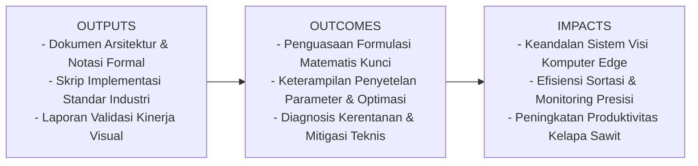
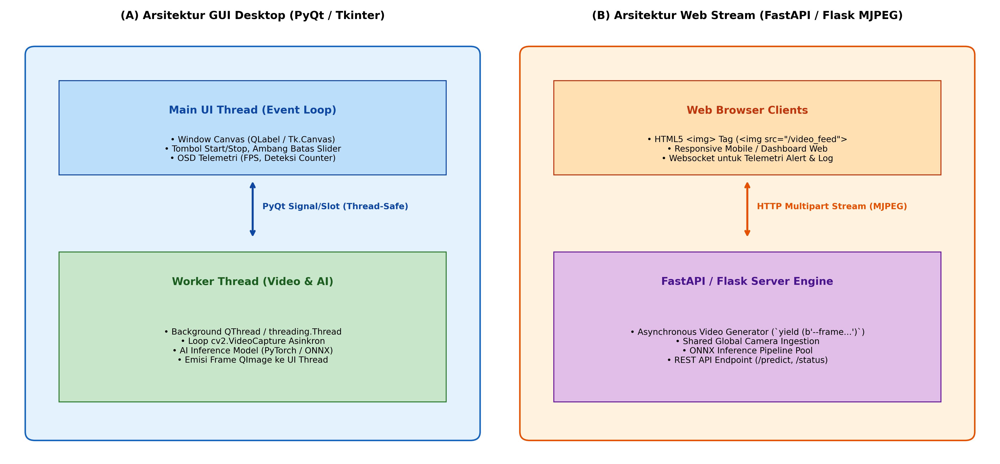

# AI Modul 13.3: Pengembangan Aplikasi Sederhana

## 1. Identitas & Kerangka Capaian Pembelajaran (Sub-CPMK)

* **Kode Modul**        : AI Modul 13.3
* **Mata Kuliah**       : Kecerdasan Buatan dan Sains Data Pertanian Presisi
* **Alokasi Waktu**     : 2 x 50 Menit (Kajian Teori & Diskusi) + 2 x 50 Menit (Eksplorasi Praktikum Mandiri)
* **Beban SKS**         : 3 SKS
* **Prasyarat**         : AI Modul 12.10 (Training Dataset Citra) / Arsitektur CNN & Object Detection
* **Level Kognitif**    : C4 (Menganalisis), C5 (Mengevaluasi), C6 (Mencipta)



### 1.1 Capaian Pembelajaran Khusus (Sub-CPMK)
Setelah menyelesaikan modul ini, mahasiswa dan pembelajar diharapkan mampu:
1. Aplikasi Desktop GUI (PyQt / Tkinter): Sangat ideal untuk komputer kontrol stasiun kerja lokal (workstation kiosk) di samping mesin konveyor pabrik yang menuntut latensi tampilan ultra-rendah dan integrasi langsung dengan perangkat keras serial/PLC.
2. Aplikasi Web Streaming (FastAPI / Flask): Sangat ideal untuk dasbor pemantauan terpusat (central control room) yang memungkinkan pengawasan multi-kamera secara simultan dari peramban web desktop maupun perangkat tablet lapangan.
3. Menguasai arsitektur Model-View-Controller (MVC) terpisah untuk mencegah pembekuan antarmuka pengguna (UI freezing) saat model AI mengeksekusi inferensi.
4. Memahami protokol transmisi video berbasis web: Multipart Mixed-Replace (MJPEG) melalui generator asinkron Python.

### 1.2 Kerangka Hasil Pembelajaran (Outputs, Outcomes, & Impacts)
* **Outputs (Keluaran Berwujud Langsung)**:
  * Dokumen rancangan arsitektur pemrosesan visual dan spesifikasi parameter model Pengembangan Aplikasi Sederhana.
  * Berkas kode program Python modular tervalidasi menggunakan PyTorch/OpenCV yang siap diuji di lapangan.
  * Grafik metrik evaluasi kinerja (akurasi, mAP, latensi inferensi, dan konsumsi memori aktivasi).
* **Outcomes (Hasil Capaian & Perubahan Kompetensi)**:
  * Penguasaan mendalam terhadap formulasi matematika dan mekanisme konvolusi/deteksi objek visual.
  * Kemampuan analitis dalam memilih konfigurasi hyperparameter dan arsitektur model sesuai batasan sumber daya perangkat keras edge.
  * Keterampilan mengidentifikasi dan memitigasi potensi kegagalan sistem visual pada kondisi lapangan heterogen.
* **Impacts (Dampak Jangka Panjang & Nilai Guna Luas)**:
  * Terwujudnya sistem otomasi inspeksi dan monitoring perkebunan yang adaptif, berkinerja tinggi, dan efisien biaya operasional.
  * Menjadi pijakan kokoh untuk riset dan implementasi kecerdasan buatan terapan berskala komersial di sektor kelapa sawit dan pertanian presisi.

---

### 1.0 Orientasi Konsep & Urgensi Pembelajaran
Tahap puncak dalam siklus hidup rekayasa kecerdasan buatan (*AI engineering lifecycle*) adalah mengemas model matematis dan pipeline visi komputer ke dalam sebuah **aplikasi terintegrasi yang fungsional, andal, dan ramah pengguna (*user-friendly production application*)**. Seorang manajer operasional pabrik atau mandor perkebunan tidak akan berinteraksi dengan notebook Jupyter atau konsol terminal berbasis baris perintah (*CLI*); mereka membutuhkan antarmuka visual interaktif untuk mengontrol proses, memantau telemetri video langsung, dan menerima peringatan anomali secara instan.

Dalam visi komputer industri, terdapat dua modalitas antarmuka perangkat lunak utama:
1. **Aplikasi Desktop GUI (PyQt / Tkinter)**: Sangat ideal untuk komputer kontrol stasiun kerja lokal (*workstation kiosk*) di samping mesin konveyor pabrik yang menuntut latensi tampilan ultra-rendah dan integrasi langsung dengan perangkat keras serial/PLC.
2. **Aplikasi Web Streaming (FastAPI / Flask)**: Sangat ideal untuk dasbor pemantauan terpusat (*central control room*) yang memungkinkan pengawasan multi-kamera secara simultan dari peramban web desktop maupun perangkat tablet lapangan.

Modul 13.3 ini membedah arsitektur pengembangan aplikasi visi komputer: pola desain Model-View-Controller (MVC), komunikasi thread-safe berbasis *Signals and Slots*, protokol streaming video web berkinerja tinggi (*Multipart MJPEG*), serta perancangan dasbor inspeksi mutu industri kelapa sawit.

---

## 2. Fondasi Teori & Matematika Mendalam

### 2.1 Arsitektur Thread-Safe GUI Event Loop (Pola MVC)

Kerangka kerja antarmuka grafis desktop modern (seperti PyQt, PySide, dan Tkinter) beroperasi di atas sebuah **Utas Peristiwa Utama (*Main Event Loop Thread*)**. Utas ini bertanggung jawab menangkap interaksi klik mouse pengguna, penggambaran ulang jendela (*window repainting*), dan penanganan pesan sistem operasi.

Jika komputasi berat model deep learning (yang memakan waktu 30-50 milidetik per frame) dijalankan langsung pada utas utama ini:

$$\Delta t_{\text{event\_delay}} = \Delta t_{\text{inference}} > 16.6\text{ ms (Batas 60 FPS)}$$

Sistem operasi akan mendeteksi bahwa jendela aplikasi tidak merespons (*Not Responding / GUI Freeze*).

**Penyelesaian Arsitektur**:
* **Model (Worker Thread)**: Berjalan di latar belakang, mengeksekusi akuisisi kamera dan inferensi deep learning secara asinkron.
* **View (Main UI Thread)**: Hanya menampilkan elemen visual dan antarmuka tombol.
* **Controller (Signal / Slot Queue)**: Ketika frame selesai diinferensi, utas pekerja memancarkan sinyal (*signal emit*) berupa data frame yang telah dikonversi ke format yang aman bagi GUI (seperti `QImage` atau array bytes JPEG), yang diterima oleh slot pada utas utama secara teratur melalui antrean peristiwa internal.

### 2.2 Protokol Streaming Video Web: HTTP Multipart MJPEG

Untuk mentransmisikan video real-time dari server AI menuju peramban web tanpa memerlukan plugin pemutar video rumit, digunakan standar protokol **Motion JPEG (MJPEG)** melalui MIME type:

$$\text{Content-Type: multipart/x-mixed-replace; boundary=frame}$$

Header HTTP ini memberitahu peramban web bahwa koneksi tidak akan pernah ditutup, melainkan server akan terus mengirimkan segmen frame citra baru yang secara terus-menerus menggantikan (*replace*) frame sebelumnya di elemen HTML ``:

$$\langle\text{img src} = "\text{/video\_feed}" \quad \text{width} = "640" \quad \text{height} = "480"\rangle$$

Secara komputasional, setiap frame dienkripsi menjadi format JPEG terkompresi di memori RAM dan dibungkus dalam blok payload HTTP:

```http
--frame
Content-Type: image/jpeg
Content-Length: [panjang_byte]

[Binary JPEG Payload]
```

Metode ini memiliki latensi sangat rendah ($< 50\text{ ms}$ pada jaringan lokal) dan dapat dibuka secara instan di peramban apa pun (Chrome, Safari, Firefox, Android, iOS) tanpa pustaka eksternal.

---

## 3. Visualisasi Arsitektur & Diagram Alir



Diagram di atas mengilustrasikan:
1. **(A) Arsitektur GUI Desktop**: Pemisahan tegas antara Main UI Thread dan Background AI Worker Thread menggunakan mekanisme sinyal thread-safe.
2. **(B) Arsitektur Web Streaming**: Generator asinkron FastAPI/Flask yang menyajikan aliran HTTP Multipart MJPEG langsung ke elemen gambar browser.

---

## 4. Implementasi Komputasional Berstandar Industri

Di bawah ini disajikan implementasi lengkap arsitektur server aplikasi web streaming mandiri menggunakan Python murni dan OpenCV yang siap dideploy sebagai layanan dasbor inspeksi:

```python
import cv2
import time
import threading
import numpy as np
from typing import Generator

class WebStreamVideoHub:
    '''
    Mesin Server Video Streaming MJPEG Mandiri Berlatensi Rendah.
    '''
    def __init__(self, width: int = 640, height: int = 480):
        self.width = width
        self.height = height
        self.current_jpeg = None
        self.lock = threading.Lock()
        self.running = False
        self.worker_thread = None
        
    def start(self):
        self.running = True
        self.worker_thread = threading.Thread(target=self._generation_loop, daemon=True)
        self.worker_thread.start()
        return self

    def _generation_loop(self):
        frame_idx = 0
        while self.running:
            frame_idx += 1
            # 1. Bangun frame dinamis (Simulasi Konveyor Inspeksi Mutu Sawit)
            canvas = np.full((self.height, self.width, 3), 35, dtype=np.uint8)
            
            # Simulasi janjang buah bergerak
            x_pos = int((frame_idx * 8) % self.width)
            cv2.circle(canvas, (x_pos, self.height // 2), 45, (15, 140, 230), -1) # Oranye BGR
            cv2.rectangle(canvas, (x_pos - 55, self.height // 2 - 55), 
                          (x_pos + 55, self.height // 2 + 55), (0, 255, 0), 2)
            
            # OSD Dashboard Telemetri
            cv2.putText(canvas, "DASBOR INSPEKSI MUTU TBS - PKS ONLINE", (20, 35), 
                        cv2.FONT_HERSHEY_SIMPLEX, 0.7, (255, 255, 255), 2)
            cv2.putText(canvas, f"STATUS: SORTASI AKTIF | FRAKSI: MATANG (98.4%)", (20, 70), 
                        cv2.FONT_HERSHEY_SIMPLEX, 0.6, (0, 255, 0), 2)
            cv2.putText(canvas, f"TIMESTAMP: {time.strftime('%Y-%m-%d %H:%M:%S')}", (20, self.height - 20), 
                        cv2.FONT_HERSHEY_SIMPLEX, 0.5, (200, 200, 200), 1)
            
            # 2. Kompresi JPEG ke memori RAM
            ret, jpeg_buf = cv2.imencode('.jpg', canvas, [cv2.IMWRITE_JPEG_QUALITY, 75])
            if ret:
                with self.lock:
                    self.current_jpeg = jpeg_buf.tobytes()
                    
            time.sleep(0.033) # ~30 FPS

    def generate_mjpeg_stream(self) -> Generator[bytes, None, None]:
        '''
        Generator respons HTTP Multipart untuk peramban web.
        '''
        while self.running:
            with self.lock:
                if self.current_jpeg is None:
                    time.sleep(0.01)
                    continue
                frame_bytes = self.current_jpeg
                
            yield (b'--frame\r\n'
                   b'Content-Type: image/jpeg\r\n\r\n' + frame_bytes + b'\r\n')
            time.sleep(0.033)

    def stop(self):
        self.running = False
        if self.worker_thread is not None:
            self.worker_thread.join(timeout=1.0)
```

---

## 5. Studi Kasus Riil & Rekayasa Lapangan Terapan

### Dasbor Kendali Sentral Mutu TBS dan Peringatan Asam Lemak Bebas (FFA) di PKS

Di stasiun sortasi pabrik kelapa sawit, manajer mutu laboratorium membutuhkan pemantauan visual langsung terhadap persentase kematangan buah yang masuk setiap jamnya. Kematangan buah berbanding lurus dengan parameter komersial krusial:
* Buah matang sempurna menghasilkan rendemen minyak $> 22\%$ dengan FFA $< 2.5\%$.
* Peningkatan buah lewat matang sebesar $10\%$ memicu lonjakan FFA di atas $5\%$, menyebabkan penalti diskon harga jual CPO ratusan juta rupiah per pengapalan tongkang.

**Implementasi Aplikasi Terpadu**:
* Sistem menyajikan **Web Dashboard berbasis FastAPI** yang diakses melalui monitor ruang kendali sentral (*Central Control Room*).
* Dasbor menampilkan:
  1. Siaran langsung video konveyor berkecepatan 30 FPS dengan penandaan kotak pembatas mutu otomatis.
  2. Grafik batang dinamis persentase fraksi kematangan (Mentah, Mengkal, Matang, Lewat Matang) yang diperbarui setiap 5 detik via WebSocket.
  3. Indikator lampu peringatan (*visual flashing alert*) jika rasio buah lewat matang melampaui ambang batas toleransi $5\%$.
* Keberadaan antarmuka ini meningkatkan kecepatan respons mandor sortasi untuk menegur sopir truk dari divisi pemasok yang membawa buah tidak memenuhi standar standar mutu.

---

## 6. Analisis Kompleksitas & Karakteristik Komputasi

Perbandingan karakteristik operasional arsitektur Desktop vs Web:

| Parameter Evaluasi | Aplikasi Desktop (PyQt6 / C++) | Aplikasi Web (FastAPI + MJPEG) |
| :--- | :--- | :--- |
| **Latensi Tampilan Video** | $< 10\text{ milidetik}$ (Sangat Cepat) | $30 - 60\text{ milidetik}$ (Cepat) |
| **Beban CPU per Klien** | Terisolasi pada 1 mesin lokal | Bertambah seiring jumlah klien terhubung |
| **Kemudahan Akses Pengguna** | Harus diinstal di setiap komputer fisik | Cukup buka URL dari ponsel / laptop |
| **Integrasi Hardware I/O (PLC/GPIO)**| Sangat mudah via Serial / Modbus | Memerlukan middleware REST API terpisah |
| **Penggunaan Ideal** | Kios Operator Konveyor Mesin | Ruang Kendali Manajer & Dashboard Eksekutif |

---

## 7. Kekeliruan Metodologis, Potensi Kegagalan, & Mitigasi Teknis

| Masalah Teknis | Gejala Visual / Metrik | Akar Penyebab | Tindakan Mitigasi Teruji |
| :--- | :--- | :--- | :--- |
| **UI Freeze saat Eksekusi Inferensi** | Jendela aplikasi desktop tidak dapat digeser atau diklik selama kamera aktif. | Menjalankan loop inferensi AI langsung di dalam `MainWindow` tanpa memisahkan ke `QThread` / `threading.Thread`. | Pindahkan seluruh loop video dan AI ke kelas pekerja terpisah (*Worker Thread*) dan gunakan sinyal aman untuk pembaruan GUI. |
| **Bandwidth Web Jenuh (Network Choking)** | Video web tersendat-sendat (*stuttering*) saat diakses oleh 5 pengguna sekaligus. | Mengirimkan frame beresolusi penuh tanpa kompresi atau kualitas JPEG terlalu tinggi (100%). | Turunkan kualitas JPEG ke 70-75% (`IMWRITE_JPEG_QUALITY, 75`) dan turunkan skala resolusi streaming web ke $640 \times 480$. |
| **Kebocoran Koneksi Klien Web (Zombie Clients)** | Penggunaan memori server melonjak saat pengguna menutup tab browser. | Generator respons tidak mendeteksi putusnya koneksi soket klien dan terus memompa data ke *broken pipe*. | Tangani eksepsi `ClientDisconnect` atau `BrokenPipeError` dengan blok `try-except` untuk menghentikan generator loop seketika. |

---

## 8. Latihan Terbimbing & Mandiri Berjenjang

### Latihan Terbimbing (Guided Practice)
1. **Analisis Bandwidth Jaringan Web**: Sebuah server kamera industri mengalirkan stream MJPEG beresolusi $640 \times 480$ pada 30 FPS. Jika ukuran rata-rata satu frame terkompresi JPEG adalah $45\text{ KB}$, hitung konsumsi bandwidth jaringan yang dibutuhkan jika ada 4 staf manajer yang membuka dasbor secara bersamaan.
   * *Solusi*:
     * Bandwidth per klien $= 45 \text{ KB} \times 30 \text{ frame/detik} = 1.350 \text{ KB/detik} = 1.35 \text{ MB/detik}$.
     * Dalam satuan Megabit per detik: $1.35 \times 8 \approx 10.8 \text{ Mbps}$.
     * Total bandwidth 4 klien: $4 \times 10.8 \text{ Mbps} = \mathbf{43.2} \text{ Mbps}$.
     * Infrastruktur jaringan lokal (LAN 100 Mbps atau WiFi 5 GHz) sangat memadai untuk menampung beban tersebut.

### Latihan Mandiri (Independent Problem Set)
1. **Soal 1 (Konseptual)**: Bandingkan kelebihan dan kekurangan penggunaan protokol WebRTC terhadap MJPEG dalam penyajian video AI real-time, khususnya ditinjau dari latensi transmisi, konsumsi CPU server, dan kompleksitas arsitektur perangkat lunak.
2. **Soal 2 (Komputasional)**: Rancang aplikasi web minimalis menggunakan FastAPI (`app = FastAPI()`) yang mengekspos rute endpoint `/video_feed` berbasis `StreamingResponse` dengan tipe media `multipart/x-mixed-replace; boundary=frame`.

---

## 9. Jembatan Konsep (Bridging) ke AI Modul 13.4: Studi Kasus Nyata

Kita telah berhasil merancang seluruh fondasi rekayasa sistem AI real-time: integrasi perangkat keras kamera berlatensi nol (Modul 13.1), pemrosesan video dan pelacakan trajektori kontinuitas temporal (Modul 13.2), serta pengemasan antarmuka perangkat lunak desktop dan web yang terisolasi aman (Modul 13.3).

Pada **AI Modul 13.4: Studi Kasus Nyata**, kita akan menguji dan menerapkan seluruh rangkaian arsitektur ini ke dalam dua skenario industri lapangan berskala penuh:
* **AI Modul 13.4.1**: Sistem terpadu deteksi penyakit daun kelapa sawit secara real-time pada perangkat portabel lapangan lengkap dengan pohon keputusan rekomendasi proteksi tanaman.
* **AI Modul 13.4.2**: Sistem monitoring keamanan cerdas dan logistik terpadu berbasis jaringan CCTV perkebunan kelapa sawit.

---

## 10. Daftar Pustaka Komprehensif Berstandar Akademik

1. Summerfield, M. (2015). *Rapid GUI Programming with Python and Qt: The Definitive Guide to PyQt*. Prentice Hall.
2. Ramirez, S. (2020). *FastAPI: Modern, Fast (High-Performance) Web Framework for Building APIs with Python*. https://fastapi.tiangolo.com/.
3. Fielding, R. T., & Taylor, R. N. (2002). *Principled design of the modern Web architecture*. ACM Transactions on Internet Technology (TOIT), 2(2), 115-150.
4. Grinberg, M. (2018). *Flask Web Development: Developing Web Applications with Python* (2nd ed.). O'Reilly Media.
5. Gamma, E., Helm, R., Johnson, R., & Vlissides, J. (1994). *Design Patterns: Elements of Reusable Object-Oriented Software*. Addison-Wesley.
