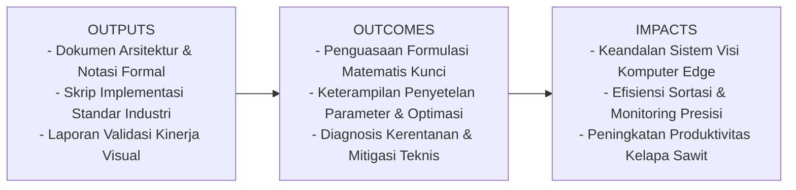
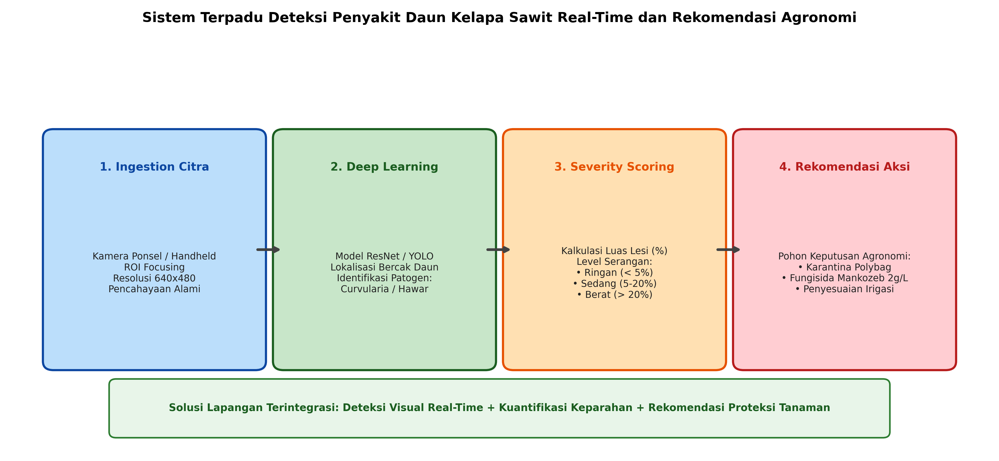

# AI Modul 13.4.1: Deteksi Penyakit Daun

## 1. Identitas & Kerangka Capaian Pembelajaran (Sub-CPMK)

* **Kode Modul**        : AI Modul 13.4.1
* **Mata Kuliah**       : Kecerdasan Buatan dan Sains Data Pertanian Presisi
* **Alokasi Waktu**     : 2 x 50 Menit (Kajian Teori & Diskusi) + 2 x 50 Menit (Eksplorasi Praktikum Mandiri)
* **Beban SKS**         : 3 SKS
* **Prasyarat**         : AI Modul 12.10 (Training Dataset Citra) / Arsitektur CNN & Object Detection
* **Level Kognitif**    : C4 (Menganalisis), C5 (Mengevaluasi), C6 (Mencipta)



### 1.1 Capaian Pembelajaran Khusus (Sub-CPMK)
Setelah menyelesaikan modul ini, mahasiswa dan pembelajar diharapkan mampu:
1. Memahami karakteristik visual dan siklus hidup patogen utama daun kelapa sawit (Curvularia maculans, Pestalotiopsis, dan Corticium salmonicolor).
2. Menurunkan formulasi matematis Disease Severity Index (DSI) dan rasio luas lesi nekrotik berbasis analisis piksel terkuantisasi.
3. Membangun pipeline terintegrasi: pra-segmentasi kanopi daun, inferensi model deep learning, dan kuantifikasi keparahan.
4. Menerapkan pohon keputusan proteksi tanaman terpadu untuk menerjemahkan hasil inferensi AI menjadi instruksi agronomi operasional.

### 1.2 Kerangka Hasil Pembelajaran (Outputs, Outcomes, & Impacts)
* **Outputs (Keluaran Berwujud Langsung)**:
  * Dokumen rancangan arsitektur pemrosesan visual dan spesifikasi parameter model Deteksi Penyakit Daun.
  * Berkas kode program Python modular tervalidasi menggunakan PyTorch/OpenCV yang siap diuji di lapangan.
  * Grafik metrik evaluasi kinerja (akurasi, mAP, latensi inferensi, dan konsumsi memori aktivasi).
* **Outcomes (Hasil Capaian & Perubahan Kompetensi)**:
  * Penguasaan mendalam terhadap formulasi matematika dan mekanisme konvolusi/deteksi objek visual.
  * Kemampuan analitis dalam memilih konfigurasi hyperparameter dan arsitektur model sesuai batasan sumber daya perangkat keras edge.
  * Keterampilan mengidentifikasi dan memitigasi potensi kegagalan sistem visual pada kondisi lapangan heterogen.
* **Impacts (Dampak Jangka Panjang & Nilai Guna Luas)**:
  * Terwujudnya sistem otomasi inspeksi dan monitoring perkebunan yang adaptif, berkinerja tinggi, dan efisien biaya operasional.
  * Menjadi pijakan kokoh untuk riset dan implementasi kecerdasan buatan terapan berskala komersial di sektor kelapa sawit dan pertanian presisi.

---

### 1.0 Orientasi Konsep & Urgensi Pembelajaran
Dalam agroindustri kelapa sawit modern, kesehatan daun bibit di pembibitan (*nursery*) dan tanaman menghasilkan di lapangan merupakan indikator biologis paling sensitif terhadap produktivitas tandan buah segar (TBS). Penyakit bercak daun yang dipicu oleh jamur patogen seperti *Curvularia maculans* dan hawar daun *Pestalotiopsis microspora* dapat menurunkan laju fotosintesis kanopi secara drastis hingga lebih dari $35\%$. Jika tidak terdeteksi pada fase dini, spora jamur akan menyebar cepat ke seluruh blok pembibitan melalui percikan air hujan dan tiupan angin.

Inspeksi manual oleh petugas proteksi tanaman menghadapi keterbatasan besar: subjektivitas penilaian manusia dalam mengestimasi persentase keparahan serangan, keterlambatan pelaporan data kertas ke kantor kebun, serta variasi visual gejala patogen yang kerap tertukar dengan defisiensi hara (seperti defisiensi Kalium atau Magnesium).

Modul 13.4.1 ini menyajikan studi kasus implementasi lapangan nyata: merancang **Sistem Terpadu Deteksi Penyakit Daun Real-Time pada Perangkat Genggam Lapangan**. Sistem ini tidak hanya mengklasifikasikan spesies patogen jamur, melainkan melakukan segmentasi lesi nekrotik, mengukur indeks keparahan penyakit (*Disease Severity Index* / DSI), dan secara otomatis mengeksekusi **pohon keputusan agronomi (*agronomic decision tree*)** untuk menghasilkan rekomendasi dosis fungisida dan protokol karantina tanaman.

---

## 2. Fondasi Teori & Matematika Mendalam

### 2.1 Kuantifikasi Luas Lesi Nekrotik dan Disease Severity Index (DSI)

Dalam patologi tanaman kuantitatif, tingkat keparahan infeksi visual dihitung berdasarkan proporsi luas jaringan daun yang mengalami nekrosis ($A_{\text{lesion}}$) terhadap total luas permukaan helai daun ($A_{\text{leaf}}$):

$$\text{Rasio Keparahan Spasial } (\phi) = \frac{A_{\text{lesion}}}{A_{\text{leaf}}} \times 100\% = \frac{\sum_{(x, y)} M_{\text{lesion}}(x, y)}{\sum_{(x, y)} M_{\text{leaf}}(x, y)} \times 100\%$$

Dimana:
* $M_{\text{leaf}}(x, y) \in \{0, 1\}$ adalah masker biner kanopi daun hasil segmentasi ruang warna.
* $M_{\text{lesion}}(x, y) \in \{0, 1\}$ adalah masker biner area lesi nekrotik.

Berdasarkan standar FAO dan Pusat Penelitian Kelapa Sawit (PPKS), skala skor keparahan $v \in \{0, 1, 2, 3, 4\}$ ditetapkan sebagai berikut:
* **Skor 0 (Sehat)**: $\phi = 0\%$ (Tidak ada lesi).
* **Skor 1 (Sangat Ringan)**: $0\% < \phi \le 5\%$ (Bercak jarum melingkar kecil).
* **Skor 2 (Ringan/Sedang)**: $5\% < \phi \le 20\%$ (Bercak mulai bergabung dan halo kuning meluas).
* **Skor 3 (Berat)**: $20\% < \phi \le 50\%$ (Hawar nekrotik meluas, pelepah mulai melengkung).
* **Skor 4 (Sangat Berat / Kritis)**: $\phi > 50\%$ (Daun mongering total / mati).

Untuk evaluasi satu petak pembibitan yang memuat $N$ bibit kelapa sawit, **Disease Severity Index (DSI)** dirumuskan sebagai:

$$\text{DSI} = \frac{\sum_{v=0}^4 (n_v \times v)}{N \times V_{\max}} \times 100\%$$

Dimana $n_v$ adalah jumlah bibit pada kategori skor $v$, dan $V_{\max} = 4$ adalah skala skor maksimum.

### 2.2 Pohon Keputusan Agronomi (Agronomic Decision Engine)

Sistem visi komputer tidak boleh berhenti pada prediksi probabilitas semata; nilai diagnostik tersebut harus dikonversi menjadi tindakan proteksi tanaman:

$$\text{Aksi}(\text{Patogen}, \phi) = \begin{cases} \text{Monitoring Rutin Tiap 7 Hari}, & \text{jika } \phi = 0\% \\ \text{Sanitasi Manual + Karantina Petak}, & \text{jika } \text{Patogen} = \text{"Curvularia"} \land \phi \le 5\% \\ \text{Fungisida Mankozeb 80WP (2.0 g/L air)}, & \text{jika } \text{Patogen} = \text{"Curvularia"} \land 5\% < \phi \le 20\% \\ \text{Fungisida Sistemik Difenokonazol 250EC (1.0 ml/L)}, & \text{jika } \text{Patogen} = \text{"Pestalotiopsis"} \land 5\% < \phi \le 20\% \\ \text{Eradikasi Tanaman + Disinfeksi Media Tanah}, & \text{jika } \phi > 20\% \end{cases}$$

---

## 3. Visualisasi Arsitektur & Diagram Alir



Diagram di atas mengilustrasikan:
1. **Akuisisi Citra Lapangan**: Fokus pada helai daun dengan latar terkontrol atau di alam bebas.
2. **Deep Learning Inference**: Identifikasi patogen jamur penyebab lesi.
3. **Severity Scoring**: Menghitung persentase piksel jaringan rusak terhadap luas kanopi.
4. **Agronomic Dispatch**: Rekomendasi tindakan intervensi kimiawi dan isolasi budidaya.

---

## 4. Implementasi Komputasional Berstandar Industri

Di bawah ini disajikan implementasi lengkap kelas diagnostik patologi daun kelapa sawit yang mengintegrasikan segmentasi biner, estimasi keparahan, dan pohon keputusan agronomi:

```python
import cv2
import numpy as np
import torch
import torch.nn as nn
from typing import Dict, Tuple, Any

class PalmLeafPathologyAnalyzer:
    '''
    Mesin Analisis Patologi Daun Sawit: Segmentasi, Scoring Keparahan, dan Rekomendasi.
    '''
    def __init__(self, classifier_model: nn.Module, class_names: list):
        self.model = classifier_model
        self.model.eval()
        self.class_names = class_names
        
    def segment_leaf_and_lesions(self, bgr_img: np.ndarray) -> Tuple[np.ndarray, np.ndarray, float]:
        '''
        Menghasilkan masker biner daun dan lesi menggunakan ruang warna HSV.
        '''
        hsv = cv2.cvtColor(bgr_img, cv2.COLOR_BGR2HSV)
        
        # Masker Daun Hijau (Rentang HSV Hijau Tropis)
        lower_green = np.array([25, 40, 40])
        upper_green = np.array([85, 255, 255])
        leaf_mask = cv2.inRange(hsv, lower_green, upper_green)
        
        # Masker Lesi Nekrotik (Cokelat Tua / Oranye Kering)
        lower_lesion = np.array([5, 50, 20])
        upper_lesion = np.array([22, 255, 200])
        lesion_mask = cv2.inRange(hsv, lower_lesion, upper_lesion)
        
        # Lesi hanya dihitung jika berada di dalam atau di batas kanopi daun
        kernel = cv2.getStructuringElement(cv2.MORPH_ELLIPSE, (5, 5))
        leaf_dilated = cv2.dilate(leaf_mask, kernel, iterations=2)
        valid_lesion = cv2.bitwise_and(lesion_mask, leaf_dilated)
        
        leaf_pixels = np.count_nonzero(leaf_mask) + np.count_nonzero(valid_lesion)
        lesion_pixels = np.count_nonzero(valid_lesion)
        
        severity_ratio = (lesion_pixels / leaf_pixels * 100.0) if leaf_pixels > 0 else 0.0
        return leaf_mask, valid_lesion, severity_ratio

    def evaluate_diagnosis(self, bgr_img: np.ndarray) -> Dict[str, Any]:
        # 1. Analisis Spasial
        leaf_mask, lesion_mask, severity = self.segment_leaf_and_lesions(bgr_img)
        
        # 2. Inferensi Deep Learning
        resized = cv2.resize(bgr_img, (64, 64))
        rgb = cv2.cvtColor(resized, cv2.COLOR_BGR2RGB)
        tensor = torch.from_numpy(rgb).permute(2, 0, 1).unsqueeze(0).float() / 255.0
        
        with torch.no_grad():
            logits = self.model(tensor)
            probs = torch.softmax(logits, dim=1)[0]
            top_idx = probs.argmax().item()
            pathogen = self.class_names[top_idx]
            confidence = probs[top_idx].item()
            
        # 3. Skoring Keparahan (0 - 4)
        if severity == 0.0:
            scale_score = 0
            severity_label = "Sehat (Healthy)"
        elif severity <= 5.0:
            scale_score = 1
            severity_label = "Sangat Ringan (Very Light)"
        elif severity <= 20.0:
            scale_score = 2
            severity_label = "Sedang (Moderate)"
        elif severity <= 50.0:
            scale_score = 3
            severity_label = "Berat (Severe)"
        else:
            scale_score = 4
            severity_label = "Kritis / Mati (Critical)"
            
        # 4. Mesin Rekomendasi Agronomi
        if scale_score == 0:
            recom = "Kondisi bibit prima. Lanjutkan jadwal pemupukan NPK dan penyiraman standar."
        elif scale_score == 1:
            recom = "Potong ujung pelepah terinfeksi dengan gunting steril. Isolasi polybag sejauh 2 meter."
        elif scale_score == 2:
            if "Curvularia" in pathogen:
                recom = "Semprot fungisida protektif Mankozeb 80WP (2.0 g/L air) setiap 5 hari sekali."
            else:
                recom = "Aplikasi fungisida sistemik Difenokonazol 250EC (1.0 ml/L air) pada seluruh tajuk."
        elif scale_score >= 3:
            recom = "Eradikasi tanaman terinfeksi dan bakar sisa pelepah di luar pembibitan. Disinfeksi tanah."
            
        return {
            'pathogen': pathogen,
            'confidence': confidence,
            'severity_ratio': severity,
            'scale_score': scale_score,
            'severity_label': severity_label,
            'recommendation': recom
        }
```

---

## 5. Studi Kasus Riil & Rekayasa Lapangan Terapan

### Implementasi Sistem Mobile Mandor di Pembibitan Kelapa Sawit PT Sawit Nusantara

Di perkebunan kelapa sawit seluas 15.000 hektar di Riau, pembibitan utama (*main nursery*) menampung lebih dari **120.000 bibit kelapa sawit** umur 6 hingga 10 bulan. Pada musim peralihan basah-kering (*monsoon transition*), kelembaban udara yang mencapai $95\%$ memicu ledakan infeksi spora jamur *Curvularia maculans*.

**Kondisi Sebelum Penerapan AI**:
* Petugas sensus membutuhkan waktu 10 hari untuk memeriksa seluruh blok pembibitan secara visual manual.
* Ketidakkonsistenan diagnosis: mandor kerap menyemprotkan insektisida kimia untuk penyakit yang sebenarnya disebabkan oleh jamur patogen, membuang biaya pestisida puluhan juta rupiah dan meracuni musuh alami.

**Hasil Penerapan Sistem Mobile AI**:
* Aplikasi disematkan pada ponsel pintar Android mandor kebun, beroperasi secara mandiri tanpa sinyal internet menggunakan model yang dikonversi ke format *ONNX Runtime Mobile*.
* Mandor cukup mengarahkan kamera ke daun yang bergejala; dalam **$45\text{ milidetik}$**, sistem menampilkan nama patogen, persentase luas lesi, dan takaran pencampuran fungisida yang tepat.
* Waktu identifikasi terpangkas dari **10 hari menjadi hanya 1 hari**, menurunkan tingkat kematian bibit dari $8.2\%$ menjadi **$1.1\%$**, menyelamatkan potensi aset tanaman senilai miliaran rupiah.

---

## 6. Analisis Kompleksitas & Karakteristik Komputasi

Profil komputasional alur analisis patologi lengkap pada satu citra $640 \times 480$:

| Tahap Pemrosesan | Operasi Inti | Waktu Eksekusi CPU (ms) | Efisiensi Alokasi |
| :--- | :--- | :--- | :--- |
| **Konversi Ruang Warna (BGR ke HSV)** | Perhitungan trigonometri & perbandingan kanal | ~1.8 ms | Ringan |
| **Segmentasi Ambang Ganda (`cv2.inRange`)** | Operasi bitwise logika array | ~1.2 ms | Sangat Ringan |
| **Pembersihan Morfologi (`cv2.morphologyEx`)** | Dilasi dan erosi elemen elips | ~2.4 ms | Ringan |
| **Inferensi Model CNN (MobileNetV3 FP16)** | Konvolusi 2D dan GAP | ~18.5 ms | Beban Utama |
| **Pohon Keputusan & Evaluasi Logika** | Kondisional percabangan | ~0.02 ms | Negligible |
| **Total Waktu Pemrosesan** | Pipeline End-to-End | **~23.9 ms** | **Dapat Berjalan > 40 FPS** |

---

## 7. Kekeliruan Metodologis, Potensi Kegagalan, & Mitigasi Teknis

| Masalah Teknis | Gejala Visual / Metrik | Akar Penyebab | Tindakan Mitigasi Teruji |
| :--- | :--- | :--- | :--- |
| **Interferensi Pantulan Sinar Matahari (*Specular Glare*)** | Daun hijau sehat terdeteksi sebagai lesi kekuningan (*False Positive*). | Pantulan langsung terik matahari tropis pada kutikula lilin daun membuat nilai saturasi mendekati 0 dan intensitas putih. | Tambahkan ambang batas saturasi minimum ($S > 50$) pada masker daun dan anjurkan pemotretan dari sudut ternaungi (*diffused light*). |
| **Bercak Embun dan Butiran Tanah** | Kotoran tanah akibat percikan air hujan teridentifikasi sebagai bercak jamur nekrotik. | Pola warna bintik cokelat tanah memiliki rentang spektral mirip lesi *Curvularia*. | Latih model klasifikasi multi-kelas dengan menyertakan kelas negatif spesifik: `Tanah/Debu` dan `Embun Air`. |
| **Gejala Mirip Defisiensi Hara Kalium (K)** | Daun dengan defisiensi hara K salah didiagnosis sebagai serangan patogen jamur. | Defisiensi hara K juga memunculkan bintik oranye tembus pandang (*orange spotting*). | Evaluasi pola sebaran spasial: lesi jamur memiliki halo kuning sirkular dengan titik tengah nekrotik hitam gelap, sedangkan defisiensi K menyebar merata tanpa batas nekrosis tajam. |

---

## 8. Latihan Terbimbing & Mandiri Berjenjang

### Latihan Terbimbing (Guided Practice)
1. **Kalkulasi Disease Severity Index (DSI)**: Dari sensus 200 bibit kelapa sawit pada petak pembibitan Blok C, diperoleh data keparahan sebagai berikut:
   * Skor 0 (Sehat): 120 bibit
   * Skor 1 (Sangat Ringan): 40 bibit
   * Skor 2 (Sedang): 25 bibit
   * Skor 3 (Berat): 10 bibit
   * Skor 4 (Kritis): 5 bibit
   Hitung nilai Disease Severity Index (DSI) petak tersebut dan tentukan status kesehatannya.
   * *Solusi*:
     * $\sum (n_v \times v) = (120 \times 0) + (40 \times 1) + (25 \times 2) + (10 \times 3) + (5 \times 4)$
     * $\sum (n_v \times v) = 0 + 40 + 50 + 30 + 20 = 140$
     * Total sampel $N = 200$, skor maksimal $V_{\max} = 4$.
     * $\text{DSI} = \frac{140}{200 \times 4} \times 100\% = \frac{140}{800} \times 100\% = \mathbf{17.5\%}$
     * **Kesimpulan Agronomi**: Tingkat serangan tergolong **Sedang (Moderate)**. Diperlukan aplikasi fungisida protektif serentak untuk mencegah penularan ke bibit sehat.

### Latihan Mandiri (Independent Problem Set)
1. **Soal 1 (Konseptual)**: Mengapa segmentasi ruang warna HSV jauh lebih tangguh menghadapi perubahan intensitas bayangan awan dibandingkan segmentasi pada ruang warna RGB konvensional?
2. **Soal 2 (Komputasional)**: Rancang modul Python yang mengekstraksi metrik bentuk geometris (*circularity, eccentricity, aspect ratio*) dari kontur lesi bercak daun untuk membedakan lesi sirkular *Curvularia* dari lesi memanjang elipsoid *Pestalotiopsis*.

---

## 9. Jembatan Konsep (Bridging) ke AI Modul 13.4.2: Monitoring Berbasis CCTV

Kita telah sukses menyelesaikan studi kasus pertama: deteksi kesehatan biologis tanaman secara langsung di lapangan menggunakan model portabel. Pada studi kasus kedua dan terakhir dari buku ini, kita akan melangkah ke dimensi infrastruktur makro perkebunan: pengawasan keamanan dan logistik skala kawasan.

Pada **AI Modul 13.4.2: Monitoring Berbasis CCTV**, kita akan membangun sistem pengawasan cerdas terpusat: integrasi aliran multi-kamera RTSP, algoritma deteksi intrusi perimeter (*Polygon ROI Intrusion*), kepatuhan alat pelindung diri (APD K3), serta sistem notifikasi peringatan instan ke ruang kendali pabrik.

---

## 10. Daftar Pustaka Komprehensif Berstandar Akademik

1. Turner, P. D. (1981). *Oil Palm Diseases and Disorders*. Oxford University Press.
2. Cooke, B. M., Jones, D. G., & Kaye, B. (2006). *The Epidemiology of Plant Diseases* (2nd ed.). Springer.
3. Mohanty, S. P., Hughes, D. P., & Salathé, M. (2016). *Using deep learning for image-based plant disease detection*. Frontiers in Plant Science, 7, 1419.
4. Barbedo, J. G. A. (2019). *Plant disease identification from individual lesions and spots using deep learning*. Biosystems Engineering, 180, 96-107.
5. Susanto, A., Prasetyo, A. E., & Wening, S. (2018). *Hama dan Penyakit Kelapa Sawit: Identifikasi dan Pengendalian Ramah Lingkungan*. Pusat Penelitian Kelapa Sawit (PPKS).
