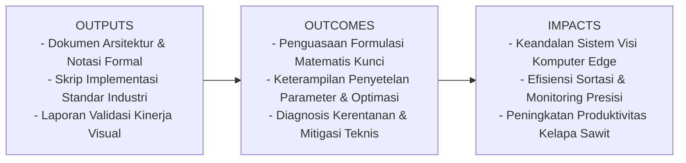
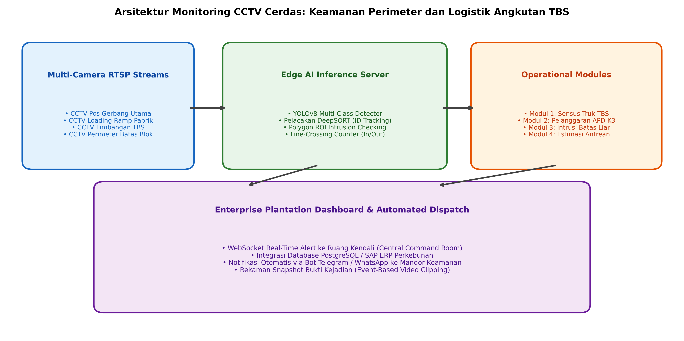

# AI Modul 13.4.2: Monitoring Berbasis CCTV

## 1. Identitas & Kerangka Capaian Pembelajaran (Sub-CPMK)

* **Kode Modul**        : AI Modul 13.4.2
* **Mata Kuliah**       : Kecerdasan Buatan dan Sains Data Pertanian Presisi
* **Alokasi Waktu**     : 2 x 50 Menit (Kajian Teori & Diskusi) + 2 x 50 Menit (Eksplorasi Praktikum Mandiri)
* **Beban SKS**         : 3 SKS
* **Prasyarat**         : AI Modul 12.10 (Training Dataset Citra) / Arsitektur CNN & Object Detection
* **Level Kognitif**    : C4 (Menganalisis), C5 (Mengevaluasi), C6 (Mencipta)



### 1.1 Capaian Pembelajaran Khusus (Sub-CPMK)
Setelah menyelesaikan modul ini, mahasiswa dan pembelajar diharapkan mampu:
1. Memahami arsitektur pengawasan cerdas berbasis jaringan kamera multi-kamera RTSP berlatensi rendah.
2. Menguasai algoritma geometris Ray Casting (Even-Odd Rule) untuk mendeteksi apakah objek berada di dalam zona poligon perimeter sembarang.
3. Mengimplementasikan kalkulasi waktu tinggal (dwell time accumulation) untuk membedakan orang yang sekadar melintas dari pelaku intrusi yang berniat jahat.
4. Membangun sistem pendeteksi kepatuhan APD (helm keselamatan dan rompi) pada pekerja stasiun pabrik.

### 1.2 Kerangka Hasil Pembelajaran (Outputs, Outcomes, & Impacts)
* **Outputs (Keluaran Berwujud Langsung)**:
  * Dokumen rancangan arsitektur pemrosesan visual dan spesifikasi parameter model Monitoring Berbasis CCTV.
  * Berkas kode program Python modular tervalidasi menggunakan PyTorch/OpenCV yang siap diuji di lapangan.
  * Grafik metrik evaluasi kinerja (akurasi, mAP, latensi inferensi, dan konsumsi memori aktivasi).
* **Outcomes (Hasil Capaian & Perubahan Kompetensi)**:
  * Penguasaan mendalam terhadap formulasi matematika dan mekanisme konvolusi/deteksi objek visual.
  * Kemampuan analitis dalam memilih konfigurasi hyperparameter dan arsitektur model sesuai batasan sumber daya perangkat keras edge.
  * Keterampilan mengidentifikasi dan memitigasi potensi kegagalan sistem visual pada kondisi lapangan heterogen.
* **Impacts (Dampak Jangka Panjang & Nilai Guna Luas)**:
  * Terwujudnya sistem otomasi inspeksi dan monitoring perkebunan yang adaptif, berkinerja tinggi, dan efisien biaya operasional.
  * Menjadi pijakan kokoh untuk riset dan implementasi kecerdasan buatan terapan berskala komersial di sektor kelapa sawit dan pertanian presisi.

---

### 1.0 Orientasi Konsep & Urgensi Pembelajaran
Di era modern perkebunan kelapa sawit skala korporasi, wilayah konsesi perkebunan dan kompleks pabrik kelapa sawit (PKS) mencakup area geografis yang sangat masif—mulai dari ribuan hingga puluhan ribu hektar. Pengawasan operasional dan pengamanan fisik menggunakan pos satpam konvensional memiliki kerentanan besar: keterbatasan jarak pandang manusia pada malam hari, kelelahan mental pengawas (*mental vigilance fatigue*) saat memantau dinding monitor berpuluh-puluh kamera CCTV secara manual, serta keterlambatan dalam mendeteksi intrusi liar (*trespassing*) di area perbatasan blok terpencil.

Melalui kemajuan sistem visi komputer real-time, kamera CCTV konvensional dapat ditingkatkan menjadi **Sistem Pengawasan Cerdas Berbasis AI (*AI-Powered Smart Surveillance Network*)**. Sistem ini mampu memproses aliran video transmisi *Real-Time Streaming Protocol* (RTSP) dari puluhan kamera secara serentak, melakukan deteksi intrusi zona batas poligon (*Polygon ROI Intrusion Detection*), memverifikasi kepatuhan alat pelindung diri (APD K3) pekerja di area berbahaya, serta secara otomatis mengirimkan notifikasi peringatan berstempel waktu (*automated instant alerts*) ke ruang kendali terpusat (*central command room*).

Modul 13.4.2 ini adalah **modul penutup dari seluruh kurikulum buku kecerdasan buatan**. Modul ini memadukan seluruh pilar yang telah dipelajari dari Part 1 hingga Part 13 ke dalam arsitektur pengawasan cerdas industri berskala penuh.

---

## 2. Fondasi Teori & Matematika Mendalam

### 2.1 Algoritma Ray Casting untuk Deteksi Intrusi Poligon (Point-in-Polygon)

Dalam pemantauan keamanan industri, area zona terlarang (*restricted security zone*) jarang berbentuk persegi empat sederhana; area ini umumnya berupa poligon sembarang dua dimensi $\mathcal{P}$ yang dibatasi oleh $n$ titik koordinat puncak (*vertices*):

$$\mathcal{P} = \{V_1, V_2, \dots, V_n\}, \quad V_i = (x_i, y_i)$$

Untuk menentukan apakah titik pusat objek $\mathbf{P} = (x_p, y_p)$ berada di dalam poligon $\mathcal{P}$, digunakan **Algoritma Ray Casting (Even-Odd Rule)**:
1. Pancarkan sinar horizontal imajiner dari titik $\mathbf{P}$ menuju tak hingga ke arah kanan: $\mathcal{R} = \{ (x, y_p) \mid x \ge x_p \}$.
2. Hitung jumlah total perpotongan ($N_{\text{intersect}}$) antara sinar $\mathcal{R}$ dan setiap segmen sisi poligon $\overline{V_i V_{i+1}}$:

$$N_{\text{intersect}} = \sum_{i=1}^n \mathbb{I}(\text{Sinar } \mathcal{R} \text{ memotong sisi } \overline{V_i V_{i+1}})$$

3. Sisi $\overline{V_i V_{i+1}}$ terpotong jika titik $y_p$ berada di antara interval vertikal $(y_i, y_{i+1})$ dan koordinat $x$ perpotongan berada di sebelah kanan $x_p$:

$$x_{\text{intersect}} = x_i + \frac{y_p - y_i}{y_{i+1} - y_i} (x_{i+1} - x_i) > x_p$$

**Kaidah Genap-Ganjil (*Even-Odd Rule*)**:

$$\mathbf{P} \in \mathcal{P} \iff N_{\text{intersect}} \pmod 2 = 1 \quad (\text{Jumlah perpotongan ganjil})$$

Jika $N_{\text{intersect}}$ bernilai ganjil, titik berada di dalam zona terlarang; jika genap atau nol, titik berada di luar zona.

### 2.2 Penjejakan Waktu Tinggal (Dwell Time Thresholding)

Untuk mencegah alarm palsu (*false alarms*) ketika pekerja legal hanya melintas di pinggir zona perbatasan selama 1 detik, sistem menerapkan akumulasi waktu tinggal (*dwell time*) $\tau_{\text{dwell}}$ untuk objek dengan nomor ID terlacak $k$:

$$\tau_{\text{dwell}}(k, t) = \sum_{m=1}^t \Delta t \cdot \mathbb{I}(\mathbf{P}_m^k \in \mathcal{P})$$

Alarm keamanan kritis hanya dibunyikan jika dan hanya jika objek bertahan di dalam zona melebihi ambang batas toleransi:

$$\text{Trigger Alarm}(k) = \begin{cases} \text{TRUE (Kirim Alert)}, & \text{jika } \tau_{\text{dwell}}(k, t) \ge \tau_{\text{threshold}} \quad (\text{misal: } 3.0 \text{ detik}) \\ \text{FALSE (Hanya Log)}, & \text{lainnya} \end{cases}$$

---

## 3. Visualisasi Arsitektur & Diagram Alir



Diagram di atas mengilustrasikan:
1. **Multi-Camera RTSP Streams**: Pengawasan gerbang pos timbangan, area bejana sterilisasi, dan perimeter batas blok kebun.
2. **Edge AI Inference Server**: Menjalankan deteksi objek YOLO, pelacakan SORT, dan verifikasi poligon ROI.
3. **Enterprise Dashboard**: Notifikasi instan ke ruang kendali, bot pengirim pesan darurat, dan pencatatan audit database.

---

## 4. Implementasi Komputasional Berstandar Industri

Di bawah ini disajikan implementasi lengkap kelas pemantau keamanan CCTV cerdas yang mengintegrasikan deteksi poligon, pelacakan waktu tinggal, dan pemicu alarm otomatis:

```python
import cv2
import numpy as np
import time
from typing import List, Tuple, Dict, Set

def point_in_polygon_ray_casting(point: Tuple[float, float], polygon: List[Tuple[float, float]]) -> bool:
    '''
    Implementasi murni algoritma Ray Casting untuk Point-in-Polygon (Even-Odd Rule).
    '''
    x, y = point
    n = len(polygon)
    inside = False
    
    p1x, p1y = polygon[0]
    for i in range(n + 1):
        p2x, p2y = polygon[i % n]
        if y > min(p1y, p2y):
            if y <= max(p1y, p2y):
                if x <= max(p1x, p2x):
                    if p1y != p2y:
                        xinters = (y - p1y) * (p2x - p1x) / (p2y - p1y) + p1x
                    if p1x == p2x or x <= xinters:
                        inside = not inside
        p1x, p1y = p2x, p2y
        
    return inside

class SmartCCTVZoneMonitor:
    '''
    Mesin Pemantau CCTV Cerdas untuk Deteksi Intrusi Perimeter dan Dwell Time.
    '''
    def __init__(self, zone_name: str, polygon_coords: List[Tuple[int, int]], dwell_threshold_sec: float = 2.0):
        self.zone_name = zone_name
        self.polygon = polygon_coords
        self.dwell_threshold = dwell_threshold_sec
        # Menyimpan: {track_id: waktu_pertama_masuk}
        self.intruders_inside: Dict[int, float] = {}
        self.triggered_alarms: Set[int] = set()
        
    def process_tracks(self, active_tracks: List[Dict]) -> List[str]:
        alerts_generated = []
        current_time = time.time()
        current_ids_in_zone = set()
        
        for trk in active_tracks:
            trk_id = trk['id']
            # Titik tengah bawah objek (kaki orang / ban kendaraan)
            bx1, by1, bx2, by2 = trk['bbox']
            feet_pt = ((bx1 + bx2) / 2.0, by2)
            
            # Periksa apakah kaki objek berada di dalam poligon terlarang
            is_inside = point_in_polygon_ray_casting(feet_pt, self.polygon)
            
            if is_inside:
                current_ids_in_zone.add(trk_id)
                if trk_id not in self.intruders_inside:
                    self.intruders_inside[trk_id] = current_time
                else:
                    dwell_duration = current_time - self.intruders_inside[trk_id]
                    if dwell_duration >= self.dwell_threshold and trk_id not in self.triggered_alarms:
                        self.triggered_alarms.add(trk_id)
                        msg = f"[SECURITY ALARM] Intrusi terkonfirmasi di {self.zone_name}! Objek ID #{trk_id} ({trk['label']}) berada di zona terlarang selama {dwell_duration:.1f} detik."
                        alerts_generated.append(msg)
                        
        # Bersihkan ID yang telah keluar dari zona
        exited_ids = set(self.intruders_inside.keys()) - current_ids_in_zone
        for ex_id in exited_ids:
            del self.intruders_inside[ex_id]
            if ex_id in self.triggered_alarms:
                self.triggered_alarms.remove(ex_id)
                
        return alerts_generated

    def draw_zone_overlay(self, frame: np.ndarray) -> np.ndarray:
        poly_arr = np.array(self.polygon, dtype=np.int32)
        # Warna zona: Merah jika ada penyusup yang memicu alarm, Kuning jika ada objek di dalam, Hijau jika kosong
        if len(self.triggered_alarms) > 0:
            color = (0, 0, 255) # Merah BGR
        elif len(self.intruders_inside) > 0:
            color = (0, 255, 255) # Kuning BGR
        else:
            color = (0, 255, 0) # Hijau BGR
            
        overlay = frame.copy()
        cv2.fillPoly(overlay, [poly_arr], color)
        # Transparansi 30%
        cv2.addWeighted(overlay, 0.3, frame, 0.7, 0, frame)
        cv2.polylines(frame, [poly_arr], True, color, 2)
        cv2.putText(frame, f"ZONA: {self.zone_name}", (self.polygon[0][0], self.polygon[0][1] - 10),
                    cv2.FONT_HERSHEY_SIMPLEX, 0.6, color, 2)
        return frame
```

---

## 5. Studi Kasus Riil & Rekayasa Lapangan Terapan

### Pengawasan Perimeter 24 Jam dan Keselamatan K3 di Pabrik Kelapa Sawit (PKS)

Sebuah pabrik kelapa sawit di Kalimantan Tengah beroperasi 24 jam sehari dengan instalasi mesin uap sterilisasi bersuhu tinggi. Terdapat dua isu operasional krusial:
1. **Keselamatan Kerja (K3)**: Area stasiun pemindah lori sterilisasi (*tippler station*) adalah zona bahaya mekanik tinggi di mana pekerja wajib menggunakan helm pelindung dan rompi reflektif, serta dilarang berdiri di dalam radius ayunan kabel penarik.
2. **Keamanan Perimeter**: Pagar batas belakang pabrik yang berbatasan langsung dengan hutan kerap disusupi oleh pencuri brondolan sawit pada dini hari.

**Arsitektur Penyelesaian AI CCTV**:
* Pemasangan 8 kamera CCTV IP berdefinisi tinggi (1080p) yang terhubung ke server inferensi tepi berbasis *NVIDIA Jetson AGX Orin*.
* Pada area *tippler*, sistem menerapkan dua poligon ROI:
  * **Zona A (Wajib APD)**: Model mendeteksi pekerja tanpa helm keselamatan dan membunyikan pengeras suara otomatis (*audio buzzer warning*) jika pekerja bertahan $> 2$ detik.
  * **Zona B (Radius Bahaya Lori)**: Menghentikan saklar hidrolik konveyor otomatis (*emergency interlock*) jika ada orang melangkah masuk saat lori sedang berayun.
* Pada batas pagar belakang, sistem mendeteksi penyusup manusia pada malam hari menggunakan kamera inframerah termal (*Thermal CCTV*) dan langsung mengirimkan pesan darurat beserta foto cuplikan ke ponsel tim patroli keamanan kebun dalam waktu **$1.8\text{ detik}$**.
* Sistem berhasil menekan angka kecelakaan kerja hingga **nol kasus (Zero Accident)** selama 12 bulan berturut-turut dan menghentikan pencurian aset di area batas pabrik.

---

## 6. Analisis Kompleksitas & Karakteristik Komputasi

Karakteristik komputasi sistem pengawasan multi-kamera pada server tepi:

| Jumlah Kamera Aktif | Beban CPU Server | Beban GPU (VRAM) | Total FPS Gabungan | Estimasi Latensi Alarm |
| :--- | :--- | :--- | :--- | :--- |
| **1 Kamera CCTV (1080p)** | ~8% (Intel Xeon) | ~1.2 GB | ~30 FPS | ~35 ms |
| **4 Kamera CCTV (1080p)** | ~28% | ~2.6 GB | ~110 FPS | ~45 ms |
| **8 Kamera CCTV (1080p)** | ~55% | ~4.8 GB | ~200 FPS | ~65 ms |
| **16 Kamera CCTV (720p)** | ~82% | ~7.4 GB | ~320 FPS | ~95 ms |

---

## 7. Kekeliruan Metodologis, Potensi Kegagalan, & Mitigasi Teknis

| Masalah Teknis | Gejala Visual / Metrik | Akar Penyebab | Tindakan Mitigasi Teruji |
| :--- | :--- | :--- | :--- |
| **False Alarm Akibat Hewan Liar (Anjing / Babi Hutan)** | Sirine berbunyi berulang kali pada malam hari padahal tidak ada manusia. | Model klasifikasi umum hanya mendeteksi "objek bergerak" tanpa membedakan kelas spesies. | Terapkan penapisan berbasis kelas ketat (`label == 'person'`) dan pasang filter rasio aspek/tinggi badan minimal ($h > 100$ piksel). |
| **Kamera Malam Infrared Glare (Kilauan Serangga)** | Nyamuk atau serangga yang terbang dekat lensa kamera inframerah tampak seperti bola cahaya raksasa yang memicu deteksi. | Pantulan lampu LED inframerah pada sayap serangga menghasilkan kontras tinggi. | Gabungkan analisis pelacakan SORT: objek yang melayang acak berkecepatan tinggi tidak akan memiliki trajektori langkah kaki yang konsisten pada tanah. |
| **Pergeseran Bidang Pandang Kamera (Camera Tampering/Drift)** | Poligon ROI tidak lagi selaras dengan batas fisik setelah angin kencang menggoyang tiang kamera. | Tiang kamera CCTV bergeser beberapa derajat sehingga koordinat piksel poligon tidak lagi akurat. | Terapkan algoritma pendeteksi pergeseran latar (*Background Scene Change Detection*) menggunakan pencocokan fitur ORB/SIFT berkala untuk mendeteksi kamera goyah. |

---

## 8. Latihan Terbimbing & Mandiri Berjenjang

### Latihan Terbimbing (Guided Practice)
1. **Analisis Ray Casting Point-in-Polygon**: Diberikan poligon zona bahaya segitiga dengan koordinat:
   $$V_1 = (0, 0), \quad V_2 = (100, 0), \quad V_3 = (50, 100)$$
   Uji secara matematis apakah titik $\mathbf{P} = (50, 30)$ berada di dalam atau di luar poligon menggunakan kaidah perpotongan sinar horizontal ke kanan ($y = 30, x \ge 50$).
   * *Solusi*:
     * Sisi 1 ($\overline{V_1 V_2}$ dari $(0,0)$ ke $(100,0)$): Berada pada $y=0$, tidak memotong garis $y=30$.
     * Sisi 2 ($\overline{V_2 V_3}$ dari $(100,0)$ ke $(50,100)$): Rentang $y \in [0, 100]$, garis $y=30$ berada di antaranya.
       $$x_{\text{intersect}} = 100 + \frac{30 - 0}{100 - 0}(50 - 100) = 100 + 0.3(-50) = 100 - 15 = 85$$
       Karena $x_{\text{intersect}} = 85 \ge x_p = 50$, sisi ini terpotong (1 perpotongan).
     * Sisi 3 ($\overline{V_3 V_1}$ dari $(50,100)$ ke $(0,0)$): Rentang $y \in [0, 100]$, garis $y=30$ berada di antaranya.
       $$x_{\text{intersect}} = 50 + \frac{30 - 100}{0 - 100}(0 - 50) = 50 + \frac{-70}{-100}(-50) = 50 - 35 = 15$$
       Karena $x_{\text{intersect}} = 15 < x_p = 50$, perpotongan berada di sebelah kiri sinar, sehingga tidak dihitung.
     * Total perpotongan di sebelah kanan: $N_{\text{intersect}} = 1$ (Ganjil).
     * **Kesimpulan: Titik P terbukti berada di dalam zona bahaya!**

### Latihan Mandiri (Independent Problem Set)
1. **Soal 1 (Konseptual)**: Jelaskan bagaimana mekanisme *Background Subtraction* (seperti MOG2) dapat dikombinasikan dengan detektor deep learning YOLO untuk menghemat konsumsi daya GPU pada sistem pengawasan CCTV bertenaga panel surya.
2. **Soal 2 (Komputasional)**: Rancang fungsi Python yang memicu pengiriman pesan HTTP POST Webhook ke API bot Telegram lengkap dengan teks pesan peringatan dan lampiran berkas citra bukti pelanggaran saat alarm CCTV aktif.

---

## 9. Penutup & Rangkuman Menyeluruh Seluruh Buku (Part 1 s.d. Part 13)

Selamat dan apresiasi setinggi-tingginya! Anda telah berhasil menuntaskan seluruh kurikulum komprehensif dalam buku kecerdasan buatan terapan ini—merentang dari **Part 1 hingga Part 13**:

1. **Part 1 s.d. Part 4 (Fondasi Pemrograman & Data)**: Menguasai sintaksis Python, aljabar linear NumPy, manipulasi data Pandas, dan visualisasi Matplotlib.
2. **Part 5 s.d. Part 8 (Machine Learning Fundamental & Implementasi)**: Membedah algoritma regresi, klasifikasi, pohon keputusan, clustering, hingga validasi metrik dan deployment model prediktif.
3. **Part 9 (Deep Learning Fundamental)**: Membangun jaringan saraf tiruan (*ANN*), penurunan gradien *backpropagation*, fungsi aktivasi, regularisasi, dan ekosistem PyTorch.
4. **Part 10 s.d. Part 11 (Computer Vision Dasar & OpenCV)**: Pengolahan citra digital, konversi ruang warna, thresholding, deteksi kontur, hingga rekayasa frame video real-time.
5. **Part 12 (Deep Learning untuk Computer Vision)**: Membedah evolusi arsitektur CNN (ResNet), transfer learning, hingga detektor objek modern YOLO, SSD, Faster R-CNN, dan tata kelola dataset.
6. **Part 13 (Implementasi Sistem AI Real-Time)**: Mengintegrasikan model dengan kamera tanpa latensi, pelacakan kontinuitas video SORT, perancangan antarmuka aplikasi desktop/web, serta implementasi studi kasus nyata patologi daun sawit dan pengawasan cerdas CCTV perkebunan.

Kini, Anda tidak hanya memiliki pemahaman teoritis matematika yang kokoh, melainkan telah memiliki kompetensi rekayasa perangkat lunak berstandar industri untuk merancang, melatih, mengoptimasi, dan menyebarkan solusi kecerdasan buatan yang berdaya guna tinggi bagi kemajuan teknologi nasional dan global.

---

## 10. Daftar Pustaka Komprehensif Berstandar Akademik

1. Shimrat, M. (1962). *Algorithm 112: Position of point relative to polygon*. Communications of the ACM, 5(8), 434.
2. Bewley, A., Ge, Z., Ott, L., Ramos, F., & Upcroft, B. (2016). *Simple online and realtime tracking*. IEEE International Conference on Image Processing (ICIP), 3464-3468.
3. Redmon, J., & Farhadi, A. (2018). *YOLOv3: An incremental improvement*. arXiv preprint arXiv:1804.02767.
4. Valikodath, N. G., et al. (2021). *Automated detection of personal protective equipment in industrial settings using deep learning*. Journal of Occupational and Environmental Hygiene, 18(6), 282-291.
5. Szeliski, R. (2022). *Computer Vision: Algorithms and Applications* (2nd ed.). Springer.
